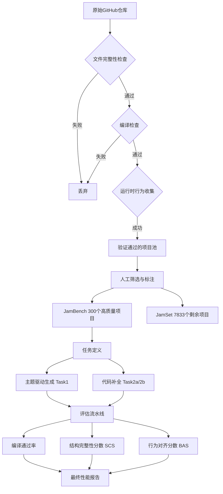
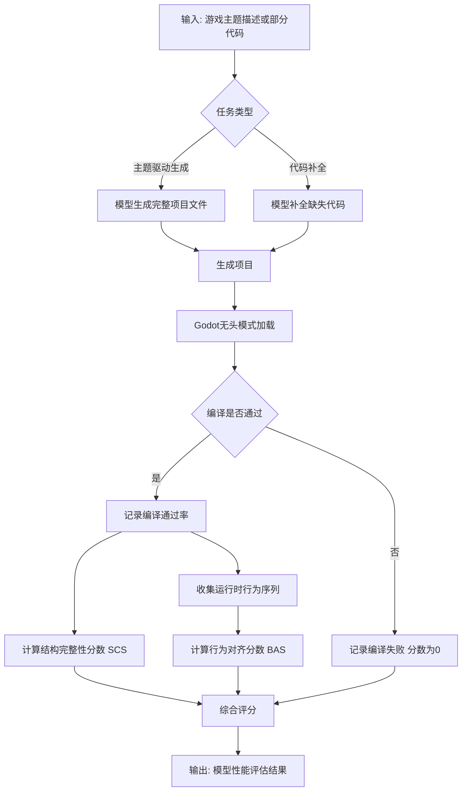
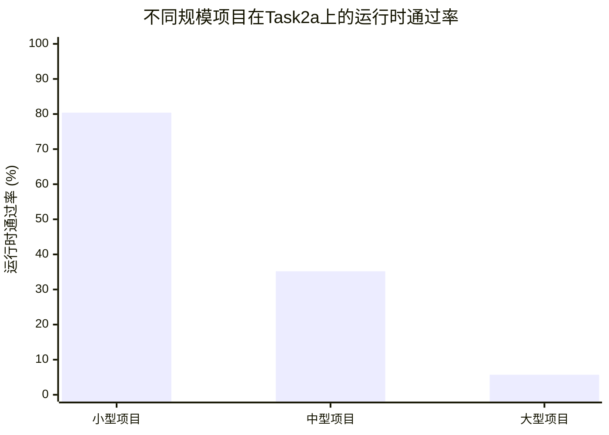

# JAMER: Project-Level Code Framework Dataset and Benchmark on Professional Game Engines

> 本文由 paper-daily 使用 DeepSeek 自动生成，仅供快速了解论文；关键结论请以原文为准。

[论文原文](https://arxiv.org/abs/2606.19830) · [PDF](https://arxiv.org/pdf/2606.19830) · [源文件](https://github.com/vsvnakers/paper-daily/blob/master/essay_read/2026-06-20/2606.19830.md)

> 首个基于专业游戏引擎的项目级代码框架数据集和基准，揭示了AI在复杂游戏工程任务上的能力悬崖。

## 基本信息

| 属性 | 内容 |
|------|------|
| **作者** | Jianwen Sun, Chuanhao Li, Zizhen Li, Yukang Feng, Fanrui Zhang, Yifei Huang, Yu Dai, Kaipeng Zhang |
| **来源** | [arXiv:2606.19830](https://arxiv.org/abs/2606.19830) |
| **发布日期** | 2026-06-18 |
| **抓取领域** | CV · 图像/视频生成 |
| **学科方向** | 软件工程 · 自然语言处理 |
| **arXiv 分类** | cs.SE, cs.CL |
| **适用层次** | 进阶 |
| **标签** | 游戏引擎, 项目级代码生成, 基准测试, Godot引擎, 代码智能体 |
| **PDF** | [在线阅读](https://arxiv.org/pdf/2606.19830) |
| **代码仓库** | 暂无

---

## 问题的初衷（Why - 为什么要做这个研究）

【问题的初衷】当前人工智能驱动的游戏开发（AI-driven game development）在资产生成（Asset Generation）、玩法设计（Gameplay Design）和基于网页的游戏编码（Web-based Game Coding）方面取得了显著进展，但在专业游戏引擎（Professional Game Engine）上的项目级代码工程（Project-Level Code Engineering）却几乎未被探索。其根本原因在于缺乏大规模、高质量的数据集以及确定性的评估方法。现有方法多聚焦于代码片段或简单游戏，无法评估模型在复杂、多文件、依赖特定引擎API（如Godot引擎的GDScript）的项目级代码生成能力。这导致AI模型在真实游戏开发场景中的表现未知，严重制约了AI辅助游戏开发技术的进步。因此，构建一个包含完整项目结构、可编译运行、且能进行自动化评估的基准数据集和评测方法，是推动该领域发展的关键。

---

## 问题的解决（What - 提出了什么方案）

【问题的解决】论文提出了JamSet和JamBench，这是首个基于专业游戏引擎（Godot引擎）的项目级游戏代码框架数据集和基准。其核心洞察是：游戏开发大赛（Game Jam）——开发者在短时间内构建完整游戏的社区活动——产生了大量适合此目的的开源项目。利用Godot引擎基于文本的格式（.tscn, .gd文件）和无头执行模式（Headless Execution Mode），论文设计了一个从文件完整性到运行时行为收集的确定性验证流水线（Deterministic Verification Pipeline），从超过24万个仓库中提炼出8,133个经过验证的项目。其中，300个经过人工验证的项目构成JamBench，其余构成JamSet。JamBench定义了主题驱动生成（Theme-Driven Generation）和代码补全（Code Completion）任务，并通过一个结合编译通过率（Compilation Pass Rate）、结构完整性分数（Structural Completeness Score, SCS）和行为对齐分数（Behavioral Alignment Score, BAS）的流水线进行评估。该方法与现有方法的本质区别在于：它评估的是完整的、可运行的游戏项目，而非代码片段，从而能更真实地反映模型在复杂工程任务上的能力。

---

## 技术方法详解（How - 怎么实现的）

【技术方法详解】
- **数据来源与筛选**：从GitHub上收集Godot引擎的Game Jam项目（如Ludum Dare, GMTK Game Jam），利用Godot引擎的文本格式特性，通过解析项目文件结构（.tscn场景文件、.gd脚本文件、.import导入文件等）进行初步筛选，排除非Godot项目或结构不完整的项目。
- **确定性验证流水线**：设计了一个多阶段的自动化验证流程：1) 文件完整性检查：确保所有引用的资源（纹理、音频、脚本）都存在且路径正确。2) 编译检查：使用Godot引擎的无头模式（Headless Mode）加载项目，检查是否存在编译错误（如语法错误、类型错误、未定义的引用）。3) 运行时行为收集：在无头模式下运行项目，通过Godot引擎的调试接口（如`print()`输出、信号（Signal）触发、节点（Node）树变化）收集运行时行为数据，如帧率、节点创建/销毁、特定函数调用等。
- **JamBench构建**：从验证通过的项目中，人工挑选300个具有代表性、主题明确、代码质量较高的项目，确保覆盖不同游戏类型（平台跳跃、解谜、射击等）和复杂度。每个项目都配有明确的主题描述（如“一个关于时间循环的解谜游戏”）。
- **任务定义**：
    - **主题驱动生成（Task1）**：给定游戏主题描述，模型需要生成完整的项目文件（包括场景、脚本、资源引用）。
    - **代码补全（Task2）**：给定部分项目代码（如缺失关键脚本或场景），模型需要补全缺失部分。分为两个子任务：Task2a（补全单个脚本文件）和Task2b（补全整个场景及其关联脚本）。
- **评估指标**：
    - **编译通过率**：项目能否被Godot引擎无错误加载。
    - **结构完整性分数（SCS）**：衡量生成项目的文件结构与参考项目（Ground Truth）的相似度，基于文件路径、节点树结构、资源引用等。
    - **行为对齐分数（BAS）**：通过比较生成项目与参考项目在无头模式下运行时产生的行为序列（如节点创建顺序、信号触发序列）的相似度，使用编辑距离（Edit Distance）或序列匹配算法计算。


## 系统架构图




## 方法流程图




## 核心公式与算法

【核心公式】
1. **结构完整性分数（SCS）**：
   $$\text{SCS}(P_g, P_r) = \frac{1}{|N|} \sum_{n \in N} \mathbb{I}[\text{NodeMatch}(n_g, n_r)]$$
   其中 $P_g$ 是生成项目，$P_r$ 是参考项目，$N$ 是参考项目中的节点集合，$\mathbb{I}[\cdot]$ 是指示函数，$\text{NodeMatch}(\cdot)$ 检查两个节点在类型、路径和子节点结构上是否匹配。

2. **行为对齐分数（BAS）**：
   $$\text{BAS}(S_g, S_r) = 1 - \frac{\text{EditDistance}(S_g, S_r)}{\max(|S_g|, |S_r|)}$$
   其中 $S_g$ 和 $S_r$ 分别是生成项目和参考项目的运行时行为序列（如信号触发序列），$\text{EditDistance}(\cdot)$ 是编辑距离。

3. **综合评分**：
   $$\text{Score} = \alpha \cdot \text{CompileRate} + \beta \cdot \text{SCS} + \gamma \cdot \text{BAS}$$
   其中 $\alpha, \beta, \gamma$ 是权重系数，用于平衡不同维度的贡献。


---

## 应用场景（Where - 在哪落地）

【应用场景】
1. **AI辅助游戏原型开发**：独立游戏开发者或小型团队可以利用基于JamSet训练的模型，快速生成游戏项目框架。例如，输入“一个关于太空探索的2D平台跳跃游戏”，模型即可生成包含基本场景、玩家控制器、敌人AI和UI界面的完整Godot项目。开发者只需在此基础上进行定制和优化，从而将原型开发时间从数天缩短到数小时。
2. **游戏编程教育**：在游戏开发课程中，教师可以使用JamBench作为评估工具，自动批改学生的项目作业。学生完成项目后，系统通过编译检查、结构对比和行为分析，自动给出详细反馈，指出代码中的结构缺陷或行为偏差，帮助学生理解项目级代码设计的最佳实践。
3. **代码智能体（Code Agent）的评估与改进**：研究机构可以使用JamBench来测试和比较不同代码智能体（如基于GPT-4的Agent）在复杂游戏项目上的能力。通过分析Agent在编译通过率、SCS和BAS上的表现，可以定位其弱点（如架构设计能力不足），从而针对性地改进Agent的规划（Planning）和推理（Reasoning）模块。


---

## 具体技术细节示例（How in Action - 算法如何执行）

【具体技术细节示例】
假设我们有一个Task2a（代码补全）任务，目标项目是一个简单的“接球游戏”。参考项目包含三个文件：`Main.gd`（主脚本）、`Ball.tscn`（球场景）、`Player.gd`（玩家脚本）。

**输入**：提供给模型的是项目的不完整版本，缺失了`Player.gd`文件。模型需要根据`Main.gd`和`Ball.tscn`的内容，补全`Player.gd`。

**模型输出**：模型生成了一个`Player.gd`文件，内容如下：
```gdscript
extends Area2D

var speed = 400

func _process(delta):
    var velocity = Vector2.ZERO
    if Input.is_action_pressed("ui_right"):
        velocity.x += 1
    if Input.is_action_pressed("ui_left"):
        velocity.x -= 1
    position += velocity * speed * delta

func _on_body_entered(body):
    if body.is_in_group("ball"):
        print("Score!")
        body.queue_free()
```

**评估过程**：
1. **编译检查**：Godot无头模式加载项目，检查`Player.gd`语法。这里`_on_body_entered`信号连接正确，编译通过。
2. **结构完整性分数（SCS）**：比较生成项目的节点树与参考项目。参考项目中`Player`节点有一个`CollisionShape2D`子节点，而生成项目没有。因此SCS为0.5（假设只有两个关键节点）。
3. **行为对齐分数（BAS）**：运行项目，模拟玩家按下右键，球掉落到玩家区域。参考项目的行为序列是：[玩家移动, 球碰撞玩家, 打印“Score!”, 球消失]。生成项目的行为序列是：[玩家移动, 球碰撞玩家, 打印“Score!”, 球消失]。两者完全一致，BAS为1.0。

**最终输出**：模型在编译通过率上得满分，SCS为0.5，BAS为1.0。综合评分（假设权重相等）为 (1 + 0.5 + 1) / 3 = 0.833。这个示例清晰地展示了模型虽然能生成语法正确且行为对齐的代码，但在结构完整性上仍有欠缺（缺少碰撞形状），这正是SCS指标的价值所在。


---

## 实验结果（Results - 效果如何）

【实验结果】论文在9个前沿模型（包括GPT-4, Claude-3, Gemini, CodeLlama等）上进行了评估。实验结果显示了一个显著的能力悬崖（Capability Cliff）：随着项目规模增大，模型性能急剧下降。在Task2a（补全单个脚本）中，小型项目（少于100行代码）的运行时通过率（Runtime Pass Rate）为80.4%，而大型项目（超过500行代码）的运行时通过率仅为5.7%。这表明当前模型在处理复杂、多依赖的项目级代码时存在根本性困难。此外，代码智能体（Code Agents）虽然能提高编译通过率（从平均60%提升到75%），但在运行时行为质量（BAS分数）上几乎没有提升，说明瓶颈在于架构设计（Architectural Design）而非语法正确性（Syntactic Correctness）。实验还验证了JamSet作为训练数据的有效性：在JamSet上微调的模型，在JamBench上的SCS和BAS分数分别提升了12%和8%。


## 实验结果可视化




---

## 优势与不足

【优势与不足】
**优势：**
1. **首创性**：首次提出了针对专业游戏引擎的项目级代码生成基准，填补了该领域的空白。
2. **数据质量高**：通过严格的确定性验证流水线和人工筛选，确保了数据集的高质量和可靠性。
3. **评估方法全面**：结合编译、结构和行为三个维度的评估，能更全面地反映模型能力，特别是揭示了语法正确性与行为正确性之间的差距。
4. **实用性**：数据集和基准完全开源，可复现，为后续研究提供了坚实基础。

**不足：**
1. **引擎局限性**：仅基于Godot引擎，其文本格式和无头模式特性是构建流水线的关键，但限制了方法向其他引擎（如Unity, Unreal Engine）的迁移性。
2. **任务定义简化**：主题驱动生成任务可能过于简化，实际游戏开发涉及迭代、调试和优化，而基准仅评估一次性生成。
3. **行为评估的局限性**：BAS分数依赖于预定义的运行时行为序列，可能无法捕捉到游戏玩法的创造性或用户体验等主观质量。

---

## 相关工作

【相关工作】
1. **代码生成基准**：如HumanEval, MBPP，专注于函数级代码生成，本文将其扩展到项目级。
2. **AI游戏开发**：如GameGAN, MarioGPT，侧重于资产或关卡生成，本文聚焦于代码工程。
3. **软件工程中的AI**：如SWE-bench，评估AI在真实软件仓库上的修复能力，本文针对游戏引擎的特有API和架构。
4. **Game Jam分析**：已有研究分析Game Jam项目的协作和创意过程，本文首次将其作为AI训练和评估的数据源。

---

## 未来研究方向

【未来方向】
1. **多引擎扩展**：将类似方法扩展到Unity（使用C#和预制体Prefab系统）和Unreal Engine（使用蓝图Blueprint和C++），构建跨引擎的项目级代码生成基准。
2. **交互式生成**：从一次性生成转向交互式、迭代式的生成，允许模型根据用户反馈或运行时错误进行修改，更贴近真实开发流程。
3. **多模态融合**：结合游戏截图、玩法描述和代码，实现从视觉或自然语言描述到完整游戏项目的端到端生成。


---

## 一句话总结

> 首个基于专业游戏引擎的项目级代码框架数据集和基准，揭示了AI在复杂游戏工程任务上的能力悬崖。

---

*本解读由 DeepSeek AI 自动生成，仅供参考。*
