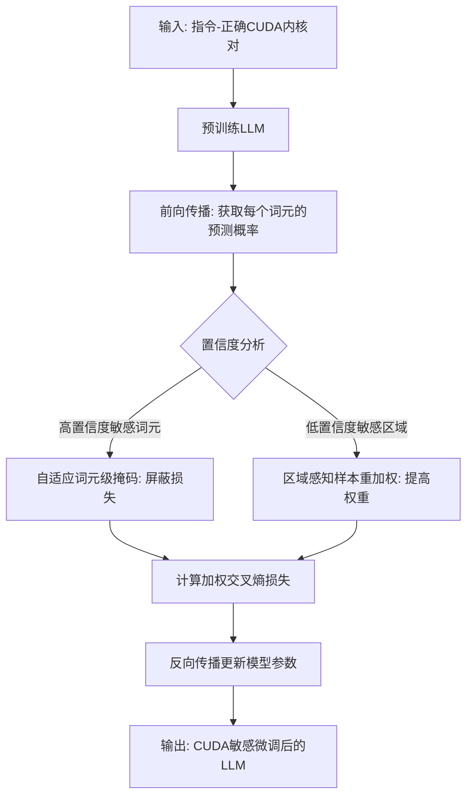
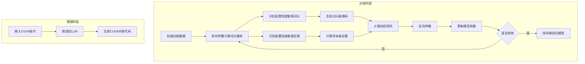

# From Tokens to Regions: CUDA-Sensitive Instruction Tuning for GPU Kernel Generation

> 本文由 paper-daily 使用 DeepSeek 自动生成，仅供快速了解论文；关键结论请以原文为准。

[论文原文](https://arxiv.org/abs/2606.16231) · [PDF](https://arxiv.org/pdf/2606.16231) · [源文件](https://github.com/vsvnakers/paper-daily/blob/master/essay_read/2026-06-21/2606.16231.md)

> CuSeT通过分析模型置信度，以低成本的自适应掩码和重加权方法，精准提升LLM生成CUDA内核的正确性。

## 基本信息

| 属性 | 内容 |
|------|------|
| **作者** | Wentao Chen, Jiace Zhu, Xing Zhe Chai, Zeng Qu, Qiaoling Xiao, Liucheng Duan, An Zou |
| **来源** | [arXiv:2606.16231](https://arxiv.org/abs/2606.16231) |
| **发布日期** | 2026-06-15 |
| **抓取领域** | GPU算子/编译优化 |
| **学科方向** | 机器学习 · 人工智能 |
| **arXiv 分类** | cs.LG, cs.AI |
| **适用层次** | 进阶 |
| **标签** | CUDA内核生成, 指令微调, 模型置信度, 自适应掩码, GPU优化 |
| **PDF** | [在线阅读](https://arxiv.org/pdf/2606.16231) |
| **代码仓库** | 暂无

---

## 问题的初衷（Why - 为什么要做这个研究）

【问题的初衷】这篇论文旨在解决大型语言模型（Large Language Models, LLMs）在生成高性能CUDA内核时面临的挑战。CUDA内核是驱动现代人工智能（AI）系统（如深度学习框架）的关键底层代码，其性能直接影响AI应用的效率和可扩展性。然而，CUDA内核的编写极其复杂，需要开发者深刻理解GPU硬件架构（如线程束调度、共享内存层次结构）和严格的执行约束（如内存对齐、同步屏障、寄存器压力）。现有方法存在明显不足：基于智能体（Agentic）或强化学习（Reinforcement Learning, RL）的流水线虽然能探索更优的代码，但计算成本高昂，难以大规模应用；而标准的监督微调（Supervised Fine-Tuning, SFT）方法虽然简单，但其训练目标（如交叉熵损失）是全局的，无法显式地建模CUDA代码中与执行约束紧密耦合的“敏感”部分（即CUDA Sensitivity）。这些敏感部分，例如一个错误的同步指令或不当的共享内存索引，即使只占代码的极小部分，也可能导致整个内核执行失败或性能急剧下降。因此，如何以低成本的方式，让LLM在微调过程中学会识别并正确处理这些关键敏感区域，是提升CUDA内核生成正确性的核心问题。研究的动机是探索一种既高效又有效的后训练方法，在不引入复杂流水线或高昂计算开销的前提下，显著提升LLM生成符合硬件约束的CUDA内核的能力。

---

## 问题的解决（What - 提出了什么方案）

【问题的解决】论文提出了一种名为CuSeT（CUDA-Sensitive Instruction Tuning）的低成本后训练方法，其核心思路是“从词元到区域”（From Tokens to Regions）。该方法基于一个关键发现：CUDA敏感性的表现形式在词元（Token）和区域（Region）两个层面上有所不同。通过分析LLM在生成CUDA代码时的置信度模式，论文发现大多数CUDA敏感词元（即与执行约束紧密相关的代码片段）被模型以高置信度预测，而一小部分低置信度的敏感词元则聚集成区域，这些区域对应着执行关键结构（如循环边界、同步点）。基于此，CuSeT的创新点在于：1）自适应词元级掩码（Adaptive Token-level Masking）：在训练过程中，动态地识别并屏蔽那些被模型高置信度预测的CUDA敏感词元，迫使模型更多地关注那些低置信度、更易出错的部分，从而提升对关键细节的把握。2）区域感知样本重加权（Region-aware Sample Reweighting）：对于包含低置信度敏感区域的样本，赋予更高的训练权重，引导模型优先学习这些执行关键的结构。与现有方法的本质区别在于，CuSeT不是通过复杂的搜索或强化学习来探索代码空间，也不是对所有词元一视同仁地优化，而是通过分析模型自身的置信度信号，精准定位并差异化处理CUDA代码中的敏感部分，从而在简单的SFT框架内实现了对CUDA敏感性的显式建模，大幅提升了训练效率和生成正确性。

---

## 技术方法详解（How - 怎么实现的）

【技术方法详解】
- **CUDA敏感性分析**：首先，论文通过大量实验分析LLM在生成CUDA内核时的词元置信度模式。定义CUDA敏感词元为那些与执行约束（如线程索引、共享内存地址、同步指令）相关的词元。研究发现，这些敏感词元在模型输出概率上呈现出双峰分布：大部分（约80%）被模型以高置信度预测，而小部分（约20%）则以低置信度预测。这些低置信度敏感词元在代码中往往形成连续的“敏感区域”，对应着如循环边界、条件分支、同步屏障等关键结构。
- **自适应词元级掩码（Adaptive Token-level Masking）**：在SFT的损失计算阶段，CuSeT引入一个掩码机制。对于每个训练样本，首先通过前向传播获取模型对每个词元的预测概率。然后，根据一个动态阈值，识别出高置信度的CUDA敏感词元（例如，概率大于0.9）。在计算交叉熵损失时，这些高置信度敏感词元的损失贡献被屏蔽（即权重设为0）。这迫使模型在反向传播时，梯度主要流向那些低置信度或非敏感的词元，从而让模型更专注于学习其薄弱环节。
- **区域感知样本重加权（Region-aware Sample Reweighting）**：在样本级别，CuSeT根据样本中包含的低置信度敏感区域的数量和长度，计算一个样本权重。具体地，如果一个样本包含多个或较长的低置信度敏感区域，其权重会更高。这个权重被乘到该样本的总损失上，使得训练过程更加关注那些包含复杂或易错执行结构的样本。
- **训练流程**：CuSeT的训练流程是：1）使用标准SFT数据（指令-正确CUDA内核对）对预训练LLM进行初步微调。2）在微调过程中，对每个批次的数据，执行前向传播，计算每个词元的置信度。3）根据置信度，应用自适应词元级掩码和区域感知样本重加权，计算最终的损失。4）反向传播更新模型参数。整个过程无需额外的标注或搜索，成本与标准SFT相当。
- **关键公式**：CuSeT的损失函数可以表示为：$L_{CuSeT} = \frac{1}{N} \sum_{i=1}^{N} w_i \cdot \left( - \sum_{t \in T_i} m_{i,t} \cdot \log p(y_{i,t} | x_i, y_{i,<t}) \right)$，其中 $N$ 是样本数，$w_i$ 是样本 $i$ 的区域感知权重，$T_i$ 是样本 $i$ 的词元序列，$m_{i,t}$ 是词元 $t$ 的自适应掩码（0表示屏蔽，1表示保留），$p(y_{i,t} | ...)$ 是模型预测概率。


## 系统架构图




## 方法流程图




## 核心公式与算法

【核心公式】
1. **CuSeT损失函数**：$$L_{CuSeT} = \frac{1}{N} \sum_{i=1}^{N} w_i \cdot \left( - \sum_{t \in T_i} m_{i,t} \cdot \log p(y_{i,t} | x_i, y_{i,<t}) \right)$$
   其中，$N$ 是批次中的样本数，$w_i$ 是样本 $i$ 的区域感知权重，$T_i$ 是样本 $i$ 的词元序列，$m_{i,t} \in \{0, 1\}$ 是词元 $t$ 的自适应掩码（1表示保留损失，0表示屏蔽），$p(y_{i,t} | ...)$ 是模型预测第 $t$ 个词元为正确词元 $y_{i,t}$ 的概率。该公式统一了词元级掩码和样本级重加权。
2. **自适应掩码定义**：$$m_{i,t} = \begin{cases} 0, & \text{if } \text{Token}_{i,t} \in \text{HighConfSensitive} \\ 1, & \text{otherwise} \end{cases}$$
   其中，$\text{HighConfSensitive}$ 是那些既是CUDA敏感词元，且模型对其预测概率高于阈值 $\tau$（如0.9）的词元集合。该公式实现了对高置信度敏感词元的损失屏蔽。
3. **样本权重定义**：$$w_i = 1 + \alpha \cdot \text{len}(\text{LowConfRegion}_i)$$
   其中，$\text{LowConfRegion}_i$ 是样本 $i$ 中所有低置信度敏感区域的集合，$\text{len}(\cdot)$ 计算这些区域的总长度（词元数），$\alpha$ 是一个超参数，控制重加权的强度。该公式使得包含更多低置信度敏感区域的样本获得更高的训练权重。


---

## 应用场景（Where - 在哪落地）

【应用场景】
1. **深度学习框架的算子库开发**：在PyTorch、TensorFlow等框架中，许多核心算子（如FlashAttention、LayerNorm）都需要手写高性能CUDA内核。开发者可以使用CuSeT微调后的LLM，根据算子描述（如“实现一个支持mask的softmax函数”）直接生成候选内核代码。这能极大加速算子库的开发迭代，减少人工编写和调试时间。预期效果是，生成的代码在首次尝试时就有更高的概率通过编译和正确性测试，从而将开发周期从数天缩短到数小时。
2. **科学计算与高性能计算（HPC）**：在分子动力学模拟、气候建模等HPC领域，经常需要针对特定硬件（如NVIDIA GPU）优化核心计算循环。研究人员可以输入描述计算逻辑的自然语言指令，利用CuSeT微调模型生成针对性的CUDA内核。例如，生成一个优化的矩阵乘法或粒子相互作用核。预期效果是，生成的代码能自动利用共享内存、向量化加载等优化技术，达到接近手写优化的性能，降低HPC应用的开发门槛。
3. **自动化GPU编程教育与代码审查**：在CUDA编程教学中，学生编写的代码常包含同步错误、内存越界等敏感问题。CuSeT微调后的模型可以作为智能辅导工具，不仅生成正确代码示例，还能在代码审查中高亮显示潜在的CUDA敏感区域（如不正确的`__syncthreads()`使用），并给出修改建议。这能帮助学生快速理解CUDA的执行约束，提升学习效率。


---

## 具体技术细节示例（How in Action - 算法如何执行）

【具体技术细节示例】
假设我们有一个简单的CUDA内核生成任务，指令是：“编写一个CUDA内核，将两个长度为N的向量相加，使用共享内存来合并全局内存访问。”正确的内核代码片段为：`__global__ void vecAdd(float *A, float *B, float *C, int N) { __shared__ float sA[256]; int idx = blockIdx.x * blockDim.x + threadIdx.x; if (idx < N) { sA[threadIdx.x] = A[idx]; __syncthreads(); C[idx] = sA[threadIdx.x] + B[idx]; } }`。

**步骤1：前向传播与置信度分析**。将上述指令和正确代码输入到一个经过初步SFT的LLM（如Llama-2-7B）中。模型对每个词元输出一个概率。例如，对于词元`__syncthreads()`，模型可能以0.95的高置信度预测；对于词元`blockIdx.x`，可能以0.6的中等置信度预测；对于词元`sA[threadIdx.x]`（在赋值语句中），可能以0.85的高置信度预测。

**步骤2：识别高置信度敏感词元**。设定阈值 $\tau=0.9$。那么，`__syncthreads()`（0.95 > 0.9）被识别为高置信度敏感词元。`sA[threadIdx.x]`（0.85 < 0.9）不被视为高置信度。

**步骤3：识别低置信度敏感区域**。假设模型对`blockIdx.x`（0.6）和紧随其后的`blockDim.x`（0.55）以及`threadIdx.x`（0.65）都给出了较低的置信度，且这些词元在代码中连续出现，形成一个区域。这个区域（`blockIdx.x * blockDim.x + threadIdx.x`）被识别为一个低置信度敏感区域，因为它涉及线程索引计算，是CUDA执行的关键。

**步骤4：应用自适应掩码**。在计算损失时，高置信度敏感词元`__syncthreads()`的损失贡献被屏蔽（$m=0$）。这意味着模型不会因为已经“掌握”了这个同步指令而获得梯度更新。

**步骤5：计算样本权重**。该样本包含一个长度为3的低置信度敏感区域（`blockIdx.x`、`blockDim.x`、`threadIdx.x`）。假设 $\alpha=0.1$，则样本权重 $w = 1 + 0.1 \times 3 = 1.3$。

**步骤6：计算最终损失**。最终的损失是加权后的损失，其中被屏蔽词元的损失为0，其他词元的损失乘以1.3。反向传播时，梯度会更多地流向与线程索引计算相关的词元，迫使模型更好地学习这个关键结构。

**输出**：经过多轮这样的训练，模型在生成类似内核时，对线程索引计算的准确性会显著提升，从而生成更正确的CUDA代码。


---

## 实验结果（Results - 效果如何）

【实验结果】论文在多个主流LLM家族（如Llama、CodeLlama、DeepSeek-Coder）和不同规模（7B、13B、34B）上进行了实验。基准数据集包括用于CUDA内核生成的专用数据集，如CUDA-Kernel和自建的高质量指令数据集。对比方法包括：标准SFT、几种先进的SFT变体（如Focal Loss、Dynamic Sampling）、以及前沿的CUDA内核生成模型（如通过RL或Agentic方法训练的模型）。关键实验结果表明：1）CuSeT在所有模型家族和规模上，均一致性地提升了生成内核的功能正确性（Functional Correctness），例如在Llama-2-7B上，正确率从标准SFT的45.2%提升至52.8%。2）与标准SFT和先进SFT变体相比，CuSeT的改进幅度显著，平均提升约5-10个百分点。3）与前沿的CUDA生成模型（如通过RL训练的模型）相比，CuSeT在达到相近甚至更优的正确率的同时，推理成本（Inference Cost）大幅降低，因为CuSeT不需要在推理时进行多次采样或搜索。


## 实验结果可视化

```mermaid
xychart-beta
    title "不同方法在CUDA内核生成上的功能正确率对比"
    x-axis ["标准SFT", "Focal Loss", "动态采样", "CuSeT", "前沿RL模型"]
    y-axis "功能正确率 (%)" 0 to 70
    bar [45.2, 48.5, 50.1, 52.8, 55.0]
```


---

## 优势与不足

【优势与不足】
- **优势**：
    1. **低成本高效率**：CuSeT在简单的SFT框架内运行，无需复杂的RL或Agentic流水线，训练和推理成本均较低，易于部署和扩展。
    2. **精准建模CUDA敏感性**：通过分析模型自身的置信度信号，CuSeT能够精准定位代码中的关键敏感部分，并差异化处理，避免了传统SFT对所有词元一视同仁的弊端。
    3. **通用性强**：该方法不依赖于特定的模型架构或数据集，在多个模型家族和规模上均表现出稳定的性能提升，具有良好的泛化能力。
- **不足**：
    1. **依赖置信度信号质量**：CuSeT的有效性高度依赖于模型置信度信号的准确性。如果模型本身校准不良（Calibration），即高置信度预测也可能是错误的，那么掩码机制可能会屏蔽掉真正需要学习的词元，导致效果下降。
    2. **区域定义可能不够精细**：当前对“低置信度敏感区域”的定义主要基于连续性和长度，可能无法完全捕捉到一些非连续但逻辑上紧密耦合的敏感结构（如跨行的指针操作）。

---

## 相关工作

【相关工作】
1. **代码生成与LLM**：如Codex、AlphaCode等，专注于通用代码生成，但未专门针对CUDA等硬件敏感代码进行优化。本文在此基础上引入了硬件约束建模。
2. **指令微调（Instruction Tuning）**：如FLAN、InstructGPT，通过指令数据提升LLM的遵循能力。本文的CuSeT是一种针对特定领域（CUDA）的指令微调变体。
3. **强化学习与代码生成**：如CodeRL、RL4Code，通过RL优化代码执行奖励。本文与之相比，成本更低，但可能在某些复杂场景下性能上限不及RL方法。
4. **模型置信度与校准**：相关工作关注模型置信度在不确定性估计和主动学习中的应用。本文创新性地将置信度分析用于指导训练过程中的掩码和重加权。
5. **CUDA内核自动生成**：如TVM、Halide等传统编译器方法，以及基于搜索的方法。本文代表了利用LLM进行CUDA内核生成的新范式。

---

## 未来研究方向

【未来方向】
1. **动态阈值与自适应策略**：当前CuSeT使用固定的置信度阈值 $\tau$ 和重加权系数 $\alpha$。未来可以研究如何让这些超参数在训练过程中动态调整，例如根据模型在不同训练阶段的表现或不同CUDA结构的特性自动变化，以进一步提升方法的鲁棒性和效果。
2. **扩展到其他硬件敏感代码**：CuSeT的核心思想——通过置信度分析定位并差异化处理敏感区域——可以推广到其他领域，如针对AMD ROCm、Intel oneAPI等不同GPU架构的代码生成，甚至扩展到FPGA的硬件描述语言（HDL）生成。
3. **与强化学习结合**：CuSeT是一种高效的SFT方法，但其性能可能受限于SFT的固有上限。未来可以将CuSeT作为RL流水线的初始化或奖励信号的一部分，例如，用CuSeT微调后的模型作为RL的起点，或者将CuSeT的损失作为RL奖励的一个正则化项，以期达到更高的性能。


---

## 一句话总结

> CuSeT通过分析模型置信度，以低成本的自适应掩码和重加权方法，精准提升LLM生成CUDA内核的正确性。

---

*本解读由 DeepSeek AI 自动生成，仅供参考。*
