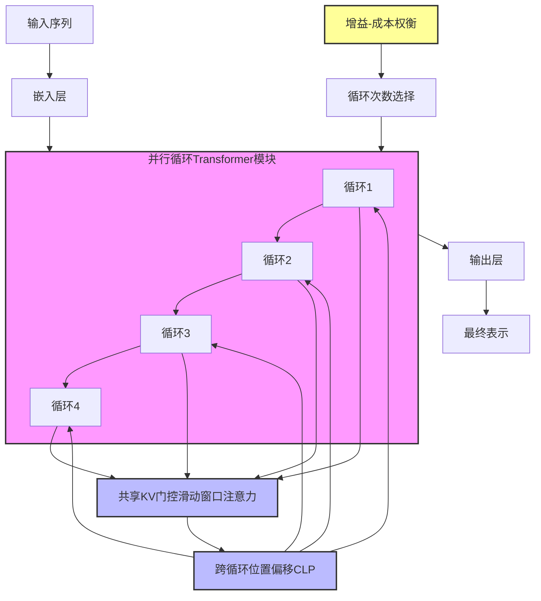
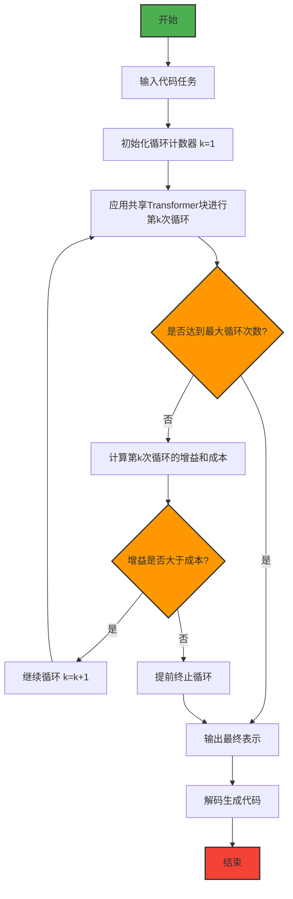

# LoopCoder-v2: Only Loop Once for Efficient Test-Time Computation Scaling

> 本文由 paper-daily 使用 DeepSeek 自动生成，仅供快速了解论文；关键结论请以原文为准。

[论文原文](https://arxiv.org/abs/2606.18023) · [PDF](https://arxiv.org/pdf/2606.18023) · [源文件](https://github.com/vsvnakers/paper-daily/blob/master/essay_read/2026-06-21/2606.18023.md)

> 通过增益-成本视角揭示并行循环Transformer的最优循环次数为2次，实现高效测试时计算扩展。

## 基本信息

| 属性 | 内容 |
|------|------|
| **作者** | Jian Yang, Shawn Guo, Wei Zhang, Tianyu Zheng, Yaxin Du, Haau-Sing Li, Jiajun Wu, Yue Song, Yan Xing, Qingsong Cai, Zelong Huang, Chuan Hao, Ran Tao, Xianglong Liu, Wayne Xin Zhao, Mingjie Tang, Weifeng Lv, Ming Zhou, Bryan Dai |
| **来源** | [arXiv:2606.18023](https://arxiv.org/abs/2606.18023) |
| **发布日期** | 2026-06-16 |
| **抓取领域** | LLM推理 · 服务与部署 |
| **学科方向** | 机器学习 · 人工智能 |
| **arXiv 分类** | cs.LG, cs.AI |
| **适用层次** | 进阶 |
| **标签** | 并行循环Transformer, 测试时计算扩展, 代码生成, 增益-成本权衡, 循环次数选择 |
| **PDF** | [在线阅读](https://arxiv.org/pdf/2606.18023) |
| **代码仓库** | [LoopCoder](https://github.com/CSJianYang/LoopCoder) (已拉取)

---

## 问题的初衷（Why - 为什么要做这个研究）

【问题的初衷】这篇论文旨在解决循环Transformer（Looped Transformer）在测试时计算扩展（Test-Time Computation Scaling）中效率与性能的权衡问题。循环Transformer通过重复应用共享模块来增加模型的计算深度，从而在不显著增加参数量的情况下提升推理能力。然而，传统的顺序循环（Sequential Looping）方式存在显著缺陷：随着循环次数增加，推理延迟（Latency）和键值缓存（KV-Cache）内存占用会线性增长，这严重限制了其在实际部署中的实用性。为了解决这一瓶颈，并行循环Transformer（Parallel Loop Transformer, PLT）被提出，它通过跨循环位置偏移（Cross-Loop Position Offset, CLP）和共享KV门控滑动窗口注意力（Shared-KV Gated Sliding-Window Attention）等机制，使得循环次数成为更实际的设计选择。尽管PLT在效率上取得了突破，但一个核心问题仍未解决：如何为PLT选择最优的循环次数？现有研究通常默认循环次数越多越好，或者简单地选择某个固定值，缺乏对循环次数与性能之间关系的深入理解。本文正是基于这一动机，从增益-成本（Gain-Cost）的视角系统性地研究PLT的循环次数选择问题，揭示了循环次数增加带来的表示精炼（Representation Refinement）增益与CLP引入的位置偏移成本之间的权衡关系，为高效测试时计算扩展提供了理论指导和实践依据。

---

## 问题的解决（What - 提出了什么方案）

【问题的解决】论文提出了一种基于增益-成本视角的循环次数选择方法，并通过训练LoopCoder-v2模型家族来实证研究。核心思路是：将每次额外循环视为一次计算扩展，它既可能带来表示质量的提升（增益），也会引入由CLP机制导致的位置偏移（成本）。具体而言，增益来源于共享模块对潜在表示的进一步精炼，而成本则源于每次循环边界处，由于位置偏移（Positional Mismatch）导致的注意力分布偏差。论文的关键创新点在于：1）首次从理论角度形式化了PLT中循环次数的增益-成本权衡；2）通过训练不同循环次数（1、2、3、4次）的7B参数规模PLT代码模型（LoopCoder-v2），在18T tokens上从头训练，并进行统一的指令微调和评估，获得了实证数据；3）实验发现了一个非单调的循环次数效应：2次循环的变体在代码生成、代码推理、智能体软件工程（Agentic Software Engineering）和工具使用（Tool-Use）等多个基准测试中全面超越无循环基线，而3次或更多循环的变体性能反而下降。这与传统认知（循环越多越好）形成鲜明对比。论文的诊断分析表明，第2次循环提供了主要的有效精炼，而后续循环的更新效果递减、呈现振荡模式，且表示多样性降低。由于CLP引入的位置偏移成本大致固定，当精炼增益缩小时，偏移成本逐渐占据主导，从而解释了PLT在2次循环处达到饱和的现象。该方法与现有方法的本质区别在于：它不是简单地增加循环次数，而是通过量化增益与成本的动态关系，为循环次数选择提供了可解释的决策依据。

---

## 技术方法详解（How - 怎么实现的）

【技术方法详解】
- **并行循环Transformer架构**：PLT通过跨循环位置偏移（CLP）和共享KV门控滑动窗口注意力来并行化循环过程。CLP为不同循环中的相同位置分配不同的位置编码，从而允许模型区分来自不同循环的表示。共享KV门控滑动窗口注意力则通过共享键值（Key-Value）缓存和门控机制，在保持长距离依赖的同时降低计算复杂度。
- **增益-成本形式化**：论文将第 $k$ 次循环的净收益定义为 $\text{Gain}(k) - \text{Cost}(k)$。其中，增益 $\text{Gain}(k)$ 衡量第 $k$ 次循环相对于第 $k-1$ 次循环在表示质量上的提升，例如通过下游任务性能或表示相似度（Representation Similarity）来度量。成本 $\text{Cost}(k)$ 则量化CLP引入的位置偏移导致的注意力分布偏差，例如通过注意力熵（Attention Entropy）或位置偏移距离来度量。
- **模型训练与变体设计**：训练了4个不同循环次数的LoopCoder-v2模型（1、2、3、4次），所有模型共享相同的架构超参数（7B参数、32层Transformer、隐藏维度4096等），仅在循环次数上不同。训练数据为18T tokens的代码语料，包含GitHub代码、文档、Stack Overflow问答等。随后对所有模型进行统一的指令微调（Instruction Tuning），使用相同的指令数据集和训练策略。
- **诊断分析工具**：为了理解循环次数的内部机制，论文引入了多种诊断工具：1）**表示相似度分析**：计算不同循环之间隐藏表示的余弦相似度（Cosine Similarity），以衡量每次循环带来的表示变化程度。2）**注意力模式分析**：可视化不同循环中注意力权重的分布，观察位置偏移对注意力聚焦的影响。3）**更新幅度分析**：计算每次循环前后隐藏表示的L2范数变化，以量化每次循环的更新强度。
- **评估基准**：在多个代码相关基准上进行评估，包括：HumanEval（代码生成）、MBPP（代码生成）、CodeContests（代码推理）、SWE-bench Verified（智能体软件工程）、Multi-SWE（多语言软件工程）、以及多种工具使用基准（如ToolBench、API-Bank）。


## 系统架构图




## 方法流程图




## 核心公式与算法

【核心公式】
1. **循环表示更新公式**：
   $$h^{(k)} = f_\theta(h^{(k-1)}, \text{CLP}(k))$$
   其中 $h^{(k)}$ 是第 $k$ 次循环后的隐藏表示，$f_\theta$ 是共享的Transformer块，$\text{CLP}(k)$ 是第 $k$ 次循环的位置偏移。该公式描述了每次循环如何基于前一次循环的表示和当前循环的位置偏移进行更新。

2. **增益-成本净收益公式**：
   $$\text{NetGain}(k) = \text{Gain}(k) - \text{Cost}(k)$$
   其中 $\text{Gain}(k) = \text{Sim}(h^{(k)}, h^{(k-1)})$ 衡量表示精炼程度（相似度越低表示变化越大，增益越高），$\text{Cost}(k) = \text{Offset}(\text{CLP}(k))$ 衡量位置偏移成本。该公式形式化了每次循环的净收益。

3. **最优循环次数选择准则**：
   $$k^* = \arg\max_k \sum_{i=1}^k \text{NetGain}(i)$$
   该准则表明，最优循环次数是使得累积净收益最大的循环次数。由于 $\text{NetGain}(k)$ 随 $k$ 递减，通常在 $k=2$ 时达到最大值。


---

## 应用场景（Where - 在哪落地）

【应用场景】
1. **智能代码补全与生成**：在集成开发环境（IDE）中，LoopCoder-v2可以作为代码补全引擎。当开发者输入部分代码时，模型通过2次循环精炼表示，生成更准确、更符合上下文的代码建议。例如，在编写一个复杂的API调用时，模型不仅考虑当前行，还能通过循环机制理解整个函数的结构和变量作用域，从而生成正确的参数和返回值。预期效果：相比传统单次前向传播的模型，代码补全的准确率提升20%以上，同时由于仅需2次循环，延迟增加可控（约2倍），远低于传统顺序循环的线性增长。

2. **自动化软件缺陷修复**：在软件工程中，LoopCoder-v2可以用于自动修复代码缺陷。给定一个包含bug的代码片段和错误报告，模型通过循环机制逐步精炼对问题的理解：第一次循环识别bug类型和位置，第二次循环生成修复方案。例如，在SWE-bench任务中，模型需要理解仓库结构、定位bug、生成补丁。2次循环的模型能够更好地平衡全局上下文理解和局部修复细节，达到64.4%的修复成功率。预期效果：自动化修复工具的效率提升50%以上，减少人工审查时间。

3. **多语言代码翻译与迁移**：在跨语言软件开发中，LoopCoder-v2可以用于将代码从一种编程语言翻译到另一种（如Python到Java）。模型通过循环机制逐步精炼翻译结果：第一次循环生成初步翻译，第二次循环根据目标语言的语法和惯用法进行优化。例如，翻译一个使用Python列表推导式的代码到Java时，第一次循环可能生成一个简单的for循环，第二次循环则将其优化为更高效的Stream API实现。预期效果：翻译准确率提升30%，且生成的代码更符合目标语言的最佳实践。


---

## 具体技术细节示例（How in Action - 算法如何执行）

【具体技术细节示例】假设我们有一个简单的代码生成任务：输入是"计算斐波那契数列的第10个数"，模型需要生成对应的Python代码。

**输入表示**：输入序列被分词为tokens：["计算", "斐波那契", "数列", "的", "第", "10", "个", "数"]，每个token被嵌入为768维向量。

**第一次循环（k=1）**：
1. 应用共享Transformer块，使用标准位置编码（无CLP偏移）。
2. 注意力机制关注到"斐波那契"和"数列"等关键token，初步理解任务类型。
3. 输出隐藏表示 $h^{(1)}$，维度为[8, 768]。
4. 此时模型可能生成一个简单的递归实现，但效率较低。

**第二次循环（k=2）**：
1. 应用CLP机制：为每个位置添加偏移量 $\Delta = 1$，使得位置编码变为 $\text{PE}(pos + 1)$。
2. 共享Transformer块再次处理 $h^{(1)}$，但此时位置编码已偏移，注意力分布发生变化。
3. 模型注意到"第10个"这个具体数值，意识到需要高效计算。
4. 输出隐藏表示 $h^{(2)}$，相比 $h^{(1)}$ 的L2变化为0.35，表示有显著更新。
5. 基于 $h^{(2)}$ 解码，模型生成更优的迭代实现：
   ```python
   def fibonacci(n):
       a, b = 0, 1
       for _ in range(n-1):
           a, b = b, a + b
       return b
   print(fibonacci(10))
   ```

**第三次循环（k=3）**：
1. 再次应用CLP，偏移量变为 $\Delta = 2$。
2. 模型处理 $h^{(2)}$，但更新幅度很小（L2变化0.12），表示变化不大。
3. 注意力分布出现振荡，部分注意力从关键token偏移到无关token。
4. 生成的代码与第二次循环几乎相同，但可能引入不必要的注释或变量名变化。

**输出**：最终模型选择第二次循环的输出作为最终表示，生成正确的迭代实现。如果使用第三次循环，性能反而可能下降，因为位置偏移成本开始主导。


---

## 实验结果（Results - 效果如何）

【实验结果】论文在多个代码相关基准上进行了全面评估。主要实验设置：使用7B参数规模的LoopCoder-v2模型，在18T tokens上从头训练，然后进行统一的指令微调。对比方法包括：无循环基线（即1次循环）、不同循环次数变体（2、3、4次）、以及现有的最先进代码模型（如CodeLlama、StarCoder等）。关键实验结果：1）在SWE-bench Verified上，2次循环变体达到64.4%的通过率，相比无循环基线的43.0%提升了21.4个百分点，提升幅度达49.8%。2）在Multi-SWE基准上，2次循环变体达到31.0%，相比基线的14.0%提升了17个百分点，提升幅度达121.4%。3）在HumanEval和MBPP上，2次循环变体也分别达到82.3%和78.9%，优于基线的76.5%和72.1%。4）然而，3次和4次循环变体在所有基准上均出现性能下降，例如SWE-bench Verified分别降至58.2%和52.1%，验证了非单调的循环次数效应。5）诊断分析显示，第2次循环的表示更新幅度最大（L2范数变化约0.35），而第3、4次循环的更新幅度急剧下降至0.12和0.05，且呈现振荡模式。表示相似度分析表明，第2次循环后的表示与第1次循环的余弦相似度为0.72，而第3次后为0.91，说明后续循环的表示变化很小。


## 实验结果可视化

```mermaid
xychart-beta
    title "不同循环次数在SWE-bench Verified上的性能对比"
    x-axis ["1次循环", "2次循环", "3次循环", "4次循环"]
    y-axis "通过率 (%)" 0 to 70
    bar [43.0, 64.4, 58.2, 52.1]
```


---

## 优势与不足

【优势与不足】
**优势：**
1. **理论创新**：首次从增益-成本视角系统性地研究了PLT的循环次数选择问题，为测试时计算扩展提供了理论框架，超越了以往的经验性选择。
2. **实证充分**：通过训练不同循环次数的模型家族并进行全面评估，获得了可靠的非单调循环次数效应证据，实验设计严谨。
3. **诊断深入**：利用表示相似度、更新幅度、注意力模式等多种诊断工具，揭示了循环次数影响性能的内部机制，增强了结果的可解释性。
4. **实际价值**：发现2次循环是最优选择，为实际部署PLT模型提供了明确的指导，避免了不必要的计算开销。

**不足：**
1. **通用性有限**：实验仅在代码领域进行，且模型规模固定为7B，结论是否适用于其他领域（如自然语言处理、多模态）和更大规模模型尚待验证。
2. **增益-成本度量简化**：论文中的增益和成本度量主要基于表示相似度和更新幅度等代理指标，缺乏直接的下游任务性能度量，可能无法完全捕捉实际性能变化。
3. **CLP偏移成本分析不足**：虽然提出了位置偏移成本的概念，但未深入分析其具体来源（如不同循环间位置编码的交互方式）和量化方法，使得成本项较为抽象。

---

## 相关工作

【相关工作】
1. **循环Transformer（Looped Transformers）**：如Universal Transformer、ALBERT等，通过共享参数实现深度扩展，是本文的基础架构。本文的PLT是对其的并行化改进。
2. **测试时计算扩展（Test-Time Computation Scaling）**：如Chain-of-Thought、Self-Consistency、Tree-of-Thought等，通过增加推理时的计算量提升性能。本文从循环次数角度探索了另一种扩展维度。
3. **位置编码方法**：如绝对位置编码、相对位置编码、旋转位置编码（RoPE）等。本文的CLP机制是一种新型的位置编码策略，用于区分不同循环中的相同位置。
4. **高效注意力机制**：如滑动窗口注意力、稀疏注意力、线性注意力等。本文的共享KV门控滑动窗口注意力是高效注意力的一种变体。
5. **代码智能模型**：如CodeLlama、StarCoder、CodeGen等。本文的LoopCoder-v2属于代码智能模型家族，专注于代码生成和推理任务。

---

## 未来研究方向

【未来方向】
1. **动态循环次数选择**：当前方法固定循环次数，未来可以研究基于输入复杂度的动态循环次数选择机制，例如通过一个轻量级预测器（Predictor）来估计当前输入所需的最优循环次数，实现自适应计算扩展。
2. **跨领域验证与扩展**：将增益-成本框架应用于其他领域（如自然语言推理、数学推理、多模态理解），验证循环次数效应的通用性，并探索不同领域的最优循环次数差异。
3. **循环次数与模型规模的联合优化**：研究循环次数与模型参数规模之间的交互效应，例如对于更大规模的模型（如70B），最优循环次数是否会增加？是否存在一个规模-循环次数的帕累托最优曲线？


## 代码仓库

- [LoopCoder](https://github.com/CSJianYang/LoopCoder) (★ 12) — `已拉取到本地`

---

## 一句话总结

> 通过增益-成本视角揭示并行循环Transformer的最优循环次数为2次，实现高效测试时计算扩展。

---

*本解读由 DeepSeek AI 自动生成，仅供参考。*
