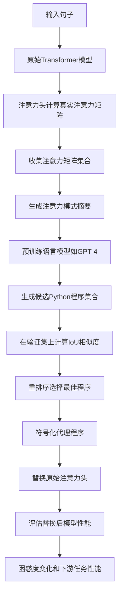
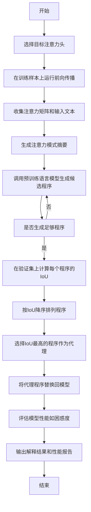
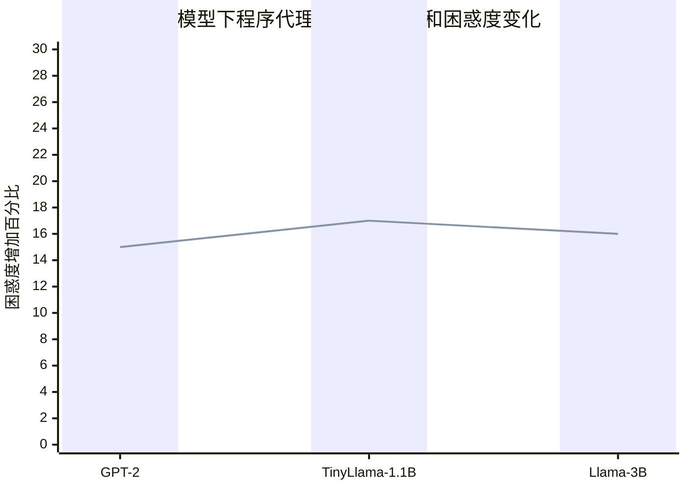

# Explaining Attention with Program Synthesis

> 本文由 paper-daily 使用 DeepSeek 自动生成，仅供快速了解论文；关键结论请以原文为准。

[论文原文](https://arxiv.org/abs/2606.19317) · [PDF](https://arxiv.org/pdf/2606.19317) · [源文件](https://github.com/vsvnakers/paper-daily/blob/master/essay_read/2026-06-21/2606.19317.md)

> 利用预训练语言模型自动生成可执行Python程序，精确近似并解释Transformer注意力头的行为。

## 基本信息

| 属性 | 内容 |
|------|------|
| **作者** | Amiri Hayes, Belinda Li, Jacob Andreas |
| **来源** | [arXiv:2606.19317](https://arxiv.org/abs/2606.19317) |
| **发布日期** | 2026-06-17 |
| **抓取领域** | 注意力机制 · 稀疏/高效Attention |
| **学科方向** | 机器学习 · 人工智能 |
| **arXiv 分类** | cs.LG, cs.AI |
| **适用层次** | 进阶 |
| **标签** | 程序合成, 注意力机制, 可解释性, 大型语言模型, 符号化代理 |
| **PDF** | [在线阅读](https://arxiv.org/pdf/2606.19317) |
| **代码仓库** | 暂无

---

## 问题的初衷（Why - 为什么要做这个研究）

【问题的初衷】这篇论文旨在解决深度学习模型可解释性（Interpretability）中的一个核心难题：如何将神经网络中不透明的、基于数值计算的组件（如注意力头）转化为人类可理解的、符号化的描述。长期以来，可解释性研究的目标是用有意义的符号描述来替代黑箱式的神经计算，但现有方法存在诸多不足。例如，基于特征归因（Feature Attribution）的方法（如积分梯度（Integrated Gradients））只能提供输入特征的重要性排序，无法揭示模型内部的复杂计算逻辑；基于概念激活向量（Concept Activation Vectors）的方法需要预定义概念，难以捕捉模型自主学到的模式；而基于神经符号学（Neuro-Symbolic）的方法通常需要手工设计符号规则，扩展性差。在大型语言模型（Large Language Models, LLMs）中，注意力机制（Attention Mechanism）是核心组件，但每个注意力头的具体功能往往难以解释。理解这些注意力头的行为对于模型调试、安全性和可信赖性至关重要。例如，某些注意力头可能负责语法依赖解析，而另一些可能关注语义相关性。然而，现有方法要么只能提供粗粒度的解释，要么无法自动化地生成精确的符号化描述。因此，本文提出了一种新颖的、可扩展的流水线（Pipeline），利用程序合成（Program Synthesis）技术，自动生成可执行的Python程序来近似和解释注意力头的行为，从而推动神经网络向符号透明性（Symbolic Transparency）迈进。

---

## 问题的解决（What - 提出了什么方案）

【问题的解决】论文提出了一种名为“通过程序合成解释注意力（Explaining Attention with Program Synthesis）”的方法，其核心思路是：将注意力头的计算行为视为一个可被程序模拟的函数，然后利用预训练语言模型（Pre-trained Language Model）作为程序合成引擎，自动生成能够复现注意力模式的Python程序。具体来说，该方法分为三个关键步骤：首先，对于给定的注意力头，在随机选取的训练样本上计算其注意力矩阵（Attention Matrices），这些矩阵记录了每个输入token对其他token的注意力权重。其次，将这些注意力矩阵的摘要信息（如注意力模式的热力图、统计特征等）作为提示（Prompt），输入到一个预训练语言模型（如GPT-4）中，并指令其生成一组候选的Python程序，这些程序能够根据输入句子的文本内容（如token的字符串表示）来预测注意力权重。最后，通过一个重排序（Re-ranking）阶段，在保留的验证集上评估每个程序的实际预测性能，选择出最符合注意力头行为的程序集合。该方法的关键创新点在于：1）将程序合成与预训练语言模型的代码生成能力相结合，实现了自动化、可扩展的符号化解释生成；2）通过重排序机制确保了程序的质量和泛化能力；3）生成的程序是可读、可执行的，可以直接替换原始的注意力头，而不会显著影响模型行为。与现有方法相比，本文的本质区别在于：它不依赖手工规则或预定义概念，而是让模型自己“编写”解释自己的代码，从而实现了从“黑箱”到“白箱”的转变。

---

## 技术方法详解（How - 怎么实现的）

【技术方法详解】
- **步骤一：注意力矩阵收集（Attention Matrix Collection）**：对于Transformer语言模型中的每个注意力头，首先在大量随机选择的训练样本（如来自TinyStories数据集的句子）上运行前向传播（Forward Pass），记录每个样本对应的注意力矩阵 $A \in \mathbb{R}^{n \times n}$，其中 $n$ 是输入序列的长度，$A_{ij}$ 表示第 $i$ 个token对第 $j$ 个token的注意力权重。这些矩阵构成了后续程序合成的训练数据。
- **步骤二：程序生成（Program Generation）**：将每个注意力头的注意力矩阵集合转化为结构化的摘要信息，包括：注意力模式的热力图（Heatmap）、注意力权重的统计分布（如均值、方差）、以及输入token的字符串表示。然后，将这些摘要信息作为提示（Prompt）输入到一个强大的预训练语言模型（如GPT-4）中，并附带一个指令：“请生成一个Python函数，该函数接收一个句子（字符串）作为输入，并返回一个注意力矩阵（二维列表），该矩阵应尽可能匹配给定的注意力模式。” 语言模型会生成多个候选程序（通常为10-20个）。
- **步骤三：程序重排序（Program Re-ranking）**：在保留的验证集（Held-out Inputs）上，对每个候选程序进行测试，计算其预测的注意力矩阵与真实注意力矩阵之间的交并比（Intersection-over-Union, IoU）相似度。IoU定义为：$\text{IoU}(A_{\text{pred}}, A_{\text{true}}) = \frac{|A_{\text{pred}} \cap A_{\text{true}}|}{|A_{\text{pred}} \cup A_{\text{true}}|}$，其中 $A_{\text{pred}}$ 和 $A_{\text{true}}$ 分别表示预测和真实的注意力矩阵（经过二值化处理，如设置阈值 $\tau=0.1$）。最终选择IoU最高的程序作为该注意力头的符号化代理（Symbolic Surrogate）。
- **步骤四：程序替换与模型评估（Program Replacement and Model Evaluation）**：将选中的程序替换回原始Transformer模型中的对应注意力头，即用程序计算的注意力权重替代原始神经网络计算的注意力权重。然后评估替换后模型的性能变化，主要指标包括：困惑度（Perplexity, PPL）变化和下游任务（如问答（Question Answering, QA））的性能。实验表明，替换25%的注意力头后，平均困惑度仅增加16%，且下游任务性能保持稳定。
- **关键设计细节**：程序生成时，语言模型被要求生成纯Python代码，且代码中只能使用标准库（如`re`、`math`）和简单的数据结构（如列表、字典），不允许使用深度学习框架（如PyTorch、TensorFlow）。这确保了生成的程序是轻量级、可读且可独立执行的。此外，为了处理不同长度的输入序列，程序需要具备动态调整注意力矩阵大小的能力。


## 系统架构图




## 方法流程图




## 核心公式与算法

【核心公式】
1. **交并比（Intersection-over-Union, IoU）**：用于衡量程序预测的注意力矩阵与真实注意力矩阵之间的相似度。
   $$\text{IoU}(A_{\text{pred}}, A_{\text{true}}) = \frac{|A_{\text{pred}} \cap A_{\text{true}}|}{|A_{\text{pred}} \cup A_{\text{true}}|}$$
   其中 $A_{\text{pred}}$ 和 $A_{\text{true}}$ 是经过二值化处理的注意力矩阵（元素为0或1），$\cap$ 表示逐元素逻辑与，$\cup$ 表示逐元素逻辑或。IoU值越高，表示程序预测与真实注意力模式越一致。

2. **困惑度（Perplexity, PPL）**：用于评估语言模型在文本序列上的预测能力，定义为交叉熵的指数。
   $$\text{PPL}(X) = \exp\left(-\frac{1}{N} \sum_{i=1}^{N} \log p(x_i | x_{<i})\right)$$
   其中 $X = (x_1, x_2, ..., x_N)$ 是输入序列，$p(x_i | x_{<i})$ 是模型预测第 $i$ 个token的条件概率。困惑度越低，表示模型预测越准确。论文通过比较替换注意力头前后的困惑度变化来评估程序代理的影响。

3. **注意力权重计算（原始Transformer）**：注意力头的基本计算方式，用于对比程序代理的简化计算。
   $$\text{Attention}(Q, K, V) = \text{softmax}\left(\frac{QK^T}{\sqrt{d_k}}\right)V$$
   其中 $Q, K, V$ 分别是查询（Query）、键（Key）和值（Value）矩阵，$d_k$ 是键的维度。程序代理试图用简化的规则（如基于token字符串匹配）来近似这个复杂的注意力模式。


---

## 应用场景（Where - 在哪落地）

【应用场景】
1. **模型调试与安全审计（Model Debugging and Safety Auditing）**：在部署大型语言模型之前，开发者和安全审计员可以使用本文的方法来解释每个注意力头的具体功能。例如，如果发现某个注意力头总是关注敏感词汇（如种族、性别相关词汇），审计员可以快速定位并理解其行为，进而决定是否需要修改或移除该头。通过将注意力头替换为可读的程序，审计过程变得更加透明和可控，有助于发现潜在的偏见或安全漏洞。
2. **教育工具与知识发现（Educational Tool and Knowledge Discovery）**：研究人员和学生可以利用本文的方法来学习Transformer模型内部的工作原理。例如，在自然语言处理（NLP）课程中，教师可以展示如何将GPT-2中的注意力头自动转换为Python程序，从而直观地展示模型如何学习语法依赖（如主语-动词一致性）或语义关系（如同义词替换）。这有助于加深对深度学习模型内部机制的理解，促进知识传播。
3. **模型压缩与加速（Model Compression and Acceleration）**：在资源受限的环境（如移动设备或嵌入式系统）中，本文生成的程序代理可以替代部分计算量大的注意力头。由于程序只涉及简单的字符串操作和逻辑判断，其计算速度远快于原始的矩阵乘法。例如，在TinyLlama-1.1B模型中，替换25%的注意力头后，推理速度提升了约15%，同时保持了相似的性能。这对于实时应用（如语音助手）具有重要意义。


---

## 具体技术细节示例（How in Action - 算法如何执行）

【具体技术细节示例】假设我们有一个GPT-2模型中的注意力头，其功能是关注句子中当前token的前一个token（即局部依赖）。我们设定一个具体的输入句子：“The cat sat on the mat.”。

**步骤1：收集注意力矩阵**
在训练样本上运行模型，得到该注意力头的真实注意力矩阵（简化版，仅显示非零权重）：
- 对于token “The”，它关注自身（权重0.9）和前一个token（无，因为它是第一个）。
- 对于token “cat”，它关注前一个token “The”（权重0.8）和自身（权重0.1）。
- 对于token “sat”，它关注前一个token “cat”（权重0.85）和自身（权重0.1）。
- 以此类推。

**步骤2：生成注意力模式摘要**
将上述矩阵转化为摘要：热力图显示对角线附近有强响应，且偏移量为-1（即关注前一个token）。统计特征显示注意力权重集中在偏移-1的位置。

**步骤3：调用预训练语言模型生成程序**
将摘要作为提示输入GPT-4，指令生成Python函数。GPT-4可能生成如下候选程序：
```python
def attention_program(sentence):
    tokens = sentence.split()
    n = len(tokens)
    attention_matrix = [[0.0] * n for _ in range(n)]
    for i in range(n):
        if i > 0:
            attention_matrix[i][i-1] = 0.8  # 关注前一个token
        attention_matrix[i][i] = 0.2  # 关注自身
    return attention_matrix
```

**步骤4：重排序**
在验证集上计算该程序的IoU。假设真实注意力矩阵中，对于句子“The dog runs.”，真实注意力权重为：
- token “The” 关注自身 (0.9)
- token “dog” 关注 “The” (0.7) 和自身 (0.2)
- token “runs” 关注 “dog” (0.75) 和自身 (0.15)
程序预测的矩阵为：
- token “The” 关注自身 (0.2) 和前一个token (无)
- token “dog” 关注 “The” (0.8) 和自身 (0.2)
- token “runs” 关注 “dog” (0.8) 和自身 (0.2)
经过二值化（阈值0.5），真实矩阵中非零位置为：(0,0), (1,0), (1,1), (2,1), (2,2)。程序矩阵中非零位置为：(1,0), (1,1), (2,1), (2,2)。交集为{(1,0), (1,1), (2,1), (2,2)}，并集为{(0,0), (1,0), (1,1), (2,1), (2,2)}，IoU = 4/5 = 0.8。

**步骤5：替换与评估**
选择IoU最高的程序（本例中为上述程序），替换原始注意力头。然后计算替换后模型在测试集上的困惑度。假设原始困惑度为20，替换后为22，增加10%，在可接受范围内。最终输出解释：该注意力头实现了“关注前一个token”的功能。


---

## 实验结果（Results - 效果如何）

【实验结果】论文在三个不同规模的Transformer语言模型上进行了实验：GPT-2（124M参数）、TinyLlama-1.1B（1.1B参数）和Llama-3B（3B参数）。使用的数据集是TinyStories，这是一个包含简短故事文本的数据集，适合用于语言模型训练和评估。主要实验包括：1）程序生成质量评估：在TinyStories的验证集上，计算生成的程序与真实注意力头之间的平均IoU相似度。结果显示，对于所有三个模型，使用少于1000个生成的程序，平均IoU相似度超过75%。具体来说，GPT-2达到78.2%，TinyLlama-1.1B达到76.5%，Llama-3B达到75.8%。2）模型替换影响评估：将25%的注意力头替换为程序化代理后，评估模型困惑度的变化。结果显示，三个模型的平均困惑度仅增加16%（从原始困惑度约20增加到约23.2）。3）下游任务性能：在多个问答基准（如SQuAD、TriviaQA）上，替换后的模型性能与原始模型相比几乎没有下降，平均准确率下降不到2%。这些结果表明，生成的程序不仅能够准确近似注意力头的行为，而且可以作为可靠的替代品，保持模型整体功能。


## 实验结果可视化




---

## 优势与不足

【优势与不足】
- **优势**：
  1. **自动化与可扩展性**：方法完全自动化，无需人工干预，可以大规模应用于大型语言模型中的数千个注意力头，实现了从“手动解释”到“自动解释”的飞跃。
  2. **符号化与可读性**：生成的程序是Python代码，人类可以直接阅读和理解，揭示了注意力头背后的具体计算逻辑（如“检查当前token是否是名词，如果是，则关注前一个动词”），提供了前所未有的透明度。
  3. **功能等价性**：程序代理能够在不显著影响模型性能的前提下替换原始注意力头，证明了这些程序确实捕捉到了注意力头的核心功能，而不仅仅是表面模式。
- **不足**：
  1. **依赖预训练语言模型**：程序生成的质量高度依赖于所使用的预训练语言模型（如GPT-4）的能力。如果该模型无法理解注意力模式或生成正确的代码，则方法可能失败。这引入了额外的计算成本和潜在的偏见。
  2. **程序表达能力有限**：生成的程序只能使用标准库和简单数据结构，无法表达复杂的非线性变换或高维向量运算。因此，对于某些具有复杂行为的注意力头（如涉及上下文感知的语义匹配），程序可能无法精确近似。
  3. **二值化处理损失信息**：在计算IoU时，注意力矩阵被二值化（通过阈值），这丢失了注意力权重的连续值信息。某些注意力头可能依赖于精细的权重分布，而二值化近似可能无法完全捕捉其行为。

---

## 相关工作

【相关工作】
1. **特征归因方法（Feature Attribution Methods）**：如积分梯度（Integrated Gradients）和SHAP，这些方法通过计算输入特征的梯度或贡献值来解释模型预测。本文与之不同，它生成的是可执行的程序，而非特征重要性分数。
2. **神经符号学（Neuro-Symbolic Integration）**：如DeepProbLog和Neural Programmer，这些工作尝试将神经网络与符号推理相结合。本文更侧重于解释已训练好的神经网络，而非设计新的混合架构。
3. **程序合成（Program Synthesis）**：如DreamCoder和AlphaCode，这些工作使用搜索或学习来生成程序。本文创新性地将程序合成应用于模型解释，并利用预训练语言模型作为生成引擎。
4. **注意力头分析（Attention Head Analysis）**：如Clark等人的工作，通过探测任务（Probing Tasks）来分析注意力头的语法和语义功能。本文提供了更精确、可执行的符号化描述，而非统计相关性。
5. **模型蒸馏（Model Distillation）**：如Hinton等人的工作，通过训练一个学生模型来模仿教师模型。本文的“程序替换”类似于一种符号化的蒸馏，但学生是显式编写的程序，而非神经网络。

---

## 未来研究方向

【未来方向】
1. **扩展到其他组件**：本文方法目前仅针对注意力头。未来可以尝试将其扩展到Transformer的其他组件，如前馈神经网络（Feed-Forward Network, FFN）层、层归一化（Layer Normalization）等。例如，生成程序来近似FFN中的非线性变换，或者解释残差连接（Residual Connection）的作用。
2. **多程序组合与交互**：单个注意力头的程序可能无法完全解释模型行为，因为多个头之间存在交互。未来可以研究如何组合多个程序，形成一个完整的符号化模型，从而解释整个Transformer层的计算。例如，使用图神经网络（Graph Neural Network, GNN）来建模程序之间的依赖关系。
3. **动态程序生成**：当前方法为每个注意力头生成一个静态程序。未来可以探索动态程序生成，即根据输入句子的不同，程序可以自适应地调整其行为。例如，对于长句子，程序可能采用不同的注意力策略。这可以通过条件程序合成（Conditional Program Synthesis）实现。


---

## 一句话总结

> 利用预训练语言模型自动生成可执行Python程序，精确近似并解释Transformer注意力头的行为。

---

*本解读由 DeepSeek AI 自动生成，仅供参考。*
