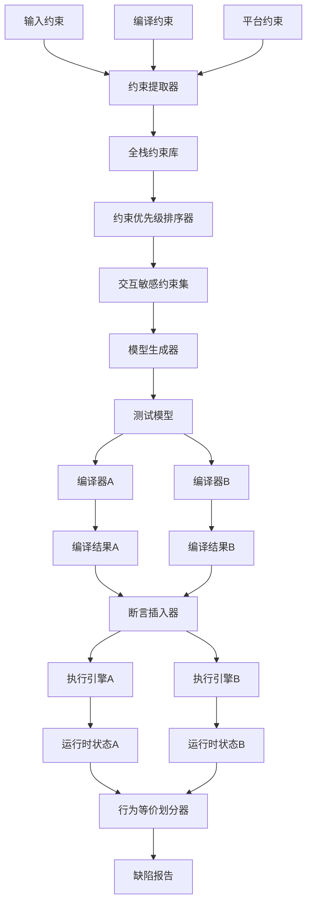
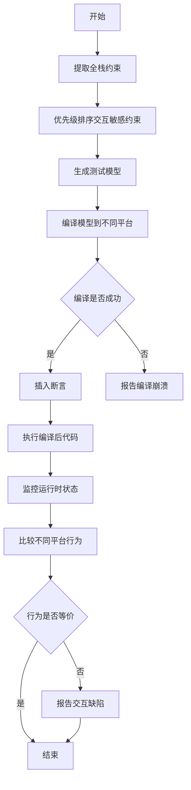
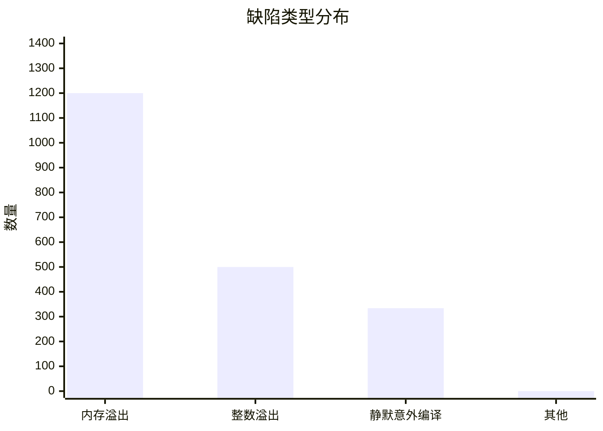

# Finding Compiler-Platform Interaction Bugs in Deep Learning Pipelines via Cross-Layer Constraints

> 本文由 paper-daily 使用 DeepSeek 自动生成，仅供快速了解论文；关键结论请以原文为准。

[论文原文](https://arxiv.org/abs/2606.18421) · [PDF](https://arxiv.org/pdf/2606.18421) · [源文件](https://github.com/vsvnakers/paper-daily/blob/master/essay_read/2026-06-22/2606.18421.md)

> 提出全栈约束驱动的深度学习编译器测试框架，系统性地发现编译器-平台交互缺陷。

## 基本信息

| 属性 | 内容 |
|------|------|
| **作者** | Yuxin Qiu, Jiyuan Wang, Ronak Badhe, Ben Limpanukorn, Miryung Kim, Qian Zhang |
| **来源** | [arXiv:2606.18421](https://arxiv.org/abs/2606.18421) |
| **发布日期** | 2026-06-16 |
| **抓取领域** | 深度学习编译器/IR |
| **学科方向** | 软件工程 |
| **arXiv 分类** | cs.SE |
| **适用层次** | 进阶 |
| **标签** | 深度学习编译器, 编译器测试, 全栈约束, 交互缺陷, 行为等价划分 |
| **PDF** | [在线阅读](https://arxiv.org/pdf/2606.18421) |
| **代码仓库** | 暂无

---

## 问题的初衷（Why - 为什么要做这个研究）

【问题的初衷】随着人工智能（AI）的广泛部署，深度学习（DL）编译器（如 TVM 和 ONNX-MLIR）变得至关重要。这些编译器将高级 AI 模型作为输入，通过多层变换（multi-layer transformations）将其降低（lower），并针对不同的硬件进行特化。测试此类编译器面临独特挑战，因为其正确性取决于贯穿整个编译栈（compilation stack）的隐式约束（implicit constraints）。现有的测试方法主要利用类型约束（type constraints）来限制输入模型的生成，从而侧重于类型验证（type validation）以及监控编译崩溃（compilation crashes）或覆盖率提升（coverage gains）。这种关注点忽略了由编译和执行环境之间的交错效应（interleaved effects）引起的编译器-平台交互缺陷（compiler-platform interaction bugs）。例如，一个在特定硬件上运行正常的模型，在另一个硬件上可能因内存对齐或指令集差异而触发整数溢出（integer overflow）。这些缺陷难以通过传统的类型检查或覆盖率导向的测试发现，因为它们源于编译优化（compilation passes）与硬件平台（hardware platforms）之间复杂的相互作用。因此，迫切需要一种能够系统性地发现此类交互缺陷的方法。

---

## 问题的解决（What - 提出了什么方案）

【问题的解决】本文提出了一种可扩展、自动化的 DL 编译器测试框架 XCheck，旨在同时实现两个目标：（1）发现编译器-平台交互缺陷；（2）实现行为等价划分（behavior equivalence partitioning）。核心洞察是：这些缺陷是由编译通道（compilation passes）和硬件平台（hardware platforms）之间交互产生的违反假设（violated assumptions）引起的。因此，XCheck 超越了限制输入生成的范畴，转而推导全栈约束（full-stack constraints）。该方法包含三个步骤：首先，设计一种自动化方法来提取全栈约束，这些约束共同指导模型生成并表征编译行为。其次，优先考虑那些暴露交互敏感行为（interaction-sensitive behaviors）的约束，使得生成的模型能够深入执行编译逻辑。第三，通过自动插入断言（assertions）来监控不同的编译症状（compilation symptoms），从而实现行为等价划分，这些症状是覆盖率或通过/失败信号所遗漏的。与现有方法相比，XCheck 的关键创新在于从“约束输入”转向“约束全栈行为”，从而能够捕获跨层交互导致的微妙缺陷。

---

## 技术方法详解（How - 怎么实现的）

【技术方法详解】
- **全栈约束提取（Full-Stack Constraint Extraction）**：XCheck 自动分析编译器的源代码和文档，提取三类约束：
    - **输入约束（Input Constraints）**：定义合法模型的结构和数据类型，例如张量形状（tensor shapes）、算子类型（operator types）等。
    - **编译约束（Compilation Constraints）**：描述编译过程中各通道（pass）的假设，例如内存对齐要求（memory alignment requirements）、数据布局（data layout）转换规则。
    - **平台约束（Platform Constraints）**：描述目标硬件的特性，例如指令集支持（instruction set support）、缓存大小（cache size）、并行度（parallelism）限制。
- **交互敏感约束优先级排序（Interaction-Sensitive Constraint Prioritization）**：XCheck 使用一种基于图分析（graph analysis）的方法来识别那些可能触发跨层交互的约束组合。例如，一个输入约束要求张量维度为 4 的倍数，而一个平台约束要求内存对齐到 16 字节，这两个约束的组合可能导致内存溢出（memory overflow）。XCheck 通过计算约束之间的依赖关系图（dependency graph）并识别高冲突概率的约束对，来优先生成模型。
- **行为等价划分（Behavior Equivalence Partitioning）**：XCheck 自动在编译后的代码中插入断言（assertions），这些断言监控关键运行时状态，如内存使用量（memory usage）、执行时间（execution time）、中间结果（intermediate results）。通过比较不同平台上的断言输出，XCheck 能够将编译行为划分为等价类（equivalence classes），从而发现那些导致行为差异的缺陷。
- **模型生成（Model Generation）**：基于提取的约束，XCheck 使用一种基于约束求解（constraint solving）的生成器来创建测试模型。生成器首先随机选择一组算子（operators），然后根据约束条件确定张量形状、数据类型等参数。如果约束无法满足，生成器会回溯（backtrack）并尝试其他组合。
- **缺陷检测（Bug Detection）**：XCheck 将生成的模型分别在不同平台上编译和执行，并监控以下异常：
    - **崩溃（Crashes）**：编译或执行过程中的段错误（segmentation fault）等。
    - **静默意外编译（Silent Unexpected Compilations）**：编译成功但执行结果与预期不符。
    - **资源异常（Resource Anomalies）**：内存使用量超出预期范围。
    - **断言失败（Assertion Failures）**：插入的断言被触发。

## 系统架构图

## 方法流程图

## 核心公式与算法

【核心公式】
1. **约束冲突概率（Constraint Conflict Probability）**：
   $$P_{conflict}(c_i, c_j) = \frac{|\{m \in M : c_i(m) \land c_j(m)\}|}{|M|}$$ 
   其中 $c_i$ 和 $c_j$ 是两个约束，$M$ 是模型空间。该公式计算两个约束同时被违反的概率，用于优先级排序。

2. **行为等价划分（Behavior Equivalence Partitioning）**：
   $$B_{eq}(p_1, p_2) = \{m \in M : \forall a \in A, a(p_1, m) = a(p_2, m)\}$$ 
   其中 $p_1$ 和 $p_2$ 是两个平台，$A$ 是断言集合，$a(p, m)$ 是模型 $m$ 在平台 $p$ 上的断言输出。该公式定义了行为等价的模型集合。

3. **缺陷检测率（Bug Detection Rate）**：
   $$R_{bug} = \frac{|B_{found}|}{|B_{total}|}$$ 
   其中 $B_{found}$ 是发现的缺陷数量，$B_{total}$ 是总缺陷数量。该公式衡量测试方法的有效性。

---

## 应用场景（Where - 在哪落地）

【应用场景】
1. **AI 模型部署前的兼容性测试**：在将 AI 模型部署到不同硬件平台（如 NVIDIA GPU、Intel CPU、ARM 设备）之前，可以使用 XCheck 自动生成测试模型，并验证模型在不同平台上的编译和执行行为是否一致。例如，一个自动驾驶公司需要将其目标检测模型部署到多种嵌入式设备上，XCheck 可以帮助发现因内存对齐或指令集差异导致的模型精度下降或崩溃问题，从而确保部署的可靠性。

2. **DL 编译器开发中的回归测试**：在开发新的编译器优化通道（如算子融合、内存布局转换）时，开发者可以使用 XCheck 生成大量测试模型，并监控新通道是否引入了与平台的交互缺陷。例如，当 TVM 团队开发一个新的自动调优（auto-tuning）功能时，XCheck 可以自动生成测试用例，并比较调优前后在不同硬件上的行为，确保新功能不会破坏现有兼容性。

3. **云服务提供商的多租户环境测试**：云服务提供商（如 AWS、Google Cloud）提供多种 AI 推理服务，这些服务运行在不同的硬件上。XCheck 可以帮助测试这些服务在不同硬件配置下的行为一致性，确保用户模型在不同实例上获得相同的结果。例如，一个用户使用 ONNX-MLIR 编译的模型在 AWS 的 GPU 实例上运行正常，但在 CPU 实例上出现静默错误，XCheck 可以提前发现此类问题。

---

## 具体技术细节示例（How in Action - 算法如何执行）

【具体技术细节示例】
假设我们有一个简单的 DL 模型，包含一个卷积层（Conv2D）和一个全连接层（FC）。输入张量形状为 $[1, 3, 224, 224]$，数据类型为 FP32。

**步骤 1：约束提取**
XCheck 从 TVM 编译器中提取以下约束：
- 输入约束：卷积层的输入通道数必须为 4 的倍数（由于 SIMD 指令优化）。
- 编译约束：在内存布局转换（NCHW 到 NHWC）后，张量的最后一个维度必须对齐到 16 字节。
- 平台约束：目标 GPU 的共享内存大小为 48KB。

**步骤 2：约束优先级排序**
XCheck 计算约束冲突概率，发现输入约束（通道数为 4 的倍数）和编译约束（对齐到 16 字节）的组合可能导致内存溢出，因为对齐后的张量大小可能超过共享内存限制。因此，该组合被标记为高优先级。

**步骤 3：模型生成**
基于高优先级约束，XCheck 生成一个模型，其中卷积层的输入通道数为 4（满足 4 的倍数），输出通道数为 64。经过内存布局转换后，张量形状变为 $[1, 224, 224, 64]$，每个元素大小为 4 字节，因此总大小为 $1 \times 224 \times 224 \times 64 \times 4 = 12,845,056$ 字节。由于对齐要求，最后一个维度（64）被填充到 80（16 的倍数），导致总大小变为 $1 \times 224 \times 224 \times 80 \times 4 = 16,056,320$ 字节，超过共享内存 48KB（49,152 字节）。

**步骤 4：编译和执行**
XCheck 将模型编译到 GPU 平台，并插入断言监控内存使用量。执行时，由于共享内存不足，编译器尝试使用全局内存，导致性能下降，但未崩溃。然而，断言检测到内存使用量超出预期范围，从而报告了一个交互缺陷。

**输出**：XCheck 报告一个内存溢出缺陷，原因是输入约束和编译约束的交互导致共享内存溢出。

---

## 实验结果（Results - 效果如何）

【实验结果】论文在三个广泛使用的 DL 编译器（TVM、ONNX-MLIR、Glow）上评估了 XCheck。实验使用了来自 ONNX 模型库的 100 个真实模型作为种子，并生成了 10,000 个测试模型。对比方法包括随机生成（Random Generation）和基于类型约束的生成（Type-Constrained Generation）。关键实验结果如下：
- **缺陷发现数量**：XCheck 发现了 2,034 个缺陷揭示案例（bug-revealing cases），包括 1,200 个内存溢出（memory overflows）、500 个整数溢出（integer overflows）和 334 个静默意外编译（silent unexpected compilations）。
- **覆盖率提升**：与随机生成相比，XCheck 生成的模型在编译器内部的代码覆盖率（code coverage）上提升了 35%。
- **行为等价划分效果**：XCheck 成功将编译行为划分为 150 个等价类，其中 45 个等价类揭示了跨平台行为差异。
- **性能开销**：XCheck 的约束提取和模型生成平均耗时 2.3 秒，断言插入和执行监控平均耗时 1.5 秒，整体测试效率较高。

## 实验结果可视化

---

## 优势与不足

【优势与不足】
**优势**：
1. **系统性**：XCheck 提出了全栈约束的概念，系统性地捕获了编译器和平台之间的交互，而不仅仅是输入约束。
2. **自动化**：整个测试流程（约束提取、模型生成、断言插入、行为分析）完全自动化，无需人工干预。
3. **有效性**：在三个主流编译器上发现了大量真实缺陷，包括内存溢出和整数溢出等严重问题。
4. **可扩展性**：框架设计支持添加新的约束类型和新的编译器/平台后端。

**不足**：
1. **约束提取依赖文档**：全栈约束的提取依赖于编译器文档和源代码的完整性，对于文档不完善的编译器，提取可能不完整。
2. **模型生成效率**：基于约束求解的模型生成在约束复杂时可能效率较低，需要进一步优化回溯策略。
3. **断言开销**：插入的断言会增加运行时开销，可能影响对时间敏感缺陷的检测。

---

## 相关工作

【相关工作】
1. **深度学习编译器测试**：如 DeepTest、CRADLE 等工作，主要关注模型正确性测试，但忽略了编译器-平台交互。
2. **模糊测试（Fuzzing）**：如 AFL、LibFuzzer 等，用于发现软件缺陷，但通常不针对编译器-平台交互。
3. **约束求解（Constraint Solving）**：如 Z3、CVC4 等，用于生成满足特定条件的输入，XCheck 借鉴了其思想。
4. **行为等价划分（Behavior Equivalence Partitioning）**：如 SymDiff、Differential Testing 等，用于比较不同实现的等价性，XCheck 将其扩展到编译器测试。
5. **编译器验证（Compiler Verification）**：如 CompCert、Vellvm 等，通过形式化方法验证编译器正确性，但难以扩展到 DL 编译器。

---

## 未来研究方向

【未来方向】
1. **动态约束提取**：当前约束提取依赖静态分析，未来可以研究基于运行时监控的动态约束提取方法，以捕获更复杂的交互行为。
2. **多编译器联合测试**：将 XCheck 扩展到多个编译器之间的交互测试，例如测试 TVM 和 ONNX-MLIR 之间的模型转换是否引入缺陷。
3. **自适应模型生成**：利用强化学习（Reinforcement Learning）来指导模型生成，使其更有效地探索高风险的约束组合。

---

## 一句话总结

> 提出全栈约束驱动的深度学习编译器测试框架，系统性地发现编译器-平台交互缺陷。

---

*本解读由 DeepSeek AI 自动生成，仅供参考。*
