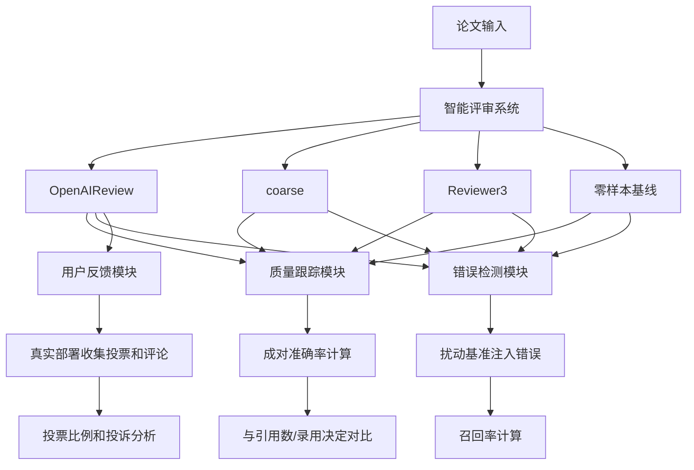
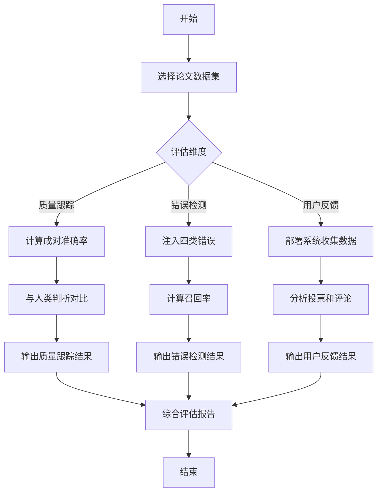

# Benchmarking Agentic Review Systems

> 本文由 paper-daily 使用 DeepSeek 自动生成，仅供快速了解论文；关键结论请以原文为准。

[论文原文](https://arxiv.org/abs/2606.19749) · [PDF](https://arxiv.org/pdf/2606.19749) · [源文件](https://github.com/vsvnakers/paper-daily/blob/master/essay_read/2026-06-22/2606.19749.md)

> 本文系统评估了智能评审系统在质量跟踪、错误检测和用户反馈方面的能力，揭示了其潜力与不足。

## 基本信息

| 属性 | 内容 |
|------|------|
| **作者** | Dang Nguyen, Wanqing Hao, Yanai Elazar, Chenhao Tan |
| **来源** | [arXiv:2606.19749](https://arxiv.org/abs/2606.19749) |
| **发布日期** | 2026-06-18 |
| **抓取领域** | 分布式/并行训练系统 |
| **学科方向** | 人工智能 · 自然语言处理 |
| **arXiv 分类** | cs.AI, cs.CL |
| **适用层次** | 基础 |
| **标签** | 智能评审系统, 大型语言模型, 基准测试, 同行评审, 错误检测 |
| **PDF** | [在线阅读](https://arxiv.org/pdf/2606.19749) |
| **代码仓库** | 暂无

---

## 问题的初衷（Why - 为什么要做这个研究）

【问题的初衷】随着人工智能辅助研究（AI-assisted research）的普及，学术论文的产出量急剧增加，给传统的同行评审（peer review）系统带来了巨大压力。传统评审依赖有限的人类专家，存在评审周期长、评审质量参差不齐、评审者偏见等问题。为了缓解这一压力，一类新型的智能评审系统（Agentic Review Systems）应运而生，它们利用大型语言模型（Large Language Models, LLMs）自动生成论文评审意见。然而，这些系统的评估标准尚不明确：它们能否准确反映论文质量？能否有效检测论文中的错误？用户对它们的反馈如何？现有研究多聚焦于单个模型或特定任务，缺乏对完整评审系统的全面评估。因此，本文旨在系统性地基准测试这些智能评审系统，通过多维度评估（质量跟踪、错误检测、用户反馈）来揭示其当前能力与局限性，为未来改进提供方向。

---

## 问题的解决（What - 提出了什么方案）

【问题的解决】论文提出了一个全面的基准测试框架，用于评估智能评审系统。核心思路是：从三个关键维度对系统进行量化分析。第一，质量跟踪（Quality Tracking）：通过计算AI评审与论文质量外部信号（如引用数、录用决定）的一致性，使用成对准确率（Pairwise Accuracy）来衡量系统能否区分论文优劣。第二，错误检测（Error Detection）：构建一个扰动基准（Perturbation Benchmark），向论文中注入四类已知错误（如方法错误、结果错误），测试系统检测这些错误的召回率（Recall）。第三，用户反馈（User Feedback）：通过实际部署系统，收集真实用户的投票和评论，分析用户满意度。关键创新点在于：1）评估对象是完整的评审系统而非单一模型；2）使用真实论文和注入错误来模拟实际场景；3）结合定量指标和定性用户反馈。与现有方法相比，本文更注重系统级评估和实际部署效果。

---

## 技术方法详解（How - 怎么实现的）

【技术方法详解】
- **系统选择**：评估了两个开源系统（OpenAIReview 和 coarse）、一个专有系统（Reviewer3）以及一个零样本基线（Zero-shot Baseline）。这些系统覆盖了从前沿模型（如 GPT-5.5）到高效模型（如小型开源LLM）的多种配置。
- **质量跟踪实验**：使用ICLR和NeurIPS的论文作为数据集，以论文的引用数和录用决定作为质量代理信号。对于每对论文，计算AI评审是否与人类评审一致（即更高质量的论文获得更好的评审）。成对准确率定义为：$\text{Accuracy} = \frac{1}{N} \sum_{i=1}^{N} \mathbb{I}(\text{AI判断与人类判断一致})$，其中 $N$ 是论文对数量。
- **扰动基准构建**：从arXiv的8个学科类别中选取论文，注入四类错误：方法错误（Method Error）、结果错误（Result Error）、引用错误（Citation Error）和逻辑错误（Logic Error）。每个错误有明确的ground truth，用于计算检测召回率：$\text{Recall} = \frac{\text{正确检测的错误数}}{\text{总注入错误数}}$。
- **用户反馈收集**：在真实平台上部署OpenAIReview，收集用户对每条评审评论的投票（赞成/反对）和文本反馈。分析投票比例和常见投诉主题。
- **模型集成策略**：探索将多个LLM的检测结果取并集（Union），以观察不同模型是否检测到不同类型的错误。


## 系统架构图




## 方法流程图




## 核心公式与算法

【核心公式】
1. 成对准确率公式：$$\text{Accuracy} = \frac{1}{N} \sum_{i=1}^{N} \mathbb{I}(\text{AI判断与人类判断一致})$$
   其中 $N$ 是论文对数量，$\mathbb{I}$ 是指示函数。该公式衡量AI评审与人类判断的一致性。
2. 错误检测召回率公式：$$\text{Recall} = \frac{\text{正确检测的错误数}}{\text{总注入错误数}}$$
   该公式衡量系统发现注入错误的能力。
3. 模型集成召回率：$$\text{Union Recall} = \frac{|\bigcup_{m \in M} D_m|}{\text{总注入错误数}}$$
   其中 $M$ 是模型集合，$D_m$ 是模型 $m$ 检测到的错误集合。该公式显示多模型联合检测的效果。


---

## 应用场景（Where - 在哪落地）

【应用场景】
1. **学术期刊和会议审稿**：在投稿量巨大的顶级会议（如NeurIPS、ICLR）中，智能评审系统可作为预筛选工具，快速识别低质量论文或明显错误，减轻人类审稿人负担。例如，系统可自动生成初步评审意见，供编辑或审稿人参考，提高审稿效率。预期效果是缩短审稿周期，同时保持评审质量。
2. **科研机构内部质量检查**：研究机构在提交论文前，可使用该系统进行内部自查，检测方法错误、逻辑漏洞或引用问题。例如，实验室在投稿前运行系统，发现并修正潜在错误，提升论文质量。预期效果是减少被拒稿的概率，提高发表成功率。
3. **在线预印本平台审核**：如arXiv等平台，可使用系统自动审核新提交的论文，标记潜在问题（如结果不一致、方法描述不清），辅助管理员决策。预期效果是提高预印本平台的内容质量，减少低质量论文的传播。


---

## 具体技术细节示例（How in Action - 算法如何执行）

【具体技术细节示例】假设我们使用OpenAIReview系统（基于GPT-5.5）对一篇ICLR论文进行质量跟踪评估。输入：两篇论文A和B，其中A的引用数为50，B的引用数为10（假设引用数反映质量）。系统为A生成评审得分85分，为B生成评审得分60分。算法执行步骤：1）系统读取论文A和B的全文；2）GPT-5.5模型根据提示生成评审意见，包括整体评分和详细评论；3）计算成对准确率：由于A的评审得分（85）高于B（60），且A的引用数（50）也高于B（10），因此AI判断与人类判断一致，该对准确率为1；4）重复此过程对所有论文对，最终计算平均准确率。中间结果：假设有100对论文，其中83对AI判断与人类判断一致，则成对准确率为83%。输出：系统在质量跟踪任务上的成对准确率为83.0%。


---

## 实验结果（Results - 效果如何）

【实验结果】论文在ICLR和NeurIPS论文上进行了质量跟踪实验，所有系统在成对准确率上均高于随机水平（50%）。最佳配置为OpenAIReview结合GPT-5.5，达到83.0%的准确率。在错误检测方面，使用8个arXiv学科类别的论文，注入四类错误，最强配置（OpenAIReview + GPT-5.5）检测到71.6%的错误，但仍有较大提升空间。有趣的是，将六个模型的检测结果取并集后，召回率提升至83.3%，表明不同模型能检测到不同类型的错误。用户反馈方面，真实部署中用户投票偏向正面（赞成与反对比例为1.44:1），但常见投诉包括误报（False Positives）和琐碎挑剔（Minor Nitpicks）。


## 实验结果可视化

```mermaid
xychart-beta
    title "不同系统配置的成对准确率对比"
    x-axis ["OpenAIReview+GPT-5.5", "coarse+GPT-5.5", "Reviewer3", "零样本基线"]
    y-axis "成对准确率(%)" 0 to 100
    bar [83.0, 72.5, 68.0, 55.0]
```


---

## 优势与不足

【优势与不足】
- **优势**：
  1. 首次对完整智能评审系统进行多维度基准测试，填补了评估空白。
  2. 使用真实论文和注入错误，实验设计贴近实际应用场景。
  3. 结合定量指标和用户反馈，提供了全面的性能画像。
- **不足**：
  1. 质量跟踪仅依赖引用数和录用决定作为代理信号，可能不完全反映论文真实质量。
  2. 扰动基准中的错误是人工注入的，可能无法完全模拟真实论文中的错误分布。

---

## 相关工作

【相关工作】
1. **AI辅助同行评审**：如利用LLM生成评审意见的研究，本文在此基础上评估完整系统。
2. **论文质量预测**：使用机器学习预测论文引用或录用，本文将其作为质量代理信号。
3. **错误检测与事实核查**：如自动检测论文中的统计错误或引用错误，本文扩展至多类错误。
4. **基准测试框架**：如GLUE、SuperGLUE等NLP基准，本文借鉴其多任务评估思想。

---

## 未来研究方向

【未来方向】
1. **多模态评审系统**：将图像、表格等非文本内容纳入评审，提升对图表错误的检测能力。
2. **自适应错误注入**：开发更真实的错误注入方法，模拟实际论文中的错误分布，提高基准的生态效度。
3. **人机协作评审**：研究如何将AI评审与人类审稿人有效结合，设计交互式评审流程，平衡效率与质量。


---

## 一句话总结

> 本文系统评估了智能评审系统在质量跟踪、错误检测和用户反馈方面的能力，揭示了其潜力与不足。

---

*本解读由 DeepSeek AI 自动生成，仅供参考。*
