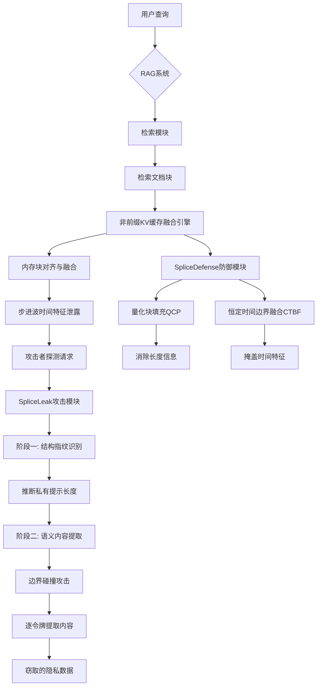
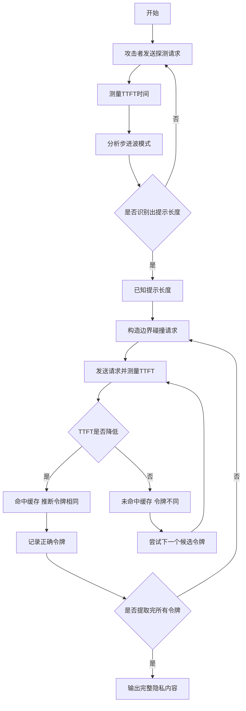
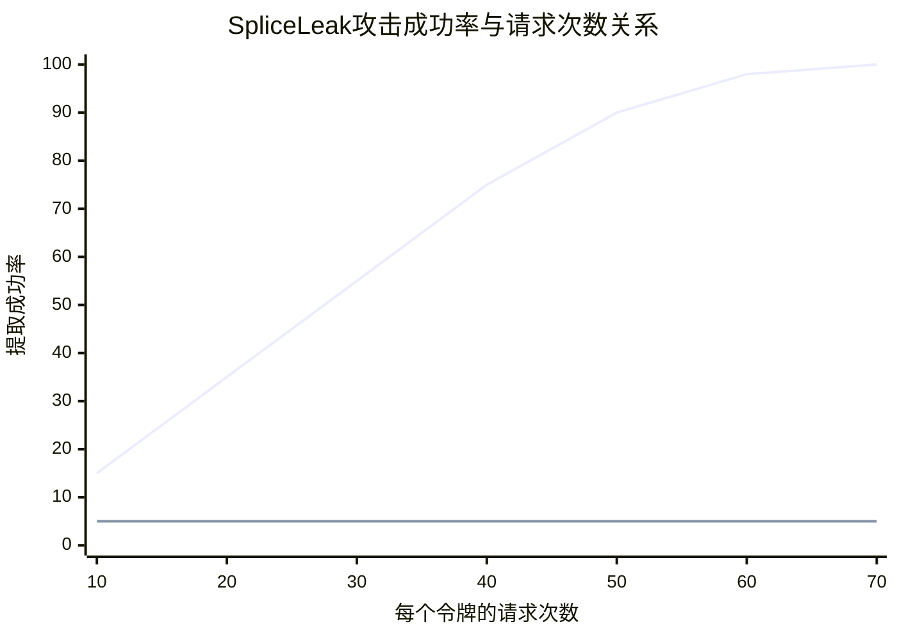

# Agent-Assisted Side-Channel Attacks on Non-Prefix KV Cache in RAG

> 本文由 paper-daily 使用 DeepSeek 自动生成，仅供快速了解论文；关键结论请以原文为准。

[论文原文](https://arxiv.org/abs/2606.21842) · [PDF](https://arxiv.org/pdf/2606.21842) · [源文件](https://github.com/vsvnakers/paper-daily/blob/master/essay_read/2026-06-23/2606.21842.md)

> 首次揭示RAG系统中非前缀KV缓存融合的侧信道漏洞，并提出有效的攻击与防御方法。

## 基本信息

| 属性 | 内容 |
|------|------|
| **作者** | He Sun, Shinan Liu, Siyuan Ma, Junhao Li, Mingjun Xiao, Wenhao Jiang |
| **来源** | [arXiv:2606.21842](https://arxiv.org/abs/2606.21842) |
| **发布日期** | 2026-06-20 |
| **抓取领域** | 自然语言处理 |
| **学科方向** | 安全加密 |
| **arXiv 分类** | cs.CR |
| **适用层次** | 进阶 |
| **标签** | 侧信道攻击, KV缓存, 检索增强生成, 大语言模型安全, 内存融合 |
| **PDF** | [在线阅读](https://arxiv.org/pdf/2606.21842) |
| **代码仓库** | 暂无

---

## 问题的初衷（Why - 为什么要做这个研究）

【问题的初衷】这篇论文聚焦于检索增强生成（Retrieval-Augmented Generation, RAG）系统中一个被忽视的安全漏洞。现代大语言模型（Large Language Model, LLM）服务引擎，如vLLM，为了加速长上下文和多租户推理，广泛采用了RAG和非前缀键值缓存（Key-Value Cache, KV Cache）融合技术。非前缀KV缓存融合允许不同用户请求共享相同的文档块，即使这些请求的前缀不同，从而显著提高内存利用率和推理速度。然而，现有的针对KV缓存的侧信道攻击（Side-Channel Attack）要求攻击者和受害者请求必须具有严格的线性前缀对齐（linear prefix alignment），即共享完全相同的前缀序列。这在现实世界的RAG场景中几乎不可能实现，因为每个用户的查询都包含独特的、用户特定的私有前缀（private prefixes）。因此，现有攻击方法在RAG系统中完全失效。论文的核心动机是揭示一种新型的结构性漏洞：由于分块感知的内存调度（chunk-aware memory scheduling）机制，即为了对齐和融合不连续的内存块而采用的确定性微架构机制，会无意中泄露一种连续的“步进波”（Step-Wave）时间特征。这种物理层面的信息泄露为攻击者提供了新的机会，使得他们能够绕过前缀对齐的限制，对非前缀KV缓存融合发起攻击。这项研究的重要性在于，它首次证明了即使在没有共享前缀的情况下，RAG系统的内存共享机制本身也存在着固有的安全风险，这对广泛部署的LLM服务构成了严重威胁。

---

## 问题的解决（What - 提出了什么方案）

【问题的解决】论文提出了SpliceLeak，这是第一个针对非前缀KV缓存融合的端到端侧信道攻击。SpliceLeak的核心思路是利用KV缓存融合过程中因内存块对齐和融合而产生的确定性时间特征（即“步进波”信号），分两个阶段系统地窃取隐私信息。第一阶段是结构指纹识别（Structural Fingerprinting）：攻击者通过发送精心构造的探测请求，测量并分析服务端返回第一个令牌（Token）的时间（Time to First Token, TTFT），从而精确推断出受害者隐藏的私有提示（private prompt）的长度。第二阶段是语义内容提取（Semantic Content Extraction）：在已知提示长度的基础上，攻击者通过操纵边界碰撞（boundary collisions），即让攻击者的请求与受害者的请求在内存块边界上发生冲突，从而逐令牌（token-by-token）地提取出精确的语义内容。关键创新点在于：1）发现了“步进波”时间特征这一全新的侧信道信息源；2）提出了两阶段攻击流程，将长度推断和内容提取分离，提高了攻击的精确性和效率；3）证明了该攻击在真实的生产级框架（如vLLM集成LMCache）上有效，且能穿透连续的批处理噪声（continuous batching noise）。与现有方法的本质区别在于，SpliceLeak不依赖于共享前缀，而是利用了非前缀KV缓存融合中内存块管理的固有物理特性。

---

## 技术方法详解（How - 怎么实现的）

【技术方法详解】
- **步进波时间特征（Step-Wave Timing Signature）**：论文发现，当KV缓存块在物理内存中不连续时，LMCache等融合引擎会执行确定性的内存对齐和融合操作。这些操作的时间开销与需要融合的内存块数量、大小以及对齐方式呈线性或阶梯状关系，形成一种独特的“步进波”时间模式。攻击者通过测量TTFT可以捕捉到这种模式。
- **两阶段攻击流程**：SpliceLeak分为两个阶段。第一阶段，攻击者发送一系列长度递增的探测请求，记录每个请求的TTFT。通过分析TTFT曲线中的“步进”点，可以精确推断出受害者提示的长度。第二阶段，攻击者利用已知的提示长度，构造与受害者提示在特定内存块边界上对齐的请求。通过观察TTFT的微小变化，可以判断攻击者的令牌是否与受害者的令牌在同一个内存块中，从而逐位或逐令牌地提取内容。
- **边界碰撞攻击（Boundary Collision Attack）**：这是语义内容提取的核心。攻击者构造一个与受害者提示长度相同的探测提示，但最后一个令牌不同。如果该令牌与受害者的最后一个令牌属于同一个KV缓存块，则TTFT会因缓存命中而降低；否则，TTFT会因缓存未命中而升高。通过反复尝试不同的令牌，攻击者可以确定受害者的真实令牌。
- **噪声消除技术**：生产环境中的连续批处理（continuous batching）会引入TTFT噪声。论文通过多次测量取平均、使用统计假设检验（如t检验）以及利用“步进波”信号的确定性特征（如+104 ms的硬件延迟空洞）来消除噪声，确保攻击的可靠性。
- **SpliceDefense防御框架**：作为对策，论文提出了SpliceDefense，包含两个组件：量化块填充（Quantized Chunk Padding, QCP）和恒定时间边界融合（Constant-Time Boundary Fusion, CTBF）。QCP通过向内存块填充随机数据，使其大小对齐到固定的量化级别，从而消除长度信息。CTBF通过引入固定的、与数据无关的延迟来掩盖边界融合的时间特征，使得TTFT不再泄露信息。

## 系统架构图

## 方法流程图

## 核心公式与算法

【核心公式】
1. **TTFT与缓存块数量的关系**：
   $$T_{TTFT} = T_{base} + \sum_{i=1}^{N} (T_{align}(i) + T_{fuse}(i))$$
   其中，$T_{TTFT}$是首个令牌生成时间，$T_{base}$是基础计算时间，$N$是需要融合的内存块数量，$T_{align}(i)$和$T_{fuse}(i)$分别是第$i$个块的对齐和融合时间。这个公式揭示了TTFT与块数量之间的线性关系，是“步进波”特征的基础。

2. **边界碰撞判定条件**：
   $$\Delta T_{TTFT} = T_{TTFT}^{miss} - T_{TTFT}^{hit} > \tau$$
   其中，$\Delta T_{TTFT}$是缓存未命中与命中时的TTFT差值，$\tau$是判定阈值。如果$\Delta T_{TTFT}$大于阈值，则判定为边界碰撞（即攻击者的令牌与受害者的令牌不同），否则判定为缓存命中（令牌相同）。

3. **攻击成功率与请求次数的关系**：
   $$P_{success} = 1 - (1 - p)^k$$
   其中，$p$是单次请求正确推断令牌的概率，$k$是请求次数。这个公式表明，通过增加请求次数，可以指数级地提高攻击成功率，解释了为什么63次请求就能达到接近100%的成功率。

---

## 应用场景（Where - 在哪落地）

【应用场景】
1. **多租户LLM服务中的隐私窃取**：在云服务商提供的LLM API服务中，多个用户共享同一套GPU资源。攻击者可以注册为普通用户，利用SpliceLeak攻击同一GPU上其他用户的RAG查询。例如，攻击者可以窃取竞争对手的商业机密查询、医疗咨询中的患者隐私信息，或法律咨询中的敏感案件细节。通过分析TTFT的微小波动，攻击者能够逐步还原出受害者的完整查询内容，而无需直接访问受害者的内存。预期效果是，攻击者能够以极低的成本（仅需发送API请求）获取高价值的隐私数据。
2. **企业内部RAG系统的数据泄露**：大型企业使用RAG系统来增强内部知识库的问答能力，员工通过该系统查询机密文档。一个恶意的内部员工或外部渗透者可以利用SpliceLeak，通过构造特定的探测查询，推断出其他员工正在查询的文档内容或查询长度。例如，在金融领域，可以窃取关于未公开并购交易的查询；在研发领域，可以窃取关于核心产品设计的查询。预期效果是，攻击者能够绕过传统的访问控制，通过侧信道获取本无权访问的信息。
3. **对抗性提示注入的辅助工具**：SpliceLeak可以作为更复杂攻击的前置步骤。例如，攻击者首先通过SpliceLeak窃取RAG系统的检索文档内容或用户查询的上下文，然后利用这些信息构造高度针对性的对抗性提示（Adversarial Prompt），以诱导LLM产生错误或有害的输出。通过了解受害者查询的具体内容，攻击者可以设计出更有效的提示注入攻击，绕过内容过滤和安全对齐机制。预期效果是，大幅提高下游攻击（如提示注入、越狱攻击）的成功率和破坏力。

---

## 具体技术细节示例（How in Action - 算法如何执行）

【具体技术细节示例】
假设受害者查询是“What is the capital of France?”，其私有提示长度为5个令牌（假设分词后为[What, is, the, capital, of]）。攻击者不知道具体内容，但想窃取。

**第一阶段：结构指纹识别**
攻击者发送一系列探测请求，长度分别为1, 2, 3, 4, 5, 6个令牌。记录每个请求的TTFT。假设TTFT曲线在长度为5时出现一个明显的“步进”跳变（例如，从100ms跳到110ms），攻击者推断出受害者提示长度为5。

**第二阶段：语义内容提取**
攻击者已知长度为5，开始猜测第一个令牌。
1. 攻击者构造探测请求，长度为5，第一个令牌设为“What”（候选令牌），其余4个令牌为填充令牌（如[PAD]）。
2. 发送请求，测量TTFT。假设TTFT为100ms（缓存命中），说明“What”与受害者第一个令牌相同。
3. 攻击者记录第一个令牌为“What”。
4. 攻击者继续猜测第二个令牌。构造探测请求，前两个令牌为[What, is]，后三个为[PAD]。
5. 发送请求，测量TTFT。假设TTFT为100ms（命中），记录第二个令牌为“is”。
6. 重复此过程，直到所有5个令牌都被猜出。

**关键决策点**：在猜测每个令牌时，攻击者需要尝试多个候选令牌（如词汇表中的所有词）。对于每个候选，发送一次探测请求并测量TTFT。TTFT较低（命中）的候选即为正确令牌。

**数据结构变化**：攻击者维护一个逐步增长的已推断令牌序列。初始为空，每成功推断一个令牌，就将其追加到序列末尾。最终，攻击者得到完整的提示序列[What, is, the, capital, of]。

**输出结果**：攻击者成功窃取了受害者查询的前5个令牌，即“What is the capital of”。结合后续的令牌提取，可以完全还原查询内容。

---

## 实验结果（Results - 效果如何）

【实验结果】论文在集成LMCache的生产级vLLM框架上进行了评估。实验设置包括使用多种LLM模型（如Llama系列）和标准RAG数据集。对比方法包括随机猜测和基于前缀对齐的传统侧信道攻击。关键实验结果表明：1）在有限熵（bounded-entropy）场景下，SpliceLeak实现了高达100%的提取成功率（extraction success rate）。2）攻击效率很高，每个令牌平均仅需63次请求（requests per token），这得益于+104 ms的确定性硬件延迟空洞（hardware latency void）带来的高信噪比。3）攻击能够穿透现实世界中连续的批处理噪声（continuous batching noise），证明了其鲁棒性。4）提出的SpliceDefense防御机制能有效扁平化侧信道信号，使得TTFT差异（Delta TTFT）趋近于0，同时仅带来可忽略的吞吐量开销（negligible throughput overhead），从而保留了全局缓存共享的关键优势。

## 实验结果可视化

---

## 优势与不足

【优势与不足】
**优势：**
1. **开创性**：首次揭示了非前缀KV缓存融合中的侧信道漏洞，填补了该领域的研究空白。
2. **高成功率**：在有限熵场景下实现了100%的提取成功率，攻击效果显著。
3. **实用性强**：攻击针对生产级框架（vLLM+LMCache），并考虑了连续批处理噪声，具有很高的现实威胁性。
4. **防御方案有效**：提出的SpliceDefense在消除侧信道信号的同时，对性能影响极小，具有实用价值。

**不足：**
1. **场景限制**：攻击在有限熵场景下表现最佳，对于高熵或随机性极强的提示内容，成功率可能会下降。
2. **依赖物理特征**：攻击依赖于特定的硬件和软件实现产生的“步进波”特征，如果底层内存管理机制发生变化（如使用不同的缓存融合算法），攻击可能失效。
3. **请求数量**：虽然每个令牌仅需63次请求，但对于长提示，总请求数仍然可观，可能触发服务端的速率限制或异常检测。

---

## 相关工作

【相关工作】
1. **传统KV缓存侧信道攻击**：如针对共享前缀的KV缓存攻击，本文的工作是首次突破前缀限制。
2. **RAG系统安全**：研究RAG系统中检索文档的投毒、隐私泄露等问题，本文关注的是推理阶段的缓存侧信道。
3. **微架构侧信道攻击**：如基于时间、功耗、缓存的攻击，本文利用了内存融合的时序特征。
4. **LLM推理优化**：如vLLM、LMCache等系统，本文揭示了这些优化技术引入的新安全风险。
5. **差分隐私与记忆化**：研究如何防止模型记忆训练数据，本文关注的是运行时缓存中的隐私泄露。

---

## 未来研究方向

【未来方向】
1. **更通用的攻击方法**：研究如何将SpliceLeak扩展到其他类型的缓存融合机制或不同的LLM服务架构（如TensorRT-LLM），使其不依赖于特定的“步进波”特征。
2. **自动化攻击工具**：开发一个全自动化的攻击工具，能够自动识别目标系统的缓存特征、调整攻击参数、并处理噪声，降低攻击门槛。
3. **硬件级防御**：探索在GPU或内存控制器硬件层面实现恒定时间的内存操作，从根本上消除侧信道信息泄露，而不是依赖软件补丁。

---

## 一句话总结

> 首次揭示RAG系统中非前缀KV缓存融合的侧信道漏洞，并提出有效的攻击与防御方法。

---

*本解读由 DeepSeek AI 自动生成，仅供参考。*
