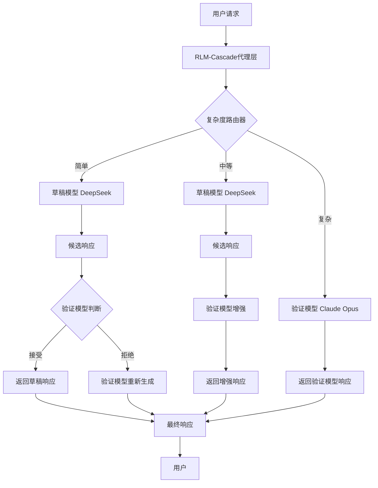
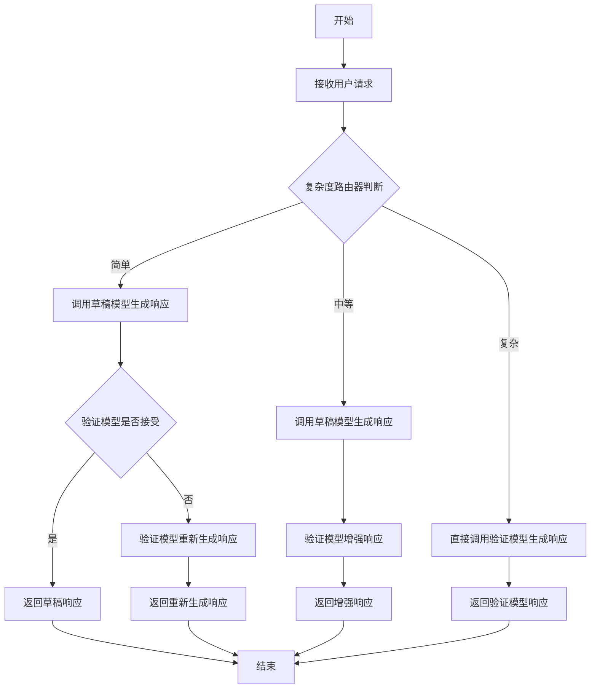

# RLM-Cascade: Response-Level Speculative Decoding for Cost-Efficient LLM API Serving

> 本文由 paper-daily 使用 DeepSeek 自动生成，仅供快速了解论文；关键结论请以原文为准。

[论文原文](https://arxiv.org/abs/2606.22840) · [PDF](https://arxiv.org/pdf/2606.22840) · [源文件](https://github.com/vsvnakers/paper-daily/blob/master/essay_read/2026-06-23/2606.22840.md)

> RLM-Cascade通过响应级推测解码和轻量级路由器，在代理层实现LLM API成本降低45.8%且质量无损。

## 基本信息

| 属性 | 内容 |
|------|------|
| **作者** | Haifeng Wu, Srinivasan Manoharan, Fangbo Tu, Junhua Zhao, Jian Wan |
| **来源** | [arXiv:2606.22840](https://arxiv.org/abs/2606.22840) |
| **发布日期** | 2026-06-22 |
| **抓取领域** | LLM推理 · 内存与加速 |
| **学科方向** | 机器学习 |
| **arXiv 分类** | cs.LG |
| **适用层次** | 进阶 |
| **标签** | 推测解码, 模型级联, 成本优化, LLM API, 代理层 |
| **PDF** | [在线阅读](https://arxiv.org/pdf/2606.22840) |
| **代码仓库** | 暂无

---

## 问题的初衷（Why - 为什么要做这个研究）

【问题的初衷】这篇论文旨在解决大型语言模型（Large Language Model, LLM）在作为应用程序编程接口（Application Programming Interface, API）服务时面临的高昂成本问题。随着LLM在各类应用中的普及，尤其是需要多次调用的智能体（Agent）场景，API调用成本迅速累积，成为大规模部署的主要瓶颈。现有方法如推测解码（Speculative Decoding）虽能加速推理，但通常需要修改模型架构或共享词表（Vocabulary），且主要关注单次推理的延迟优化，而非整体API调用成本。此外，直接使用更便宜的模型（如DeepSeek）虽然成本低，但质量往往不如顶级模型（如Claude Opus）。因此，如何在保持高质量输出的前提下，显著降低API调用成本，同时不牺牲甚至改善端到端延迟，成为一个关键挑战。RLM-Cascade通过引入响应级（Response-Level）推测解码，在代理层（Proxy-Layer）实现成本效益优化，无需访问模型架构或共享词表，为LLM API服务提供了一种新颖且实用的解决方案。

---

## 问题的解决（What - 提出了什么方案）

【问题的解决】RLM-Cascade提出了一种代理层系统，通过在响应级别应用推测解码来降低LLM API成本。其核心思路是：使用一个快速、廉价的草稿模型（Draft Model，如DeepSeek）生成候选响应，然后由一个能力更强的验证模型（Verify Model，如Claude Opus）根据一个轻量级的复杂度路由器（Complexity Router）的决策，选择接受、增强或完全绕过该候选响应。关键创新点包括：1）响应级推测解码，不同于传统的令牌级（Token-Level）推测解码，它直接对完整响应进行推测，避免了逐令牌验证的开销；2）轻量级复杂度路由器，基于规则（Rule-Based）判断请求的复杂度，从而决定是否使用草稿模型、验证模型或直接跳过；3）混合工具调用策略（Hybrid Tool-Call Strategy），对于模式关键的工具选择（Tool-Selection）请求，绕过推测流水线，确保准确性。与现有方法的本质区别在于，RLM-Cascade不修改模型内部结构，而是作为一个代理层，灵活地组合不同模型，实现成本与质量的平衡。

---

## 技术方法详解（How - 怎么实现的）

【技术方法详解】
- **响应级推测解码（Response-Level Speculative Decoding）**：不同于传统推测解码在令牌级别进行推测和验证，RLM-Cascade在完整响应级别操作。草稿模型生成整个候选响应，验证模型仅需判断该响应是否可接受，或进行增强。这大幅减少了验证模型的调用次数，从而降低成本。
- **轻量级复杂度路由器（Complexity Router）**：该路由器基于规则，分析输入请求的特征（如长度、任务类型、是否包含工具调用等），将其分类为简单（Simple）、中等（Medium）或复杂（Complex）。简单请求直接使用草稿模型响应（SKIPPED路径），中等请求由验证模型增强（ENHANCED路径），复杂请求则完全由验证模型生成（FULL路径）。
- **混合工具调用策略（Hybrid Tool-Call Strategy）**：对于需要精确工具选择的请求（如API调用、数据库查询），RLM-Cascade绕过推测流水线，直接使用验证模型，以避免草稿模型可能产生的错误工具选择。
- **代理层架构（Proxy-Layer Architecture）**：系统作为一个代理层，位于用户和LLM API之间。用户请求首先到达代理，代理根据路由器决策，选择调用草稿模型或验证模型，并返回最终响应。这种设计无需修改任何模型，易于部署。
- **成本与延迟优化**：通过最大化草稿模型的使用率（Draft-Use Rate），RLM-Cascade显著降低了API成本。同时，由于简单请求的快速响应，端到端延迟也得到改善。论文中报告了88.8%的草稿使用率和45.8%的成本降低。

## 系统架构图

## 方法流程图

## 核心公式与算法

【核心公式】
论文中未提供显式公式，但核心思想可表示为成本优化目标：
$$\text{Cost}_{\text{total}} = \sum_{i=1}^{N} \left( \mathbb{I}_{\text{draft}}(i) \cdot C_{\text{draft}} + \mathbb{I}_{\text{verify}}(i) \cdot C_{\text{verify}} \right)$$
其中，$\mathbb{I}_{\text{draft}}(i)$ 和 $\mathbb{I}_{\text{verify}}(i)$ 分别表示第 $i$ 个请求是否使用草稿模型和验证模型，$C_{\text{draft}}$ 和 $C_{\text{verify}}$ 是相应模型的成本。目标是最大化草稿使用率，即 $\sum \mathbb{I}_{\text{draft}}(i) / N$。

---

## 应用场景（Where - 在哪落地）

【应用场景】
- **智能体编码助手（Agentic Coding Assistant）**：如Claude Code，开发者通过自然语言指令让AI代理完成编码任务。RLM-Cascade可部署为代理层，对简单指令（如代码补全）使用草稿模型快速响应，对复杂任务（如架构设计）使用验证模型确保质量。预期效果：降低API成本45%以上，同时保持响应速度，提升开发者体验。
- **客户服务聊天机器人（Customer Service Chatbot）**：企业使用LLM API构建客服系统，处理大量用户查询。RLM-Cascade可区分简单查询（如账户余额查询）和复杂查询（如投诉处理），简单查询由草稿模型处理，复杂查询由验证模型处理。预期效果：显著降低运营成本，同时保证关键查询的准确性。
- **内容生成平台（Content Generation Platform）**：如自动写作、营销文案生成。RLM-Cascade可对简单模板化内容（如产品描述）使用草稿模型，对创意性内容（如广告文案）使用验证模型。预期效果：在保持内容质量的同时，降低API调用成本，提高平台利润率。

---

## 具体技术细节示例（How in Action - 算法如何执行）

【具体技术细节示例】
假设用户请求为：“请编写一个Python函数，计算斐波那契数列的第n项。”
1. **输入**：请求文本“请编写一个Python函数，计算斐波那契数列的第n项。”
2. **复杂度路由器判断**：路由器分析请求，发现是标准编码任务，无工具调用，长度适中，判定为“简单”。
3. **草稿模型生成**：调用DeepSeek模型，生成候选响应：“def fibonacci(n):\n    if n <= 0:\n        return 0\n    elif n == 1:\n        return 1\n    else:\n        a, b = 0, 1\n        for _ in range(2, n+1):\n            a, b = b, a + b\n        return b”。
4. **验证模型判断**：将候选响应发送给Claude Opus，验证模型检查代码正确性、风格和完整性。判断为可接受。
5. **输出**：返回草稿模型的响应。

如果请求为：“请编写一个Python函数，计算斐波那契数列的第n项，并使用装饰器记录执行时间。”路由器可能判定为“中等”，因为涉及装饰器。草稿模型生成响应后，验证模型会增强，添加装饰器实现。如果请求为：“请编写一个Python函数，计算斐波那契数列的第n项，并调用外部API获取历史数据。”路由器判定为“复杂”，直接调用验证模型生成响应。

---

## 实验结果（Results - 效果如何）

【实验结果】论文在真实世界的智能体编码工作负载（Claude Code）上进行了实验，涉及125个生产请求。主要结果包括：1）草稿使用率达到88.8%，即大部分请求由草稿模型处理；2）相对于直接使用Claude Opus的基线，API成本降低了45.8%；3）反直觉的是，端到端延迟也得到改善：中位响应时间为2026毫秒，而原生Opus为3698毫秒，实现了1.83倍的加速（p50）；4）质量方面，RLM-Cascade在20个任务的代码/数学/指令基准测试中达到100%的通过率，而原生Opus为95%。这些结果证明了RLM-Cascade在成本、延迟和质量上的综合优势。

## 实验结果可视化

```mermaid
xychart-beta
    title "RLM-Cascade vs Native Opus 性能对比"
    x-axis ["成本降低", "延迟加速", "基准通过率"]
    y-axis "百分比/倍数" 0 --> 200
    bar [45.8, 183, 100]
    bar [0, 100, 95]
```

---

## 优势与不足

【优势与不足】
**优势：**
- **显著降低成本**：通过最大化草稿模型使用率，实现45.8%的API成本降低，对大规模部署极具吸引力。
- **改善端到端延迟**：简单请求的快速响应使中位延迟降低近一半，提升了用户体验。
- **保持高质量**：在基准测试中达到100%通过率，甚至超过原生Opus，证明质量无损。
- **无需修改模型**：作为代理层部署，不要求访问模型架构或共享词表，兼容性强。

**不足：**
- **依赖规则路由器**：复杂度路由器基于规则，可能无法适应所有场景，需要人工调整规则。
- **草稿模型选择**：当前使用DeepSeek作为草稿模型，其性能可能影响整体效果，更换模型需重新评估。
- **工具调用场景限制**：混合工具调用策略绕过推测流水线，可能降低效率，但保证了准确性。

---

## 相关工作

【相关工作】
- **推测解码（Speculative Decoding）**：传统推测解码在令牌级别加速推理，RLM-Cascade将其扩展到响应级别，降低成本。
- **模型级联（Model Cascades）**：使用多个模型按复杂度处理请求，RLM-Cascade通过路由器实现类似级联，但更灵活。
- **代理层优化（Proxy-Layer Optimization）**：在API调用前添加代理层进行缓存、路由等优化，RLM-Cascade是此方向的具体应用。
- **成本感知推理（Cost-Aware Inference）**：研究如何平衡推理成本与质量，RLM-Cascade通过响应级推测实现成本效益。
- **智能体系统（Agent Systems）**：如Claude Code，需要多次LLM调用，RLM-Cascade针对此类场景优化。

---

## 未来研究方向

【未来方向】
- **自适应路由器（Adaptive Router）**：当前路由器基于规则，未来可引入机器学习模型，根据历史数据动态调整路由策略，进一步优化成本与质量。
- **多草稿模型协作（Multi-Draft Model Collaboration）**：使用多个不同能力的草稿模型，根据请求复杂度选择最合适的模型，提高草稿使用率。
- **端到端延迟优化（End-to-End Latency Optimization）**：结合缓存、预取等技术，进一步减少延迟，特别是在复杂请求场景下。

---

## 一句话总结

> RLM-Cascade通过响应级推测解码和轻量级路由器，在代理层实现LLM API成本降低45.8%且质量无损。

---

*本解读由 DeepSeek AI 自动生成，仅供参考。*
