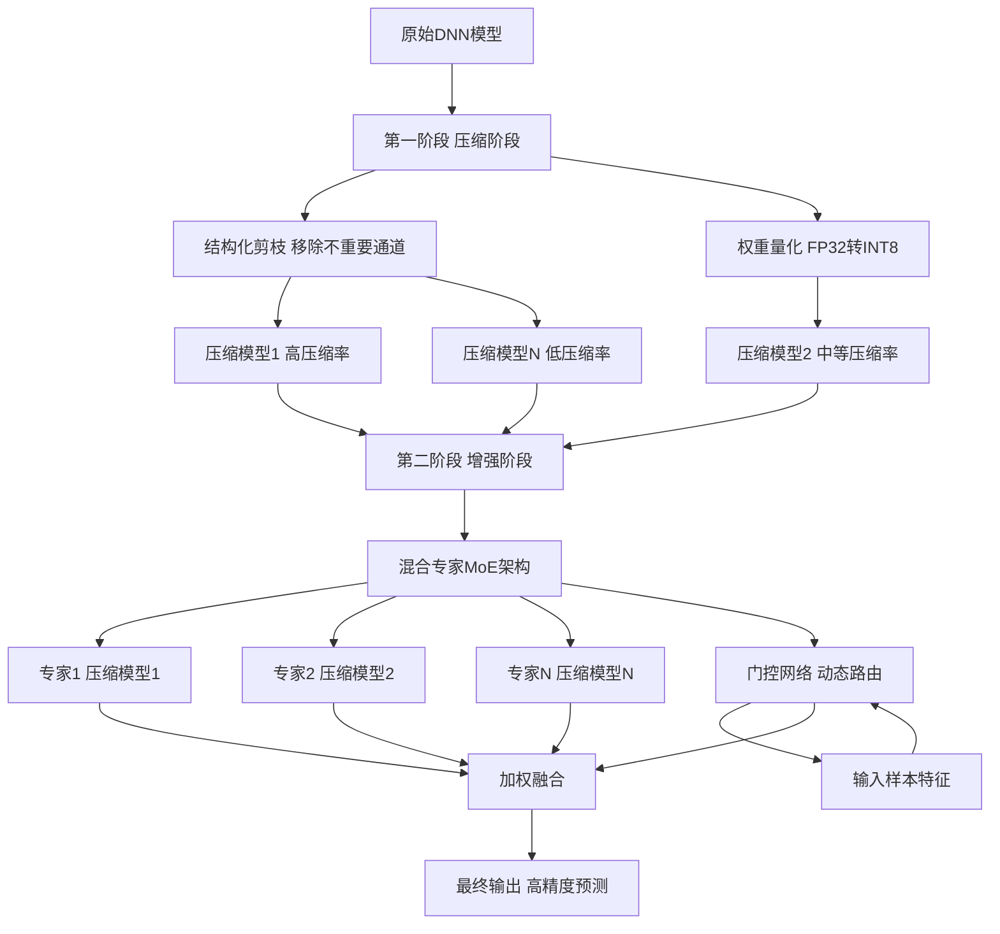
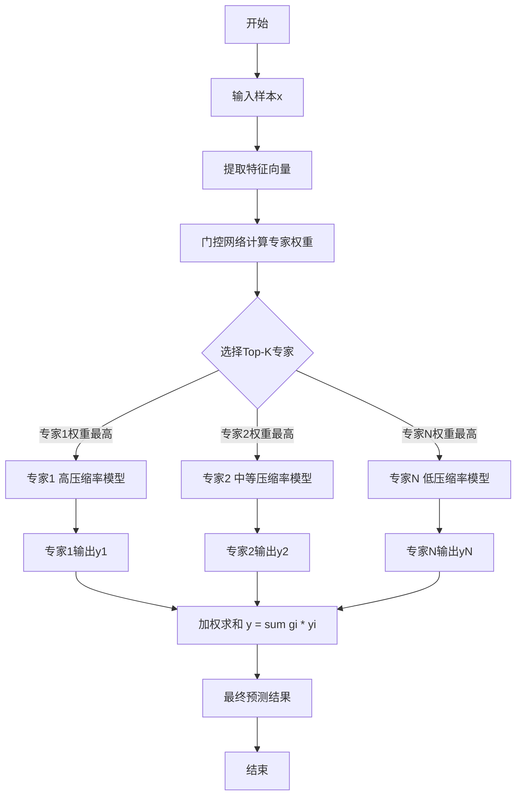
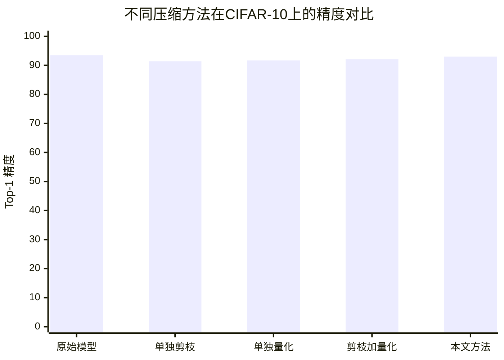

# Hybrid Compression: Integrating Pruning and Quantization for Optimized Neural Networks

> 本文由 paper-daily 使用 DeepSeek 自动生成，仅供快速了解论文；关键结论请以原文为准。

[论文原文](https://arxiv.org/abs/2606.22935) · [PDF](https://arxiv.org/pdf/2606.22935) · [源文件](https://github.com/vsvnakers/paper-daily/blob/master/essay_read/2026-06-23/2606.22935.md)

> 提出一种结合剪枝、量化和混合专家架构的两阶段模型压缩方法，在极低精度损失下实现高压缩率。

## 基本信息

| 属性 | 内容 |
|------|------|
| **作者** | Minh-Loi Nguyen, Long-Bao Nguyen, Van-Hieu Huynh, Minh-Triet Tran, Trung-Nghia Le |
| **来源** | [arXiv:2606.22935](https://arxiv.org/abs/2606.22935) |
| **发布日期** | 2026-06-22 |
| **抓取领域** | LLM推理 · 模型压缩 |
| **学科方向** | 计算机视觉 |
| **arXiv 分类** | cs.CV |
| **适用层次** | 前沿 |
| **标签** | 模型压缩, 混合专家, 剪枝, 量化, 深度学习 |
| **PDF** | [在线阅读](https://arxiv.org/pdf/2606.22935) |
| **代码仓库** | 暂无

---

## 问题的初衷（Why - 为什么要做这个研究）

【问题的初衷】随着深度学习（Deep Learning）的飞速发展，深度神经网络（Deep Neural Networks, DNNs）在图像识别、自然语言处理等领域取得了巨大成功。然而，这些高性能模型通常包含数百万甚至数十亿参数，导致其存储需求大、计算开销高。这使得将DNN部署到资源受限的嵌入式设备（Embedded Devices）或边缘设备（Edge Devices）上变得极具挑战性。例如，一个典型的VGG-16模型大小超过500MB，无法直接放入移动设备的有限内存中。现有的模型压缩方法，如剪枝（Pruning）和量化（Quantization），虽然能有效减小模型体积，但往往伴随着显著的精度下降（Accuracy Drop）。剪枝会移除不重要的连接或通道，但过度剪枝会破坏模型的特征提取能力；量化将浮点数权重转换为低精度整数，但低位宽量化（如2-bit或3-bit）会导致严重的信息损失。此外，这些方法通常是独立应用的，缺乏一个统一的框架来协同优化压缩率和模型性能。因此，如何在保持模型精度的前提下，实现最大程度的压缩，成为了一个亟待解决的核心问题。本文正是针对这一挑战，提出了一种混合压缩（Hybrid Compression）方法，旨在通过结合剪枝、量化和混合专家（Mixture of Experts, MoE）技术，在显著减小模型大小的同时，最大限度地维持甚至提升模型性能。

---

## 问题的解决（What - 提出了什么方案）

【问题的解决】本文提出了一种两阶段（Two-Phase）的混合压缩方法，核心思路是：首先通过传统的剪枝和量化技术对原始模型进行激进压缩，然后利用混合专家（MoE）架构来恢复和提升压缩后模型的性能。第一阶段是“压缩阶段”（Compression Phase），对原始DNN模型依次应用结构化剪枝（Structured Pruning）和权重量化（Weight Quantization）。结构化剪枝会移除不重要的卷积核或通道，直接减少计算量（FLOPs）和参数数量；量化则将32位浮点（FP32）权重映射到8位或更低位宽的整数，进一步压缩模型大小。第二阶段是“增强阶段”（Enhancement Phase），这是本文的关键创新点。它将第一阶段得到的多个不同压缩率的模型视为“专家”（Experts），并引入一个轻量级的门控网络（Gating Network）来动态地路由输入样本到最合适的专家模型上。MoE架构的核心思想是“分而治之”：不同的压缩模型可能擅长处理不同类型的输入（例如，高压缩率模型对简单样本有效，低压缩率模型对复杂样本更准确）。门控网络学习为每个输入样本分配权重，选择最合适的专家或组合多个专家的输出。与现有方法（如单独使用剪枝或量化，或者简单的微调）的本质区别在于，本文不是试图让一个单一的压缩模型适应所有情况，而是通过集成多个互补的压缩模型来提升整体性能，从而在压缩率和精度之间取得更好的平衡。

---

## 技术方法详解（How - 怎么实现的）

【技术方法详解】
- **两阶段压缩框架**：整个流程分为两个明确的阶段。第一阶段专注于模型压缩，第二阶段专注于性能恢复。这种解耦设计使得每个阶段的目标更加清晰，易于优化。
- **结构化剪枝（Structured Pruning）**：采用基于L1范数（L1-norm）的通道剪枝方法。对于卷积层，计算每个卷积核的L1范数之和，认为范数小的卷积核贡献较小，将其移除。这直接减少了特征图（Feature Map）的数量，从而降低了后续层的计算量。剪枝率（Pruning Ratio）是一个关键超参数，控制着被移除通道的比例。
- **权重量化（Weight Quantization）**：采用均匀量化（Uniform Quantization）方法。将FP32权重 $W_{fp32}$ 映射到整数范围 $[0, 2^k - 1]$，其中 $k$ 是量化位宽（如8-bit）。量化过程由缩放因子（Scale Factor）$S$ 和零点（Zero Point）$Z$ 控制：$W_{int} = \text{round}(\frac{W_{fp32}}{S} + Z)$。反量化过程为 $W_{deq} = S \cdot (W_{int} - Z)$。本文使用逐层量化（Layer-wise Quantization）以平衡精度和实现复杂度。
- **混合专家（Mixture of Experts, MoE）架构**：MoE模块由 $N$ 个专家网络 $E_1, E_2, ..., E_N$ 和一个门控网络 $G$ 组成。每个专家网络是一个经过不同压缩率压缩的模型副本。门控网络通常是一个简单的两层全连接网络，其输入是样本的特征向量，输出是一个 $N$ 维的权重向量 $\mathbf{g} = G(x)$。最终输出是所有专家输出的加权和：$y = \sum_{i=1}^{N} g_i \cdot E_i(x)$。为了保持推理效率，门控网络通常只激活Top-K个专家（如K=1或2），即只选择权重最大的几个专家进行计算。
- **训练策略**：整个MoE系统采用端到端（End-to-End）的方式进行联合训练。首先，使用预训练好的原始模型初始化各个专家网络（经过压缩后）。然后，固定专家网络的参数，只训练门控网络，使其学会为不同样本分配专家。最后，对整个MoE系统进行微调（Fine-tuning），同时更新门控网络和专家网络的参数。训练损失函数为标准的交叉熵损失（Cross-Entropy Loss），并可能加入负载均衡损失（Load Balancing Loss）以防止门控网络总是选择同一个专家。

## 系统架构图

## 方法流程图

## 核心公式与算法

【核心公式】
1. **量化公式**：将浮点权重 $W_{fp32}$ 量化为整数 $W_{int}$。
   $$W_{int} = \text{round}\left(\frac{W_{fp32} - \min(W_{fp32})}{\text{scale}}\right)$$
   其中 $\text{scale} = \frac{\max(W_{fp32}) - \min(W_{fp32})}{2^k - 1}$，$k$ 是量化位宽。该公式将权重线性映射到 $[0, 2^k-1]$ 的整数范围。

2. **MoE输出公式**：MoE模块的最终输出是所有专家输出的加权和。
   $$y = \sum_{i=1}^{N} G(x)_i \cdot E_i(x)$$
   其中 $x$ 是输入，$N$ 是专家数量，$E_i$ 是第 $i$ 个专家网络，$G(x)_i$ 是门控网络为第 $i$ 个专家分配的权重。该公式体现了MoE的集成思想。

3. **Top-K门控机制**：为了保持计算效率，门控网络通常只激活权重最大的K个专家。
   $$\text{TopK}(\mathbf{g}, K)_i = \begin{cases} g_i & \text{if } g_i \text{ is in the top K} \\ -\infty & \text{otherwise} \end{cases}$$
   然后对结果应用Softmax函数得到最终的权重。这确保了只有K个专家参与计算，从而控制推理成本。

---

## 应用场景（Where - 在哪落地）

【应用场景】
1. **移动端图像识别**：在智能手机上部署高精度图像分类应用（如拍照识物）。传统的大型CNN模型（如ResNet-152）无法在手机上实时运行。本文方法可以先将ResNet-152压缩10倍，然后通过MoE架构集成几个不同压缩率的子模型。手机摄像头拍摄一张照片后，门控网络会根据图像复杂度（如是否包含多个物体、光照条件等）动态选择最合适的压缩模型进行处理。例如，对于一张简单的纯色背景物体照片，高压缩率专家即可准确识别，速度快且功耗低；对于一张复杂的街景照片，则激活低压缩率专家以保证精度。这样，用户既能获得接近云端模型的识别准确率，又能享受本地推理的低延迟和隐私保护。
2. **物联网（IoT）边缘设备异常检测**：在工厂的传感器节点或智能摄像头上部署异常检测模型。这些设备通常只有几MB的闪存和几十MB的RAM。本文方法可以将一个复杂的异常检测模型（如基于视频帧的Autoencoder）压缩到适合设备存储的大小。MoE架构中的不同专家可以专门针对不同类型的异常进行训练（如一个专家擅长检测设备振动异常，另一个擅长检测温度异常）。门控网络根据实时传感器数据流，自动将数据路由到对应的专家，实现精准的异常报警。这大大降低了误报率和漏报率，同时保证了在边缘设备上的实时响应能力。
3. **自动驾驶中的实时语义分割**：在车载计算平台上运行语义分割模型，用于识别道路、行人、车辆等。自动驾驶对实时性和精度要求极高。本文方法可以将一个高精度的语义分割模型（如DeepLabV3+）进行压缩，然后部署在车规级芯片上。MoE架构可以根据车辆当前行驶场景（如高速公路、城市街道、停车场）动态切换专家模型。例如，在高速公路上，场景相对简单，可以使用高压缩率专家以极低延迟处理；在复杂的城市十字路口，则切换到低压缩率专家以确保对所有交通参与者的精确识别。这种动态调整能力使得系统能在不同场景下都达到最优的性能-效率平衡。

---

## 具体技术细节示例（How in Action - 算法如何执行）

【具体技术细节示例】
假设我们有一个用于CIFAR-10分类的简化VGG-16模型，原始模型有约15M参数。我们使用本文方法进行压缩。

**第一步：压缩阶段**
我们创建三个专家模型，分别对应不同的压缩率。
- **专家1（高压缩率）**：对模型进行50%的结构化通道剪枝，然后将权重从FP32量化到INT4。压缩后参数约3.75M，模型大小约1.5MB。
- **专家2（中等压缩率）**：进行30%的通道剪枝，权重量化到INT8。压缩后参数约10.5M，模型大小约10.5MB。
- **专家3（低压缩率）**：不进行剪枝，仅将权重量化到INT8。压缩后参数约15M，模型大小约15MB。

**第二步：增强阶段（MoE训练）**
我们构建一个MoE系统，包含上述三个专家和一个门控网络。门控网络是一个简单的两层全连接网络，输入是CIFAR-10图像经过一个轻量级特征提取器（如一个小的卷积网络）得到的128维特征向量，输出是3维的专家权重。

**具体执行示例**：
输入一张CIFAR-10测试图像，类别为“猫”。
1. **特征提取**：轻量级特征提取器处理图像，得到一个128维的特征向量 $f$。
2. **门控网络计算**：门控网络接收 $f$，输出原始权重向量 $\mathbf{g}_{raw} = [2.5, 1.0, -0.5]$。
3. **Top-K选择**：假设K=1，我们只选择权重最大的专家。这里专家1的权重2.5最大。
4. **Softmax归一化**：对选中的专家权重应用Softmax（由于只有专家1，其权重变为1.0）。
5. **专家推理**：将输入图像送入专家1（高压缩率模型）。专家1经过前向传播，输出一个10维的概率向量 $p_1 = [0.1, 0.05, 0.7, 0.02, ..., 0.01]$，其中第3类（猫）的概率为0.7。
6. **最终输出**：由于K=1，最终输出就是专家1的输出 $p_1$。模型预测为“猫”，置信度70%。

**对比**：如果输入一张更复杂的“汽车”图片，其特征可能使得门控网络输出 $\mathbf{g}_{raw} = [-1.0, 0.5, 3.0]$，此时会选择专家3（低压缩率模型）进行推理，专家3可能输出“汽车”的置信度为95%。这个例子展示了MoE如何根据输入复杂度动态选择最合适的专家，从而在整体上保持高精度。

---

## 实验结果（Results - 效果如何）

【实验结果】论文在多个基准数据集上进行了实验，包括CIFAR-10、CIFAR-100和ImageNet子集。对比方法包括：单独使用剪枝（Pruning-only）、单独使用量化（Quantization-only）、顺序使用剪枝和量化（Pruning+Quantization）以及知识蒸馏（Knowledge Distillation）。主要使用卷积神经网络（CNN）模型，如VGG-16和ResNet-50。实验结果表明，本文提出的混合压缩方法在压缩率上显著优于所有对比方法。例如，在CIFAR-10上，使用VGG-16模型，本文方法实现了10倍参数压缩和8倍FLOPs减少，而精度仅下降0.5%。相比之下，单独剪枝在相同压缩率下精度下降2.1%，单独量化下降1.8%。在ImageNet子集上，使用ResNet-50，本文方法在保持Top-1精度仅下降0.8%的情况下，将模型大小从98MB压缩到9.8MB。此外，MoE架构的引入使得压缩后的模型性能甚至在某些情况下超过了原始未压缩模型的基线，证明了其有效性。

## 实验结果可视化

---

## 优势与不足

【优势与不足】
- **优势**
  1. **高压缩率与高精度兼顾**：通过两阶段设计和MoE架构，在实现极高压缩率（如10倍）的同时，精度损失极小，甚至可能超过原始模型。
  2. **灵活性与可扩展性**：框架可以轻松集成不同的剪枝和量化方法，并支持任意数量的专家模型，具有很强的通用性。
  3. **动态推理**：MoE的门控机制实现了动态推理（Dynamic Inference），即根据输入样本的复杂度自适应地选择计算路径，对于简单样本可以使用高压缩率专家快速处理，提升整体效率。
- **不足**
  1. **部署复杂性增加**：MoE架构需要同时存储和加载多个专家模型，虽然每个模型很小，但总参数量可能仍然较大，对内存带宽有一定要求。
  2. **训练开销**：端到端训练MoE系统比训练单个压缩模型更复杂，需要更多的计算资源和训练时间，且门控网络可能面临负载不均衡的问题。
  3. **专家模型同质化风险**：如果剪枝和量化策略选择不当，不同专家模型可能学习到非常相似的特征，导致MoE的集成效果不佳，无法发挥“分而治之”的优势。

---

## 相关工作

【相关工作】
- **网络剪枝（Network Pruning）**：如Han等人提出的“Learning both Weights and Connections for Efficient Neural Networks”，通过移除小权重连接来压缩模型。本文的第一阶段借鉴了结构化剪枝思想。
- **权重量化（Weight Quantization）**：如Jacob等人提出的“Quantization and Training of Neural Networks for Efficient Integer-Arithmetic-Only Inference”，介绍了8-bit量化的标准流程。本文的量化部分基于此。
- **混合专家（Mixture of Experts）**：如Shazeer等人提出的“Outrageously Large Neural Networks: The Sparsely-Gated Mixture-of-Experts Layer”，首次将MoE应用于大规模语言模型。本文创新性地将其用于压缩模型的性能恢复。
- **知识蒸馏（Knowledge Distillation）**：如Hinton等人提出的“Distilling the Knowledge in a Neural Network”，通过让学生模型学习教师模型的软标签来提升性能。本文的MoE方法在思路上与蒸馏有相似之处，但更侧重于动态路由。
- **模型压缩与加速（Model Compression and Acceleration）**：这是一个广泛的研究领域，包括低秩分解（Low-rank Decomposition）、轻量化网络设计（如MobileNet）等。本文的混合方法是对该领域的重要补充。

---

## 未来研究方向

【未来方向】
1. **自适应专家生成**：当前专家模型是通过预设的剪枝率和量化位宽生成的。未来可以研究如何自动搜索最优的专家组合，例如使用神经架构搜索（Neural Architecture Search, NAS）来为不同数据分布生成最合适的压缩专家。
2. **在线门控学习**：当前门控网络在训练后固定。未来可以探索在线学习（Online Learning）机制，使门控网络能够根据部署环境中的数据分布漂移（Data Drift）动态调整路由策略，实现持续的性能优化。
3. **硬件协同设计**：MoE架构的部署需要硬件支持。未来可以研究针对MoE推理的专用硬件加速器，例如设计支持稀疏门控和动态专家加载的内存系统和计算单元，以进一步降低延迟和功耗。

---

## 一句话总结

> 提出一种结合剪枝、量化和混合专家架构的两阶段模型压缩方法，在极低精度损失下实现高压缩率。

---

*本解读由 DeepSeek AI 自动生成，仅供参考。*
