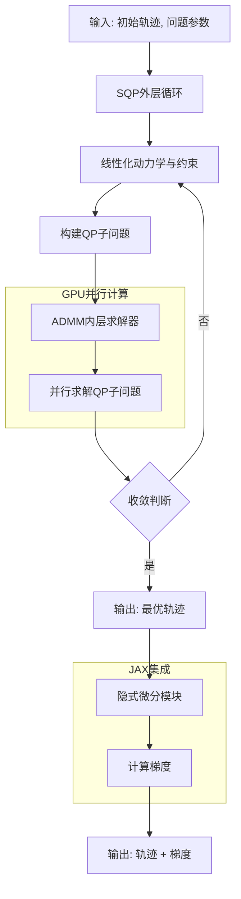
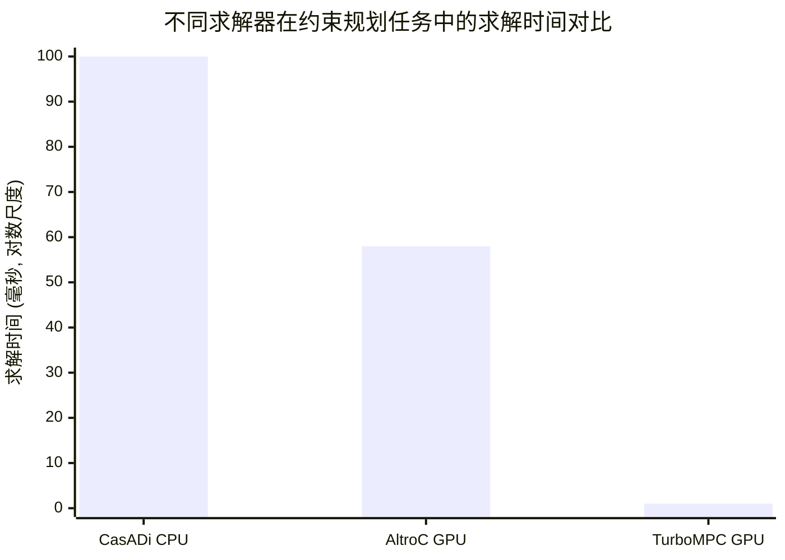

# TurboMPC: Fast, Scalable, and Differentiable Model Predictive Control on the GPU

> 本文由 paper-daily 使用 DeepSeek 自动生成，仅供快速了解论文；关键结论请以原文为准。

[论文原文](https://arxiv.org/abs/2606.24039) · [PDF](https://arxiv.org/pdf/2606.24039) · [源文件](https://github.com/vsvnakers/paper-daily/blob/master/essay_read/2026-06-24/2606.24039.md)

> TurboMPC是一个完全在GPU上运行、快速、可扩展且可微分的模型预测控制求解器，通过SQP-ADMM框架和隐式微分技术，实现了数量级的性能提升。

## 基本信息

| 属性 | 内容 |
|------|------|
| **作者** | Gabriel Bravo-Palacios, Jianghan Zhang, Zachary Pestrikov, Brian Plancher, Thomas Lew |
| **来源** | [arXiv:2606.24039](https://arxiv.org/abs/2606.24039) |
| **发布日期** | 2026-06-23 |
| **抓取领域** | 机器人/具身智能 |
| **学科方向** | 机器人 |
| **arXiv 分类** | cs.RO |
| **适用层次** | 进阶 |
| **标签** | 模型预测控制, GPU加速, 可微分优化, 序列二次规划, 交替方向乘子法 |
| **PDF** | [在线阅读](https://arxiv.org/pdf/2606.24039) |
| **代码仓库** | 暂无

---

## 问题的初衷（Why - 为什么要做这个研究）

【问题的初衷】机器人领域正越来越多地依赖GPU进行并行仿真、大规模学习和神经网络推理。模型预测控制（Model Predictive Control, MPC）作为一种强大的最优控制方法，在机器人运动规划、自动驾驶等领域应用广泛。然而，现有的MPC求解器主要针对CPU设计，难以充分利用GPU的并行计算能力。这导致了一个关键矛盾：机器人系统的其他组件（如仿真、感知、学习）已大规模迁移至GPU，而MPC求解器却成为性能瓶颈，无法与这些组件高效协同。此外，现有GPU上的MPC求解器（如AltroC）通常不支持不等式约束、隐式积分器或跨时间步耦合代价（cross-time-coupled costs），限制了其在复杂机器人任务中的表达能力。同时，许多机器人应用（如模仿学习、强化学习）需要MPC求解器是可微分的（differentiable），以便通过梯度反向传播进行端到端学习。因此，设计一个在GPU上运行、快速、可扩展、可微分且支持丰富MPC表达形式的求解器，是推动机器人技术发展的迫切需求。

---

## 问题的解决（What - 提出了什么方案）

【问题的解决】TurboMPC提出了一种全新的、完全在GPU上运行的可微分MPC求解器。其核心思路是将序列二次规划（Sequential Quadratic Programming, SQP）与交替方向乘子法（Alternating Direction Method of Multipliers, ADMM）内层求解器相结合，并通过隐式微分（Implicit Differentiation）实现可微性。关键创新点包括：1）采用SQP框架将非线性MPC问题转化为一系列二次规划（Quadratic Programming, QP）子问题；2）设计了一个高效的ADMM求解器作为内层QP求解器，该求解器特别适合GPU并行化，能够处理不等式约束和松弛变量（slack variables）；3）通过隐式微分技术，在求解完成后高效计算MPC策略相对于问题参数（如代价函数权重、约束边界）的梯度，无需展开整个迭代过程；4）与JAX框架协同设计，利用JAX的自动微分和GPU加速能力，同时提供用户友好的Python接口。与现有方法的本质区别在于：TurboMPC是首个完全在GPU上运行、支持完整约束和可微分的MPC求解器，其并行化设计使其能够同时求解大量独立的MPC问题（批处理，batching），从而在仿真、学习和调参等场景中实现数量级的加速。

---

## 技术方法详解（How - 怎么实现的）

【技术方法详解】
- **SQP框架**：TurboMPC采用SQP将非线性MPC问题线性化。在每个SQP迭代中，围绕当前轨迹（状态和控制序列）构建一个局部QP近似。该QP子问题包含线性化的动力学约束、线性化的不等式约束以及二次代价函数。SQP迭代直到收敛或达到最大迭代次数。
- **ADMM内层求解器**：针对每个QP子问题，TurboMPC设计了一个专用的ADMM求解器。该求解器将QP问题分解为更小的子问题，每个子问题可以高效并行求解。具体地，ADMM通过引入辅助变量和拉格朗日乘子，将约束优化问题转化为一系列无约束优化和投影步骤。这些步骤在GPU上可以高度并行化，例如，动力学约束的求解可以转化为一个块三对角系统（block-tridiagonal system），利用并行扫描（parallel scan）算法高效求解。
- **隐式微分**：为了获得MPC策略的梯度，TurboMPC采用了隐式微分技术。在SQP收敛到最优解后，利用KKT条件（Karush-Kuhn-Tucker conditions）对问题参数进行隐式求导。这避免了通过整个SQP迭代过程进行反向传播，大大降低了计算和内存开销。隐式微分只需求解一个线性系统，其系数矩阵来自最终收敛的QP子问题的KKT矩阵。
- **JAX-CUDA协同设计**：TurboMPC的核心求解器使用CUDA编写，以获得最大性能。同时，它通过JAX的`custom_vjp`（自定义向量-雅可比积）机制与JAX集成。这使得用户可以在Python中像使用普通JAX函数一样调用TurboMPC，并自动获得其梯度信息，用于端到端学习或参数优化。
- **支持丰富的MPC表达形式**：TurboMPC支持状态和控制不等式约束（如关节限位、执行器饱和）、隐式积分器（如Runge-Kutta方法，用于更精确的动力学模拟）、跨时间步耦合代价（如平滑项、避障代价）以及松弛变量（用于软约束）。这些特性使其能够处理复杂的机器人任务。


## 系统架构图




## 方法流程图

```mermaid
flowchart TD
    A[开始] --> B[输入: 初始状态x0, 参数p]
    B --> C[初始化轨迹 (u, x)]
    C --> D[SQP迭代开始]
    D --> E[计算代价梯度与Hessian]
    E --> F[线性化动力学与约束]
    F --> G[构建QP子问题]
    G --> H[ADMM求解QP]
    H --> I[更新轨迹 (u, x)]
    I --> J{轨迹收敛?}
    J -- 否 --> D
    J -- 是 --> K[保存最优轨迹]
    K --> L{需要梯度?}
    L -- 是 --> M[隐式微分求解梯度]
    M --> N[输出: 最优轨迹 + 梯度]
    L -- 否 --> O[输出: 最优轨迹]
    N --> P[结束]
    O --> P
```


## 核心公式与算法

【核心公式】
1. **MPC问题的一般形式**：
   $$\min_{u_{0:T-1}, x_{0:T}} \sum_{t=0}^{T-1} c_t(x_t, u_t) + c_T(x_T)$$
   $$\text{s.t.} \quad x_{t+1} = f(x_t, u_t), \quad g_t(x_t, u_t) \leq 0$$
   其中 $x_t$ 是状态，$u_t$ 是控制输入，$c_t$ 是阶段代价，$c_T$ 是终端代价，$f$ 是动力学模型，$g_t$ 是不等式约束。

2. **SQP中的QP子问题**：
   $$\min_{\delta u, \delta x} \frac{1}{2} \begin{bmatrix} \delta x \\ \delta u \end{bmatrix}^T H \begin{bmatrix} \delta x \\ \delta u \end{bmatrix} + \begin{bmatrix} g_x \\ g_u \end{bmatrix}^T \begin{bmatrix} \delta x \\ \delta u \end{bmatrix}$$
   $$\text{s.t.} \quad \delta x_{t+1} = A_t \delta x_t + B_t \delta u_t + r_t, \quad G_t \begin{bmatrix} \delta x_t \\ \delta u_t \end{bmatrix} \leq h_t$$
   其中 $\delta x, \delta u$ 是状态和控制的增量，$H$ 是代价函数的Hessian矩阵，$g_x, g_u$ 是梯度，$A_t, B_t$ 是线性化的动力学矩阵，$r_t$ 是残差，$G_t, h_t$ 是线性化的约束。

3. **隐式微分的关键方程**：
   假设最优解满足KKT条件 $F(z^*, p) = 0$，其中 $z^*$ 是最优变量（状态、控制、对偶变量），$p$ 是问题参数。则梯度 $\frac{dz^*}{dp}$ 可通过求解以下线性系统获得：
   $$\frac{\partial F}{\partial z^*} \frac{dz^*}{dp} = -\frac{\partial F}{\partial p}$$
   这是隐式微分的核心，避免了通过优化迭代过程进行反向传播。


---

## 应用场景（Where - 在哪落地）

【应用场景】
1. **自动驾驶中的实时轨迹规划与参数调优**：在自动驾驶中，MPC常用于规划车辆轨迹。TurboMPC可以部署在车载GPU上，实时求解MPC问题。更重要的是，其可微分性和批处理能力使得可以通过贝叶斯优化（Bayesian Optimization）批量调整MPC参数（如代价权重、预测时域），以优化驾驶性能（如最小时间、乘坐舒适性）。论文中已展示了在真实赛车上通过批量调参实现更快的竞速驾驶。
2. **机器人技能学习与模仿学习**：在机器人操作和 locomotion 中，MPC可以作为策略（policy）的一部分。TurboMPC的可微分性允许将MPC嵌入到神经网络中，通过端到端的梯度下降进行训练。例如，在人形机器人模仿学习中，可以使用TurboMPC作为可微分策略，通过行为克隆（Behavior Cloning）从专家演示中学习。由于TurboMPC在GPU上运行，可以同时处理大量演示数据，加速训练过程。
3. **强化学习中的模型预测控制**：在基于模型的强化学习（Model-Based RL）中，MPC常被用作规划器或策略。TurboMPC可以高效地求解MPC问题，并提供梯度用于更新神经网络模型或价值函数。例如，在具有神经网络代价函数的RL任务中，TurboMPC可以快速求解最优控制序列，并通过隐式微分将梯度回传到代价网络，实现代价函数的端到端学习。其批处理能力使得可以同时处理多个环境实例，加速RL训练。


---

## 具体技术细节示例（How in Action - 算法如何执行）

【具体技术细节示例】
假设我们有一个简单的1D点质量模型，需要控制其从位置 $x_0=0$ 移动到目标位置 $x_{target}=10$，同时限制速度 $v \leq 2$ 和控制力 $u \in [-1, 1]$。MPC问题时域 $T=5$，时间步长 $dt=0.1$。动力学为 $x_{t+1} = x_t + v_t \cdot dt$, $v_{t+1} = v_t + u_t \cdot dt$。代价函数为 $\sum (x_t - 10)^2 + 0.01 u_t^2$。

**TurboMPC执行步骤：**
1. **初始化**：初始猜测轨迹，例如所有 $u_t=0$, $x_t=0$, $v_t=0$。
2. **SQP迭代1**：
   - 在当前轨迹处线性化动力学和约束。例如，在 $t=0$，动力学线性化为 $\delta x_1 = \delta x_0 + \delta v_0 \cdot dt$, $\delta v_1 = \delta v_0 + \delta u_0 \cdot dt$。速度约束 $v_0 \leq 2$ 线性化为 $v_0 + \delta v_0 \leq 2$。
   - 构建QP子问题：目标函数是增量的二次型，约束是线性等式和不等式。
   - **ADMM求解QP**：将QP分解。例如，引入辅助变量 $z_t$ 表示满足约束的变量，通过ADMM迭代更新原始变量、辅助变量和对偶变量。在GPU上，所有时间步的更新可以并行进行。假设经过若干ADMM迭代，得到增量 $\delta u = [0.5, 0.4, 0.3, 0.2, 0.1]$, $\delta x, \delta v$ 相应更新。
   - 更新轨迹：$u_t \leftarrow u_t + \delta u_t$，$x_t, v_t$ 类似更新。
3. **SQP迭代2**：在新轨迹处重复步骤2。由于轨迹更接近最优，QP子问题的近似更准确。
4. **收敛**：经过若干次SQP迭代（例如5次），轨迹变化小于阈值，得到最优控制序列 $u^* = [1.0, 0.8, 0.6, 0.4, 0.2]$，状态轨迹 $x^* = [0, 0.1, 0.28, 0.52, 0.8, 1.1]$, $v^* = [0, 1.0, 1.8, 2.0, 2.0, 2.0]$。注意速度被限制在2。
5. **隐式微分**：如果需要梯度，TurboMPC在收敛点处构建KKT矩阵，求解线性系统得到 $\frac{dx^*}{d\text{target}}$ 等梯度。例如，目标位置 $x_{target}$ 对第一个控制量 $u_0$ 的梯度。

**输出**：最优轨迹和（可选）梯度。


---

## 实验结果（Results - 效果如何）

【实验结果】论文在多个任务上验证了TurboMPC的性能。实验设置包括：1）约束规划任务，比较不同求解器的求解时间；2）人形机器人模仿学习，使用MPC作为策略进行行为克隆；3）强化学习，使用神经网络代价函数，通过MPC进行策略优化。基准方法包括CPU上的SQP求解器（如CasADi）和GPU上的可微分MPC求解器（如AltroC）。关键结果：在约束规划任务中，TurboMPC相比CPU求解器实现了高达15倍的加速，相比GPU求解器实现了高达58倍的加速。在人形机器人模仿学习中，TurboMPC能够高效地学习复杂运动。在强化学习中，TurboMPC成功优化了神经网络代价函数。此外，论文还展示了TurboMPC在真实1:1赛车上的最小时间竞速任务，通过贝叶斯优化（Bayesian Optimization）批量调参，实现了比手工调参更快的驾驶速度。TurboMPC还能扩展到超过8000个节点（knot points）的规划时域，同时保持对车辆的控制。


## 实验结果可视化




---

## 优势与不足

【优势与不足】
- **优势**
  1. **极致的GPU加速**：通过完全在GPU上运行和并行化设计，实现了相比现有CPU和GPU求解器数量级的加速，尤其适合批处理场景。
  2. **丰富的功能支持**：支持不等式约束、隐式积分器、跨时间步耦合代价和松弛变量，能够处理复杂的机器人控制问题。
  3. **可微分性**：通过隐式微分技术高效计算梯度，使其能够无缝集成到基于梯度的学习框架（如模仿学习、强化学习）中。
  4. **用户友好**：与JAX框架集成，提供了简洁的Python接口，降低了使用门槛。
- **不足**
  1. **GPU内存限制**：完全在GPU上运行意味着问题规模（如时域长度、状态/控制维度）受限于GPU显存，对于超大规模问题可能不适用。
  2. **SQP的局部收敛性**：SQP是一种局部优化方法，对于高度非线性的问题，可能收敛到局部最优解，需要良好的初始猜测。
  3. **ADMM超参数敏感**：ADMM求解器的性能依赖于惩罚参数的选择，不当的参数可能导致收敛缓慢或不收敛。

---

## 相关工作

【相关工作】
1. **传统MPC求解器**：如ACADO、CasADi、FORCES Pro等，主要针对CPU设计，优化了单次求解速度，但难以利用GPU并行性。
2. **GPU上的MPC求解器**：如AltroC、CuRobo等，尝试在GPU上加速MPC，但通常不支持完整的约束或可微分性。
3. **可微分优化**：如OptNet、cvxpylayers等，将优化问题作为可微分层嵌入神经网络，但主要针对小规模问题。
4. **基于学习的MPC**：如MPC-Net、Learning-based MPC，将神经网络与MPC结合，TurboMPC为其提供了高效的GPU可微分求解器。
5. **并行最优控制**：如iLQR、DDP的并行化版本，TurboMPC的SQP框架与之相关，但更通用。

---

## 未来研究方向

【未来方向】
1. **混合精度与稀疏性**：探索使用FP16或INT8等混合精度计算，以及利用MPC问题的稀疏结构（如块对角矩阵）进一步加速GPU求解，降低内存占用。
2. **非线性约束的更好处理**：当前SQP框架处理非线性约束通过线性化，对于强非线性约束可能不够精确。未来可以研究将TurboMPC与更高级的非线性求解器（如内点法）结合，或使用二阶锥规划（Second-Order Cone Programming, SOCP）处理特定类型的非线性约束。
3. **分布式与多GPU扩展**：对于超大规模问题（如多机器人协同MPC），研究如何将TurboMPC扩展到多GPU集群，通过分布式计算和通信优化来求解更大规模的MPC问题。


---

## 一句话总结

> TurboMPC是一个完全在GPU上运行、快速、可扩展且可微分的模型预测控制求解器，通过SQP-ADMM框架和隐式微分技术，实现了数量级的性能提升。

---

*本解读由 DeepSeek AI 自动生成，仅供参考。*
