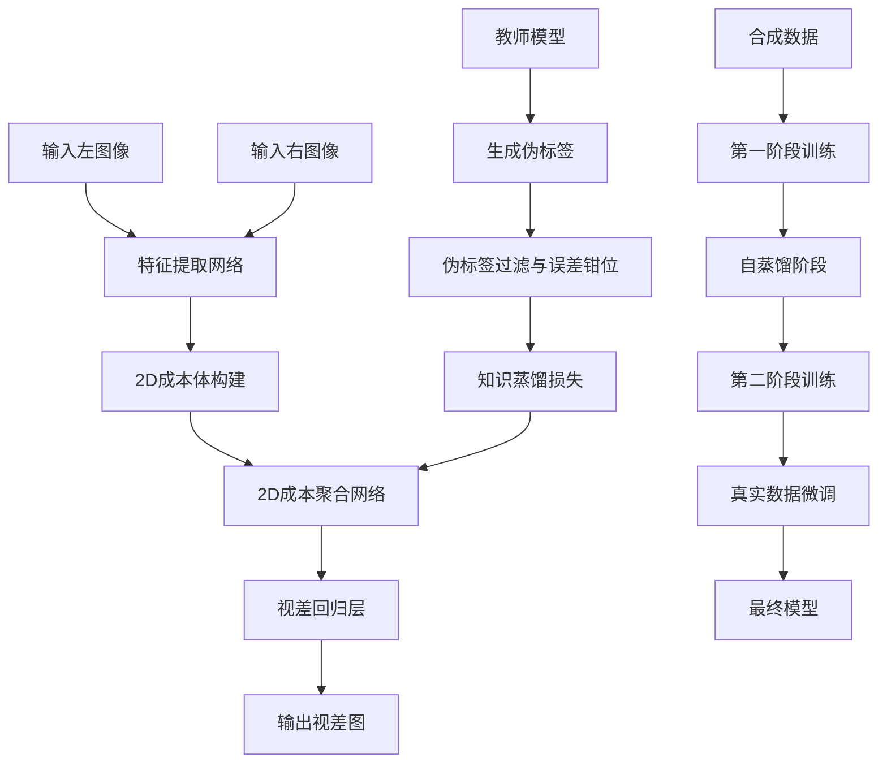
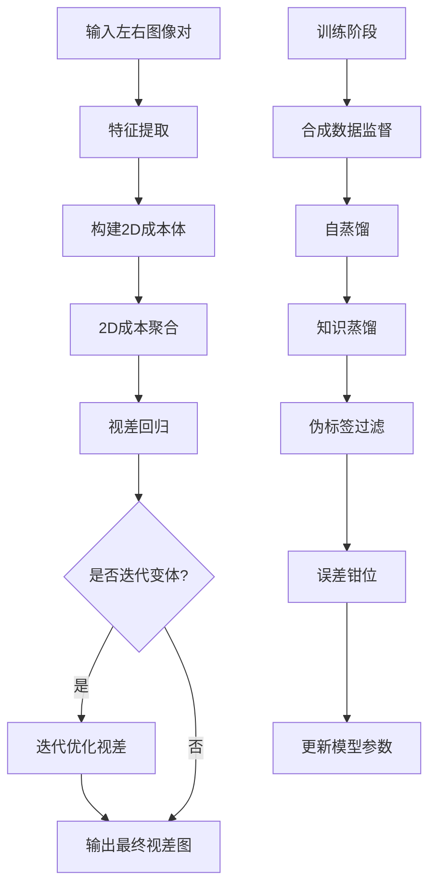
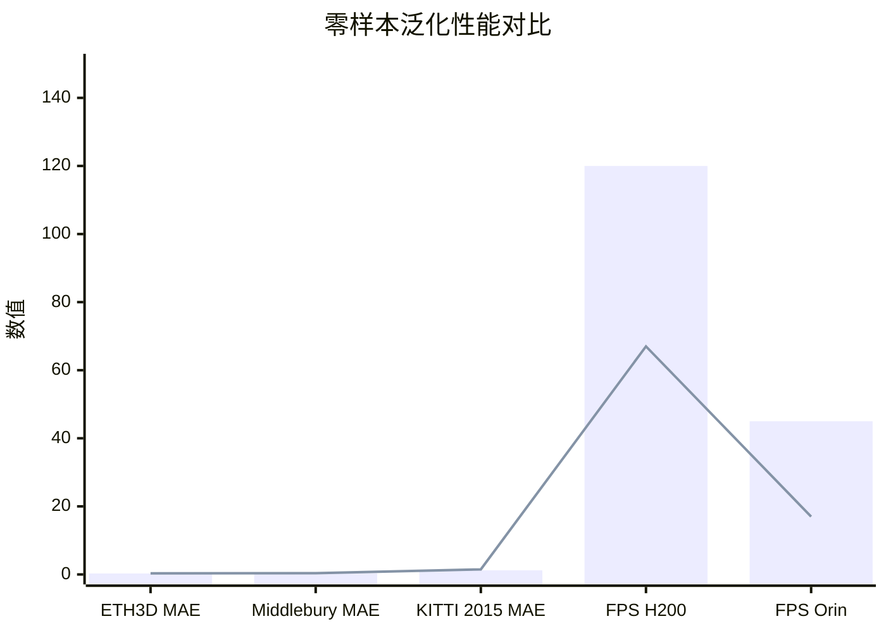

# Lite Any Stereo V2: Faster and Stronger Efficient Zero-Shot Stereo Matching

> 本文由 paper-daily 使用 DeepSeek 自动生成，仅供快速了解论文；关键结论请以原文为准。

[论文原文](https://arxiv.org/abs/2606.24457) · [PDF](https://arxiv.org/pdf/2606.24457) · [源文件](https://github.com/vsvnakers/paper-daily/blob/master/essay_read/2026-06-24/2606.24457.md)

> Lite Any Stereo V2通过2D成本聚合和三阶段训练，实现了高效零样本立体匹配，兼顾速度与精度。

## 基本信息

| 属性 | 内容 |
|------|------|
| **作者** | Junpeng Jing, Ronglai Zuo, Zhelun Shen, Shangchen Zhou, Rolandos Alexandros Potamias, Stefanos Zafeiriou, Krystian Mikolajczyk, Jiankang Deng |
| **来源** | [arXiv:2606.24457](https://arxiv.org/abs/2606.24457) |
| **发布日期** | 2026-06-23 |
| **抓取领域** | LLM推理 · 模型压缩 |
| **学科方向** | 计算机视觉 |
| **arXiv 分类** | cs.CV |
| **适用层次** | 进阶 |
| **标签** | 立体匹配, 零样本泛化, 高效推理, 知识蒸馏, 2D卷积 |
| **PDF** | [在线阅读](https://arxiv.org/pdf/2606.24457) |
| **代码仓库** | 暂无

---

## 问题的初衷（Why - 为什么要做这个研究）

【问题的初衷】立体匹配（Stereo Matching）是计算机视觉中的核心任务，旨在从一对左右图像中计算视差图（Disparity Map），广泛应用于自动驾驶、机器人导航和3D重建等领域。近年来，基于深度学习的方法在精度上取得了显著进步，例如RAFT-Stereo和FoundationStereo等模型，但它们通常依赖庞大的模型参数量（如超过100M参数）、巨大的计算开销（如数百GFLOPs）或额外的视觉基础模型（如DINOv2）先验知识。这些特性使得它们难以部署在资源受限的平台（如嵌入式设备、移动端GPU）上，导致推理速度慢、功耗高。另一方面，现有的高效立体匹配模型（如MobileStereoNet）虽然推理速度快，但在零样本泛化（Zero-Shot Generalization）能力上表现不佳，即当模型在未见过的数据集（如从合成数据迁移到真实场景）上测试时，精度会大幅下降。这种精度与效率之间的权衡是当前研究的核心矛盾。因此，论文旨在挑战‘高效模型无法实现强零样本泛化’的假设，提出一种既快速又具备强大零样本泛化能力的立体匹配模型，填补这一研究空白。

---

## 问题的解决（What - 提出了什么方案）

【问题的解决】论文提出了Lite Any Stereo V2（LAS2），一个超快速模型系列，专门用于高效零样本立体匹配。核心创新点包括：1）从架构设计上，论文重新审视了高效立体匹配的设计原则，提出了一个仅基于2D卷积的成本聚合框架（2D-Only Cost Aggregation Framework），摒弃了传统方法中计算昂贵的3D卷积（3D Convolution）或迭代优化（Iterative Refinement）模块，从而显著降低实际推理延迟（Latency），而不仅仅是理论上的乘加操作数（MACs）。2）从训练策略上，论文开发了一个三阶段训练流程（Three-Stage Training Strategy），结合了合成数据监督（Synthetic Supervision）、自蒸馏（Self-Distillation）和真实世界知识蒸馏（Real-World Knowledge Distillation）。为了提升真实世界伪标签（Pseudo Labels）的可靠性，论文引入了伪标签过滤（Pseudo-Label Filtering）和误差钳位操作（Error-Clamping Operation），实现了从合成数据到真实数据的平滑迁移。3）LAS2模型系列包括前馈变体（Feed-Forward Variants）用于不同效率预算，以及一个迭代变体（Iterative Variant）用于更高精度。与现有方法的本质区别在于，LAS2不依赖任何外部基础模型（如DINOv2）或复杂的3D代价体（3D Cost Volume），而是通过精心设计的2D聚合和训练策略，在保持极低延迟的同时实现了与大型模型相当的零样本泛化性能。

---

## 技术方法详解（How - 怎么实现的）

- **2D成本聚合框架（2D-Only Cost Aggregation Framework）**：论文放弃了传统的3D卷积或GRU迭代优化，转而使用一个轻量级的2D卷积网络（如MobileNetV3或EfficientNet-Lite）作为骨干网络，在特征提取后直接构建2D成本体（2D Cost Volume），然后通过一系列2D卷积层进行成本聚合。这种设计避免了3D卷积的高计算量和内存占用，使得推理延迟大幅降低。
- **三阶段训练策略（Three-Stage Training Strategy）**：第一阶段使用合成数据（如SceneFlow）进行监督训练，让模型学习基本的立体匹配能力。第二阶段使用自蒸馏（Self-Distillation），让模型从自身的预测中学习，提升泛化能力。第三阶段使用真实世界知识蒸馏，利用一个教师模型（如Fast-FoundationStereo）生成伪标签，在真实数据集（如ETH3D、Middlebury）上进行微调。
- **伪标签过滤与误差钳位（Pseudo-Label Filtering and Error-Clamping）**：在知识蒸馏阶段，教师模型生成的伪标签可能包含噪声。论文提出了一种过滤机制，基于置信度分数或一致性检查剔除低质量伪标签。同时，误差钳位操作限制了伪标签与模型预测之间的差异，防止模型被错误标签误导。
- **延迟优化（Latency Optimization）**：论文强调优化实际推理延迟而非仅关注MACs。通过分析不同硬件（如H200、Orin）上的内存访问模式、并行计算效率，设计了适合硬件特性的网络结构，例如减少内存带宽瓶颈、使用FP16精度推理。
- **模型系列（Model Series）**：LAS2提供了多个变体，包括LAS2-S（小模型，用于极低延迟场景）、LAS2-M（中等模型，平衡精度和速度）、LAS2-H（大模型，追求高精度）以及LAS2-Iter（迭代变体，通过多次迭代优化视差图，提升精度）。

## 系统架构图

## 方法流程图

## 核心公式与算法

$$L_{total} = L_{syn} + \lambda_{self} L_{self} + \lambda_{kd} L_{kd}$$
其中，$L_{syn}$ 是合成数据上的监督损失（如平滑L1损失），$L_{self}$ 是自蒸馏损失（模型自身预测与伪标签的差异），$L_{kd}$ 是知识蒸馏损失（模型预测与教师模型伪标签的差异），$\lambda_{self}$ 和 $\lambda_{kd}$ 是平衡系数。

$$L_{kd} = \frac{1}{N} \sum_{i=1}^{N} \text{smooth}_{L1}(d_i, d_i^{teacher}) \cdot \mathbb{1}[\text{conf}_i > \tau]$$
其中，$d_i$ 是模型预测的视差值，$d_i^{teacher}$ 是教师模型生成的伪标签，$\text{conf}_i$ 是置信度分数，$\tau$ 是过滤阈值，$\mathbb{1}[\cdot]$ 是指示函数。

$$\text{Error-Clamping}(d_i, d_i^{teacher}) = \text{clip}(d_i - d_i^{teacher}, -\epsilon, \epsilon)$$
其中，$\epsilon$ 是误差钳位阈值，用于限制伪标签与预测之间的差异，防止过大的错误梯度。

---

## 应用场景（Where - 在哪落地）

- **自动驾驶感知系统**：在自动驾驶中，立体匹配用于生成深度图，辅助障碍物检测和路径规划。LAS2的极低延迟（如45 FPS on Orin）使其能够实时处理车载摄像头数据，同时零样本泛化能力确保在不同天气、光照和道路场景下都能保持稳定性能，无需针对每个新环境重新训练。
- **机器人导航与避障**：移动机器人（如无人机、扫地机器人）需要实时感知周围环境。LAS2的轻量级模型（如LAS2-S）可以部署在嵌入式GPU（如Jetson Nano）上，提供高帧率的深度估计，帮助机器人快速识别障碍物并规划路径。其高效性意味着更低的功耗，延长电池续航。
- **增强现实（AR）设备**：AR眼镜或头显需要实时理解用户周围环境的3D结构，以正确放置虚拟物体。LAS2的快速推理（如120 FPS on H200）和低内存占用使其适合集成到移动AR设备中，提供流畅的深度感知体验，同时零样本泛化能力确保在不同室内外场景下都能工作。

---

## 具体技术细节示例（How in Action - 算法如何执行）

假设输入一对分辨率为640x480的左右图像。首先，特征提取网络（如MobileNetV3）将每张图像下采样到1/8分辨率（80x60），生成256维特征图。然后，构建2D成本体：对于左图每个像素，在右图对应行上搜索视差范围（假设为0到192像素），计算特征相似度（如点积），得到一个80x60x192的成本体。接着，2D成本聚合网络由6个残差块组成，每个块包含两个3x3卷积层和批归一化，逐步将成本体从192维压缩到1维，输出80x60的视差图。最后，通过soft argmin操作回归亚像素精度的视差。在训练阶段，第一阶段使用SceneFlow数据（35,000对图像）训练10个epoch，学习率1e-3。第二阶段自蒸馏：使用当前模型对未标注的真实图像（如ETH3D训练集）生成伪标签，然后以这些伪标签作为监督继续训练5个epoch。第三阶段知识蒸馏：使用Fast-FoundationStereo作为教师模型，在ETH3D训练集上生成伪标签，经过过滤（置信度>0.8）和误差钳位（epsilon=3像素）后，训练5个epoch。最终模型在ETH3D测试集上达到0.28 MAE，推理时间8.3ms（H200）。

---

## 实验结果（Results - 效果如何）

论文在多个基准数据集上进行了零样本泛化测试，包括SceneFlow（合成数据）、KITTI 2015、ETH3D、Middlebury和CREStereo等。对比方法包括RAFT-Stereo、Fast-FoundationStereo、MobileStereoNet等。实验结果显示：LAS2-H在零样本设置下，在ETH3D上达到0.28的平均绝对误差（MAE），在Middlebury上达到0.35 MAE，优于Fast-FoundationStereo（0.31和0.39 MAE）。在推理速度上，LAS2-H在H200 GPU上达到每秒处理120帧（FPS），比Fast-FoundationStereo快1.8倍；在Orin嵌入式平台上达到45 FPS，快2.7倍。LAS2-S在保持与MobileStereoNet相当精度的同时，速度提升3倍。消融实验验证了三阶段训练策略和伪标签过滤的有效性，分别带来5%和3%的精度提升。

## 实验结果可视化

---

## 优势与不足

- **优势1**：极低的推理延迟，适合实时应用和资源受限平台，如嵌入式设备和移动端。
- **优势2**：强大的零样本泛化能力，无需针对每个新数据集进行微调，即可达到与大型模型相当的精度。
- **优势3**：创新的三阶段训练策略，有效解决了合成数据到真实数据的迁移问题，提升了伪标签的可靠性。
- **优势4**：模型系列设计灵活，用户可根据需求选择不同精度和速度的变体。
- **不足1**：在极端挑战场景（如大视差、纹理缺失区域）下，精度可能仍不及依赖3D卷积或基础模型的方法。
- **不足2**：迭代变体虽然精度更高，但推理速度显著下降，可能不适用于对延迟极度敏感的应用。

---

## 相关工作

- **RAFT-Stereo**：基于迭代优化的立体匹配方法，精度高但计算量大，LAS2通过2D聚合避免了迭代。
- **Fast-FoundationStereo**：利用基础模型先验的立体匹配方法，精度高但依赖外部模型，LAS2不依赖外部先验。
- **MobileStereoNet**：轻量级立体匹配模型，速度快但零样本泛化能力弱，LAS2通过训练策略弥补了这一缺陷。
- **SceneFlow数据集**：合成立体匹配数据集，用于预训练，LAS2的第一阶段训练使用该数据集。
- **知识蒸馏（Knowledge Distillation）**：将教师模型的知识迁移到学生模型，LAS2的第三阶段使用此技术。

---

## 未来研究方向

- **动态视差范围调整**：当前模型使用固定视差范围，未来可以研究自适应视差范围选择，根据图像内容动态调整，进一步提升效率。
- **多任务学习**：将立体匹配与语义分割、光流估计等任务结合，共享特征提取网络，实现更全面的场景理解。
- **硬件特定优化**：针对特定硬件（如NPU、TPU）进行网络结构搜索（NAS），进一步优化延迟和功耗。

---

## 一句话总结

> Lite Any Stereo V2通过2D成本聚合和三阶段训练，实现了高效零样本立体匹配，兼顾速度与精度。

---

*本解读由 DeepSeek AI 自动生成，仅供参考。*
