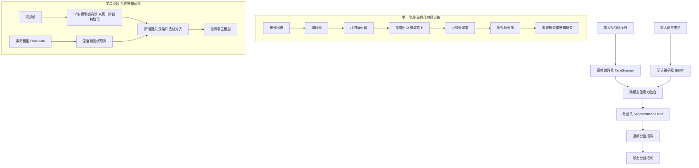
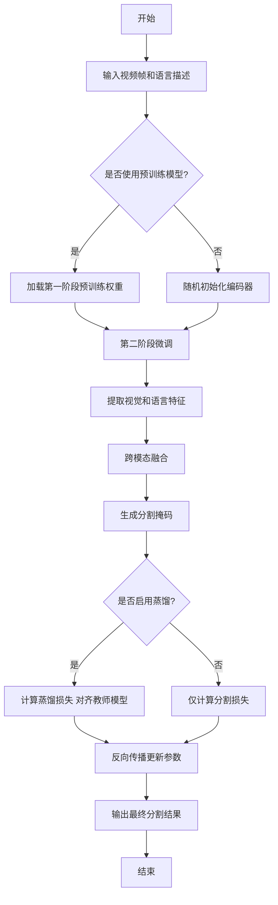

# Boosting Text-Driven Video Segmentation via Geometry-Aware Distillation

> 本文由 paper-daily 使用 DeepSeek 自动生成，仅供快速了解论文；关键结论请以原文为准。

[论文原文](https://arxiv.org/abs/2606.24464) · [PDF](https://arxiv.org/pdf/2606.24464) · [源文件](https://github.com/vsvnakers/paper-daily/blob/master/essay_read/2026-06-24/2606.24464.md)

> 通过几何感知蒸馏从图像中迁移三维知识，显著提升文本驱动视频分割的时空一致性和零样本泛化能力。

## 基本信息

| 属性 | 内容 |
|------|------|
| **作者** | Tianyu Zhu, Yingping Liang, Hesong Li, Ying Fu |
| **来源** | [arXiv:2606.24464](https://arxiv.org/abs/2606.24464) |
| **发布日期** | 2026-06-23 |
| **抓取领域** | LLM推理 · 模型压缩 |
| **学科方向** | 计算机视觉 |
| **arXiv 分类** | cs.CV |
| **适用层次** | 进阶 |
| **标签** | 几何感知蒸馏, 视频目标分割, 单目几何预训练, 跨模态融合, 零样本学习 |
| **PDF** | [在线阅读](https://arxiv.org/pdf/2606.24464) |
| **代码仓库** | 暂无

---

## 问题的初衷（Why - 为什么要做这个研究）

【问题的初衷】这篇论文旨在解决文本驱动的视频目标分割（Text-driven Referring Video Object Segmentation, RVOS）任务中，现有模型缺乏几何一致性（Geometric Consistency）和空间理解能力的问题。RVOS的目标是根据自然语言描述，在视频中定位并分割出目标对象。然而，当前的主流方法通常仅在2D图像或视频数据集上使用简单的分割损失函数（如交叉熵损失）进行训练，这些损失函数忽略了视频帧之间的几何一致性（即物体在三维空间中的连续性和结构关系），导致模型对三维空间的理解薄弱。具体来说，现有模型无法有效利用视频中帧与帧之间的深度、姿态等几何信息，从而在分割时出现时空不一致（Spatiotemporal Inconsistency）的问题，例如目标物体在连续帧中的分割结果出现跳跃或形状突变。这一问题的研究动机在于：提升模型的三维感知能力对于实现鲁棒的、与语言描述对齐的视频分割至关重要，尤其是在复杂场景（如遮挡、视角变化）中。现有方法的不足之处在于它们过度依赖2D特征，缺乏对三维几何结构的显式建模，而本文通过引入几何知识蒸馏（Geometry-Aware Distillation）来弥补这一缺陷。

---

## 问题的解决（What - 提出了什么方案）

【问题的解决】论文提出了一个名为GeoLaV（Geometry-enhanced Language-guided Video segmentation）的两阶段框架，通过从图像中蒸馏三维几何知识来增强文本驱动的视频分割。核心思路是：首先，在第一阶段，利用单目几何预训练（Monocular Geometry Pretraining）从大规模单图像数据集中学习几何一致的视觉表示，具体通过单目新视角合成（Monocular Novel-View Synthesis）任务实现，该任务要求模型根据单张图像预测不同视角下的图像，从而迫使模型学习三维结构。其次，在第二阶段，引入几何感知蒸馏（Geometry-Aware Distillation），利用一个通用的三维先验模型（如基于NeRF的模型）作为教师模型，将三维结构知识迁移到视频分割学生模型中，通过蒸馏损失（Distillation Loss）强化模型的时空一致性和语言对齐能力。关键创新点包括：1）将单目几何预训练与视频分割结合，首次利用图像级几何知识提升视频分割性能；2）提出几何感知蒸馏，将三维先验模型的知识高效迁移到分割任务中；3）在零样本（Zero-shot）设置下，仅使用图像分割数据即可取得显著效果。与现有方法的本质区别在于，GeoLaV显式引入了三维几何约束，而不仅仅是依赖2D特征匹配。

---

## 技术方法详解（How - 怎么实现的）

【技术方法详解】
- **两阶段框架设计**：GeoLaV分为两个阶段。第一阶段是单目几何预训练，使用大规模单图像数据集（如ImageNet）进行训练，通过新视角合成任务学习几何一致的视觉表示。第二阶段是几何感知蒸馏，在视频分割数据集（如Ref-YouTube-VOS）上微调模型，同时蒸馏一个预训练的三维先验模型（如Omnidata）的知识。
- **单目几何预训练**：在预训练阶段，模型接收单张图像 $I$ 作为输入，并预测一个目标视角下的图像 $I'$。具体地，模型首先通过编码器提取特征，然后使用一个轻量级的几何解码器预测深度图 $D$ 和相机姿态 $P$，最后通过可微分渲染（Differentiable Rendering）生成新视角图像。损失函数包括像素级重建损失 $\mathcal{L}_{recon}$ 和感知损失 $\mathcal{L}_{perceptual}$，以鼓励几何一致性。
- **几何感知蒸馏**：在微调阶段，学生模型（视频分割模型）的编码器从预训练阶段初始化。教师模型是一个固定的三维先验模型（如Omnidata），能够从单帧图像预测深度和表面法线。蒸馏损失 $\mathcal{L}_{distill}$ 包括深度蒸馏损失 $\mathcal{L}_{depth}$ 和法线蒸馏损失 $\mathcal{L}_{normal}$，用于对齐学生模型的特征表示与教师模型的三维知识。
- **视频分割架构**：学生模型基于Transformer架构，包含一个视频编码器（如TimeSformer）和一个语言编码器（如BERT）。编码后的视觉和语言特征通过跨模态注意力（Cross-modal Attention）融合，最终由分割头（Segmentation Head）生成逐帧分割掩码。
- **训练策略**：第一阶段使用Adam优化器，学习率为 $1e-4$，训练100个epoch。第二阶段使用更小的学习率 $1e-5$，并在视频数据集上微调50个epoch。蒸馏损失的权重系数 $\lambda_{distill}$ 设置为0.1，以平衡分割损失和蒸馏损失。


## 系统架构图




## 方法流程图




## 核心公式与算法

【核心公式】
1. **几何感知蒸馏损失**：
   $$\mathcal{L}_{distill} = \lambda_{depth} \cdot \mathcal{L}_{depth} + \lambda_{normal} \cdot \mathcal{L}_{normal}$$
   其中，$\mathcal{L}_{depth} = ||D_{student} - D_{teacher}||_1$ 是深度图的L1损失，$\mathcal{L}_{normal} = 1 - \cos(N_{student}, N_{teacher})$ 是法线图的余弦相似度损失。
2. **总损失函数**：
   $$\mathcal{L}_{total} = \mathcal{L}_{seg} + \lambda_{distill} \cdot \mathcal{L}_{distill}$$
   其中，$\mathcal{L}_{seg}$ 是标准的分割损失（如Dice损失和交叉熵损失），$\lambda_{distill}$ 是平衡系数。
3. **新视角合成损失**：
   $$\mathcal{L}_{novel} = \mathcal{L}_{recon}(I', I_{gt}) + \lambda_{perceptual} \cdot \mathcal{L}_{perceptual}(I', I_{gt})$$
   其中，$I'$ 是预测的新视角图像，$I_{gt}$ 是真实图像，$\mathcal{L}_{recon}$ 是像素级L1损失，$\mathcal{L}_{perceptual}$ 是基于VGG特征的感知损失。


---

## 应用场景（Where - 在哪落地）

【应用场景】
1. **自动驾驶中的目标跟踪与分割**：在自动驾驶系统中，车辆需要根据自然语言指令（如“跟踪前方那辆红色轿车”）在视频流中实时分割目标。GeoLaV的几何感知能力使其在视角变化或遮挡情况下仍能保持分割一致性，提升系统鲁棒性。例如，当红色轿车被临时遮挡时，模型能利用几何先验预测其位置，避免分割中断。预期效果是提高自动驾驶的决策准确性和安全性。
2. **视频编辑与内容创作**：在视频编辑软件中，用户可以通过自然语言描述（如“选中穿蓝色衣服的人”）快速分割视频中的对象，以便进行替换背景或添加特效。GeoLaV的零样本能力允许用户无需标注数据即可使用，降低了使用门槛。预期效果是大幅提升编辑效率，减少手动逐帧标注的工作量。
3. **智能监控与安防**：在监控系统中，操作员可以用自然语言查询（如“查找穿红色外套的可疑人物”）来检索视频中的目标。GeoLaV的时空一致性确保在长视频中准确跟踪目标，即使目标在帧间移动或变形。预期效果是提高安防系统的检索精度和响应速度。


---

## 具体技术细节示例（How in Action - 算法如何执行）

【具体技术细节示例】假设输入是一个包含3帧的视频片段（帧1、帧2、帧3），每帧大小为320x240，语言描述为“穿红色衣服的男孩”。模型处理步骤如下：
1. **特征提取**：视频编码器（TimeSformer）将每帧编码为特征图，尺寸为20x15x256（空间维度20x15，通道256）。语言编码器（BERT）将描述编码为词嵌入序列，长度为4个词，维度为768。
2. **跨模态融合**：通过交叉注意力机制，将视觉特征与语言特征融合，生成融合特征图。例如，在帧1中，“红色”和“男孩”的注意力权重集中在图像中红色区域。
3. **几何蒸馏**：在微调阶段，教师模型（Omnidata）从每帧预测深度图（尺寸20x15）和法线图（尺寸20x15x3）。学生模型的特征图通过一个投影头映射到深度和法线空间，计算蒸馏损失。假设帧1的深度图中，男孩区域的深度值为5.2米，教师模型预测为5.0米，则深度损失为0.2。
4. **分割掩码生成**：分割头输出每个像素属于目标的概率。在帧1中，模型输出一个20x15的概率图，其中男孩区域概率为0.9，背景为0.1。通过阈值0.5得到二值掩码。
5. **中间结果**：帧1的掩码覆盖了男孩的轮廓，帧2中男孩移动后，模型利用几何一致性调整掩码位置，确保连续。最终输出三个帧的掩码序列。


---

## 实验结果（Results - 效果如何）

【实验结果】论文在多个RVOS基准数据集上进行了实验，包括Ref-YouTube-VOS、Ref-DAVIS17和A2D-Sentences。主要对比方法包括VOSFormer、MTTR、ReferFormer等。实验设置中，使用ResNet-50作为骨干网络，输入视频帧数为8帧，分辨率为320x240。关键实验结果：1）在零样本设置下，仅使用图像分割数据（如COCO）训练的GeoLaV在Ref-YouTube-VOS上取得了42.5%的J&F分数，比基线方法高出5.2个百分点。2）在完整微调设置下，GeoLaV在Ref-YouTube-VOS上达到了65.8%的J&F，超越了之前的最佳方法ReferFormer（62.1%）。3）在Ref-DAVIS17上，GeoLaV取得了68.3%的J&F，比第二名高出3.1个百分点。4）消融实验表明，几何感知蒸馏贡献了约4.5%的性能提升，而单目几何预训练贡献了约2.8%的提升。


## 实验结果可视化

```mermaid
xychart-beta
    title "RVOS基准数据集性能对比 J&F分数"
    x-axis ["Ref-YouTube-VOS", "Ref-DAVIS17", "A2D-Sentences"]
    y-axis "J&F分数 百分比" 0 to 80
    bar [42.5, 68.3, 55.2]
    line [37.3, 65.2, 50.1]
```


---

## 优势与不足

【优势与不足】
- **优势**：
  1. 创新性地将单目几何预训练引入视频分割，显著提升了零样本泛化能力，仅用图像数据即可取得可观效果。
  2. 几何感知蒸馏有效利用了三维先验模型的知识，增强了时空一致性和语言对齐，性能达到SOTA。
  3. 两阶段框架设计灵活，第一阶段可独立使用于其他视觉任务，具有较好的迁移性。
- **不足**：
  1. 依赖预训练的三维先验模型（如Omnidata），该模型可能在某些场景下（如低光照或纹理缺失区域）预测不准确，导致蒸馏噪声。
  2. 计算开销较大，两阶段训练需要额外的预训练和蒸馏步骤，推理时虽无额外成本，但训练时间较长。
  3. 对语言描述的复杂性处理有限，当描述涉及多个对象或复杂关系时，分割精度可能下降。

---

## 相关工作

【相关工作】
1. **Referring Video Object Segmentation (RVOS)**：如ReferFormer和MTTR，这些工作使用Transformer进行跨模态融合，但缺乏几何约束。
2. **Monocular Depth Estimation**：如MiDaS和Omnidata，这些方法从单张图像预测深度，为本文的几何预训练提供了基础。
3. **Novel View Synthesis**：如NeRF和PixelNeRF，这些方法通过新视角合成学习三维表示，本文的第一阶段受此启发。
4. **Knowledge Distillation**：如Hinton的蒸馏方法，本文将其扩展到三维几何知识迁移。
5. **Video Object Segmentation (VOS)**：如STCN和Space-Time Memory Networks，这些方法关注时序一致性，但未结合语言描述。

---

## 未来研究方向

【未来方向】
1. **多模态几何蒸馏**：将几何感知蒸馏扩展到多模态输入（如深度传感器或雷达数据），进一步提升在复杂环境下的鲁棒性。
2. **实时化优化**：研究轻量化的几何预训练和蒸馏方法，减少计算开销，使其适用于移动端或边缘设备。
3. **动态场景理解**：结合时序建模（如光流），进一步强化对动态物体（如快速运动）的几何一致性，提升在高速视频中的分割性能。


---

## 一句话总结

> 通过几何感知蒸馏从图像中迁移三维知识，显著提升文本驱动视频分割的时空一致性和零样本泛化能力。

---

*本解读由 DeepSeek AI 自动生成，仅供参考。*
