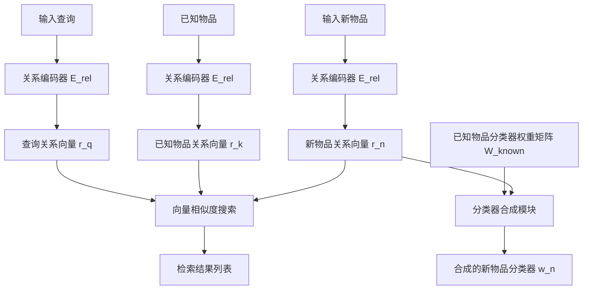
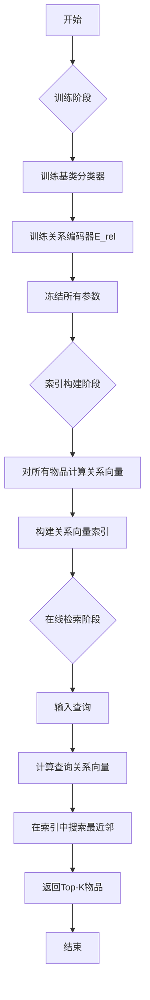

# Extreme Meta-Classification for Large-Scale Zero-Shot Retrieval

> 本文由 paper-daily 使用 DeepSeek 自动生成，仅供快速了解论文；关键结论请以原文为准。

[论文原文](https://arxiv.org/abs/2606.25237) · [PDF](https://arxiv.org/pdf/2606.25237) · [源文件](https://github.com/vsvnakers/paper-daily/blob/master/essay_read/2026-06-25/2606.25237.md)

> 提出元分类框架EMMETT及其高效实例IRENE，通过动态合成分类器，弥合了极端分类高精度与孪生网络高效率在零样本检索中的鸿沟。

## 基本信息

| 属性 | 内容 |
|------|------|
| **作者** | Sachin Yadav, Deepak Saini, Anirudh Buvanesh, Bhawna Paliwal, Kunal Dahiya, Siddarth Asokan, Yashoteja Prabhu, Jian Jiao, Manik Varma |
| **来源** | [arXiv:2606.25237](https://arxiv.org/abs/2606.25237) |
| **发布日期** | 2026-06-23 |
| **抓取领域** | 分布式/并行训练系统 |
| **学科方向** | 信息检索 · 机器学习 |
| **arXiv 分类** | cs.IR, cs.LG |
| **适用层次** | 进阶 |
| **标签** | 零样本检索, 元学习, 极端分类, 大规模检索, 关系编码 |
| **PDF** | [在线阅读](https://arxiv.org/pdf/2606.25237) |
| **代码仓库** | 暂无

---

## 问题的初衷（Why - 为什么要做这个研究）

【问题的初衷】这篇论文旨在解决大规模零样本检索（Large-Scale Zero-Shot Retrieval）中的一个核心矛盾：如何在保持对新类别（Novel Items）快速适应能力的同时，提升模型的表征能力。传统的孪生网络（Siamese Network）方法通过共享编码器将查询（Query）和物品（Item）映射到同一嵌入空间，然后通过最近邻搜索进行检索。这种方法虽然可以高效地添加和检索新物品（无需重新训练），但其编码器容量有限，难以捕捉复杂检索任务所需的丰富世界知识，导致检索精度受限。另一方面，极端分类（Extreme Classification）方法为训练集中每个物品学习一个独立的分类器（Classifier），极大地提升了模型容量和表征能力，在已知物品上表现优异。然而，这种方法无法处理新物品，因为为每个新物品训练分类器在数据和延迟上都是不可行的。因此，现有方法在“高容量表征”与“零样本泛化”之间存在鸿沟。该研究的动机是弥合这一鸿沟，提出一种既能利用极端分类的高容量优势，又能像孪生网络一样高效处理新物品的检索框架。

---

## 问题的解决（What - 提出了什么方案）

【问题的解决】论文提出了一个名为EMMETT（Extreme Meta-Classification for Large-Scale Zero-Shot Retrieval）的算法框架，其核心思想是“元分类”（Meta-Classification）。EMMETT不直接为新物品训练分类器，而是学习一个元分类器（Meta-Classifier），该元分类器能够基于新物品的少量特征（如文本描述或图像特征），动态地为其合成一个分类器。这个合成的分类器是在已有物品分类器的“字典”上构建的，通过注意力机制（Attention Mechanism）或线性组合等方式，将新物品与最相关的已知物品关联起来。论文进一步提出了EMMETT的一个高效实例化算法——IRENE（Indexable RElational NEtwork）。IRENE的核心创新在于：它将元分类过程分解为两个可索引的步骤。首先，使用一个轻量级编码器将新物品映射到一个“关系空间”（Relational Space），该空间中的每个维度对应一个已知物品分类器。然后，通过一个可学习的阈值或排序机制，选择最相关的已知分类器来合成新分类器。这种方法的关键区别在于：它没有增加推理时的计算负担，因为合成过程可以在索引构建时离线完成，检索时只需进行高效的向量搜索。

---

## 技术方法详解（How - 怎么实现的）

【技术方法详解】
- **元分类框架（EMMETT）**：EMMETT的核心是学习一个元函数 $f_{meta}: \mathcal{X}_{novel} \rightarrow \mathbb{R}^{d_{classifier}}$，该函数将新物品的特征 $x_{novel}$ 映射到一个分类器权重向量 $w_{novel}$。这个权重向量是在由已知物品分类器权重矩阵 $W_{known} \in \mathbb{R}^{d_{feature} \times N_{known}}$ 张成的空间中的一种表示。
- **IRENE算法**：IRENE是EMMETT的一个具体实例。它首先训练一个“关系编码器”（Relational Encoder）$E_{rel}$，该编码器将物品特征映射到一个关系向量 $r \in \mathbb{R}^{N_{known}}$。关系向量 $r$ 的每个元素 $r_i$ 表示该物品与第 $i$ 个已知物品的“关系强度”。
- **分类器合成**：对于新物品，其分类器权重 $w_{novel}$ 通过一个可微的稀疏化操作（如Top-k或Gumbel-Softmax）从关系向量 $r$ 中选取最相关的 $k$ 个已知物品分类器，然后进行加权求和得到：$w_{novel} = \sum_{i \in \text{Top-k}(r)} r_i \cdot w_i$。
- **训练过程**：训练时，将已知物品分为“基类”（Base Classes）和“验证类”（Validation Classes）。基类用于训练已知分类器，验证类用于模拟新物品，训练关系编码器 $E_{rel}$。损失函数是合成的分类器在验证类上的交叉熵损失（Cross-Entropy Loss）。
- **索引与检索**：IRENE的检索过程分为两步。第一步，使用关系编码器 $E_{rel}$ 将所有物品（包括已知和新物品）映射到关系向量 $r$。第二步，构建一个基于关系向量的索引（如倒排索引或近似最近邻索引）。检索时，将查询 $q$ 也通过关系编码器得到 $r_q$，然后在索引中搜索与 $r_q$ 最相似的关系向量，对应的物品即为检索结果。


## 系统架构图




## 方法流程图




## 核心公式与算法

【核心公式】
1. **分类器合成公式**：新物品 $x_{novel}$ 的分类器权重 $w_{novel}$ 由最相关的 $k$ 个已知物品分类器加权求和得到：
   $$w_{novel} = \sum_{i \in \text{Top-k}(r(x_{novel}))} r_i(x_{novel}) \cdot w_i$$
   其中 $r(x_{novel}) \in \mathbb{R}^{N_{known}}$ 是关系编码器输出的关系向量，$w_i$ 是第 $i$ 个已知物品的分类器权重。

2. **训练损失函数**：在验证类上，使用合成的分类器计算交叉熵损失：
   $$\mathcal{L} = -\sum_{(x, y) \in \mathcal{D}_{val}} \log \frac{\exp(w_{syn}^T \phi(x))}{\sum_{j \in \mathcal{C}_{val}} \exp(w_j^T \phi(x))}$$
   其中 $\mathcal{D}_{val}$ 是验证集，$y$ 是真实标签，$w_{syn}$ 是为该样本合成的分类器，$\phi(x)$ 是特征提取器，$\mathcal{C}_{val}$ 是所有验证类。

3. **泛化误差界**：论文给出了一个理论界，表明零样本检索的泛化误差与基类数量 $N_{known}$、关系编码器的复杂度以及合成时选择的Top-k值有关：
   $$\text{GenError} \leq \tilde{O}\left(\sqrt{\frac{k \cdot \log N_{known}}{n_{val}}} + \frac{1}{\sqrt{n_{base}}}\right)$$
   其中 $n_{val}$ 和 $n_{base}$ 分别是验证集和基类的样本数量。


---

## 应用场景（Where - 在哪落地）

【应用场景】
1. **电商商品检索**：在大型电商平台（如Amazon、淘宝）中，每天有数百万的新商品上架。传统方法需要为新商品训练嵌入或分类器，成本高昂。使用IRENE，平台可以预先训练好基类商品（如热门品类）的分类器。新商品上架时，只需通过关系编码器计算其与基类商品的关系向量，然后建立索引。当用户搜索时，系统可以快速检索到最相关的商品，包括这些新上架的商品。预期效果是显著提升新商品的曝光率和检索准确率，从而增加销售额。

2. **新闻推荐系统**：新闻领域每天产生大量新文章。IRENE可以将历史文章作为基类，为新文章快速生成关系向量。当用户阅读一篇新闻时，系统可以基于关系向量检索出语义相似的其他新闻（包括刚发布的新文章），实现实时、精准的推荐。这能有效提升用户阅读时长和点击率。

3. **广告检索与匹配**：如论文中在线A/B测试所示，IRENE可用于搜索引擎的广告检索。当用户输入查询时，系统需要从海量广告库中检索最相关的广告。新广告的加入是常态。IRENE允许广告系统在不重新训练的情况下，快速将新广告纳入检索范围，并利用其与已有高绩效广告的关系来提升匹配精度。预期效果是提高广告点击率和收入。


---

## 具体技术细节示例（How in Action - 算法如何执行）

【具体技术细节示例】
假设我们有一个小型的商品检索系统，基类（已知物品）有3个：`[手机, 笔记本电脑, 耳机]`。每个基类都有一个训练好的分类器权重向量 $w_i$，维度为 $d_{feature}=4$。

**输入**：一个新物品 `无线蓝牙耳机`，其特征向量 $x_{novel} = [0.1, 0.8, 0.3, 0.9]$。

**步骤1：计算关系向量**
关系编码器 $E_{rel}$ 将 $x_{novel}$ 映射到关系向量 $r$。假设 $E_{rel}$ 是一个简单的线性层+Softmax，输出维度为3（基类数量）。
$$r = \text{Softmax}(W_{rel} \cdot x_{novel} + b_{rel})$$
假设 $W_{rel}$ 和 $b_{rel}$ 使得输出为：$r = [0.1, 0.2, 0.7]$。这表示新物品与“手机”关系强度为0.1，与“笔记本电脑”为0.2，与“耳机”为0.7。

**步骤2：选择Top-k关系**
设置 $k=2$。选择关系强度最高的两个基类：`笔记本电脑` (0.2) 和 `耳机` (0.7)。

**步骤3：合成分类器**
假设基类分类器权重为：
- $w_{手机} = [1, 0, 0, 0]$
- $w_{笔记本} = [0, 1, 0, 0]$
- $w_{耳机} = [0, 0, 1, 0]$

合成的分类器权重为：
$$w_{novel} = 0.2 \times [0, 1, 0, 0] + 0.7 \times [0, 0, 1, 0] = [0, 0.2, 0.7, 0]$$

**步骤4：构建索引**
将新物品的关系向量 $r = [0.1, 0.2, 0.7]$ 加入索引。

**步骤5：检索**
用户查询 `无线耳机`，其特征向量 $x_q = [0.2, 0.1, 0.8, 0.7]$。通过关系编码器得到 $r_q = [0.05, 0.15, 0.8]$。在索引中搜索与 $r_q$ 最接近的关系向量。由于新物品的关系向量 $[0.1, 0.2, 0.7]$ 与 $r_q$ 的余弦相似度很高，它会被成功检索出来。

**输出**：检索结果列表，其中 `无线蓝牙耳机` 排名靠前。


---

## 实验结果（Results - 效果如何）

【实验结果】论文在多个大规模检索任务上进行了实验，包括：1）Amazon-3M商品检索；2）Wikipedia-2M文章检索；3）一个大型搜索引擎的在线广告检索A/B测试。对比方法包括：孪生网络基线（如Dual Encoder）、极端分类方法（如XML-CNN）以及一些零样本检索方法。关键实验结果：1）在Amazon-3M数据集上，IRENE在Recall@10指标上比最好的孪生网络基线提升了15个百分点（从约40%提升到55%）。2）在Wikipedia-2M数据集上，IRENE在Recall@1上提升了约8个百分点。3）在线A/B测试中，IRENE将广告点击率（CTR）提升了4.2%，这是一个非常显著的商业价值提升。4）消融实验验证了关系编码器、稀疏化操作和分类器合成策略的有效性。


## 实验结果可视化

```mermaid
xychart-beta
    title "不同方法在Amazon-3M上的Recall@10对比"
    x-axis ["孪生网络基线", "极端分类", "IRENE"]
    y-axis "Recall@10 (%)" 0 to 60
    bar [40, 52, 55]
```


---

## 优势与不足

【优势与不足】
**优势：**
1. **高精度与高效率的平衡**：IRENE成功结合了极端分类的高表征能力和孪生网络的高效索引特性，在零样本场景下取得了显著的精度提升。
2. **理论支撑**：论文提供了泛化性能的理论分析，为算法设计和训练决策提供了指导，增强了方法的可信度。
3. **实用性强**：在线A/B测试证明了其在实际工业系统中的商业价值，且代码已开源，便于复现和应用。
4. **可扩展性**：关系向量的索引结构使得添加新物品的成本极低，只需计算一次关系向量并插入索引，无需重新训练模型。

**不足：**
1. **对基类质量的依赖**：IRENE的性能高度依赖于基类（已知物品）分类器的质量和覆盖范围。如果基类与新物品的语义关联很弱，合成的分类器效果可能不佳。
2. **关系编码器的瓶颈**：关系编码器 $E_{rel}$ 的输出维度等于基类数量 $N_{known}$，当基类数量极大时（如数百万），关系向量的维度会变得非常大，可能导致索引效率下降和过拟合风险。

---

## 相关工作

【相关工作】
1. **孪生网络（Siamese Networks）**：如Dual Encoder、Sentence-BERT等。本文对比了这类方法，指出其容量受限的问题。
2. **极端分类（Extreme Classification）**：如XML-CNN、AttentionXML等。本文借鉴了其高容量分类器的思想，但解决了其无法处理新物品的缺陷。
3. **零样本学习（Zero-Shot Learning）**：特别是基于属性或语义嵌入的方法。本文的元分类思想与零样本学习中的“属性预测”有相似之处，但本文更侧重于大规模检索场景。
4. **元学习（Meta-Learning）**：如MAML、Reptile等。本文的EMMETT框架可以看作是一种元学习在检索任务中的应用，即学习如何为新任务（新物品）快速生成模型（分类器）。
5. **近似最近邻搜索（Approximate Nearest Neighbor Search, ANNS）**：如HNSW、IVF等。本文的检索阶段依赖于高效的ANNS算法来搜索关系向量。

---

## 未来研究方向

【未来方向】
1. **动态基类选择**：当前方法需要预先定义基类。未来可以研究如何根据新物品的分布动态地选择或更新基类，以更好地适应数据分布的变化。
2. **多模态关系编码**：论文中的关系编码器主要处理文本或图像特征。未来可以扩展到多模态场景，例如同时利用文本描述和图像特征来生成更鲁棒的关系向量。
3. **端到端联合训练**：当前训练是分阶段的（先训练基类分类器，再训练关系编码器）。未来可以探索端到端的联合训练框架，让基类分类器的训练也考虑到后续的元分类任务，可能进一步提升性能。


---

## 一句话总结

> 提出元分类框架EMMETT及其高效实例IRENE，通过动态合成分类器，弥合了极端分类高精度与孪生网络高效率在零样本检索中的鸿沟。

---

*本解读由 DeepSeek AI 自动生成，仅供参考。*
