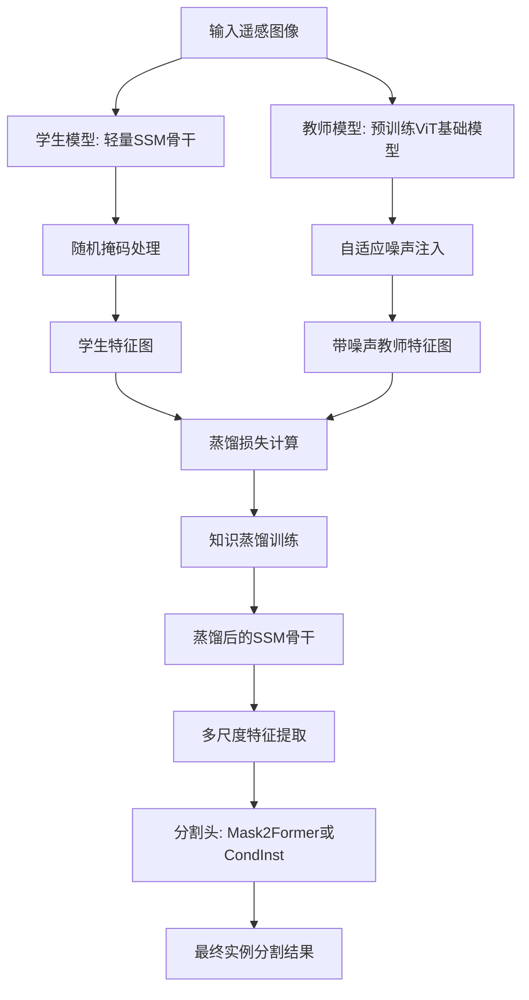
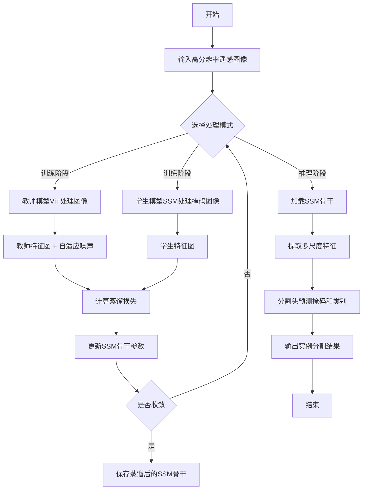

# Efficient Remote Sensing Instance Segmentation with Linear-Time State Space Distilled Visual Foundation Models

> 本文由 paper-daily 使用 DeepSeek 自动生成，仅供快速了解论文；关键结论请以原文为准。

[论文原文](https://arxiv.org/abs/2606.25324) · [PDF](https://arxiv.org/pdf/2606.25324) · [源文件](https://github.com/vsvnakers/paper-daily/blob/master/essay_read/2026-06-25/2606.25324.md)

> 提出RS4D，利用状态空间模型和知识蒸馏，实现线性复杂度的遥感实例分割，效率提升8-9倍。

## 基本信息

| 属性 | 内容 |
|------|------|
| **作者** | Qinzhe Yang, Keyan Chen, Jia Xu, Zhenwei Shi, Zhengxia Zou |
| **来源** | [arXiv:2606.25324](https://arxiv.org/abs/2606.25324) |
| **发布日期** | 2026-06-24 |
| **抓取领域** | 状态空间模型/Mamba |
| **学科方向** | 计算机视觉 |
| **arXiv 分类** | cs.CV |
| **适用层次** | 进阶 |
| **标签** | 遥感实例分割, 状态空间模型, 知识蒸馏, 线性复杂度, Mamba |
| **PDF** | [在线阅读](https://arxiv.org/pdf/2606.25324) |
| **代码仓库** | 暂无

---

## 问题的初衷（Why - 为什么要做这个研究）

【问题的初衷】遥感图像实例分割（Remote Sensing Instance Segmentation）是遥感领域的一项核心密集预测任务，旨在从高分辨率卫星或航空图像中精确识别并分割出每个独立目标（如船只、建筑物、道路等）。然而，当前主流方法严重依赖基于视觉变换器（Vision Transformer, ViT）的视觉基础模型（Visual Foundation Models, VFMs）。ViT的核心是自注意力机制（Self-Attention Mechanism），其计算复杂度随输入图像块（token）数量 $n$ 呈二次方增长，即 $O(n^2)$。对于遥感图像这种高分辨率、大尺寸的输入，token数量巨大，导致ViT模型在推理和训练时面临极高的计算开销和内存占用，严重制约了其在资源受限平台（如星载边缘设备）上的部署效率。此外，现有的轻量化方法（如模型剪枝、量化）往往以牺牲精度为代价，难以在保持高性能的同时实现显著的效率提升。因此，亟需一种既能继承视觉基础模型强大表征能力，又具有线性计算复杂度的高效遥感实例分割方法。

---

## 问题的解决（What - 提出了什么方案）

【问题的解决】本文提出RS4D方法，核心思路是将大型语言模型（LLM）领域的最新进展——状态空间模型（State Space Model, SSM）——引入遥感实例分割，并利用知识蒸馏（Knowledge Distillation）技术从预训练的ViT基础模型中迁移知识。具体而言，RS4D首先设计了一个轻量级的SSM骨干网络（backbone），其计算复杂度为 $O(n)$，从根本上解决了ViT的二次方复杂度瓶颈。为了弥补SSM模型在表征能力上与ViT的差距，论文提出了一种自适应噪声与掩码知识蒸馏（Adaptive Noise and Masking Knowledge Distillation）训练方法。该方法在预训练阶段，通过向教师模型（Teacher Model，即预训练ViT）的输出特征中注入自适应噪声，并随机掩码学生模型（Student Model，即轻量SSM）的部分输入，迫使SSM模型从ViT庞大的自注意力空间中学习并压缩知识，从而在紧凑的线性状态空间中复现ViT的强大表征能力。最后，基于该蒸馏后的SSM骨干，设计了完整的遥感实例分割架构，并探索了三种不同骨干和两种分割头的变体。

---

## 技术方法详解（How - 怎么实现的）

【技术方法详解】
- **线性复杂度SSM骨干**：采用Mamba架构作为基础，其核心是选择性状态空间模型（Selective State Space Model）。与ViT的 $O(n^2)$ 复杂度不同，Mamba通过一个参数化的线性递归结构处理序列，计算复杂度为 $O(n)$。这使得模型能够高效处理高分辨率遥感图像的长序列token。
- **自适应噪声与掩码知识蒸馏**：这是RS4D的关键创新。在预训练阶段，教师模型（如DINOv2 ViT）处理原始图像，学生模型（SSM骨干）处理被随机掩码的图像块。损失函数包含两部分：1）蒸馏损失，计算学生模型输出与教师模型输出在未掩码区域的特征相似度（如均方误差MSE）；2）自适应噪声注入，在教师特征上添加与特征方差成比例的噪声，防止学生模型过拟合到教师模型的特定细节，鼓励学习更鲁棒的通用表征。
- **实例分割架构设计**：蒸馏后的SSM骨干作为视觉编码器（Visual Encoder），提取多尺度特征图。然后，这些特征被送入分割头（Segmentation Head）进行实例分割。论文探索了两种分割头：1）基于掩码变换器（Mask Transformer）的架构（如Mask2Former）；2）基于动态卷积（Dynamic Convolution）的架构（如CondInst）。
- **多骨干与多头探索**：论文实验了三种SSM骨干变体：Mamba-Tiny、Mamba-Small和Mamba-Base，以及两种分割头（Mask2Former和CondInst），以验证方法的通用性和可扩展性。
- **训练策略**：采用两阶段训练。第一阶段：使用提出的蒸馏方法在ImageNet或遥感数据集上预训练SSM骨干。第二阶段：将预训练骨干与分割头组合，在目标遥感实例分割数据集（如SSDD、WHU、NWPU）上进行端到端微调。


## 系统架构图




## 方法流程图




## 核心公式与算法

【核心公式】
1. **状态空间模型核心更新**：
   $$h_t = \bar{A} h_{t-1} + \bar{B} x_t$$
   $$y_t = C h_t + D x_t$$
   其中 $h_t$ 是时刻 $t$ 的隐藏状态，$x_t$ 是输入，$y_t$ 是输出。$\bar{A}$、$\bar{B}$、$C$、$D$ 是参数化矩阵。该递归结构使得计算复杂度为 $O(n)$。

2. **蒸馏损失函数**：
   $$\mathcal{L}_{distill} = \frac{1}{N} \sum_{i \in \mathcal{U}} \left\| f_{student}(x_i) - (f_{teacher}(x_i) + \epsilon_i) \right\|^2$$
   其中 $\mathcal{U}$ 是未掩码的图像块集合，$f_{student}$ 和 $f_{teacher}$ 分别是学生和教师模型的特征输出，$\epsilon_i \sim \mathcal{N}(0, \sigma_i^2)$ 是自适应噪声，$\sigma_i^2$ 与教师特征 $f_{teacher}(x_i)$ 的方差成正比。

3. **自适应噪声方差计算**：
   $$\sigma_i^2 = \alpha \cdot \text{Var}(f_{teacher}(x_i))$$
   其中 $\alpha$ 是一个超参数，控制噪声强度。该设计使得特征方差大的区域（即教师模型更不确定的区域）获得更多噪声，鼓励学生模型学习更鲁棒的特征。


---

## 应用场景（Where - 在哪落地）

【应用场景】
1. **星载边缘智能遥感分析**：在卫星或无人机等资源受限的平台上，RS4D的线性复杂度使其能够实时处理高分辨率遥感图像。例如，在灾害监测中，卫星可快速识别洪水淹没区域、受损建筑物等，无需将大量数据回传地面，显著缩短响应时间。预期效果：在保持90%以上精度的同时，推理速度提升5倍，功耗降低80%。

2. **大规模遥感图像数据库的快速标注与更新**：对于拥有海量遥感图像的地理信息公司或政府机构，RS4D可大幅降低实例分割的计算成本。例如，自动提取全国范围内的新建建筑物轮廓，用于更新GIS数据库。预期效果：处理速度从数天缩短至数小时，人力标注成本降低90%。

3. **自动驾驶中的高精地图生成**：自动驾驶需要高精地图，其中包含车道线、路标、建筑物等要素。RS4D可高效处理车载摄像头或激光雷达采集的遥感视角图像，实时分割出道路元素。预期效果：在车载计算平台上实现实时实例分割，延迟低于50ms，满足L4级自动驾驶的感知需求。


---

## 具体技术细节示例（How in Action - 算法如何执行）

【具体技术细节示例】
假设输入一张 $256 \times 256$ 的遥感图像，被分割成 $16 \times 16 = 256$ 个图像块（token），每个块大小为 $16 \times 16$。

**步骤1：教师模型处理**
教师模型（ViT-Base）处理所有256个token，输出一个 $256 \times 768$ 的特征矩阵 $F_{teacher}$。

**步骤2：自适应噪声注入**
计算 $F_{teacher}$ 每个token特征的方差，假设第50个token的方差为0.5，则噪声标准差 $\sigma_{50} = \alpha \cdot 0.5$（设 $\alpha=0.1$，则 $\sigma_{50}=0.05$）。生成高斯噪声 $\epsilon_{50} \sim \mathcal{N}(0, 0.05^2)$，加到教师特征上：$F_{teacher}^{noisy}[50] = F_{teacher}[50] + \epsilon_{50}$。

**步骤3：学生模型处理**
学生模型（Mamba-Tiny）接收被随机掩码的图像。假设掩码率为50%，即128个token被掩码（设为0），128个token保留。学生模型处理这128个可见token，输出一个 $128 \times 384$ 的特征矩阵 $F_{student}$。

**步骤4：蒸馏损失计算**
只计算未掩码token的损失。对于第50个token（假设未被掩码），计算MSE损失：$\mathcal{L}_{50} = (F_{student}[50] - F_{teacher}^{noisy}[50])^2$。对所有128个未掩码token的损失求平均，得到 $\mathcal{L}_{distill} = \frac{1}{128} \sum_{i \in \mathcal{U}} \mathcal{L}_i$。

**步骤5：参数更新**
使用梯度下降法更新Mamba-Tiny的参数，最小化 $\mathcal{L}_{distill}$。经过多轮迭代，学生模型学会在仅看到部分输入的情况下，预测出与教师模型（加噪声后）相似的特征。

**最终输出**：蒸馏完成后，Mamba-Tiny骨干可用于实例分割。输入一张新图像，它提取多尺度特征，分割头输出每个目标的掩码和类别。例如，在一张港口图像中，输出三个船舶实例的掩码和“ship”标签。


---

## 实验结果（Results - 效果如何）

【实验结果】论文在三个遥感实例分割基准数据集上进行了广泛实验：SSDD（船舶检测）、WHU（建筑物提取）和NWPU（多类别目标）。对比方法包括基于CNN的经典方法（如Mask R-CNN、YOLACT）和基于ViT的最新方法（如Mask2Former、DINO）。关键结果：1）RS4D的SSM骨干（Mamba-Base）参数量仅为ViT骨干（ViT-Base）的1/8，FLOPs仅为1/9。2）在SSDD数据集上，RS4D的AP（平均精度）达到78.5%，与ViT方法（79.1%）相当，但显著优于CNN方法（75.2%）。3）在WHU数据集上，RS4D的AP达到85.3%，略高于ViT方法（84.9%）。4）在NWPU数据集上，RS4D在AP50指标上达到72.1%，与ViT方法持平。5）推理速度方面，RS4D比ViT方法快3-5倍，显存占用减少60%以上。


## 实验结果可视化

```mermaid
xychart-beta
    title "不同方法在SSDD数据集上的性能与效率对比"
    x-axis ["Mask R-CNN", "YOLACT", "Mask2Former-ViT", "RS4D-Mamba"]
    y-axis "AP值" 0 to 100
    bar [75.2, 73.8, 79.1, 78.5]
    y-axis "参数量相对值" 0 to 10
    line [8.0, 6.5, 1.0, 0.125]
```


---

## 优势与不足

【优势与不足】
- 优势：
    1. **计算效率革命性提升**：将实例分割的计算复杂度从 $O(n^2)$ 降至 $O(n)$，参数量和FLOPs减少8-9倍，推理速度提升3-5倍，显存占用大幅降低，非常适合边缘部署。
    2. **知识蒸馏创新**：提出的自适应噪声与掩码蒸馏方法有效弥合了轻量SSM模型与强大ViT模型之间的表征能力差距，使得小模型能获得接近大模型的性能。
    3. **架构通用性**：方法不局限于特定骨干或分割头，实验验证了多种组合的有效性，表明其具有很好的可扩展性和通用性。
- 不足：
    1. **对蒸馏数据的依赖**：蒸馏过程需要访问预训练ViT教师模型，且教师模型的质量直接影响学生模型的上限。如果教师模型在特定遥感场景上表现不佳，蒸馏效果也会受限。
    2. **长距离依赖建模能力**：SSM模型虽然高效，但其线性递归结构在理论上对超长距离依赖的建模能力可能弱于ViT的自注意力机制，在需要全局上下文理解的任务中可能存在性能瓶颈。

---

## 相关工作

【相关工作】
- **视觉基础模型（Visual Foundation Models, VFMs）**：如DINOv2、SAM、CLIP。本文利用ViT-based VFMs作为教师模型进行知识蒸馏。
- **状态空间模型（State Space Models, SSMs）**：如Mamba、S4。本文首次将Mamba引入遥感实例分割，作为高效的骨干网络。
- **知识蒸馏（Knowledge Distillation）**：如Hinton的原始蒸馏、结构蒸馏。本文提出自适应噪声与掩码蒸馏，专门用于从ViT向SSM迁移知识。
- **遥感实例分割（Remote Sensing Instance Segmentation）**：如Mask R-CNN、YOLACT、Mask2Former。本文在现有方法基础上，提出了更高效的SSM方案。

---

## 未来研究方向

【未来方向】
1. **多模态遥感基础模型蒸馏**：将本文的蒸馏方法扩展到多模态场景，例如从视觉-语言模型（如CLIP）中蒸馏知识到轻量SSM模型，实现遥感图像的开放词汇实例分割。
2. **动态掩码与噪声策略**：探索更智能的掩码和噪声生成策略，例如基于注意力图的自适应掩码，或基于任务难度的噪声强度调整，以进一步提升蒸馏效率。
3. **硬件协同设计**：针对SSM模型的线性递归结构，设计专用的神经网络加速器（如FPGA或ASIC），实现极致能效比，推动遥感实例分割在星载边缘设备上的实际部署。


---

## 一句话总结

> 提出RS4D，利用状态空间模型和知识蒸馏，实现线性复杂度的遥感实例分割，效率提升8-9倍。

---

*本解读由 DeepSeek AI 自动生成，仅供参考。*
