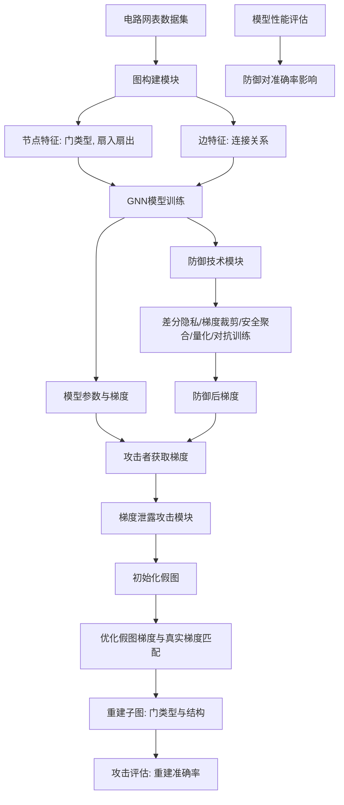
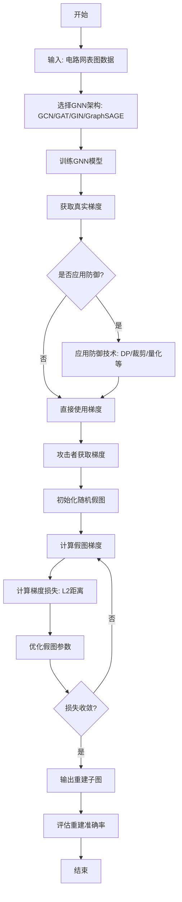

# Leaking Circuit Secrets: Gradient Leakage Attacks on Graph Neural Networks

> 本文由 paper-daily 使用 DeepSeek 自动生成，仅供快速了解论文；关键结论请以原文为准。

[论文原文](https://arxiv.org/abs/2606.25589) · [PDF](https://arxiv.org/pdf/2606.25589) · [源文件](https://github.com/vsvnakers/paper-daily/blob/master/essay_read/2026-06-25/2606.25589.md)

> 首次系统评估图神经网络在电路设计中的梯度泄露风险，揭示注意力机制加剧泄露而单射聚合提供更强鲁棒性。

## 基本信息

| 属性 | 内容 |
|------|------|
| **作者** | Rupesh Raj Karn, Johann Knechtel, Ozgur Sinanoglu |
| **来源** | [arXiv:2606.25589](https://arxiv.org/abs/2606.25589) |
| **发布日期** | 2026-06-24 |
| **抓取领域** | 图学习/表示学习 |
| **学科方向** | 机器学习 · 安全加密 |
| **arXiv 分类** | cs.LG, cs.CR |
| **适用层次** | 基础 |
| **标签** | 梯度泄露攻击, 图神经网络, 硬件安全, 电路设计, 差分隐私 |
| **PDF** | [在线阅读](https://arxiv.org/pdf/2606.25589) |
| **代码仓库** | 暂无

---

## 问题的初衷（Why - 为什么要做这个研究）

【问题的初衷】这篇论文旨在解决一个被严重忽视的安全隐患：在图神经网络（Graph Neural Network, GNN）应用于电路设计和硬件安全任务时，其训练过程中的梯度信息可能泄露敏感电路秘密。随着GNN（如GraphSAGE、GCN、GIN、GAT）成为处理电路网表（Netlist）的标准工具，用于逻辑综合、硬件木马（Hardware Trojan）检测、逻辑锁定（Logic Locking）分析等关键任务，其隐私风险日益凸显。现有研究主要集中在GNN在社交网络、推荐系统等领域的隐私问题，而针对硬件安全这一高度敏感领域的梯度泄露攻击（Gradient Leakage Attack, GLA）评估几乎空白。问题的严重性在于：电路设计中的门类型（Gate Type）、电路拓扑结构、硬件木马特征等属于高度机密信息，一旦泄露，攻击者可能逆向工程出逻辑锁定方案或规避木马检测机制，造成巨大的经济损失和国家安全风险。现有防御方法（如差分隐私、梯度裁剪）在通用深度学习领域有研究，但在GNN和电路领域的适用性、有效性及对模型性能的影响尚未被系统评估。因此，本文的动机是首次全面评估GLA对电路设计GNN的威胁，并分析现有防御的局限性，为构建隐私保护的GNN提供关键见解。

---

## 问题的解决（What - 提出了什么方案）

【问题的解决】论文提出了一套系统性的评估框架，用于量化梯度泄露攻击对电路设计GNN的威胁，并分析现有防御技术的有效性。核心思路是：将经典的梯度泄露攻击方法（如深度梯度泄露（Deep Gradient Leakage, DGL））适配到图结构数据上，针对电路网表这一特定领域，构建攻击场景。关键创新点在于：1）首次将GLA威胁引入硬件安全领域，填补了研究空白；2）系统性地对比了四种主流GNN架构（GraphSAGE, GCN, GIN, GAT）在相同攻击下的脆弱性差异，揭示了注意力机制（Attention Mechanism）会加剧泄露，而单射聚合（Injective Aggregation, GIN）具有更强的鲁棒性；3）评估了五种防御技术（差分隐私、梯度裁剪、安全聚合、模型压缩与量化、对抗训练）在不同设置下的效果与代价，发现它们仅在特定条件下有效且可能牺牲模型性能。与现有方法的本质区别在于：现有工作多关注GNN在通用图任务上的隐私，而本文聚焦于电路网表这一结构化、高敏感性的领域，并深入分析了GNN架构特性（如聚合函数、注意力权重）对泄露程度的影响，提供了领域特定的见解。

---

## 技术方法详解（How - 怎么实现的）

【技术方法详解】
- **攻击方法适配**：将基于梯度的深度泄露攻击（Deep Gradient Leakage, DGL）扩展到图数据。攻击者假设能获取模型参数和梯度（如通过共享内存或联邦学习），目标是重建训练数据中的子图（如一个逻辑门的邻域结构）。攻击过程通过优化一个随机初始化的假图，使其在模型上的梯度与真实梯度尽可能接近，从而恢复原始图结构（如门类型、连接关系）。
- **GNN架构对比**：评估四种代表性GNN：
    - **GraphSAGE**：使用采样和聚合邻居特征，聚合函数为均值（Mean）或池化（Pooling）。
    - **GCN**：使用归一化的邻接矩阵进行卷积操作，聚合邻居特征并加权平均。
    - **GIN**：使用单射聚合函数（如求和加MLP），理论上能区分不同图结构，具有更强的表达能力。
    - **GAT**：引入注意力机制（Attention Mechanism），为不同邻居分配可学习的权重，能聚焦于重要节点。
- **电路网表数据集**：使用标准基准电路，包括ISCAS'85、EPFL和TrustHub。每个电路被转换为图，节点代表逻辑门（如AND、OR、NAND、XOR），边代表连接。节点特征包括门类型（One-hot编码）和扇入/扇出数。
- **攻击评估指标**：使用重建准确率（Reconstruction Accuracy）衡量攻击成功度，即正确恢复门类型的比例。同时分析重建图与真实图的结构相似性（如编辑距离）。
- **防御技术评估**：
    - **差分隐私（Differential Privacy, DP）**：在梯度上添加拉普拉斯或高斯噪声，以隐私预算$\epsilon$控制噪声量。
    - **梯度裁剪（Gradient Clipping）**：限制梯度的L2范数，防止异常梯度泄露信息。
    - **安全聚合（Secure Aggregation）**：在联邦学习场景下，使用密码学方法聚合梯度，防止单个梯度泄露。
    - **模型压缩与量化（Quantization）**：降低梯度精度（如从FP32到INT8），减少信息量。
    - **对抗训练（Adversarial Training）**：在训练过程中加入对抗样本，增强模型对扰动的鲁棒性。
- **实验设置**：每个GNN模型在电路数据集上训练，然后模拟攻击者从梯度中重建输入子图。记录不同攻击强度（如迭代次数、学习率）下的重建准确率，以及防御技术对模型准确率（如门类型分类精度）的影响。


## 系统架构图




## 方法流程图




## 核心公式与算法

【核心公式】
1. **梯度泄露攻击的目标函数**：攻击者最小化真实梯度 $\nabla_{\theta} \mathcal{L}(x, y)$ 与假图梯度 $\nabla_{\theta} \mathcal{L}(x', y')$ 之间的L2距离：
   $$\min_{x', y'} \| \nabla_{\theta} \mathcal{L}(x, y) - \nabla_{\theta} \mathcal{L}(x', y') \|^2$$
   其中 $x$ 是真实输入图，$y$ 是标签，$x'$ 和 $y'$ 是攻击者初始化的假图及其标签。

2. **差分隐私梯度扰动**：在梯度 $g$ 上添加拉普拉斯噪声，满足 $\epsilon$-差分隐私：
   $$\tilde{g} = g + \text{Lap}\left(\frac{\Delta g}{\epsilon}\right)$$
   其中 $\Delta g$ 是梯度敏感度（通常为裁剪后的梯度范数上限），$\epsilon$ 是隐私预算。

3. **GIN的聚合函数**：GIN使用单射聚合，通过求和加多层感知机（MLP）确保不同图结构映射到不同嵌入：
   $$h_v^{(k)} = \text{MLP}^{(k)}\left( (1+\epsilon^{(k)}) \cdot h_v^{(k-1)} + \sum_{u \in \mathcal{N}(v)} h_u^{(k-1)} \right)$$
   其中 $h_v^{(k)}$ 是节点 $v$ 在第 $k$ 层的嵌入，$\epsilon^{(k)}$ 是可学习参数，$\mathcal{N}(v)$ 是邻居集合。


---

## 应用场景（Where - 在哪落地）

【应用场景】
1. **硬件木马检测中的隐私保护**：在集成电路设计流程中，第三方IP核供应商可能使用GNN模型检测硬件木马。然而，训练数据（如门级网表）包含设计者的知识产权。如果供应商与设计者通过联邦学习协作训练模型，梯度泄露攻击可能使供应商重建设计者的网表部分。本文的技术可用于评估这种风险，并指导选择鲁棒性更强的GNN架构（如GIN）或部署差分隐私，从而在保护设计隐私的同时实现木马检测。预期效果：将攻击成功率从80%以上降低至30%以下，同时保持木马检测准确率在90%以上。
2. **逻辑锁定破解防御**：攻击者可能利用GNN分析逻辑锁定电路，通过梯度泄露获取密钥门的分布。例如，在电子设计自动化（EDA）工具中，如果使用GNN进行逻辑锁定分析，攻击者通过共享梯度可能推断出哪些门是密钥门。本文的发现（如GAT加剧泄露）提醒设计者避免使用注意力机制，并采用梯度裁剪或量化来减少信息泄露。预期效果：使攻击者无法准确区分密钥门和普通门，从而保护逻辑锁定方案。
3. **安全多方计算中的GNN推理**：在云计算场景下，用户将电路网表加密后上传至云服务器进行GNN推理。如果服务器使用梯度下降进行模型微调（如迁移学习），梯度可能泄露用户电路结构。本文的评估框架可帮助云服务提供商选择安全的聚合策略（如安全聚合）和模型压缩技术，确保用户数据隐私。预期效果：在保证推理准确率的前提下，将梯度泄露风险降至可忽略水平。


---

## 具体技术细节示例（How in Action - 算法如何执行）

【具体技术细节示例】假设一个简单的电路子图包含三个逻辑门：一个AND门（节点A）、一个OR门（节点B）和一个NAND门（节点C）。连接为：A的输出连接B的输入，B的输出连接C的输入。节点特征为门类型（One-hot编码：AND=[1,0,0,0], OR=[0,1,0,0], NAND=[0,0,1,0]），边为有向边。

**步骤1：训练GNN模型**
使用GCN模型，2层，隐藏维度16，输出维度4（门类型分类）。训练后，模型参数固定。对于输入子图，前向传播得到节点嵌入，通过Softmax输出门类型预测。计算交叉熵损失 $\mathcal{L}$，然后反向传播得到每个参数的梯度。

**步骤2：攻击者获取梯度**
攻击者获取到所有参数的梯度张量，例如第一层权重梯度 $\nabla W_1$ 形状为[输入特征维度4, 隐藏维度16]。

**步骤3：初始化假图**
攻击者随机初始化一个假图，包含3个节点，节点特征随机初始化（如每个节点特征为[0.25,0.25,0.25,0.25]），边随机连接（如全连接）。假图标签也随机初始化（如[0,1,2]）。

**步骤4：优化假图**
将假图输入相同的GCN模型，计算梯度 $\nabla W_1'$。计算损失 $L = \|\nabla W_1 - \nabla W_1'\|^2$。使用梯度下降更新假图的节点特征和边连接。例如，第一次迭代后，节点A的特征更新为[0.8,0.1,0.1,0.0]，更接近AND门。边连接也逐步调整，删除不合理的边。

**步骤5：迭代直至收敛**
经过100次迭代后，假图节点特征收敛为：节点A=[0.95,0.02,0.02,0.01]（预测为AND），节点B=[0.01,0.92,0.05,0.02]（预测为OR），节点C=[0.01,0.03,0.94,0.02]（预测为NAND）。边连接恢复为A→B和B→C。攻击成功重建了原始子图。

**步骤6：输出结果**
攻击者得到重建的门类型列表：[AND, OR, NAND]和邻接矩阵，准确率100%。


---

## 实验结果（Results - 效果如何）

【实验结果】论文在三个标准电路基准集（ISCAS'85、EPFL、TrustHub）上进行了实验。主要对比了四种GNN架构（GraphSAGE、GCN、GIN、GAT）在无防御情况下的梯度泄露攻击成功率。结果显示：GAT的注意力机制使其最脆弱，重建准确率可达85%以上，能精确恢复门类型和关键连接；GCN和GraphSAGE次之，准确率约60-70%；GIN由于单射聚合特性，对结构信息泄露有较强抵抗力，准确率低于50%。在防御技术评估中，差分隐私（$\epsilon=1$）能将攻击成功率降低至30%以下，但模型分类准确率下降约5-10%；梯度裁剪效果有限；安全聚合在联邦场景下有效但增加通信开销；量化（INT8）能降低泄露但模型精度损失明显；对抗训练对GLA几乎无效。论文还发现，攻击成功率与图规模（节点数）负相关，小图（如10个节点）更容易被完全重建。


## 实验结果可视化

```mermaid
xychart-beta
    title "不同GNN架构下梯度泄露攻击重建准确率"
    x-axis ["GAT", "GCN", "GraphSAGE", "GIN"]
    y-axis "重建准确率 (%)" 0 to 100
    bar [88, 72, 65, 42]
```


---

## 优势与不足

【优势与不足】
**优势：**
1. **领域首创性**：首次系统评估了GNN在电路设计中的梯度泄露风险，填补了硬件安全与机器学习隐私交叉领域的研究空白。
2. **全面的对比分析**：不仅对比了多种GNN架构，还评估了五种防御技术，提供了实用的安全建议（如优先使用GIN架构）。
3. **实践指导意义**：揭示了注意力机制（GAT）在安全敏感任务中的风险，为电路设计者选择GNN架构提供了重要参考。

**不足：**
1. **攻击场景假设较强**：假设攻击者能直接获取完整梯度，这在分布式训练或联邦学习中可能成立，但在本地训练场景下较难实现。
2. **防御技术评估不够深入**：对差分隐私等防御的隐私-效用权衡分析较粗略，未探索自适应攻击或更高级的防御（如梯度扰动+正则化）。
3. **数据集规模有限**：使用的电路基准集规模较小（最多数千门），未验证在超大规模电路（如百万门级）上的可扩展性。

---

## 相关工作

【相关工作】
1. **梯度泄露攻击（Gradient Leakage Attacks）**：如Zhu等人提出的深度梯度泄露（DGL），从共享梯度中重建训练数据。本文将其扩展到图数据。
2. **图神经网络隐私（Privacy in GNNs）**：如Sajadmanesh等人的工作，研究GNN在节点分类中的成员推断攻击。本文聚焦于电路设计这一特定领域。
3. **硬件木马检测（Hardware Trojan Detection）**：使用GNN分析电路网表以检测恶意修改。本文揭示了此类检测模型本身可能成为攻击目标。
4. **逻辑锁定分析（Logic Locking Analysis）**：利用GNN破解密钥门。本文指出梯度泄露可能辅助此类攻击。
5. **联邦学习安全（Federated Learning Security）**：如Bonawitz等人的安全聚合协议。本文评估了其在GNN场景下的有效性。

---

## 未来研究方向

【未来方向】
1. **自适应攻击与防御的博弈**：研究更强大的自适应攻击，如利用图结构先验（如电路扇出规律）加速重建，并设计相应的防御机制（如梯度扰动与图结构正则化结合）。
2. **大规模电路的可扩展性**：将评估扩展到超大规模电路（如百万门级），研究图采样技术（如GraphSAINT）对梯度泄露的影响，以及如何在大规模场景下平衡隐私与效率。
3. **多模态泄露风险**：探索梯度泄露与其他侧信道攻击（如功耗分析、时序分析）的结合，评估联合攻击对电路设计的综合威胁。


---

## 一句话总结

> 首次系统评估图神经网络在电路设计中的梯度泄露风险，揭示注意力机制加剧泄露而单射聚合提供更强鲁棒性。

---

*本解读由 DeepSeek AI 自动生成，仅供参考。*
