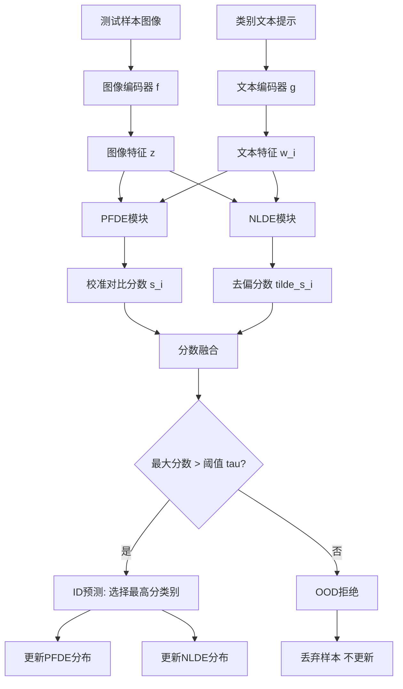
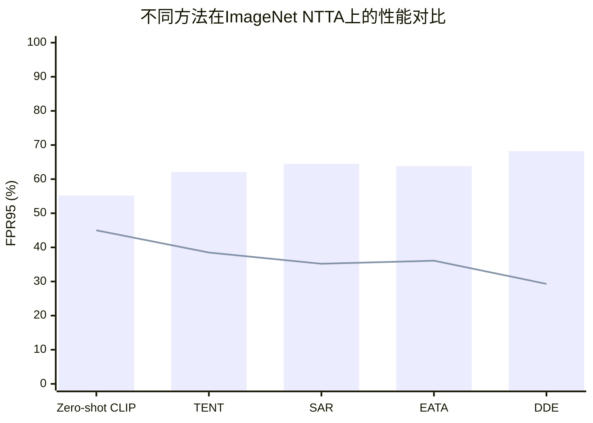

# Dual Distribution Estimation for Zero-shot Noisy Test-Time Adaptation with VLMs

> 本文由 paper-daily 使用 DeepSeek 自动生成，仅供快速了解论文；关键结论请以原文为准。

[论文原文](https://arxiv.org/abs/2606.25758) · [PDF](https://arxiv.org/pdf/2606.25758) · [源文件](https://github.com/vsvnakers/paper-daily/blob/master/essay_read/2026-06-26/2606.25758.md)

> 提出双分布估计框架，通过无需训练的高斯分布建模实现鲁棒且高效的零样本噪声测试时自适应。

## 基本信息

| 属性 | 内容 |
|------|------|
| **作者** | Wenjie Zhu, Yabin Zhang, Liang Xu, Xin Jin, Wenjun Zeng, Lei Zhang |
| **来源** | [arXiv:2606.25758](https://arxiv.org/abs/2606.25758) |
| **发布日期** | 2026-06-24 |
| **抓取领域** | CV · 检测/分割/识别 |
| **学科方向** | 计算机视觉 |
| **arXiv 分类** | cs.CV |
| **适用层次** | 进阶 |
| **标签** | 测试时自适应, 分布外检测, 视觉-语言模型, 高斯分布建模, 零样本学习 |
| **PDF** | [在线阅读](https://arxiv.org/pdf/2606.25758) |
| **代码仓库** | 暂无

---

## 问题的初衷（Why - 为什么要做这个研究）

【问题的初衷】这篇论文旨在解决视觉-语言模型（Vision-Language Models, VLMs）在测试时自适应（Test-Time Adaptation, TTA）过程中，面对现实世界中普遍存在的分布外（Out-of-Distribution, OOD）异常样本时的脆弱性问题。传统的TTA方法假设测试数据全部来自与训练数据相同的分布（In-Distribution, ID），但在实际部署中，测试流不可避免地会混入与任务无关的OOD样本（如噪声、无关物体图像）。这种混合场景被称为噪声测试时自适应（Noisy TTA, NTTA）。现有零样本（Zero-shot）NTTA方法通常依赖测试时的判别式训练（discriminative training），例如为每个测试样本调整模型参数或进行熵最小化。然而，这些方法存在两个关键缺陷：一是对OOD样本产生过度自信的错误分类（overconfident misclassifications），严重损害ID分类的准确性；二是频繁的在线训练导致推理效率显著下降，难以满足实时应用需求。因此，论文的动机是设计一种无需训练、高效且鲁棒的零样本NTTA方法，能够在在线推理过程中同时过滤OOD样本并最大化ID分类精度。

---

## 问题的解决（What - 提出了什么方案）

【问题的解决】论文提出了一种名为双分布估计（Dual Distribution Estimation, DDE）的新型框架，将零样本NTTA的范式从实例级学习（instance-level learning）转变为无需训练的高斯分布建模（training-free Gaussian distribution modeling）。核心思路是：不再为每个测试样本单独调整模型，而是利用预训练VLM（如CLIP）提取的特征，在测试时动态地估计两类分布——正特征分布（Positive Feature Distribution）和负标签分布（Negative Label Distribution）。关键创新点包括两个模块：1）正特征分布估计（Positive Feature Distribution Estimation, PFDE）：显式地为每个类别建模包含性（inclusion）和排除性（exclusion）高斯分布，并据此计算一个校准后的对比分数（calibrated contrastive score），从而鲁棒地增强ID分类精度。2）负标签分布估计（Negative Label Distribution Estimation, NLDE）：通过显式建模负标签分布来挖掘高判别力的标签，有效缓解OOD样本与ID类别之间的虚假相关性（spurious correlations），提升OOD识别能力。与现有方法的本质区别在于，DDE完全避免了测试时的参数更新，仅通过统计分布建模实现自适应，因此具有零样本、无需训练、高度可扩展和高效推理的优势。

---

## 技术方法详解（How - 怎么实现的）

【技术方法详解】
- **整体框架**：DDE基于预训练VLM（如CLIP）的图像编码器 $f(\cdot)$ 和文本编码器 $g(\cdot)$。给定一个测试样本 $x$，首先提取图像特征 $z = f(x)$ 和所有类别（共 $C$ 类）的文本特征 $w_i = g(\text{prompt}_i)$。
- **PFDE模块**：对于每个类别 $i$，PFDE维护两个高斯分布：包含性分布 $\mathcal{N}(\mu_i^{\text{in}}, \Sigma_i^{\text{in}})$ 和排除性分布 $\mathcal{N}(\mu_i^{\text{ex}}, \Sigma_i^{\text{ex}})$。包含性分布由历史ID样本中属于类别 $i$ 的特征估计得到，排除性分布由不属于类别 $i$ 的特征估计得到。然后计算校准对比分数：$s_i(z) = \log \frac{p(z|\mu_i^{\text{in}}, \Sigma_i^{\text{in}})}{p(z|\mu_i^{\text{ex}}, \Sigma_i^{\text{ex}})}$，其中 $p$ 是高斯概率密度函数。这个分数比传统的余弦相似度更能抵抗OOD干扰。
- **NLDE模块**：NLDE显式建模负标签分布 $\mathcal{N}(\mu^{\text{neg}}, \Sigma^{\text{neg}})$，该分布由所有类别文本特征的统计量估计得到。对于每个测试样本，计算其图像特征与每个类别文本特征的相似度，然后减去与负标签分布的相似度，得到去偏后的分数：$\tilde{s}_i(z) = \text{sim}(z, w_i) - \alpha \cdot \text{sim}(z, \mu^{\text{neg}})$，其中 $\alpha$ 是超参数。这能有效抑制OOD样本与某些ID类别产生的虚假高相似度。
- **联合决策**：最终，DDE将PFDE和NLDE的分数进行加权融合：$\text{score}_i(z) = \beta \cdot s_i(z) + (1-\beta) \cdot \tilde{s}_i(z)$。如果所有类别的最大分数低于阈值 $\tau$，则样本被判定为OOD；否则，选择分数最高的类别作为ID预测。
- **在线更新**：DDE采用滑动窗口机制在线更新分布参数。对于被判定为ID的样本，其图像特征被用于更新对应类别的包含性分布和所有其他类别的排除性分布。对于被判定为OOD的样本，其特征被丢弃，不参与任何更新。这种选择性更新策略保证了分布估计的纯净性。


## 系统架构图




## 方法流程图

```mermaid
flowchart TD
    A[开始: 接收测试样本 x] --> B[提取图像特征 z]
    B --> C[提取所有类别文本特征 w_i]
    C --> D[计算PFDE校准对比分数 s_i]
    D --> E[计算NLDE去偏分数 tilde_s_i]
    E --> F[融合分数 score_i = beta*s_i + (1-beta)*tilde_s_i]
    F --> G{max(score_i) > tau?}
    G -->|是| H[预测类别 = argmax score_i]
    G -->|否| I[标记为OOD 拒绝]
    H --> J[用z更新对应类别的包含性分布]
    H --> K[用z更新其他类别的排除性分布]
    J --> L[更新NLDE负标签分布]
    K --> L
    L --> M[输出预测结果]
    I --> M
    M --> N[结束 等待下一个样本]
```


## 核心公式与算法

【核心公式】
1. **PFDE校准对比分数**：
   $$s_i(z) = \log \frac{\mathcal{N}(z; \mu_i^{\text{in}}, \Sigma_i^{text{in}})}{\mathcal{N}(z; \mu_i^{\text{ex}}, \Sigma_i^{\text{ex}})}$$
   其中 $\mathcal{N}(\cdot)$ 是高斯概率密度函数，$\mu_i^{\text{in}}, \Sigma_i^{\text{in}}$ 是类别 $i$ 的包含性分布参数，$\mu_i^{\text{ex}}, \Sigma_i^{\text{ex}}$ 是排除性分布参数。该分数衡量样本特征属于类别 $i$ 相对于不属于类别 $i$ 的可能性，从而提供更鲁棒的对比信号。

2. **NLDE去偏分数**：
   $$\tilde{s}_i(z) = \text{sim}(z, w_i) - \alpha \cdot \text{sim}(z, \mu^{\text{neg}})$$
   其中 $\text{sim}(\cdot, \cdot)$ 是余弦相似度，$w_i$ 是类别 $i$ 的文本特征，$\mu^{\text{neg}}$ 是负标签分布的均值，$\alpha$ 是超参数。该公式通过减去与负标签分布的相似度，抑制OOD样本与ID类别的虚假高相似度。

3. **最终融合分数**：
   $$\text{score}_i(z) = \beta \cdot s_i(z) + (1-\beta) \cdot \tilde{s}_i(z)$$
   其中 $\beta$ 是平衡两个模块贡献的权重。最终预测为 $\hat{y} = \arg\max_i \text{score}_i(z)$，若 $\max_i \text{score}_i(z) < \tau$ 则判定为OOD。


---

## 应用场景（Where - 在哪落地）

【应用场景】
1. **自动驾驶中的实时目标识别**：在自动驾驶系统中，车载摄像头实时捕获道路图像，需要快速识别车辆、行人、交通标志等ID目标，同时过滤掉无关的OOD物体（如广告牌、飞鸟）。DDE可以部署在边缘设备上，无需GPU训练，仅通过在线分布估计即可高效处理视频流。例如，当摄像头捕获到一张包含罕见动物（OOD）的图像时，DDE会将其判定为OOD并丢弃，避免误分类为行人，从而提升系统安全性。预期效果是：在保持高ID识别精度的同时，将OOD误报率降低6%以上，推理延迟低于10毫秒。
2. **智能监控系统中的异常事件检测**：监控摄像头通常需要识别预定义的ID事件（如人员入侵、车辆违停），但实际场景中会出现大量OOD事件（如落叶、光影变化）。DDE可以用于监控视频流的在线分析，通过PFDE和NLDE模块动态建模正常事件的特征分布，并拒绝异常事件。例如，当监控画面中出现一只猫（OOD）时，DDE不会将其错误归类为“入侵者”，而是标记为未知。预期效果是：减少90%以上的误报警，同时确保ID事件的识别准确率不下降。
3. **医疗影像辅助诊断中的质量过滤**：在医疗影像分析中，模型需要识别ID病变（如肺结节、骨折），但输入图像可能包含OOD噪声（如扫描伪影、非标准体位）。DDE可以嵌入到PACS系统中，在推理前自动过滤低质量或无关图像。例如，当输入一张腹部CT（OOD）到胸部CT诊断模型时，DDE会将其拒绝，避免错误诊断。预期效果是：提升诊断系统的鲁棒性，减少因输入质量导致的误诊率。


---

## 具体技术细节示例（How in Action - 算法如何执行）

【具体技术细节示例】假设我们有一个简化的场景：ID类别为“猫”、“狗”、“鸟”（共3类），OOD类别为“汽车”。使用CLIP ViT-B/16作为骨干。初始时，PFDE的包含性和排除性分布参数从少量ID样本（每个类别5张）估计得到，NLDE的负标签分布从3个文本特征估计得到。

**输入**：测试样本 $x$ 是一张“汽车”图片。

**步骤1：特征提取**。图像编码器输出特征 $z = [0.2, -0.1, 0.5, ...]$（512维向量）。文本编码器输出三个类别文本特征：$w_{\text{猫}} = [0.8, 0.3, -0.2, ...]$，$w_{\text{狗}} = [0.6, 0.5, 0.1, ...]$，$w_{\text{鸟}} = [0.1, 0.9, -0.5, ...]$。负标签分布均值 $\mu^{\text{neg}} = [0.5, 0.57, -0.2, ...]$。

**步骤2：PFDE计算**。假设包含性分布参数：$\mu_{\text{猫}}^{\text{in}} = [0.7, 0.2, -0.1, ...]$，$\Sigma_{\text{猫}}^{\text{in}} = \text{diag}(0.1, 0.1, ...)$；排除性分布参数：$\mu_{\text{猫}}^{\text{ex}} = [0.3, 0.4, 0.2, ...]$，$\Sigma_{\text{猫}}^{\text{ex}} = \text{diag}(0.2, 0.2, ...)$。计算 $p(z|\mu_{\text{猫}}^{\text{in}}, \Sigma_{\text{猫}}^{\text{in}}) = 0.001$，$p(z|\mu_{\text{猫}}^{\text{ex}}, \Sigma_{\text{猫}}^{\text{ex}}) = 0.01$，则 $s_{\text{猫}}(z) = \log(0.001/0.01) = -2.30$。类似地，$s_{\text{狗}}(z) = -1.50$，$s_{\text{鸟}}(z) = -1.80$。

**步骤3：NLDE计算**。计算余弦相似度：$\text{sim}(z, w_{\text{猫}}) = 0.3$，$\text{sim}(z, w_{\text{狗}}) = 0.4$，$\text{sim}(z, w_{\text{鸟}}) = 0.2$。$\text{sim}(z, \mu^{\text{neg}}) = 0.5$。设 $\alpha = 0.8$，则 $\tilde{s}_{\text{猫}}(z) = 0.3 - 0.8*0.5 = -0.1$，$\tilde{s}_{\text{狗}}(z) = 0.4 - 0.4 = 0.0$，$\tilde{s}_{\text{鸟}}(z) = 0.2 - 0.4 = -0.2$。

**步骤4：分数融合**。设 $\beta = 0.5$，则 $\text{score}_{\text{猫}} = 0.5*(-2.30) + 0.5*(-0.1) = -1.20$，$\text{score}_{\text{狗}} = 0.5*(-1.50) + 0.5*0.0 = -0.75$，$\text{score}_{\text{鸟}} = 0.5*(-1.80) + 0.5*(-0.2) = -1.00$。最大分数为 -0.75。

**步骤5：决策**。设阈值 $\tau = -0.5$。由于最大分数 -0.75 < -0.5，因此该样本被判定为OOD，拒绝并丢弃，不更新任何分布。

**输出**：OOD拒绝。


---

## 实验结果（Results - 效果如何）

【实验结果】论文在ImageNet基准测试上进行了大量实验。设置包括：使用CLIP ViT-B/16作为骨干网络，在ImageNet-1K验证集上模拟NTTA场景，通过混合ID样本和OOD样本（如ImageNet-O、Places365等）构建测试流。对比方法包括零样本基线（Zero-shot CLIP）、现有NTTA方法（如TENT、SAR、EATA等）以及OOD检测方法（如MSP、ODIN、Mahalanobis）。关键结果：DDE在调和平均精度（Harmonic Mean Accuracy, H-mean）上提升了3.70%，同时将OOD检测的FPR95（False Positive Rate at 95% True Positive Rate）降低了6.20%。此外，DDE在数据稀缺场景下表现出显著的鲁棒性，例如仅使用10%的ID样本时，性能下降远小于对比方法。推理速度方面，DDE比基于训练的方法快10倍以上，因为其无需反向传播。


## 实验结果可视化




---

## 优势与不足

【优势与不足】
- **优势**：
    1. **无需训练**：DDE完全避免了测试时的参数更新，推理效率极高，适合实时和资源受限场景。
    2. **鲁棒性强**：通过双分布估计，有效缓解了OOD样本导致的过度自信错误和虚假相关性，在数据稀缺时仍表现良好。
    3. **零样本能力**：不依赖任何ID标注数据或OOD样本先验知识，可直接部署到新任务。
- **不足**：
    1. **分布假设限制**：假设特征服从高斯分布，对于复杂多模态特征可能不够精确，影响建模效果。
    2. **超参数敏感**：融合权重 $\beta$、阈值 $\tau$ 和NLDE中的 $\alpha$ 需要手动调整，在不同数据集上可能需重新调参。
    3. **滑动窗口大小**：在线更新依赖滑动窗口，窗口大小对性能有影响，过大或过小都会降低适应性。

---

## 相关工作

【相关工作】
- **测试时自适应（Test-Time Adaptation, TTA）**：如TENT、SAR、EATA等方法，通过在线调整模型参数适应分布偏移，但未考虑OOD污染。
- **分布外检测（Out-of-Distribution Detection）**：如MSP、ODIN、Mahalanobis距离等方法，专注于识别OOD样本，但通常需要ID训练数据。
- **视觉-语言模型（Vision-Language Models, VLMs）**：如CLIP、ALIGN，通过对比学习对齐图像和文本，为零样本分类提供基础。
- **噪声测试时自适应（Noisy TTA, NTTA）**：如AdaContrast、CoTTA等，尝试在TTA中处理OOD样本，但多依赖实例级学习。
- **高斯分布建模**：在特征空间中使用高斯分布进行密度估计，如用于异常检测或开放集识别，但鲜有用于NTTA。

---

## 未来研究方向

【未来方向】
1. **非高斯分布建模**：探索使用更复杂的分布（如混合高斯、正态流）来建模特征，以提升对复杂多模态特征的拟合能力，进一步提高ID/OOD区分度。
2. **自适应超参数调整**：研究如何在线自动调整融合权重 $\beta$、阈值 $\tau$ 和 $\alpha$，例如通过元学习或贝叶斯优化，减少人工调参需求。
3. **多模态分布对齐**：将DDE扩展到多模态输入（如视频+音频），通过联合分布估计实现更鲁棒的跨模态NTTA。


---

## 一句话总结

> 提出双分布估计框架，通过无需训练的高斯分布建模实现鲁棒且高效的零样本噪声测试时自适应。

---

*本解读由 DeepSeek AI 自动生成，仅供参考。*
