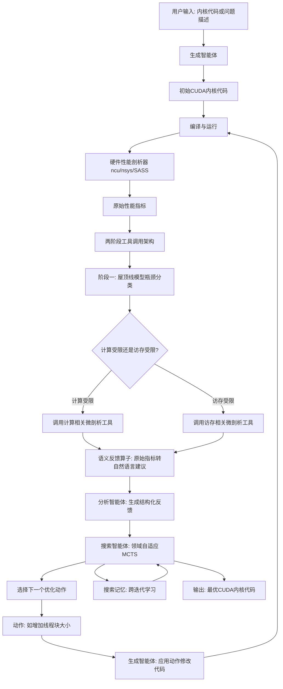
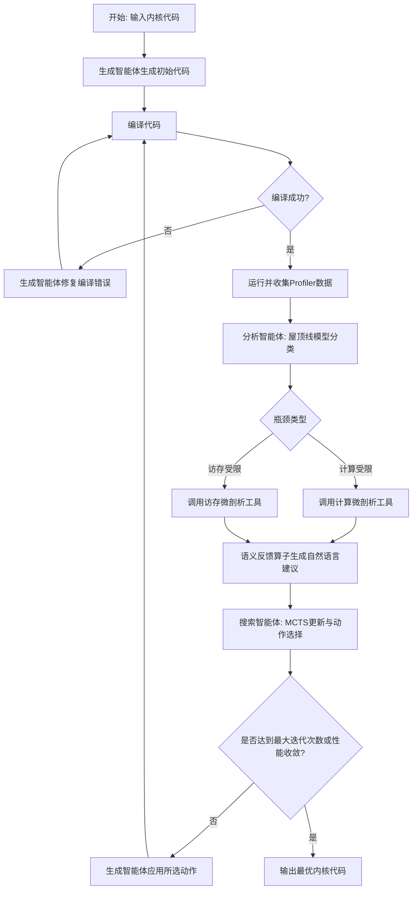
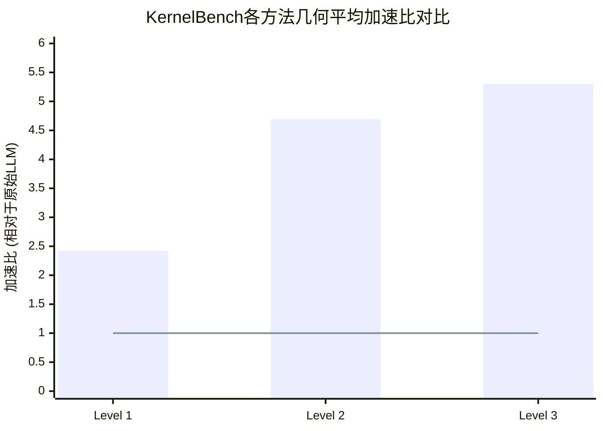

# Optimizing CUDA like a Human: Micro-Profiling Tools as Expert Surrogates for LLM-Based GPU Kernel Optimization

> 本文由 paper-daily 使用 DeepSeek 自动生成，仅供快速了解论文；关键结论请以原文为准。

[论文原文](https://arxiv.org/abs/2606.26453) · [PDF](https://arxiv.org/pdf/2606.26453) · [源文件](https://github.com/vsvnakers/paper-daily/blob/master/essay_read/2026-06-26/2606.26453.md)

> KernelPro通过将LLM与硬件剖析器和可插拔专家工具结合，实现了自动化的、可解释的GPU内核代码迭代优化。

## 基本信息

| 属性 | 内容 |
|------|------|
| **作者** | Jiading Gai, Shuai Zhang, Kaj Bostrom, Jin Huang, Vihang Patil, Haoyang Fang, Bernie Wang, Huzefa Rangwala, George Karypis |
| **来源** | [arXiv:2606.26453](https://arxiv.org/abs/2606.26453) |
| **发布日期** | 2026-06-24 |
| **抓取领域** | 自然语言处理 |
| **学科方向** | 机器学习 |
| **arXiv 分类** | cs.LG |
| **适用层次** | 进阶 |
| **标签** | 大语言模型, GPU内核优化, 蒙特卡洛树搜索, 性能剖析, 自动调优 |
| **PDF** | [在线阅读](https://arxiv.org/pdf/2606.26453) |
| **代码仓库** | 暂无

---

## 问题的初衷（Why - 为什么要做这个研究）

【问题的初衷】这篇论文旨在解决一个核心挑战：如何利用大语言模型（Large Language Model, LLM）自动生成并优化高性能的GPU内核代码（CUDA Kernel）。尽管LLM在代码生成方面取得了显著进展，但在生成CUDA这类对硬件架构细节极度敏感、需要深度优化（如内存访问模式、线程束调度、指令级并行）的底层代码时，表现远不如人类专家。现有方法存在几个关键不足：第一，LLM生成的代码通常功能正确但性能低下，缺乏针对特定GPU架构（如NVIDIA Hopper）的微架构级优化；第二，传统的自动调优（Auto-tuning）方法（如TVM、Ansor）依赖于昂贵的穷举搜索，搜索空间巨大且缺乏领域知识引导；第三，LLM缺乏对硬件性能分析工具（Profiler）反馈的深度理解，无法像人类专家那样解读性能计数器（Performance Counter）并定位瓶颈（如访存受限、计算受限、指令延迟）。因此，研究动机是构建一个能够模拟人类专家优化思维过程的闭环系统，将LLM的代码生成能力与硬件Profiler的反馈、以及可插拔的瓶颈检测工具（Micro-Profiling Tools）深度结合，实现自动化的、迭代式的、可解释的GPU内核优化。

---

## 问题的解决（What - 提出了什么方案）

【问题的解决】论文提出了KernelPro，一个闭环多智能体系统（Closed-Loop Multi-Agent System），通过将LLM代码生成与硬件Profiler反馈和可插拔瓶颈检测工具集成，来自动生成、性能剖析并迭代优化GPU内核代码。其核心思路是让LLM扮演一个“人类专家”的角色，但通过四个关键创新来弥补其不足：第一，语义反馈算子（Semantic Feedback Operator），它将人类专家的启发式知识编码为可插拔的微剖析工具，将原始的硬件指标（如带宽利用率、计算吞吐量）转化为可操作的自然语言指导（如“您的内核受限于L2缓存带宽，建议使用向量化加载指令”），解决了LLM无法直接理解原始性能计数器的问题。第二，两阶段工具调用架构（Two-Stage Tool Invocation Architecture），首先基于屋顶线模型（Roofline Model）进行瓶颈分类，然后根据分类结果选择性调用专门的分析工具（如内核级ncu、指令级SASS、系统级nsys），避免了不必要的性能开销。第三，领域自适应的蒙特卡洛树搜索（Domain-Adapted MCTS），通过渐进式扩展、非对称分支、对数奖励校准、死胡同剪枝和跨迭代搜索记忆等策略，在巨大的优化动作空间中高效搜索，比贪心搜索（Greedy Search）性能提升26%。第四，直接CuTe源代码级代码生成（Direct CuTe Source-Level Code Generation），通过自主代码搜索CUTLASS/CuTe代码库，生成利用最新硬件特性（如Hopper WGMMA指令）的高效代码。与现有方法的本质区别在于，KernelPro不是简单地让LLM生成代码然后测试，而是构建了一个完整的、可解释的、领域知识驱动的优化循环，使LLM能够像人类专家一样“思考-分析-修改-验证”。

---

## 技术方法详解（How - 怎么实现的）

【技术方法详解】
- **多智能体系统架构**：KernelPro由三个核心智能体组成：生成智能体（Generator Agent）负责初始代码生成和修改；分析智能体（Analyzer Agent）负责解读Profiler反馈并调用微剖析工具；搜索智能体（Search Agent）负责管理MCTS搜索过程，决定下一步探索哪个优化方向。这三个智能体通过一个共享的“黑板”（Blackboard）进行通信，存储代码、性能数据和优化历史。
- **语义反馈算子与微剖析工具**：这是KernelPro的核心创新。每个微剖析工具（Micro-Profiling Tool）封装了一个特定的专家启发式规则。例如，一个工具可能专门检测“是否使用了共享内存（Shared Memory）来减少全局内存访问”，另一个工具可能检测“线程束发散（Warp Divergence）的程度”。这些工具接收原始Profiler数据（如ncu的输出），输出结构化的自然语言建议。工具是可插拔的，意味着可以轻松添加新的专家知识。
- **两阶段工具调用架构**：第一阶段是瓶颈分类，使用屋顶线模型（Roofline Model）快速判断内核是计算受限（Compute-Bound）还是访存受限（Memory-Bound）。第二阶段根据分类结果，从工具库中选择最相关的工具执行。例如，如果判断为访存受限，则调用与内存访问模式、缓存利用相关的工具；如果判断为计算受限，则调用与指令级并行、算术强度相关的工具。这种架构避免了对所有工具进行全量调用，提高了效率。
- **领域自适应的MCTS**：MCTS的搜索空间由一系列优化动作（Action）组成，如“增加线程块大小”、“使用向量化加载”、“应用循环展开”。为了适应CUDA优化的特点，KernelPro引入了多个改进：渐进式扩展（Progressive Widening）限制每个节点子节点的数量，避免搜索树爆炸；非对称分支（Asymmetric Branching）为更有希望的动作分配更多搜索预算；对数奖励校准（Log-Reward Calibration）使用性能提升的对数作为奖励，使奖励分布更平滑；死胡同剪枝（Dead-End Pruning）提前终止明显无效的搜索路径；搜索记忆（Search Memory）跨迭代学习，避免重复探索相同的失败路径。
- **直接CuTe源代码级代码生成**：CuTe是CUTLASS库中的一个组件，提供了对NVIDIA GPU张量核心（Tensor Core）和线程块级矩阵乘法（WGMMA）等高级特性的底层控制。KernelPro的生成智能体能够自主搜索CUTLASS/CuTe代码库，找到与当前任务最相关的代码模板，并直接生成使用CuTe API的CUDA代码，从而利用最新的硬件特性。
- **闭环优化流程**：整个过程是一个迭代循环：1) 生成智能体生成或修改CUDA代码；2) 编译并运行代码，收集Profiler数据；3) 分析智能体使用两阶段架构调用微剖析工具，生成自然语言反馈；4) 搜索智能体根据反馈更新MCTS树，选择下一个优化动作；5) 将动作传递给生成智能体，进入下一轮迭代。


## 系统架构图




## 方法流程图




## 核心公式与算法

【核心公式】
1. **屋顶线模型 (Roofline Model) 性能上限公式**：
   $$\text{Attainable Performance} = \min(\text{Peak Compute}, \text{Peak Bandwidth} \times \text{Arithmetic Intensity})$$
   其中，Peak Compute是GPU的理论峰值计算吞吐量（如TFLOPS），Peak Bandwidth是理论峰值内存带宽（如GB/s），Arithmetic Intensity是每字节内存访问对应的浮点运算次数（FLOPs/Byte）。这个公式用于判断内核是计算受限还是访存受限。

2. **MCTS的奖励校准公式**：
   $$R_{\text{calibrated}} = \log\left(\frac{T_{\text{baseline}}}{T_{\text{current}}}\right)$$
   其中，$T_{\text{baseline}}$是基线代码的执行时间，$T_{\text{current}}$是当前代码的执行时间。使用对数函数可以使奖励值分布更平滑，避免极端值主导搜索过程。

3. **MCTS的节点选择公式 (UCB1变体)**：
   $$\text{Score}(n) = \frac{W(n)}{N(n)} + c \cdot \sqrt{\frac{\ln N(\text{parent})}{N(n)}}$$
   其中，$W(n)$是节点n的总奖励，$N(n)$是节点n被访问的次数，$N(\text{parent})$是父节点被访问的次数，$c$是探索常数。这个公式平衡了探索（Exploration）和利用（Exploitation）。KernelPro可能对其进行了领域自适应修改。


---

## 应用场景（Where - 在哪落地）

【应用场景】
1. **深度学习模型部署与优化**：在将大型深度学习模型（如LLaMA、GPT）部署到GPU上时，推理和训练中的许多自定义算子（如FlashAttention、MoE的稀疏门控）需要高度优化的CUDA内核。KernelPro可以自动为这些算子生成和优化内核，替代昂贵的手工调优。例如，一个研究团队开发了一个新的注意力机制变体，他们只需提供PyTorch风格的代码，KernelPro就能自动生成一个利用Hopper WGMMA指令的高效CUDA内核，预期效果是推理速度提升2-5倍，同时降低能耗。
2. **高性能计算 (HPC) 中的科学计算内核优化**：在气象模拟、分子动力学、流体力学等HPC应用中，核心计算通常由少量关键内核（如矩阵乘法、FFT、稀疏矩阵向量乘）主导。这些内核的性能直接决定了整个应用的运行时间。KernelPro可以被集成到HPC开发流程中，自动优化这些遗留的Fortran或C++代码中的CUDA内核。例如，对于一个气候模拟中的谱变换内核，KernelPro通过分析发现其受限于L1缓存带宽，然后自动应用数据预取和循环分块优化，预期效果是模拟速度提升3倍，使更精细的网格模拟成为可能。
3. **自动驾驶与边缘计算中的实时图像处理**：在自动驾驶系统中，摄像头图像需要经过一系列预处理（如去畸变、色彩校正、缩放）和神经网络推理。这些处理需要在毫秒级内完成，对延迟极其敏感。KernelPro可以优化这些图像处理管线中的CUDA内核，确保在低功耗的嵌入式GPU（如Jetson Orin）上也能满足实时性要求。例如，对于一个多尺度Retinex图像增强算法，KernelPro通过优化其内存访问模式和线程束利用率，将处理时间从15毫秒降低到5毫秒，同时功耗降低10%，满足了自动驾驶的实时性和能效要求。


---

## 具体技术细节示例（How in Action - 算法如何执行）

【具体技术细节示例】
假设我们要优化一个简单的向量加法内核：`y = x + a`，其中`x`和`y`是长度为N的浮点数组，`a`是标量。初始LLM生成的代码如下：
```cuda
global__ void vecAdd(float* x, float* y, float a, int N) {
    int i = blockIdx.x * blockDim.x + threadIdx.x;
    if (i < N) y[i] = x[i] + a;
}
```
**步骤1：初始Profiling**。使用ncu分析，得到原始指标：内存带宽利用率仅为理论峰值的30%，计算吞吐量利用率仅为5%。

**步骤2：瓶颈分类**。分析智能体使用屋顶线模型，计算算术强度为1 FLOP/4 Bytes = 0.25 FLOPs/Byte。与GPU的峰值计算/带宽比（假设为10 FLOPs/Byte）比较，判断为**访存受限**。

**步骤3：调用微剖析工具**。由于是访存受限，系统调用“内存访问模式分析工具”。该工具分析发现：每个线程只加载一个float（4字节），未使用向量化加载（如`float4`），导致内存事务效率低下。工具输出自然语言建议：“您的内核受限于内存带宽。建议使用向量化加载指令`float4`，让每个线程一次加载4个float，以提高内存事务效率。”

**步骤4：MCTS动作选择**。搜索智能体在MCTS树中，当前节点是“初始代码”。可用的动作包括“应用向量化加载”、“增加线程块大小”、“使用只读缓存”等。根据UCB公式和历史经验，选择“应用向量化加载”动作。

**步骤5：代码修改**。生成智能体应用动作，修改代码为：
```cuda
global__ void vecAdd(float* x, float* y, float a, int N) {
    int i = (blockIdx.x * blockDim.x + threadIdx.x) * 4;
    if (i + 3 < N) {
        float4 x_vec = reinterpret_cast<float4*>(x)[i/4];
        float4 y_vec;
        y_vec.x = x_vec.x + a;
        y_vec.y = x_vec.y + a;
        y_vec.z = x_vec.z + a;
        y_vec.w = x_vec.w + a;
        reinterpret_cast<float4*>(y)[i/4] = y_vec;
    } else {
        for (int j = i; j < N; ++j) y[j] = x[j] + a;
    }
}
```
**步骤6：再次Profiling**。运行修改后的代码，ncu显示内存带宽利用率提升到85%，计算吞吐量利用率提升到20%。性能提升约2.8倍。

**步骤7：继续迭代**。系统可能继续选择其他动作，如“增加线程块大小到256”或“使用__ldg()只读缓存”，进一步优化，直到性能收敛。最终输出最优内核。


---

## 实验结果（Results - 效果如何）

【实验结果】论文在KernelBench基准测试集上进行了全面评估。KernelBench包含三个难度级别：Level 1（简单内核，如向量加法）、Level 2（中等内核，如矩阵乘法）、Level 3（复杂内核，如卷积和注意力机制）。对比方法包括：原始LLM生成代码（无优化）、使用原始Profiler反馈的LLM、贪心搜索（Greedy Search）、以及传统的自动调优系统（如TVM）。关键实验结果：在KernelBench上，KernelPro在Level 1/2/3上分别实现了2.42倍、4.69倍和5.30倍的几何平均加速比（Geometric Mean Speedup），在所有难度级别上均达到了最先进的性能。在VeOmni的专家优化的MoE训练内核上，KernelPro通过从头生成使用CuTe Hopper WGMMA的原始CUDA代码，实现了相对于手工调优Triton内核1.23倍的加速。消融实验（Ablation Study）表明，每个设计组件都独立且显著地提升了优化质量：微剖析工具相对于原始指标有显著提升（p < 0.0001），MCTS搜索相对于贪心搜索几何平均提升26%（p = 0.004），主动工具编排（Proactive Tool Orchestration）提升23%（p = 0.035）。此外，KernelPro是首个在速度优化之外还能优化能效（Energy Efficiency）的CUDA内核编码智能体，在同等速度下实现了11.6%的实测能耗降低。


## 实验结果可视化




---

## 优势与不足

【优势与不足】
**优势：**
1. **创新性地将专家启发式编码为可插拔工具**：语义反馈算子和微剖析工具的设计是核心亮点，它解决了LLM无法直接理解硬件性能计数器的根本问题，使得优化过程可解释、可扩展。
2. **领域自适应的MCTS显著优于贪心搜索**：通过引入渐进式扩展、非对称分支、死胡同剪枝等策略，MCTS在巨大的优化空间中高效探索，26%的性能提升证明了其有效性。
3. **首次实现能效优化**：在追求极致性能的同时，KernelPro还关注了能效，11.6%的能耗降低在实际部署中具有重要价值，超越了以往仅关注速度的系统。
4. **端到端自动化**：从初始代码生成到最终优化，整个过程无需人工干预，且能利用最新的硬件特性（如Hopper WGMMA），自动化程度高。

**不足：**
1. **计算开销较大**：MCTS搜索和多次Profiling需要大量的计算资源和时间。对于简单内核，可能不如直接使用专家手写代码高效。论文未详细讨论搜索的收敛速度和总耗时。
2. **对微剖析工具质量的依赖**：系统的性能上限很大程度上取决于预定义微剖析工具的质量和覆盖范围。如果遇到工具库中没有覆盖的瓶颈类型，系统可能无法有效优化。工具的构建本身也需要深厚的领域知识。
3. **泛化性有待验证**：论文主要在NVIDIA GPU和CUDA生态上进行验证。对于其他GPU架构（如AMD ROCm）或编程模型（如OpenCL），需要重新构建工具链，泛化性存在挑战。

---

## 相关工作

【相关工作】
1. **LLM for Code Generation (如 Codex, CodeGen)**：这些工作展示了LLM生成代码的能力，但通常不涉及硬件感知的优化。KernelPro在此基础上增加了硬件反馈和迭代优化。
2. **自动调优系统 (如 TVM, Ansor, TIRAMISU)**：这些系统通过搜索和机器学习来优化内核，但搜索空间通常基于模板或DSL，缺乏LLM的灵活性和代码生成能力。KernelPro结合了LLM的生成能力和传统搜索的严谨性。
3. **基于学习的编译器优化 (如 MLGO, Vemal)**：这些工作使用机器学习来指导编译器优化决策，但通常作用于中间表示（IR）层面。KernelPro直接操作源代码，并能利用最新的硬件指令。
4. **GPU性能剖析与瓶颈分析 (如 ncu, nsys, SASSI)**：这些工具提供了丰富的性能数据，但需要专家解读。KernelPro的微剖析工具正是为了自动化这一解读过程。
5. **CUTLASS/CuTe库**：这些是NVIDIA官方的高性能内核库。KernelPro通过自主搜索这些库来生成高质量代码，而不是从零开始。

---

## 未来研究方向

【未来方向】
1. **扩展到多GPU和异构系统**：当前KernelPro专注于单GPU优化。未来可以扩展其搜索空间和工具链，以支持多GPU通信优化（如NCCL）、CPU-GPU异构计算以及流水线并行中的内核调度。
2. **自动发现和生成新的微剖析工具**：目前工具需要专家手动编码。未来可以研究如何让LLM或强化学习智能体自动从Profiler数据中学习并生成新的启发式规则，从而构建一个自进化的工具库。
3. **与编译器中间表示（IR）深度集成**：除了源代码级优化，还可以将KernelPro的反馈机制集成到编译器（如NVCC、LLVM）的IR层面，实现更细粒度的指令选择和调度优化，例如自动生成PTX或SASS指令序列。


---

## 一句话总结

> KernelPro通过将LLM与硬件剖析器和可插拔专家工具结合，实现了自动化的、可解释的GPU内核代码迭代优化。

---

*本解读由 DeepSeek AI 自动生成，仅供参考。*
