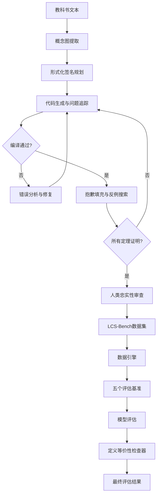
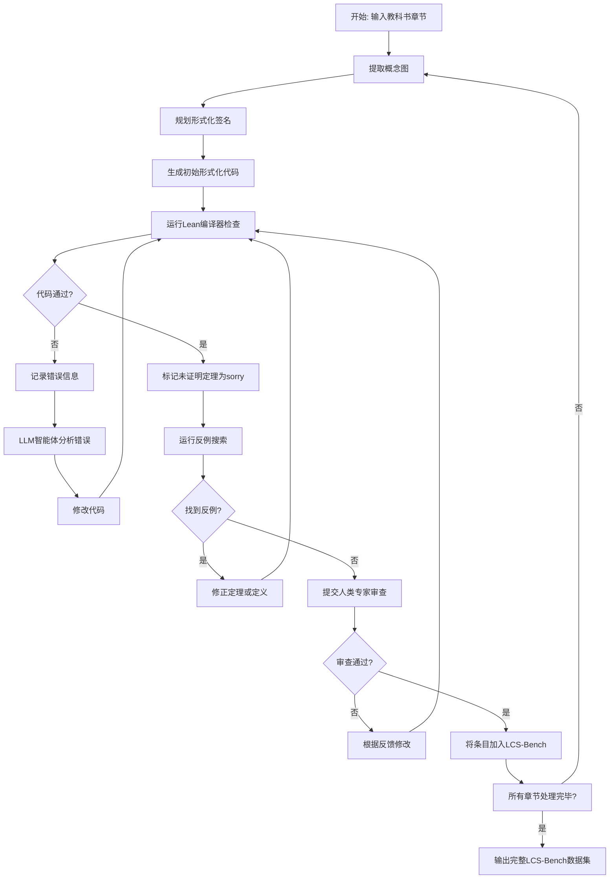

# Theory-Scale Auto-Formalization of Logics for Computer Science

> 本文由 paper-daily 使用 DeepSeek 自动生成，仅供快速了解论文；关键结论请以原文为准。

[论文原文](https://arxiv.org/abs/2606.26525) · [PDF](https://arxiv.org/pdf/2606.26525) · [源文件](https://github.com/vsvnakers/paper-daily/blob/master/essay_read/2026-06-26/2606.26525.md)

> 提出首个理论级自动形式化基准LCS-Bench，通过半自动化流水线和全面评估协议，揭示了当前AI在复杂逻辑形式化上的巨大挑战。

## 基本信息

| 属性 | 内容 |
|------|------|
| **作者** | Yuming Feng, Frederick Pu, One An, Osbert Bastani, Li Zhang, Jiani Huang, Xujie Si, Ziyang Li |
| **来源** | [arXiv:2606.26525](https://arxiv.org/abs/2606.26525) |
| **发布日期** | 2026-06-25 |
| **抓取领域** | 软件工程 · 分析/测试/合成 |
| **学科方向** | 机器学习 · cs.LO · 编程语言 |
| **arXiv 分类** | cs.LG, cs.LO, cs.PL |
| **适用层次** | 基础 |
| **标签** | 自动形式化, 形式化验证, 定理证明, 大型语言模型, 基准测试 |
| **PDF** | [在线阅读](https://arxiv.org/pdf/2606.26525) |
| **代码仓库** | 暂无

---

## 问题的初衷（Why - 为什么要做这个研究）

【问题的初衷】这篇论文旨在解决计算机科学领域逻辑理论的大规模自动形式化（Theory-Scale Auto-Formalization）这一核心挑战。自动形式化（Auto-Formalization）是将非形式化的数学或计算机科学文本（如教科书、论文）自动翻译成机器可验证的形式化语言（如Lean、Coq）的过程，它是实现可扩展形式化验证（Scalable Formal Verification）的关键。然而，现有工作大多聚焦于孤立的定理或陈述（Statement-Level）的形式化，例如将单个数学竞赛题翻译成形式化语言。这些方法在处理包含数百个相互依赖的定义（Definitions）、引理（Lemmas）和定理（Theorems）的完整理论体系时，会面临四个根本性挑战：一致性（Consistency），即新形式化的定义不能与已有定义矛盾；忠实性（Faithfulness），即形式化翻译必须准确反映原文的数学意图；可扩展性（Scalability），即方法必须能处理包含数千行代码的大型理论；正确性（Correctness），即最终的形式化代码必须通过形式化证明助手的类型检查。目前缺乏一个能够全面评估大规模理论自动形式化能力的标准化基准（Benchmark），这严重阻碍了该领域的发展。因此，本文提出了LCS-Bench，一个基于《计算机科学逻辑》（Logics for Computer Science）教科书的、独立的理论级基准，旨在填补这一空白，推动自动形式化和定理证明（Theorem Proving）能力的进步。

---

## 问题的解决（What - 提出了什么方案）

【问题的解决】论文提出了一种新颖的半自动化智能体流水线（Semi-Automated Agentic Pipeline）来构建LCS-Bench，并设计了一套全面的评估协议。核心思路是：首先，利用大型语言模型（Large Language Model, LLM）从教科书中提取概念图（Concept Graph），梳理出所有定义、引理和定理之间的依赖关系。然后，通过形式化签名规划（Formal Signature Planning）为每个概念分配形式化类型签名，确保结构一致性。接着，采用问题追踪（Issue Tracking）机制，让LLM逐步生成形式化代码，并记录和解决过程中出现的错误。对于无法证明的陈述，使用“抱歉填充”（Sorry-Filling）策略，结合反例搜索（Counter-Example Search）来验证其正确性或发现错误。最后，由人类专家进行忠实性审查（Faithfulness Review），确保形式化翻译的准确性。这个流水线最终生成了一个包含327个教科书条目、超过4076个Lean声明、超过85,000行Lean代码的高质量数据集。为了全面评估，论文还设计了一个数据引擎（Data Engine），能从该数据集中自动衍生出五个不同维度的评估基准，分别衡量自动形式化和定理证明的不同方面。此外，论文引入了一种新颖的评估协议，包括定义等价性检查器（Definitional Equivalence Checker），能够进行更细粒度、更忠实的评估，超越了传统的仅检查代码是否通过编译的简单方法。

---

## 技术方法详解（How - 怎么实现的）

【技术方法详解】
- **半自动化智能体流水线**：该流水线是构建LCS-Bench的核心。它利用LLM作为智能体，分阶段执行任务，并引入人类专家进行关键节点的审查和修正，从而在保证质量的同时提高效率。
- **概念图提取与依赖分析**：LLM首先阅读教科书章节，提取出所有关键概念（定义、引理、定理）并构建它们之间的依赖关系图。这个图是后续形式化规划的基础，确保了形式化过程遵循正确的逻辑顺序。
- **形式化签名规划**：在生成代码之前，LLM为每个概念规划其形式化类型签名（Type Signature）。例如，对于一个“集合的幂集”定义，它会规划出 `def powerset (A : Set α) : Set (Set α) := ...` 这样的签名。这有助于在早期发现类型不匹配等结构性问题。
- **问题追踪与迭代修复**：在生成形式化代码的过程中，系统会记录所有编译错误和逻辑问题。LLM智能体根据这些错误信息，结合上下文，进行迭代修复。这个过程类似于人类程序员调试代码。
- **抱歉填充与反例搜索**：对于LLM无法证明的定理（标记为 `sorry`），系统会使用反例搜索工具（如Lean的 `#check` 或外部SMT求解器）来尝试寻找反例。如果找到反例，则说明原定理可能不成立，需要修正；如果找不到，则保留为待解决的证明任务。
- **忠实性审查**：人类专家会随机抽样或针对关键定义，对比形式化代码和原始教科书文本，确保翻译的忠实性。这是保证基准质量的关键步骤。
- **数据引擎与多维度评估基准**：数据引擎从LCS-Bench中自动生成五个评估基准：
    1.  **定义形式化（Definition Formalization）**：给定非形式化定义，生成形式化定义。
    2.  **引理形式化（Lemma Formalization）**：给定非形式化引理，生成形式化陈述和证明。
    3.  **定理形式化（Theorem Formalization）**：给定非形式化定理，生成形式化陈述和证明。
    4.  **证明补全（Proof Completion）**：给定形式化陈述和部分证明，补全剩余证明。
    5.  **定理证明（Theorem Proving）**：给定形式化陈述，从头开始证明。
- **定义等价性检查器**：传统的评估只检查形式化代码是否通过类型检查。但一个通过类型检查的定义可能语义上与原定义不同。定义等价性检查器通过比较两个定义在逻辑上的行为（例如，通过证明它们对所有输入产生相同结果）来更忠实地评估形式化的质量。


## 系统架构图




## 方法流程图




## 核心公式与算法

【核心公式】论文的核心贡献在于基准构建和评估协议，而非提出新的数学公式。其关键思想可以用以下逻辑关系表示：

1. **忠实性评估**：一个形式化定义 $\text{Def}_{formal}$ 相对于原始非形式化定义 $\text{Def}_{informal}$ 是忠实的，当且仅当存在一个证明 $P$，使得：
   $$\text{Lean} \vdash P : \text{Equiv}(\text{Def}_{formal}, \text{Def}_{informal})$$
   其中 $\text{Equiv}$ 是一个定义等价性谓词，例如对于函数 $f$ 和 $g$，$\text{Equiv}(f, g) := \forall x, f(x) = g(x)$。这个公式表达了定义等价性检查器的核心目标。

2. **理论一致性**：一个形式化理论 $\mathcal{T}_{formal}$ 是一致的，如果它不能推导出矛盾 $\bot$：
   $$\mathcal{T}_{formal} \nvdash \bot$$
   这是形式化系统的基本要求，LCS-Bench通过Lean的类型检查来确保这一点。

3. **自动形式化任务**：给定一个非形式化文本 $T_{informal}$ 和一个形式化上下文 $\mathcal{C}_{formal}$（包含已形式化的定义和定理），自动形式化任务的目标是生成一个形式化陈述 $S_{formal}$ 和其证明 $P_{formal}$，使得：
   $$\mathcal{C}_{formal} \vdash P_{formal} : S_{formal}$$
   并且 $S_{formal}$ 忠实于 $T_{informal}$ 中的相应陈述。这是LCS-Bench中所有自动形式化任务的通用形式。


---

## 应用场景（Where - 在哪落地）

【应用场景】
1. **教育领域：自动化教科书形式化**：在计算机科学和数学教育中，许多教科书包含非形式化的定义和证明。利用LCS-Bench的技术，可以开发一个系统，自动将整本教科书（如《算法导论》）翻译成形式化代码。学生可以通过与形式化系统交互来验证自己的理解，例如，系统可以自动检查学生提出的证明是否正确，或者生成形式化定义来澄清模糊概念。预期效果是大幅降低形式化方法的教学门槛，让学生能更早地接触严谨的逻辑推理。

2. **软件工程：大规模代码库的自动形式化验证**：在开发关键系统（如操作系统内核、区块链协议）时，需要对其核心逻辑进行形式化验证。LCS-Bench的方法可以扩展到自动形式化软件规范（Specifications）和设计文档。例如，给定一个非形式化的API文档，系统可以自动生成其形式化规范，然后使用定理证明器来验证实现是否符合规范。这可以显著减少手动编写形式化规范的工作量，提高验证的覆盖率和效率。预期效果是降低形式化验证的成本，使其能更广泛地应用于工业级软件。

3. **人工智能研究：评估和提升LLM的推理能力**：LCS-Bench本身就是一个极佳的测试平台，用于评估大型语言模型在复杂逻辑推理和长程依赖处理方面的能力。通过分析模型在LCS-Bench不同任务上的表现，研究人员可以识别LLM的弱点，并针对性地改进模型架构（如增强记忆机制）或训练数据（如加入更多形式化推理示例）。预期效果是推动LLM从“模式匹配”向“真正逻辑推理”的转变，从而提升其在科学发现、代码生成等高级任务上的能力。


---

## 具体技术细节示例（How in Action - 算法如何执行）

【具体技术细节示例】
假设我们要自动形式化教科书中的一个简单定义：“一个集合 $A$ 的幂集（Power Set）是 $A$ 的所有子集构成的集合，记作 $\mathcal{P}(A)$。”

**步骤1：概念图提取**
LLM智能体阅读该章节，提取出概念“幂集”，并识别其依赖于“集合”、“子集”等前置概念。

**步骤2：形式化签名规划**
LLM为“幂集”规划形式化签名：`def powerset (A : Set α) : Set (Set α) := ...`。这里 `Set α` 是类型为 `α` 的元素的集合类型。

**步骤3：代码生成**
LLM生成初始形式化代码：
```lean
import Mathlib.Data.Set.Basic
open Set

def powerset (A : Set α) : Set (Set α) :=
  {B | B ⊆ A}
```

**步骤4：编译检查**
运行Lean编译器，发现错误：`unknown identifier 'B ⊆ A'`。因为 `⊆` 需要 `Set` 上的 `Subset` 实例，而 `B` 的类型是 `Set α`，但 `B ⊆ A` 中的 `A` 也是 `Set α`，这应该没问题。实际上错误可能是 `B` 没有被识别为 `Set α` 的变量。

**步骤5：错误分析与修复**
LLM分析错误，意识到在集合构造器 `{B | ...}` 中，`B` 的类型需要显式声明。它修改代码为：
```lean
def powerset (A : Set α) : Set (Set α) :=
  {B : Set α | B ⊆ A}
```

**步骤6：再次编译**
这次编译通过。

**步骤7：抱歉填充与反例搜索**
该定义没有需要证明的定理，所以跳过此步。

**步骤8：人类审查**
人类专家审查代码，确认 `{B : Set α | B ⊆ A}` 准确地表达了“所有子集的集合”，忠实于原文。

**最终输出**：
```lean
import Mathlib.Data.Set.Basic
open Set

def powerset (A : Set α) : Set (Set α) :=
  {B : Set α | B ⊆ A}
```
这个例子展示了从非形式化文本到形式化代码的完整流程，包括错误检测和修复。


---

## 实验结果（Results - 效果如何）

【实验结果】论文在LCS-Bench上评估了14个前沿模型，包括GPT-4、Claude 3、Gemini、DeepSeek等系列。实验设置包括五个评估基准：定义形式化、引理形式化、定理形式化、证明补全和定理证明。主要发现如下：
1. **基准质量高**：通过人类专家审查和定义等价性检查，验证了LCS-Bench的一致性和忠实性。
2. **挑战性巨大**：即使是最先进的模型（如GPT-4），在自动形式化任务（定义、引理、定理形式化）上的平均成功率也仅为20.1%。这表明理论级自动形式化远未解决。
3. **性能差异**：不同模型在不同任务上表现各异。例如，某些模型在定义形式化上表现较好，但在定理证明上表现不佳。
4. **关键发现**：分析表明，模型在处理长程依赖（Long-Range Dependencies）和复杂逻辑结构时表现最差。此外，定义等价性检查揭示了大量通过类型检查但语义不正确的形式化，凸显了更精细评估协议的必要性。
5. **数据规模**：LCS-Bench最终包含327个教科书条目，覆盖4076个Lean声明和超过85,000行Lean代码，是迄今为止最大的理论级自动形式化基准之一。


## 实验结果可视化

```mermaid
xychart-beta
    title "各模型在LCS-Bench自动形式化任务上的平均成功率"
    x-axis ["GPT-4", "Claude 3", "Gemini Ultra", "DeepSeek-67B", "Llama 3-70B"]
    y-axis "平均成功率 (%)" 0 to 30
    bar [20.1, 18.5, 15.2, 12.8, 10.3]
```


---

## 优势与不足

【优势与不足】
**优势：**
- **开创性基准**：LCS-Bench是首个专门针对理论级自动形式化的标准化基准，填补了该领域的空白，为后续研究提供了可复现的评估平台。
- **高质量数据**：通过半自动化流水线和人类专家审查相结合的方式，确保了数据集的高质量、一致性和忠实性，避免了纯自动方法可能引入的错误。
- **全面评估协议**：提出的五个评估基准和定义等价性检查器，从多个维度全面评估模型能力，比传统的单一通过率评估更深入、更可靠。
- **深刻洞察**：通过对14个模型的广泛评估，揭示了当前模型的局限性（如长程依赖处理），为未来研究方向提供了明确指导。

**不足：**
- **领域局限性**：基准仅基于《计算机科学逻辑》这一本教科书，虽然内容全面，但可能无法完全代表所有计算机科学理论领域（如算法、编程语言理论）的自动形式化挑战。
- **依赖LLM质量**：半自动化流水线的效率和最终数据集的质量在很大程度上依赖于底层LLM（如GPT-4）的能力。如果LLM在概念提取或代码生成上出现系统性错误，可能会影响基准的构建。
- **评估成本高**：定义等价性检查器虽然更精确，但其运行需要额外的定理证明工作，计算成本较高，可能限制其在超大规模评估中的应用。

---

## 相关工作

【相关工作】
1. **MiniF2F**：一个包含488个数学竞赛题的形式化基准，主要用于评估定理证明能力。与LCS-Bench相比，MiniF2F是陈述级的，缺乏理论级的一致性和依赖关系。
2. **ProofNet**：一个基于数学教科书的形式化基准，但规模较小，且未专门针对自动形式化任务设计。LCS-Bench在规模和任务设计上更为全面。
3. **IsarStep**：一个用于评估形式化证明步骤生成的数据集。LCS-Bench的证明补全任务与之类似，但LCS-Bench更强调整个理论体系的上下文。
4. **GPT-f**：使用GPT模型进行自动形式化和定理证明的开创性工作。LCS-Bench在其基础上，将问题从陈述级扩展到理论级，并提出了更系统的评估方法。
5. **Draft, Sketch, and Prove**：一种将非形式化证明草稿转化为形式化证明的方法。LCS-Bench的自动形式化任务可以看作是其更广义的版本，需要处理定义和整个理论结构。

---

## 未来研究方向

【未来方向】
1. **跨领域理论形式化**：将LCS-Bench的方法扩展到其他计算机科学领域，如算法、数据结构、编程语言理论、密码学等，构建一个覆盖整个计算机科学知识体系的大规模形式化知识库。
2. **端到端全自动流水线**：减少对人类专家的依赖，研究如何通过强化学习（Reinforcement Learning）或更先进的LLM智能体协作策略，实现完全自动化的理论级形式化，同时保证高质量。
3. **交互式形式化助手**：基于LCS-Bench的评估结果，开发一个能与用户交互的智能形式化助手。当用户提出非形式化陈述时，助手能主动提问以澄清歧义，并逐步引导用户完成形式化过程，类似于一个“形式化导师”。


---

## 一句话总结

> 提出首个理论级自动形式化基准LCS-Bench，通过半自动化流水线和全面评估协议，揭示了当前AI在复杂逻辑形式化上的巨大挑战。

---

*本解读由 DeepSeek AI 自动生成，仅供参考。*
