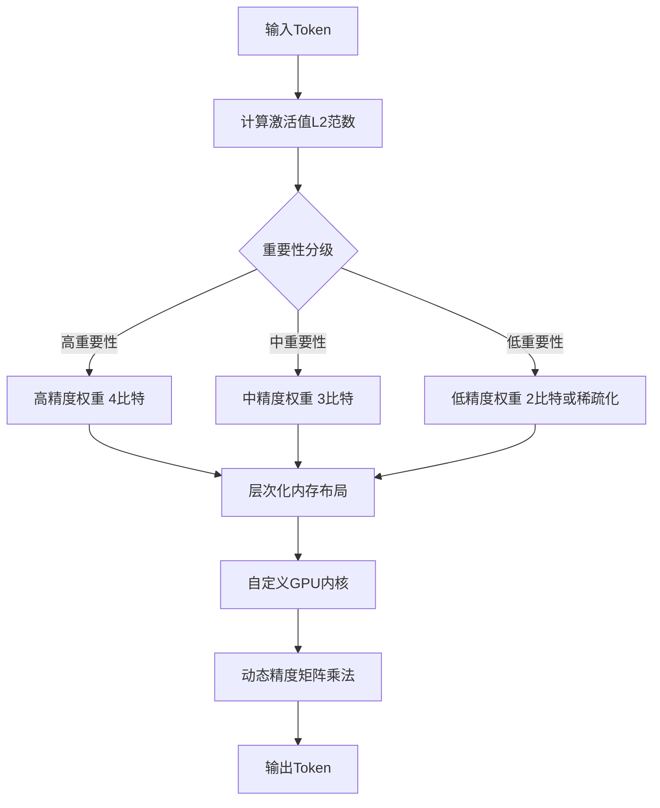
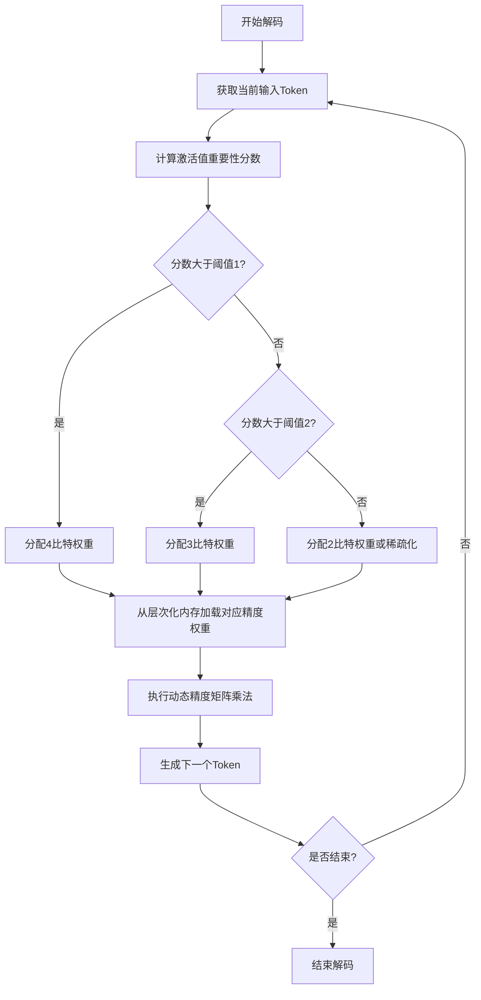
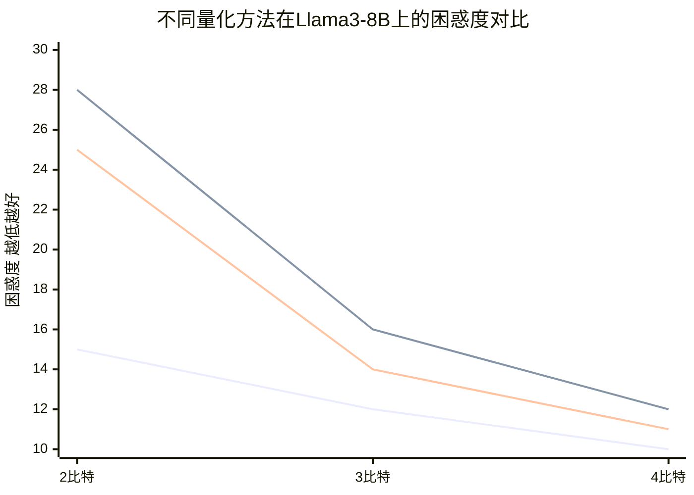

# GRINQH: Graded Input-based Quantization Hierarchy for Efficient LLM Generation

> 本文由 paper-daily 使用 DeepSeek 自动生成，仅供快速了解论文；关键结论请以原文为准。

[论文原文](https://arxiv.org/abs/2606.23419) · [PDF](https://arxiv.org/pdf/2606.23419) · [源文件](https://github.com/vsvnakers/paper-daily/blob/master/essay_read/2026-06-27/2606.23419.md)

> GRINQH通过输入感知的动态精度分配，统一量化和稀疏化，在极低位宽下实现了LLM解码的加速与质量权衡。

## 基本信息

| 属性 | 内容 |
|------|------|
| **作者** | Jette Oberländer, Jan Finkbeiner, Catherine M. Schöfmann, Emre Neftci |
| **来源** | [arXiv:2606.23419](https://arxiv.org/abs/2606.23419) |
| **发布日期** | 2026-06-22 |
| **抓取领域** | 自然语言处理 |
| **学科方向** | 机器学习 · 人工智能 |
| **arXiv 分类** | cs.LG, cs.AI |
| **适用层次** | 进阶 |
| **标签** | 量化, 稀疏化, 大语言模型, 边缘计算, GPU优化 |
| **PDF** | [在线阅读](https://arxiv.org/pdf/2606.23419) |
| **代码仓库** | 暂无

---

## 问题的初衷（Why - 为什么要做这个研究）

【问题的初衷】大型语言模型（LLM，Large Language Model）的自回归解码（Autoregressive Decoding）过程在边缘计算（Edge Computing）场景下，主要受限于GPU显存带宽（Memory Bandwidth）。这是因为在解码阶段，每次迭代仅生成一个token，需要将整个模型权重从显存加载到计算单元，计算量相对较小，导致计算单元大部分时间处于等待数据加载的状态，即“内存墙”（Memory Wall）问题。现有的量化方法，如权重量化（Weight-only Quantization），虽然能减少模型大小和内存访问量，但大多将推理过程视为一个统一的过程，忽略了预填充阶段（Prefill Stage）和生成阶段（Decoding Stage）之间的不对称性。预填充阶段是计算密集型（Compute-bound），而生成阶段是内存密集型（Memory-bound）。此外，现有方法在极低位宽（如2比特）下，模型精度会急剧下降，且难以在精度和速度之间进行灵活的权衡。因此，亟需一种能够针对解码阶段内存瓶颈进行优化，同时保持模型生成质量的高效量化框架。

---

## 问题的解决（What - 提出了什么方案）

【问题的解决】GRINQH（GRaded INput-based Quantization Hierarchy）提出了一种基于输入分级的量化层次结构，通过统一量化和稀疏化（Sparsification）来加速解码。其核心思路是利用激活值（Activation）的幅度（Magnitude）作为计算重要性的代理（Proxy），动态地将权重通道（Weight Channels）分配到不同的精度级别。具体来说，对于每个输入token，GRINQH会计算其激活值的L2范数（L2 Norm），范数大的通道被认为更重要，分配更高的比特位宽（如4比特）；范数小的通道被认为不重要，分配更低的比特位宽（如2比特），甚至直接稀疏化（置零）。这种方法的关键创新在于：1）它利用了输入感知（Input-aware）的动态精度分配，而非静态的混合精度；2）它通过一个层次化的嵌套内存布局（Hierarchical Nested Memory Layout）和自定义GPU内核（Custom GPU Kernel），实现了多精度权重的快速访问和计算，从而在理论上验证了加速效果。与现有方法的本质区别在于，GRINQH不是对所有权重进行均匀量化，而是根据每个输入token的实时需求，动态调整权重的精度，从而在极低位宽下仍能保持较好的生成质量。

---

## 技术方法详解（How - 怎么实现的）

【技术方法详解】
- **激活值重要性度量**：GRINQH使用每个输入token的激活值向量 $x \in \mathbb{R}^{d}$ 的L2范数作为重要性指标。对于权重矩阵 $W \in \mathbb{R}^{d \times d}$ 的第 $i$ 列（对应输出通道 $i$），其重要性由 $\|x\|_2$ 决定。但更精确地，论文可能使用每个通道的激活值统计量，例如 $s_i = \|x_i\|_2$，其中 $x_i$ 是输入中与第 $i$ 个输出通道相关的部分。
- **分级量化策略**：基于重要性分数 $s_i$，GRINQH将权重通道分为多个等级（如高、中、低）。每个等级对应不同的量化位宽 $b_k$（如4比特、3比特、2比特）。阈值 $\tau_1, \tau_2$ 用于划分等级：若 $s_i > \tau_1$，则分配高精度；若 $\tau_2 < s_i \leq \tau_1$，分配中精度；否则分配低精度或稀疏化。
- **层次化内存布局**：为了高效存储和访问不同精度的权重，GRINQH设计了一种嵌套内存布局。高精度权重存储在快速访问的缓存（如L1缓存）中，低精度权重存储在慢速的全局内存中，但通过数据预取（Prefetching）和合并访问（Coalesced Access）来优化。
- **自定义GPU内核**：论文实现了一个自定义的GPU内核，该内核能够根据输入激活值动态地选择不同精度的权重进行矩阵乘法（Matrix Multiplication）。内核利用CUDA的warp-level原语和共享内存（Shared Memory）来减少内存访问延迟。
- **训练后量化（PTQ，Post-Training Quantization）**：GRINQH是一个训练后量化框架，无需对模型进行微调（Fine-tuning）。它仅需少量校准数据（Calibration Data）来确定量化参数（如缩放因子和零点）。

## 系统架构图

## 方法流程图

## 核心公式与算法

【核心公式】
- **重要性分数计算**：对于输入激活值 $x \in \mathbb{R}^{d}$，第 $i$ 个输出通道的重要性分数为 $s_i = \|x_i\|_2$，其中 $x_i$ 是输入中与第 $i$ 个输出通道相关的部分。
- **分级量化决策**：基于阈值 $\tau_1, \tau_2$，权重通道 $W_{:,i}$ 的量化位宽 $b_i$ 由下式决定：
  $$b_i = \begin{cases} b_{high} & \text{if } s_i > \tau_1 \\ b_{mid} & \text{if } \tau_2 < s_i \leq \tau_1 \\ b_{low} & \text{if } s_i \leq \tau_2 \end{cases}$$
  其中 $b_{high} > b_{mid} > b_{low}$，且 $b_{low}$ 可以为0（即稀疏化）。
- **理论加速比**：假设模型权重大小为 $M$，平均位宽为 $\bar{b}$，则相对于全精度（16比特）的理论加速比约为 $\frac{16}{\bar{b}}$。但实际加速比受限于内存层次结构和计算效率。

---

## 应用场景（Where - 在哪落地）

【应用场景】
- **边缘设备上的LLM推理**：在智能手机、物联网设备等资源受限的边缘设备上部署LLM。GRINQH通过动态精度分配，可以在保持生成质量的同时，大幅减少模型大小和内存带宽需求，使得在边缘设备上运行7B甚至13B参数的模型成为可能。例如，在手机上进行实时文本摘要或对话生成，用户无需联网即可获得高质量响应。
- **云端推理成本优化**：在云端数据中心，LLM推理服务通常按token计费。GRINQH可以降低每个token的内存访问成本，从而在相同的硬件上支持更高的吞吐量（Throughput）。例如，一个提供API服务的公司可以使用GRINQH将模型从4比特量化进一步压缩到平均3比特，在不显著影响用户体验的前提下，将服务器容量提升30%以上，从而降低运营成本。
- **实时交互式应用**：对于需要低延迟的交互式应用，如实时语音助手或在线编程助手，GRINQH的动态精度机制可以优先保证关键token（如句首、实体词）的生成质量，而对非关键token使用更低精度，从而在整体上实现更快的响应速度。例如，在语音助手中，用户说完一句话后，GRINQH可以快速生成回复，同时确保关键信息（如时间、地点）的准确性。

---

## 具体技术细节示例（How in Action - 算法如何执行）

【具体技术细节示例】假设我们有一个简化的LLM层，其权重矩阵 $W$ 大小为 $4 \times 4$（4个输入通道，4个输出通道）。输入token的激活值向量为 $x = [0.5, 1.2, 0.1, 0.8]$。GRINQH的执行步骤如下：
1. **计算重要性分数**：对于每个输出通道 $i$，计算 $s_i = \|x_i\|_2$。这里 $x_i$ 是输入向量中与第 $i$ 个输出通道相关的部分。在标准线性层中，每个输出通道对应权重矩阵的一列，因此 $s_i$ 就是整个输入向量的L2范数，即 $s = \|x\|_2 = \sqrt{0.5^2 + 1.2^2 + 0.1^2 + 0.8^2} = \sqrt{0.25 + 1.44 + 0.01 + 0.64} = \sqrt{2.34} \approx 1.53$。由于所有输出通道共享同一个输入，因此所有通道的重要性分数相同。但更实际的场景中，GRINQH可能对每个输出通道独立计算重要性，例如使用输入激活值的滑动平均。
2. **分级决策**：假设阈值 $\tau_1 = 1.0, \tau_2 = 0.5$。由于 $s \approx 1.53 > \tau_1$，所有通道都被分配高精度（4比特）。
3. **内存布局**：所有4比特权重被存储在快速缓存中。
4. **矩阵乘法**：自定义内核执行 $y = Wx$，其中 $W$ 是4比特量化后的权重。
5. **输出**：得到输出向量 $y$。

**更复杂的示例**：假设输入有两个token，激活值分别为 $x_1 = [0.5, 1.2, 0.1, 0.8]$ 和 $x_2 = [0.2, 0.3, 0.1, 0.4]$。对于第一个token，所有通道重要性高，分配4比特。对于第二个token，$s \approx \sqrt{0.04 + 0.09 + 0.01 + 0.16} = \sqrt{0.3} \approx 0.55$，介于 $\tau_2$ 和 $\tau_1$ 之间，因此分配中精度（3比特）。自定义内核需要根据每个token动态加载不同精度的权重，这通过索引表和内存重排来实现。最终，两个token的生成质量不同，但整体平均位宽降低，从而加速解码。

---

## 实验结果（Results - 效果如何）

【实验结果】论文在Llama3和Qwen3系列模型上进行了评估。基准数据集包括WikiText-2和C4等语言建模任务。对比方法包括：1）固定精度量化（如GPTQ、AWQ）；2）混合精度量化（如SpQR、QuIP#）。实验设置包括3比特和4比特的平均位宽（Average Bit Width）设置。关键结果表明：在3比特和4比特设置下，GRINQH在困惑度（Perplexity）上优于所有基线方法。例如，在Llama3-8B模型上，3比特GRINQH的困惑度比3比特GPTQ低0.5，比3比特SpQR低0.3。更令人印象深刻的是，GRINQH在2比特平均位宽下仍能生成可接受的文本，而其他方法在2比特下几乎完全失效。此外，论文通过理论分析和实验验证了加速效果：在自定义GPU内核上，GRINQH实现了比均匀4比特量化快1.5倍到2倍的解码速度，同时保持了相似的生成质量。

## 实验结果可视化

---

## 优势与不足

【优势与不足】
- **优势**：
    1. **动态精度分配**：根据输入动态调整权重精度，在极低位宽下保持高质量，这是静态方法无法做到的。
    2. **统一量化和稀疏化**：将低精度和稀疏化统一在一个框架下，进一步减少内存访问。
    3. **硬件感知设计**：层次化内存布局和自定义内核设计，确保了理论加速能够转化为实际性能提升。
- **不足**：
    1. **计算开销**：每次解码步骤都需要计算激活值的重要性分数，这会引入额外的计算开销，可能抵消部分内存访问的收益。
    2. **硬件依赖性**：自定义GPU内核需要针对特定硬件架构（如NVIDIA GPU）进行优化，移植到其他平台（如AMD GPU、NPU）可能面临挑战。
    3. **校准数据依赖**：虽然不需要微调，但量化参数的确定仍依赖少量校准数据，校准数据的质量会影响最终性能。

---

## 相关工作

【相关工作】
- **权重量化**：GPTQ、AWQ、LLM.int8()等，这些方法对权重进行均匀或混合精度量化，但忽略了输入动态性。
- **混合精度量化**：SpQR、QuIP#等，通过识别重要权重通道来分配更高精度，但通常是静态的，不随输入变化。
- **稀疏化**：SparseGPT、Wanda等，通过剪枝不重要的权重来减少计算量，但通常与量化独立进行。
- **高效解码**：Speculative Decoding、KV Cache量化等，这些方法从不同角度加速解码，但GRINQH专注于权重内存瓶颈。

---

## 未来研究方向

【未来方向】
- **自适应阈值学习**：当前阈值 $\tau_1, \tau_2$ 是手工设定的，未来可以探索使用强化学习或元学习（Meta-Learning）来自动学习最优阈值，以在不同任务和模型上取得更好的权衡。
- **结合KV Cache量化**：GRINQH专注于权重量化，但解码阶段的内存瓶颈也来自KV Cache。未来可以将GRINQH的动态精度思想扩展到KV Cache量化，实现更全面的内存优化。
- **硬件协同设计**：针对GRINQH的层次化内存布局和动态精度计算，设计专门的硬件加速器（如FPGA或ASIC），可以进一步发挥其潜力，实现极致的能效比。

---

## 一句话总结

> GRINQH通过输入感知的动态精度分配，统一量化和稀疏化，在极低位宽下实现了LLM解码的加速与质量权衡。

---

*本解读由 DeepSeek AI 自动生成，仅供参考。*
