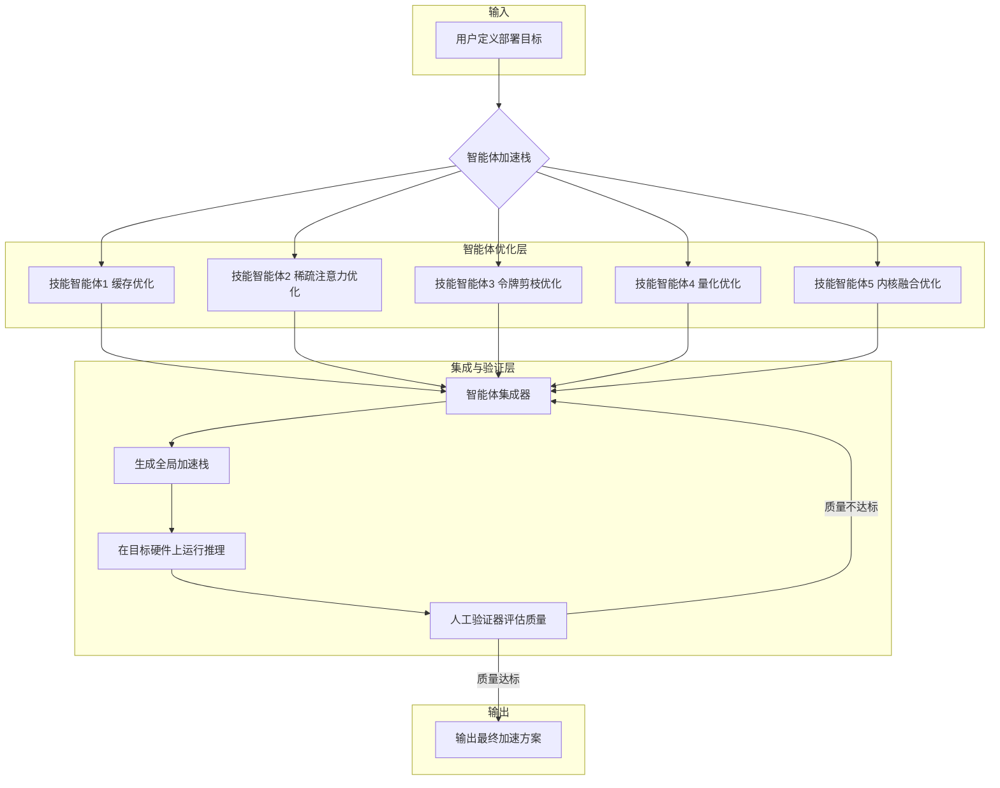
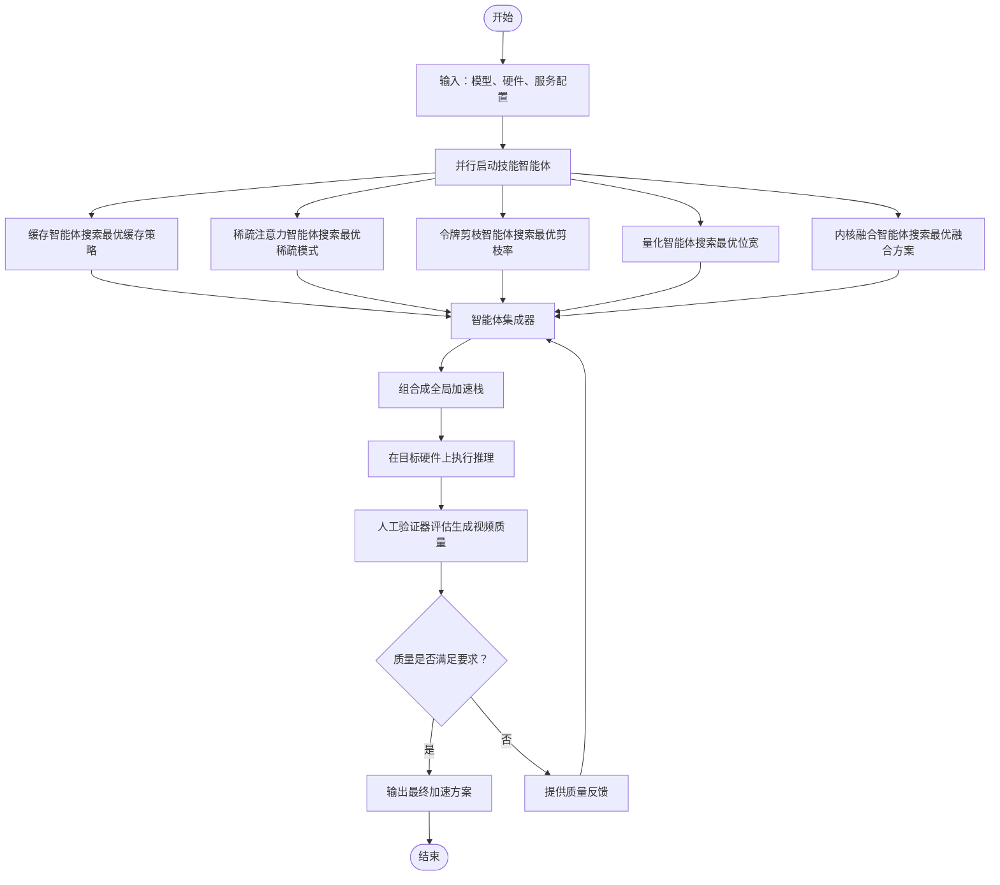
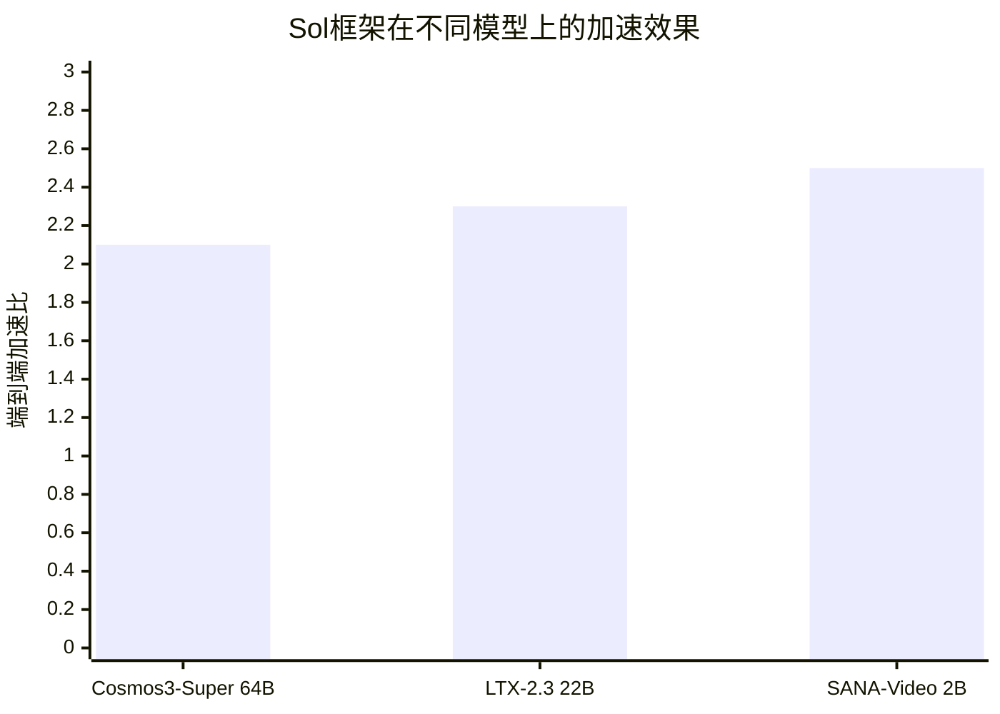

# Sol Video Inference Engine: Agent-Native Full-Stack Acceleration Framework for Efficient Video Generation

> 本文由 paper-daily 使用 DeepSeek 自动生成，仅供快速了解论文；关键结论请以原文为准。

[论文原文](https://arxiv.org/abs/2606.23743) · [PDF](https://arxiv.org/pdf/2606.23743) · [源文件](https://github.com/vsvnakers/paper-daily/blob/master/essay_read/2026-06-27/2606.23743.md)

> Sol通过智能体框架自动组合和调优多种加速技术，为不同视频扩散模型和硬件实现实例特定的高效推理加速。

## 基本信息

| 属性 | 内容 |
|------|------|
| **作者** | Yitong Li, Junsong Chen, Haopeng Li, Haozhe Liu, Jincheng Yu, Ligeng Zhu, Ping Luo, Song Han, Enze Xie |
| **来源** | [arXiv:2606.23743](https://arxiv.org/abs/2606.23743) |
| **发布日期** | 2026-06-21 |
| **抓取领域** | CV · 图像/视频生成 |
| **学科方向** | 计算机视觉 · 人工智能 · 机器学习 |
| **arXiv 分类** | cs.CV, cs.AI, cs.LG |
| **适用层次** | 进阶 |
| **标签** | 视频扩散模型, 推理加速, 智能体框架, 实例特定优化, 无需训练 |
| **PDF** | [在线阅读](https://arxiv.org/pdf/2606.23743) |
| **代码仓库** | [sol-infer](https://github.com/lyttttt3333/sol-infer) (已拉取)

---

## 问题的初衷（Why - 为什么要做这个研究）

【问题的初衷】近年来，视频扩散模型（Video Diffusion Models）通过扩大模型规模（Scaling）显著提升了生成质量，但这也带来了高昂的推理成本（Inference Cost）。例如，一个64B参数的模型生成一段视频可能需要数分钟甚至更长时间，这严重阻碍了其在实时交互、大规模内容生成等实际场景中的部署。为了解决这一问题，学术界和工业界提出了多种加速方法，如缓存（Cache）、稀疏注意力（Sparse Attention）、令牌剪枝（Token Pruning）、量化（Quantization）和内核融合（Kernel Fusion）。然而，一个核心挑战在于：最有效的加速策略高度依赖于具体的实例（Instance-Specific）。具体来说，一个在特定模型、硬件和推理配置组合上表现良好的加速方案，往往无法直接迁移到另一个组合上。不同模型在架构（如UNet、DiT）、数值敏感性（Numerical Sensitivity）和注意力集中模式（Attention Concentration Patterns）上存在差异。推理配置（如空间/时间分辨率、视频时长）和硬件平台（如内存层次结构、支持的数值格式、内核吞吐量）也各不相同。这些因素共同构成了一个巨大的调优空间（Tuning Space），使得手动进行性能工程（Manual Performance Engineering）成本高昂且效率低下。因此，迫切需要一种能够自动、高效地为特定部署目标定制最优加速策略的框架。

---

## 问题的解决（What - 提出了什么方案）

【问题的解决】针对上述挑战，本文提出了Sol Video Inference Engine，一个基于智能体（Agentic）、原生（Native）、无需训练（Training-Free）的视频扩散模型加速框架。其核心思路是：将五种广泛适用的加速技术（缓存、稀疏注意力、令牌剪枝、量化、内核融合）组织成一个智能体驱动的加速栈（Agentic Acceleration Stack），通过并行智能体（Parallel Skill Agents）为每个具体的部署目标（由模型、硬件平台和服务配置定义）进行实例特定的优化。关键创新点在于：1) **智能体化（Agentic）**：引入多个技能智能体，每个智能体负责优化一种加速技术，实现了优化过程的自动化和并行化，无需人工手动调参。2) **原生集成（Native）**：框架设计为与模型推理过程深度集成，而非作为后处理或外部插件，从而能更有效地利用模型内部特性。3) **无需训练（Training-Free）**：所有加速技术均无需对原始模型进行微调或重新训练，大大降低了部署成本。与现有方法的本质区别在于，Sol不是提出一种新的加速技术，而是构建了一个元优化框架（Meta-Optimization Framework），能够智能地组合和调优现有技术，以应对高度异构的部署环境。

---

## 技术方法详解（How - 怎么实现的）

【技术方法详解】
- **智能体加速栈架构**：框架由三个核心组件构成：多个**技能智能体（Skill Agents）**、一个**智能体集成器（Agent Integrator）**和一个**人工验证器（Human Validator）**。每个技能智能体负责一种加速技术（如缓存智能体、稀疏注意力智能体等），它们并行工作，针对给定的模型、硬件和配置，探索该技术的最优实现参数。
- **并行优化与集成**：技能智能体通过黑盒优化（Black-Box Optimization）或基于规则的方法，在各自的搜索空间内寻找最优配置。例如，缓存智能体可能搜索最优的缓存步长（Cache Step）和缓存策略；量化智能体则搜索最优的量化位宽（Bit-width）和校准方法。智能体集成器负责将这些独立优化的技术组合成一个全局加速栈，处理技术间的相互依赖和冲突（例如，量化可能会影响稀疏注意力的效果）。
- **人工验证闭环**：生成加速栈后，人工验证器对生成视频的质量进行主观或客观评估（如VBench分数）。如果质量不达标，验证器提供反馈，智能体集成器据此调整加速栈配置或重新触发技能智能体的优化过程，形成一个闭环优化流程。
- **实例特定优化（Instance-Specific Optimization）**：框架的核心优势在于其适应性。对于不同的模型（如64B Cosmos、22B LTX、2B SANA），不同的硬件（如NVIDIA A100、H100）和不同的服务配置（如不同的分辨率、帧率），技能智能体会自动探索出最适合该组合的加速策略组合。
- **无需训练（Training-Free）**：所有加速技术，如缓存（利用时间冗余）、稀疏注意力（利用注意力图的稀疏性）、令牌剪枝（移除不重要的令牌）、量化（降低数值精度）和内核融合（合并多个计算核），都直接应用于预训练好的模型上，无需任何微调。

## 系统架构图

## 方法流程图

## 核心公式与算法

【核心公式】
论文的核心思想并非提出新的数学公式，而是构建一个优化框架。其核心可以抽象为一个优化问题：

$$\max_{s \in S} \text{Speed}(s) \quad \text{subject to} \quad \text{Quality}(s) \geq \text{Quality}_{target}$$

其中，$s$ 代表一个由五种加速技术参数组成的加速策略（Acceleration Strategy），$S$ 是所有可能策略的集合。$\text{Speed}(s)$ 是策略 $s$ 带来的推理加速比，$\text{Quality}(s)$ 是策略 $s$ 下的生成视频质量（如VBench分数），$\text{Quality}_{target}$ 是目标质量阈值。

智能体的任务就是在策略空间 $S$ 中搜索，找到满足质量约束下加速比最大的策略。这个优化问题可以通过贝叶斯优化（Bayesian Optimization）或强化学习（Reinforcement Learning）等方法求解。

---

## 应用场景（Where - 在哪落地）

【应用场景】
1. **视频内容创作平台**：在面向普通用户的视频生成平台（如Runway、Pika）中，用户期望快速生成高质量视频。Sol框架可以部署在平台的后端服务器集群上。当用户提交一个生成任务时，系统会根据用户选择的模型（如高精度模型或快速模型）、当前服务器负载和硬件类型，自动调用Sol框架。Sol的智能体将快速为这个特定任务（模型+硬件+配置）生成一个最优的加速方案，从而在保证视频质量的前提下，将生成时间从几分钟缩短到几十秒，显著提升用户体验和平台吞吐量。
2. **实时交互式应用**：在虚拟现实（VR）、增强现实（AR）或在线游戏等需要实时生成视频内容的场景中，延迟是核心痛点。例如，一个AI驱动的虚拟角色需要根据用户的语音指令实时生成面部表情和动作视频。Sol框架可以被集成到边缘设备或云端推理服务器上。其无需训练的特性允许它快速适应不同的模型和硬件（如从云端A100到边缘的Jetson Orin）。通过自动应用量化、稀疏注意力和内核融合，Sol可以将模型推理延迟降低到实时可接受的水平（例如，<100ms），使得实时视频生成成为可能。
3. **大规模视频数据集生成**：在训练多模态AI模型时，需要海量的、多样化的视频数据。使用视频扩散模型生成这些数据是一个常见做法，但成本极高。Sol框架可以被用于构建一个高效的视频生成流水线。通过为每个生成任务自动选择最优的加速策略，可以显著降低生成大规模视频数据集所需的总时间和计算资源（GPU小时数）。例如，生成100万段视频，原本需要1000个GPU小时，使用Sol框架后可能只需要400个GPU小时，同时保持数据质量，从而大幅降低数据准备成本。

---

## 具体技术细节示例（How in Action - 算法如何执行）

【具体技术细节示例】
假设我们有一个目标部署任务：在NVIDIA A100 GPU上，使用LTX-2.3模型，生成一个分辨率为512x512、时长为16帧的视频。

**步骤1：并行智能体优化**
- **缓存智能体**：它测试不同的缓存策略。例如，它发现每隔4步缓存一次（Cache Every 4 Steps）并使用特征图缓存（Feature Map Cache）效果最好，相比无缓存，可以减少30%的UNet计算量。
- **稀疏注意力智能体**：它分析LTX-2.3模型的注意力图，发现其注意力模式在早期层非常稀疏（只有10%的注意力权重大于阈值）。因此，它选择了一个Top-k稀疏注意力策略，只计算最重要的10%的注意力头，将注意力计算量减少90%。
- **令牌剪枝智能体**：它发现LTX-2.3模型在时间维度上存在大量冗余令牌。它选择了一个基于时间一致性的剪枝策略，将时间维度上的令牌数量减少50%，从而减少了后续层处理的令牌总数。
- **量化智能体**：它测试了INT8和FP8量化。在A100上，FP8量化有硬件加速支持。它发现将模型权重和激活值都量化为FP8，模型质量几乎无损失，但推理速度提升了1.5倍。
- **内核融合智能体**：它分析模型计算图，发现可以将多个连续的卷积层和激活函数层融合成一个内核，减少内存读写和内核启动开销。它找到了一个融合方案，将内核数量减少了40%。

**步骤2：智能体集成**
智能体集成器接收到各个智能体的最优配置：缓存步长=4、稀疏率=10%、剪枝率=50%、量化位宽=FP8、融合方案=方案A。集成器检查这些配置之间是否存在冲突。例如，它发现FP8量化后，稀疏注意力的阈值需要微调，因为量化后的数值精度降低。集成器自动调整了稀疏注意力的阈值，确保组合后的方案仍然有效。最终，它生成了一个全局加速栈。

**步骤3：执行与验证**
使用这个加速栈在A100上运行LTX-2.3模型生成视频。原始推理需要10秒，现在只需要4.5秒，加速比约为2.2倍。人工验证器检查生成的视频，发现其视觉质量与原始模型生成的视频几乎无异，VBench分数从0.85下降到0.84，仍在可接受范围内。因此，这个加速方案被最终采纳。

---

## 实验结果（Results - 效果如何）

【实验结果】论文在三个不同规模和架构的视频模型上进行了实验：64B参数的Cosmos3-Super、22B参数的LTX-2.3以及2B参数的SANA-Video。实验使用VBench作为主要的视频质量评估指标，并测量端到端推理加速比。对比的基线是未应用任何加速技术的原始模型推理。实验结果表明，Sol框架在仅需少量人工干预的情况下，能够在所有三个模型上实现超过2倍的端到端加速，同时保持近乎无损的VBench质量（Near-Lossless VBench Quality）。例如，在Cosmos3-Super模型上，加速比达到了2.1倍，而VBench分数仅下降了0.3%。这证明了该智能体框架在视频扩散模型加速方面的有效性。

## 实验结果可视化

---

## 优势与不足

【优势与不足】
**优势：**
1. **自动化与高效性**：通过智能体自动化了繁琐的调优过程，大大减少了人工性能工程的工作量，并能快速适应不同的部署环境。
2. **通用性与可迁移性**：框架设计不依赖于特定模型或硬件，通过组合五种通用加速技术，可以应用于多种视频扩散模型和硬件平台。
3. **质量与速度的平衡**：实现了超过2倍的加速，同时保持了生成视频的视觉质量（近乎无损），证明了其在实际部署中的巨大潜力。
4. **无需训练**：所有加速技术都是训练无关的，这意味着可以快速部署到任何预训练模型上，无需昂贵的重新训练成本。

**不足：**
1. **智能体优化开销**：虽然减少了人工调优，但智能体自身的搜索和优化过程（尤其是黑盒优化）仍然需要一定的计算资源和时间，对于需要极低延迟的在线服务可能构成挑战。
2. **依赖人工验证**：框架中的人工验证环节虽然保证了质量，但也引入了人工干预，降低了全自动化的程度。如何设计更可靠的自动质量评估指标来替代人工验证，是一个值得探索的方向。
3. **技术组合的局限性**：框架目前只集成了五种加速技术，可能无法覆盖所有可能的加速手段。对于某些极端情况，可能需要引入新的技术（如模型蒸馏、架构搜索）才能达到更好的效果。

---

## 相关工作

【相关工作】
1. **视频扩散模型加速**：如DeepCache、Stable Video Diffusion等工作中提出的缓存、稀疏注意力等方法。本文不是提出新方法，而是将它们集成到一个智能体框架中。
2. **模型量化（Model Quantization）**：如GPTQ、AWQ等后训练量化方法。本文的量化智能体借鉴了这些技术，并自动搜索最优的量化配置。
3. **稀疏计算（Sparse Computation）**：如StreamingLLM、SparseGPT等。本文的稀疏注意力智能体利用注意力图的稀疏性来减少计算量。
4. **自动化机器学习（AutoML）**：如神经架构搜索（NAS）、超参数优化（HPO）。本文的智能体框架可以看作是一种针对推理加速的AutoML方法。
5. **内核融合（Kernel Fusion）**：如TensorRT、TVM等编译器中的算子融合技术。本文的内核融合智能体自动探索最优的融合策略。

---

## 未来研究方向

【未来方向】
1. **全自动质量评估**：探索使用更先进的自动质量评估模型（如基于视频理解的大模型）来替代人工验证环节，实现完全自动化的闭环优化，进一步提升框架的效率和可扩展性。
2. **动态自适应加速**：当前框架的加速策略在推理过程中是静态的。未来可以研究在推理过程中动态调整加速策略，例如，根据当前帧的生成难度或注意力图的实时稀疏度，动态调整稀疏率或剪枝率，实现更精细的加速。
3. **扩展到更多模态和模型**：将Sol框架的核心思想（智能体驱动的实例特定优化）扩展到其他生成模型，如图像扩散模型（如Stable Diffusion）、文本到语音模型（TTS）或大型语言模型（LLM）的推理加速上，验证其通用性。

## 代码仓库

- [sol-infer](https://github.com/lyttttt3333/sol-infer) (无 star 数据) — `已拉取到本地`

---

## 一句话总结

> Sol通过智能体框架自动组合和调优多种加速技术，为不同视频扩散模型和硬件实现实例特定的高效推理加速。

---

*本解读由 DeepSeek AI 自动生成，仅供参考。*
