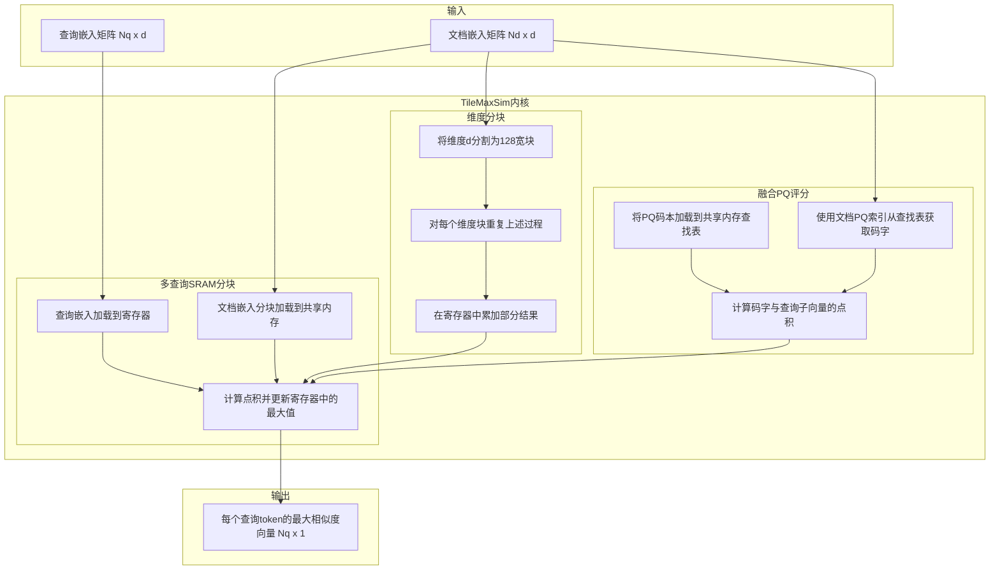
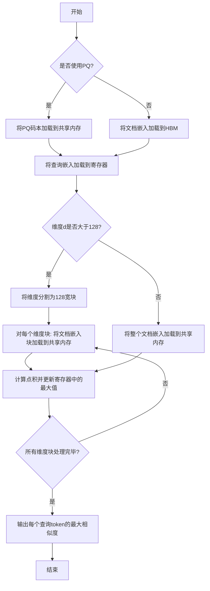
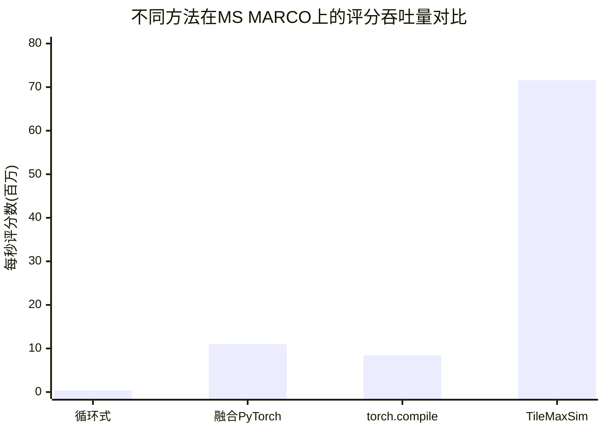

# TileMaxSim: IO-Aware GPU MaxSim Scoring with Dimension Tiling and Fused Product Quantization

> 本文由 paper-daily 使用 DeepSeek 自动生成，仅供快速了解论文；关键结论请以原文为准。

[论文原文](https://arxiv.org/abs/2606.26439) · [PDF](https://arxiv.org/pdf/2606.26439) · [源文件](https://github.com/vsvnakers/paper-daily/blob/master/essay_read/2026-06-27/2606.26439.md)

> TileMaxSim通过IO感知的GPU内核设计，将多向量检索的MaxSim评分速度提升220倍，同时保持精确检索质量。

## 基本信息

| 属性 | 内容 |
|------|------|
| **作者** | Ashutosh Sharma |
| **来源** | [arXiv:2606.26439](https://arxiv.org/abs/2606.26439) |
| **发布日期** | 2026-06-24 |
| **抓取领域** | GPU算子/编译优化 |
| **学科方向** | 信息检索 · 分布式系统 · 性能优化 |
| **arXiv 分类** | cs.IR, cs.DC, cs.PF |
| **适用层次** | 前沿 |
| **标签** | 多向量检索, GPU优化, IO感知, MaxSim评分, Triton内核 |
| **PDF** | [在线阅读](https://arxiv.org/pdf/2606.26439) |
| **代码仓库** | 暂无

---

## 问题的初衷（Why - 为什么要做这个研究）

【问题的初衷】这篇论文旨在解决多向量检索模型（Multi-vector Retrieval Models）在GPU上执行MaxSim评分（MaxSim Scoring）时存在的严重IO瓶颈问题。多向量模型（如ColBERT）通过细粒度的token级交互（token-level interaction）实现了最先进的检索精度，其核心操作是计算查询向量与文档向量之间的最大相似度（MaxSim）。然而，现有的GPU实现（包括PyTorch原生实现、torch.compile优化后的实现）在利用现代GPU硬件性能方面表现极差。论文通过屋顶线分析（Roofline Analysis）揭示了根本原因：朴素实现需要显式物化（materialize）一个大小为 $N_q 	imes N_d$ 的相似度矩阵（其中 $N_q$ 是查询token数，$N_d$ 是文档token数），这个矩阵被一次性使用后即被丢弃。这种操作模式导致对高带宽内存（HBM）的读写带宽利用率极低，仅达到峰值HBM带宽的5-18%。随着检索规模（如候选文档数量）的增大，这个IO瓶颈会急剧恶化，成为整个检索流水线的性能瓶颈。因此，设计一种IO感知的（IO-aware）GPU内核来高效执行MaxSim评分，对于提升多向量检索模型的端到端推理速度和实际部署价值至关重要。

---

## 问题的解决（What - 提出了什么方案）

【问题的解决】论文提出了TileMaxSim，一系列IO感知的Triton内核，通过三种核心协同设计来弥合带宽差距。首先，多查询SRAM分块（Multi-query SRAM Tiling）将文档嵌入（document embeddings）流式传输到共享内存（shared memory）中，同时在寄存器（registers）中累积每个查询token的最大值，确保每个嵌入仅从HBM读取一次，避免了中间相似度矩阵的物化。其次，维度分块（Dimension Tiling）将嵌入维度（embedding dimension）划分为128宽的块（chunk），使得对于维度 $d > 128$ 的嵌入，即使共享内存溢出也能进行评分，从而支持更广泛的模型配置。最后，融合乘积量化评分（Fused Product-Quantization Scoring）通过共享内存查找表（shared-memory lookup tables）直接对量化后的文档嵌入进行评分，将HBM的IO需求削减高达约31倍。这些创新点与现有方法的本质区别在于：现有方法要么是循环式（loop-based）的，要么是融合但非IO感知的（如torch.compile），它们都没有从根本上解决HBM带宽浪费的问题。TileMaxSim通过精心设计的数据流和计算模式，将计算与数据移动紧密耦合，实现了接近硬件极限的带宽利用率。

---

## 技术方法详解（How - 怎么实现的）

【技术方法详解】
- **多查询SRAM分块（Multi-query SRAM Tiling）**：核心思想是将多个查询的评分过程合并到一个内核调用中。对于每个查询token，其嵌入向量被加载到寄存器中。然后，所有文档的嵌入向量被分块（tile）地流式传输到共享内存中。在共享内存中，每个文档token的嵌入与所有查询token的嵌入进行点积计算，结果直接用于更新寄存器中维护的每个查询token的最大值。这个过程避免了将整个 $N_q 	imes N_d$ 相似度矩阵写回HBM，因为最大值是在寄存器中在线（online）累积的。
- **维度分块（Dimension Tiling）**：当嵌入维度 $d$ 大于共享内存容量时（例如 $d=768$），无法一次性将整个文档嵌入块加载到共享内存。因此，将嵌入维度 $d$ 分割成多个大小为 $D_{tile}=128$ 的块。对于每个维度块，执行上述多查询SRAM分块过程，但只计算该维度块上的部分点积。所有维度块的部分点积结果在寄存器中累加，最终得到完整的相似度。这允许TileMaxSim处理任意维度的嵌入，而无需修改内核。
- **融合乘积量化评分（Fused Product-Quantization Scoring）**：乘积量化（Product Quantization, PQ）是一种常用的嵌入压缩技术。在PQ中，嵌入被分割成子向量，每个子向量由一个码本（codebook）中的码字（codeword）近似表示。传统的PQ评分需要先解码（dequantize）文档嵌入，然后计算相似度。TileMaxSim将PQ码本加载到共享内存中，然后直接在量化后的文档嵌入（即码字索引）上执行评分。具体来说，对于每个文档token，其PQ索引被用来从共享内存的查找表中直接获取对应的码字向量，然后与查询token的对应子向量进行点积。这避免了从HBM读取完整的解码后嵌入，极大地减少了IO。
- **Triton内核实现**：所有内核均使用Triton语言编写，这是一种用于编写自定义GPU内核的领域特定语言（DSL）。Triton允许开发者以接近Python的语法表达并行计算模式，同时自动处理线程块调度、内存合并等底层细节。TileMaxSim利用Triton的块级编程模型（block-level programming model）来实现上述分块策略。
- **支持多种数据类型**：TileMaxSim原生支持FP16、BF16和FP32三种浮点格式，使其能够适应不同的精度和性能需求。

## 系统架构图

## 方法流程图

## 核心公式与算法

【核心公式】
1. **MaxSim评分定义**：对于查询 $Q$ 和文档 $D$，MaxSim评分计算每个查询token与所有文档token的最大相似度之和。
$$\text{MaxSim}(Q, D) = \sum_{i=1}^{N_q} \max_{j=1}^{N_d} \langle \mathbf{q}_i, \mathbf{d}_j \rangle$$
其中 $\mathbf{q}_i$ 是第 $i$ 个查询token的嵌入向量，$\mathbf{d}_j$ 是第 $j$ 个文档token的嵌入向量，$\langle \cdot, \cdot \rangle$ 表示点积。

2. **多查询SRAM分块的核心思想**：通过将文档嵌入分块加载到共享内存（SRAM），并在寄存器中维护每个查询token的最大值，避免物化整个相似度矩阵。
$$\text{max}_i^{(t)} = \max\left(\text{max}_i^{(t-1)}, \max_{j \in \text{tile}_t} \langle \mathbf{q}_i, \mathbf{d}_j \rangle \right)$$
其中 $\text{max}_i^{(t)}$ 是处理完第 $t$ 个文档块后第 $i$ 个查询token的当前最大值。

3. **融合PQ评分**：对于使用PQ压缩的文档嵌入，评分过程变为：
$$\text{score}_{i,j} = \sum_{k=1}^{M} \langle \mathbf{q}_{i,k}, \text{codebook}[c_{j,k}] \rangle$$
其中 $M$ 是PQ的子向量数量，$\mathbf{q}_{i,k}$ 是第 $i$ 个查询token的第 $k$ 个子向量，$c_{j,k}$ 是第 $j$ 个文档token的第 $k$ 个子向量的PQ码字索引，$\text{codebook}[c_{j,k}]$ 是对应的码字向量。

---

## 应用场景（Where - 在哪落地）

【应用场景】
1. **大规模信息检索系统**：在搜索引擎、问答系统、对话系统等需要从海量文档库中快速检索相关信息的场景中，TileMaxSim可以显著提升多向量检索模型的推理速度。例如，在ColBERTv2/PLAID系统中，TileMaxSim作为即插即用替代品，将10万候选文档的评分延迟从268毫秒降低到1.2毫秒，使得实时检索成为可能。这对于需要亚秒级响应的在线服务至关重要。
2. **多模态检索**：多向量模型不仅限于文本，还可以扩展到图像、视频等多模态数据。例如，在图文检索中，可以使用类似ColBERT的模型对图像和文本进行token级交互。TileMaxSim的高效评分能力可以加速这类多模态检索系统的推理过程，使其能够处理更大规模的候选集。
3. **推荐系统中的候选生成**：在推荐系统中，通常需要从海量物品库中快速筛选出候选物品。多向量模型可以捕捉用户和物品之间的细粒度交互，从而生成更精准的候选集。TileMaxSim可以加速这一候选生成过程，使得推荐系统能够处理更复杂的模型和更大的候选集，同时保持低延迟。

---

## 具体技术细节示例（How in Action - 算法如何执行）

【具体技术细节示例】
假设我们有一个查询包含2个token（$N_q=2$），每个token的嵌入维度为 $d=128$。我们有4个文档（$N_d=4$），每个文档包含1个token（为简化），嵌入维度也为 $d=128$。我们使用FP16数据类型。

**步骤1：初始化**
- 查询嵌入矩阵 $Q$：大小为 $2 \times 128$，存储在寄存器中。
- 文档嵌入矩阵 $D$：大小为 $4 \times 128$，存储在HBM中。
- 寄存器中维护两个最大值：$\text{max}_1 = -\infty$，$\text{max}_2 = -\infty$。

**步骤2：多查询SRAM分块**
- 将文档嵌入分块，每个块大小为 $2 \times 128$（即2个文档）。
- **块1**：加载文档1和文档2的嵌入到共享内存。
  - 计算查询token1与文档1的点积：$\text{score}_{1,1} = \langle \mathbf{q}_1, \mathbf{d}_1 \rangle = 0.8$
  - 计算查询token1与文档2的点积：$\text{score}_{1,2} = \langle \mathbf{q}_1, \mathbf{d}_2 \rangle = 0.5$
  - 更新 $\text{max}_1 = \max(-\infty, 0.8, 0.5) = 0.8$
  - 计算查询token2与文档1的点积：$\text{score}_{2,1} = \langle \mathbf{q}_2, \mathbf{d}_1 \rangle = 0.3$
  - 计算查询token2与文档2的点积：$\text{score}_{2,2} = \langle \mathbf{q}_2, \mathbf{d}_2 \rangle = 0.9$
  - 更新 $\text{max}_2 = \max(-\infty, 0.3, 0.9) = 0.9$
- **块2**：加载文档3和文档4的嵌入到共享内存。
  - 计算查询token1与文档3的点积：$\text{score}_{1,3} = \langle \mathbf{q}_1, \mathbf{d}_3 \rangle = 0.6$
  - 计算查询token1与文档4的点积：$\text{score}_{1,4} = \langle \mathbf{q}_1, \mathbf{d}_4 \rangle = 0.7$
  - 更新 $\text{max}_1 = \max(0.8, 0.6, 0.7) = 0.8$
  - 计算查询token2与文档3的点积：$\text{score}_{2,3} = \langle \mathbf{q}_2, \mathbf{d}_3 \rangle = 0.2$
  - 计算查询token2与文档4的点积：$\text{score}_{2,4} = \langle \mathbf{q}_2, \mathbf{d}_4 \rangle = 0.4$
  - 更新 $\text{max}_2 = \max(0.9, 0.2, 0.4) = 0.9$

**步骤3：输出**
- 最终每个查询token的最大相似度向量为 $[0.8, 0.9]$。
- 文档的MaxSim评分为 $0.8 + 0.9 = 1.7$。

**关键点**：在整个过程中，文档嵌入只从HBM读取了一次（分两次加载到共享内存），而相似度矩阵（$2 \times 4 = 8$个值）从未被物化到HBM，只在寄存器中用于更新最大值。这大大减少了HBM的读写量。

---

## 实验结果（Results - 效果如何）

【实验结果】论文在NVIDIA H100 GPU上进行了详尽的实验。主要实验设置包括：使用ColBERTv2模型（嵌入维度d=128）和PLAID索引（使用PQ压缩）。基准数据集为MS MARCO Passage Ranking和三个BEIR基准（FiQA、SciFact、TREC-COVID）。对比方法包括：循环式评分（loop-based scoring）、融合PyTorch实现（fused PyTorch）、torch.compile优化后的实现，以及WARP的CPU引擎。关键实验结果：TileMaxSim达到了80.2%的峰值HBM带宽利用率，每秒可评分8200万个文档（在真实MS MARCO段落上为7160万/秒）。相比循环式评分，实现了220倍加速；相比融合PyTorch，实现了6.5倍加速；相比torch.compile，实现了6.6-8.5倍加速；相比同一节点上WARP的CPU引擎，实现了469倍的评分吞吐量提升。作为ColBERTv2/PLAID的即插即用替代品，它将10万候选文档的评分延迟从268毫秒降低到1.2毫秒（端到端延迟降低98%）。此外，TileMaxSim在10万到50万文档范围内保持恒定吞吐量，支持数据并行多GPU分片，在64-768维度范围内保持鲁棒性，并支持FP16/BF16/FP32。

## 实验结果可视化

---

## 优势与不足

【优势与不足】
**优势：**
1. **极高的IO效率**：通过多查询SRAM分块和融合PQ评分，将HBM带宽利用率从5-18%提升至80.2%，接近硬件极限。
2. **显著的性能提升**：在多个基准测试中，相比现有最佳实现实现了6-220倍的加速，大幅降低了端到端检索延迟。
3. **即插即用兼容性**：作为ColBERTv2/PLAID的即插即用替代品，无需修改模型或索引，即可获得巨大性能提升。
4. **广泛的适用性**：支持多种数据类型（FP16/BF16/FP32）、多种嵌入维度（64-768）以及数据并行多GPU扩展。

**不足：**
1. **依赖特定硬件特性**：TileMaxSim的优化高度依赖于现代GPU的共享内存和寄存器架构，可能无法在较旧或低端GPU上获得同等收益。
2. **PQ评分融合的局限性**：融合PQ评分虽然能大幅减少IO，但要求PQ码本能够完全放入共享内存中。对于非常大的码本（如高比特率PQ），可能无法适用。
3. **未考虑稀疏性**：论文主要针对稠密嵌入（dense embeddings）进行优化，未探讨如何利用嵌入的稀疏性（如某些token的嵌入为零向量）来进一步减少计算量。

---

## 相关工作

【相关工作】
1. **ColBERT及其变体**：ColBERT是提出多向量检索和MaxSim评分的奠基性工作。PLAID通过乘积量化压缩索引，但评分仍存在IO瓶颈。TileMaxSim直接优化了ColBERT/PLAID的评分阶段。
2. **GPU上的相似度搜索**：如FAISS、cuVS等库提供了高效的GPU相似度搜索实现，但它们主要针对单向量检索（如最近邻搜索）。TileMaxSim专门针对多向量检索的MaxSim操作进行了优化。
3. **IO感知的GPU内核设计**：如FlashAttention等研究通过分块和融合技术减少HBM访问。TileMaxSim借鉴了类似的思想，但将其应用于MaxSim评分这一特定操作。
4. **乘积量化（PQ）加速**：许多工作致力于加速PQ的评分过程，如使用查找表（LUT）或SIMD指令。TileMaxSim将PQ评分融合到MaxSim内核中，进一步减少了IO。
5. **Triton编程模型**：Triton是一种用于编写高效GPU内核的DSL。TileMaxSim利用Triton的块级编程模型实现了其分块策略。

---

## 未来研究方向

【未来方向】
1. **扩展到稀疏嵌入**：当前TileMaxSim主要针对稠密嵌入进行优化。未来可以探索如何利用嵌入的稀疏性（例如，某些token的嵌入为零向量或具有结构化稀疏性）来进一步减少计算量和内存访问。
2. **支持更复杂的评分函数**：MaxSim评分基于点积相似度。未来可以扩展到其他评分函数，如余弦相似度、欧氏距离或学习到的相似度函数，并设计相应的IO感知内核。
3. **与近似最近邻搜索（ANN）的深度融合**：TileMaxSim目前作为评分阶段，与ANN索引（如PLAID）是分离的。未来可以将TileMaxSim的IO感知评分与ANN的剪枝策略深度融合，实现更高效的端到端检索流水线。

---

## 一句话总结

> TileMaxSim通过IO感知的GPU内核设计，将多向量检索的MaxSim评分速度提升220倍，同时保持精确检索质量。

---

*本解读由 DeepSeek AI 自动生成，仅供参考。*
