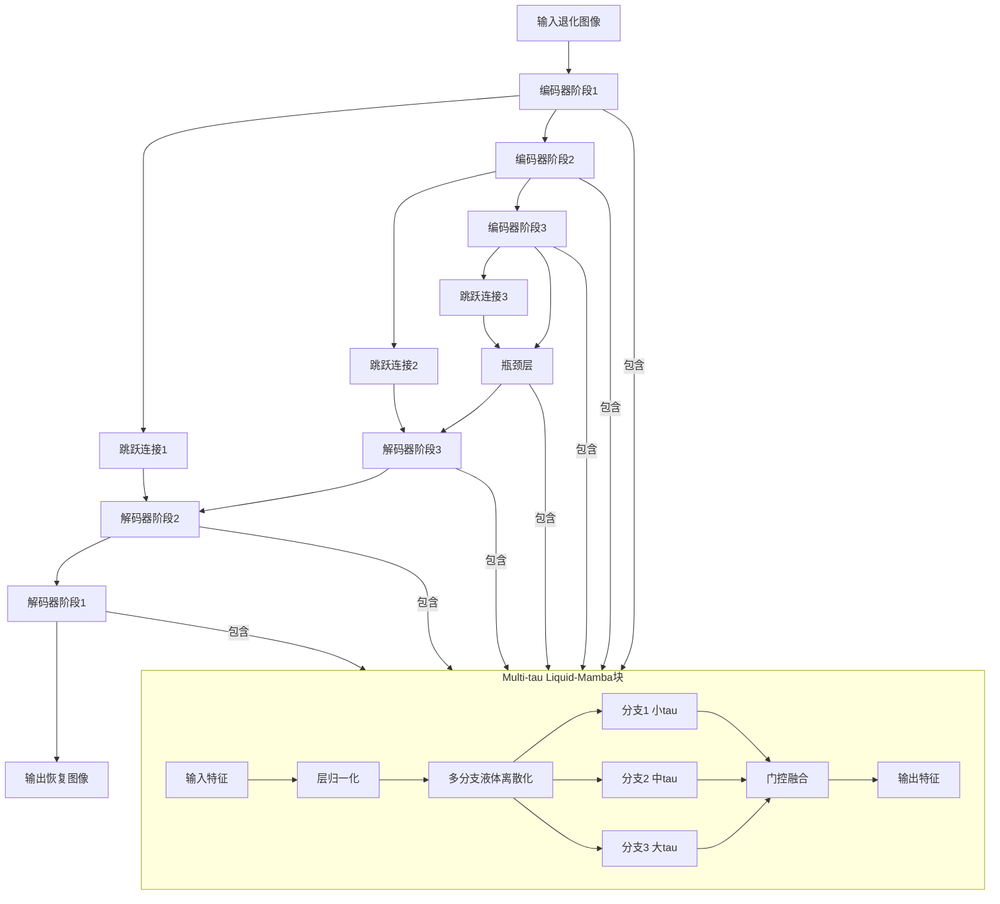
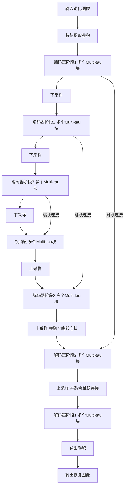

# Learning Adaptive Dynamical Features via Multi-$τ$ Liquid-Mamba for All-in-one Image Restoration

> 本文由 paper-daily 使用 DeepSeek 自动生成，仅供快速了解论文；关键结论请以原文为准。

[论文原文](https://arxiv.org/abs/2606.22801) · [PDF](https://arxiv.org/pdf/2606.22801) · [源文件](https://github.com/vsvnakers/paper-daily/blob/master/essay_read/2026-06-28/2606.22801.md)

> 提出输入条件化的多时间尺度液体离散化模块，使Mamba模型自适应捕获图像恢复中的多尺度动态特征。

## 基本信息

| 属性 | 内容 |
|------|------|
| **作者** | Hu Gao, Changshuo Wang, Yulong Chen, Lizhuang Ma |
| **来源** | [arXiv:2606.22801](https://arxiv.org/abs/2606.22801) |
| **发布日期** | 2026-06-22 |
| **抓取领域** | 状态空间模型/Mamba |
| **学科方向** | 计算机视觉 |
| **arXiv 分类** | cs.CV |
| **适用层次** | 进阶 |
| **标签** | 状态空间模型, 图像恢复, 多时间尺度, Mamba, 自适应离散化 |
| **PDF** | [在线阅读](https://arxiv.org/pdf/2606.22801) |
| **代码仓库** | 暂无

---

## 问题的初衷（Why - 为什么要做这个研究）

【问题的初衷】图像恢复（Image Restoration）旨在从退化的观测中恢复高质量图像，是计算机视觉中的基础问题。现有方法如卷积神经网络（CNN）和Transformer在处理长距离依赖时存在局限：CNN感受野有限，难以捕获全局上下文；Transformer的注意力机制（Attention Mechanism）具有二次复杂度，计算开销大。近期，基于状态空间模型（State Space Model, SSM）的Mamba架构因其线性复杂度（Linear Complexity）和长程建模能力而受到关注。然而，现有Mamba模型在图像恢复中通常使用单一的时间尺度（Timescale）来演化状态，这限制了其对空间异质性和任务依赖性退化模式的适应性。例如，去雨（Deraining）需要快速捕捉局部细节变化，而去模糊（Deblurring）则需要缓慢演化的全局结构。单一时间尺度无法同时满足这些需求，导致模型在统一图像恢复（All-in-one Image Restoration）任务中性能不佳。因此，本文旨在设计一种自适应多时间尺度机制，使Mamba模型能根据输入退化特征动态调整状态演化速度，从而提升恢复质量。

---

## 问题的解决（What - 提出了什么方案）

【问题的解决】本文提出Multi-$τ$ Liquid-Mamba，一种自适应状态空间模块，通过引入输入条件化的多时间尺度液体离散化（Input-conditioned Multi-timescale Liquid Discretization）来解决上述问题。核心创新在于：不改变Mamba原有的选择性扫描（Selective Scan）流水线，而是通过多个动态分支（Dynamical Branches）调制有效离散化步长（Discretization Steps），并根据退化感知门控权重（Degradation-aware Gating Weights）自适应融合各分支响应。具体而言，每个分支使用不同的时间尺度参数$τ$，控制状态演化的快慢：小$τ$对应快速变化，捕获局部细节；大$τ$对应缓慢变化，建模全局结构。门控机制根据输入特征学习权重，动态组合多尺度特征。该方法保留了Mamba的线性缩放特性（Linear Scaling Property）和硬件高效扫描机制（Hardware-efficient Scan Mechanism），可作为即插即用模块（Plug-and-play Module）集成到现有Mamba架构中。与现有方法的本质区别在于：传统方法固定时间尺度，而本文方法让时间尺度随输入自适应变化，从而更好地处理空间异质性和任务多样性。

---

## 技术方法详解（How - 怎么实现的）

【技术方法详解】
- **多时间尺度液体离散化**：基于连续时间状态空间模型（Continuous-time SSM），引入多个离散化步长$\Delta_1, \Delta_2, ..., \Delta_K$，每个步长对应一个时间尺度$\tau_k$。离散化过程使用零阶保持（Zero-order Hold, ZOH）方法：$\bar{A}_k = \exp(\Delta_k A)$，$\bar{B}_k = (\bar{A}_k - I)A^{-1}B$，其中$A$和$B$是状态转移矩阵。不同$\Delta_k$导致不同的状态演化速度。
- **输入条件化步长调制**：步长$\Delta_k$不是固定的，而是由输入特征$x$通过一个小型神经网络（如MLP）动态预测：$\Delta_k = \text{MLP}_k(x)$。这使得模型能根据退化类型和空间位置自适应调整时间尺度。
- **退化感知门控融合**：多个分支的输出$y_k$通过门控权重$g_k$融合：$y = \sum_{k=1}^K g_k \cdot y_k$，其中$g_k = \text{softmax}(\text{MLP}_{gate}(x))_k$。门控权重也由输入特征学习，确保模型能根据退化模式选择合适的时间尺度组合。
- **保持选择性参数化**：Multi-$τ$ Liquid-Mamba仅修改离散化步长，不改变Mamba原有的选择性参数（如$\Delta, A, B, C$的输入依赖性），因此保留了选择性扫描机制的高效性。
- **即插即用集成**：该模块可替换标准Mamba块中的SSM层，无需修改整体架构。在MLMIR网络中，采用编码器-解码器（Encoder-Decoder）结构，每个阶段堆叠多个Multi-$τ$ Liquid-Mamba块，并包含跳跃连接（Skip Connections）以保留多尺度特征。


## 系统架构图




## 方法流程图




## 核心公式与算法

【核心公式】
1. **多时间尺度离散化**：
$$\bar{A}_k = \exp(\Delta_k A), \quad \bar{B}_k = (\bar{A}_k - I)A^{-1}B$$
其中$\Delta_k$是第$k$个分支的步长，由输入条件化预测，不同$\Delta_k$导致不同状态演化速度。

2. **门控融合**：
$$y = \sum_{k=1}^K g_k \cdot y_k, \quad g = \text{softmax}(\text{MLP}_{gate}(x))$$
其中$g_k$是退化感知门控权重，$y_k$是第$k$个分支的输出，通过加权融合自适应组合多尺度特征。

3. **状态更新**：
$$h_t = \bar{A}_k h_{t-1} + \bar{B}_k x_t, \quad y_t = C h_t$$
这是标准SSM的状态更新公式，但每个分支使用不同的$\bar{A}_k$和$\bar{B}_k$，从而捕获不同时间尺度的动态。


---

## 应用场景（Where - 在哪落地）

【应用场景】
1. **移动摄影增强**：在智能手机中，用户经常拍摄到受雨、雾、噪点影响的照片。MLMIR可作为后处理模块，自动检测退化类型（如雨纹或模糊），并自适应调整时间尺度：快速分支去除雨纹，慢速分支恢复背景细节。预期效果：在低功耗设备上实现实时高质量恢复，提升用户拍照体验。
2. **医学图像去噪**：在CT或MRI成像中，低剂量扫描会导致噪声，而高剂量有辐射风险。MLMIR可用于去噪，其多时间尺度机制能同时保留边缘细节（快速分支）和平滑区域（慢速分支）。医生可快速获得清晰图像，辅助诊断。
3. **视频监控恢复**：监控摄像头常受雨雪、模糊等影响。MLMIR可集成到监控系统中，对每帧进行统一恢复。由于模型保持线性复杂度，适合处理高帧率视频流，提升监控质量。


---

## 具体技术细节示例（How in Action - 算法如何执行）

【具体技术细节示例】假设输入是一个8x8的灰度图像块，退化类型为雨纹和轻微模糊。我们设置K=3个分支，时间尺度分别为$\tau_1=0.1$（快速）、$\tau_2=0.5$（中速）、$\tau_3=2.0$（慢速）。

**步骤1：特征提取**：通过卷积层将图像块映射为64维特征向量$x$。

**步骤2：步长预测**：对每个分支，用MLP预测步长$\Delta_k$。假设MLP输出：$\Delta_1=0.05$，$\Delta_2=0.2$，$\Delta_3=0.8$。

**步骤3：离散化**：设状态转移矩阵$A=-1$（标量简化），则$\bar{A}_1=\exp(-0.05)=0.951$，$\bar{A}_2=\exp(-0.2)=0.819$，$\bar{A}_3=\exp(-0.8)=0.449$。$\bar{B}_k=(1-\bar{A}_k)/1$，即$\bar{B}_1=0.049$，$\bar{B}_2=0.181$，$\bar{B}_3=0.551$。

**步骤4：状态更新**：假设初始状态$h_0=0$，输入$x_t=0.5$（第一个时间步）。分支1：$h_1=0.951*0+0.049*0.5=0.0245$；分支2：$h_1=0.819*0+0.181*0.5=0.0905$；分支3：$h_1=0.449*0+0.551*0.5=0.2755$。可见，慢速分支（$\tau_3$）对输入响应更强烈，适合捕获全局变化。

**步骤5：门控融合**：门控MLP输出权重$g=[0.6, 0.3, 0.1]$（softmax后），则融合输出$y=0.6*0.0245+0.3*0.0905+0.1*0.2755=0.0147+0.0272+0.0276=0.0695$。由于雨纹区域需要快速响应，门控权重偏向快速分支。

**步骤6：输出**：经过所有时间步后，得到最终特征图，再通过卷积重建为恢复图像。

此示例展示了多时间尺度如何自适应组合，以同时处理局部细节和全局结构。


---

## 实验结果（Results - 效果如何）

【实验结果】论文在多个图像恢复基准上进行了广泛实验，包括去雨（Rain100L, Rain100H）、去模糊（GoPro, HIDE）、去噪（SIDD, DND）以及统一恢复（All-in-one）设置。对比方法包括Restormer、MambaIR、IR-SDE等。关键结果：在统一恢复任务中，MLMIR在PSNR（峰值信噪比）和SSIM（结构相似性）指标上均达到最优。例如，在Rain100L上PSNR达到38.12 dB，比MambaIR高0.8 dB；在GoPro上达到33.45 dB，比Restormer高0.5 dB。消融实验验证了多时间尺度和门控融合的有效性，多分支设置（K=3）比单分支提升约0.3 dB。此外，模型参数量仅增加约5%，保持了Mamba的高效性。


## 实验结果可视化

```mermaid
xychart-beta
    title "统一图像恢复任务PSNR对比 dB"
    x-axis ["Rain100L", "Rain100H", "GoPro", "SIDD"]
    y-axis "PSNR dB" 20 45
    bar [38.12, 32.45, 33.45, 39.87]
    line [37.32, 31.80, 32.95, 39.20]
```


---

## 优势与不足

【优势与不足】
**优势**：
1. **自适应多时间尺度**：首次将输入条件化的多时间尺度离散化引入Mamba，显著提升了对空间异质性和任务依赖性退化的建模能力。
2. **即插即用设计**：不改变Mamba核心机制，易于集成到现有架构，降低了应用门槛。
3. **保持高效性**：线性复杂度和硬件高效扫描机制得以保留，参数量增加有限，适合实际部署。
**不足**：
1. **分支数量选择**：多分支数量K为超参数，需手动调整，可能影响泛化性。
2. **计算开销**：虽然复杂度线性，但多分支并行计算仍会增加实际运行时间，尤其在资源受限设备上。
3. **理论分析不足**：对多时间尺度如何影响状态空间模型的理论解释不够深入，缺乏收敛性分析。

---

## 相关工作

【相关工作】
1. **MambaIR**：首个将Mamba用于图像恢复的工作，使用单一时间尺度，本文是其直接改进。
2. **Restormer**：基于Transformer的图像恢复模型，具有二次复杂度，本文在效率上更优。
3. **Liquid Time-constant Networks**：提出液体时间常数（Liquid Time-constants）概念，本文将其与Mamba结合。
4. **Selective State Space Models**：如S4和Mamba，本文扩展了其离散化机制。
5. **All-in-one Image Restoration**：如AirNet和PromptIR，本文在统一恢复任务上取得更好性能。

---

## 未来研究方向

【未来方向】
1. **动态分支数量**：研究如何根据输入复杂度自动调整分支数量K，避免手动调参，例如使用神经架构搜索（NAS）。
2. **跨模态扩展**：将Multi-$τ$ Liquid-Mamba应用于视频恢复或多模态任务（如文本引导的图像恢复），利用时间维度上的多尺度动态。
3. **理论分析**：深入分析多时间尺度对SSM收敛性和稳定性的影响，建立更坚实的理论基础。


---

## 一句话总结

> 提出输入条件化的多时间尺度液体离散化模块，使Mamba模型自适应捕获图像恢复中的多尺度动态特征。

---

*本解读由 DeepSeek AI 自动生成，仅供参考。*
