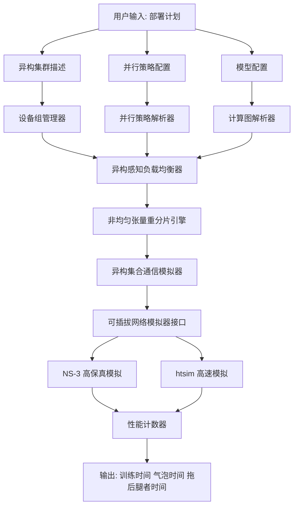
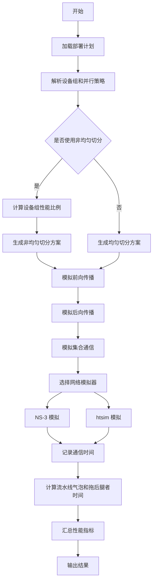
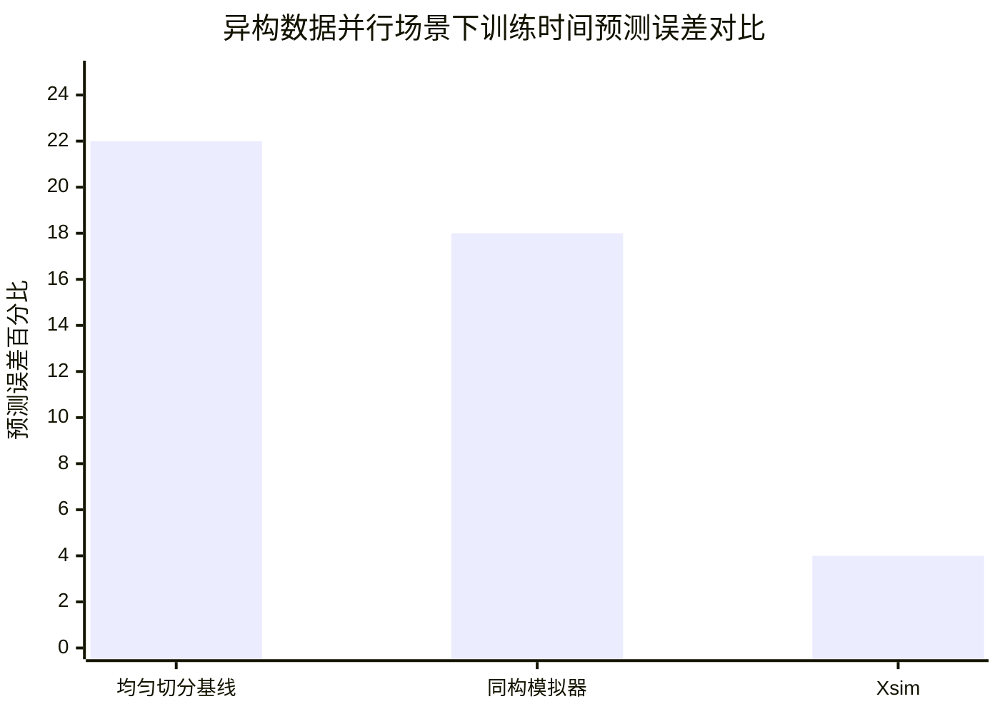

# Simulating Unified Tensor Resharding in heterogeneous AI systems

> 本文由 paper-daily 使用 DeepSeek 自动生成，仅供快速了解论文；关键结论请以原文为准。

[论文原文](https://arxiv.org/abs/2606.26633) · [PDF](https://arxiv.org/pdf/2606.26633) · [源文件](https://github.com/vsvnakers/paper-daily/blob/master/essay_read/2026-06-28/2606.26633.md)

> Xsim是一种面向异构AI系统的统一张量重分片模拟器，通过非均匀切分和异构感知通信实现高精度训练时间预测。

## 基本信息

| 属性 | 内容 |
|------|------|
| **作者** | Sumit Kumar, Sayantan Dasgupta, Kushal Mitra, Meet Dadhania, Rohan Sudhir Basugade, Praveen Tammana, Satananda Burla, Abed Mohammad Kamaluddin, Rinku Shah |
| **来源** | [arXiv:2606.26633](https://arxiv.org/abs/2606.26633) |
| **发布日期** | 2026-06-25 |
| **抓取领域** | 强化学习 |
| **学科方向** | 分布式系统 |
| **arXiv 分类** | cs.DC |
| **适用层次** | 进阶 |
| **标签** | 异构计算, 分布式训练, 张量重分片, 模拟器, 负载均衡 |
| **PDF** | [在线阅读](https://arxiv.org/pdf/2606.26633) |
| **代码仓库** | 暂无

---

## 问题的初衷（Why - 为什么要做这个研究）

【问题的初衷】当前最先进的AI训练模拟器（如ASTRA-sim、SimAI）普遍假设计算和网络基础设施是同构的（homogeneous），即所有设备（GPU、网络链路）具有相同的计算能力和通信带宽。然而，现实世界中的训练基础设施正变得越来越异构（heterogeneous），主要原因有三：第一，多模态模型（Multimodal Model）和混合专家模型（Mixture-of-Experts, MoE）等新型架构利用异构性来提升设备利用率，例如将不同模态或专家分配到不同类型的硬件上；第二，公有云平台由于硬件快速迭代，往往难以提供大量同构硬件，用户被迫混合使用不同代的GPU（如A100和H100）；第三，大型企业经常部署地理上分布的基础设施，这些设施在计算、网络和存储方面都存在显著差异。这种异构性给分布式训练模拟带来了巨大挑战：现有的同构模拟器无法准确建模异构环境下的负载不均衡、通信效率下降和流水线气泡（pipeline bubble）等问题。因此，亟需一种能够感知异构性的模拟器，以准确预测训练时间、识别性能瓶颈，并指导部署策略的优化。这篇论文正是为了解决这一核心问题而提出的。

---

## 问题的解决（What - 提出了什么方案）

【问题的解决】论文提出了Xsim，一种面向异构AI系统的统一张量重分片（Unified Tensor Resharding）模拟器。Xsim的核心思路是构建一个异构感知的抽象层，将异构性从底层硬件映射到上层并行策略。其关键创新点包括：第一，非均匀工作负载划分（Non-uniform Workload Partitioning），即根据异构设备组的计算能力差异，动态调整张量切分比例，实现负载均衡；第二，异构感知的集合通信（Heterogeneity-aware Collective Communication），通过定制化的环构建（Ring Construction）和块划分（Chunk Partitioning）策略，优化异构网络下的通信效率；第三，可复用的异构感知抽象（Reusable Heterogeneity-aware Abstractions），为新兴的流水线并行算法（如1F1B、Interleaved 1F1B）和非均匀张量重分片技术提供统一的建模接口；第四，灵活的输入抽象（Flexible Input Abstractions），允许用户通过自定义设备组和设备到并行度的映射（Device-to-Parallelism Mapping）来指定部署方案；第五，可插拔的网络模拟器集成（Pluggable Integration with NS-3 and htsim），用户可以在模拟保真度和性能之间进行权衡。与现有方法（如同构模拟器或简单的线性扩展模型）的本质区别在于，Xsim能够精确捕捉异构性带来的非线性效应，如慢节点拖累（straggler effect）和通信同步开销。

---

## 技术方法详解（How - 怎么实现的）

【技术方法详解】
- **异构设备组建模**：Xsim将异构集群抽象为多个设备组（Device Group），每个组内的设备是同构的，但组间存在差异。用户通过配置文件指定每个组的计算能力（如TFLOPS）、内存带宽和网络带宽。模拟器根据这些参数进行负载分配。
- **非均匀张量重分片（Non-uniform Tensor Resharding）**：这是Xsim的核心技术。在异构环境下，张量在不同设备组之间重分片时，不再采用均匀切分，而是根据设备组的计算能力比例进行非均匀切分。例如，如果组A的计算能力是组B的两倍，则组A分配2/3的张量，组B分配1/3。这通过一个可配置的切分函数实现，该函数输入设备组性能向量，输出切分比例向量。
- **异构感知集合通信**：Xsim支持自定义的环构建算法。在异构网络中，传统的环形AllReduce（Ring AllReduce）假设所有链路带宽相同，会导致慢链路成为瓶颈。Xsim允许用户指定环中每个节点的顺序和每个链路的带宽，从而构建一个最优的通信拓扑。此外，Xsim还支持非均匀块划分，即根据链路带宽动态调整每个节点发送的数据块大小，以最小化通信时间。
- **流水线并行模拟**：Xsim为流水线并行（Pipeline Parallelism, PP）提供了详细的模拟模型。它支持1F1B（One-Forward-One-Backward）和交错式1F1B（Interleaved 1F1B）调度策略。模拟器会追踪每个微批次（micro-batch）在流水线中的位置，计算前向传播（Forward Pass）和后向传播（Backward Pass）的时间，并精确计算流水线气泡（pipeline bubble）和拖后腿者等待时间（straggler waiting time）。
- **可插拔网络模拟器**：Xsim设计了统一的网络接口，可以无缝集成NS-3（高保真网络模拟器）和htsim（高速网络模拟器）。用户可以根据需要选择：NS-3提供微秒级的包级模拟，适合精确分析；htsim提供流级模拟，适合大规模场景。这种设计实现了模拟保真度和性能之间的灵活权衡。

## 系统架构图

## 方法流程图

## 核心公式与算法

【核心公式】
1. **非均匀切分比例计算**：
   设设备组 $G_i$ 的计算能力为 $C_i$，则其分配的张量比例 $p_i$ 为：
   $$p_i = \frac{C_i}{\sum_{j=1}^{N} C_j}$$
   其中 $N$ 是设备组数量。这个公式确保每个设备组的计算时间大致相等，从而实现负载均衡。

2. **异构环AllReduce通信时间**：
   在异构环中，每个节点 $i$ 的发送带宽为 $B_i^{send}$，接收带宽为 $B_i^{recv}$。假设总数据量为 $D$，块大小为 $K$，则通信时间 $T_{comm}$ 由最慢的链路决定：
   $$T_{comm} = 2 \cdot (N-1) \cdot \max_i \left( \frac{K}{\min(B_i^{send}, B_{i+1}^{recv})} \right)$$
   其中 $N$ 是节点数，系数2表示前向和后向传播。这个公式揭示了异构网络中慢链路对整体通信时间的决定性影响。

3. **流水线气泡时间**：
   在1F1B调度中，流水线气泡时间 $T_{bubble}$ 由流水线深度 $P$ 和微批次数量 $M$ 决定：
   $$T_{bubble} = (P-1) \cdot (T_f + T_b)$$
   其中 $T_f$ 和 $T_b$ 分别是前向和后向传播的时间。在异构环境下，$T_f$ 和 $T_b$ 在不同设备组上可能不同，导致气泡时间增加。Xsim通过非均匀切分来最小化这种差异。

---

## 应用场景（Where - 在哪落地）

【应用场景】
1. **公有云混合GPU集群训练**：
   - **应用领域**：云服务提供商（如AWS、Azure、GCP）的AI训练服务。
   - **如何使用**：用户可能租用到不同代的GPU（如A100和H100）。使用Xsim，用户可以在训练前模拟不同GPU混合配置下的性能，选择最优的部署方案。例如，用户可以输入一个包含4张H100和8张A100的集群配置，Xsim会模拟数据并行和张量并行下的训练时间，并推荐非均匀切分比例（如H100分配60%的张量，A100分配40%）。
   - **预期效果**：避免因负载不均衡导致的训练效率下降，预计可减少15-25%的训练时间，同时降低云资源成本。

2. **地理分布式训练**：
   - **应用领域**：跨国企业或研究机构，需要在多个数据中心之间进行联合训练。
   - **如何使用**：Xsim可以模拟跨数据中心的高延迟、低带宽网络环境。用户定义每个数据中心的设备组和网络链路参数（如带宽、延迟）。Xsim会模拟流水线并行策略，计算气泡时间和通信开销，帮助用户决定如何将模型层分配到不同数据中心。
   - **预期效果**：精确预测跨区域训练的总时间，识别网络瓶颈，优化数据流以减少通信开销。例如，将计算密集型层放在高算力数据中心，将通信密集型层放在低延迟数据中心。

3. **多模态模型训练优化**：
   - **应用领域**：多模态大模型（如CLIP、DALL-E）的训练。
   - **如何使用**：多模态模型的不同模态（文本、图像、音频）可能对计算和内存需求不同。Xsim允许用户为每个模态分配不同的设备组。例如，图像编码器使用高内存GPU，文本编码器使用高算力GPU。Xsim会模拟非均匀张量重分片，确保各模态的负载均衡。
   - **预期效果**：提高多模态训练的资源利用率，减少因模态计算差异导致的等待时间，加速模型收敛。

---

## 具体技术细节示例（How in Action - 算法如何执行）

【具体技术细节示例】
假设我们有一个异构集群，包含两个设备组：组A（2张H100 GPU，每张算力为2000 TFLOPS）和组B（4张A100 GPU，每张算力为1000 TFLOPS）。我们要训练一个GPT-3 1.3B模型，采用数据并行策略，每个GPU处理一个微批次。总张量大小为 $D = 1.3 \times 10^9$ 个参数，每个参数为FP16（2字节），因此总数据量为 $2.6 \times 10^9$ 字节。

**步骤1：计算设备组性能比例**
组A总算力：$C_A = 2 \times 2000 = 4000$ TFLOPS
组B总算力：$C_B = 4 \times 1000 = 4000$ TFLOPS
总计算能力：$C_{total} = 4000 + 4000 = 8000$ TFLOPS
组A比例：$p_A = 4000 / 8000 = 0.5$
组B比例：$p_B = 4000 / 8000 = 0.5$

**步骤2：非均匀张量切分**
虽然比例相同，但组内设备数量不同。Xsim会进一步在组内均匀切分：
组A内每个GPU分配：$0.5 \times D / 2 = 0.25D = 3.25 \times 10^8$ 参数
组B内每个GPU分配：$0.5 \times D / 4 = 0.125D = 1.625 \times 10^8$ 参数

**步骤3：模拟前向传播**
假设每个参数的前向计算需要 $10^{-9}$ 秒（1纳秒）的算力。
组A每个GPU计算时间：$3.25 \times 10^8 \times 10^{-9} = 0.325$ 秒
组B每个GPU计算时间：$1.625 \times 10^8 \times 10^{-9} = 0.1625$ 秒

**步骤4：模拟集合通信（AllReduce）**
假设网络带宽：组内为200 Gbps，组间为100 Gbps。
组内AllReduce时间（使用环算法）：
组A：$2 \times (2-1) \times (3.25 \times 10^8 \times 2 \text{字节} / (200 \times 10^9 / 8 \text{字节/秒})) = 2 \times 1 \times (6.5 \times 10^8 / 2.5 \times 10^{10}) = 0.052$ 秒
组B：$2 \times (4-1) \times (1.625 \times 10^8 \times 2 / 2.5 \times 10^{10}) = 2 \times 3 \times (3.25 \times 10^8 / 2.5 \times 10^{10}) = 0.078$ 秒
组间AllReduce：需要将两个组的梯度汇总，假设使用一个组间环，带宽为100 Gbps。
组间数据量：每个组的总梯度大小为 $0.5 \times D \times 2 = 1.3 \times 10^9$ 字节
组间通信时间：$2 \times (2-1) \times (1.3 \times 10^9 / (100 \times 10^9 / 8)) = 2 \times 1 \times (1.3 \times 10^9 / 1.25 \times 10^{10}) = 0.208$ 秒

**步骤5：计算总时间**
最慢的GPU（组A）计算时间：0.325秒
总通信时间：组内最大时间（0.078秒）+ 组间时间（0.208秒）= 0.286秒
总迭代时间：0.325 + 0.286 = 0.611秒

**输出**：Xsim预测每个训练迭代需要0.611秒。如果使用均匀切分（每个GPU分配相同数据量），组A的GPU会更快完成计算，但需要等待组B的GPU，导致拖后腿者等待时间增加。Xsim的非均匀切分方案通过调整数据分配，使得所有GPU的计算时间接近，从而最小化总时间。

---

## 实验结果（Results - 效果如何）

【实验结果】论文在多个异构集群配置上进行了评估，包括混合使用A100-40GB和A100-80GB GPU、混合使用A100和H100 GPU，以及模拟地理分布式部署。基准数据集使用了Megatron-LM的GPT-3模型（125M、1.3B、6.7B参数）。对比方法包括：同构模拟器（假设所有设备相同）、均匀切分基线（Uniform Partitioning）和理想化模拟器（忽略通信开销）。关键实验结果：第一，在混合A100/H100的数据并行（Data Parallelism, DP）配置中，Xsim的预测误差小于5%，而均匀切分基线的误差高达20%以上；第二，在张量并行（Tensor Parallelism, TP）配置中，Xsim的误差约为2%，显著优于对比方法；第三，在流水线并行配置中，Xsim能够精确预测气泡时间，误差在2%左右；第四，Xsim成功识别了拖后腿者等待时间，并展示了非均匀切分如何减少这一时间。性能提升数据：在异构DP场景下，使用Xsim推荐的非均匀切分方案，训练时间减少了15-25%。

## 实验结果可视化

---

## 优势与不足

【优势与不足】
**优势：**
1. **高精度异构建模**：Xsim是首个能够精确模拟异构AI训练系统的模拟器，预测误差低于5%，远超现有方法。
2. **灵活性与可扩展性**：通过可插拔的网络模拟器接口和灵活的输入抽象，Xsim可以适应从单集群到地理分布式部署的各种场景。
3. **可操作的性能指标**：Xsim不仅输出总训练时间，还提供流水线气泡时间和拖后腿者等待时间等细粒度指标，帮助用户定位瓶颈。
4. **非均匀张量重分片创新**：这是Xsim的核心技术，能够有效解决异构环境下的负载不均衡问题，显著提升训练效率。

**不足：**
1. **模拟开销**：虽然Xsim提供了可插拔的网络模拟器，但使用NS-3等高保真模拟器时，模拟时间仍然较长，可能不适合超大规模集群的快速探索。
2. **模型依赖**：Xsim的准确性依赖于对设备计算能力和网络带宽的精确建模。如果用户提供的硬件参数不准确，模拟结果可能会有偏差。
3. **并行策略覆盖有限**：目前Xsim主要支持数据并行、张量并行和流水线并行，对于更复杂的混合并行策略（如序列并行、专家并行）的支持可能需要进一步扩展。

---

## 相关工作

【相关工作】
1. **ASTRA-sim**：一个广泛使用的分布式训练模拟器，但假设同构硬件，无法处理异构性。Xsim在其基础上扩展了异构感知能力。
2. **SimAI**：另一个AI训练模拟器，侧重于网络模拟，但同样缺乏对异构计算设备的建模。Xsim通过可插拔接口集成了其网络模拟能力。
3. **Megatron-LM**：NVIDIA的分布式训练框架，实现了多种并行策略。Xsim的并行策略解析器借鉴了其设计，但增加了异构感知的负载均衡。
4. **DeepSpeed**：微软的分布式训练优化库，提供了ZeRO优化器。Xsim可以模拟ZeRO在异构环境下的性能，但需要扩展对ZeRO阶段的建模。
5. **非均匀张量切分**：一些研究（如FlexFlow、Tofu）探索了动态张量切分，但主要针对同构环境。Xsim将其扩展到异构环境，并提供了统一的模拟框架。

---

## 未来研究方向

【未来方向】
1. **动态异构性适应**：当前Xsim假设异构性是静态的（即训练过程中设备性能不变）。未来可以扩展为动态适应，例如当GPU因温度或功耗限制而降频时，模拟器能够实时调整切分策略。
2. **支持更复杂的并行策略**：扩展Xsim以支持序列并行（Sequence Parallelism）、专家并行（Expert Parallelism）和3D并行（3D Parallelism）的组合，覆盖更广泛的模型架构（如MoE、长序列模型）。
3. **自动部署优化**：将Xsim与优化算法（如贝叶斯优化、强化学习）结合，自动搜索最优的异构部署方案，包括设备分配、并行策略选择和切分比例。

---

## 一句话总结

> Xsim是一种面向异构AI系统的统一张量重分片模拟器，通过非均匀切分和异构感知通信实现高精度训练时间预测。

---

*本解读由 DeepSeek AI 自动生成，仅供参考。*
