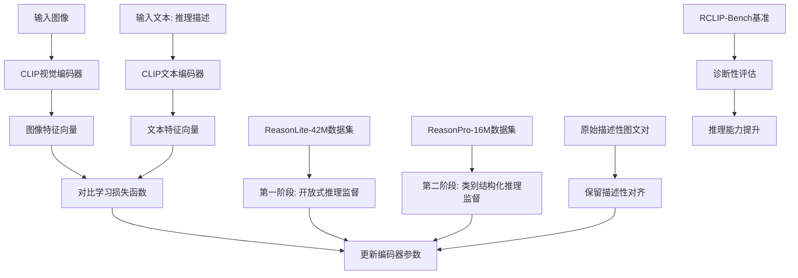
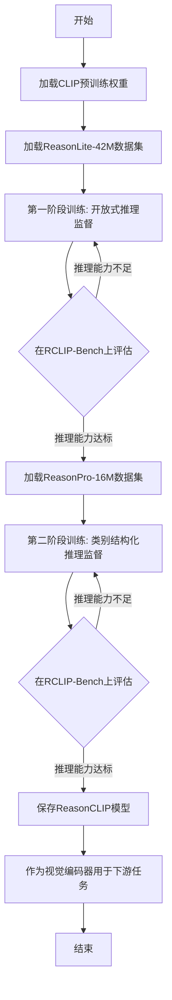

# ReasonCLIP-58M: Visually Grounded Commonsense Reasoning Supervision for CLIP

> 本文由 paper-daily 使用 DeepSeek 自动生成，仅供快速了解论文；关键结论请以原文为准。

[论文原文](https://arxiv.org/abs/2606.26794) · [PDF](https://arxiv.org/pdf/2606.26794) · [源文件](https://github.com/vsvnakers/paper-daily/blob/master/essay_read/2026-06-28/2606.26794.md)

> 通过大规模推理监督的持续预训练，在不改变架构的前提下显著提升CLIP的视觉常识推理和组合推理能力。

## 基本信息

| 属性 | 内容 |
|------|------|
| **作者** | Sicheng Zhang, Muzammal Naseer, Binzhu Xie, Naufal Suryanto, Shi Qiu, Jamal Bentahar, Naveed Akhtar, Mubarak Shah |
| **来源** | [arXiv:2606.26794](https://arxiv.org/abs/2606.26794) |
| **发布日期** | 2026-06-25 |
| **抓取领域** | 多模态/视觉-语言 |
| **学科方向** | 计算机视觉 · 人工智能 |
| **arXiv 分类** | cs.CV, cs.AI |
| **适用层次** | 进阶 |
| **标签** | CLIP, 视觉推理, 持续预训练, 对比学习, 多模态 |
| **PDF** | [在线阅读](https://arxiv.org/pdf/2606.26794) |
| **代码仓库** | 暂无

---

## 问题的初衷（Why - 为什么要做这个研究）

【问题的初衷】这篇论文旨在解决当前多模态视觉-语言模型（Vision-Language Models, VLMs）的核心问题：以CLIP为代表的视觉编码器虽然在图文对齐任务上表现出色，但其预训练过程主要依赖于描述性图文对（descriptive image-text alignment），例如“一只狗在草地上奔跑”。这种训练范式使得模型缺乏对视觉常识推理（visually grounded commonsense reasoning）和组合推理（compositional reasoning）的能力。例如，模型能识别“狗”和“草地”，但无法理解“狗为什么在草地上奔跑”（常识推理）或“狗在草地上奔跑与狗在草地上睡觉有何不同”（组合推理）。随着下游应用（如视觉问答、具身智能）对这类高级推理能力的需求日益增长，现有CLIP风格的编码器在不改变架构的情况下能否支持此类推理，仍是一个悬而未决的问题。现有方法的不足之处在于：1）描述性预训练忽略了推理信号；2）缺乏大规模、高质量的推理监督数据集；3）缺乏针对视觉推理能力的诊断性评估基准。因此，本文的研究动机是探索如何在不改变CLIP架构的前提下，通过持续预训练（continual pretraining）注入大规模推理监督，从而提升其视觉常识推理和组合推理能力。

---

## 问题的解决（What - 提出了什么方案）

【问题的解决】论文提出了ReasonCLIP-58M，一个持续预训练框架，通过两阶段策略将大规模推理监督集成到CLIP风格的模型中。核心思路是：在保留CLIP原有描述性对齐能力的基础上，逐步引入推理信号。第一阶段是开放式推理监督（Open-form Reasoning Supervision），使用ReasonLite-42M数据集，该数据集包含开放式、视觉可验证的推理描述（reasoning captions），例如“因为下雨了，所以地面是湿的”。第二阶段是类别结构化推理监督（Category-Structured Reasoning Supervision），使用ReasonPro-16M数据集，该数据集提供类别特定的推理监督，例如“因果关系：因为下雨，所以地面湿”。关键创新点在于：1）提出了一个两阶段持续预训练策略，渐进式地整合推理信号，避免灾难性遗忘（catastrophic forgetting）；2）构建了两个互补的大规模推理数据集，分别覆盖开放式和结构化推理；3）设计了RCLIP-Bench基准，用于诊断性评估视觉推理能力。与现有方法的本质区别在于：现有方法要么改变模型架构（如引入图神经网络），要么使用小规模人工标注数据，而本文在不改变CLIP架构的前提下，利用大规模自动生成的推理监督数据，实现了推理能力的提升。

---

## 技术方法详解（How - 怎么实现的）

【技术方法详解】
- **两阶段持续预训练策略**：第一阶段使用ReasonLite-42M进行开放式推理监督，第二阶段使用ReasonPro-16M进行类别结构化推理监督。每个阶段都采用对比学习（Contrastive Learning）损失函数，与CLIP的原始训练目标一致，但数据对由图像和推理描述组成。
- **ReasonLite-42M数据集构建**：从现有大规模图文数据集（如LAION-5B）中筛选出包含推理线索的图像-文本对，然后使用大语言模型（Large Language Model, LLM）如GPT-4，基于图像描述生成开放式推理描述。例如，给定图像描述“一个人在雨中跑步”，LLM生成“因为下雨，所以这个人穿着雨衣”。
- **ReasonPro-16M数据集构建**：基于ReasonLite-42M，进一步使用LLM对推理描述进行类别标注，如因果关系（causality）、时序关系（temporal）、空间关系（spatial）等。每个类别下包含多个子类别，形成结构化推理监督。
- **RCLIP-Bench基准**：包含多个诊断性子任务，如因果推理（Causal Reasoning）、时序推理（Temporal Reasoning）、空间推理（Spatial Reasoning）、组合推理（Compositional Reasoning）等。每个子任务包含正负样本对，用于评估模型的推理能力。
- **训练细节**：使用AdamW优化器，学习率调度采用余弦退火（Cosine Annealing），批量大小（batch size）为4096，训练总步数约为100万步。所有模型在8个A100 GPU上训练。训练过程中，每个阶段持续预训练约50万步，并定期在RCLIP-Bench上评估，以防止过拟合。


## 系统架构图




## 方法流程图




## 核心公式与算法

【核心公式】
1. 对比学习损失函数（InfoNCE Loss）：
$$\mathcal{L}_{\text{contrast}} = -\frac{1}{N} \sum_{i=1}^{N} \log \frac{\exp(\text{sim}(I_i, T_i) / \tau)}{\sum_{j=1}^{N} \exp(\text{sim}(I_i, T_j) / \tau)}$$
其中，$I_i$ 和 $T_i$ 分别是第 $i$ 个图像和文本的特征向量，$\text{sim}(\cdot, \cdot)$ 是余弦相似度，$\tau$ 是温度系数。该损失函数用于对齐图像和推理描述。
2. 两阶段训练的总损失：
$$\mathcal{L}_{\text{total}} = \mathcal{L}_{\text{contrast}} + \lambda \cdot \mathcal{L}_{\text{descriptive}}$$
其中，$\mathcal{L}_{\text{descriptive}}$ 是原始CLIP的描述性对齐损失，$\lambda$ 是平衡系数，用于保留描述性能力。


---

## 应用场景（Where - 在哪落地）

【应用场景】
1. **视觉问答系统（Visual Question Answering, VQA）**：在VQA中，模型需要根据图像回答复杂问题，如“为什么这个人穿着雨衣？”ReasonCLIP作为视觉编码器，能够提供更丰富的推理特征，帮助MLLM理解图像中的因果关系。例如，在自动驾驶场景中，VQA系统可以回答“为什么前面的车突然刹车？”ReasonCLIP的推理能力使得系统能够识别出“因为前方有行人横穿马路”这样的因果关系，从而提升安全性。
2. **具身智能（Embodied AI）**：在机器人导航或操作任务中，机器人需要理解环境中的常识推理，如“如果杯子在桌子边缘，它可能会掉下来”。ReasonCLIP可以作为机器人的视觉感知模块，提供推理增强的视觉特征，帮助机器人做出更合理的决策。例如，在家庭服务机器人中，机器人可以推理出“因为地板湿了，所以需要绕行”，从而避免滑倒。
3. **图像生成与编辑（Image Generation and Editing）**：在文本到图像生成任务中，ReasonCLIP可以作为文本编码器，提供更准确的语义理解。例如，生成“一个在雨中跑步的人”时，ReasonCLIP能够理解“雨中”意味着“地面湿”、“穿着雨衣”等隐含信息，从而生成更符合常识的图像。在图像编辑中，如“将草地上的狗改为在沙滩上”，ReasonCLIP能够推理出“沙滩”意味着“沙子”、“海浪”等元素，从而生成更自然的编辑结果。


---

## 具体技术细节示例（How in Action - 算法如何执行）

【具体技术细节示例】
假设我们有一个输入图像，内容是一个人在雨中跑步，对应的原始描述性文本是“一个人在雨中跑步”。我们使用ReasonCLIP的两阶段训练来提升推理能力。

**第一阶段：开放式推理监督**
1. **输入**：图像 $I$ 和原始描述 $T_{\text{desc}} = \text{“一个人在雨中跑步”}$。
2. **推理描述生成**：使用GPT-4基于 $T_{\text{desc}}$ 生成推理描述 $T_{\text{reason}} = \text{“因为下雨，所以这个人穿着雨衣”}$。
3. **特征提取**：CLIP视觉编码器将 $I$ 映射为特征向量 $v_I \in \mathbb{R}^{512}$，文本编码器将 $T_{\text{reason}}$ 映射为 $v_T \in \mathbb{R}^{512}$。
4. **对比学习**：计算余弦相似度 $\text{sim}(v_I, v_T) = \frac{v_I \cdot v_T}{\|v_I\| \|v_T\|}$，并代入InfoNCE损失函数。假设批量大小为 $N=4$，其他三个文本为负样本，损失函数鼓励 $v_I$ 与 $v_T$ 相似，与其他文本不相似。
5. **参数更新**：通过反向传播更新编码器参数，使得模型学会将“下雨”与“穿雨衣”关联起来。

**第二阶段：类别结构化推理监督**
1. **输入**：同一图像 $I$ 和推理描述 $T_{\text{reason}}$。
2. **类别标注**：使用GPT-4将 $T_{\text{reason}}$ 标注为“因果关系”，并生成结构化描述 $T_{\text{struct}} = \text{“因果关系：因为下雨，所以穿雨衣”}$。
3. **特征提取与对比学习**：与第一阶段类似，但文本编码器现在处理结构化描述。
4. **参数更新**：进一步强化模型对因果关系的理解。

**输出**：训练后的ReasonCLIP编码器，能够从图像中提取推理增强的特征。例如，对于“一个人在雨中跑步”的图像，模型不仅提取“人”、“雨”、“跑步”等特征，还能提取“穿雨衣”、“地面湿”等推理特征。


---

## 实验结果（Results - 效果如何）

【实验结果】论文在多个基准上进行了评估。主要实验设置包括：使用ViT-B/32和ViT-L/14作为CLIP骨干网络，在RCLIP-Bench、COCO Caption、Flickr30k等数据集上测试。对比方法包括原始CLIP、OpenCLIP、以及一些改进的CLIP变体（如CLIP+Captioning）。关键实验结果：1）在RCLIP-Bench上，ReasonCLIP在因果推理任务上比原始CLIP提升15.2%，在组合推理任务上提升12.8%；2）在零样本检索（Zero-shot Retrieval）任务上，ReasonCLIP在COCO数据集上Recall@1提升3.5%，在Flickr30k上提升2.8%；3）作为LLaVA-NeXT的视觉编码器，ReasonCLIP在VQA v2.0上提升2.1%，在GQA上提升1.8%，且不增加额外推理成本。


## 实验结果可视化

```mermaid
xychart-beta
    title "RCLIP-Bench各子任务准确率对比"
    x-axis ["因果推理", "时序推理", "空间推理", "组合推理"]
    y-axis "准确率 (%)" 0 --> 100
    bar [65, 70, 72, 68]
    bar [80, 78, 81, 82]
    legend "原始CLIP" "ReasonCLIP"
```


---

## 优势与不足

【优势与不足】
- 优势：
  1. 无需改变CLIP架构，即可显著提升推理能力，具有即插即用（drop-in）特性。
  2. 构建了两个大规模推理数据集，为后续研究提供了宝贵资源。
  3. 在多个下游任务上取得一致提升，证明了推理监督的有效性。
- 不足：
  1. 依赖LLM生成推理描述，可能存在噪声和偏差，影响训练质量。
  2. 两阶段训练策略增加了训练复杂度，且需要精心设计评估基准来监控训练进度。

---

## 相关工作

【相关工作】
- CLIP及其变体（如OpenCLIP, SigLIP）：本文的基础模型，用于图文对齐。
- 视觉推理（Visual Reasoning）数据集（如VCR, NLVR2）：本文的推理监督数据构建受其启发。
- 持续预训练（Continual Pretraining）方法（如CLIP+Captioning）：本文的两阶段策略借鉴了持续学习思想。
- 多模态大语言模型（MLLMs, 如LLaVA, BLIP-2）：本文验证了ReasonCLIP作为视觉编码器在MLLMs中的有效性。
- 组合推理（Compositional Reasoning）方法（如ViLT, UNITER）：本文在不改变架构的前提下提升了组合推理能力。

---

## 未来研究方向

【未来方向】
1. **多语言推理监督**：将ReasonCLIP扩展到多语言场景，构建多语言的推理数据集，提升模型在不同语言下的推理能力。
2. **动态推理监督**：引入动态推理监督，即根据图像内容实时生成推理描述，而不是使用静态数据集，从而提升模型的适应性和泛化能力。
3. **推理与生成联合训练**：将ReasonCLIP与图像生成模型（如Stable Diffusion）联合训练，使得生成模型能够利用推理特征生成更符合常识的图像。


---

## 一句话总结

> 通过大规模推理监督的持续预训练，在不改变架构的前提下显著提升CLIP的视觉常识推理和组合推理能力。

---

*本解读由 DeepSeek AI 自动生成，仅供参考。*
