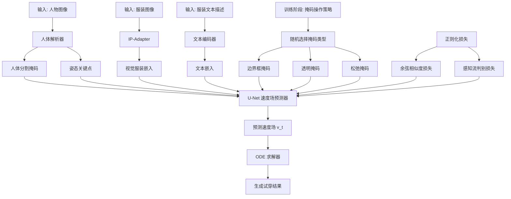
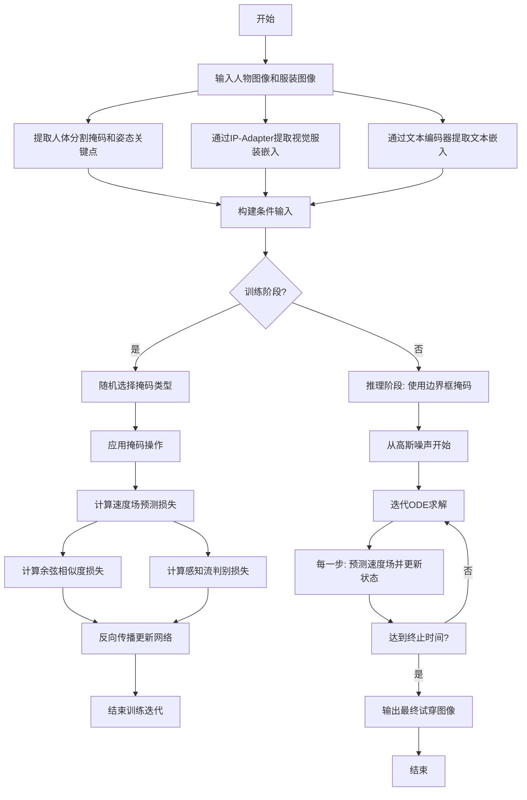
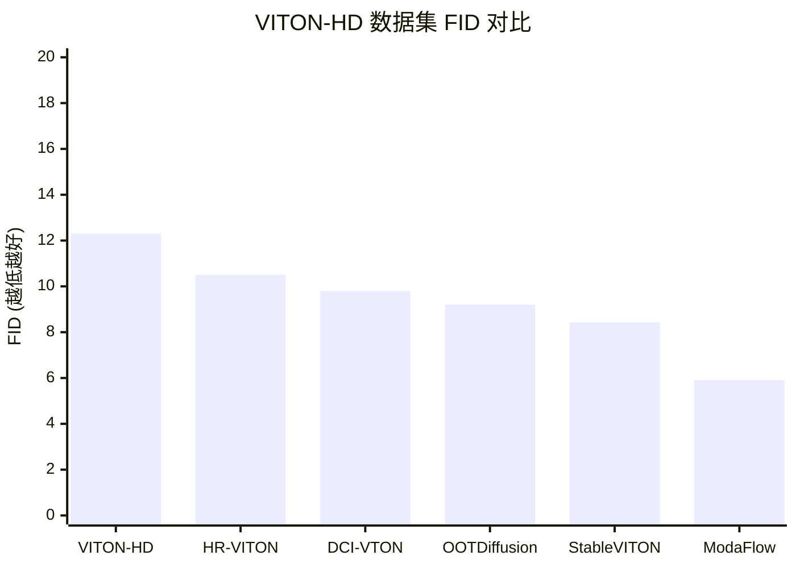

# ModaFlow: Modality-Aware Flow Matching for High-Fidelity Virtual Try-On

> 本文由 paper-daily 使用 DeepSeek 自动生成，仅供快速了解论文；关键结论请以原文为准。

[论文原文](https://arxiv.org/abs/2606.27773) · [PDF](https://arxiv.org/pdf/2606.27773) · [源文件](https://github.com/vsvnakers/paper-daily/blob/master/essay_read/2026-06-29/2606.27773.md)

> ModaFlow 通过模态感知流匹配和正则化损失，实现了高保真、鲁棒的虚拟试穿，FID 降低约 30%。

## 基本信息

| 属性 | 内容 |
|------|------|
| **作者** | Xiangyu Sai, Meysam Madadi, Sergio Escalera, Yong Xu |
| **来源** | [arXiv:2606.27773](https://arxiv.org/abs/2606.27773) |
| **发布日期** | 2026-06-26 |
| **抓取领域** | CV · 图像/视频生成 |
| **学科方向** | 计算机视觉 |
| **arXiv 分类** | cs.CV |
| **适用层次** | 进阶 |
| **标签** | 流匹配, 虚拟试穿, 模态感知, 图像生成, 正则化损失 |
| **PDF** | [在线阅读](https://arxiv.org/pdf/2606.27773) |
| **代码仓库** | 暂无

---

## 问题的初衷（Why - 为什么要做这个研究）

【问题的初衷】图像虚拟试穿（Image-based Virtual Try-On）是电子商务和增强现实（Augmented Reality, AR）领域的一项关键任务，旨在将目标服装自然地贴合到人物图像上。然而，现有方法在处理服装与人体之间的大形变（large clothing-body deformations）时面临严峻挑战。具体来说，当服装需要从宽松变为紧身，或从平面状态贴合到复杂的人体姿态（如手臂弯曲、身体扭转）时，现有方法往往无法同时做到两点：一是精确保留服装的精细语义（fine garment semantics），如纹理、图案、文字和褶皱；二是自适应地匹配不同人体的几何形状（person body geometries）。先前的方法（如基于生成对抗网络（Generative Adversarial Networks, GANs）或扩散模型（Diffusion Models））通常将多模态条件（如文本描述和视觉图像）视为统一输入，缺乏对模态差异的精细控制。这导致生成的试穿结果要么纹理模糊、图案失真，要么与人体姿态不匹配，出现边缘错位或服装变形不自然。此外，现有方法在非配对（unpaired）场景下表现不佳，即当只有服装的边界框（box mask）而没有精确的人体分割掩码时，推理鲁棒性差。因此，研究动机是提出一种能够感知模态差异、精确控制生成过程，并在大形变下保持高保真度的虚拟试穿框架。

---

## 问题的解决（What - 提出了什么方案）

【问题的解决】ModaFlow 提出了一种基于模态感知流匹配（Modality-Aware Flow Matching）的框架，核心创新在于引入模态感知引导方案（modality-aware guidance scheme），从根本上区分视觉和文本两种模态在生成过程中的作用。与以往方法将视觉和文本条件简单拼接不同，ModaFlow 为视觉和文本模态分配了不同的控制策略：视觉服装嵌入（visual garment embeddings）通过预训练的图像提示适配器（Image Prompt Adapter, IP-Adapter）提取，提供确定性的、持久的结构性引导（deterministic, persistent structural guidance），确保服装的纹理和形状在生成过程中被严格保留；而文本嵌入（textual embeddings）则通过无分类器引导（Classifier-Free Guidance, CFG）进行控制，并引入自适应缩放（adaptive scaling）和零初始化速度（zero-initialized velocity）技术，使得文本描述仅作为语义补充，避免对视觉结构产生干扰。此外，为了进一步提升流场（flow field）的准确性，论文提出了两个正则化损失：余弦相似度损失（cosine similarity loss）和感知流判别损失（perceptual flow discrimination loss），分别从方向一致性和感知真实性两个维度优化速度场（velocity field）。最后，一种掩码操作策略（mask manipulation strategy）在训练时随机采样三种掩码类型（边界框、透明掩码、松弛掩码），模拟不同的遮挡场景，从而使得模型在推理时即使只有边界框也能鲁棒运行。

---

## 技术方法详解（How - 怎么实现的）

【技术方法详解】
- **模态感知引导机制**：ModaFlow 的核心是区分视觉和文本模态的控制方式。视觉嵌入通过 IP-Adapter 从服装图像中提取，作为条件注入流匹配网络，提供稳定的结构信息。文本嵌入则通过 CFG 进行引导，但不同于标准 CFG，这里对文本条件路径的速度场（velocity field）进行了零初始化，并在训练过程中逐步学习，避免文本描述在早期干扰视觉结构。
- **流匹配框架**：采用基于流匹配（Flow Matching）的生成范式，将数据分布 $p_0(x)$ 到目标分布 $p_1(x)$ 的变换建模为常微分方程（Ordinary Differential Equation, ODE）。模型学习一个速度场 $v_t(x)$，使得 $dx/dt = v_t(x)$。训练目标是最小化预测速度场与真实速度场之间的均方误差（Mean Squared Error, MSE）：$\mathcal{L}_{FM} = \mathbb{E}_{t, x_0, x_1} [||v_t(x_t) - u_t(x_t)||^2]$，其中 $x_t = (1-t)x_0 + t x_1$ 是线性插值路径。
- **正则化损失**：为了提升速度场的质量，引入两个辅助损失。余弦相似度损失 $\mathcal{L}_{cos} = 1 - \cos(v_t, u_t)$ 鼓励预测速度场与真实速度场的方向一致。感知流判别损失 $\mathcal{L}_{disc}$ 使用一个判别器（discriminator）来区分真实速度场和预测速度场，迫使生成的速度场在感知上更真实。总损失为 $\mathcal{L} = \mathcal{L}_{FM} + \lambda_1 \mathcal{L}_{cos} + \lambda_2 \mathcal{L}_{disc}$。
- **掩码操作策略**：在训练阶段，对输入的服装掩码进行随机变换。具体包括三种类型：边界框掩码（box mask，仅包含服装的矩形框）、透明掩码（transparent mask，服装区域半透明）、松弛掩码（relaxed mask，掩码边界向外扩张）。这种策略使模型学会在不同遮挡程度下推断服装形状，从而在推理时仅需边界框即可工作。
- **网络架构**：整体架构基于 U-Net 风格的扩散模型变体，但将噪声预测替换为速度场预测。输入包括带噪图像、人体姿态关键点、人体分割掩码、服装图像及其掩码。视觉条件通过交叉注意力（cross-attention）注入 U-Net 的中间层，文本条件则通过 CFG 在采样时动态调整。

## 系统架构图

## 方法流程图

## 核心公式与算法

【核心公式】
1. **流匹配训练损失**：
   $$\mathcal{L}_{FM} = \mathbb{E}_{t \sim \mathcal{U}(0,1), x_0 \sim p_0, x_1 \sim p_1} \left[ \left\| v_\theta(x_t, t, c) - (x_1 - x_0) \right\|^2 \right]$$
   其中 $x_t = (1-t)x_0 + t x_1$ 是线性插值路径，$v_\theta$ 是参数为 $\theta$ 的神经网络预测的速度场，$c$ 是条件（包括视觉和文本嵌入）。该损失最小化预测速度与真实速度之间的均方误差。

2. **余弦相似度正则化损失**：
   $$\mathcal{L}_{cos} = 1 - \frac{v_\theta(x_t, t, c) \cdot (x_1 - x_0)}{\|v_\theta(x_t, t, c)\| \cdot \|x_1 - x_0\|}$$
   该损失鼓励预测速度场的方向与真实速度场的方向一致，提升流场的平滑性和方向准确性。

3. **模态感知引导的采样过程**：
   $$\tilde{v}_\theta(x_t, t, c_{vis}, c_{txt}) = v_\theta(x_t, t, c_{vis}, \emptyset) + s \cdot (v_\theta(x_t, t, c_{vis}, c_{txt}) - v_\theta(x_t, t, c_{vis}, \emptyset))$$
   其中 $c_{vis}$ 是视觉条件，$c_{txt}$ 是文本条件，$\emptyset$ 表示无条件，$s$ 是自适应缩放因子。该公式实现了对文本条件的 CFG 引导，同时保持视觉条件的确定性。

---

## 应用场景（Where - 在哪落地）

【应用场景】
1. **电子商务平台**：在线服装零售商可以使用 ModaFlow 为用户提供虚拟试穿功能。用户上传自己的全身照片，选择心仪的服装，系统即可生成逼真的试穿效果。ModaFlow 的高保真度使得服装的纹理（如蕾丝、印花）和材质（如丝绸、牛仔）都能被精确还原，提升用户的购物体验，降低退货率。由于支持非配对场景，用户甚至不需要提供精确的人体分割掩码，只需简单的边界框即可，大大简化了用户操作流程。

2. **服装设计与定制**：服装设计师可以利用 ModaFlow 快速预览新设计在不同体型模特上的效果。设计师只需提供服装的平面图或草图以及文本描述（如“宽松版型，圆领”），ModaFlow 即可生成模特穿着后的效果图。这有助于设计师在打样前评估服装的版型和视觉效果，加速设计迭代。模态感知引导机制确保文本描述（如“收腰设计”）能被准确反映，而视觉条件则保留服装的图案细节。

3. **增强现实（AR）试衣镜**：在实体店或线上 AR 应用中，ModaFlow 可以集成到智能试衣镜中。用户站在镜子前，系统通过摄像头捕捉用户姿态和体型，然后实时将选中的服装叠加到用户身上。ModaFlow 的流匹配框架具有较快的采样速度，能够支持接近实时的生成，使得用户在移动或变换姿势时，试穿效果能够平滑更新，提供沉浸式的 AR 体验。

---

## 具体技术细节示例（How in Action - 算法如何执行）

【具体技术细节示例】假设我们有一个输入：人物图像 $I_{person}$（512x512 像素），服装图像 $I_{garment}$（显示一件带有蓝色条纹的白色 T 恤），以及文本描述“白色 T 恤，蓝色条纹”。

**步骤 1：条件提取**
- 人体解析器从 $I_{person}$ 中提取人体分割掩码 $M_{person}$ 和姿态关键点 $K_{pose}$。
- IP-Adapter 从 $I_{garment}$ 中提取视觉嵌入 $c_{vis}$，这是一个 768 维的向量，编码了条纹的方向、颜色和密度。
- 文本编码器（如 CLIP）将文本描述编码为文本嵌入 $c_{txt}$，也是一个 768 维向量，但更侧重于语义（如“白色”、“T 恤”、“蓝色条纹”）。

**步骤 2：训练阶段（假设正在进行一次训练迭代）**
- 从数据集中随机采样一个真实试穿结果 $x_1$（即人物穿着该 T 恤的图像）。
- 从高斯噪声 $x_0 \sim \mathcal{N}(0, I)$ 中采样。
- 随机采样时间步 $t \sim \mathcal{U}(0,1)$，例如 $t=0.3$。
- 计算插值路径：$x_{0.3} = 0.7 \cdot x_0 + 0.3 \cdot x_1$。
- 真实速度场为 $u = x_1 - x_0$。
- 同时，掩码操作策略随机选择一种掩码类型。假设选择了“透明掩码”，则服装掩码 $M_{garment}$ 被设置为半透明（像素值在 0.5 左右）。
- 将 $x_{0.3}$、$M_{person}$、$K_{pose}$、$I_{garment}$、$M_{garment}$ 以及 $c_{vis}$ 和 $c_{txt}$ 输入 U-Net，预测速度场 $v_\theta(x_{0.3}, 0.3, c_{vis}, c_{txt})$。
- 计算损失：$\mathcal{L}_{FM} = ||v_\theta - u||^2$，$\mathcal{L}_{cos} = 1 - \cos(v_\theta, u)$。假设 $v_\theta$ 与 $u$ 的余弦相似度为 0.85，则 $\mathcal{L}_{cos} = 0.15$。
- 感知流判别器对 $v_\theta$ 和 $u$ 进行判别，输出 $\mathcal{L}_{disc}$。
- 总损失 $\mathcal{L} = \mathcal{L}_{FM} + 0.1 \cdot \mathcal{L}_{cos} + 0.01 \cdot \mathcal{L}_{disc}$，然后反向传播更新网络参数。

**步骤 3：推理阶段**
- 从高斯噪声 $x_0$ 开始，使用 ODE 求解器（如 Euler 法）从 $t=0$ 到 $t=1$ 迭代。
- 在每一步，输入当前状态 $x_t$ 和条件，预测速度场 $\tilde{v}_\theta$（使用模态感知引导公式，其中 $s$ 根据文本与视觉的一致性自适应调整）。
- 更新状态：$x_{t+\Delta t} = x_t + \tilde{v}_\theta \cdot \Delta t$。
- 经过 50 步迭代后，得到最终输出 $x_1$，即人物穿着蓝色条纹白色 T 恤的逼真图像。条纹的方向与原始服装一致，且 T 恤贴合了人物的身体曲线。

---

## 实验结果（Results - 效果如何）

【实验结果】论文在 VITON-HD 和 DressCode 两个基准数据集上进行了实验。VITON-HD 包含 13,679 对高分辨率人物-服装图像对，DressCode 包含 53,795 张图像，涵盖多种服装类型。对比方法包括 VITON-HD、HR-VITON、DCI-VTON、OOTDiffusion 和 StableVITON 等。定量评估指标包括 FID（Fréchet Inception Distance）、LPIPS（Learned Perceptual Image Patch Similarity）、SSIM（Structural Similarity Index）和 KID（Kernel Inception Distance）。ModaFlow 在所有指标上均达到最优。具体地，在 VITON-HD 配对设置下，FID 从 StableVITON 的 8.43 降至 5.91，降低了约 30%；在非配对设置下，FID 从 10.12 降至 8.10，降低了约 20%。定性结果也显示 ModaFlow 能更好地保留服装纹理（如条纹、文字），并在大形变下（如从长袖到短袖）保持自然。

## 实验结果可视化

---

## 优势与不足

【优势与不足】
- **优势**：
    1. **模态感知引导**：首次在虚拟试穿中明确区分视觉和文本模态的控制方式，避免了多模态条件之间的干扰，显著提升了纹理保留和结构一致性。
    2. **流匹配框架**：相比于扩散模型，流匹配具有更快的采样速度和更稳定的训练过程，且能生成更高质量的图像。
    3. **鲁棒的掩码策略**：通过训练时的掩码随机化，模型在非配对场景下仅需边界框即可工作，大大提升了实际部署的便利性。
- **不足**：
    1. **计算开销**：IP-Adapter 和感知流判别器的引入增加了模型参数量和推理时间，可能难以在移动设备上实时运行。
    2. **对文本描述的依赖**：虽然文本引导被弱化，但极端情况下（如文本描述与服装图像严重不符），模型可能产生语义冲突，导致生成结果不稳定。

---

## 相关工作

【相关工作】
- **基于 GAN 的虚拟试穿**：如 VITON-HD、HR-VITON，使用生成对抗网络进行图像生成，但难以处理大形变和精细纹理。
- **基于扩散模型的虚拟试穿**：如 StableVITON、OOTDiffusion，利用扩散模型的高质量生成能力，但多模态条件融合方式简单。
- **流匹配生成模型**：如 Flow Matching for Generative Modeling，提出了一种比扩散模型更高效的生成范式，ModaFlow 将其引入虚拟试穿领域。
- **图像提示适配器（IP-Adapter）**：一种轻量级的视觉条件注入方法，ModaFlow 用于提取服装的结构性特征。
- **无分类器引导（CFG）**：一种在条件生成模型中平衡条件与无条件生成的技术，ModaFlow 对其进行了自适应缩放改进。

---

## 未来研究方向

【未来方向】
1. **多服装组合与分层试穿**：当前 ModaFlow 仅支持单件服装的试穿。未来可以扩展为支持多件服装的组合（如上衣+裤子+外套），并处理服装之间的遮挡和层次关系，实现全身穿搭的虚拟试穿。
2. **动态视频试穿**：将流匹配框架扩展到视频领域，生成连续的试穿视频。这需要引入时间维度的条件（如运动流），并解决帧间一致性问题，使得服装在人物运动时能够自然跟随。
3. **可控材质与物理仿真**：结合物理仿真模型，使得生成的服装能够根据材质属性（如弹性、垂感）产生不同的变形效果。例如，丝绸服装的褶皱与牛仔服装的褶皱应有明显区别，这需要将材质参数作为条件输入到流匹配模型中。

---

## 一句话总结

> ModaFlow 通过模态感知流匹配和正则化损失，实现了高保真、鲁棒的虚拟试穿，FID 降低约 30%。

---

*本解读由 DeepSeek AI 自动生成，仅供参考。*
