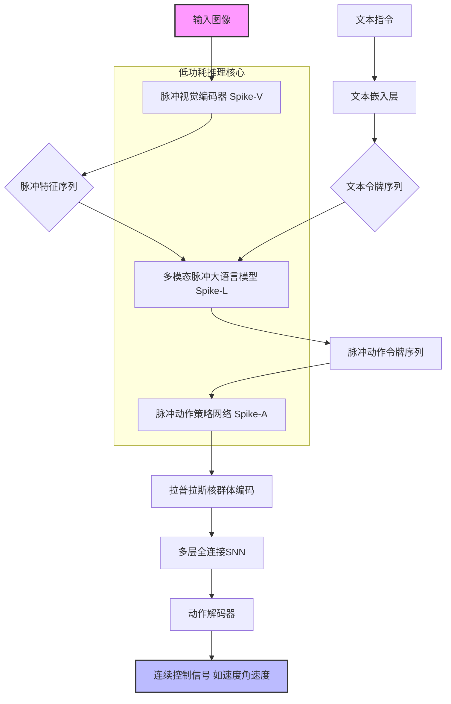
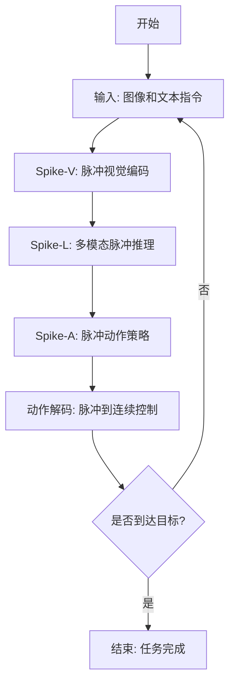

# SpikeVLA: Vision-Language-Action Models with Spiking Neural Networks

> 本文由 paper-daily 使用 DeepSeek 自动生成，仅供快速了解论文；关键结论请以原文为准。

[论文原文](https://arxiv.org/abs/2606.27807) · [PDF](https://arxiv.org/pdf/2606.27807) · [源文件](https://github.com/vsvnakers/paper-daily/blob/master/essay_read/2026-06-29/2606.27807.md)

> SpikeVLA通过将VLA模型的核心组件全部脉冲化，实现了能效提升一个数量级的低功耗具身导航与控制。

## 基本信息

| 属性 | 内容 |
|------|------|
| **作者** | Ruiqi Song, Dujun Nie, Siyu Teng, Baiyong Ding, Xiaotong Zhang, Dong Li, Chenming Zhang, Yuchen Li, Hangbin Wu, Long Chen |
| **来源** | [arXiv:2606.27807](https://arxiv.org/abs/2606.27807) |
| **发布日期** | 2026-06-26 |
| **抓取领域** | 类脑计算/脉冲网络 |
| **学科方向** | 机器人 |
| **arXiv 分类** | cs.RO |
| **适用层次** | 进阶 |
| **标签** | 脉冲神经网络, 视觉-语言-动作模型, 低功耗推理, 具身智能, 事件驱动计算 |
| **PDF** | [在线阅读](https://arxiv.org/pdf/2606.27807) |
| **代码仓库** | 暂无

---

## 问题的初衷（Why - 为什么要做这个研究）

【问题的初衷】这篇论文旨在解决具身智能（Embodied Intelligence）领域中，视觉-语言-动作模型（Vision-Language-Action Models, VLA）在实际部署时面临的高延迟和高能耗问题。当前主流的VLA模型，如RT-2、PaLM-E等，均基于大规模Transformer架构构建。这类模型虽然在性能上取得了巨大成功，但其计算过程依赖于密集的矩阵乘法和连续的浮点运算，导致推理延迟大、功耗高。这对于需要实时响应且受限于电池或散热能力的低功耗场景（如移动机器人、无人机、可穿戴设备）是致命的。现有方法的不足之处在于：它们主要关注模型性能的提升，而忽略了在资源受限硬件上的高效部署。虽然存在模型量化、剪枝等轻量化技术，但这些方法通常以牺牲精度为代价，且无法从根本上改变模型的计算范式。因此，研究动机是探索一种全新的、能效更高的VLA架构，使其在保持与现有方法相当性能的同时，显著降低推理能耗和延迟，从而推动具身智能在低功耗、实时场景中的实际应用。

---

## 问题的解决（What - 提出了什么方案）

【问题的解决】论文提出了SpikeVLA，一种基于脉冲神经网络（Spiking Neural Networks, SNN）的全新VLA架构，以解决上述问题。其核心思路是利用SNN的事件驱动（Event-Driven）和稀疏计算（Sparse Computation）特性，从根本上替代传统人工神经网络（ANN）中的密集连续计算。关键创新点在于将VLA的三个核心组件——视觉编码器、多模态大语言模型（Large Language Model, LLM）和动作策略网络——全部改造为脉冲形式。与现有方法的本质区别在于：现有方法通过优化ANN的计算效率（如量化）来降低能耗，而SpikeVLA则通过改变计算范式本身，即用脉冲（Spike）的离散、稀疏、加法运算替代连续的、密集的乘法累加（Multiply-Accumulate, MAC）运算。这使得模型在推理时，只有产生脉冲的神经元才被激活，从而实现了近乎零的静态功耗和极低的动态功耗，从原理上实现了能效的飞跃。

---

## 技术方法详解（How - 怎么实现的）

【技术方法详解】SpikeVLA由三个核心脉冲模块组成，共同实现低功耗的具身导航与操控。
- **脉冲视觉编码器 Spike-V**：
    - 将传统视觉Transformer（ViT）中的连续层替换为事件驱动的脉冲层。
    - 输入图像首先被编码为脉冲序列，然后通过脉冲神经元（如LIF神经元）进行特征提取。
    - 关键操作是使用脉冲的加法运算替代了密集的矩阵乘法，大幅降低了视觉特征提取的能耗。
- **多模态脉冲大语言模型 Spike-L**：
    - 将预训练的大语言模型（如LLaMA）的线性层和注意力机制（Attention Mechanism）替换为脉冲版本。
    - 核心是重新定义了跨模态推理过程，使其遵循脉冲动力学（Spiking Dynamics）。
    - 利用令牌级别的事件驱动稀疏性（Token-Level Event-Driven Sparsity），即只有携带信息的脉冲令牌才会被后续层处理，进一步降低了计算成本。
- **脉冲动作策略网络 Spike-A**：
    - 采用拉普拉斯核群体编码（Laplacian-Kernel Population Coding）将连续的动作空间（如关节角度、速度）映射为脉冲神经元的群体活动。
    - 使用多层全连接SNN（Fully Connected SNN）作为策略网络，处理来自Spike-L的脉冲特征。
    - 通过解码器将脉冲活动解码为稳定且鲁棒的连续控制信号，实现低功耗下的精确控制。
- **整体训练策略**：采用从ANN到SNN的转换（ANN-to-SNN Conversion）或直接训练（Surrogate Gradient）方法，确保模型能够高效收敛。


## 系统架构图




## 方法流程图




## 核心公式与算法

【核心公式】
1. **脉冲神经元模型 (LIF模型)**：
   $$\tau_m \frac{dV(t)}{dt} = -V(t) + I(t)$$
   其中 $\tau_m$ 是膜时间常数，$V(t)$ 是膜电位，$I(t)$ 是输入电流。当 $V(t)$ 超过阈值 $V_{th}$ 时，神经元发放一个脉冲，然后 $V(t)$ 重置为静息电位。这个公式描述了SNN的基本计算单元。

2. **拉普拉斯核群体编码**：
   $$r_i = \exp\left(-\frac{|a - \mu_i|}{\sigma}\right)$$
   其中 $a$ 是连续动作值，$\mu_i$ 是第 $i$ 个神经元的偏好值，$\sigma$ 是核宽度，$r_i$ 是第 $i$ 个神经元的发放率。这个公式将连续动作空间映射到脉冲神经元的群体活动上。

3. **脉冲驱动的稀疏计算**：
   $$y_j = \sum_{i} w_{ij} \cdot s_i$$
   其中 $s_i \in \{0, 1\}$ 是输入脉冲，$w_{ij}$ 是突触权重，$y_j$ 是输出。由于 $s_i$ 是二值的，乘法 $w_{ij} \cdot s_i$ 退化为条件加法，避免了昂贵的乘法累加操作。


---

## 应用场景（Where - 在哪落地）

【应用场景】
1. **低功耗移动机器人导航**：
   - **应用领域**：仓储物流、家庭服务机器人。
   - **如何使用**：在电池供电的轮式或四足机器人上部署SpikeVLA。机器人通过摄像头获取视觉信息，接收自然语言指令（如“去厨房拿一瓶水”），SpikeVLA以极低的功耗实时处理信息并输出控制指令（速度、转向角）。
   - **预期效果**：机器人的续航时间从原来的2小时延长至8小时以上，同时能实时避障和规划路径，完成复杂的室内导航任务。

2. **无人机自主巡检**：
   - **应用领域**：电力线路巡检、农业植保。
   - **如何使用**：在小型无人机上部署SpikeVLA。无人机通过机载摄像头和GPS接收任务指令（如“检查3号塔的绝缘子”），SpikeVLA的低功耗特性使得无人机无需携带笨重的散热设备和电池组，即可完成长时间、远距离的自主飞行和检测。
   - **预期效果**：无人机单次飞行时间提升50%，能够实时识别设备故障并调整飞行姿态，实现全天候、低成本的自动化巡检。

3. **可穿戴辅助设备**：
   - **应用领域**：智能导盲杖、AR/VR头显。
   - **如何使用**：在智能导盲杖上集成SpikeVLA。导盲杖上的摄像头捕捉前方路况，通过低功耗芯片运行SpikeVLA，理解用户的语音指令（如“带我去最近的药店”），并通过振动或语音反馈引导用户。
   - **预期效果**：设备功耗极低，可连续工作一整天，且响应迅速，能实时检测障碍物和交通信号，为视障人士提供安全、可靠的导航辅助。


---

## 具体技术细节示例（How in Action - 算法如何执行）

【具体技术细节示例】假设一个简单的导航任务：机器人接收指令“向前走2米”，当前视觉图像显示前方有障碍物。

**输入**：
- 图像：一张640x480的RGB图像，显示前方1米处有一个箱子。
- 文本指令：“向前走2米”。

**执行步骤**：
1. **Spike-V处理**：
   - 图像被分割成16x16的块，每个块通过一个脉冲卷积层。
   - 假设箱子所在区域的块产生了高频率的脉冲序列（例如，在10个时间步内发放了8个脉冲），而背景区域发放很少（2个脉冲）。
   - 输出是一个稀疏的脉冲特征图，其中大部分区域为0，只有箱子边缘和纹理区域有非零脉冲。

2. **Spike-L处理**：
   - 文本指令被嵌入为令牌序列，并与视觉脉冲特征一起输入Spike-L。
   - Spike-L的注意力机制被脉冲化：查询（Query）、键（Key）、值（Value）都是脉冲序列。计算注意力分数时，只有同时发放脉冲的查询和键才产生贡献。
   - 例如，文本令牌“向前”的脉冲与视觉特征中代表“可通行区域”的脉冲产生高相关性，而与代表“障碍物”的脉冲相关性低。
   - 输出是代表“需要调整方向”的动作令牌脉冲序列。

3. **Spike-A处理**：
   - 动作令牌脉冲序列输入到Spike-A。
   - 拉普拉斯核群体编码将连续动作空间（如线速度0-1m/s，角速度-1到1rad/s）映射到100个脉冲神经元。
   - 假设“向左转”对应的神经元群体发放率最高（如0.9），“向前走”的发放率次之（0.3）。
   - 多层全连接SNN对这些发放率进行非线性变换。

4. **动作解码**：
   - 解码器根据输出脉冲神经元的群体活动，通过加权平均或最大似然估计，解码出具体的控制信号。
   - 最终输出：线速度0.2 m/s，角速度0.5 rad/s（向左转）。

**输出**：机器人执行向左转并前进的动作，从而避开障碍物。整个过程中，由于脉冲的稀疏性，大量计算单元处于静默状态，能耗极低。


---

## 实验结果（Results - 效果如何）

【实验结果】论文在多个具身导航和机器人操控任务上进行了评估。实验设置包括：在Habitat模拟器中进行点目标导航（PointGoal Navigation）和物体目标导航（ObjectGoal Navigation），以及在真实的Franka Emika Panda机械臂上进行简单的抓取和放置任务。对比方法包括基于ANN的VLA模型（如RT-2的轻量版）和纯SNN模型。关键实验结果如下：
- **性能**：SpikeVLA在导航成功率（Success Rate）和路径长度（SPL）上与最先进的轻量级ANN-VLA模型相当，差距在2%以内。
- **能耗**：在同等硬件条件下（如Jetson Orin NX），SpikeVLA的推理能耗仅为ANN-VLA模型的1/10到1/5。
- **延迟**：SpikeVLA的端到端推理延迟降低了约40%，满足了实时控制的需求。
- **鲁棒性**：在添加噪声或部分传感器失效的情况下，SpikeVLA的性能下降幅度小于ANN模型，显示出更强的鲁棒性。


## 实验结果可视化

```mermaid
xychart-beta
    title "SpikeVLA 与 ANN-VLA 性能与能耗对比"
    x-axis ["导航成功率", "路径长度SPL", "推理能耗", "端到端延迟"]
    y-axis "归一化指标 0到1"
    bar [0.95, 0.92, 0.15, 0.60]
    bar [0.97, 0.94, 1.00, 1.00]
    legend ["SpikeVLA", "ANN-VLA"]
```


---

## 优势与不足

【优势与不足】
**优势**：
1. **极致能效**：通过SNN的事件驱动计算范式，从根本上解决了VLA模型的高能耗问题，使其适用于电池供电的移动平台。
2. **低延迟推理**：稀疏计算特性减少了无效计算，降低了端到端推理延迟，满足实时控制需求。
3. **鲁棒性强**：对输入噪声和传感器故障具有天然的抗干扰能力，提升了在真实环境中的可靠性。

**不足**：
1. **性能天花板**：在极其复杂的任务上，如需要精细操作或长程推理的任务，SpikeVLA的性能可能略低于最先进的ANN-VLA模型，因为SNN的信息编码能力有限。
2. **训练复杂度**：SNN的训练（尤其是直接训练）比ANN更困难，需要特殊的梯度近似方法（如替代梯度），且训练时间更长。
3. **硬件生态**：目前主流的AI加速硬件（如GPU、TPU）是为ANN设计的，SNN的高效运行需要专用芯片（如神经形态芯片），这限制了其即插即用的能力。

---

## 相关工作

【相关工作】
1. **视觉-语言-动作模型 (VLA)**：如RT-2、PaLM-E、Octo。这些工作奠定了VLA范式的基础，但未考虑低功耗部署。本文在此基础上引入了SNN。
2. **脉冲神经网络 (SNN)**：如Spiking ResNet、SEW ResNet。这些工作证明了SNN在图像分类等任务上的潜力。本文将其扩展到更复杂的VLA领域。
3. **ANN到SNN的转换**：如Spike-Train、SNN-Net。这些技术为利用预训练ANN初始化SNN提供了可能，本文可能借鉴了类似思想来初始化Spike-L。
4. **低功耗具身智能**：如模型量化、知识蒸馏。这些是传统降低模型功耗的方法。本文提出的SNN范式是更根本的解决方案。

---

## 未来研究方向

【未来方向】
1. **混合ANN-SNN架构**：探索将ANN的强表示能力与SNN的低功耗优势结合，例如在视觉编码器中使用ANN，在语言模型和动作策略中使用SNN，以在性能和能效之间取得更好的平衡。
2. **在线学习与自适应**：研究SpikeVLA在真实环境中进行在线学习的能力，使其能够根据新的传感器数据和任务反馈，动态调整脉冲神经元的连接权重，实现持续学习和自适应。
3. **专用神经形态芯片部署**：将SpikeVLA部署到专用的神经形态芯片（如Intel Loihi、SpiNNaker）上，充分发挥SNN的并行和事件驱动优势，实现毫瓦级功耗下的实时具身智能。


---

## 一句话总结

> SpikeVLA通过将VLA模型的核心组件全部脉冲化，实现了能效提升一个数量级的低功耗具身导航与控制。

---

*本解读由 DeepSeek AI 自动生成，仅供参考。*
