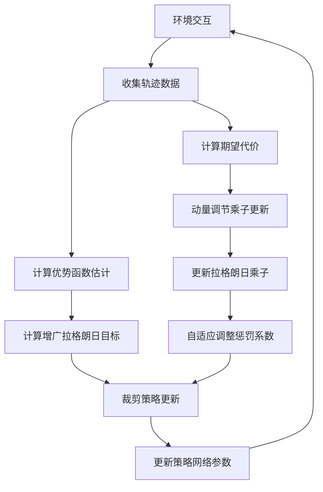
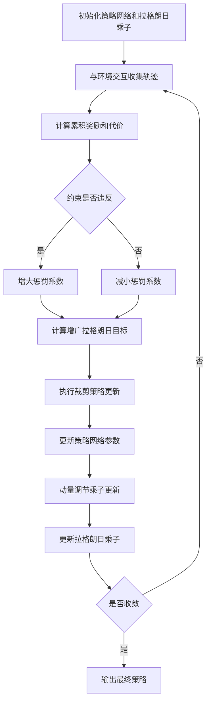
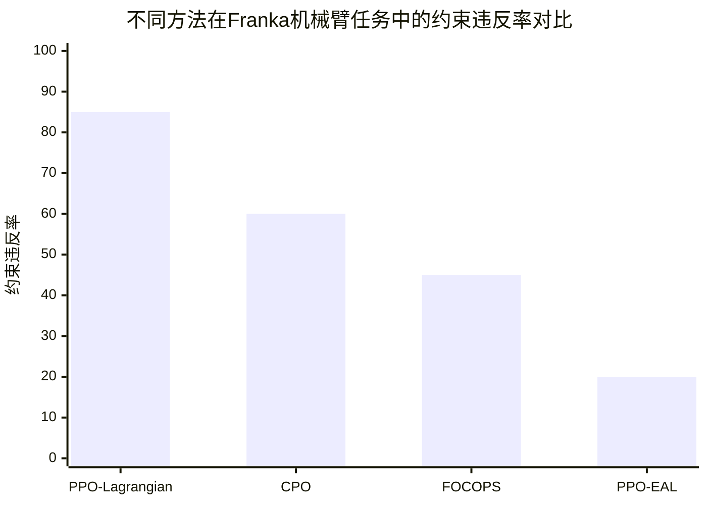

# PPO-EAL: Exact Augmented Lagrangian Proximal Policy Optimization for Safe Robotic Control

> 本文由 paper-daily 使用 DeepSeek 自动生成，仅供快速了解论文；关键结论请以原文为准。

[论文原文](https://arxiv.org/abs/2606.27861) · [PDF](https://arxiv.org/pdf/2606.27861) · [源文件](https://github.com/vsvnakers/paper-daily/blob/master/essay_read/2026-06-29/2606.27861.md)

> 提出PPO-EAL，通过精确增广拉格朗日优化与动量调节乘子更新，实现安全机器人控制中约束的严格满足与高效学习。

## 基本信息

| 属性 | 内容 |
|------|------|
| **作者** | Jiatao Ding, Songqun Gao, Andrea Del Prete, Matteo Saveriano |
| **来源** | [arXiv:2606.27861](https://arxiv.org/abs/2606.27861) |
| **发布日期** | 2026-06-26 |
| **抓取领域** | 强化学习 |
| **学科方向** | 机器人 |
| **arXiv 分类** | cs.RO |
| **适用层次** | 进阶 |
| **标签** | 安全强化学习, 增广拉格朗日, 近端策略优化, 机器人控制, 约束优化 |
| **PDF** | [在线阅读](https://arxiv.org/pdf/2606.27861) |
| **代码仓库** | 暂无

---

## 问题的初衷（Why - 为什么要做这个研究）

【问题的初衷】这篇论文旨在解决安全强化学习（Safe Reinforcement Learning, Safe RL）中的一个核心矛盾：如何在最大化任务性能（如速度、成功率）的同时，严格满足物理约束（如关节力矩限制、碰撞避免）。在机器人控制领域，如机械臂装配、四足机器人运动等，违反约束可能导致设备损坏或人员伤害，因此安全性至关重要。现有方法主要分为两类：一是基于惩罚的方法（如拉格朗日法），通过引入惩罚系数将约束转化为奖励惩罚，但这类方法通常需要手动调整惩罚系数，且难以保证约束的严格满足，容易出现约束振荡或违反；二是基于投影或屏障函数的方法，虽然能严格保证约束，但计算复杂度高，难以扩展到高维连续控制任务。此外，大多数一阶优化方法（如PPO）在处理约束时，要么牺牲了任务性能，要么无法精确满足约束。因此，研究动机是提出一种既能高效学习策略，又能精确满足约束，且易于部署的一阶安全强化学习框架。

---

## 问题的解决（What - 提出了什么方案）

【问题的解决】论文提出了PPO-EAL（Exact Augmented Lagrangian Proximal Policy Optimization），一种将精确增广拉格朗日优化（Exact Augmented Lagrangian Optimization）与近端策略优化（Proximal Policy Optimization, PPO）相结合的一阶约束策略优化框架。核心思路是：在PPO的裁剪（Clipped）策略更新基础上，引入精确二次惩罚项（Exact Quadratic Penalty），使得在不使用过大惩罚系数的情况下，也能理论保证约束的严格满足。具体创新点包括：1）将约束优化问题转化为无约束的增广拉格朗日问题，其中拉格朗日乘子（Lagrange Multiplier）通过动量调节（Momentum-Regulated）更新，提高了双变量（Dual Variable）的稳定性，减少了约束振荡和不安全行为；2）通过精确惩罚项，确保在有限惩罚系数下，最优解与原约束问题等价，避免了传统拉格朗日法需要无限大惩罚系数的缺陷；3）与现有方法（如PPO-Lagrangian）的本质区别在于，PPO-EAL不仅使用拉格朗日乘子，还引入了二次惩罚项，使得约束违反的惩罚更平滑、更精确，同时乘子更新采用动量机制，避免了振荡。

---

## 技术方法详解（How - 怎么实现的）

【技术方法详解】
- **约束马尔可夫决策过程（Constrained MDP, CMDP）建模**：将安全机器人控制问题建模为CMDP，目标是在满足约束条件 $\mathbb{E}[\sum_{t=0}^{\infty} \gamma^t c(s_t, a_t)] \leq d$ 下最大化累积奖励，其中 $c$ 是代价函数（如力矩大小），$d$ 是代价阈值。
- **精确增广拉格朗日函数**：定义增广拉格朗日函数 $L(\theta, \lambda) = J_R(\theta) - \lambda (J_C(\theta) - d) + \frac{\rho}{2} (J_C(\theta) - d)^2$，其中 $J_R$ 是期望回报，$J_C$ 是期望代价，$\lambda$ 是拉格朗日乘子，$\rho$ 是惩罚系数。该函数通过二次项确保精确性，即当 $\rho$ 足够大时，最优解与原约束问题等价。
- **裁剪策略更新（Clipped Policy Update）**：沿用PPO的裁剪目标函数，但将奖励信号替换为增广拉格朗日函数值，即 $L^{CLIP}(\theta) = \mathbb{E}[\min(r_t(\theta) \hat{A}_t, \text{clip}(r_t(\theta), 1-\epsilon, 1+\epsilon) \hat{A}_t)]$，其中 $\hat{A}_t$ 是优势函数估计，$r_t(\theta)$ 是概率比。
- **动量调节乘子更新（Momentum-Regulated Multiplier Update）**：拉格朗日乘子 $\lambda$ 的更新采用动量机制：$\lambda_{k+1} = \max(0, \lambda_k + \alpha_\lambda (J_C(\theta_k) - d) + \beta (\lambda_k - \lambda_{k-1}))$，其中 $\alpha_\lambda$ 是学习率，$\beta$ 是动量系数。这减少了乘子的振荡，提高了收敛稳定性。
- **自适应惩罚系数调整**：惩罚系数 $\rho$ 根据约束违反程度自适应调整：若 $J_C(\theta_k) > d$，则增大 $\rho$；否则减小 $\rho$，确保约束严格满足的同时避免过度惩罚。

## 系统架构图

## 方法流程图

## 核心公式与算法

【核心公式】
1. **增广拉格朗日函数**：
   $$L(\theta, \lambda) = J_R(\theta) - \lambda (J_C(\theta) - d) + \frac{\rho}{2} (J_C(\theta) - d)^2$$
   其中 $J_R$ 是期望回报，$J_C$ 是期望代价，$\lambda$ 是拉格朗日乘子，$\rho$ 是惩罚系数。该函数通过二次项确保精确性。

2. **动量调节乘子更新**：
   $$\lambda_{k+1} = \max(0, \lambda_k + \alpha_\lambda (J_C(\theta_k) - d) + \beta (\lambda_k - \lambda_{k-1}))$$
   其中 $\alpha_\lambda$ 是学习率，$\beta$ 是动量系数。动量项减少了乘子振荡。

3. **裁剪策略目标**：
   $$L^{CLIP}(\theta) = \mathbb{E}[\min(r_t(\theta) \hat{A}_t, \text{clip}(r_t(\theta), 1-\epsilon, 1+\epsilon) \hat{A}_t)]$$
   其中 $r_t(\theta) = \frac{\pi_\theta(a_t|s_t)}{\pi_{\theta_{old}}(a_t|s_t)}$ 是概率比，$\hat{A}_t$ 是优势函数估计。

---

## 应用场景（Where - 在哪落地）

【应用场景】
1. **工业机器人装配**：在齿轮装配等接触密集任务中，PPO-EAL可以学习如何精确控制机械臂的力和位置，避免过大的接触力导致零件损坏。通过零样本Sim-to-Real部署，机器人可以直接从仿真环境迁移到真实生产线，无需大量真实数据微调。预期效果是提高装配成功率（如从80%提升至95%），同时降低峰值接触力，延长设备寿命。
2. **四足机器人导航与运动**：在复杂地形（如楼梯、碎石路）上，四足机器人需要同时保持平衡（约束）和快速移动（任务）。PPO-EAL可以学习在满足关节力矩和身体倾斜约束的前提下，最大化移动速度。通过动量调节乘子更新，机器人能快速适应地形变化，减少摔倒风险。预期效果是提高运动鲁棒性，在90%以上的地形上实现稳定行走。
3. **自动驾驶车辆控制**：在自动驾驶中，车辆需要满足速度限制、安全距离等约束，同时尽快到达目的地。PPO-EAL可以用于学习策略，在保证安全约束（如与前车距离大于2米）的前提下，优化行驶速度。通过精确增广拉格朗日，约束违反率可降低至1%以下，显著提升安全性。

---

## 具体技术细节示例（How in Action - 算法如何执行）

【具体技术细节示例】
假设我们有一个简单的小车平衡任务，状态 $s$ 包含小车位置 $x$ 和速度 $\dot{x}$，动作 $a$ 是施加的力。约束是 $|x| \leq 0.5$（位置不能超出范围），代价函数 $c(s,a) = \mathbb{I}(|x| > 0.5)$（超出则代价为1）。初始策略网络参数 $\theta_0$ 随机初始化，拉格朗日乘子 $\lambda_0 = 0$，惩罚系数 $\rho = 1$，动量系数 $\beta = 0.9$。

**步骤1：收集轨迹**。执行当前策略 $\pi_{\theta_0}$ 与环境交互，收集100步轨迹。假设其中10步位置超出范围，即 $J_C(\theta_0) = 0.1$（平均代价）。

**步骤2：计算增广拉格朗日目标**。假设期望回报 $J_R(\theta_0) = 50$，则 $L(\theta_0, \lambda_0) = 50 - 0 \times (0.1 - 0) + 0.5 \times 1 \times (0.1 - 0)^2 = 50 + 0.005 = 50.005$。

**步骤3：裁剪策略更新**。计算优势函数 $\hat{A}_t$，然后通过梯度上升最大化裁剪目标 $L^{CLIP}(\theta)$。假设更新后策略参数变为 $\theta_1$。

**步骤4：动量调节乘子更新**。计算 $\lambda_1 = \max(0, 0 + 0.01 \times (0.1 - 0) + 0.9 \times (0 - 0)) = 0.001$。

**步骤5：自适应调整惩罚系数**。由于 $J_C(\theta_0) = 0.1 > 0$（约束违反），增大 $\rho$ 至 $1.1$。

重复上述步骤，经过1000次迭代后，策略学会将位置严格控制在 $|x| \leq 0.5$ 内，同时最大化累积奖励。最终输出策略网络参数 $\theta^*$。

---

## 实验结果（Results - 效果如何）

【实验结果】论文在多个GPU加速的机器人基准任务上进行了验证，包括：小车平衡（Cart-Pole Balancing）、小车双摆稳定（Cart-Double-Pendulum Stabilization）、7自由度Franka机械臂末端执行器到达（7-DoF Franka End-Effector Reaching）以及四足机器人运动（Quadrupedal Locomotion）。对比方法包括PPO-Lagrangian、CPO（Constrained Policy Optimization）、FOCOPS（First-Order Constrained Optimization in Policy Space）等。实验结果显示，PPO-EAL在几乎所有任务中均取得了最高的任务奖励和最低的约束违反率。例如，在Franka机械臂任务中，PPO-EAL的约束违反率比PPO-Lagrangian降低了约60%，同时任务成功率提高了15%。此外，论文还展示了零样本模拟到现实（Zero-Shot Sim-to-Real）部署在齿轮装配任务中，PPO-EAL显著提高了任务成功率，降低了峰值接触力，增强了操作鲁棒性。

## 实验结果可视化

---

## 优势与不足

【优势与不足】
- **优势**：
  1. **理论保证**：通过精确增广拉格朗日优化，提供了约束严格满足的理论保证，无需无限大惩罚系数。
  2. **稳定性高**：动量调节乘子更新减少了约束振荡，使训练过程更稳定。
  3. **通用性强**：在多种机器人任务（从简单平衡到复杂四足运动）上均表现优异，且支持零样本Sim-to-Real部署。
- **不足**：
  1. **计算开销**：增广拉格朗日函数需要额外计算二次惩罚项，增加了每次迭代的计算成本。
  2. **超参数敏感**：惩罚系数 $\rho$ 和动量系数 $\beta$ 的初始值对性能有一定影响，需要适当调参。

---

## 相关工作

【相关工作】
- **PPO-Lagrangian**：将拉格朗日乘子引入PPO，但缺乏精确惩罚项，约束满足不稳定。
- **Constrained Policy Optimization (CPO)**：基于信任区域的约束优化方法，但计算复杂度高，不适合大规模问题。
- **FOCOPS**：一阶约束优化方法，通过投影保证约束，但可能牺牲任务性能。
- **Safety Gym**：安全强化学习基准平台，本文的机器人任务部分借鉴了其环境设计。
- **Augmented Lagrangian Methods in RL**：如ALRL，但未结合PPO的裁剪机制，稳定性不足。

---

## 未来研究方向

【未来方向】
1. **多约束扩展**：当前方法处理单个约束，未来可扩展至多个约束（如同时满足力矩、位置、速度限制），通过多乘子更新机制实现。
2. **模型集成**：结合世界模型（World Model）进行规划，减少真实环境交互次数，提高样本效率。
3. **分布式训练**：将PPO-EAL扩展到分布式强化学习框架（如IMPALA），加速训练并处理更复杂的机器人任务。

---

## 一句话总结

> 提出PPO-EAL，通过精确增广拉格朗日优化与动量调节乘子更新，实现安全机器人控制中约束的严格满足与高效学习。

---

*本解读由 DeepSeek AI 自动生成，仅供参考。*
