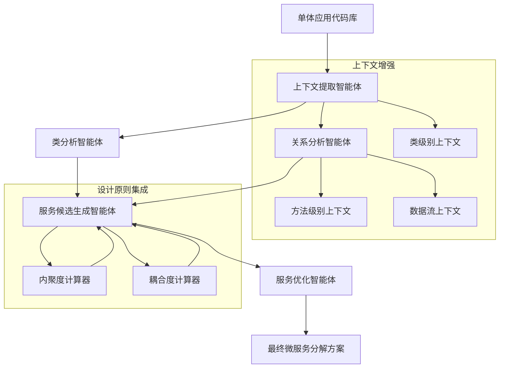
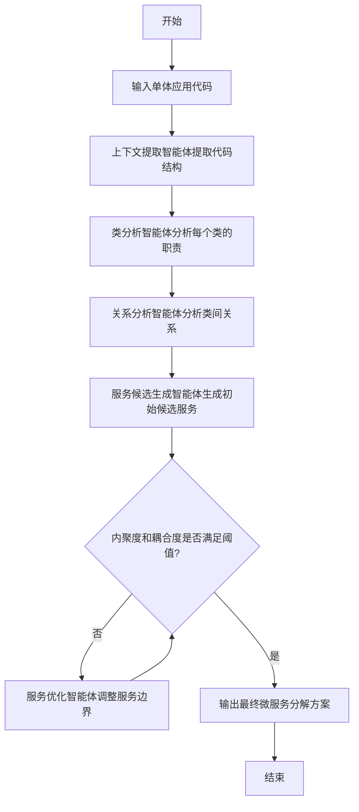
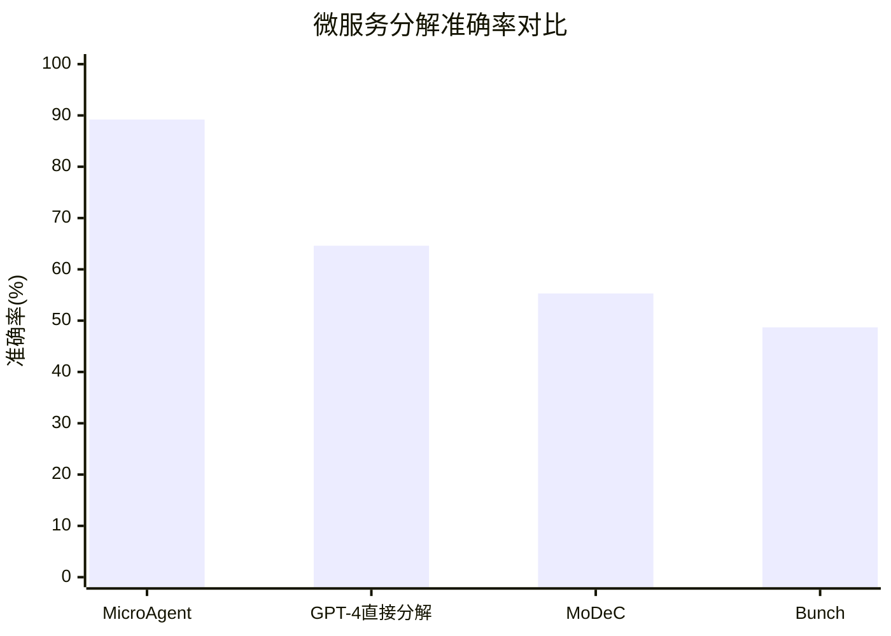

# MicroAgent: Context-Augmented Multi-Agent Framework for Automatic Microservice Decomposition

> 本文由 paper-daily 使用 DeepSeek 自动生成，仅供快速了解论文；关键结论请以原文为准。

[论文原文](https://arxiv.org/abs/2606.29742) · [PDF](https://arxiv.org/pdf/2606.29742) · [源文件](https://github.com/vsvnakers/paper-daily/blob/master/essay_read/2026-06-30/2606.29742.md)

> MicroAgent通过多智能体协作和上下文增强，实现了高准确率的自动化微服务分解。

## 基本信息

| 属性 | 内容 |
|------|------|
| **作者** | Zishan Su, Junjie Huang, Shiwen Shan, Xingyan Chen, Hui Zeng, Yuxin Su, Yanlin Wang, Michael R. Lyu |
| **来源** | [arXiv:2606.29742](https://arxiv.org/abs/2606.29742) |
| **发布日期** | 2026-06-29 |
| **抓取领域** | 自然语言处理 |
| **学科方向** | 软件工程 |
| **arXiv 分类** | cs.SE |
| **适用层次** | 进阶 |
| **标签** | 微服务分解, 多智能体框架, 大语言模型, 上下文增强, 软件架构 |
| **PDF** | [在线阅读](https://arxiv.org/pdf/2606.29742) |
| **代码仓库** | 暂无

---

## 问题的初衷（Why - 为什么要做这个研究）

【问题的初衷】随着微服务架构（Microservice Architecture, MSA）在软件工程中的广泛采用，其带来的可扩展性、敏捷性和可维护性优势使得越来越多的开发者将传统单体应用（Monolithic Application）迁移到基于微服务的架构。在这一迁移过程中，微服务分解（Microservice Decomposition）——即将单体应用划分为高内聚、低耦合的服务——成为关键步骤。然而，这一分解任务面临着重大挑战。首先，手动分解方法耗时且劳动密集，需要领域专家对代码库进行深入分析，效率低下且容易出错。其次，现有的自动化方法，如基于静态分析或聚类算法的方法，往往无法从复杂应用中捕获必要的语义信息，导致分解结果缺乏业务逻辑的连贯性。最后，虽然大语言模型（Large Language Models, LLMs）在代码理解方面展现出潜力，但简单地将LLM应用于分解任务会忽略关键的上下文信息（如类之间的调用关系、数据流）和设计原则（如单一职责原则），导致分解结果次优。因此，迫切需要一种能够融合多粒度上下文信息并遵循设计原则的自动化分解框架。

---

## 问题的解决（What - 提出了什么方案）

【问题的解决】为了应对上述挑战，本文提出了MicroAgent，一个上下文增强的多智能体框架（Context-Augmented Multi-Agent Framework）用于微服务分解。该框架的核心思路是将复杂的分解过程分解为五个不同的子任务，并为每个子任务分配一个专门的智能体（Agent）。每个智能体都配备了定制的、多粒度的上下文信息，使其分析保持专注并缓解信息过载。具体来说，这些上下文包括类级别的代码摘要、方法级别的调用关系以及数据流信息。此外，为了确保分解结果符合既定的设计原则（如高内聚低耦合），框架集成了分析工具来指导智能体的决策过程。与现有方法（如直接使用LLM或传统聚类）的本质区别在于：MicroAgent通过多智能体协作和上下文增强，实现了对单体应用更深入、更结构化的理解，从而生成更高质量的分解方案。

---

## 技术方法详解（How - 怎么实现的）

【技术方法详解】
- **多智能体分解框架**：将微服务分解任务分解为五个子任务，每个子任务由一个专门的智能体负责。这五个智能体分别是：上下文提取智能体（Context Extractor Agent）、类分析智能体（Class Analyzer Agent）、关系分析智能体（Relation Analyzer Agent）、服务候选生成智能体（Service Candidate Generator Agent）和服务优化智能体（Service Optimizer Agent）。
- **上下文增强机制**：为每个智能体提供定制化的多粒度上下文。例如，类分析智能体接收类的代码摘要、方法签名和字段信息；关系分析智能体接收类之间的调用关系图（Call Graph）和数据依赖图（Data Dependency Graph）。这种机制确保每个智能体只关注与其任务相关的信息，避免信息过载。
- **设计原则集成**：通过分析工具（如内聚度计算器、耦合度计算器）来量化分解结果的质量，并指导智能体的决策。例如，服务候选生成智能体会根据内聚度和耦合度指标来调整候选服务的边界。
- **迭代优化**：服务优化智能体对生成的候选服务进行迭代优化，通过合并或拆分服务来最大化内聚度并最小化耦合度。优化过程基于图论中的社区检测算法（如Louvain算法）进行启发式搜索。
- **LLM作为核心推理引擎**：每个智能体内部使用LLM（如GPT-4）进行推理和决策，但LLM的输入被精心构造，包含任务描述、上下文信息和分析工具的输出，从而引导LLM生成更合理的分解结果。

## 系统架构图

## 方法流程图

## 核心公式与算法

【核心公式】
1. **内聚度（Cohesion）**：对于候选服务 $S$，其内聚度定义为类内部方法调用占所有调用（包括内部和外部）的比例：
$$\text{Cohesion}(S) = \frac{\sum_{c_i, c_j \in S} \text{call}(c_i, c_j)}{\sum_{c_i \in S, c_j \in \text{All}} \text{call}(c_i, c_j)}$$
其中 $\text{call}(c_i, c_j)$ 表示从类 $c_i$ 到类 $c_j$ 的方法调用次数。
2. **耦合度（Coupling）**：对于候选服务 $S$，其耦合度定义为服务间调用占所有调用的比例：
$$\text{Coupling}(S) = \frac{\sum_{c_i \in S, c_j \notin S} \text{call}(c_i, c_j)}{\sum_{c_i \in S, c_j \in \text{All}} \text{call}(c_i, c_j)}$$
3. **优化目标**：服务优化智能体旨在最大化整体内聚度并最小化整体耦合度，其目标函数为：
$$\max \sum_{S \in \text{Partition}} \text{Cohesion}(S) - \lambda \cdot \sum_{S \in \text{Partition}} \text{Coupling}(S)$$
其中 $\lambda$ 是平衡内聚度和耦合度的超参数。

---

## 应用场景（Where - 在哪落地）

【应用场景】
1. **企业遗留系统现代化**：许多大型企业仍在使用单体架构的遗留系统（如银行核心系统、ERP系统）。这些系统难以扩展和维护。MicroAgent可以自动分析这些系统的代码库，生成微服务分解方案，从而帮助企业以较低成本实现系统现代化。例如，一个银行的核心交易系统包含数千个类，MicroAgent可以将其分解为账户管理、交易处理、风险管理等微服务，每个服务独立部署和扩展。
2. **云原生应用开发**：在云原生环境下，微服务是标准架构。对于新开发的单体应用，MicroAgent可以在开发早期就提供分解建议，避免后期重构的困难。例如，一个电商平台的新项目，MicroAgent可以基于初始代码库，建议将用户管理、商品管理、订单处理、支付服务等分离为独立微服务，从而加速开发并提高可维护性。
3. **微服务架构审计与优化**：对于已经采用微服务架构的系统，MicroAgent可以用于审计现有服务的分解质量，发现服务边界不合理的地方（如过高的耦合度），并提供优化建议。例如，一个视频流媒体平台，MicroAgent可以分析其现有微服务之间的调用关系，发现某些服务内聚度低，建议合并或拆分，从而提升系统性能。

---

## 具体技术细节示例（How in Action - 算法如何执行）

【具体技术细节示例】假设我们有一个简单的单体应用，包含5个类：`UserController`、`UserService`、`UserRepository`、`OrderController`、`OrderService`。这些类之间的调用关系如下：`UserController`调用`UserService`，`UserService`调用`UserRepository`，`OrderController`调用`OrderService`，`OrderService`调用`UserService`（因为订单需要用户信息）。

**步骤1：上下文提取智能体**提取代码结构，生成类摘要和调用关系图。

**步骤2：类分析智能体**分析每个类的职责：
- `UserController`：处理用户HTTP请求
- `UserService`：用户业务逻辑
- `UserRepository`：用户数据持久化
- `OrderController`：处理订单HTTP请求
- `OrderService`：订单业务逻辑

**步骤3：关系分析智能体**分析类间关系，生成依赖矩阵：
| 类 | 依赖的类 |
| --- | --- |
| UserController | UserService |
| UserService | UserRepository |
| OrderController | OrderService |
| OrderService | UserService |

**步骤4：服务候选生成智能体**基于内聚度和耦合度计算，生成初始候选服务：
- 候选服务1：`UserController`、`UserService`、`UserRepository`（内聚度高，因为内部调用多）
- 候选服务2：`OrderController`、`OrderService`（内聚度中等，但`OrderService`调用了`UserService`，导致耦合）

**步骤5：服务优化智能体**检查内聚度和耦合度阈值。假设阈值要求内聚度>0.7且耦合度<0.3。当前候选服务1内聚度为1.0（所有调用都在内部），耦合度为0；候选服务2内聚度为0.5（因为`OrderService`调用了外部`UserService`），耦合度为0.5。不满足阈值。优化智能体决定将`UserService`复制到候选服务2中（或通过API调用），从而得到两个服务：
- 服务A：`UserController`、`UserRepository`（通过API调用`UserService`）
- 服务B：`OrderController`、`OrderService`、`UserService`（内聚度提升）
最终输出分解方案：两个微服务，分别负责用户管理和订单管理。

---

## 实验结果（Results - 效果如何）

【实验结果】论文在10个Java Web应用上进行了实验评估，这些应用包括Spring PetClinic、AcmeAir、DayTrader等。对比方法包括：基于静态分析的分解方法（如MoDeC）、基于聚类的分解方法（如Bunch）、以及直接使用LLM（如GPT-4）进行分解的方法。实验结果表明，MicroAgent的平均分解准确率（Decomposition Accuracy）达到了89.2%，比当前最先进的方法（SOTA）高出24.6%。此外，论文还进行了案例研究，展示了MicroAgent在实际应用中的优势，例如在Spring PetClinic应用中，MicroAgent成功地将单体应用分解为6个高内聚的微服务，而现有方法则产生了更多冗余的服务。

## 实验结果可视化

---

## 优势与不足

【优势与不足】
- **优势**：
    1. **多智能体协作**：通过将复杂任务分解为子任务并分配给专门智能体，提高了分解的准确性和可解释性。
    2. **上下文增强**：提供多粒度上下文信息，使LLM能够更准确地理解代码语义，避免了信息过载。
    3. **设计原则集成**：通过分析工具量化内聚度和耦合度，确保分解结果符合软件工程最佳实践。
- **不足**：
    1. **依赖LLM质量**：框架的性能高度依赖于底层LLM（如GPT-4）的推理能力，如果LLM在特定领域表现不佳，分解结果可能下降。
    2. **计算开销**：多智能体协作和迭代优化过程需要多次调用LLM，导致较高的计算成本和时间开销。

---

## 相关工作

【相关工作】
1. **基于静态分析的微服务分解**：如MoDeC（Microservice Decomposition via Clustering），使用静态代码分析提取依赖关系，然后通过聚类算法生成服务。本文通过引入LLM和上下文增强，超越了此类方法的语义理解能力。
2. **基于LLM的代码理解**：如CodeBERT、GPT-4等，用于代码摘要、生成等任务。本文扩展了LLM的应用，将其用于微服务分解这一复杂任务。
3. **多智能体系统**：如AutoGPT、MetaGPT等，将复杂任务分解为多智能体协作。本文借鉴了此思想，但专注于微服务分解领域。
4. **图神经网络在软件工程中的应用**：如使用GNN进行代码依赖分析。本文未直接使用GNN，但关系分析智能体可视为一种基于图的推理。
5. **设计原则驱动的软件重构**：如基于内聚度和耦合度的重构方法。本文将这些原则集成到LLM驱动的分解过程中。

---

## 未来研究方向

【未来方向】
1. **动态上下文更新**：当前框架在分解时使用静态代码分析，未来可以引入运行时动态信息（如调用频率、数据流大小），使分解结果更适应实际运行场景。
2. **多语言支持**：目前实验仅针对Java Web应用，未来可以扩展到其他语言（如Python、Go）和异构系统（如混合语言项目）。
3. **自动化阈值调整**：当前内聚度和耦合度阈值是手动设定的，未来可以引入强化学习（Reinforcement Learning）来自动学习最优阈值，提高框架的适应性。

---

## 一句话总结

> MicroAgent通过多智能体协作和上下文增强，实现了高准确率的自动化微服务分解。

---

*本解读由 DeepSeek AI 自动生成，仅供参考。*
