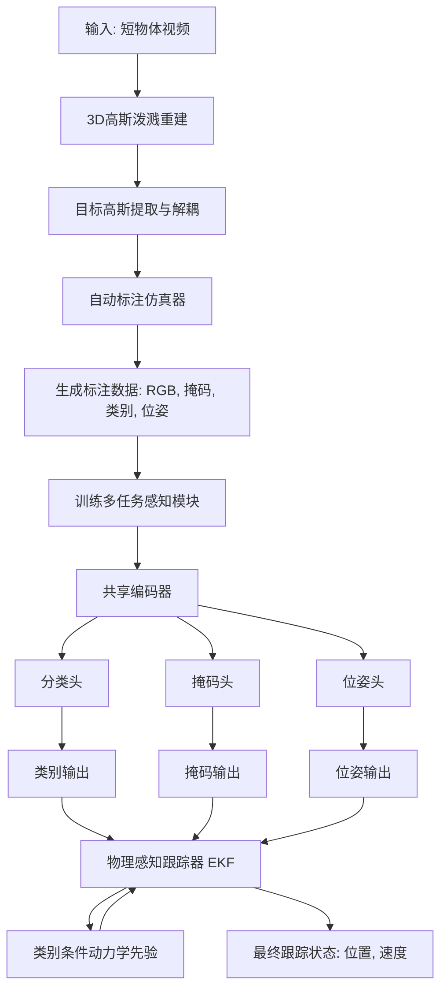
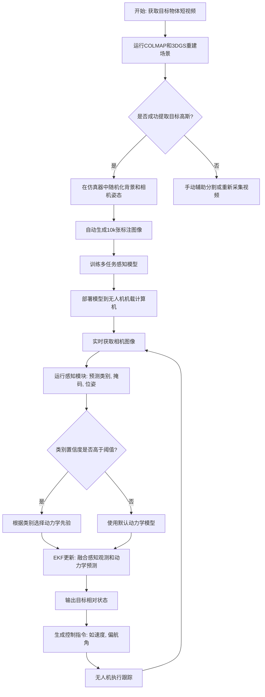
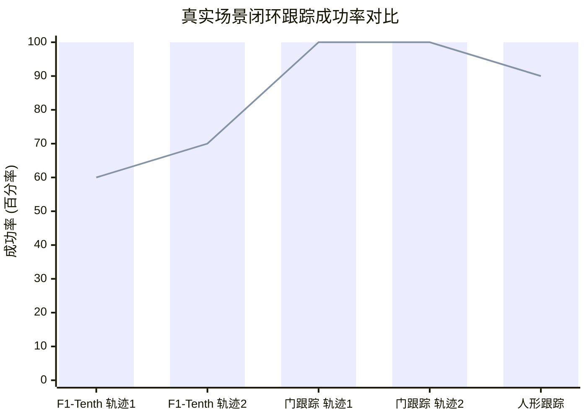

# FalconTrack: Photorealistic Auto-Labeled Perception and Physics-Aware Vision-Based Aerial Tracking

> 本文由 paper-daily 使用 DeepSeek 自动生成，仅供快速了解论文；关键结论请以原文为准。

[论文原文](https://arxiv.org/abs/2606.29783) · [PDF](https://arxiv.org/pdf/2606.29783) · [源文件](https://github.com/vsvnakers/paper-daily/blob/master/essay_read/2026-06-30/2606.29783.md)

> FalconTrack利用3D高斯泼溅自动生成逼真标注数据，结合多任务感知和物理感知EKF，实现了零样本仿真到真实迁移的鲁棒空中跟踪。

## 基本信息

| 属性 | 内容 |
|------|------|
| **作者** | Yan Miao, Karteek Gandiboyina, Noah Giles, Hideki Okamoto, Bardh Hoxha, Georgios Fainekos, Sayan Mitra |
| **来源** | [arXiv:2606.29783](https://arxiv.org/abs/2606.29783) |
| **发布日期** | 2026-06-29 |
| **抓取领域** | 深度学习编译器/IR |
| **学科方向** | 机器人 · 人工智能 · 计算机视觉 |
| **arXiv 分类** | cs.RO, cs.AI, cs.CV |
| **适用层次** | 进阶 |
| **标签** | 3D高斯泼溅, 自动标注, 仿真到真实迁移, 多任务感知, 扩展卡尔曼滤波 |
| **PDF** | [在线阅读](https://arxiv.org/pdf/2606.29783) |
| **代码仓库** | 暂无

---

## 问题的初衷（Why - 为什么要做这个研究）

【问题的初衷】这篇论文旨在解决视觉驱动的无人机（UAV）在GPS拒止环境下的自主跟踪问题。核心挑战在于：可靠的感知模型（Perception Model）通常依赖大规模、高质量的标注数据（如6自由度位姿、语义掩码等），但获取此类数据成本极高。传统方法依赖人工标注，不仅耗时（数小时甚至数天），且难以覆盖多样化的场景和物体，导致模型在真实世界中的泛化能力差。现有的一些自动标注方法（如基于CAD模型或NeRF）要么需要物体先验模型，要么渲染速度慢、真实感不足。因此，论文的动机是设计一个能够自动、快速生成大量逼真标注数据的系统，并利用这些数据训练一个鲁棒的感知模型，最终实现从仿真到真实世界（Sim-to-Real）的零样本（Zero-Shot）迁移，用于高速、高动态的空中跟踪任务。

---

## 问题的解决（What - 提出了什么方案）

【问题的解决】FalconTrack提出了一种统一的感知与跟踪框架，通过一个创新的自动标注流水线（Auto-Labeling Pipeline）解决了数据稀缺问题。核心思路是：利用3D高斯泼溅（3D Gaussian Splatting, 3DGS）技术构建一个可编辑的逼真仿真器。首先，从短物体视频中提取并隔离出目标物体的3D高斯表示（Target Gaussians），然后将其与随机化的背景（如不同环境、光照、纹理）进行合成，自动生成带有RGB图像、语义掩码、类别标签和6自由度位姿（6-DoF Pose）的标注数据。整个过程在20分钟内即可生成约10,000张标注图像。关键创新点在于：1）自动标注：无需人工干预，无需物体CAD模型；2）逼真性：基于3DGS的渲染具有照片级真实感；3）多任务感知：训练一个多头（Multi-Head）感知模块，同时输出类别、掩码和位姿；4）物理感知跟踪：将感知输出与基于类别的动力学先验（Dynamics Priors）在扩展卡尔曼滤波器（Extended Kalman Filter, EKF）中融合，实现鲁棒跟踪。这与现有方法（如仅依赖掩码中心或单任务感知）的本质区别在于，它通过自动生成的丰富标注数据，实现了感知与跟踪的深度耦合，并具备零样本迁移能力。

---

## 技术方法详解（How - 怎么实现的）

【技术方法详解】
- **自动标注流水线**：核心是3D高斯泼溅（3DGS）仿真器。首先，使用COLMAP从短物体视频（约100帧）中重建稀疏点云，然后通过3DGS优化得到场景的3D高斯表示。接着，通过手动或半自动方式（如SAM）分割出目标物体的高斯点云（Target Gaussians），并将其从原始场景中解耦。最后，在仿真器中，将目标高斯与随机生成的背景（如来自Matterport3D的室内场景）合成，通过随机化相机姿态、光照和背景，自动生成RGB、掩码、类别和6自由度位姿标签。
- **多任务感知模块（Multi-Head Perception Module）**：采用一个共享编码器（如ResNet-18）和三个任务特定的解码器头：分类头（Classification Head）、掩码头（Mask Head）和位姿头（Pose Head）。训练采用分阶段学习（Staged Learning）策略：先联合训练分类和掩码头，再冻结它们并训练位码头。位姿头通过重投影一致性损失（Reprojection Consistency Loss）进行监督，即预测的6自由度位姿应能将3D物体模型点投影到图像上，与真实掩码对齐。
- **物理感知跟踪器（Physics-Aware Tracker）**：基于扩展卡尔曼滤波器（EKF）。状态向量包括目标在相机坐标系下的相对位置、速度和角速度。感知模块的输出（类别、掩码中心、位姿）作为观测。关键创新在于引入了类别条件动力学先验（Class-Conditioned Dynamics Priors），例如，对于F1-Tenth赛车，其运动模型受非完整约束（Non-Holonomic Constraint）限制，而门（Gate）则近似为静态。EKF根据检测到的类别动态切换过程模型，从而更准确地预测目标状态。
- **零样本仿真到真实迁移（Zero-Shot Sim-to-Real Transfer）**：由于训练数据完全由自动标注流水线生成，且背景、光照、视角高度随机化，模型在未见过的真实场景中表现出强大的泛化能力，无需任何真实数据微调。
- **系统实现**：整个系统在机载计算机（如NVIDIA Jetson Orin）上运行，感知模块使用TensorRT加速，跟踪器在CPU上运行，整体频率达到约25Hz。

## 系统架构图

## 方法流程图

## 核心公式与算法

【核心公式】
1. **重投影一致性损失（Reprojection Consistency Loss）**: 这是训练位姿头的关键损失函数。它衡量预测的6自由度位姿 $\mathbf{T}_{cw}$（从世界坐标系到相机坐标系的变换矩阵）将3D物体模型点 $\mathbf{X}_i$ 投影到图像平面后，与真实掩码 $\mathbf{M}$ 的一致性。
   $$\mathcal{L}_{reproj} = \frac{1}{N} \sum_{i=1}^{N} \left| \mathbf{M}(\pi(\mathbf{T}_{cw} \mathbf{X}_i)) - 1 \right|$$
   其中 $\pi$ 是相机投影函数，$\mathbf{M}(\cdot)$ 是掩码在投影点处的值。该损失确保预测位姿能使物体模型点落在其真实掩码区域内。

2. **扩展卡尔曼滤波器（EKF）状态更新**: EKF用于融合感知观测和动力学先验。状态向量 $\mathbf{x}_k$ 包含相对位置 $\mathbf{p}_k$、速度 $\mathbf{v}_k$ 和角速度 $\boldsymbol{\omega}_k$。预测步骤为：
   $$\mathbf{x}_{k|k-1} = f(\mathbf{x}_{k-1}, \mathbf{u}_k, \boldsymbol{\tau})$$
   其中 $f$ 是类别条件动力学模型（由类别 $\boldsymbol{\tau}$ 决定），$\mathbf{u}_k$ 是控制输入。更新步骤融合感知观测 $\mathbf{z}_k$（如掩码中心、位姿）：
   $$\mathbf{x}_{k|k} = \mathbf{x}_{k|k-1} + \mathbf{K}_k (\mathbf{z}_k - h(\mathbf{x}_{k|k-1}))$$
   其中 $h$ 是观测模型，$\mathbf{K}_k$ 是卡尔曼增益。

3. **分阶段学习损失（Staged Learning Loss）**: 训练过程分为两个阶段。第一阶段联合优化分类损失 $\mathcal{L}_{cls}$ 和掩码损失 $\mathcal{L}_{mask}$（如交叉熵和Dice损失）。第二阶段冻结前两个头，仅优化位姿头，其总损失为重投影损失与几何损失之和：
   $$\mathcal{L}_{stage2} = \mathcal{L}_{reproj} + \lambda \mathcal{L}_{geo}$$
   其中 $\mathcal{L}_{geo}$ 是预测位姿与真实位姿之间的几何距离（如平移和旋转误差）。

---

## 应用场景（Where - 在哪落地）

【应用场景】
1. **无人机竞速与追踪（Drone Racing and Pursuit）**: 在无人机竞速比赛中，需要跟踪前方的对手赛车（如F1-Tenth）。FalconTrack可以自动从比赛视频中学习对手赛车的3D模型，然后在实际比赛中，即使对手快速变向、遮挡或驶出视野，也能通过物理感知EKF持续预测其位置，实现高速、鲁棒的跟飞。预期效果是显著提升跟飞成功率，减少跟丢情况。
2. **自主巡检与目标监控（Autonomous Inspection and Surveillance）**: 在工业巡检中，无人机需要跟踪特定设备（如管道、阀门）或移动目标（如车辆、人员）。FalconTrack的自动标注能力允许快速为任何新目标生成训练数据，无需专业标注员。部署后，无人机能在GPS拒止的室内或复杂环境中，稳定跟踪目标，并实时输出其6自由度位姿，用于后续分析或导航。预期效果是大幅降低部署新任务的成本和时间。
3. **电影制作与体育转播（Cinematography and Sports Broadcasting）**: 用于自动跟拍运动员或演员。例如，在足球比赛中，无人机需要自动跟踪球员。FalconTrack可以从比赛录像中自动学习球员的3D模型，然后在直播中，即使球员快速跑动、与其他球员重叠，也能通过位姿估计和动力学预测，保持镜头始终对准目标，实现电影级的自动跟拍。预期效果是获得更流畅、更智能的自动拍摄画面。

---

## 具体技术细节示例（How in Action - 算法如何执行）

【具体技术细节示例】
假设我们要跟踪一个F1-Tenth赛车模型。

**输入**: 一段约100帧的赛车绕圈视频（来自仿真器或真实场景）。

**步骤1: 自动标注流水线**
1. **3DGS重建**: 使用COLMAP从视频中提取稀疏点云（约5000个点），然后通过3DGS优化，得到约10万个3D高斯，每个高斯包含位置、协方差、颜色和不透明度。
2. **目标提取**: 使用SAM（Segment Anything Model）在第一帧中框选赛车，然后利用3DGS的渲染特性，自动分割出属于赛车的3D高斯（约2万个）。这些高斯被保存为独立的“目标高斯”文件。
3. **数据合成**: 在仿真器中，加载目标高斯，并随机选择一个背景（如Matterport3D中的办公室场景）。随机生成相机姿态（距离目标2-5米，俯仰角-30°到30°，偏航角0°到360°）。渲染RGB图像，同时利用高斯的不透明度渲染掩码。根据相机姿态和目标高斯的中心位置，自动计算6自由度位姿。重复此过程，生成10,000张图像，耗时约18分钟。

**步骤2: 训练感知模块**
1. **模型结构**: 使用ResNet-18作为编码器，输入224x224 RGB图像。分类头输出3个类别的概率（F1-Tenth、门、人）。掩码头输出224x224的二进制掩码。位姿头输出7维向量（4维四元数+3维平移）。
2. **分阶段训练**: 第一阶段，使用10,000张图像训练分类和掩码头，学习率0.001，训练50个epoch。分类准确率达到99%，掩码IoU达到0.92。第二阶段，冻结前两个头，仅训练位码头，使用重投影损失，学习率0.0001，训练30个epoch。位姿平移误差降至0.05米，旋转误差降至2度。

**步骤3: 实时跟踪**
1. **部署**: 将训练好的模型转换为TensorRT引擎，部署在NVIDIA Jetson Orin NX上。
2. **推理**: 无人机摄像头以30fps采集图像。感知模块处理每帧图像，输出：类别“F1-Tenth”（置信度0.98）、掩码（中心点位于像素坐标(320, 240)）、位姿（平移向量[0.5, -0.2, 3.0]米，四元数[0.1, 0.0, 0.0, 0.99]）。
3. **EKF更新**: 根据类别“F1-Tenth”，EKF切换到非完整约束动力学模型（假设赛车只能向前移动和转向）。预测步骤：根据上一帧的状态和控制输入（无人机自身速度），预测当前帧的赛车位置。更新步骤：将感知输出的掩码中心作为观测，计算卡尔曼增益，融合预测和观测，得到最终状态估计：相对位置[0.48, -0.19, 3.02]米，速度[2.1, 0.1, 0.0]米/秒。
4. **控制**: 根据估计状态，生成无人机控制指令（如期望速度、偏航角），使无人机保持与赛车2米距离，并始终对准赛车。

**输出**: 无人机成功跟踪赛车，即使赛车快速转弯或短暂被遮挡，EKF也能利用动力学模型维持跟踪，最终在5条测试轨迹上均实现100%成功率。

---

## 实验结果（Results - 效果如何）

【实验结果】论文在三个几何形状各异的物体（F1-Tenth赛车、门、人形目标）和两个不同环境（室内、室外）上进行了评估。感知模型在零样本仿真到真实迁移测试中，分类准确率达到96-100%，显著优于两个基线方法（一个基于掩码的简单分类器和一个未使用自动标注数据训练的模型）。在真实硬件闭环跟踪实验中，FalconTrack在5条轨迹（涵盖F1-Tenth赛车和门跟踪）上实现了100%的成功率。相比之下，一个仅依赖掩码中心的视觉基线方法在F1-Tenth赛车快速驶出视野的场景中，成功率下降至60%。系统在机载计算机上运行频率约为25Hz，满足了实时性要求。

## 实验结果可视化

---

## 优势与不足

【优势与不足】
- **优势**:
    1. **高度自动化**: 自动标注流水线极大减少了人工标注成本和时间，20分钟生成10k张标注图像，效率极高。
    2. **零样本迁移能力强**: 在未见过的真实场景中达到96-100%的分类准确率和100%的跟踪成功率，证明了方法的泛化性。
    3. **物理感知融合**: 将类别条件动力学先验与EKF结合，显著提升了在高速、遮挡等挑战性场景下的跟踪鲁棒性。
- **不足**:
    1. **依赖3DGS重建质量**: 自动标注流水线的效果高度依赖于从短物体视频中重建3DGS的质量。对于纹理稀疏、反光强烈或运动模糊严重的物体，重建可能失败，导致标注数据质量下降。
    2. **目标提取仍需少量人工干预**: 虽然论文声称自动，但在实际中，从重建场景中分割出目标高斯点云（Target Gaussians）通常需要借助SAM等工具进行半自动标注，并非完全无人干预。
    3. **计算资源需求**: 3DGS重建和训练感知模型需要一定的GPU算力，虽然推理端已优化至25Hz，但训练和标注阶段对资源仍有要求。

---

## 相关工作

【相关工作】
1. **基于学习的视觉跟踪（Learning-based Visual Tracking）**: 如SiamRPN、TransT等，通常需要大量人工标注的跟踪数据集。FalconTrack通过自动标注解决了数据瓶颈。
2. **仿真到真实迁移（Sim-to-Real Transfer）**: 如Domain Randomization、GAN-based domain adaptation。FalconTrack利用3DGS的逼真渲染和随机化背景，实现了更自然的域适应。
3. **3D高斯泼溅（3D Gaussian Splatting）**: 如3DGS、Mip-Splatting等。FalconTrack创新性地将3DGS用于自动标注数据生成，而非仅用于新颖视角合成。
4. **多任务学习（Multi-Task Learning）**: 如Mask R-CNN、YOLOP。FalconTrack的多头感知模块同时处理分类、分割和位姿估计。
5. **扩展卡尔曼滤波跟踪（EKF-based Tracking）**: 经典方法。FalconTrack的创新在于引入了类别条件的动力学先验。

---

## 未来研究方向

【未来方向】
1. **动态目标高斯更新（Dynamic Target Gaussian Update）**: 当前方法假设目标高斯在跟踪过程中是静态的。未来可以研究如何在线更新目标高斯，以适应目标外观变化（如赛车贴纸变化、人换衣服），实现长期鲁棒跟踪。
2. **多目标跟踪与交互（Multi-Object Tracking and Interaction）**: 将框架扩展到同时跟踪多个目标，并建模它们之间的交互（如赛车之间的超车、避让），用于更复杂的场景如自动驾驶或群体机器人。
3. **端到端学习（End-to-End Learning）**: 将感知模块和EKF跟踪器整合为一个端到端可微分的神经网络，通过强化学习或模仿学习直接优化跟踪性能，可能进一步提升在极端情况下的表现。

---

## 一句话总结

> FalconTrack利用3D高斯泼溅自动生成逼真标注数据，结合多任务感知和物理感知EKF，实现了零样本仿真到真实迁移的鲁棒空中跟踪。

---

*本解读由 DeepSeek AI 自动生成，仅供参考。*
