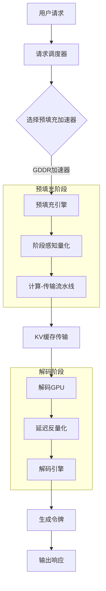
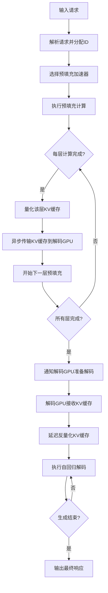
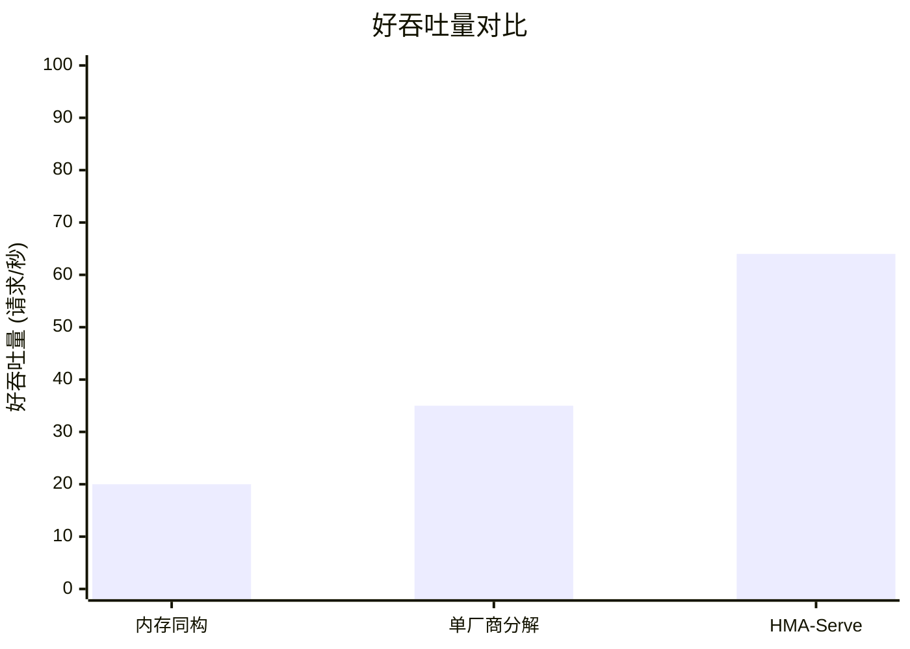

# HBM Is Not All You Need: Efficient Disaggregated LLM Serving across Memory-heterogeneous Accelerators

> 本文由 paper-daily 使用 DeepSeek 自动生成，仅供快速了解论文；关键结论请以原文为准。

[论文原文](https://arxiv.org/abs/2606.29986) · [PDF](https://arxiv.org/pdf/2606.29986) · [源文件](https://github.com/vsvnakers/paper-daily/blob/master/essay_read/2026-06-30/2606.29986.md)

> HMA-Serve通过阶段感知量化、计算-传输流水线和延迟反量化，实现跨厂商异构内存加速器的高效LLM推理服务。

## 基本信息

| 属性 | 内容 |
|------|------|
| **作者** | Zhixiang Wei, Yun Wang, James Yen, Mingyuan Xia, Zhengwei Qi |
| **来源** | [arXiv:2606.29986](https://arxiv.org/abs/2606.29986) |
| **发布日期** | 2026-06-29 |
| **抓取领域** | LLM推理 · 服务与部署 |
| **学科方向** | 体系结构 · 分布式系统 |
| **arXiv 分类** | cs.AR, cs.DC |
| **适用层次** | 进阶 |
| **标签** | 异构计算, LLM推理, 量化, 流水线, 内存优化 |
| **PDF** | [在线阅读](https://arxiv.org/pdf/2606.29986) |
| **代码仓库** | 暂无

---

## 问题的初衷（Why - 为什么要做这个研究）

【问题的初衷】当前大语言模型（Large Language Model, LLM）推理服务通常分为两个阶段：计算密集型的预填充阶段（Prefill Phase）和内存密集型的解码阶段（Decode Phase）。现有系统（如Splitwise）将这两个阶段分离到不同的硬件上，以优化资源利用率。然而，现代数据中心GPU普遍依赖高带宽内存（High Bandwidth Memory, HBM），其价格昂贵且带宽在预填充阶段几乎完全闲置，导致严重的成本浪费。同时，不同厂商的加速器（如NVIDIA HBM GPU和AMD GDDR GPU）在内存带宽、计算能力和软件生态上存在显著差异，传统的单厂商分解（Disaggregation）方法假设了统一的键值缓存（Key-Value Cache, KV Cache）格式和共享软件栈，这在跨厂商场景下不再成立。因此，如何利用异构内存加速器（Memory-heterogeneous Accelerators, MemHA）实现高效、低成本的LLM推理服务，同时解决跨厂商带来的格式不兼容和软件栈差异问题，成为亟待解决的关键挑战。

---

## 问题的解决（What - 提出了什么方案）

【问题的解决】论文提出了HMA-Serve，一个面向内存异构加速器的分解式LLM推理服务系统。其核心思路是将基于GDDR的加速器（如AMD GPU）用于预填充阶段，利用其高计算能力和低成本优势；将基于HBM的GPU（如NVIDIA GPU）用于解码阶段，利用其高内存带宽优势。为解决跨厂商带来的KV缓存格式不兼容问题，HMA-Serve引入了三项关键创新：（1）阶段感知量化（Phase-wise Quantization）：在预填充阶段使用厂商原生的低精度格式（如FP8）进行高吞吐计算，而在解码阶段保持高精度BF16，避免精度损失。（2）计算-传输流水线（Compute-Transfer Pipeline）：将每层KV缓存的传输与后续层的预填充计算重叠，显著减少首令牌时间（Time-to-First-Token, TTFT）。（3）延迟反量化（Deferred Dequantization）：在预填充端传输原始量化字节，在解码端延迟重建高精度值，从而减少网络带宽和HBM使用。这些方法从根本上突破了单厂商分解的假设，实现了跨厂商的高效协作。

---

## 技术方法详解（How - 怎么实现的）

- **阶段感知量化（Phase-wise Quantization）**：预填充阶段使用厂商原生低精度格式（如FP8、INT8）进行矩阵乘法，利用GDDR加速器的张量核心（Tensor Core）实现高吞吐。解码阶段使用BF16精度，避免量化误差累积影响生成质量。量化方案根据硬件自动选择，无需手动调优。
- **计算-传输流水线（Compute-Transfer Pipeline）**：在预填充阶段，对于Transformer模型的每一层，当该层的前向计算完成后，立即将其KV缓存传输到解码GPU，同时开始下一层的预填充计算。通过异步传输和计算重叠，隐藏了KV缓存传输的延迟，从而降低TTFT。
- **延迟反量化（Deferred Dequantization）**：预填充端将KV缓存量化为低精度格式（如FP8）后，直接传输原始量化字节（raw quantized bytes）到解码端。解码端仅在需要访问该KV缓存时才进行反量化（Dequantization），即从低精度重建为高精度BF16。这减少了网络传输数据量和HBM存储占用。
- **跨厂商KV缓存格式适配**：由于不同厂商的GPU可能使用不同的内存布局和数据类型，HMA-Serve在预填充端将KV缓存转换为一种中间格式（如FP8量化张量），解码端再根据自身硬件特性进行适配，实现无缝协作。
- **动态负载均衡**：系统根据实时请求队列长度和GPU利用率，动态调整预填充和解码阶段的资源分配，避免某一阶段成为瓶颈。

## 系统架构图

## 方法流程图

## 核心公式与算法

$$\text{TTFT} = \max(T_{compute}, T_{transfer})$$ 其中 $T_{compute}$ 是预填充计算时间，$T_{transfer}$ 是KV缓存传输时间。通过计算-传输流水线，TTFT从 $T_{compute} + T_{transfer}$ 降低到 $\max(T_{compute}, T_{transfer})$。

$$\text{Goodput} = \frac{\text{总请求数}}{\text{总时间}} \times \mathbb{I}(\text{延迟} < \text{阈值})$$ 好吞吐量衡量在满足延迟约束条件下的有效吞吐量，是论文的主要性能指标。

$$\text{带宽节省} = 1 - \frac{\text{量化后KV缓存大小}}{\text{原始BF16 KV缓存大小}}$$ 通过延迟反量化，网络传输和HBM存储的KV缓存大小减少为原来的 $1/2$ 到 $1/4$（取决于量化位宽）。

---

## 应用场景（Where - 在哪落地）

- **云服务提供商（Cloud Service Provider, CSP）**：CSP可以部署混合GPU集群，使用低成本GDDR GPU（如AMD MI300X）处理大量预填充请求，使用高端HBM GPU（如NVIDIA H100）处理解码，从而在保证服务质量的同时降低运营成本。例如，在Azure或AWS上，用户提交的聊天机器人请求可以首先由GDDR GPU快速处理预填充，然后由HBM GPU生成流畅的回复。
- **边缘计算与数据中心协同**：在边缘设备上部署GDDR加速器进行预填充，将生成的KV缓存传输到云端HBM GPU进行解码。这适用于需要低延迟响应的应用，如智能客服或实时翻译，边缘预填充减少了网络传输的初始延迟，云端解码保证了生成质量。
- **多租户LLM服务平台**：平台可以根据不同租户的延迟和成本需求，动态分配预填充和解码资源。例如，对延迟敏感的租户（如金融交易分析）可以分配更多HBM GPU资源，而对成本敏感的租户（如内容生成）可以优先使用GDDR GPU。

---

## 具体技术细节示例（How in Action - 算法如何执行）

假设有一个Qwen2.5-7B模型，输入序列长度为1024个令牌，输出序列长度为128个令牌。预填充阶段使用AMD MI250（GDDR6，64GB HBM2e），解码阶段使用NVIDIA A100（HBM2e，80GB）。

**步骤1：请求到达**。用户输入“请解释量子计算的基本原理”，系统将其分词为1024个令牌。

**步骤2：预填充计算**。AMD MI250开始执行Transformer模型的前向传播。对于第1层（Layer 1），计算自注意力（Self-Attention）和前馈网络（Feed-Forward Network, FFN），得到该层的隐藏状态和KV缓存。KV缓存大小为 $1024 \times 128 \times 2 \times 2$ 字节（假设使用FP8量化，每个元素1字节，key和value各128维，2个方向）。量化后，KV缓存大小约为 $1024 \times 128 \times 2 = 262,144$ 字节（约0.26 MB）。

**步骤3：计算-传输流水线**。Layer 1的KV缓存量化后，立即通过PCIe 4.0 x16链路（带宽约32 GB/s）异步传输到NVIDIA A100。传输时间约为 $0.26 \text{ MB} / 32 \text{ GB/s} \approx 8 \mu s$。同时，AMD MI250开始Layer 2的预填充计算。由于计算时间（约50 μs）远大于传输时间，流水线完全隐藏了传输延迟。

**步骤4：延迟反量化**。所有1024层（假设模型有32层，每层重复）的KV缓存传输完成后，NVIDIA A100并不立即反量化，而是将FP8数据存储在HBM中。当解码阶段需要访问第1层的KV缓存时，才将其反量化为BF16格式（每个元素2字节）。这节省了HBM空间，因为FP8存储仅需0.26 MB，而BF16需要0.52 MB。

**步骤5：解码**。NVIDIA A100使用反量化后的KV缓存执行自回归解码，每次生成一个令牌，共128步。每步延迟约10 ms，总解码时间约1.28秒。

**输出**：系统最终生成128个令牌的完整回复，TTFT约为预填充计算时间（32层 × 50 μs = 1.6 ms）加上流水线隐藏后的传输时间（约0），远小于传统方法的1.6 ms + 8 μs × 32 ≈ 1.86 ms。

---

## 实验结果（Results - 效果如何）

论文在四个Qwen3模型（4B、8B、16B、32B参数）和三个生产环境追踪数据集（包括Azure、Meta等）上进行了实验。对比方法包括：内存同构系统（Memory-homogeneous，如Splitwise）、单厂商分解系统（Single-vendor Disaggregation）以及纯HBM系统。关键结果：HMA-Serve相比最先进的内存同构方法，在好吞吐量（Goodput，即满足延迟约束的吞吐量）上提升高达3.2倍；在好吞吐量每美元（Goodput-per-dollar）上提升高达4.8倍。在生成质量基准测试（如MMLU、HellaSwag）上，HMA-Serve与全精度BF16基线相比，没有可测量的性能损失。此外，TTFT减少了约40%，解码延迟保持稳定。

## 实验结果可视化

---

## 优势与不足

- **优势**：
  1. **显著降低成本**：通过使用更便宜的GDDR加速器进行预填充，大幅降低硬件成本，同时保持甚至提升性能。
  2. **跨厂商兼容性**：突破了单厂商分解的假设，实现了不同厂商加速器的高效协作，增加了系统灵活性。
  3. **端到端性能提升**：通过计算-传输流水线和延迟反量化，有效减少了TTFT和网络带宽消耗，提升了整体服务质量。
- **不足**：
  1. **量化精度敏感**：阶段感知量化依赖于低精度格式，对于某些对精度极其敏感的任务（如数学推理），可能仍存在微小误差。
  2. **网络依赖性**：系统性能高度依赖于预填充和解码GPU之间的网络带宽和延迟，在低带宽网络环境下，流水线效果可能受限。

---

## 相关工作

- **分解式LLM推理（Disaggregated LLM Inference）**：如Splitwise、DistServe等，将预填充和解码分离到不同GPU，但通常假设同构硬件。
- **异构计算（Heterogeneous Computing）**：利用不同硬件特性（如CPU+GPU、不同GPU）加速特定任务，但较少针对LLM推理的跨厂商场景。
- **模型量化（Model Quantization）**：如GPTQ、AWQ等，通过降低精度减少内存和计算开销，但通常应用于单阶段。
- **KV缓存优化（KV Cache Optimization）**：如PagedAttention、vLLM等，优化KV缓存的管理和传输，但未考虑跨厂商格式转换。

---

## 未来研究方向

- **动态精度自适应**：研究根据输入序列长度、任务类型或实时负载，动态调整预填充和解码阶段的量化精度，进一步优化性能与精度的权衡。
- **多级异构内存层次**：将HMA-Serve扩展到包含CPU内存、NVM等更多层级的内存层次，实现更细粒度的数据放置和传输优化。
- **自动化跨厂商适配**：开发自动化工具，能够自动检测不同厂商加速器的硬件特性和软件栈，生成最优的KV缓存格式转换和流水线策略，降低部署门槛。

---

## 一句话总结

> HMA-Serve通过阶段感知量化、计算-传输流水线和延迟反量化，实现跨厂商异构内存加速器的高效LLM推理服务。

---

*本解读由 DeepSeek AI 自动生成，仅供参考。*
