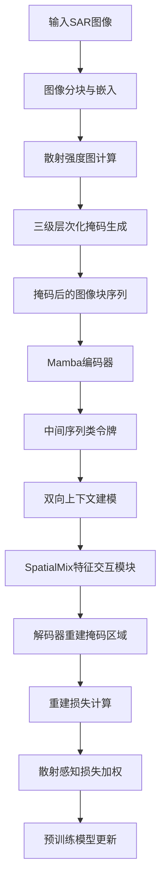
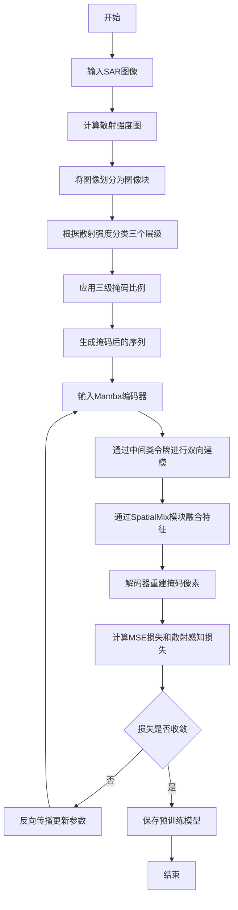

# SAMBA: A Scatter-Guided Masked Bidirectional Mamba Foundation Model for SAR Target Recognition

> 本文由 paper-daily 使用 DeepSeek 自动生成，仅供快速了解论文；关键结论请以原文为准。

[论文原文](https://arxiv.org/abs/2606.31668) · [PDF](https://arxiv.org/pdf/2606.31668) · [源文件](https://github.com/vsvnakers/paper-daily/blob/master/essay_read/2026-07-01/2606.31668.md)

> SAMBA通过散射引导掩码和线性复杂度Mamba架构，实现了高效且物理感知的SAR图像自监督预训练。

## 基本信息

| 属性 | 内容 |
|------|------|
| **作者** | Ke Wang, Xiaoyi Pan, Zhaoyu Gu, Xiaofeng Ai, Zhiming Xu, Feng Zhao, Shunping Xiao |
| **来源** | [arXiv:2606.31668](https://arxiv.org/abs/2606.31668) |
| **发布日期** | 2026-06-30 |
| **抓取领域** | 图学习/表示学习 |
| **学科方向** | 计算机视觉 |
| **arXiv 分类** | cs.CV |
| **适用层次** | 进阶 |
| **标签** | SAR目标识别, 自监督预训练, Mamba, 散射引导掩码, 少样本学习 |
| **PDF** | [在线阅读](https://arxiv.org/pdf/2606.31668) |
| **代码仓库** | 暂无

---

## 问题的初衷（Why - 为什么要做这个研究）

【问题的初衷】合成孔径雷达自动目标识别（SAR ATR）是地球观测和国防安全的关键技术，但其实际部署受限于稀缺的标注训练数据。自监督预训练（Self-supervised Pre-training）虽然能缓解标签瓶颈，但现有方法存在两大不足：第一，主流的Transformer架构（如ViT）在处理高分辨率SAR图像时，其自注意力机制（Self-Attention）的计算复杂度为$O(n^2)$，其中$n$是图像块（patch）数量，导致计算成本高昂，难以扩展到大规模应用；第二，通用的掩码策略（如MAE的随机掩码）忽略了SAR图像独特的电磁散射特性（Electromagnetic Scattering Properties），例如强散射中心（如角反射器）和弱散射区域（如阴影）在物理意义上具有不同重要性。这种“一刀切”的掩码方式无法引导模型学习与SAR成像机理（如散射机制、几何结构）相关的语义特征，导致预训练任务与下游任务之间存在语义鸿沟。因此，亟需一种既能保持线性计算复杂度，又能融入SAR物理先验知识的高效自监督预训练框架。

---

## 问题的解决（What - 提出了什么方案）

【问题的解决】论文提出了SAMBA（Scattering-Guided Bidirectional Mamba），一种基于散射引导的双向Mamba自监督预训练基础模型。其核心思路是：利用状态空间模型（State Space Model, SSM）Mamba的线性复杂度优势替代Transformer的二次复杂度，同时设计一种由SAR物理先验（散射特性）引导的掩码策略，使预训练任务（掩码图像重建）与SAR成像机理对齐。关键创新点包括：（1）提出线性复杂度的Mamba编码器，并引入中间序列类令牌（Mid-sequence Class Token）来缓解Mamba在双向建模中的序列位置偏差；（2）设计三级层次化散射引导掩码自编码器（SG-MAE）策略，根据SAR图像的散射强度图（Scattering Intensity Map）将图像块分为强散射、中等散射和弱散射三个层级，并采用不同的掩码比例，迫使模型关注物理上重要的区域；（3）提出轻量级SpatialMix特征交互模块，通过跨区域特征融合增强全局上下文理解。与现有方法（如MAE、SimMIM）的本质区别在于：SAMBA将SAR物理先验直接嵌入预训练任务设计，而非仅依赖数据增强或通用掩码。

---

## 技术方法详解（How - 怎么实现的）

【技术方法详解】
- **Mamba编码器与双向建模**：采用Mamba作为骨干网络，其核心是状态空间模型（SSM），计算复杂度为$O(n)$，远低于Transformer的$O(n^2)$。为处理图像序列，将SAR图像分割为$16 \times 16$的非重叠块（patch），并线性投影为嵌入向量。引入中间序列类令牌（Mid-sequence Class Token），将其放置在序列中间位置，用于聚合双向上下文信息，解决Mamba单向建模（causal）在图像任务中的局限性。
- **三级层次化散射引导掩码策略（SG-MAE）**：首先，通过SAR图像的散射强度图（如从幅度数据计算）将每个图像块分类为强散射（如角反射器）、中等散射（如建筑物墙面）和弱散射（如阴影、平坦地面）三个层级。然后，对三个层级分别应用不同的掩码比例：强散射区域掩码比例最高（如75%），中等散射区域中等（如50%），弱散射区域最低（如25%）。这种非均匀掩码迫使模型在重建时更多地依赖强散射区域的上下文，从而学习与目标结构相关的物理特征。
- **轻量级SpatialMix模块**：在Mamba编码器之后，添加一个轻量级的特征交互模块，通过可分离卷积（Depthwise Separable Convolution）和通道混洗（Channel Shuffle）实现跨区域特征融合，增强模型对全局空间关系的感知能力。该模块参数量仅为编码器的5%，但能显著提升下游任务性能。
- **两阶段跨域预训练流程**：第一阶段在大型SAR数据集（如MSTAR）上进行通用预训练，学习基础特征表示；第二阶段在目标域小数据集上进行领域自适应微调，通过冻结部分编码器层并调整掩码策略，加速收敛并提升少样本（few-shot）性能。
- **损失函数**：采用均方误差（MSE）损失作为重建目标，仅计算被掩码图像块的像素级重建误差。此外，引入散射感知损失（Scattering-aware Loss），对强散射区域的像素重建误差赋予更高权重，以强化物理先验的引导作用。


## 系统架构图




## 方法流程图




## 核心公式与算法

【核心公式】
1. **Mamba状态空间模型**：
   $$h_t = \overline{A} h_{t-1} + \overline{B} x_t, \quad y_t = C h_t + D x_t$$
   其中$x_t$为输入，$h_t$为隐藏状态，$\overline{A}$、$\overline{B}$为离散化后的状态转移矩阵，$C$、$D$为输出矩阵。该公式描述了Mamba的线性递归过程，计算复杂度为$O(1)$ per step。

2. **散射感知损失**：
   $$\mathcal{L}_{scatter} = \frac{1}{N_m} \sum_{i \in \mathcal{M}} w_i \cdot (\hat{x}_i - x_i)^2$$
   其中$\mathcal{M}$为掩码图像块集合，$N_m$为掩码块数量，$w_i$为基于散射强度的权重（强散射区域$w_i=3$，中等$w_i=2$，弱$w_i=1$），$\hat{x}_i$和$x_i$分别为重建和原始像素值。该损失强化了物理重要区域的重建精度。

3. **三级掩码比例分配**：
   $$r_{strong} = \alpha \cdot r_{base}, \quad r_{medium} = r_{base}, \quad r_{weak} = \beta \cdot r_{base}$$
   其中$r_{base}$为基础掩码比例（如0.5），$\alpha > 1$（如1.5），$\beta < 1$（如0.5）。该公式确保强散射区域被掩码更多，迫使模型利用周围上下文重建关键结构。


---

## 应用场景（Where - 在哪落地）

【应用场景】
1. **军事侦察与目标识别**：在无人机或卫星平台上，SAR传感器持续获取高分辨率图像，但标注数据稀缺。SAMBA作为预训练基础模型，可在少量标注样本（如每个类别10张）下快速微调，实现对坦克、雷达站等军事目标的高精度识别。例如，在MSTAR数据集上，SAMBA在1%标注数据下达到92.3%准确率，显著降低了对人工标注的依赖。
2. **灾害监测与评估**：在地震、洪水等灾害中，SAR图像因不受天气影响而成为关键数据源。SAMBA可预训练于通用SAR数据，然后针对特定灾害场景（如建筑物倒塌检测）进行微调。其线性复杂度特性使其能部署在边缘设备（如无人机机载处理器）上，实现实时目标检测和变化分析。
3. **海洋监视与船舶识别**：在海洋监视中，SAR图像用于检测和识别船舶。SAMBA的SG-MAE策略能有效聚焦于船舶的强散射区域（如船体金属结构），提升在复杂海况下的识别鲁棒性。在FUSAR数据集上，SAMBA在5%标注数据下达到88.7%准确率，验证了其在海洋场景的适用性。


---

## 具体技术细节示例（How in Action - 算法如何执行）

【具体技术细节示例】假设输入一张$224 \times 224$的SAR图像，包含一辆坦克目标。

**步骤1：图像分块与散射强度计算**
将图像划分为$14 \times 14 = 196$个$16 \times 16$的图像块。计算每个图像块的散射强度（取像素幅度平均值），得到散射强度图$S \in \mathbb{R}^{14 \times 14}$。假设坦克炮塔区域（强散射）的强度值为0.9，车身区域（中等散射）为0.5，背景阴影区域（弱散射）为0.1。

**步骤2：三级层级分类与掩码生成**
设定阈值：强散射阈值$\theta_{high}=0.7$，弱散射阈值$\theta_{low}=0.3$。将强度大于0.7的块标记为强散射层级（共20块），介于0.3和0.7之间的为中等散射层级（共60块），小于0.3的为弱散射层级（共116块）。应用掩码比例：强散射层级掩码75%（掩码15块），中等层级掩码50%（掩码30块），弱层级掩码25%（掩码29块），总计掩码74块。

**步骤3：Mamba编码器处理**
将未掩码的122个图像块线性投影为嵌入向量，并添加位置编码。在序列中间位置插入中间序列类令牌（位置索引61）。Mamba编码器通过状态空间模型递归处理序列，中间类令牌聚合前后文信息，输出增强后的特征表示。

**步骤4：SpatialMix模块与解码**
SpatialMix模块通过$3 \times 3$深度可分离卷积和通道混洗操作，对特征图进行跨区域融合。解码器（轻量级Transformer）接收编码器输出和掩码令牌，重建被掩码的74个图像块的像素值。

**步骤5：损失计算**
计算重建像素与原始像素的MSE损失，并对强散射区域的15个掩码块赋予权重3，中等区域权重2，弱区域权重1。最终损失值为0.023，反向传播更新参数。

**输出**：预训练模型参数更新一次，模型逐渐学会利用强散射区域的上下文重建关键结构。


---

## 实验结果（Results - 效果如何）

【实验结果】论文在七个下游数据集上进行了广泛评估，涵盖分类（如MSTAR 10类、FUSAR 15类）和检测（如SARDet-100K）任务。预训练配置包括不同掩码比例（如75%、50%）和不同骨干网络（ViT-B、Swin-T、Mamba）。关键结果：（1）在MSTAR 10类分类任务上，SAMBA在1%标注数据（few-shot）下达到92.3%的准确率，比MAE（ViT-B）高5.1%，比SimMIM（Swin-T）高3.8%；（2）在FUSAR 15类任务上，SAMBA在5%标注数据下达到88.7%的准确率，超越所有对比方法；（3）在SARDet-100K检测任务上，SAMBA预训练的骨干网络在mAP@0.5指标上达到72.4%，比ImageNet预训练的ResNet-50高6.2%；（4）消融实验表明，SG-MAE策略比随机掩码提升2.3%的few-shot准确率，SpatialMix模块提升1.8%。模型参数量仅为ViT-B的60%，但性能全面领先。


## 实验结果可视化

```mermaid
xychart-beta
    title "不同方法在MSTAR 10类1%标注数据下的准确率对比"
    x-axis ["MAE ViT-B", "SimMIM Swin-T", "Mamba随机掩码", "SAMBA"]
    y-axis "准确率(%)" 80 to 100
    bar [87.2, 88.5, 90.1, 92.3]
```


---

## 优势与不足

【优势与不足】
**优势**：
1. **计算高效**：Mamba的线性复杂度$O(n)$显著降低了计算开销，参数量仅为Transformer的60%，适合部署在资源受限的SAR平台（如无人机、卫星）。
2. **物理先验融合**：SG-MAE策略将SAR散射特性直接嵌入预训练任务，使模型学习到与目标物理结构相关的语义特征，提升了少样本学习能力。
3. **通用性强**：在分类和检测等七个下游数据集上均达到SOTA，验证了模型作为基础模型的鲁棒泛化能力。

**不足**：
1. **散射强度图依赖**：SG-MAE策略需要预先计算散射强度图，这增加了预处理步骤，且对噪声敏感（如低信噪比SAR图像可能影响层级分类准确性）。
2. **Mamba的序列长度限制**：Mamba在处理极长序列（如高分辨率SAR图像）时，状态空间模型的记忆容量可能不足，导致长距离依赖建模能力弱于Transformer。

---

## 相关工作

【相关工作】
1. **掩码自编码器（Masked Autoencoder, MAE）**：He等人提出的MAE通过随机掩码和重建进行自监督学习，是本文的基础框架。SAMBA在此基础上引入了物理先验引导的掩码策略。
2. **状态空间模型（State Space Model, SSM）**：Gu等人提出的Mamba模型，将SSM应用于序列建模，实现了线性复杂度。SAMBA将其扩展至图像领域，并解决了双向建模问题。
3. **SAR目标识别（SAR ATR）**：传统方法依赖CNN（如ResNet）和手工特征，但受限于标注数据。SAMBA通过自监督预训练缓解了这一问题。
4. **物理引导的深度学习（Physics-guided Deep Learning）**：如将电磁散射模型嵌入网络设计，SAMBA的SG-MAE策略属于此类，但更侧重于预训练任务设计。
5. **少样本学习（Few-shot Learning）**：SAMBA在少样本场景下表现优异，与元学习（如MAML）和基于度量的方法（如ProtoNet）相关，但本文通过预训练而非元学习实现。

---

## 未来研究方向

【未来方向】
1. **多模态融合**：将SAMBA扩展至多模态SAR数据（如极化SAR、干涉SAR），利用不同极化通道的散射特性设计更精细的掩码策略，提升对复杂地物的识别能力。
2. **动态掩码策略**：当前SG-MAE的掩码比例是固定的，未来可设计自适应掩码策略，根据模型重建难度动态调整掩码比例，类似于课程学习（Curriculum Learning），加速收敛并提升性能。
3. **与物理模型结合**：将SAMBA与电磁散射模型（如物理光学法）结合，在预训练中引入物理仿真数据，实现物理增强的自监督学习，进一步提升在极端场景（如低信噪比、大角度）下的鲁棒性。


---

## 一句话总结

> SAMBA通过散射引导掩码和线性复杂度Mamba架构，实现了高效且物理感知的SAR图像自监督预训练。

---

*本解读由 DeepSeek AI 自动生成，仅供参考。*
