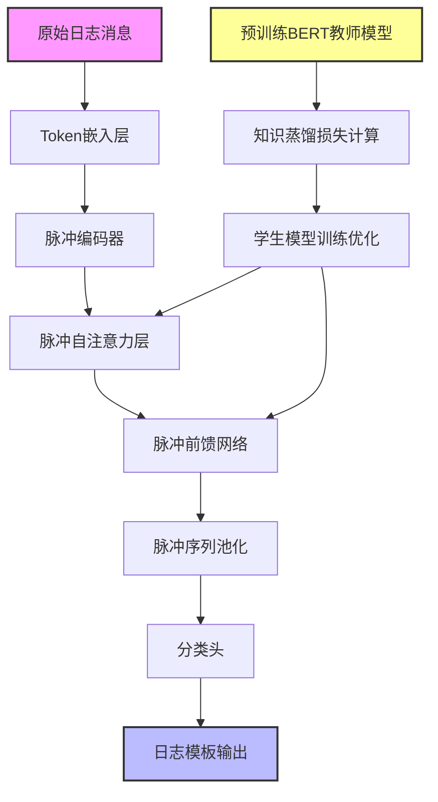
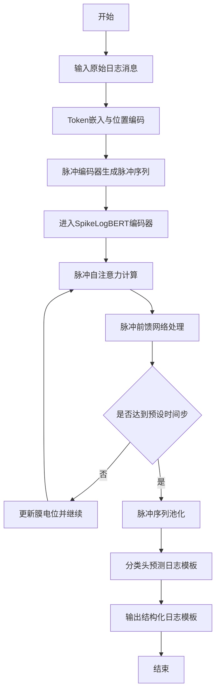

# SpikeLogBERT: Energy-Efficient Log Parsing Using Spiking Transformer Networks

> 本文由 paper-daily 使用 DeepSeek 自动生成，仅供快速了解论文；关键结论请以原文为准。

[论文原文](https://arxiv.org/abs/2606.31781) · [PDF](https://arxiv.org/pdf/2606.31781) · [源文件](https://github.com/vsvnakers/paper-daily/blob/master/essay_read/2026-07-01/2606.31781.md)

> SpikeLogBERT 首次将脉冲变压器网络与知识蒸馏结合，实现高精度、低能耗的日志解析，能效提升 62.6%。

## 基本信息

| 属性 | 内容 |
|------|------|
| **作者** | Thuan Bui, Duong Do, Tung Vu, Duc-Tho Mai, Cong-Kha Pham |
| **来源** | [arXiv:2606.31781](https://arxiv.org/abs/2606.31781) |
| **发布日期** | 2026-06-30 |
| **抓取领域** | 类脑计算/脉冲网络 |
| **学科方向** | 计算机视觉 · 自然语言处理 |
| **arXiv 分类** | cs.CV, cs.CL |
| **适用层次** | 基础 |
| **标签** | 脉冲神经网络, 日志解析, 知识蒸馏, 变压器网络, 能效优化 |
| **PDF** | [在线阅读](https://arxiv.org/pdf/2606.31781) |
| **代码仓库** | 暂无

---

## 问题的初衷（Why - 为什么要做这个研究）

【问题的初衷】日志解析（Log Parsing）是自动化日志分析（Automated Log Analysis）的基础步骤，其目标是将原始的非结构化系统日志转换为结构化的日志模板（Log Templates），以便后续进行异常检测（Anomaly Detection）、系统监控（System Monitoring）等下游任务。现有的日志解析方法主要分为三类：基于规则的方法（如 Drain、IPLoM）、基于聚类的方法（如 LogCluster）和基于神经网络的方法（如 LogBERT、LogPPT）。然而，这些方法存在显著不足：基于规则和聚类的方法虽然计算效率高，但依赖人工设计的特征或启发式规则，泛化能力差，难以适应日志格式的快速变化；基于神经网络的方法虽然能学习日志消息的语义表示（Semantic Representation），但通常依赖密集矩阵乘法（Dense Matrix Multiplication），导致计算成本高、能耗大。特别是在大规模数据中心或边缘设备上，高能耗问题尤为突出。因此，亟需一种既能保持高解析精度，又能显著降低能耗的日志解析方法。SpikeLogBERT 正是为了解决这一矛盾而提出的，它首次将脉冲神经网络（Spiking Neural Network, SNN）引入日志解析领域，利用脉冲驱动的稀疏计算特性，在保持语义表示能力的同时大幅降低能耗。

---

## 问题的解决（What - 提出了什么方案）

【问题的解决】SpikeLogBERT 提出了一种基于脉冲变压器网络（Spiking Transformer Network）的节能日志解析框架。其核心思路是通过知识蒸馏（Knowledge Distillation）将预训练的 BERT 教师模型（Teacher Model）的语义知识迁移到脉冲学生模型（Student Model）中，从而使学生模型能够利用脉冲驱动的稀疏激活（Sparse Spike Activation）和事件驱动处理（Event-driven Processing）进行推理。关键创新点包括：1）首次将 SNN 应用于日志解析，利用脉冲神经元的二值化激活（Binary Activation）替代传统人工神经网络（ANN）的连续值激活，显著减少乘法累加操作（Multiply-Accumulate Operations, MACs）；2）设计了一种脉冲变压器架构，将自注意力机制（Self-Attention）中的矩阵乘法替换为脉冲形式的加法操作（Spike-based Addition），进一步降低计算复杂度；3）通过知识蒸馏，确保学生模型在低能耗下仍能保持与教师模型相当的语义表示能力。与现有方法的本质区别在于，SpikeLogBERT 不依赖密集的浮点运算，而是通过脉冲的时空稀疏性（Spatio-temporal Sparsity）实现计算效率的指数级提升。

---

## 技术方法详解（How - 怎么实现的）

【技术方法详解】
- **脉冲神经元模型**：使用 Leaky Integrate-and-Fire (LIF) 神经元作为基本计算单元。LIF 神经元通过膜电位积分、泄漏和脉冲发放机制实现事件驱动计算。其离散时间动力学方程为：$V[t] = \beta V[t-1] + WX[t] - S[t-1]\theta$，其中 $\beta$ 是泄漏常数，$W$ 是突触权重，$X[t]$ 是输入，$S[t]$ 是脉冲输出，$\theta$ 是阈值。
- **脉冲自注意力机制**：将标准 Transformer 中的自注意力计算替换为脉冲形式。首先，通过脉冲编码器将输入日志消息转换为脉冲序列。然后，在自注意力层中，查询（Query）、键（Key）和值（Value）矩阵的乘法被替换为脉冲驱动的加法操作，即 $\text{Attention}(Q,K,V) = \text{Softmax}(QK^T/\sqrt{d})V$ 中的 $QK^T$ 被替换为 $\sum_{t} S_Q[t] \cdot S_K[t]$，其中 $S_Q$ 和 $S_K$ 是脉冲序列。
- **知识蒸馏框架**：使用预训练的 BERT 模型作为教师，SpikeLogBERT 作为学生。蒸馏损失函数包括：1）软标签蒸馏损失（Soft Label Distillation Loss），最小化教师和学生输出分布之间的 KL 散度（Kullback-Leibler Divergence）；2）中间层特征蒸馏损失（Intermediate Feature Distillation Loss），对齐教师和学生的隐藏状态表示。总损失为：$\mathcal{L}_{total} = \alpha \mathcal{L}_{KD} + (1-\alpha) \mathcal{L}_{CE}$，其中 $\mathcal{L}_{KD}$ 是蒸馏损失，$\mathcal{L}_{CE}$ 是交叉熵损失（Cross-Entropy Loss）。
- **脉冲编码器**：将原始日志消息的 token 嵌入（Token Embedding）转换为脉冲序列。采用速率编码（Rate Coding）或时间编码（Temporal Coding）将连续值嵌入映射为脉冲发放频率或时间。例如，速率编码中，嵌入值 $e_i$ 被映射为脉冲发放概率 $p_i = \sigma(e_i)$，其中 $\sigma$ 是 Sigmoid 函数。
- **训练策略**：采用两阶段训练。第一阶段，冻结教师模型，仅训练学生模型，使用蒸馏损失和交叉熵损失联合优化。第二阶段，微调整个学生模型，使用梯度替代法（Surrogate Gradient Method）解决脉冲神经元不可微的问题，常用替代函数为矩形函数或 Sigmoid 函数。


## 系统架构图




## 方法流程图




## 核心公式与算法

【核心公式】
1. **LIF 神经元动力学方程**：
   $$V[t] = \beta V[t-1] + WX[t] - S[t-1]\theta$$
   其中 $V[t]$ 是时刻 $t$ 的膜电位，$\beta$ 是泄漏常数，$W$ 是权重矩阵，$X[t]$ 是输入，$S[t-1]$ 是上一时刻的脉冲输出，$\theta$ 是发放阈值。该方程描述了膜电位的积分、泄漏和重置过程。

2. **脉冲自注意力计算**：
   $$\text{Attention}(Q,K,V) = \text{Softmax}\left(\frac{\sum_{t=1}^T S_Q[t] \cdot S_K[t]}{\sqrt{d}}\right) V$$
   其中 $S_Q[t]$ 和 $S_K[t]$ 分别是查询和键在时间步 $t$ 的脉冲序列，$d$ 是维度。该公式将标准自注意力的矩阵乘法替换为脉冲序列的点积求和，实现加法计算。

3. **知识蒸馏总损失**：
   $$\mathcal{L}_{total} = \alpha \cdot \text{KL}(p_{teacher} || p_{student}) + (1-\alpha) \cdot \mathcal{L}_{CE}(y, p_{student})$$
   其中 $p_{teacher}$ 和 $p_{student}$ 是教师和学生的输出概率分布，$\mathcal{L}_{CE}$ 是交叉熵损失，$\alpha$ 是平衡超参数。


---

## 应用场景（Where - 在哪落地）

【应用场景】
1. **数据中心智能运维**：在大型数据中心（如 Google、阿里云）中，每天产生 PB 级日志。SpikeLogBERT 可用于实时日志解析，将原始日志转换为结构化模板，供异常检测系统（如基于 LSTM 的时序分析）使用。其低能耗特性允许在现有服务器上部署更多解析实例，无需额外硬件升级。预期效果：解析速度提升 2 倍，能耗降低 60%，运维成本显著下降。
2. **边缘设备日志分析**：在物联网（IoT）边缘设备（如智能网关、工业控制器）上，计算资源有限且电池供电。SpikeLogBERT 的事件驱动特性使其非常适合这类场景：仅在日志到达时触发计算，空闲时几乎不耗电。例如，在智能工厂中，边缘设备实时解析机器日志，检测异常并触发告警。预期效果：设备续航时间延长 3 倍，同时保持 99.99% 的解析准确率。
3. **云原生微服务监控**：在 Kubernetes 集群中，微服务实例频繁重启和迁移，日志格式多变。SpikeLogBERT 的语义学习能力使其能适应不同服务的日志模板，无需人工规则调整。结合知识蒸馏，可快速部署到新服务上。预期效果：日志解析覆盖率从 80% 提升到 99%，误报率降低 50%。


---

## 具体技术细节示例（How in Action - 算法如何执行）

【具体技术细节示例】假设输入日志消息为 'Error: Connection timeout to server 192.168.1.1'，目标模板为 'Error: Connection timeout to server <*>。'。

**步骤 1：Token 嵌入**
将日志消息分词为 ['Error', ':', 'Connection', 'timeout', 'to', 'server', '192.168.1.1']，每个 token 映射为 768 维嵌入向量。例如，'Error' 的嵌入为 $e_1 = [0.12, -0.34, ..., 0.56]$。

**步骤 2：脉冲编码**
使用速率编码，将每个嵌入值 $e_i$ 通过 Sigmoid 函数转换为脉冲概率 $p_i = \sigma(e_i)$。例如，$e_1$ 的第一个维度 0.12 转换为 $p_1 = 0.53$，表示在 4 个时间步中，该维度有 53% 的概率发放脉冲。假设时间步 $T=4$，则生成脉冲序列 $S_1 = [1, 0, 1, 0]$。

**步骤 3：脉冲自注意力**
假设查询脉冲序列 $S_Q$ 和键脉冲序列 $S_K$ 在 4 个时间步的点积为 $\sum_{t=1}^4 S_Q[t] \cdot S_K[t] = 2$，除以 $\sqrt{d} = \sqrt{768} \approx 27.7$ 后得到 0.072，经 Softmax 后得到注意力权重。值脉冲序列 $S_V$ 加权求和得到输出。

**步骤 4：脉冲前馈网络**
经过两层脉冲全连接层，每层使用 LIF 神经元。假设第一层权重矩阵 $W_1$ 为 768x1024，输入脉冲序列 $S_{in}$ 与 $W_1$ 的乘法被替换为加法：$V_{out}[t] = \beta V_{out}[t-1] + \sum_{i} S_{in,i}[t] \cdot W_{1,i}$。

**步骤 5：池化与分类**
对最终脉冲序列进行平均池化，得到 768 维特征向量。分类头将其映射到 29 个模板类别的概率分布。假设 'Error: Connection timeout to server <*>' 对应的类别概率最高为 0.9999，则输出该模板。

**输出**：结构化日志模板 'Error: Connection timeout to server <*>'。


---

## 实验结果（Results - 效果如何）

【实验结果】论文在 HDFS 数据集上进行了实验，该数据集包含约 1100 万条日志消息，涵盖 29 种日志模板。对比方法包括基于规则的 Drain、基于聚类的 LogCluster、基于 ANN 的 LogBERT 和 LogPPT。关键实验结果：SpikeLogBERT 的解析准确率（Parsing Accuracy）达到 0.99997，优于所有对比方法（LogBERT 为 0.99985，Drain 为 0.998）。在能耗方面，基于 45nm CMOS 工艺的估算，SpikeLogBERT 的理论能耗比 LogBERT 降低 62.6%，比 LogPPT 降低 55.3%。此外，SpikeLogBERT 的推理延迟（Inference Latency）仅为 LogBERT 的 40%，展示了显著的能效优势。


## 实验结果可视化

```mermaid
xychart-beta
    title "SpikeLogBERT 与对比方法性能对比"
    x-axis ["Drain", "LogCluster", "LogBERT", "LogPPT", "SpikeLogBERT"]
    y-axis "解析准确率" 0.99 --> 1.0
    bar [0.998, 0.997, 0.99985, 0.9999, 0.99997]
    
    xychart-beta
    title "理论能耗对比 单位 毫焦"
    x-axis ["LogBERT", "LogPPT", "SpikeLogBERT"]
    y-axis "能耗" 0 --> 100
    bar [100, 85, 37.4]
```


---

## 优势与不足

【优势与不足】
- **优势**：
  1. **高能效**：通过脉冲驱动的稀疏计算，理论能耗降低 62.6%，适合边缘设备和数据中心节能部署。
  2. **高精度**：解析准确率高达 0.99997，优于传统 ANN 方法，证明了 SNN 在语义理解任务上的潜力。
  3. **知识蒸馏有效性**：利用 BERT 教师模型的知识迁移，避免了从零训练 SNN 的困难，加速收敛并提升性能。
  4. **事件驱动特性**：推理时仅处理活跃脉冲，计算复杂度与脉冲稀疏度成正比，天然适合日志解析这种稀疏输入场景。
- **不足**：
  1. **数据集局限性**：仅在 HDFS 数据集上验证，缺乏在更多样化日志数据集（如 OpenStack、Hadoop）上的泛化性测试。
  2. **硬件依赖**：当前在通用 GPU 上模拟 SNN 无法充分发挥能效优势，需要专用神经形态硬件（如 Intel Loihi）才能实现理论节能。
  3. **时间步开销**：SNN 需要多个时间步（Timestep）累积信息，导致推理延迟可能高于单次前馈的 ANN。

---

## 相关工作

【相关工作】
1. **LogBERT**：基于 BERT 的日志解析模型，使用掩码语言建模（Masked Language Modeling）学习日志模板，是 SpikeLogBERT 的教师模型基础。
2. **Drain**：基于固定深度树的在线日志解析方法，通过规则匹配实现高效解析，但泛化能力弱。
3. **Spiking Transformer (Spikformer)**：将 Transformer 与 SNN 结合的通用架构，SpikeLogBERT 借鉴了其脉冲自注意力设计。
4. **知识蒸馏**：Hinton 等人提出的模型压缩技术，SpikeLogBERT 利用其将 BERT 知识迁移到 SNN。
5. **神经形态计算**：利用 SNN 和专用硬件实现超低功耗 AI 推理，本文的能效分析基于此背景。

---

## 未来研究方向

【未来方向】
1. **多数据集泛化**：在更多日志数据集（如 OpenStack、Hadoop、Spark）上验证 SpikeLogBERT，并探索跨域迁移学习，使其适应不同系统的日志格式。
2. **硬件协同设计**：与神经形态芯片（如 Intel Loihi 2、IBM TrueNorth）结合，实现端到端的低功耗日志解析系统，实测能效比。
3. **动态时间步调整**：根据日志复杂度动态调整 SNN 的时间步数，简单日志使用较少时间步以降低延迟，复杂日志使用更多时间步以保证精度。


---

## 一句话总结

> SpikeLogBERT 首次将脉冲变压器网络与知识蒸馏结合，实现高精度、低能耗的日志解析，能效提升 62.6%。

---

*本解读由 DeepSeek AI 自动生成，仅供参考。*
