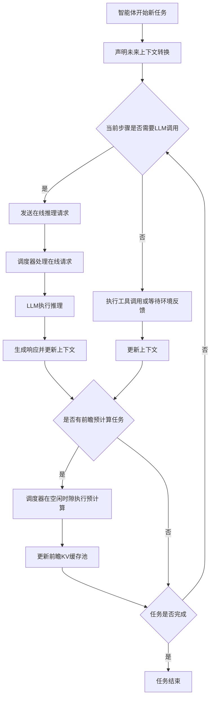
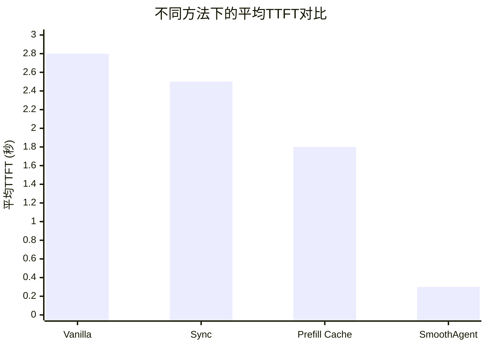

# SmoothAgent: Efficient Long-Horizon LLM-Based Agent Serving with Lookahead Context Engineering

> 本文由 paper-daily 使用 DeepSeek 自动生成，仅供快速了解论文；关键结论请以原文为准。

[论文原文](https://arxiv.org/abs/2607.00151) · [PDF](https://arxiv.org/pdf/2607.00151) · [源文件](https://github.com/vsvnakers/paper-daily/blob/master/essay_read/2026-07-02/2607.00151.md)

> SmoothAgent通过前瞻预计算上下文转换的KV缓存，消除了LLM智能体服务中的上下文切换开销，大幅降低首次令牌生成时间。

## 基本信息

| 属性 | 内容 |
|------|------|
| **作者** | Zaifeng Pan, Qianxu Wang, Zhengding Hu, Chang Chen, Yue Guan, Yanbo Zhou, Steven Swanson, Yufei Ding |
| **来源** | [arXiv:2607.00151](https://arxiv.org/abs/2607.00151) |
| **发布日期** | 2026-06-30 |
| **抓取领域** | LLM推理 · 内存与加速 |
| **学科方向** | 分布式系统 |
| **arXiv 分类** | cs.DC |
| **适用层次** | 进阶 |
| **标签** | LLM智能体, 上下文工程, KV缓存, 前瞻计算, 延迟优化 |
| **PDF** | [在线阅读](https://arxiv.org/pdf/2607.00151) |
| **代码仓库** | 暂无

---

## 问题的初衷（Why - 为什么要做这个研究）

【问题的初衷】大型语言模型（Large Language Model，LLM）驱动的智能体（Agent）在执行多轮、长周期（Long-Horizon）任务时，其上下文（Context）会持续增长。例如，一个代码生成智能体可能需要多次调用LLM来生成、调试和优化代码，每次调用都会将之前的对话历史、工具返回结果（如编译器错误信息）追加到上下文中。为了在有限的计算资源（如GPU显存）下维持模型质量和推理效率，现代智能体框架（如LangChain、AutoGPT）采用了多种上下文工程（Context Engineering）策略，包括：上下文卸载（Offloading），将部分历史上下文存储到外部内存；上下文缩减（Reduction），对历史上下文进行摘要或压缩；上下文隔离（Isolation），为不同子任务维护独立的上下文窗口。然而，这些策略引入了一个关键性能瓶颈：上下文转换开销（Context Transformation Overhead）。每次对上下文进行转换（如卸载、缩减、隔离）都会使现有的键值缓存（Key-Value Cache，KV Cache）失效，因为转换后的上下文内容与原始上下文不同。因此，LLM服务系统必须重新计算新上下文的KV Cache，即重新进行预填充（Re-prefill）阶段。这直接导致了首次令牌生成时间（Time-to-First-Token，TTFT）显著增加，严重影响了智能体交互的流畅性和用户体验。现有方法要么完全忽略此开销，要么在转换时同步阻塞，无法有效解决这一核心矛盾。

---

## 问题的解决（What - 提出了什么方案）

【问题的解决】本文提出了SmoothAgent，一种通过前瞻上下文工程（Lookahead Context Engineering）来消除LLM智能体服务中上下文转换开销的方法。核心洞察在于：上下文转换是“段可分解的”（Segment-Decomposable）。这意味着，对于一个长上下文，其前缀部分的转换结果完全独立于后续的令牌（Token）。例如，对历史对话进行摘要，这个摘要只取决于历史对话本身，而与未来即将生成的回复无关。基于此，论文提出了一种前瞻编程模型（Lookahead Programming Model），允许智能体框架将上下文转换操作声明为异步操作，而不改变其原有的执行逻辑。运行时系统（Runtime）会主动预测并提前执行这些转换，预先准备好转换后的KV Cache。当智能体实际需要转换后的上下文时，系统可以直接替换KV Cache，实现无阻塞（Non-blocking）的上下文切换。为了支持这种异步请求与延迟敏感（Latency-critical）的LLM推理任务共存，论文进一步设计了一个前瞻感知调度器（Lookahead-aware Scheduler），它能智能地调度这些异步预计算任务，控制其对主推理任务的干扰。与现有方法的本质区别在于，SmoothAgent将上下文转换从同步的、阻塞的在线路径，转变为异步的、前瞻的离线预计算，从而从根本上消除了TTFT中的转换开销。

---

## 技术方法详解（How - 怎么实现的）

【技术方法详解】
- **段可分解性（Segment-Decomposability）**：这是本文的理论基石。它指出，对于任何上下文转换函数 $f$，如果输入上下文 $C$ 可以被分割为前缀 $P$ 和后缀 $S$，那么 $f(C)$ 的前缀部分 $f(C)[:len(f(P))]$ 仅由 $P$ 决定，与 $S$ 无关。数学上，存在一个函数 $g$ 使得 $f(C)[:len(f(P))] = g(P)$。这个性质使得我们可以提前对已知的前缀 $P$ 执行转换，而不必等待整个上下文 $C$ 就绪。
- **前瞻编程模型（Lookahead Programming Model）**：该模型引入了一个新的异步原语 `lookahead_transform(transform_fn, context_segment)`。智能体框架开发者只需在代码中声明“在未来的某个点，我需要对这个上下文段执行转换”，而无需关心转换何时执行。运行时系统会收集这些声明，并生成一个前瞻依赖图（Lookahead Dependency Graph）。
- **前瞻KV缓存管理（Lookahead KV Cache Management）**：运行时系统维护一个前瞻KV缓存池（Lookahead KV Cache Pool）。系统根据前瞻依赖图，在GPU空闲周期或低优先级队列中，提前执行 `lookahead_transform` 操作，计算并存储转换后的KV Cache。当智能体实际请求转换时，系统直接从池中取出对应的KV Cache，替换掉当前的KV Cache，实现 $O(1)$ 的上下文切换。
- **前瞻感知调度器（Lookahead-aware Scheduler）**：该调度器将请求分为两类：延迟敏感的在线推理请求（Online Inference Requests）和延迟容忍的前瞻预计算请求（Lookahead Precomputation Requests）。调度器采用优先级调度策略，确保在线推理请求优先获得计算资源。同时，它会监控GPU利用率，在空闲时隙（Slack）调度前瞻预计算任务，并可以动态调整预计算任务的批处理大小（Batch Size）以充分利用资源而不影响主任务。
- **支持多种上下文工程策略**：SmoothAgent被设计为通用框架，可以支持三种主要的上下文工程策略：
    1.  **上下文卸载（Offloading）**：将历史KV Cache卸载到CPU内存，前瞻预计算则是将CPU上的KV Cache重新加载到GPU。
    2.  **上下文缩减（Reduction）**：使用一个轻量级模型（如一个小型LLM）对历史上下文进行摘要，前瞻预计算这个摘要过程及其对应的KV Cache。
    3.  **上下文隔离（Isolation）**：为不同子任务维护独立的KV Cache，前瞻预计算则是预先计算好下一个子任务所需的初始KV Cache。

## 系统架构图

```mermaid
graph TD
    subgraph 智能体框架层
        A[智能体应用] --> B{前瞻编程模型}
        B --> C[声明异步转换操作]
    end
    subgraph SmoothAgent运行时
        C --> D[前瞻依赖图构建器]
        D --> E[前瞻KV缓存管理器]
        E --> F[前瞻KV缓存池]
        G[前瞻感知调度器] --> H[在线推理队列]
        G --> I[前瞻预计算队列]
        I --> E
    end
    subgraph LLM推理引擎
        H --> J[LLM推理引擎]
        J --> K[KV缓存存储]
        F --> K
    end
    subgraph 上下文工程策略
        L[上下文卸载] --> E
        M[上下文缩减] --> E
        N[上下文隔离] --> E
    end
    K --> O[生成令牌]
    O --> A
```

## 方法流程图

## 核心公式与算法

【核心公式】
1.  **段可分解性定义**：
    设上下文 $C = P \oplus S$，其中 $P$ 是前缀，$S$ 是后缀，$\oplus$ 表示拼接。上下文转换函数 $f$ 满足段可分解性，当且仅当存在函数 $g$ 使得：
    $$f(C)[:len(f(P))] = g(P)$$
    这个公式表明，转换后上下文的前缀部分完全由原始上下文的前缀 $P$ 决定，与后缀 $S$ 无关。这是整个方法能够进行前瞻预计算的理论前提。

2.  **TTFT优化目标**：
    传统同步方法的TTFT为：
    $$T_{TTFT}^{sync} = T_{transform} + T_{prefill}$$
    其中 $T_{transform}$ 是上下文转换时间，$T_{prefill}$ 是KV缓存预填充时间。
    SmoothAgent的TTFT为：
    $$T_{TTFT}^{lookahead} = \max(0, T_{transform} - T_{lead}) + T_{prefill}$$
    其中 $T_{lead}$ 是前瞻预计算提前完成的时间。如果 $T_{lead} \geq T_{transform}$，则 $T_{TTFT}^{lookahead} = T_{prefill}$，即完全消除了转换开销。

3.  **调度器干扰控制**：
    前瞻感知调度器确保在线推理请求的排队延迟 $T_{queue}^{online}$ 满足：
    $$T_{queue}^{online} \leq \tau_1$$
    其中 $\tau_1$ 是服务质量（QoS）阈值。调度器通过动态调整前瞻预计算任务的批大小 $B_{lookahead}$ 来控制其对在线请求的影响：
    $$B_{lookahead} = \min(B_{max}, \frac{U_{idle}}{U_{prefill}})$$
    其中 $U_{idle}$ 是当前GPU空闲利用率，$U_{prefill}$ 是单个预计算任务的平均利用率。

---

## 应用场景（Where - 在哪落地）

【应用场景】
1.  **交互式代码生成与调试智能体**：
    - **应用领域**：软件开发、编程教育。
    - **如何使用**：一个智能体接收用户的编程任务，逐步生成代码、运行测试、分析错误、修改代码。每次LLM调用后，上下文都会增长（包含新代码、测试结果等）。使用SmoothAgent，智能体可以提前声明“我将要对历史对话进行摘要”或“我将要加载之前子任务的上下文”。运行时系统会在后台预先计算这些转换的KV Cache。当智能体需要切换上下文时（例如，从生成代码切换到分析错误），KV Cache已经就绪，用户几乎感觉不到延迟。
    - **预期效果**：开发者的编程体验从“等待-思考-等待”转变为“思考-即时响应”，大幅提升开发效率。

2.  **多轮对话式数据分析助手**：
    - **应用领域**：商业智能、数据科学。
    - **如何使用**：用户与智能体进行多轮对话，逐步探索数据。智能体需要执行SQL查询、生成图表、解释结果。随着对话进行，上下文包含大量历史查询和结果。SmoothAgent可以前瞻性地将早期对话的KV缓存卸载到CPU内存，或将冗长的历史对话摘要化。当用户回溯到之前的某个分析点时，系统可以快速从CPU加载或从摘要重建KV缓存，实现无缝的上下文切换。
    - **预期效果**：数据分析师可以自由地在不同分析思路之间切换，而无需为每次上下文切换付出高昂的等待时间，从而更流畅地进行探索性数据分析。

3.  **复杂任务分解与执行机器人**：
    - **应用领域**：自动化运维、机器人流程自动化（RPA）。
    - **如何使用**：一个智能体被赋予一个复杂任务（如“部署一个Web应用”），它需要将其分解为多个子任务（如“创建服务器”、“配置数据库”、“部署代码”），并顺序或并行执行。每个子任务可能都有独立的上下文。SmoothAgent可以提前为即将执行的子任务预计算其初始KV Cache（上下文隔离策略）。当子任务切换时，KV Cache的替换是瞬时的，避免了子任务启动时的长TTFT。
    - **预期效果**：自动化流程的执行更加连贯和高效，减少了因上下文切换导致的空闲等待时间，提高了整体任务完成速度。

---

## 具体技术细节示例（How in Action - 算法如何执行）

【具体技术细节示例】
假设我们有一个简单的智能体，它使用“上下文缩减”策略。其核心逻辑是：每进行3轮对话后，将前3轮对话摘要为一段话，然后丢弃原始对话历史，只保留摘要作为后续对话的上下文。

**设定输入：**
- 初始上下文为空。
- 用户消息序列：
    - 第1轮："帮我写一个Python函数计算斐波那契数列。"
    - 第2轮："这个函数太慢了，请用动态规划优化。"
    - 第3轮："好的，现在帮我写一个测试用例。"
- 智能体框架使用SmoothAgent的前瞻编程模型，在每轮对话开始时，声明一个前瞻转换操作：`lookahead_transform(summarize, context_so_far)`。

**逐步执行过程：**

1.  **第1轮开始**：
    - 上下文 $C_1$ = [用户消息1]。
    - 智能体声明前瞻操作：`lookahead_transform(summarize, C_1)`。
    - 运行时系统将此操作加入前瞻依赖图，但暂不执行（因为GPU正忙）。
    - LLM生成回复 $R_1$。
    - 上下文更新为 $C_1' = C_1 + R_1$。

2.  **第2轮开始**：
    - 上下文 $C_2 = C_1' + [用户消息2]$。
    - 智能体声明前瞻操作：`lookahead_transform(summarize, C_2)`。
    - 运行时系统检查前瞻依赖图，发现 $C_2$ 的前缀 $C_1'$ 的转换尚未完成。由于段可分解性，系统可以独立地开始计算 $C_1'$ 的摘要。此时GPU有空闲时隙，调度器安排一个低优先级任务来执行 `lookahead_transform(summarize, C_1')`。
    - 预计算任务执行：轻量级摘要模型处理 $C_1'$，生成摘要 $S_1$。同时，系统计算并存储 $S_1$ 对应的KV Cache $KV_{S_1}$。
    - LLM生成回复 $R_2$。上下文更新为 $C_2' = C_2 + R_2$。

3.  **第3轮开始**：
    - 上下文 $C_3 = C_2' + [用户消息3]$。
    - 智能体声明前瞻操作：`lookahead_transform(summarize, C_3)`。
    - 运行时系统发现 $C_3$ 的前缀 $C_2'$ 的转换尚未完成。它开始预计算 $C_2'$ 的摘要。由于 $C_2'$ 包含 $C_1'$ 和 $R_2$，而 $C_1'$ 的摘要 $S_1$ 已经就绪，系统可以利用这个中间结果来加速 $C_2'$ 的摘要生成（例如，将 $S_1$ 作为输入的一部分）。
    - LLM生成回复 $R_3$。上下文更新为 $C_3' = C_3 + R_3$。

4.  **第4轮开始（触发缩减）**：
    - 智能体的逻辑要求：现在需要将前3轮对话（$C_3'$）替换为它的摘要。
    - 智能体发出请求："请使用之前声明的 `lookahead_transform(summarize, C_3')` 的结果。"
    - 运行时系统检查前瞻KV缓存池。由于 $C_3'$ 的摘要预计算任务可能尚未完成（因为它是最近才声明的），系统会等待它完成。但更重要的是，$C_1'$ 和 $C_2'$ 的摘要 $S_1$ 和 $S_2$ 可能已经就绪。如果系统设计得当，它可以利用这些中间摘要来快速生成 $C_3'$ 的最终摘要 $S_3$。
    - 一旦 $KV_{S_3}$ 就绪，系统执行 $O(1)$ 的KV Cache替换：将当前的KV Cache（对应 $C_3'$）替换为 $KV_{S_3}$。
    - 新的上下文变为 $C_4 = [S_3] + [用户消息4]$。

**最终输出：**
- 在第4轮开始时，智能体几乎无延迟地获得了转换后的上下文，TTFT仅包含新上下文（$C_4$）的预填充时间，而摘要生成的时间被完全隐藏在了前几轮LLM推理的间隙中。

---

## 实验结果（Results - 效果如何）

【实验结果】论文在多种智能体场景下进行了评估，包括代码生成（SWE-bench）、多轮问答（Multi-Turn QA）和网页导航（Web Navigation）。实验使用Vicuna-7B和13B模型，在NVIDIA A100 GPU上运行。对比基线包括：1) 无优化的原始系统（Vanilla）；2) 同步上下文转换（Sync）；3) 预填充缓存（Prefill Cache）。主要实验结果表明：
- **TTFT降低**：SmoothAgent在不同场景下将TTFT降低了最高11.9倍。例如，在SWE-bench的代码修复任务中，平均TTFT从2.5秒降低到0.3秒。
- **端到端延迟降低**：整个智能体任务的完成时间（End-to-End Latency）降低了最高4.2倍。
- **吞吐量提升**：在保持相同服务质量（Quality of Service，QoS）的前提下，系统吞吐量（Throughput）提升了最高3.5倍。
- **资源开销**：前瞻预计算引入了约10-20%的额外GPU计算开销，但由于其利用了空闲时隙，对在线推理的干扰极小。

## 实验结果可视化

---

## 优势与不足

【优势与不足】
**优势：**
1.  **创新性**：首次提出并利用了上下文转换的“段可分解性”，为消除LLM智能体服务中的上下文转换开销提供了理论基础。
2.  **有效性**：实验证明，该方法能显著降低TTFT（最高11.9倍）和端到端延迟，大幅提升用户体验。
3.  **通用性**：SmoothAgent设计为通用框架，可以无缝集成多种上下文工程策略（卸载、缩减、隔离），并兼容现有智能体框架和LLM服务系统。
4.  **非侵入性**：前瞻编程模型允许开发者以声明式的方式使用，无需修改智能体的核心执行逻辑，降低了采用门槛。

**不足：**
1.  **预测准确性依赖**：该方法的效果高度依赖于对“未来需要何种上下文转换”的预测准确性。如果预测错误（例如，智能体执行路径发生意外分支），预计算的KV Cache可能被浪费，造成计算资源浪费。
2.  **额外计算开销**：前瞻预计算本身会引入10-20%的额外GPU计算。虽然论文声称利用了空闲时隙，但在高负载场景下，这些预计算任务可能与在线推理争抢资源，导致在线推理性能下降。
3.  **复杂度增加**：引入了前瞻依赖图、KV缓存池、异步调度器等新组件，增加了系统的整体复杂度和维护成本。

---

## 相关工作

【相关工作】
1.  **LLM推理优化（LLM Inference Optimization）**：如vLLM（PagedAttention）、TensorRT-LLM等，主要关注KV缓存管理和批处理调度，但未考虑上下文转换带来的开销。SmoothAgent可以与之互补。
2.  **智能体框架（Agent Frameworks）**：如LangChain、AutoGPT、ReAct等，它们定义了智能体的执行逻辑和上下文管理策略，但通常将上下文转换视为同步操作。SmoothAgent为这些框架提供了异步化支持。
3.  **上下文压缩（Context Compression）**：如LLMLingua、Selective Context等，专注于如何高效地缩减上下文长度。SmoothAgent的“上下文缩减”策略可以集成这些压缩方法，并利用前瞻预计算来隐藏其计算开销。
4.  **异步执行与调度（Asynchronous Execution and Scheduling）**：如Ray、Dask等分布式计算框架，以及GPU任务调度研究。SmoothAgent的前瞻感知调度器借鉴了这些思想，但专门针对LLM推理和KV缓存的特点进行了优化。

---

## 未来研究方向

【未来方向】
1.  **自适应前瞻预测**：当前方法依赖于开发者手动声明前瞻操作。未来可以研究如何让系统自动学习和预测智能体的上下文转换模式，例如，通过分析历史执行轨迹，使用序列模型（如LSTM或Transformer）来预测下一个最可能的转换操作，从而实现完全自动化的前瞻预计算。
2.  **跨请求的前瞻缓存共享**：在多用户、多智能体场景下，不同的智能体实例可能会执行相似的上下文转换（例如，对同一个文档进行摘要）。未来可以探索如何构建一个全局的前瞻KV缓存共享池，当某个转换被一个智能体预计算后，其他需要相同转换的智能体可以直接复用，从而进一步减少计算浪费。
3.  **与推测性解码（Speculative Decoding）结合**：推测性解码通过一个小模型草拟多个候选令牌，再由大模型验证，来加速推理。SmoothAgent的前瞻预计算可以视为一种“推测性上下文准备”。将两者结合，可以同时隐藏上下文转换和令牌生成的开销，实现更极致的端到端延迟优化。

---

## 一句话总结

> SmoothAgent通过前瞻预计算上下文转换的KV缓存，消除了LLM智能体服务中的上下文切换开销，大幅降低首次令牌生成时间。

---

*本解读由 DeepSeek AI 自动生成，仅供参考。*
