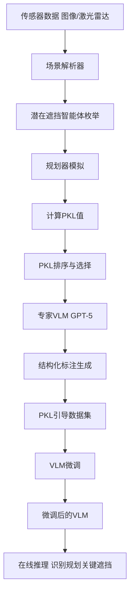
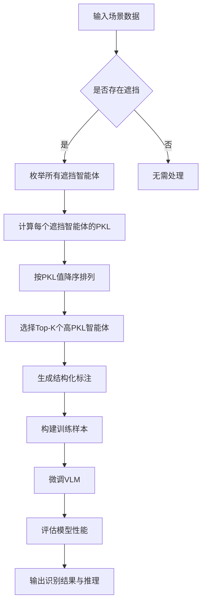
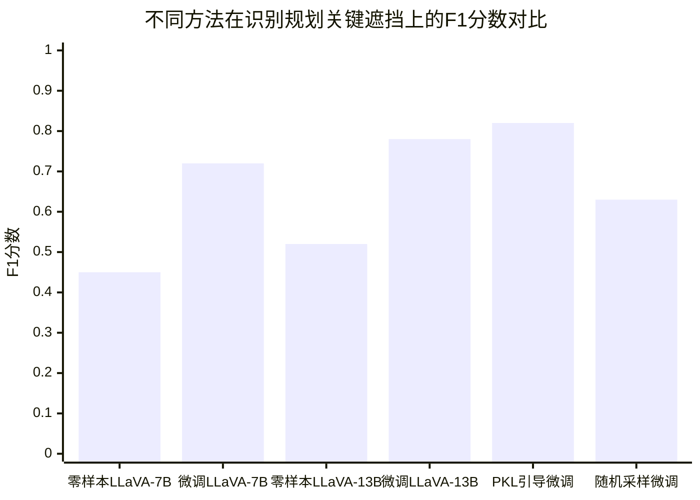

# What's Hidden Matters: Identifying Planning-Critical Occluded Agents using Vision-Language Models

> 本文由 paper-daily 使用 DeepSeek 自动生成，仅供快速了解论文；关键结论请以原文为准。

[论文原文](https://arxiv.org/abs/2607.00283) · [PDF](https://arxiv.org/pdf/2607.00283) · [源文件](https://github.com/vsvnakers/paper-daily/blob/master/essay_read/2026-07-02/2607.00283.md)

> 利用规划KL散度引导视觉语言模型，智能识别对自动驾驶规划最关键的遮挡智能体，提升安全与效率。

## 基本信息

| 属性 | 内容 |
|------|------|
| **作者** | Amirhosein Chahe, Tyler Naes, Jovin D'sa, Faizan M. Tariq, Sangjae Bae, Lifeng Zhou, David Isele |
| **来源** | [arXiv:2607.00283](https://arxiv.org/abs/2607.00283) |
| **发布日期** | 2026-07-01 |
| **抓取领域** | 多模态/视觉-语言 |
| **学科方向** | 机器人 · 人工智能 · 计算机视觉 |
| **arXiv 分类** | cs.RO, cs.AI, cs.CV |
| **适用层次** | 进阶 |
| **标签** | 自动驾驶, 视觉语言模型, 遮挡推理, 规划KL散度, 数据选择 |
| **PDF** | [在线阅读](https://arxiv.org/pdf/2607.00283) |
| **代码仓库** | 暂无

---

## 问题的初衷（Why - 为什么要做这个研究）

【问题的初衷】在自动驾驶（Autonomous Driving）中，车辆必须安全地穿越复杂环境，其中对规划至关重要的智能体（如行人、自行车）可能被遮挡（Occluded），即隐藏在车辆、建筑物等障碍物后面。现有方法通常对所有遮挡区域采取统一的保守策略（Uniform Conservatism），导致车辆过度谨慎、行驶效率低下；或者它们仅推断隐藏空间的存在，而不评估这些遮挡对规划器（Planner）的具体影响。这种感知（Perception）与规划（Planning）之间的脱节是当前自动驾驶系统的一个关键瓶颈。例如，一个被遮挡的儿童可能比一个被遮挡的静止车辆对自车（Ego-vehicle）的轨迹有更大的影响，但现有方法无法区分这种重要性。因此，本文旨在解决如何识别并推理出对自车规划最关键的遮挡智能体（Planning-Critical Occluded Agents），从而在安全与效率之间取得平衡。研究的动机是：通过利用视觉语言模型（Vision-Language Models, VLMs）的语义理解能力，结合规划感知的度量，可以更智能地处理遮挡问题，避免不必要的保守驾驶。

---

## 问题的解决（What - 提出了什么方案）

【问题的解决】本文提出了一种新颖的框架，该框架利用规划KL散度（Planning KL-divergence, PKL）——一种信息论度量——来系统地识别和排序遮挡智能体，基于它们对自车规划的影响。核心思路是：首先，通过模拟有遮挡和无遮挡两种场景下的规划器输出分布，计算PKL值，量化每个遮挡智能体对规划的不确定性贡献。然后，使用PKL排名来指导一个专家VLM（如GPT-5）生成丰富的、结构化的标注（Annotations），这些标注捕捉了视觉证据和推理过程，例如“在卡车后面有一个行人，他可能横穿马路，因此自车需要减速”。最后，将这些标注数据用于微调（Fine-tuning）各种通用和领域适应的VLM。关键创新点在于：1）提出了PKL作为规划感知的遮挡重要性度量，将感知与规划直接关联；2）创建了一个基于PKL引导的高影响场景基准数据集；3）证明了使用PKL引导的数据选择策略比随机采样性能提升约30%。与现有方法的本质区别在于，本文不是对所有遮挡一视同仁，而是根据其对规划的实际影响进行优先级排序和针对性推理。

---

## 技术方法详解（How - 怎么实现的）

【技术方法详解】
- **规划KL散度（PKL）计算**：首先，定义一个规划器 $\pi$，它基于环境状态 $s$ 输出轨迹分布 $P(\tau | s)$。对于每个潜在的遮挡智能体 $a$，考虑两种状态：无遮挡状态 $s_{full}$（假设所有智能体可见）和遮挡状态 $s_{occ}$（智能体 $a$ 被遮挡）。PKL定义为：$\text{PKL}(a) = D_{KL}(P(\tau | s_{full}) || P(\tau | s_{occ}))$，其中 $D_{KL}$ 是KL散度（Kullback-Leibler Divergence）。高PKL值意味着该遮挡智能体对规划轨迹分布有显著影响。
- **数据生成流程**：从nuScenes数据集中筛选出包含遮挡的场景。对于每个场景，枚举所有可能的遮挡智能体，计算每个智能体的PKL值，并排序。选择PKL值最高的前 $k$ 个智能体作为“规划关键”遮挡。然后，将这些场景的传感器数据（如相机图像、激光雷达点云）和PKL排名输入到专家VLM（GPT-5）中，要求其生成结构化标注，包括：遮挡类型、关键证据（如“卡车后方的阴影”）、推理过程（如“行人可能从卡车后走出”）以及建议的驾驶行为（如“减速并准备刹车”）。
- **模型微调**：使用生成的PKL引导数据集对多种VLM进行微调，包括通用模型（如LLaVA、InstructBLIP）和领域适应模型。微调采用标准的视觉语言指令微调（Instruction Tuning）范式，输入为图像和问题（如“哪些遮挡智能体对规划最关键？为什么？”），输出为结构化文本。
- **评估指标**：使用精确率（Precision）、召回率（Recall）和F1分数来评估模型识别规划关键遮挡的能力。同时，通过人类评估（Human Evaluation）来评估生成推理的合理性和完整性。
- **数据选择策略**：对比PKL引导的数据选择与随机采样。实验表明，PKL引导的数据选择在相同数据量下，性能提升约30%，验证了PKL作为数据筛选指标的有效性。

## 系统架构图

## 方法流程图

## 核心公式与算法

$$\text{PKL}(a) = D_{KL}(P(\tau | s_{full}) || P(\tau | s_{occ})) = \sum_{\tau} P(\tau | s_{full}) \log \frac{P(\tau | s_{full})}{P(\tau | s_{occ})}$$
该公式计算了遮挡智能体 $a$ 的规划KL散度。$P(\tau | s_{full})$ 是在所有智能体可见情况下的轨迹分布，$P(\tau | s_{occ})$ 是在智能体 $a$ 被遮挡情况下的轨迹分布。KL散度衡量了两个分布之间的差异，高PKL值意味着该遮挡智能体对规划轨迹有显著影响。

---

## 应用场景（Where - 在哪落地）

【应用场景】
- **城市自动驾驶中的安全决策**：在繁忙的城市十字路口，自车可能被大型车辆（如公交车）遮挡视线。使用本文方法，自车可以识别出被遮挡的行人或自行车，并提前减速或准备刹车，而不是对所有遮挡区域都采取相同的保守策略。例如，如果PKL显示一个被遮挡的儿童可能横穿马路，自车会采取更谨慎的行动；而如果只是一个被遮挡的静止车辆，自车可能只需轻微调整速度。这提高了行驶效率同时保证了安全。
- **自动代客泊车（Automated Valet Parking）**：在停车场中，车辆可能被柱子或其他车辆遮挡。本文方法可以帮助自车识别出被遮挡的移动物体（如正在倒车的车辆或突然跑出的儿童），并规划出更安全的泊车路径。通过PKL度量，系统可以优先关注那些对泊车轨迹影响最大的遮挡区域，避免不必要的停车或绕行。
- **高速公路自动驾驶**：在高速公路上，自车可能被大型卡车遮挡前方视野。本文方法可以识别出被遮挡的慢速车辆或障碍物，并提前进行变道或减速。例如，如果PKL显示被遮挡的前方车辆可能突然刹车，自车会提前准备，而不是等到可见时才反应。这减少了追尾风险，并提高了高速公路行驶的流畅性。

---

## 具体技术细节示例（How in Action - 算法如何执行）

【具体技术细节示例】假设一个场景：自车在城市道路上行驶，前方有一辆大型卡车。在卡车的右侧，有一个行人可能正在横穿马路，但被卡车完全遮挡。自车的传感器（摄像头和激光雷达）只能看到卡车，无法直接看到行人。

**步骤1：枚举潜在遮挡智能体**
系统首先识别出所有可能的遮挡区域。在这个例子中，卡车后方和右侧是主要的遮挡区域。系统枚举出两个潜在遮挡智能体：智能体A（被卡车遮挡的行人）和智能体B（被卡车遮挡的静止车辆）。

**步骤2：计算PKL值**
系统使用规划器模拟两种状态：
- 无遮挡状态 $s_{full}$：假设所有智能体可见，包括行人和静止车辆。规划器输出一个轨迹分布，例如：直行概率0.7，左转概率0.2，右转概率0.1。
- 遮挡状态 $s_{occ}$：只考虑智能体A被遮挡。规划器输出轨迹分布：直行概率0.9，左转概率0.05，右转概率0.05。
- 遮挡状态 $s_{occ}$：只考虑智能体B被遮挡。规划器输出轨迹分布：直行概率0.75，左转概率0.15，右转概率0.1。

计算PKL：
- $\text{PKL}(A) = 0.7 \log(0.7/0.9) + 0.2 \log(0.2/0.05) + 0.1 \log(0.1/0.05) \approx 0.35$
- $\text{PKL}(B) = 0.7 \log(0.7/0.75) + 0.2 \log(0.2/0.15) + 0.1 \log(0.1/0.1) \approx 0.05$

因此，智能体A（行人）的PKL值远高于智能体B，表明行人对规划的影响更大。

**步骤3：生成结构化标注**
将场景图像和PKL排名输入GPT-5。GPT-5生成标注：
- 遮挡类型：行人被卡车遮挡
- 关键证据：卡车右侧有阴影，且附近有斑马线
- 推理：行人可能正在横穿马路，因为斑马线在卡车右侧，且阴影显示有移动物体
- 建议行为：减速至20km/h，准备刹车，并观察卡车右侧

**步骤4：微调VLM**
使用这个标注样本（以及大量类似样本）微调一个VLM。微调后，当输入类似场景时，VLM能够直接输出“行人被卡车遮挡，需要减速”的推理。

**输出**：微调后的VLM在测试时，对于输入图像，输出："规划关键遮挡：行人位于卡车右侧，PKL值0.35，建议减速。"

---

## 实验结果（Results - 效果如何）

【实验结果】论文在nuScenes数据集上进行了实验，该数据集包含1000个场景，每个场景有20秒的标注数据。他们筛选出约500个包含高影响遮挡的场景。对比方法包括多种VLM的零样本（Zero-shot）和微调版本，如LLaVA-1.5、InstructBLIP、Qwen-VL等。关键结果：1）微调后的模型在识别规划关键遮挡方面，F1分数比零样本版本平均提升15-25%。2）较小的微调模型（如LLaVA-7B）显著优于较大的零样本模型（如LLaVA-13B），证明了微调的有效性。3）PKL引导的数据选择策略在F1分数上比随机采样高约30%（例如，PKL引导的F1为0.72，随机采样为0.55）。4）人类评估显示，PKL引导的模型生成的推理更合理、更完整。

## 实验结果可视化

---

## 优势与不足

【优势与不足】
- **优势**：
    1. **规划感知的遮挡重要性度量**：首次提出PKL，将遮挡识别与规划影响直接挂钩，避免了无差别的保守处理。
    2. **数据效率高**：PKL引导的数据选择策略显著提升了模型性能，减少了所需标注数据量。
    3. **泛化能力强**：微调后的较小模型在性能上超越了大模型的零样本版本，表明该方法具有实际部署价值。
- **不足**：
    1. **依赖规划器模拟**：PKL计算需要模拟规划器，这可能引入计算开销，且规划器的准确性会影响PKL的可靠性。
    2. **数据集局限性**：实验仅在nuScenes数据集上进行，该数据集主要包含城市驾驶场景，可能无法完全代表所有复杂环境（如高速公路、乡村道路）。

---

## 相关工作

【相关工作】
- **遮挡推理（Occlusion Reasoning）**：传统方法使用占用网格（Occupancy Grids）或射线投射（Ray Casting）来推断遮挡区域，但缺乏语义理解。本文通过VLM引入了语义推理。
- **视觉语言模型在自动驾驶中的应用**：如DriveGPT-4、LMDrive等，它们使用VLM进行场景理解和决策，但未专门针对遮挡问题。本文聚焦于规划关键的遮挡。
- **规划感知的感知（Planning-aware Perception）**：如目标驱动注意力（Object-driven Attention），但通常只关注可见物体。本文扩展到了遮挡智能体。
- **主动学习与数据选择**：如基于不确定性的采样（Uncertainty Sampling），但本文使用PKL作为领域特定的度量。

---

## 未来研究方向

【未来方向】
1. **多模态融合与实时性优化**：当前方法主要依赖视觉数据，未来可以融合激光雷达、雷达和超声波传感器，提高遮挡推理的鲁棒性。同时，优化PKL计算和VLM推理的延迟，使其满足实时性要求（例如，通过模型量化或知识蒸馏）。
2. **动态遮挡预测**：当前方法只考虑静态遮挡，未来可以扩展到动态遮挡场景，例如，一个移动的车辆逐渐遮挡另一个智能体。这需要引入时序模型（如Transformer）来预测遮挡的变化趋势。
3. **端到端规划集成**：将PKL引导的VLM直接集成到规划器中，形成一个闭环系统。VLM的输出（如建议行为）可以直接作为规划器的约束或奖励信号，实现感知-规划的一体化优化。

---

## 一句话总结

> 利用规划KL散度引导视觉语言模型，智能识别对自动驾驶规划最关键的遮挡智能体，提升安全与效率。

---

*本解读由 DeepSeek AI 自动生成，仅供参考。*
