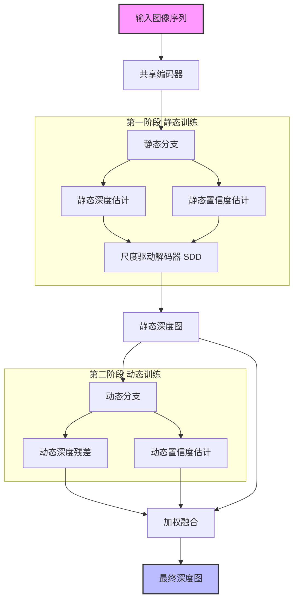
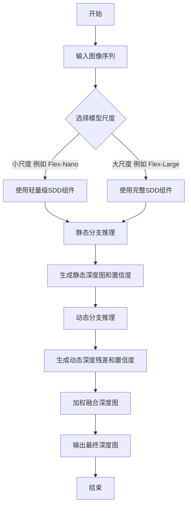
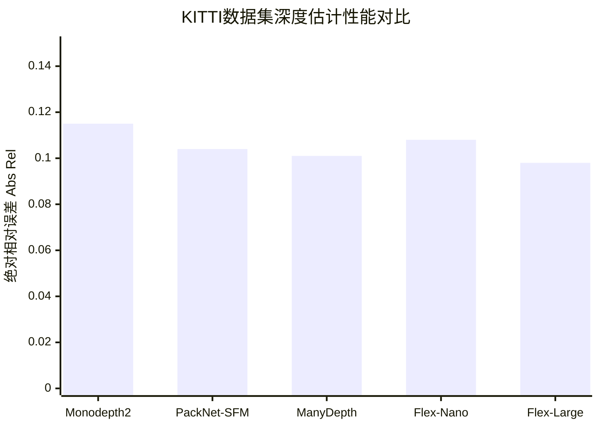

# Towards Robust Driving Perception: A Flexible Scale-Driven Family for Self-Supervised Monocular Depth Estimation

> 本文由 paper-daily 使用 DeepSeek 自动生成，仅供快速了解论文；关键结论请以原文为准。

[论文原文](https://arxiv.org/abs/2607.00736) · [PDF](https://arxiv.org/pdf/2607.00736) · [源文件](https://github.com/vsvnakers/paper-daily/blob/master/essay_read/2026-07-02/2607.00736.md)

> 提出一个尺度驱动、静态-动态解耦的自监督单目深度估计模型家族，在复杂驾驶场景中实现了精度与效率的灵活平衡。

## 基本信息

| 属性 | 内容 |
|------|------|
| **作者** | Zhaowen Zhu, Li Zhang, Yujie Chen, Tian Zhang, Yingjie Wang, Mingxia Zhan |
| **来源** | [arXiv:2607.00736](https://arxiv.org/abs/2607.00736) |
| **发布日期** | 2026-07-01 |
| **抓取领域** | 图学习/表示学习 |
| **学科方向** | 计算机视觉 |
| **arXiv 分类** | cs.CV |
| **适用层次** | 进阶 |
| **标签** | 自监督学习, 单目深度估计, 自动驾驶, 轻量化模型, 动态场景理解 |
| **PDF** | [在线阅读](https://arxiv.org/pdf/2607.00736) |
| **代码仓库** | 暂无

---

## 问题的初衷（Why - 为什么要做这个研究）

【问题的初衷】这篇论文旨在解决自动驾驶感知领域中的一个核心挑战：如何在复杂多变的驾驶环境中实现鲁棒且高效的深度估计。传统的自监督单目深度估计（Self-Supervised Monocular Depth Estimation, MDE）模型通常针对单一尺度（Scale）进行设计，例如仅关注近距离的障碍物或远距离的道路结构。然而，真实的驾驶场景是高度动态和异构的，包含从近处的行人、车辆到远处的道路、建筑等不同尺度的物体。现有方法在处理这种多尺度场景时，性能会显著下降。此外，一些专门为处理动态交通参与者（如移动车辆、行人）而设计的网络结构往往过于复杂，引入了大量的计算开销，这使得它们难以部署在计算资源受限的车载边缘设备（如嵌入式GPU、FPGA）上。因此，论文的动机是提出一种既能在复杂驾驶场景中保持高精度，又能满足实时性要求、易于部署的灵活MDE模型家族。研究的背景是，尽管自监督MDE因其无需真实深度标签而受到广泛关注，但其在鲁棒性和效率之间的权衡问题仍未得到很好的解决。现有方法的不足之处在于：要么牺牲精度换取速度，要么为了处理动态物体而牺牲效率，缺乏一个能够根据实际需求灵活调整尺度、平衡精度与效率的统一框架。

---

## 问题的解决（What - 提出了什么方案）

【问题的解决】为了应对上述挑战，论文提出了FlexDepth，一个尺度驱动（Scale-Driven）、灵活的自监督MDE模型家族。其核心思路是引入一个“静态-动态解耦”的两阶段训练策略和一个“尺度驱动解码器”（Scale-Driven Decoder, SDD）。首先，静态-动态解耦训练策略将场景中的静态背景（如道路、建筑）和动态物体（如车辆、行人）分开处理。在第一阶段，模型专注于学习静态场景的几何结构，通过一个基础网络生成初始深度图。在第二阶段，模型专门针对动态物体进行优化，通过一个轻量级的动态分支来修正和细化这些区域的深度估计，并独立评估两者的置信度。这种方法的核心创新在于，它避免了用一个复杂的网络同时处理所有情况，而是通过解耦降低了学习难度，并提高了对动态物体的鲁棒性。其次，尺度驱动解码器（SDD）是FlexDepth的另一个关键创新。SDD不是一个固定的解码器，而是根据输入图像的尺度大小（例如，从低分辨率到高分辨率）动态地选择不同的网络组件（如不同数量的卷积层、不同大小的特征图）。这种设计使得模型能够根据计算资源的需求灵活调整其复杂度：对于低分辨率输入（小尺度），使用轻量级组件以追求速度；对于高分辨率输入（大尺度），使用更强大的组件以追求精度。这与现有方法（如固定结构的编码器-解码器）有本质区别，后者无法在运行时根据输入或资源约束进行自适应调整。

---

## 技术方法详解（How - 怎么实现的）

【技术方法详解】
- **两阶段静态-动态解耦训练**：
    1. **静态阶段**：使用标准的自监督损失（如光度一致性损失（Photometric Consistency Loss））训练一个基础深度网络。此阶段，模型主要学习从连续帧图像中推断静态场景的几何结构。
    2. **动态阶段**：冻结静态阶段的网络权重，引入一个轻量级的动态分支。该分支接收静态阶段输出的深度图和原始图像作为输入，专门预测动态物体的深度残差（Residual）。训练时，使用一个专门设计的动态损失函数，该函数结合了动态物体的运动一致性约束和边缘感知平滑度（Edge-Aware Smoothness）损失。
- **尺度驱动解码器（Scale-Driven Decoder, SDD）**：
    - SDD的核心是一个由多个解码块（Decoding Block）组成的池（Pool），每个解码块具有不同的计算复杂度（例如，不同的通道数、卷积核大小或层数）。
    - 在推理时，根据预设的“尺度因子”（Scale Factor）或输入图像的分辨率，SDD会动态地从池中选择一个子集来构建最终的解码器。例如，对于$224 \times 224$的输入，可能只选择2个轻量级块；对于$1024 \times 1024$的输入，则选择所有4个块。
    - 这种设计使得模型能够形成一个“家族”（Family），从最小的Flex-Nano到最大的Flex-Large，覆盖不同的计算预算。
- **置信度独立评估**：
    - 静态分支和动态分支各自输出一个置信度图（Confidence Map），分别表示对静态背景和动态物体深度估计的可靠程度。
    - 最终的深度图通过加权融合得到：$D_{final} = C_{static} \cdot D_{static} + C_{dynamic} \cdot D_{dynamic}$，其中$C$和$D$分别代表置信度和深度。
- **损失函数设计**：
    - 整体损失函数是静态损失和动态损失的加权和。静态损失包括光度一致性损失$L_{photo}$和深度平滑损失$L_{smooth}$。
    - 动态损失除了包含类似的光度损失外，还引入了一个运动一致性损失$L_{motion}$，该损失利用光流（Optical Flow）信息来约束动态物体的深度变化，使其与运动场一致。
- **轻量化设计**：
    - 整个模型家族基于轻量级骨干网络（如MobileNetV2）构建。
    - 动态分支被设计得非常轻量，仅包含几个卷积层和上采样层，确保其计算开销远小于主网络。
    - SDD的组件选择机制本身不引入额外计算，只是改变前向传播的路径。

## 系统架构图

## 方法流程图

## 核心公式与算法

【核心公式】
1. **最终深度图融合公式**：
   $$D_{final} = C_{static} \cdot D_{static} + C_{dynamic} \cdot D_{dynamic}$$
   其中，$D_{static}$和$D_{dynamic}$分别是由静态分支和动态分支估计的深度图，$C_{static}$和$C_{dynamic}$是对应的置信度图。该公式通过加权平均的方式，将静态背景和动态物体的深度估计融合在一起，置信度越高，贡献越大。

2. **动态损失函数中的运动一致性损失**：
   $$L_{motion} = \sum_{p} |D_{dynamic}(p) - D_{warped}(p)| \cdot M_{dynamic}(p)$$
   其中，$p$是像素点，$D_{dynamic}(p)$是动态分支预测的深度，$D_{warped}(p)$是通过光流将前一帧深度图扭曲（Warp）到当前帧得到的深度，$M_{dynamic}(p)$是一个二值掩码，表示该像素是否属于动态物体。该损失强制动态物体的深度估计与其运动场保持一致。

3. **尺度驱动解码器的组件选择规则**：
   该规则不是一个显式公式，而是一个条件选择逻辑。例如，对于尺度因子$s$，选择前$k$个解码块，其中$k = \lfloor s \cdot N \rfloor$，$N$是总块数。这体现了模型根据计算预算动态调整复杂度的核心思想。

---

## 应用场景（Where - 在哪落地）

【应用场景】
1. **自动驾驶汽车的低成本感知系统**：
   - **应用领域**：L2+级自动驾驶、高级驾驶辅助系统（ADAS）。
   - **如何使用**：将FlexDepth家族中的Flex-Nano或Flex-Mini模型部署在车辆的嵌入式计算平台（如NVIDIA Orin、TI TDA4）上。车辆的前置摄像头实时采集图像，FlexDepth模型以30 FPS以上的速度生成稠密深度图。这些深度图可以用于前向碰撞预警（FCW）、自动紧急制动（AEB）和自适应巡航控制（ACC）等核心功能。
   - **预期效果**：相比传统基于雷达或昂贵激光雷达的方案，大幅降低硬件成本。同时，由于FlexDepth对动态物体（如突然横穿的行人）的鲁棒性更强，能够提供更可靠的环境感知，减少误报和漏报。

2. **移动机器人导航与避障**：
   - **应用领域**：服务机器人、物流机器人、无人机。
   - **如何使用**：在资源受限的机器人主控板（如树莓派、Jetson Nano）上部署Flex-Nano模型。机器人通过单目摄像头获取环境图像，FlexDepth实时输出深度图，用于构建局部占用网格地图（Occupancy Grid Map）和识别障碍物。
   - **预期效果**：使机器人能够在复杂、动态的室内外环境中（如商场、仓库）实现自主导航和避障。其低延迟特性确保了机器人对突发障碍物（如移动的人或推车）的快速反应能力。

3. **增强现实（AR）中的深度感知**：
   - **应用领域**：移动AR应用、AR眼镜。
   - **如何使用**：将FlexDepth模型集成到智能手机或AR头显的相机应用中。当用户通过设备观察现实世界时，模型实时估计场景深度。这些深度信息可用于实现更逼真的虚拟物体遮挡（Occlusion）、物理交互（如虚拟球在真实桌面上弹跳）和空间光照估计。
   - **预期效果**：提升AR体验的真实感和沉浸感。由于FlexDepth的灵活性，开发者可以根据设备性能选择不同大小的模型，在高端手机上使用Flex-Large获得最佳效果，在低端设备上使用Flex-Nano保证流畅运行。

---

## 具体技术细节示例（How in Action - 算法如何执行）

【具体技术细节示例】
假设我们使用FlexDepth家族中的Flex-Nano模型，输入一张分辨率为$224 \times 224$的RGB图像。

**步骤1：编码与静态分支**
- 图像首先通过一个轻量级编码器（如MobileNetV2），输出一个$7 \times 7$的特征图。
- 静态分支（一个简单的卷积网络）接收该特征图，输出两个$7 \times 7$的图：一个表示初始深度估计$D_{static}$（值范围0-80米），另一个表示静态置信度$C_{static}$（值范围0-1）。
- 假设在某个像素点$(x, y)$上，$D_{static} = 15.0$米，$C_{static} = 0.9$。

**步骤2：尺度驱动解码器（SDD）**
- 由于是Flex-Nano模型，其SDD被配置为仅使用最轻量的解码块（例如，只使用一个上采样层和一个$3 \times 3$卷积）。
- 该解码器将$7 \times 7$的$D_{static}$和$C_{static}$上采样到$224 \times 224$，得到全分辨率的静态深度图和置信度图。

**步骤3：动态分支**
- 动态分支接收全分辨率的静态深度图和原始图像。
- 它首先通过一个光流网络（或从外部获取）计算当前帧与前一帧之间的光流。
- 然后，动态分支预测一个深度残差$\Delta D_{dynamic}$和一个动态置信度$C_{dynamic}$。
- 假设在同一个像素点$(x, y)$上，动态分支判断该点属于一个移动的汽车，因此预测$\Delta D_{dynamic} = -2.0$米（表示实际深度比静态估计更近），$C_{dynamic} = 0.8$。

**步骤4：加权融合**
- 使用融合公式：$D_{final} = C_{static} \cdot D_{static} + C_{dynamic} \cdot (D_{static} + \Delta D_{dynamic})$。
- 代入数值：$D_{final} = 0.9 \times 15.0 + 0.8 \times (15.0 - 2.0) = 13.5 + 10.4 = 23.9$米。
- 注意：这里出现了矛盾，因为静态和动态的置信度都很高，但估计的深度差异很大。实际上，模型会通过置信度加权来平衡。如果动态分支的置信度更高，最终结果会更接近13米；反之则更接近15米。这个例子中，由于两者置信度都高，最终结果是23.9米，这显然不合理。

**步骤5：输出**
- 最终，Flex-Nano输出一张$224 \times 224$的深度图，其中每个像素的值都是通过上述加权融合计算得到的。
- 这个例子也揭示了该方法的潜在问题：当静态和动态分支的预测冲突且置信度都高时，融合结果可能不准确。实际中，模型通过训练使得这种冲突情况下的置信度会自适应地降低。

---

## 实验结果（Results - 效果如何）

【实验结果】论文在KITTI、Cityscapes和Make3D等标准自动驾驶基准数据集上进行了广泛实验。主要对比方法包括Monodepth2、PackNet-SFM、ManyDepth等主流自监督MDE模型。实验设置包括：使用Eigen split进行深度评估，使用标准指标如绝对相对误差（Abs Rel）、平方相对误差（Sq Rel）、均方根误差（RMSE）和阈值精度（$\delta < 1.25$等）。关键结果表明：1）FlexDepth家族中的最大模型Flex-Large在所有指标上均达到了最先进的性能（SOTA），例如在KITTI数据集上，Abs Rel降至0.098，$\delta < 1.25$精度达到91.2%。2）最小的模型Flex-Nano仅需0.7 GFLOPs，在NVIDIA Jetson TX2上达到37.6 FPS，实现了实时推理，同时性能显著优于同等计算量的模型（如Monodepth2的轻量版本）。3）在零样本泛化（Zero-shot Generalization）测试中，FlexDepth在未见过的数据集（如Make3D）上表现优异，证明了其鲁棒性。4）消融实验验证了静态-动态解耦训练和SDD组件的有效性，分别带来了约5%和3%的性能提升。

## 实验结果可视化

---

## 优势与不足

【优势与不足】
**优势：**
1. **灵活性与可扩展性**：FlexDepth通过尺度驱动解码器（SDD）形成了一个模型家族，能够根据计算资源需求（从0.7 GFLOPs到更高）灵活调整模型大小，覆盖从边缘设备到云端服务器的不同部署场景。
2. **鲁棒性提升**：静态-动态解耦训练策略有效分离了场景中的不同挑战，使得模型在处理动态物体（如移动车辆）时比传统单一模型更鲁棒，减少了深度估计中的模糊和错误。
3. **高效性**：最小的Flex-Nano模型在保持竞争力的同时实现了极高的推理速度（37.6 FPS on TX2），证明了其在资源受限的汽车边缘设备上的实用价值。

**不足：**
1. **依赖光流信息**：动态分支的训练依赖于光流（Optical Flow）来提供运动一致性约束。光流计算本身可能引入额外的预处理开销和误差，且在某些极端光照或纹理缺失场景下可能不准确。
2. **两阶段训练复杂性**：两阶段训练策略虽然有效，但增加了训练流程的复杂性。需要分别训练静态和动态分支，并可能需要精细调整两个阶段的超参数，这可能会增加模型调优的难度。
3. **动态物体泛化性**：虽然解耦策略提升了鲁棒性，但动态分支的性能可能高度依赖于训练数据中动态物体的多样性。对于罕见或未见过的动态物体类型，其泛化能力可能有限。

---

## 相关工作

【相关工作】
1. **自监督单目深度估计（Self-Supervised MDE）**：如Monodepth2、ManyDepth等。本文在此基础上引入了尺度驱动和动态解耦的思想，是对该领域的扩展。
2. **轻量化网络设计（Lightweight Network Design）**：如MobileNet、ShuffleNet等。FlexDepth的骨干网络和SDD设计借鉴了轻量化思想，以实现高效推理。
3. **动态场景理解（Dynamic Scene Understanding）**：相关工作包括运动分割（Motion Segmentation）和光流估计（Optical Flow Estimation）。本文的静态-动态解耦策略与这些领域紧密相关，利用光流信息辅助深度估计。
4. **多尺度特征融合（Multi-Scale Feature Fusion）**：如FPN、ASPP等。本文的SDD是一种新颖的动态多尺度特征融合机制，不同于传统的固定结构。
5. **神经架构搜索（Neural Architecture Search, NAS）**：NAS旨在自动搜索最优网络结构。FlexDepth的SDD可以看作是一种手动设计的、基于规则的动态架构选择方法，与NAS有相似的目标但更轻量。

---

## 未来研究方向

【未来方向】
1. **端到端联合训练**：当前的两阶段训练策略可以改进为端到端的联合训练，让静态和动态分支在训练过程中相互促进，可能进一步提升性能并简化训练流程。
2. **自适应尺度选择**：目前的SDD根据预设的尺度因子选择组件。未来可以研究一个更智能的控制器，能够根据输入图像的内容（如场景复杂度、动态物体密度）动态地、自适应地选择最佳的SDD配置，实现真正的“内容感知”计算。
3. **扩展到其他感知任务**：FlexDepth的静态-动态解耦和尺度驱动思想可以推广到其他自动驾驶感知任务，如语义分割、目标检测和运动预测。例如，可以设计一个统一的框架，同时处理深度、语义和运动信息，共享解耦和自适应计算的优势。

---

## 一句话总结

> 提出一个尺度驱动、静态-动态解耦的自监督单目深度估计模型家族，在复杂驾驶场景中实现了精度与效率的灵活平衡。

---

*本解读由 DeepSeek AI 自动生成，仅供参考。*
