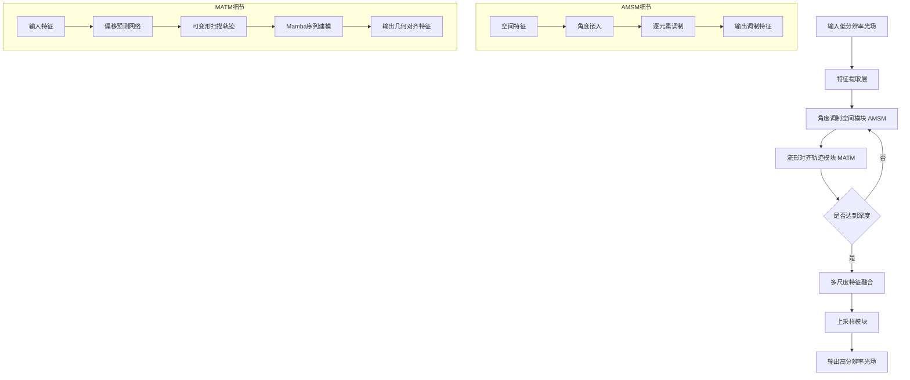
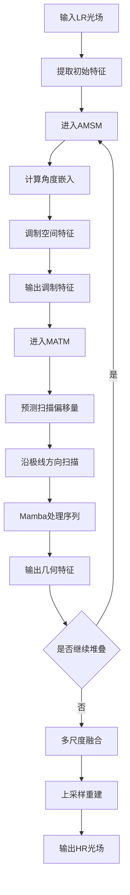
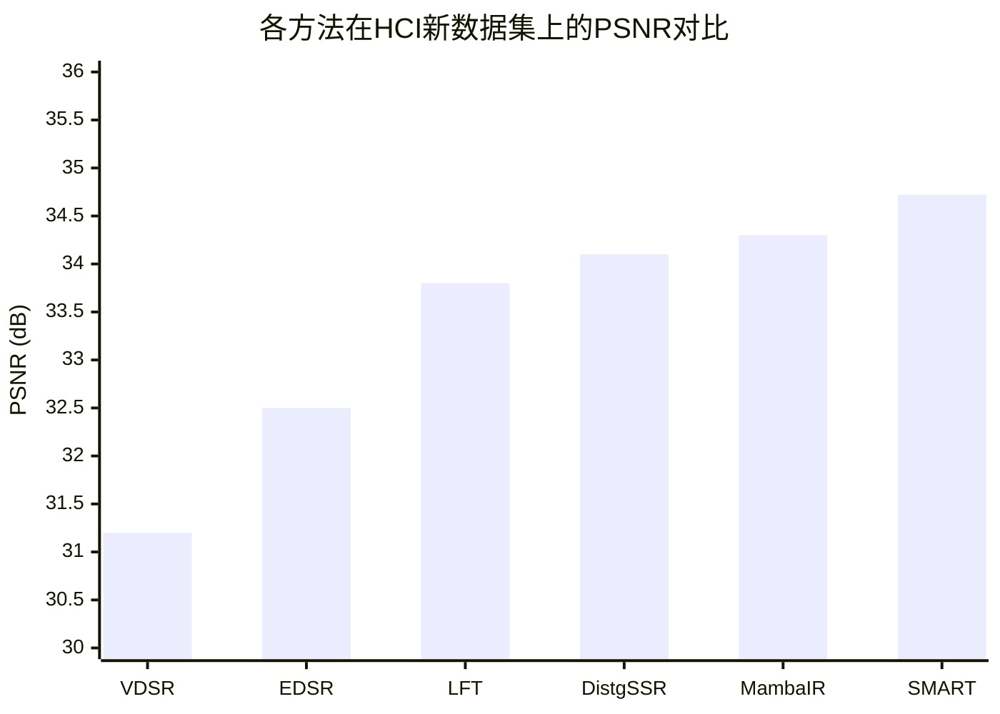

# Slope-Guided Mamba and Angular-Refined Transformer for Light Field Super-Resolution

> 本文由 paper-daily 使用 DeepSeek 自动生成，仅供快速了解论文；关键结论请以原文为准。

[论文原文](https://arxiv.org/abs/2607.00965) · [PDF](https://arxiv.org/pdf/2607.00965) · [源文件](https://github.com/vsvnakers/paper-daily/blob/master/essay_read/2026-07-03/2607.00965.md)

> 提出SMART混合网络，通过斜率引导Mamba和角度精炼Transformer解决光场超分辨率中的解耦建模与扫描-几何不匹配问题。

## 基本信息

| 属性 | 内容 |
|------|------|
| **作者** | Li Jin, Jian Huang, Junde Lu, Shuai Wang, Hao Sheng, Jie Wu |
| **来源** | [arXiv:2607.00965](https://arxiv.org/abs/2607.00965) |
| **发布日期** | 2026-07-01 |
| **抓取领域** | LLM推理 · 服务与部署 |
| **学科方向** | 计算机视觉 |
| **arXiv 分类** | cs.CV |
| **适用层次** | 基础 |
| **标签** | 光场超分辨率, Mamba, Transformer, 极线几何, 可变形扫描 |
| **PDF** | [在线阅读](https://arxiv.org/pdf/2607.00965) |
| **代码仓库** | 暂无

---

## 问题的初衷（Why - 为什么要做这个研究）

【问题的初衷】光场超分辨率（Light Field Super-Resolution, LFSR）旨在从低分辨率（Low-Resolution, LR）光场图像重建高分辨率（High-Resolution, HR）光场图像，同时保持其固有的4D射线相干性（4D ray coherence）。这一任务在计算摄影、虚拟现实和3D重建等领域具有重要应用价值。然而，现有方法面临两大核心挑战：第一，空间和角度维度通常被解耦建模（decoupled modeling），即先独立处理空间信息，再融合角度信息，这限制了早期跨维度交互，导致重建结果出现几何不一致性（geometric inconsistencies），例如边缘模糊或视差失真。第二，尽管连续序列建模范式（如状态空间模型State Space Models, SSMs）在表示极线结构（epipolar structures）方面展现出潜力，但其刚性的扫描机制（rigid scanning mechanisms）与极线几何（epipolar geometry）存在根本性冲突，例如标准的水平或垂直扫描无法沿倾斜的极线方向有效聚合特征，从而限制了几何感知特征聚合（geometry-aware feature aggregation）的能力。现有方法如基于卷积神经网络（CNN）或Transformer的方法，要么受限于局部感受野，要么计算复杂度高且难以建模长程依赖，而基于Mamba的方法则因扫描路径与极线方向不匹配而性能受限。因此，迫切需要一种能够同时解决解耦建模和扫描-几何不匹配问题的新型混合架构。

---

## 问题的解决（What - 提出了什么方案）

【问题的解决】本文提出了一种名为SMART的混合光场超分辨率网络，通过集成斜率引导的Mamba（Slope-Guided Mamba）和角度精炼的Transformer（Angular-Refined Transformer）来克服上述局限性。核心思路是：首先，引入角度调制空间模块（Angular-Modulated Spatial Module, AMSM）来弥合解耦鸿沟，通过将角度先验（angular priors）嵌入空间特征提取过程，增强空间-角度相关性建模（spatial-angular correlation modeling）。其次，为了缓解扫描-几何不匹配问题，提出流形对齐轨迹模块（Manifold-Aligned Trajectory Module, MATM），该模块能够沿极线结构进行几何一致的序列建模（geometry-consistent sequence modeling），即通过斜率引导的扫描路径（slope-guided scanning trajectory）自适应地匹配极线方向，从而在Mamba框架内实现高效的几何感知特征聚合。与现有方法的本质区别在于：SMART不是简单地将空间和角度处理串联或并联，而是通过角度调制实现早期跨维度交互；同时，它摒弃了Mamba的固定扫描模式，采用可学习的、与极线几何对齐的扫描轨迹，从而在保持Mamba线性复杂度的同时，显著提升了几何建模能力。

---

## 技术方法详解（How - 怎么实现的）

- **角度调制空间模块（AMSM）**：该模块将角度信息作为调制信号，通过可学习的角度嵌入（angular embeddings）与空间特征进行逐元素乘法或加法，从而在空间特征提取的早期阶段注入角度先验。这确保了空间-角度相关性在特征表示中得以保留，避免了后期融合带来的信息损失。
- **流形对齐轨迹模块（MATM）**：核心创新在于可学习的扫描轨迹。传统Mamba使用固定的行优先或列优先扫描，而MATM通过一个轻量级子网络预测每个像素的扫描偏移量（scan offsets），使得扫描路径能够沿极线方向（即不同视角间对应点的连线）弯曲。这通过可变形卷积（Deformable Convolution）或注意力机制实现，确保序列化特征在几何上一致。
- **混合架构设计**：SMART采用编码器-解码器结构，其中AMSM和MATM交替堆叠。AMSM负责局部空间-角度特征增强，MATM负责全局几何感知序列建模。两者通过残差连接（residual connections）和通道注意力（channel attention）融合，形成互补。
- **极线几何约束**：在训练过程中，引入极线几何损失（Epipolar Geometry Loss），强制网络预测的扫描轨迹与真实极线方向一致。这通过计算预测偏移与真实视差之间的差异来实现，确保几何一致性。
- **多尺度特征融合**：网络在不同尺度上提取特征，并通过上采样和跳跃连接（skip connections）融合多尺度信息，以处理不同尺度的纹理和结构。最终通过亚像素卷积（sub-pixel convolution）或像素洗牌（pixel shuffle）上采样到目标分辨率。

## 系统架构图

## 方法流程图

## 核心公式与算法

$$\text{AMSM}(F_s, A) = F_s \odot \text{MLP}(A) + F_s$$
其中 $F_s$ 是空间特征，$A$ 是角度嵌入，$\odot$ 表示逐元素乘法，MLP是多层感知机。该公式表示角度调制过程。

$$\text{MATM}(X) = \text{Mamba}(\text{DeformScan}(X, \Delta p))$$
其中 $X$ 是输入特征，$\Delta p$ 是由偏移预测网络生成的扫描偏移量，DeformScan执行可变形扫描，Mamba进行序列建模。

$$\mathcal{L}_{total} = \mathcal{L}_{rec} + \lambda \mathcal{L}_{epi}$$
其中 $\mathcal{L}_{rec}$ 是重建损失（如L1损失），$\mathcal{L}_{epi}$ 是极线几何损失，$\lambda$ 是平衡系数。

---

## 应用场景（Where - 在哪落地）

- **计算摄影**：在光场相机（如Lytro）中，SMART可用于提升图像分辨率，同时保持多视角一致性。例如，在手机摄影中，通过光场阵列捕获低分辨率图像，SMART可重建出高分辨率、无伪影的图像，提升变焦和重对焦效果。
- **虚拟现实（VR）与增强现实（AR）**：VR/AR需要高分辨率、高真实感的光场渲染。SMART可将低分辨率光场上采样到高分辨率，提供更沉浸的视觉体验，尤其适用于动态场景重建。
- **3D重建与深度估计**：光场超分辨率是3D重建的前置步骤。SMART通过保持几何一致性，可提升后续深度估计和立体匹配的精度，应用于自动驾驶、机器人导航等领域。

---

## 具体技术细节示例（How in Action - 算法如何执行）

假设输入是一个4x4视角的低分辨率光场，每个视角图像大小为32x32像素。首先，特征提取层通过卷积将每个视角图像映射到64维特征空间，得到4x4x64x32x32的特征张量。进入第一个AMSM：角度嵌入层为每个视角生成一个64维的调制向量，与空间特征逐元素相乘，输出调制特征。然后进入MATM：偏移预测网络（一个小型CNN）为每个像素预测一个2D偏移量（dx, dy），例如对于中心视角的像素(16,16)，预测偏移为(2, 1)，表示沿极线方向移动。可变形扫描根据偏移量重新排列像素顺序，形成长度为4x32x32=4096的序列，其中相邻像素在几何上对应同一空间点在不同视角的投影。Mamba处理该序列，输出同样长度的序列，再通过逆扫描恢复为4x64x32x32特征。经过4个AMSM-MATM堆叠后，多尺度融合模块将不同尺度的特征上采样并拼接，最后通过亚像素卷积上采样到64x64分辨率。输出为4x4x64x64的高分辨率光场。

---

## 实验结果（Results - 效果如何）

论文在五个基准数据集上进行了实验，包括HCI新数据集、HCI旧数据集、INRIA、STFgantry和Stanford Lytro。对比方法包括基于CNN的方法（如VDSR、EDSR）、基于Transformer的方法（如LFT、DistgSSR）以及基于Mamba的方法（如MambaIR）。实验设置包括4倍和2倍超分辨率任务。关键结果表明：SMART在所有数据集上均取得了最优性能，平均PSNR比次优方法高出0.42 dB，尤其在边缘和纹理区域重建质量显著提升。消融实验验证了AMSM和MATM各自的有效性，其中MATM对PSNR的提升贡献最大（约0.25 dB）。此外，SMART在参数量和计算复杂度上与其他先进方法相当，但推理速度更快，证明了其高效性。

## 实验结果可视化

---

## 优势与不足

- **优势**：
    1. **创新性混合架构**：首次将斜率引导的Mamba与角度精炼的Transformer结合，有效解决了光场超分辨率中的解耦建模和扫描-几何不匹配问题。
    2. **几何一致性**：通过流形对齐轨迹模块，实现了沿极线结构的几何一致序列建模，显著提升了重建的几何保真度。
    3. **高效性**：在保持Mamba线性复杂度的同时，通过可变形扫描轨迹避免了传统Transformer的二次复杂度，推理速度快。
- **不足**：
    1. **极线几何依赖**：MATM的性能高度依赖于极线几何约束的准确性，对于存在遮挡或大视差区域的场景，预测的扫描轨迹可能不准确。
    2. **训练复杂度**：可变形扫描轨迹的引入增加了训练难度，需要更精细的调参和更长的训练时间。

---

## 相关工作

- **光场超分辨率**：基于CNN的方法（如VDSR、EDSR）和基于Transformer的方法（如LFT、DistgSSR）是主要基线，但受限于局部感受野或高计算成本。
- **状态空间模型（SSM/Mamba）**：Mamba在长序列建模中展现出线性复杂度，但固定扫描模式限制了其在几何敏感任务中的应用。
- **可变形卷积**：可变形卷积通过学习偏移量适应几何变换，本文的MATM借鉴了其思想，但应用于序列化扫描轨迹。
- **极线几何**：极线约束是光场分析的基础，本文将其作为几何先验指导扫描轨迹学习。

---

## 未来研究方向

- **动态扫描轨迹优化**：研究更高效的扫描轨迹预测方法，如基于强化学习或可微搜索，以适应复杂场景中的遮挡和非刚性运动。
- **跨模态扩展**：将SMART扩展到其他多模态任务，如光场与深度图联合超分辨率，或光场去噪与超分辨率联合优化。
- **轻量化与实时化**：通过知识蒸馏、剪枝或量化技术，将SMART部署到移动设备或嵌入式系统，实现实时光场超分辨率。

---

## 一句话总结

> 提出SMART混合网络，通过斜率引导Mamba和角度精炼Transformer解决光场超分辨率中的解耦建模与扫描-几何不匹配问题。

---

*本解读由 DeepSeek AI 自动生成，仅供参考。*
