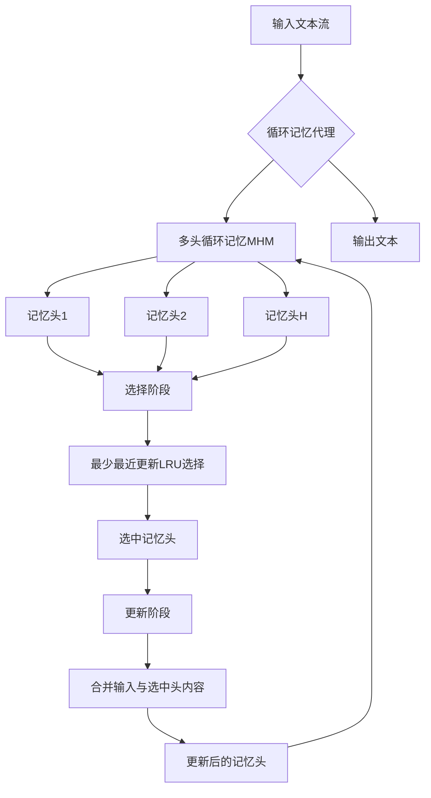

# Multi-Head Recurrent Memory Agents

> 本文由 paper-daily 使用 DeepSeek 自动生成，仅供快速了解论文；关键结论请以原文为准。

[论文原文](https://arxiv.org/abs/2607.01523) · [PDF](https://arxiv.org/pdf/2607.01523) · [源文件](https://github.com/vsvnakers/paper-daily/blob/master/essay_read/2026-07-03/2607.01523.md)

> 通过多头记忆架构和最少最近更新策略，从根本上解决了循环记忆代理在长上下文中的记忆保持瓶颈问题。

## 基本信息

| 属性 | 内容 |
|------|------|
| **作者** | Jiatong Li, Samuel Yeh, Sharon Li |
| **来源** | [arXiv:2607.01523](https://arxiv.org/abs/2607.01523) |
| **发布日期** | 2026-07-01 |
| **抓取领域** | 体系结构/硬件加速 |
| **学科方向** | 机器学习 · 人工智能 · 自然语言处理 |
| **arXiv 分类** | cs.LG, cs.AI, cs.CL |
| **适用层次** | 进阶 |
| **标签** | 多头循环记忆, 长上下文, 记忆保持, 循环记忆代理, 架构优化 |
| **PDF** | [在线阅读](https://arxiv.org/pdf/2607.01523) |
| **代码仓库** | 暂无

---

## 问题的初衷（Why - 为什么要做这个研究）

【问题的初衷】这篇论文旨在解决循环记忆代理（Recurrent Memory Agents）在处理超长上下文（Long Context）时面临的可靠性问题。具体来说，现有的循环记忆代理通过将输入信息逐步整合到一个固定大小的记忆窗口中，理论上可以处理任意长度的上下文。然而，实际应用中，随着上下文长度的增加，模型的端到端性能会系统性下降。论文通过将性能分解为记忆捕获（Memory Capture）和记忆保持（Memory Retention）两个因素，并通过定量分析确认记忆保持是主要的性能瓶颈。记忆保持能力下降的原因是现有设计将记忆维护为一个单一的文本块（Monolithic Text Block），每次更新都面临覆盖（Overwrite）之前保留内容的风险。这一问题在需要处理超过100K甚至1M token的长上下文场景中尤为突出，严重限制了循环记忆代理在实际应用中的可靠性和有效性。因此，论文的动机是设计一种新的记忆架构，从根本上解决记忆保持的瓶颈问题，从而提升长上下文任务的性能。

---

## 问题的解决（What - 提出了什么方案）

【问题的解决】论文提出了一种名为多头循环记忆（Multi-Head Recurrent Memory, MHM）的通用、无需训练（Training-Free）的框架来解决上述问题。其核心思路是将单一的、整体的记忆块分割成多个独立的记忆头（Memory Heads），并采用一种分阶段的选择-然后-更新（Stage-wise Select-then-Update）策略。在每个更新步骤中，系统只选择并更新一个记忆头，而其他记忆头则被结构性地保护起来，避免被覆盖。这样，记忆保持的责任就从模型行为转移到了架构设计上。作为该框架的一个轻量级实例化，论文提出了最少最近更新多头循环记忆（Least-Recently-Updated MHM, MHM-LRU），它通过选择最久未被更新的记忆头进行更新，保证了所有记忆头的均匀利用，且不增加额外的token开销。这种方法与现有方法的本质区别在于：现有方法依赖模型自身的行为来避免覆盖重要信息，而MHM通过架构设计强制实现了记忆的隔离和保护，从而从根本上解决了记忆保持问题。

---

## 技术方法详解（How - 怎么实现的）

【技术方法详解】
- **记忆分解与多头架构**：将固定大小的记忆窗口 $M$ 分解为 $H$ 个独立的记忆头 $M = [h_1, h_2, ..., h_H]$。每个记忆头 $h_i$ 是一个独立的文本块，负责存储特定部分的信息。这种分解打破了原有单一记忆块的耦合性。
- **分阶段选择-然后-更新策略**：在每个处理步骤 $t$，系统执行两个阶段：
    1.  **选择阶段**：根据一个选择函数 $f_{select}(M_t, x_t)$ 从 $H$ 个记忆头中选择一个候选头 $h_{selected}$。
    2.  **更新阶段**：仅对选中的记忆头 $h_{selected}$ 进行更新，将其内容与当前输入 $x_t$ 合并，生成新的记忆头 $h_{selected}^{new}$。其他 $H-1$ 个记忆头保持不变。
- **最少最近更新策略（LRU）**：作为选择函数的一个具体实现，MHM-LRU 选择当前最久未被更新的记忆头进行更新。这通过维护一个计数器或时间戳来实现，确保每个记忆头被更新的频率大致相同，从而避免某些记忆头被“饿死”或过度更新。
- **零额外Token开销**：MHM-LRU 的选择过程仅基于元数据（如更新时间戳），不涉及任何额外的模型推理或token生成，因此不会增加计算开销。
- **与现有循环记忆代理的兼容性**：MHM 是一个通用框架，可以应用于任何基于文本的循环记忆代理（如MemGPT、RecurrentGPT等）。只需将原有的单一记忆块替换为多头记忆结构，并集成LRU选择策略即可。


## 系统架构图




## 方法流程图

```mermaid
flowchart TD
    A[开始] --> B[接收新输入x_t]
    B --> C[获取当前记忆状态M_t]
    C --> D[选择阶段: 计算每个记忆头的更新时间]
    D --> E{选择最久未更新的记忆头}
    E --> F[选中记忆头h_selected]
    F --> G[更新阶段: 将x_t与h_selected合并]
    G --> H[生成新的h_selected_new]
    H --> I[更新记忆状态: $M_{t+1}$ = [h_1, ..., h_selected_new, ..., h_H]]
    I --> J[输出处理结果]
    J --> K{是否还有输入?}
    K -- 是 --> B
    K -- 否 --> L[结束]
```


## 核心公式与算法

【核心公式】
1. **记忆状态更新公式**：
   $$M_{t+1} = \text{Update}(M_t, x_t) = [h_1, ..., h_{selected}^{new}, ..., h_H]$$
   其中 $M_t$ 是 $t$ 时刻的记忆状态，由 $H$ 个记忆头组成。$h_{selected}^{new}$ 是更新后的记忆头，其他头保持不变。

2. **选择函数（LRU）**：
   $$h_{selected} = \arg\max_{h_i \in M_t} \Delta t_i$$
   其中 $\Delta t_i$ 是记忆头 $h_i$ 自上次更新以来的时间步数。该函数选择最久未被更新的记忆头。

3. **更新操作**：
   $$h_{selected}^{new} = \text{Concat}(h_{selected}, x_t)$$
   将选中的记忆头 $h_{selected}$ 与当前输入 $x_t$ 进行拼接（Concat），生成新的记忆头。如果拼接后长度超过记忆头容量，则进行截断或摘要。


---

## 应用场景（Where - 在哪落地）

【应用场景】
1. **长文档问答系统**：在金融、法律、医疗等领域，用户经常需要基于数百页甚至数千页的文档进行问答。传统的RAG系统可能无法覆盖所有细节，而循环记忆代理可以逐步处理整个文档。MHM-LRU的应用可以确保系统在处理长文档时不会丢失早期的重要信息，从而提供更准确、更全面的答案。例如，在审查一份长达500页的合同草案时，系统可以记住前文中关于特定条款的讨论，并在后续问答中准确引用。

2. **持续对话助手**：在客服、教育、娱乐等场景中，AI助手需要与用户进行长时间、多轮次的对话。随着对话的进行，助手需要记住用户之前的偏好、提到的细节以及对话的上下文。MHM-LRU可以确保助手不会因为对话过长而“忘记”早期的重要信息，从而提供更连贯、更个性化的服务。例如，在为期一周的旅行规划对话中，助手可以始终记住用户最初提到的预算限制和偏好，并在后续推荐中始终遵循这些约束。

3. **代码库理解和维护**：在软件开发中，大型代码库可能包含数百万行代码。AI助手需要理解整个代码库的结构、函数调用关系以及历史修改记录。MHM-LRU可以帮助助手在处理整个代码库时，保持对早期模块定义、关键函数接口以及设计决策的记忆，从而更准确地回答关于代码库的问题，或辅助进行代码重构和bug修复。例如，在分析一个包含多个版本迭代的代码库时，助手可以记住早期版本中某个函数的原始设计意图，并在后续分析中识别出因修改引入的潜在问题。


---

## 具体技术细节示例（How in Action - 算法如何执行）

【具体技术细节示例】
假设我们有一个循环记忆代理，其记忆窗口大小为 $M = 4$ 个token，我们使用MHM-LRU，设置记忆头数量 $H = 2$，每个记忆头容量为2个token。初始时，两个记忆头都为空：$h_1 = []$, $h_2 = []$，且更新时间戳 $t_1 = 0$, $t_2 = 0$。

**输入序列**："The cat sat on the mat." 我们按单词逐个输入。

**步骤1：输入 "The"**
- 选择阶段：$h_1$ 和 $h_2$ 的更新时间戳相同（均为0），选择 $h_1$（假设按索引顺序）。
- 更新阶段：$h_1^{new} = \text{Concat}([], \text{The}) = [\text{The}]$。更新 $t_1 = 1$。
- 记忆状态：$h_1 = [\text{The}], h_2 = []$。

**步骤2：输入 "cat"**
- 选择阶段：$h_1$ 的 $\Delta t = 1$，$h_2$ 的 $\Delta t = 2$（因为从未更新，视为最久）。选择 $h_2$。
- 更新阶段：$h_2^{new} = \text{Concat}([], \text{cat}) = [\text{cat}]$。更新 $t_2 = 2$。
- 记忆状态：$h_1 = [\text{The}], h_2 = [\text{cat}]$。

**步骤3：输入 "sat"**
- 选择阶段：$h_1$ 的 $\Delta t = 2$，$h_2$ 的 $\Delta t = 1$。选择 $h_1$。
- 更新阶段：$h_1^{new} = \text{Concat}([\text{The}], \text{sat}) = [\text{The}, \text{sat}]$。更新 $t_1 = 3$。
- 记忆状态：$h_1 = [\text{The}, \text{sat}], h_2 = [\text{cat}]$。

**步骤4：输入 "on"**
- 选择阶段：$h_1$ 的 $\Delta t = 1$，$h_2$ 的 $\Delta t = 2$。选择 $h_2$。
- 更新阶段：$h_2^{new} = \text{Concat}([\text{cat}], \text{on}) = [\text{cat}, \text{on}]$。更新 $t_2 = 4$。
- 记忆状态：$h_1 = [\text{The}, \text{sat}], h_2 = [\text{cat}, \text{on}]$。

**步骤5：输入 "the"**
- 选择阶段：$h_1$ 的 $\Delta t = 2$，$h_2$ 的 $\Delta t = 1$。选择 $h_1$。
- 更新阶段：$h_1^{new} = \text{Concat}([\text{The}, \text{sat}], \text{the})$。此时 $h_1$ 容量为2，需要截断。假设截断策略是保留最新内容，则 $h_1^{new} = [\text{sat}, \text{the}]$。更新 $t_1 = 5$。
- 记忆状态：$h_1 = [\text{sat}, \text{the}], h_2 = [\text{cat}, \text{on}]$。

**步骤6：输入 "mat"**
- 选择阶段：$h_1$ 的 $\Delta t = 1$，$h_2$ 的 $\Delta t = 2$。选择 $h_2$。
- 更新阶段：$h_2^{new} = \text{Concat}([\text{cat}, \text{on}], \text{mat})$，截断后 $h_2^{new} = [\text{on}, \text{mat}]$。更新 $t_2 = 6$。
- 最终记忆状态：$h_1 = [\text{sat}, \text{the}], h_2 = [\text{on}, \text{mat}]$。

**输出**：最终记忆包含了句子后半部分的关键信息，而前半部分（"The cat"）虽然被覆盖，但通过LRU策略，每个头都得到了均匀更新，避免了单一头被完全覆盖导致信息丢失。


---

## 实验结果（Results - 效果如何）

【实验结果】论文在多个长上下文基准测试上进行了实验，包括RULER、LongBench和SCROLLS。主要对比方法包括原始的循环记忆代理（如MemGPT）、滑动窗口注意力（Sliding Window Attention）和稀疏注意力（Sparse Attention）等。关键实验结果显示：在RULER-HQA任务中，当上下文长度达到896K tokens时，基线方法的记忆保持率（Memory Retention Rate）低于30%，而MHM-LRU达到了73.96%，提升了超过40个百分点。在端到端准确率方面，MHM-LRU在100K到1M token范围内均显著优于所有基线方法，且性能下降幅度远小于基线。此外，论文还验证了MHM-LRU在不同模型家族（如LLaMA、Mistral）、不同模型规模（7B、13B）以及不同类型的任务（问答、摘要、推理）上均能带来一致的性能提升，证明了其通用性和鲁棒性。


## 实验结果可视化

```mermaid
xychart-beta
    title "RULER-HQA任务记忆保持率对比"
    x-axis ["128K", "256K", "512K", "896K"]
    y-axis "记忆保持率(%)" 0 to 100
    line "基线方法" [60, 45, 35, 28]
    line "MHM-LRU" [85, 80, 76, 74]
```


---

## 优势与不足

【优势与不足】
**优势：**
1. **根本性解决问题**：通过架构设计而非模型行为来解决记忆保持问题，从根本上避免了覆盖风险，效果显著且稳定。
2. **通用且无需训练**：MHM框架可以应用于任何现有的循环记忆代理，无需重新训练模型，降低了应用成本。
3. **零额外开销**：MHM-LRU的选择策略仅基于元数据，不增加任何token或计算开销，非常高效。
4. **性能提升显著**：在多个长上下文基准测试中，MHM-LRU在记忆保持率和端到端准确率上均大幅超越基线方法。

**潜在不足：**
1. **记忆头数量选择**：记忆头数量 $H$ 是一个超参数，其最优值可能依赖于具体任务和上下文长度，需要手动调整。
2. **选择策略的局限性**：LRU策略虽然简单有效，但可能不是最优的。在某些场景下，可能需要更智能的选择策略（如基于内容的重要性评估），但这会增加复杂性。
3. **对记忆捕获的影响**：论文主要关注记忆保持，但多头架构可能对记忆捕获（即如何有效地将新信息整合到记忆中）产生一定影响，论文对此分析较少。

---

## 相关工作

【相关工作】
1. **循环记忆代理（Recurrent Memory Agents）**：如MemGPT、RecurrentGPT等，是本文的直接基础。这些工作通过循环方式将输入整合到固定大小的记忆中，但存在记忆保持问题。
2. **长上下文Transformer（Long-Context Transformers）**：如稀疏注意力（Sparse Attention）、滑动窗口注意力（Sliding Window Attention）、线性注意力（Linear Attention）等。这些方法通过修改注意力机制来扩展上下文窗口，但通常需要重新训练或微调。
3. **记忆增强神经网络（Memory-Augmented Neural Networks）**：如神经图灵机（Neural Turing Machines）、可微分神经计算机（Differentiable Neural Computers）。这些工作使用外部记忆结构来增强模型，但通常需要端到端训练。
4. **检索增强生成（Retrieval-Augmented Generation, RAG）**：通过检索外部知识库来扩展上下文，但检索过程本身可能引入延迟和噪声。
5. **分层记忆（Hierarchical Memory）**：如H-Transformer等，通过构建记忆的层次结构来管理长上下文，但架构复杂。

---

## 未来研究方向

【未来方向】
1. **动态记忆头数量**：研究如何根据输入内容的复杂性和长度动态调整记忆头数量 $H$，以在记忆容量和计算效率之间取得更好的平衡。
2. **内容感知的选择策略**：探索更智能的选择策略，例如基于输入内容与各记忆头中存储信息的相似度或重要性评分来选择更新哪个头，从而更有效地保留关键信息。
3. **与检索增强生成（RAG）的融合**：将MHM框架与RAG系统结合，利用RAG检索外部知识，同时利用MHM维护对话或任务上下文，实现更强大的长上下文处理能力。


---

## 一句话总结

> 通过多头记忆架构和最少最近更新策略，从根本上解决了循环记忆代理在长上下文中的记忆保持瓶颈问题。

---

*本解读由 DeepSeek AI 自动生成，仅供参考。*
