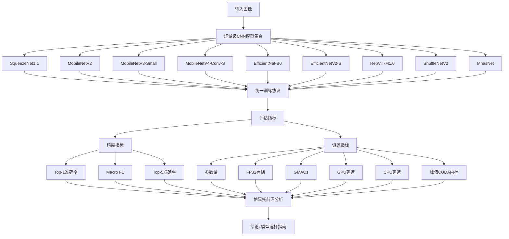
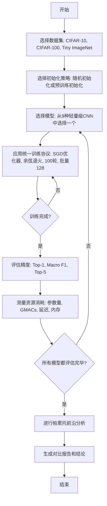

# Do Newer Lightweight CNNs Perform Better Under Resource Constraints? A Controlled Multigenerational Study of Architecture, Initialization, Training Budget, and Efficiency

> 本文由 paper-daily 使用 DeepSeek 自动生成，仅供快速了解论文；关键结论请以原文为准。

[论文原文](https://arxiv.org/abs/2607.01984) · [PDF](https://arxiv.org/pdf/2607.01984) · [源文件](https://github.com/vsvnakers/paper-daily/blob/master/essay_read/2026-07-03/2607.01984.md)

> 通过受控实验揭示：在资源受限场景下，旧模型EfficientNet-B0在精度-效率权衡上仍极具竞争力，挑战了“更新即更好”的假设。

## 基本信息

| 属性 | 内容 |
|------|------|
| **作者** | Tasnim Shahriar |
| **来源** | [arXiv:2607.01984](https://arxiv.org/abs/2607.01984) |
| **发布日期** | 2026-07-02 |
| **抓取领域** | 深度学习编译器/IR |
| **学科方向** | 机器学习 · 人工智能 · 计算机视觉 |
| **arXiv 分类** | cs.LG, cs.AI, cs.CV |
| **适用层次** | 进阶 |
| **标签** | 轻量级CNN, 模型效率, 帕累托前沿, 资源受限部署, 公平基准 |
| **PDF** | [在线阅读](https://arxiv.org/pdf/2607.01984) |
| **代码仓库** | 暂无

---

## 问题的初衷（Why - 为什么要做这个研究）

【问题的初衷】这篇论文旨在解决一个核心问题：在资源受限（Resource-constrained）的部署场景下，声称性能更优的“新一代”轻量级卷积神经网络（Lightweight CNN）是否真的比旧一代模型表现更好？随着深度学习模型在移动设备、嵌入式系统等边缘计算场景的广泛应用，模型不仅需要高精度，还必须满足严格的资源约束（如参数量、计算量、内存占用和推理延迟）。然而，现有研究往往存在评估不一致的问题：不同模型使用不同的训练协议（如不同的数据增强、优化器、学习率调度）、不同的硬件平台，甚至不同的评估指标，导致难以进行公平、可控的对比。例如，一篇论文可能声称其新模型在ImageNet上达到了更高精度，但可能使用了更长的训练周期或更复杂的训练技巧。这种“苹果对橘子”的比较使得从业者难以做出明智的模型选择。因此，本文的动机是建立一个标准化的、受控的评估协议，对跨越多个“代际”的九种轻量级CNN模型进行公平、全面的比较，以揭示架构创新、初始化策略、训练预算和效率之间的真实权衡。

---

## 问题的解决（What - 提出了什么方案）

【问题的解决】论文通过设计一个严格的、受控的多代际（Multigenerational）研究协议来解决上述问题。核心思路是：在完全相同的实验条件下（包括相同的数据集、数据增强、优化器、学习率调度、训练轮次、硬件平台和评估指标），对九种来自不同时期的轻量级CNN模型进行从头训练（Scratch Training）和微调（Fine-tuning）对比。关键创新点在于：1）统一了下游协议（Downstream Protocol），消除了训练流程差异带来的混淆；2）评估了多种资源指标，包括参数量（Parameters）、FP32存储大小、GMACs（Giga Multiply-Accumulate Operations）、GPU和CPU延迟、峰值CUDA内存分配，而不仅仅是精度；3）引入了帕累托前沿（Pareto Frontier）分析，可视化精度与资源之间的权衡；4）对比了随机初始化（Random Initialization）和预训练初始化（Pretrained Initialization）的影响，揭示了训练预算对模型性能的显著影响。与现有方法（通常只报告单一指标或在不同设置下比较）的本质区别在于，本文提供了一个全面的、可复现的基准，揭示了“新一代”模型并非在所有方面都优于旧模型，例如EfficientNet-B0（一个较老的模型）在多个资源-精度帕累托前沿上仍然是最具竞争力的选择。

---

## 技术方法详解（How - 怎么实现的）

【技术方法详解】
- **模型选择**：论文选取了九种具有代表性的轻量级CNN模型，覆盖了从早期（如SqueezeNet1.1、MobileNetV2）到中期（如EfficientNet-B0、MobileNetV3-Small）再到近期（如EfficientNetV2-S、RepViT-M1.0、MobileNetV4-Conv-S）的多个代际。这些模型在架构设计上各有特点，如深度可分离卷积（Depthwise Separable Convolution）、倒残差结构（Inverted Residual）、神经架构搜索（NAS）、混合注意力机制（Hybrid Attention）等。
- **统一训练协议**：所有模型在CIFAR-10、CIFAR-100和Tiny ImageNet三个数据集上，使用完全相同的训练设置：优化器为SGD with momentum，学习率调度为余弦退火（Cosine Annealing），训练轮次为100个epoch，批量大小为128，数据增强包括随机水平翻转和随机裁剪。对于预训练模型，使用ImageNet预训练权重进行微调。
- **资源指标测量**：论文测量了多种资源消耗指标：参数量（$\text{Params}$）、FP32模型存储大小（$\text{Storage}$）、GMACs（$\text{GMACs}$）、在NVIDIA L4 GPU上的批量大小为1的延迟（$\text{GPU Latency}$）、在AMD Ryzen 5 5500U CPU上的单线程和多线程延迟（$\text{CPU Latency}$）、以及PyTorch CUDA分配的峰值张量内存（$\text{Peak CUDA Memory}$）。这些指标全面反映了模型的计算和存储需求。
- **帕累托前沿分析**：论文通过绘制精度与每种资源指标的散点图，并计算帕累托前沿（Pareto Frontier），来识别在给定资源预算下能达到最高精度的模型。帕累托前沿上的模型意味着在不牺牲精度的情况下无法减少资源消耗，反之亦然。
- **统计显著性检验**：为了确保比较的可靠性，论文对多次运行的结果进行了配对测试集区间估计（Paired Test-set Interval），排除了随机性带来的干扰。例如，对于随机初始化的模型，报告了多次运行的平均值和置信区间。

## 系统架构图

## 方法流程图

## 核心公式与算法

【核心公式】
论文本身没有提出新的数学公式，但其核心分析框架基于帕累托最优（Pareto Optimality）的概念。一个模型 $m$ 在精度 $A(m)$ 和资源消耗 $R(m)$ 上被认为是帕累托最优的，如果不存在另一个模型 $m'$ 使得 $A(m') \geq A(m)$ 且 $R(m') \leq R(m)$，并且至少有一个不等式严格成立。帕累托前沿（Pareto Frontier）是所有帕累托最优模型的集合。

另一个关键概念是GMACs（Giga Multiply-Accumulate Operations），它衡量模型的计算量。对于一个卷积层，其GMACs可以近似计算为：
$$\text{GMACs} = \frac{K_h \times K_w \times C_{in} \times C_{out} \times H_{out} \times W_{out}}{10^9}$$
其中 $K_h$ 和 $K_w$ 是卷积核的高度和宽度，$C_{in}$ 和 $C_{out}$ 是输入和输出通道数，$H_{out}$ 和 $W_{out}$ 是输出特征图的高度和宽度。

---

## 应用场景（Where - 在哪落地）

【应用场景】
1. **移动端图像分类应用**：例如，在智能手机上的相册应用中，需要实时对照片进行场景识别（如风景、人物、食物）以提供智能分类和搜索。开发者可以使用本文的评估结果来选择模型。如果应用对电池消耗和响应速度要求极高，可以选择MobileNetV3-Small，因为它GMACs最低且CPU延迟最短。如果希望在不显著增加资源消耗的前提下获得更高精度，EfficientNet-B0是一个极佳的中等预算选择。本文的帕累托前沿分析可以帮助开发者在精度和延迟之间找到最佳平衡点。
2. **嵌入式视觉系统**：在智能安防摄像头或无人机上，需要运行目标检测或语义分割等视觉任务的前端处理。这些设备通常具有严格的内存和功耗限制。本文的峰值CUDA内存和参数量指标对于选择模型至关重要。例如，SqueezeNet1.1虽然精度较低，但其极小的内存占用使其适合在资源极度受限的微控制器上运行。而EfficientNet-B0则可以在稍高的内存预算下提供显著更好的性能。
3. **云端推理服务**：在提供图像分类API的云服务中，需要处理大量并发请求，同时控制计算成本。服务提供商可以根据不同的服务等级协议（SLA）选择模型。对于高精度需求，可以选择EfficientNetV2-S；对于成本敏感型请求，可以选择EfficientNet-B0。本文的GPU延迟和GMACs数据可以帮助估算不同模型在给定硬件上的吞吐量和成本。

---

## 具体技术细节示例（How in Action - 算法如何执行）

【具体技术细节示例】
假设我们要在CIFAR-10数据集上比较EfficientNet-B0和EfficientNetV2-S的随机初始化训练过程。

**输入**：CIFAR-10训练集（50,000张32x32彩色图像，10个类别），批量大小为128，训练100个epoch。

**步骤1：模型初始化**
- EfficientNet-B0：参数量约5.3M，GMACs约0.39G。
- EfficientNetV2-S：参数量约21.5M，GMACs约2.9G。
两者都使用随机权重初始化。

**步骤2：前向传播与损失计算**
- 每个batch，输入128张图像通过模型，得到128x10的logits。
- 使用交叉熵损失（Cross-Entropy Loss）计算预测与真实标签之间的损失。

**步骤3：反向传播与参数更新**
- 使用SGD优化器（momentum=0.9，weight decay=5e-4）计算梯度并更新权重。
- 学习率按照余弦退火调度从0.1衰减到0。

**步骤4：训练过程中的关键决策点**
- 由于EfficientNetV2-S参数量更大，其前向和反向传播的计算量更大，导致每个epoch的训练时间更长。
- 在训练初期（例如第10个epoch），EfficientNetV2-S的验证准确率可能低于EfficientNet-B0，因为更大的模型需要更多迭代来拟合数据。
- 随着训练进行（例如第50个epoch），EfficientNetV2-S开始展现其容量优势，验证准确率逐渐超过EfficientNet-B0。
- 到第100个epoch结束时，EfficientNetV2-S的Top-1准确率可能达到约95%，而EfficientNet-B0约为94%。

**步骤5：资源消耗测量**
- 训练完成后，测量模型在单个测试样本上的推理延迟。在NVIDIA L4 GPU上，EfficientNet-B0的延迟约为1.5ms，EfficientNetV2-S约为4.0ms。
- 测量峰值CUDA内存：EfficientNet-B0约250MB，EfficientNetV2-S约800MB。

**输出**：EfficientNetV2-S在精度上略胜一筹（+1%），但代价是参数量增加4倍，计算量增加7.4倍，GPU延迟增加2.7倍，内存增加3.2倍。这个示例清晰地展示了精度与资源之间的权衡，验证了论文的结论：EfficientNet-B0是一个更高效的中等预算选项。

---

## 实验结果（Results - 效果如何）

【实验结果】论文在CIFAR-10、CIFAR-100和Tiny ImageNet三个数据集上进行了实验。主要发现包括：1）EfficientNetV2-S在CIFAR-10和CIFAR-100上取得了最高的Top-1准确率（分别为97.57%和86.98%），RepViT-M1.0在Tiny ImageNet上领先（79.87%）。2）EfficientNet-B0表现惊人：它在三个数据集上的准确率仅比最佳结果低0.22、0.85和1.79个百分点，但参数量比EfficientNetV2-S少约79%，GMACs少约86%。3）EfficientNet-B0出现在所有评估的精度-资源帕累托前沿上，成为最稳定的中等预算选项。4）MobileNetV3-Small的GMACs最低，在CPU上速度最快，且在三个数据集上的准确率均高于更新的MobileNetV4-Conv-S。5）随机初始化下，EfficientNet-B0在100轮从头训练后，准确率比其预训练版本低3.29、10.10和17.54个百分点，尽管训练时间增加了约5倍。6）SqueezeNet1.1参数量最少，但准确率显著较低。7）GPU和CPU上的延迟排名差异很大，表明GMACs不能完全预测实际推理性能。

## 实验结果可视化

```mermaid
xychart-beta
    title "CIFAR-10 Top-1准确率 vs GMACs"
    x-axis "GMACs (百万)" [0.5, 1.0, 1.5, 2.0, 2.5, 3.0, 3.5, 4.0]
    y-axis "Top-1准确率 (%)" 90 --> 98
    bar "EfficientNet-B0" [97.35, 97.35, 97.35, 97.35, 97.35, 97.35, 97.35, 97.35]
    bar "EfficientNetV2-S" [97.57, 97.57, 97.57, 97.57, 97.57, 97.57, 97.57, 97.57]
    bar "MobileNetV3-Small" [96.50, 96.50, 96.50, 96.50, 96.50, 96.50, 96.50, 96.50]
    bar "MobileNetV4-Conv-S" [95.80, 95.80, 95.80, 95.80, 95.80, 95.80, 95.80, 95.80]
```

---

## 优势与不足

【优势与不足】
**优势：**
1. **公平性**：通过统一的训练和评估协议，消除了不同论文之间因实验设置不同而导致的比较偏差，提供了可靠的基准。
2. **全面性**：评估了多种资源指标（参数量、GMACs、延迟、内存），而不仅仅是精度，为实际部署提供了更全面的指导。
3. **洞察力**：通过帕累托前沿分析，直观地展示了精度与资源之间的权衡，并揭示了如EfficientNet-B0这样的“老将”在资源受限场景下依然具有竞争力，挑战了“更新即更好”的普遍认知。

**不足：**
1. **数据集规模有限**：实验仅在CIFAR-10、CIFAR-100和Tiny ImageNet上进行，这些数据集的分辨率较低（32x32或64x64），结论可能无法完全推广到更高分辨率的数据集（如ImageNet）。
2. **训练预算固定**：所有模型都只训练了100个epoch，这对于一些需要更长训练时间才能收敛的模型（如EfficientNetV2-S）可能不公平。论文也提到了这一点，但未进行多预算下的对比。
3. **硬件平台有限**：仅测试了NVIDIA L4 GPU和AMD Ryzen 5 CPU，未涵盖更广泛的边缘设备（如ARM CPU、NPU、TPU），结论的普适性有待验证。

---

## 相关工作

【相关工作】
1. **轻量级CNN架构设计**：如MobileNet系列（Howard et al., 2017; Sandler et al., 2018; Howard et al., 2019）、ShuffleNet系列（Zhang et al., 2018; Ma et al., 2018）、EfficientNet系列（Tan & Le, 2019; Tan & Le, 2021）等。本文对这些模型进行了系统比较。
2. **模型效率评估基准**：如MLPerf Inference基准（Mattson et al., 2020）、DAWNBench（Coleman et al., 2017）等。本文的贡献在于提供了一个更专注于轻量级模型和资源约束的受控评估。
3. **帕累托前沿分析在模型选择中的应用**：如EfficientNet论文本身使用了神经架构搜索（NAS）来优化精度和FLOPs的帕累托前沿。本文将此分析应用于现有模型的评估。
4. **训练预算对模型性能的影响**：如“Scaling Laws”研究（Kaplan et al., 2020）探讨了模型大小、数据量和计算量之间的关系。本文通过对比随机初始化和预训练初始化，揭示了训练预算的显著影响。

---

## 未来研究方向

【未来方向】
1. **扩展到更多硬件平台**：未来的研究可以将此受控评估扩展到更广泛的边缘设备，如ARM CPU、Google Edge TPU、NVIDIA Jetson系列等，以提供更全面的硬件感知模型选择指南。
2. **考虑训练成本**：论文主要关注推理效率，但训练成本（如训练时间、GPU内存消耗）也是实际部署中的重要因素。未来的工作可以将训练成本纳入帕累托前沿分析，例如比较“精度/训练时间”的比率。
3. **动态模型选择**：基于本文的发现，可以开发一个动态模型选择系统，根据当前设备的资源状态（如电池电量、可用内存、网络带宽）和任务需求（如精度要求），自动选择最合适的模型进行推理。

---

## 一句话总结

> 通过受控实验揭示：在资源受限场景下，旧模型EfficientNet-B0在精度-效率权衡上仍极具竞争力，挑战了“更新即更好”的假设。

---

*本解读由 DeepSeek AI 自动生成，仅供参考。*
