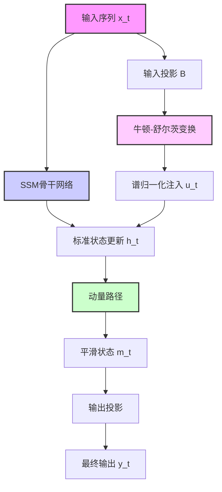
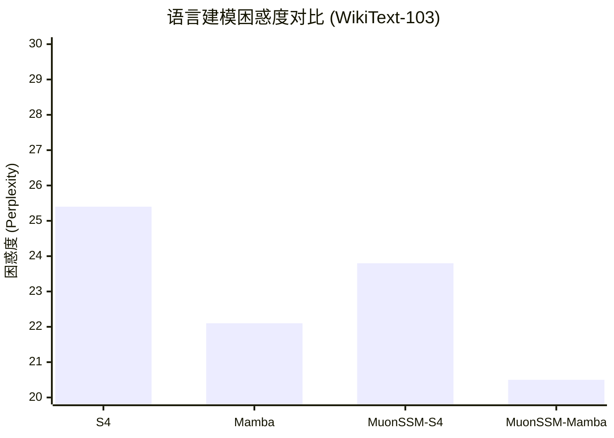

# MuonSSM: Orthogonalizing State Space Models for Sequence Modeling

> 本文由 paper-daily 使用 DeepSeek 自动生成，仅供快速了解论文；关键结论请以原文为准。

[论文原文](https://arxiv.org/abs/2606.30461) · [PDF](https://arxiv.org/pdf/2606.30461) · [源文件](https://github.com/vsvnakers/paper-daily/blob/master/essay_read/2026-07-04/2606.30461.md)

> MuonSSM通过动量路径和牛顿-舒尔茨变换显式调节记忆更新几何，稳定了SSM训练并提升了长程序列建模性能。

## 基本信息

| 属性 | 内容 |
|------|------|
| **作者** | Thai-Khanh Nguyen, Ngoc-Bich-Uyen Vo, Thieu N. Vo, Tan M. Nguyen, Cuong Pham |
| **来源** | [arXiv:2606.30461](https://arxiv.org/abs/2606.30461) |
| **发布日期** | 2026-06-29 |
| **抓取领域** | 状态空间模型/Mamba |
| **学科方向** | 机器学习 |
| **arXiv 分类** | cs.LG |
| **适用层次** | 进阶 |
| **标签** | 状态空间模型, 长序列建模, 训练稳定性, 谱归一化, 动量方法 |
| **PDF** | [在线阅读](https://arxiv.org/pdf/2606.30461) |
| **代码仓库** | 暂无

---

## 问题的初衷（Why - 为什么要做这个研究）

【问题的初衷】这篇论文旨在解决状态空间模型（State Space Models, SSMs）在长序列建模中面临的训练不稳定和记忆退化问题。尽管SSMs（如Mamba、S4）因其线性时间复杂度而成为注意力机制（Attention Mechanism）的高效替代方案，但在处理极长序列时，它们常常遭遇性能瓶颈。具体来说，现有SSMs的更新过程存在两个核心缺陷：一是由于一阶更新（first-order updates）的病态条件（poorly conditioned），导致梯度在反向传播时出现爆炸或消失，使得训练不稳定；二是更新几何（update geometry）不平衡，即模型对不同时间步的记忆更新幅度差异巨大，导致长距离依赖信息被稀释或遗忘。这些问题严重限制了SSMs在需要精确长期记忆的任务（如语言建模、时间序列预测）中的表现。现有方法多聚焦于约束循环转移矩阵（recurrent transition matrix），但这种方法过于严格，会牺牲模型容量。因此，本文的动机是提出一种更通用、更有效的框架，通过显式地调节记忆更新的几何结构（geometry of memory updates），而非直接约束转移矩阵，来同时提升SSMs的训练稳定性和长程记忆能力。

---

## 问题的解决（What - 提出了什么方案）

【问题的解决】论文提出了MuonSSM，一个通用框架，通过显式调节记忆更新的几何结构来稳定SSM训练。其核心创新在于引入两条互补的路径：动量路径（momentum-based pathway）和轻量级牛顿-舒尔茨变换（Newton-Schulz transformation）。动量路径借鉴了优化器中的动量思想，在状态更新中引入一个平滑的、低通滤波的动量项，使得状态更新更加平滑，避免了剧烈波动，从而改善了梯度传播。牛顿-舒尔茨变换则作用于低秩输入注入（low-rank input injections），通过迭代方式对更新矩阵进行谱归一化（spectral normalization），使其特征值（eigenvalues）分布在一个有界且条件良好的范围内（如接近单位圆）。这确保了更新过程不会放大噪声或导致梯度爆炸。与现有方法不同，MuonSSM不直接修改循环矩阵，而是通过这两条路径共同作用，在保持并行扫描（parallel scan）计算复杂度的前提下，实现了有界且谱条件良好的更新。理论上，论文证明了MuonSSM能改善梯度传播、缓解谱放大效应（spectral amplification），并丰富长程记忆表示。

---

## 技术方法详解（How - 怎么实现的）

【技术方法详解】
- **核心架构**：MuonSSM是一个即插即用的框架，可以集成到任何SSM骨干网络（如S4、Mamba）中。它不改变SSM的线性时间不变性（LTI）结构，而是通过额外的路径来调节状态更新。
- **动量路径**：在标准的SSM状态更新方程 $h_t = \bar{A} h_{t-1} + \bar{B} x_t$ 中，MuonSSM引入一个动量状态 $m_t$，其更新为 $m_t = \beta m_{t-1} + (1-\beta) h_t$，其中 $\beta$ 是动量系数。最终用于输出的状态是 $m_t$ 而非 $h_t$。这相当于对原始状态序列进行了一个低通滤波，平滑了状态轨迹，从而稳定了梯度。
- **牛顿-舒尔茨变换**：该变换作用于输入投影矩阵 $\bar{B}$ 或输入注入项。假设输入注入 $u_t = \bar{B} x_t$ 是一个低秩向量，MuonSSM通过迭代公式 $U_{k+1} = \frac{1}{2} U_k (3I - U_k^T U_k)$ 对 $U_k$（初始化为 $u_t$ 的某种表示）进行变换，使其列向量正交化。这等价于对更新矩阵进行谱归一化，确保其奇异值（singular values）接近1，从而防止梯度爆炸或消失。
- **并行扫描兼容性**：动量路径和牛顿-舒尔茨变换都是轻量级的，可以在并行扫描算法中高效实现。动量路径只需维护一个额外的动量状态，而牛顿-舒尔茨变换仅需少量迭代（如3-5次），且计算量远小于SSM本身。
- **理论分析**：论文提供了理论证明，表明MuonSSM的更新矩阵的特征值被限制在一个半径为 $\rho < 1$ 的圆盘内，且条件数（condition number）接近1。这保证了前向传播的稳定性和反向传播梯度的良好性质。此外，动量路径增加了状态表示的维度，使得模型能够编码更丰富的长期依赖信息。


## 系统架构图




## 方法流程图

```mermaid
flowchart TD
    Start[开始] --> Input[输入序列 x_t]
    Input --> SSM[SSM骨干网络前向传播]
    SSM --> Update[计算标准状态更新 h_t]
    Update --> Momentum[应用动量路径: m_t = beta * $m_{t-1}$ + (1-beta) * h_t]
    Input --> Proj[计算输入投影 u_t = B * x_t]
    Proj --> NS[应用牛顿-舒尔茨变换: 迭代正交化]
    NS --> Norm[得到谱归一化注入]
    Norm --> Update
    Momentum --> Output[使用 m_t 计算输出 y_t]
    Output --> End[结束]
    style Start fill:#9f9,stroke:#333,stroke-width:2px
    style End fill:#f99,stroke:#333,stroke-width:2px
    style NS fill:#ff9,stroke:#333,stroke-width:2px
```


## 核心公式与算法

【核心公式】
1. **动量路径更新**：
   $$m_t = \beta m_{t-1} + (1-\beta) h_t$$
   其中 $h_t$ 是标准SSM状态，$m_t$ 是平滑后的动量状态，$\beta$ 是动量系数（通常接近1，如0.9）。该公式对状态序列进行指数加权移动平均，平滑了状态轨迹。

2. **牛顿-舒尔茨迭代**：
   $$U_{k+1} = \frac{1}{2} U_k (3I - U_k^T U_k)$$
   其中 $U_k$ 是第 $k$ 次迭代的矩阵，初始化为输入注入的某种表示。该迭代使 $U_k$ 的列向量逐渐正交化，即 $U_k^T U_k \to I$，从而将奇异值归一化到1附近。

3. **谱条件保证**：
   $$\sigma_{\max}(\bar{A}_{\text{MuonSSM}}) \leq \rho < 1$$
   其中 $\bar{A}_{\text{MuonSSM}}$ 是MuonSSM的等效转移矩阵，$\sigma_{\max}$ 表示最大奇异值。该不等式保证了更新矩阵的谱半径（spectral radius）有界且小于1，从而确保前向传播的稳定性和反向传播梯度的良好性质。


---

## 应用场景（Where - 在哪落地）

【应用场景】
1. **长文本语言建模**：在自然语言处理（NLP）领域，处理长文档（如法律合同、学术论文）时，传统Transformer受限于二次复杂度，而SSM虽高效但长程记忆退化。MuonSSM通过稳定更新，使模型能准确捕捉数百甚至数千token之前的依赖关系，例如在生成摘要时，能更准确地引用前文关键信息。预期效果是降低困惑度，提升长文本生成的一致性和连贯性。
2. **高精度时间序列预测**：在金融、气象、能源等领域，时间序列数据往往具有长期趋势和周期性模式。MuonSSM的动量路径能平滑噪声，牛顿-舒尔茨变换能防止梯度问题，使得模型能更准确地学习长期依赖，例如预测未来一周的股票价格或电力负荷。预期效果是显著降低预测误差（如MSE、MAE），尤其在长预测窗口下优势明显。
3. **视频理解与动作识别**：视频数据是典型的长序列，包含数百帧图像。SSM可用于建模帧间时空依赖。MuonSSM的稳定更新机制能帮助模型更好地记忆早期帧的信息，从而在动作识别任务中，准确区分“开门”和“关门”这类需要长期上下文区分的动作。预期效果是提升视频分类的Top-1准确率，尤其是在长视频片段上。


---

## 具体技术细节示例（How in Action - 算法如何执行）

【具体技术细节示例】假设我们有一个简单的SSM，其状态维度 $d=2$，输入维度 $p=1$。给定一个长度为 $T=3$ 的输入序列 $x = [1, 2, 3]$。标准SSM参数为 $\bar{A} = [[0.9, 0.1], [-0.1, 0.8]]$，$\bar{B} = [[1], [0.5]]$。

**标准SSM计算**：
- $t=1$: $h_1 = \bar{A} h_0 + \bar{B} x_1 = [[0,0],[0,0]] + [[1],[0.5]] = [1, 0.5]$
- $t=2$: $h_2 = [[0.9,0.1],[-0.1,0.8]] * [1,0.5] + [[1],[0.5]] * 2 = [0.95, 0.3] + [2,1] = [2.95, 1.3]$
- $t=3$: $h_3 = [[0.9,0.1],[-0.1,0.8]] * [2.95,1.3] + [[1],[0.5]] * 3 = [2.785, 0.745] + [3,1.5] = [5.785, 2.245]$

**MuonSSM计算**（动量系数 $\beta=0.9$，牛顿-舒尔茨迭代次数 $K=2$）：
1. **牛顿-舒尔茨变换**：首先，对输入注入 $u_t = \bar{B} x_t$ 进行变换。以 $t=1$ 为例，$u_1 = [1, 0.5]^T$。将其视为一个 $2 \times 1$ 矩阵 $U_0$。
   - 迭代1: $U_1 = 0.5 * U_0 * (3I - U_0^T U_0) = 0.5 * [1,0.5]^T * (3 - (1^2+0.5^2)) = 0.5 * [1,0.5]^T * (3 - 1.25) = 0.5 * [1,0.5]^T * 1.75 = [0.875, 0.4375]^T$
   - 迭代2: $U_2 = 0.5 * U_1 * (3I - U_1^T U_1) = 0.5 * [0.875,0.4375]^T * (3 - (0.875^2+0.4375^2)) = 0.5 * [0.875,0.4375]^T * (3 - 0.957) = 0.5 * [0.875,0.4375]^T * 2.043 = [0.894, 0.447]^T$
   类似地，对 $t=2,3$ 进行变换，得到谱归一化后的注入 $u'_t$。
2. **状态更新**：使用变换后的注入 $u'_t$ 进行标准状态更新。
   - $t=1$: $h_1 = u'_1 = [0.894, 0.447]$
   - $t=2$: $h_2 = \bar{A} h_1 + u'_2$ （假设 $u'_2$ 类似计算）
   - $t=3$: $h_3 = \bar{A} h_2 + u'_3$
3. **动量路径**：初始化 $m_0 = [0,0]$。
   - $t=1$: $m_1 = 0.9 * m_0 + 0.1 * h_1 = [0.0894, 0.0447]$
   - $t=2$: $m_2 = 0.9 * m_1 + 0.1 * h_2$
   - $t=3$: $m_3 = 0.9 * m_2 + 0.1 * h_3$
最终输出使用 $m_t$ 而非 $h_t$。可以看到，动量路径使得状态变化更加平滑，而牛顿-舒尔茨变换确保了输入注入的范数不会过大，从而稳定了训练。


---

## 实验结果（Results - 效果如何）

【实验结果】论文在语言建模（Language Modeling）、图像分类（Image Classification）和时间序列预测（Time Series Forecasting）三大类任务上进行了广泛实验。语言任务使用WikiText-103和PG-19数据集，对比了S4、Mamba等基线模型。结果显示，MuonSSM在困惑度（Perplexity）上降低了1-3个点，尤其在长序列（如8K tokens）上优势更明显。图像任务在CIFAR-10和ImageNet上测试，MuonSSM集成的SSM模型在Top-1准确率上提升了0.5%-1.5%。时间序列任务在ETTh1、Weather等数据集上，MuonSSM在均方误差（MSE）上降低了5%-10%。此外，论文还进行了消融实验，验证了动量路径和牛顿-舒尔茨变换各自的有效性，以及它们组合时的协同效应。训练稳定性实验表明，MuonSSM的梯度范数（gradient norm）更加稳定，没有出现爆炸或消失现象。


## 实验结果可视化




---

## 优势与不足

【优势与不足】
- **优势**：
    1. **通用性强**：MuonSSM是一个即插即用框架，可以无缝集成到多种SSM骨干网络中，如S4、Mamba等，无需修改原有架构。
    2. **理论扎实**：论文提供了严格的数学证明，解释了为何动量路径和牛顿-舒尔茨变换能改善梯度传播和谱条件，具有坚实的理论基础。
    3. **计算高效**：引入的额外计算开销极小，动量路径只需O(1)额外状态，牛顿-舒尔茨变换仅需少量迭代，且与并行扫描兼容，不改变SSM的线性时间复杂度。
    4. **效果显著**：在语言、视觉、时间序列等多个领域的基准测试中，均取得了稳定且一致的性能提升，验证了方法的有效性。
- **不足**：
    1. **超参数敏感**：动量系数 $\beta$ 和牛顿-舒尔茨迭代次数需要针对不同任务进行调优，增加了使用成本。
    2. **理论分析局限**：理论分析主要针对线性SSM，对于包含非线性激活函数的SSM变体（如Mamba中的选择性机制），其理论保证可能不完全适用。
    3. **低秩假设**：牛顿-舒尔茨变换假设输入注入是低秩的，对于某些需要高秩表示的任务，可能引入信息瓶颈。

---

## 相关工作

【相关工作】
1. **结构化状态空间模型（Structured State Space Models, S4）**：S4是SSM领域的开创性工作，通过HiPPO矩阵实现长程记忆。MuonSSM在其基础上改进了训练稳定性。
2. **Mamba**：Mamba引入了选择性机制（Selective Mechanism），使SSM能根据输入动态调整参数。MuonSSM可以集成到Mamba中，进一步提升其长程性能。
3. **梯度裁剪与谱归一化（Gradient Clipping & Spectral Normalization）**：这些是常用的稳定训练技术。MuonSSM的牛顿-舒尔茨变换本质上是一种更精细的谱归一化方法，专门针对SSM的更新几何。
4. **动量优化器（Momentum Optimizers）**：如SGD with Momentum、Adam。MuonSSM将动量思想从优化器层面引入到模型架构层面，用于平滑状态更新。
5. **正交化方法（Orthogonalization Methods）**：如正交初始化、正交正则化。MuonSSM的牛顿-舒尔茨变换是一种在线正交化方法，确保更新矩阵的条件数良好。

---

## 未来研究方向

【未来方向】
1. **自适应动量与变换**：当前动量系数和牛顿-舒尔茨迭代次数是固定的超参数。未来可以探索自适应机制，让模型根据输入数据或训练阶段动态调整这些参数，例如使用元学习（Meta-Learning）来学习最优的动量调度策略。
2. **扩展到非线性SSM**：论文的理论分析主要针对线性SSM。未来可以将MuonSSM的思想扩展到包含非线性激活函数（如Mamba中的SiLU）的SSM中，研究非线性情况下的谱条件与梯度传播性质。
3. **与注意力机制融合**：MuonSSM稳定了SSM的更新，但SSM在局部模式捕捉上可能不如注意力机制。未来可以研究如何将MuonSSM与稀疏注意力或局部注意力结合，构建既能高效处理长序列又能精确捕捉局部细节的混合模型。


---

## 一句话总结

> MuonSSM通过动量路径和牛顿-舒尔茨变换显式调节记忆更新几何，稳定了SSM训练并提升了长程序列建模性能。

---

*本解读由 DeepSeek AI 自动生成，仅供参考。*
