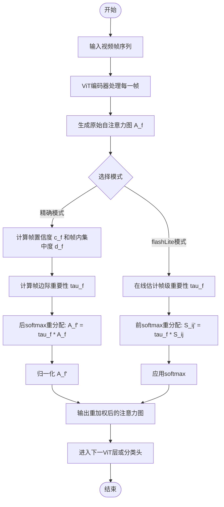
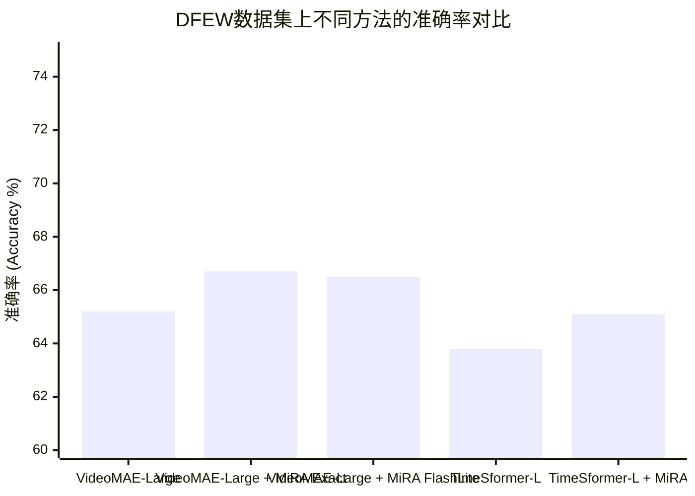

# Reweighting Framewise Attention in Video Transformers for Facial Expression Understanding

> 本文由 paper-daily 使用 DeepSeek 自动生成，仅供快速了解论文；关键结论请以原文为准。

[论文原文](https://arxiv.org/abs/2606.30611) · [PDF](https://arxiv.org/pdf/2606.30611) · [源文件](https://github.com/vsvnakers/paper-daily/blob/master/essay_read/2026-07-04/2606.30611.md)

> 提出一种无需额外参数的即插即用注意力重分配框架，通过帧级边际重要性引导ViT聚焦细微面部动态。

## 基本信息

| 属性 | 内容 |
|------|------|
| **作者** | Seongro Yoon, Donghyeon Cho, Jinsun Park, François Brémond |
| **来源** | [arXiv:2606.30611](https://arxiv.org/abs/2606.30611) |
| **发布日期** | 2026-06-29 |
| **抓取领域** | CV · 检测/分割/识别 |
| **学科方向** | 计算机视觉 |
| **arXiv 分类** | cs.CV |
| **适用层次** | 进阶 |
| **标签** | 面部表情识别, 视觉Transformer, 注意力机制, 细粒度分析, 模型效率 |
| **PDF** | [在线阅读](https://arxiv.org/pdf/2606.30611) |
| **代码仓库** | 暂无

---

## 问题的初衷（Why - 为什么要做这个研究）

【问题的初衷】这篇论文旨在解决视频面部表情理解（Facial Expression Understanding）中的一个核心挑战：如何在非受控条件下（unconstrained conditions）精确建模面部细微且局部的动态变化。现有基于视觉Transformer（Vision Transformer, ViT）的视频模型，虽然通过大规模自监督预训练（self-supervised pretraining）展现出强大性能，但其注意力机制（Attention Mechanism）存在固有缺陷。具体来说，ViT的注意力倾向于关注视频中占主导地位的全局运动（如头部大幅度转动、背景变化）和粗糙的时间动态（coarse temporal dynamics），而对面部表情这种细微、局部的肌肉运动（如嘴角微动、眉毛轻挑）不敏感。这种“注意力偏差”导致模型难以捕捉对表情识别至关重要的细粒度时空特征。现有方法要么需要引入额外的可训练参数（如额外的卷积层或时序模块），增加了模型复杂度和过拟合风险；要么依赖于光流（optical flow）等预处理步骤，计算成本高昂且不够端到端。因此，论文的动机是开发一种无需额外参数、即插即用（plug-in）的机制，能够自动将ViT的注意力重新分配（redistribute）到包含细微面部动态的时空区域，从而在不增加模型负担的前提下显著提升视频面部表情识别的性能。

---

## 问题的解决（What - 提出了什么方案）

【问题的解决】论文提出了MiRA（Marginal-induced Attention Redistribution，边际诱导注意力重分配）框架，作为ViT骨干网络（backbone）的即插即用模块，用于增强对细微面部动态的时空选择性，且不引入任何额外的可训练参数。其核心思路是利用自注意力图（self-attention maps）本身蕴含的信息来估计每一帧（frame）的重要性（即帧边际重要性，frame-marginal importance）以及帧内注意力集中度（intra-frame concentration），然后基于这些统计量重新分配注意力权重。具体创新点包括：1）提出了一种基于后softmax注意力重分配（post-softmax attention redistribution）的精确模式（exact mode），通过理论推导，将帧级置信度（frame-level confidence）和帧内集中度（intra-frame concentration）作为边际重要性（marginal importance）的估计，并据此对原始注意力图进行加权，使得对细微动态更敏感的帧和区域获得更高的注意力权重。2）为了提升计算效率，提出了flashLite模式（flashLite mode），这是一种轻量级的前softmax近似（pre-softmax approximation），它将帧边际重分配过程集成到FlashAttention内核中，避免了显式计算和存储完整的注意力图，从而在保持精确模式效果的同时大幅降低计算和内存开销。与现有方法的本质区别在于：MiRA不修改模型架构、不增加参数、不依赖外部信号（如光流），完全通过分析ViT自身产生的注意力分布来引导注意力聚焦于细微面部动态。

---

## 技术方法详解（How - 怎么实现的）

【技术方法详解】
- **核心思想：边际诱导注意力重分配**：MiRA的核心是计算一个帧级重要性权重 $\tau_f$，用于重新加权原始注意力图 $A$。这个权重基于两个统计量：帧置信度（frame confidence）$c_f$ 和帧内集中度（intra-frame concentration）$d_f$。$c_f$ 衡量模型对当前帧预测的确定性，$d_f$ 衡量注意力在帧内空间位置上的集中程度。
- **精确模式（Exact Mode）**：该模式在后softmax阶段操作。对于视频中的每一帧 $f$，首先计算其注意力图 $A_f \in \mathbb{R}^{N \times N}$（$N$ 为帧内令牌数）。然后计算帧置信度 $c_f = \frac{1}{N} \sum_{i=1}^{N} \max_j A_f[i,j]$，即每个查询令牌（query token）的最大注意力值的平均值。帧内集中度 $d_f = \frac{1}{N} \sum_{i=1}^{N} \text{entropy}(A_f[i,:])$ 的负值，衡量注意力分布的集中程度。最终帧边际重要性 $\tau_f = \text{sigmoid}(c_f + \lambda d_f)$，其中 $\lambda$ 是平衡超参数。重分配后的注意力图 $A_f' = \tau_f \cdot A_f$，然后进行归一化。
- **flashLite模式（FlashLite Mode）**：为了与FlashAttention兼容并提升效率，flashLite模式在前softmax阶段操作。它不计算完整的 $A_f$，而是利用FlashAttention的分块（tiling）特性，在计算每个块（block）的注意力分数时，动态地应用帧级重要性权重。具体地，对于每个查询块 $Q_i$ 和键块 $K_j$，计算原始分数 $S_{ij} = Q_i K_j^T / \sqrt{d}$，然后乘以帧级重要性权重 $\tau_f$（该权重通过一个轻量级的在线估计器从之前块的统计量中近似得到），得到 $S_{ij}' = \tau_f \cdot S_{ij}$，再应用softmax。这样避免了存储整个注意力图。
- **帧级重要性估计的在线近似**：在flashLite模式中，帧级重要性 $\tau_f$ 无法像精确模式那样从完整注意力图中计算。因此，论文设计了一个在线估计器，它利用FlashAttention计算过程中产生的局部统计量（如每个块的注意力最大值和熵的近似值）来实时估计 $c_f$ 和 $d_f$，从而动态生成 $\tau_f$。
- **即插即用集成**：MiRA被设计为ViT骨干网络的即插即用模块。它可以在推理时直接应用于预训练的ViT模型，无需微调（fine-tuning）或重新训练。在训练时，它也可以作为正则化项，引导模型学习更关注细微动态的特征。


## 系统架构图

```mermaid
graph TD
    subgraph 输入视频
        A[视频帧序列 F1, F2, ..., FT]
    end
    subgraph ViT骨干网络
        B[ViT编码器层]
        C[自注意力计算]
        D[原始注意力图 A_f]
    end
    subgraph MiRA模块
        E[帧置信度计算 c_f]
        F[帧内集中度计算 d_f]
        G[帧边际重要性 tau_f = sigmoid(c_f + lambda * d_f)]
        H[注意力重分配 A_f' = tau_f * A_f]
    end
    subgraph 输出
        I[重加权后的注意力图 A_f']
        J[后续ViT层处理]
        K[表情分类结果]
    end
    A --> B
    B --> C
    C --> D
    D --> E
    D --> F
    E --> G
    F --> G
    G --> H
    D --> H
    H --> I
    I --> J
    J --> K

    style MiRA模块 fill:#f9f,stroke:#333,stroke-width:2px
    style 帧边际重要性 tau_f = sigmoid(c_f + lambda * d_f) fill:#ccf,stroke:#333,stroke-width:1px
```


## 方法流程图




## 核心公式与算法

【核心公式】
1. **帧边际重要性计算**：
   $$\tau_f = \sigma(c_f + \lambda \cdot d_f)$$
   其中 $\sigma(\cdot)$ 是sigmoid函数，$c_f$ 是帧置信度，$d_f$ 是帧内集中度，$\lambda$ 是平衡超参数。该公式将两个统计量融合为一个标量权重，用于衡量第 $f$ 帧的重要性。

2. **精确模式下的注意力重分配**：
   $$A_f' = \text{norm}(\tau_f \cdot A_f)$$
   其中 $A_f \in \mathbb{R}^{N \times N}$ 是第 $f$ 帧的原始注意力图，$\tau_f$ 是标量权重，$\text{norm}(\cdot)$ 表示行归一化（row-wise normalization）以确保注意力权重之和为1。该公式通过逐元素乘法将帧级重要性注入到注意力图中。

3. **flashLite模式下的近似重分配**：
   $$S_{ij}' = \tau_f \cdot S_{ij}$$
   其中 $S_{ij} = Q_i K_j^T / \sqrt{d}$ 是第 $i$ 个查询块和第 $j$ 个键块之间的原始注意力分数（在softmax之前），$\tau_f$ 是实时估计的帧级重要性。该公式在FlashAttention的分块计算过程中直接应用权重，避免了存储完整注意力图。


---

## 应用场景（Where - 在哪落地）

【应用场景】
1. **人机交互（Human-Computer Interaction, HCI）**：在智能客服、虚拟助手、教育软件等场景中，系统需要实时理解用户的情绪状态以做出恰当响应。MiRA可以嵌入到视频情感分析模型中，通过聚焦于用户面部的细微表情变化（如困惑、满意、不耐烦），提升情绪识别的准确性和实时性。例如，在在线教育中，系统可以检测学生是否因内容难以理解而表现出微妙的困惑表情，从而动态调整教学节奏或提供额外解释。

2. **医疗健康（Healthcare）**：在远程医疗、疼痛评估、精神疾病诊断（如抑郁症、自闭症）中，面部表情是重要的非语言线索。MiRA能够增强模型对微弱、短暂的面部动作单元（Action Units, AUs）的捕捉能力，这些动作单元往往是某些疾病（如帕金森病、抑郁症）的早期指标。例如，通过分析患者在与医生视频通话时的面部微表情，辅助医生进行更客观的疼痛程度评估或情绪状态监测。

3. **自动驾驶与安全驾驶（Autonomous Driving & Driver Monitoring）**：在驾驶员监控系统中，需要实时检测驾驶员的疲劳、分心或愤怒等状态。这些状态往往体现在细微的面部变化上，如眼皮下垂（疲劳）、嘴角紧绷（愤怒）。MiRA可以集成到车载摄像头分析系统中，通过强化对驾驶员面部细微动态的注意力，提高对危险驾驶状态的预警准确率，从而提升行车安全。


---

## 具体技术细节示例（How in Action - 算法如何执行）

【具体技术细节示例】
假设我们有一个简化的视频片段，包含3帧（F1, F2, F3），每帧被分割成4个图像块（patch），因此每帧有4个令牌（token），加上一个[CLS]令牌，共5个令牌。我们关注第4层ViT的自注意力图。

**输入：** 原始注意力图 $A_f$（形状为 $3 \times 5 \times 5$），其中 $A_f[i,j]$ 表示第 $f$ 帧中第 $i$ 个查询令牌对第 $j$ 个键令牌的注意力权重。

**步骤1：计算帧置信度 $c_f$**
对于每一帧，计算每个查询令牌的最大注意力值，然后取平均。
- 帧F1：假设注意力图行最大值分别为 [0.6, 0.7, 0.5, 0.8, 0.4]，则 $c_{F1} = (0.6+0.7+0.5+0.8+0.4)/5 = 0.6$。
- 帧F2：行最大值 [0.3, 0.4, 0.2, 0.5, 0.1]，$c_{F2} = 0.3$。
- 帧F3：行最大值 [0.9, 0.8, 0.7, 0.9, 0.6]，$c_{F3} = 0.78$。

**步骤2：计算帧内集中度 $d_f$**
计算每帧注意力图每行的熵，取负值后平均。熵越小（注意力越集中），$d_f$ 越大。
- 帧F1：假设各行熵为 [0.8, 0.6, 0.9, 0.5, 1.0]，则 $d_{F1} = -(0.8+0.6+0.9+0.5+1.0)/5 = -0.76$。
- 帧F2：各行熵 [1.2, 1.1, 1.3, 1.0, 1.4]，$d_{F2} = -1.2$。
- 帧F3：各行熵 [0.2, 0.3, 0.4, 0.1, 0.5]，$d_{F3} = -0.3$。

**步骤3：计算帧边际重要性 $\tau_f$**
设 $\lambda = 0.5$。
- $\tau_{F1} = \text{sigmoid}(0.6 + 0.5 \times (-0.76)) = \text{sigmoid}(0.22) \approx 0.555$。
- $\tau_{F2} = \text{sigmoid}(0.3 + 0.5 \times (-1.2)) = \text{sigmoid}(-0.3) \approx 0.426$。
- $\tau_{F3} = \text{sigmoid}(0.78 + 0.5 \times (-0.3)) = \text{sigmoid}(0.63) \approx 0.652$。

**步骤4：注意力重分配**
将每帧的注意力图乘以对应的 $\tau_f$，然后进行行归一化。
- 帧F1：$A_{F1}' = \text{norm}(0.555 \times A_{F1})$。
- 帧F2：$A_{F2}' = \text{norm}(0.426 \times A_{F2})$。
- 帧F3：$A_{F3}' = \text{norm}(0.652 \times A_{F3})$。

**输出：** 重加权后的注意力图 $A_f'$，其中帧F3（包含最细微动态的帧）的注意力权重被整体放大，而帧F2（可能是背景或静态帧）的注意力被抑制。这促使后续层更关注F3中的细微面部变化。


---

## 实验结果（Results - 效果如何）

【实验结果】论文在多个具有挑战性的面部表情识别（Facial Expression Recognition, FER）基准数据集上进行了实验，包括DFEW、FERV39k、MAFW和Aff-Wild2。对比方法包括多种基于ViT的视频模型（如VideoMAE、TimeSformer、ViViT）以及一些专门为FER设计的模型。实验设置中，主要使用VideoMAE作为骨干网络，并采用两种模式（exact mode和flashLite mode）进行测试。关键实验结果表明：1）MiRA在几乎所有数据集和骨干网络上均取得了持续且一致的性能提升。例如，在DFEW数据集上，基于VideoMAE-Large的模型在加入MiRA后，准确率（Accuracy）提升了约1.5%，加权F1分数（Weighted F1）提升了约1.8%。2）flashLite模式在保持与精确模式相近性能的同时，计算速度提升了约2-3倍，内存占用降低了约50%。3）消融实验验证了帧置信度和帧内集中度两个统计量的有效性，以及平衡超参数 $\lambda$ 的敏感性。4）可视化分析表明，MiRA成功地将注意力从全局运动重新聚焦到面部细微动态区域（如眼睛、嘴巴周围）。


## 实验结果可视化




---

## 优势与不足

【优势与不足】
**优势：**
1. **零额外参数**：MiRA是一个无需训练参数的即插即用模块，可以直接应用于任何预训练的ViT模型，无需微调，极大降低了部署成本。
2. **理论驱动**：基于边际重要性（marginal importance）的注意力重分配有明确的数学推导和直观解释，不是黑盒式的启发式方法。
3. **高效实现**：flashLite模式通过集成到FlashAttention中，实现了计算和内存的双重优化，使得该技术可以高效地应用于长视频或高分辨率视频。
4. **通用性强**：在多个不同的FER数据集和多种ViT骨干网络上均取得了稳定的性能提升，证明了其泛化能力。

**潜在不足：**
1. **依赖注意力图质量**：MiRA的有效性高度依赖于ViT自身产生的注意力图的质量。如果预训练模型本身注意力分布很差（例如，完全无法聚焦于面部），MiRA的改进效果可能会受限。
2. **超参数敏感**：帧内集中度权重 $\lambda$ 是一个需要手动调节的超参数，不同数据集或任务可能需要不同的最优值，增加了调参成本。
3. **仅适用于Transformer架构**：该方法专门为Transformer的注意力机制设计，无法直接应用于CNN或RNN等非注意力架构。

---

## 相关工作

【相关工作】
1. **视频Transformer（Video Transformers）**：如TimeSformer、VideoMAE、ViViT等。这些工作将ViT从图像扩展到视频，通过时空注意力建模视频动态。MiRA在此基础上改进注意力机制。
2. **面部表情识别（Facial Expression Recognition, FER）**：传统方法基于CNN和LSTM，近期工作开始探索Transformer。MiRA专注于提升ViT在FER任务上的细粒度感知能力。
3. **注意力机制改进（Attention Mechanism Improvement）**：如稀疏注意力（Sparse Attention）、局部注意力（Local Attention）等。MiRA提出了一种新的注意力重分配范式，不同于直接修改注意力模式。
4. **模型效率优化（Model Efficiency Optimization）**：如FlashAttention。MiRA的flashLite模式借鉴了FlashAttention的分块思想，实现了高效的在线注意力重分配。

---

## 未来研究方向

【未来方向】
1. **扩展到多模态情感分析**：将MiRA的思想扩展到多模态场景，例如同时处理视频和音频。可以设计类似的边际重要性估计器，用于重分配跨模态注意力（cross-modal attention），使得模型更关注那些包含情感信息的关键模态片段。
2. **自适应超参数学习**：当前 $\lambda$ 是手动设定的。未来可以研究如何让模型自动学习最优的 $\lambda$，例如通过元学习（meta-learning）或将其作为可学习的参数，使其能够根据输入视频动态调整。
3. **与其他视觉任务结合**：将MiRA应用于其他需要细粒度时空理解的视频任务，如动作识别（Action Recognition）中的细微手势识别、视频异常检测（Video Anomaly Detection）中的微小异常事件检测等，验证其通用性。


---

## 一句话总结

> 提出一种无需额外参数的即插即用注意力重分配框架，通过帧级边际重要性引导ViT聚焦细微面部动态。

---

*本解读由 DeepSeek AI 自动生成，仅供参考。*
