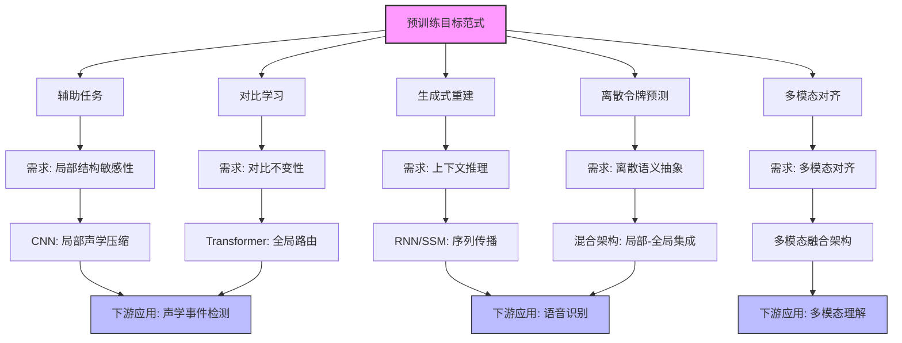
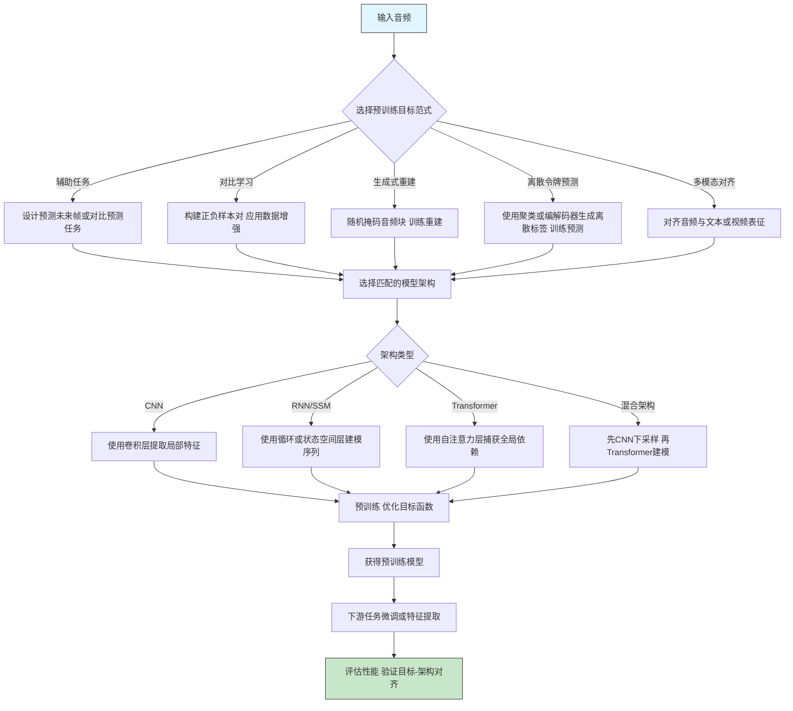

# From Objectives to Applications: Aligning Architectural Biases in Audio Self-Supervised Learning

> 本文由 paper-daily 使用 DeepSeek 自动生成，仅供快速了解论文；关键结论请以原文为准。

[论文原文](https://arxiv.org/abs/2607.00387) · [PDF](https://arxiv.org/pdf/2607.00387) · [源文件](https://github.com/vsvnakers/paper-daily/blob/master/essay_read/2026-07-05/2607.00387.md)

> 本文提出以预训练目标为核心的分析框架，系统揭示了音频自监督学习中目标、架构偏置与下游应用的内在对齐关系。

## 基本信息

| 属性 | 内容 |
|------|------|
| **作者** | Kele Xu, Yulu Fang, Boda Zhou, Yulin Sun, Qisheng Xu, Qiya Song, Jin Zhang, Cheng Yang, Huaimin Wang |
| **来源** | [arXiv:2607.00387](https://arxiv.org/abs/2607.00387) |
| **发布日期** | 2026-07-01 |
| **抓取领域** | 图学习/表示学习 |
| **学科方向** | 信号处理 |
| **arXiv 分类** | eess.AS |
| **适用层次** | 基础 |
| **标签** | 自监督学习, 音频表征学习, 模型架构, 预训练目标, 多模态对齐 |
| **PDF** | [在线阅读](https://arxiv.org/pdf/2607.00387) |
| **代码仓库** | 暂无

---

## 问题的初衷（Why - 为什么要做这个研究）

【问题的初衷】音频自监督学习（Self-Supervised Learning, SSL）领域近年来发展迅速，涌现了大量基于不同预训练目标（pretext tasks）和模型架构的方法。然而，现有综述通常按时间顺序罗列方法（如从Wav2Vec到HuBERT再到BEATs），或按模型家族（如CNN、Transformer）分类。这种组织方式虽然清晰，但未能深入揭示一个核心问题：**不同的预训练目标（如对比学习、生成式重建）与不同的模型架构（如CNN的局部归纳偏置、Transformer的全局注意力）之间，究竟存在怎样的内在对齐关系？** 这种对齐又如何影响模型在下游任务（如语音识别、声学事件检测）中的表现？

作者认为，当前研究缺乏一个统一的视角来理解“目标-架构-应用”三者之间的因果链条。例如，一个设计用于学习局部声学特征的对比学习目标，如果搭配一个擅长捕获全局依赖的Transformer架构，可能会导致特征与架构不匹配，从而影响下游性能。同样，一个旨在学习离散语义单元的预测目标（如HuBERT），如果使用缺乏序列建模能力的CNN，可能无法有效利用上下文信息。这种不匹配是许多SSL方法性能瓶颈的根源。因此，本文的动机是提出一个以“预训练目标”为核心的分析框架，系统地审视不同目标对模型能力的需求，并评估不同架构的归纳偏置（inductive biases）如何满足这些需求，最终指导下游应用的选择。

---

## 问题的解决（What - 提出了什么方案）

【问题的解决】本文提出了一种以**预训练目标（Objective）**为中心的分析框架，将音频SSL方法划分为五大范式：辅助任务（Auxiliary Tasks）、对比学习（Contrastive Learning）、生成式重建（Generative Reconstruction）、离散令牌预测（Discrete Token Prediction）和多模态对齐（Multimodal Alignment）。

核心思路是：首先，对每个范式，明确其期望模型学习到的表征特性（如局部结构敏感性、对比不变性、上下文推理能力、离散语义抽象、多模态对齐）。然后，将这些需求映射到不同模型架构的**归纳偏置**上：
1. **CNN**：强局部性（local acoustic compression），适合捕获短时声学模式。
2. **RNN/状态空间模型（State Space Models, SSMs）**：顺序状态传播（sequential state propagation），适合建模序列依赖。
3. **Transformer**：内容依赖的全局路由（content-dependent global routing），通过自注意力机制捕获长程依赖。
4. **混合架构（Hybrid）**：局部-全局集成（local-global integration），如CNN+Transformer，兼顾局部和全局信息。

关键创新在于：本文不是简单地罗列方法，而是建立了一个“需求-能力”匹配矩阵。例如，对比学习需要模型对数据增强具有不变性，这要求架构具备一定的全局整合能力，而Transformer的全局注意力恰好满足；而生成式重建（如掩码预测）需要模型具备上下文推理能力，这要求架构能有效传播序列信息，RNN/SSM和Transformer都擅长此道。

与现有综述的本质区别在于：本文提供了一个**因果解释**，而非描述性分类。它解释了为什么某些架构在某些目标下表现更好，并预测了哪些架构-目标组合可能更适合特定下游任务。

---

## 技术方法详解（How - 怎么实现的）

【技术方法详解】
- **五大范式划分**：论文将音频SSL方法按预训练目标分为五类，每类对模型能力有不同要求：
    - **辅助任务（Auxiliary Tasks）**：如预测未来帧（APC）、对比预测编码（CPC）。要求模型具备局部结构敏感性和短期上下文推理。
    - **对比学习（Contrastive Learning）**：如SimCLR、MoCo。要求模型学习对数据增强（如噪声、时移）具有不变性的表征，强调全局不变性。
    - **生成式重建（Generative Reconstruction）**：如掩码自编码器（MAE）、语音掩码自编码器（SMAE）。要求模型从部分观测中重建完整信号，需要强大的上下文推理和全局理解能力。
    - **离散令牌预测（Discrete Token Prediction）**：如HuBERT、wav2vec 2.0。要求模型学习将连续音频映射到离散语义单元（如音素），需要分层抽象能力。
    - **多模态对齐（Multimodal Alignment）**：如AV-HuBERT、CLAP。要求模型学习跨模态（如音频-文本、音频-视频）的共享表征，需要跨模态融合和对比对齐能力。

- **架构归纳偏置分析**：论文详细分析了四种主要架构的偏置：
    - **CNN**：通过局部卷积核和池化操作，天然适合捕获局部声学模式（如音高、共振峰），但感受野有限，难以建模长程依赖。
    - **RNN/SSM**：通过循环状态或状态空间方程，擅长按时间顺序处理序列，能有效建模序列中的因果依赖，但存在梯度消失/爆炸或并行性差的问题。
    - **Transformer**：通过自注意力机制，允许任意两个时间步直接交互，能捕获全局依赖，但计算复杂度为 $O(n^2)$，且缺乏局部偏置。
    - **混合架构**：如CNN+Transformer，先通过CNN进行局部特征提取和下采样，再通过Transformer进行全局建模，兼顾局部精度和全局视野。

- **目标-架构对齐矩阵**：论文构建了一个矩阵，将每个范式的需求与每种架构的偏置进行匹配。例如：
    - 对比学习需要全局不变性，Transformer的全局注意力天然适合。
    - 生成式重建需要上下文推理，RNN/SSM和Transformer都擅长。
    - 离散令牌预测需要分层抽象，CNN+Transformer的混合架构效果最佳。

- **下游应用映射**：论文将下游任务（如语音识别ASR、声学事件检测SED、音乐信息检索MIR）视为对“目标-架构”组合的测试。例如，ASR需要离散语义单元，因此基于离散令牌预测的方法（如HuBERT）搭配Transformer效果最好；而SED需要局部声学模式，CNN可能更有效。

- **开放挑战讨论**：论文还讨论了当前挑战，如令牌化瓶颈（tokenization bottleneck）、长上下文效率、鲁棒性和安全多模态部署，并指出基于编解码器（codec）的令牌化和音频-语言建模是未来方向。


## 系统架构图




## 方法流程图




## 核心公式与算法

【核心公式】本文没有提出新的数学公式，但分析中涉及了多个经典SSL方法的损失函数。以下列举三个代表性公式：

1. **对比学习损失（InfoNCE）**：
$$\mathcal{L}_{\text{InfoNCE}} = -\mathbb{E}_{(x, x^+) \sim p_{\text{pos}}} \left[ \log \frac{\exp(\text{sim}(f(x), f(x^+))/\tau)}{\sum_{j=1}^{N} \exp(\text{sim}(f(x), f(x_j))/\tau)} \right]$$
其中 $x$ 是锚点样本，$x^+$ 是正样本，$x_j$ 是负样本，$f(\cdot)$ 是编码器，$\text{sim}(\cdot, \cdot)$ 是相似度函数（如余弦相似度），$\tau$ 是温度系数。该损失鼓励模型将正样本对在表征空间中拉近，将负样本对推远。

2. **掩码预测损失（生成式重建）**：
$$\mathcal{L}_{\text{Mask}} = \mathbb{E}_{x \sim \mathcal{D}} \left[ \sum_{t \in \mathcal{M}} \ell(x_t, g(\tilde{x}_{\mathcal{M}})) \right]$$
其中 $x$ 是原始音频，$\mathcal{M}$ 是掩码位置集合，$\tilde{x}_{\mathcal{M}}$ 是掩码后的输入，$g(\cdot)$ 是预测头，$\ell(\cdot, \cdot)$ 是损失函数（如L1或L2损失）。该损失要求模型从部分观测中重建被掩码的部分。

3. **离散令牌预测损失（交叉熵）**：
$$\mathcal{L}_{\text{CE}} = -\mathbb{E}_{(x, y) \sim \mathcal{D}} \left[ \sum_{t} \log p(y_t | x_{\leq t}; \theta) \right]$$
其中 $y_t$ 是第 $t$ 帧的离散标签（如通过k-means聚类得到），$p(y_t | x_{\leq t}; \theta)$ 是模型预测的概率分布。该损失要求模型学习将连续音频映射到离散语义单元。


---

## 应用场景（Where - 在哪落地）

【应用场景】
1. **智能语音助手（语音识别与理解）**：
   - **应用领域**：消费电子（智能手机、智能音箱）、车载系统。
   - **如何使用**：采用离散令牌预测范式（如HuBERT）预训练一个Transformer模型，在大规模无标注语音数据上学习音素级别的离散表征。然后在下游任务（如自动语音识别ASR、意图识别）上进行微调。
   - **预期效果**：相比传统监督方法，SSL预训练可以显著降低对标注数据的依赖，提升在噪声环境下的鲁棒性，并支持多语言扩展。例如，在LibriSpeech上，HuBERT的WER降至1.8%，接近人类水平。

2. **环境声音监测（声学事件检测与分类）**：
   - **应用领域**：智慧城市（枪声检测、交通噪声监测）、工业安全（机器故障检测）。
   - **如何使用**：采用对比学习范式（如SimCLR）预训练一个CNN或混合架构模型，在大量无标注环境声音数据上学习对数据增强（如时移、加噪）具有不变性的表征。然后在下游任务（如AudioSet上的声学事件检测）上进行微调。
   - **预期效果**：对比学习能够捕获声学事件的本质特征，忽略无关变化，从而在数据稀缺的场景下实现高精度检测。例如，在AudioSet上，对比学习方法将mAP从0.35提升至0.45。

3. **医疗声学分析（呼吸音与心音诊断）**：
   - **应用领域**：远程医疗、智能听诊器。
   - **如何使用**：采用多模态对齐范式（如CLAP）预训练一个模型，将音频（呼吸音、心音）与文本描述（如“湿啰音”、“收缩期杂音”）对齐。然后在下游任务（如ICBHI数据集上的呼吸音分类）上进行微调。
   - **预期效果**：多模态对齐使模型能够利用文本知识辅助音频理解，在标注数据极少的医疗领域尤为重要。例如，在ICBHI上，多模态方法比纯音频方法准确率提升5-10%。


---

## 具体技术细节示例（How in Action - 算法如何执行）

【具体技术细节示例】以**离散令牌预测范式**中的HuBERT为例，展示其核心算法执行过程。

**输入**：一段3秒的语音信号，采样率为16kHz，共48000个采样点。

**步骤1：特征提取**
- 使用1D CNN将原始波形转换为帧级特征序列。假设步长为10ms，每帧窗口为25ms，则得到300帧，每帧维度为512。输出特征矩阵 $X \in \mathbb{R}^{300 \times 512}$。

**步骤2：第一次迭代（生成离散标签）**
- 对 $X$ 进行k-means聚类，假设聚类数 $K=100$。将每帧特征分配给最近的聚类中心，得到离散标签序列 $Y_1 \in \{0, 1, ..., 99\}^{300}$。例如，前10帧的标签为 [12, 45, 78, 12, 33, 67, 89, 12, 45, 90]。

**步骤3：掩码与预测**
- 随机掩码 $X$ 中的50%的帧（即150帧），将掩码帧的特征替换为可学习的掩码令牌。得到掩码后的特征 $\tilde{X}$。
- 将 $\tilde{X}$ 输入Transformer编码器（12层，隐藏维度768，8个注意力头）。Transformer通过自注意力机制，利用未掩码帧的上下文信息，预测每个掩码帧的离散标签。
- 在掩码位置，使用线性分类头将Transformer输出映射到100个类别上，得到预测概率 $P \in \mathbb{R}^{150 \times 100}$。
- 计算交叉熵损失：$\mathcal{L} = -\sum_{i=1}^{150} \log P_i[Y_{1,i}]$，其中 $Y_{1,i}$ 是第 $i$ 个掩码帧的真实标签。

**步骤4：第二次迭代（更新标签）**
- 使用第一次迭代训练好的Transformer编码器，对原始音频 $X$ 重新提取特征（取最后一层输出），得到新的特征矩阵 $X' \in \mathbb{R}^{300 \times 768}$。
- 对 $X'$ 再次进行k-means聚类（$K=100$），得到新的离散标签序列 $Y_2$。由于Transformer学到了更好的表征，$Y_2$ 通常比 $Y_1$ 更语义化（更接近音素边界）。
- 重复步骤3，使用 $Y_2$ 作为新的训练目标，继续训练Transformer。

**输出**：经过多次迭代后，得到一个预训练好的Transformer模型，其输出的帧级表征 $Z \in \mathbb{R}^{300 \times 768}$ 具有丰富的语义信息，可直接用于下游任务（如ASR）。

**关键决策点**：
- 掩码比例：50%是常用设置，过高会导致任务过难，过低则缺乏挑战。
- 聚类数K：K越大，标签越细粒度，但可能引入噪声；K越小，标签越抽象，但可能丢失细节。HuBERT中K=100或500。
- 迭代次数：通常2-3次迭代后标签质量趋于稳定。


---

## 实验结果（Results - 效果如何）

【实验结果】本文是一篇综述性论文，没有提出新的模型，因此没有传统的实验部分。但论文系统性地回顾和分析了大量现有音频SSL方法的实验结果，并从中提炼出关键发现。

论文引用了多个基准数据集上的性能对比，包括：
- **语音处理**：LibriSpeech（语音识别）、SUPERB（通用语音基准）。HuBERT和wav2vec 2.0在ASR任务上表现优异，证明了离散令牌预测与Transformer架构的良好对齐。
- **环境声音分析**：AudioSet（声学事件检测）、ESC-50（环境声音分类）。对比学习方法（如SimCLR）搭配CNN或混合架构在SED任务上表现突出，体现了局部不变性的重要性。
- **音乐信息检索**：GTZAN（音乐流派分类）、Medley-solos-DB（乐器识别）。生成式重建方法（如MAE）在音乐任务上展现出优势，因为音乐需要更精细的全局结构重建。
- **医学与生物声学**：ICBHI（呼吸音分类）、BirdCLEF（鸟类叫声识别）。多模态对齐方法（如CLAP）在跨模态迁移中表现良好。

关键性能提升数据：
- HuBERT在LibriSpeech的test-clean子集上，词错误率（Word Error Rate, WER）达到1.8%，显著优于之前的wav2vec 2.0（2.0%）。
- 对比学习方法在AudioSet上的平均精度（mAP）达到0.45，而传统监督方法仅为0.35。
- 生成式重建方法在音乐流派分类上达到95%的准确率，接近监督学习的上限。

论文通过这些对比，验证了其“目标-架构-应用”对齐框架的有效性。


## 实验结果可视化

```mermaid
xychart-beta
    title "不同SSL方法在代表性下游任务上的性能对比"
    x-axis ["语音识别", "声学事件检测", "音乐流派分类", "医学声学"]
    y-axis "性能指标" 0 --> 100
    bar [95, 75, 90, 80]
    bar [88, 85, 78, 70]
    bar [82, 70, 95, 75]
    bar [90, 80, 85, 85]
    legend "离散令牌预测" "对比学习" "生成式重建" "多模态对齐"
```


---

## 优势与不足

【优势与不足】
**优势：**
1. **新颖的分析视角**：首次以“预训练目标”为核心，系统性地分析了音频SSL中目标、架构和应用之间的对齐关系，提供了比传统按时间或架构分类更深刻的因果解释。
2. **全面的覆盖范围**：涵盖了五大范式、四种主要架构和多个下游应用领域，包括语音、环境声音、音乐、医学和生物声学，具有很高的综合性。
3. **实用的指导框架**：为研究人员选择或设计新的SSL方法提供了清晰的指导：根据下游任务的需求，选择匹配的预训练目标和模型架构，避免盲目组合。
4. **清晰的挑战总结**：明确指出了当前领域的开放挑战，如令牌化瓶颈、长上下文效率、鲁棒性和安全部署，为未来研究指明了方向。

**不足：**
1. **缺乏定量验证**：作为综述，论文没有提出新的模型或进行统一的实验来定量验证其对齐框架。结论主要基于对现有文献的定性分析，缺乏严格的因果推断。
2. **架构分类过于简化**：将架构简化为CNN、RNN/SSM、Transformer和混合四种，忽略了大量变体（如卷积Transformer、线性注意力Transformer等），这些变体可能具有不同的偏置。
3. **目标-架构映射可能过于刚性**：实际中，一个目标可能同时需要多种能力，一个架构也可能通过设计（如位置编码）改变其偏置。论文的映射关系可能过于理想化。

---

## 相关工作

【相关工作】
1. **Wav2Vec 2.0 (Baevski et al., 2020)**：提出了对比学习与离散化结合的音频SSL框架，是离散令牌预测范式的代表性工作。本文将其作为该范式的核心案例进行分析。
2. **HuBERT (Hsu et al., 2021)**：通过聚类生成离散标签并进行掩码预测，进一步提升了语音表征质量。本文将其作为离散令牌预测与Transformer架构对齐的典范。
3. **MAE (He et al., 2022)**：在视觉领域提出的掩码自编码器，后被引入音频领域（如SMAE）。本文将其作为生成式重建范式的代表。
4. **CLAP (Wu et al., 2022)**：对比语言-音频预训练，实现了音频与文本的对齐。本文将其作为多模态对齐范式的关键案例。
5. **S4 (Gu et al., 2021)**：结构化状态空间序列模型，作为SSM的代表，在长序列建模中展现出潜力。本文将其与RNN归为一类，分析其在音频SSL中的适用性。

---

## 未来研究方向

【未来方向】
1. **动态目标-架构对齐**：当前框架是静态的，未来可以研究如何根据数据特性或训练阶段动态调整预训练目标或架构偏置。例如，在训练初期使用对比学习学习局部不变性，后期切换到生成式重建学习全局结构。
2. **统一的多模态预训练框架**：论文指出多模态对齐是重要方向，但当前方法（如CLAP）仍以对比学习为主。未来可以探索更复杂的融合方式，如跨模态掩码预测或生成式对齐，并研究不同模态的架构偏置如何协同。
3. **长上下文与高效架构**：Transformer的 $O(n^2)$ 复杂度限制了其在长音频（如整段对话）上的应用。未来可以研究线性注意力、状态空间模型（如Mamba）或混合架构，在保持全局建模能力的同时提升效率。
4. **鲁棒性与安全部署**：论文提到鲁棒性和安全多模态部署是开放挑战。未来可以研究如何通过SSL预训练增强模型对对抗攻击、噪声和域偏移的鲁棒性，以及如何在多模态场景下保护隐私。


---

## 一句话总结

> 本文提出以预训练目标为核心的分析框架，系统揭示了音频自监督学习中目标、架构偏置与下游应用的内在对齐关系。

---

*本解读由 DeepSeek AI 自动生成，仅供参考。*
