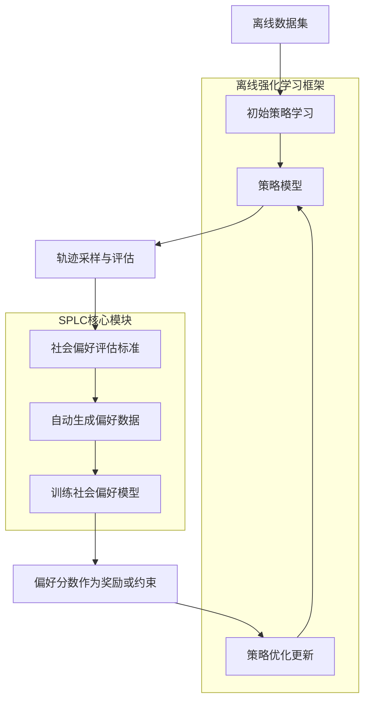
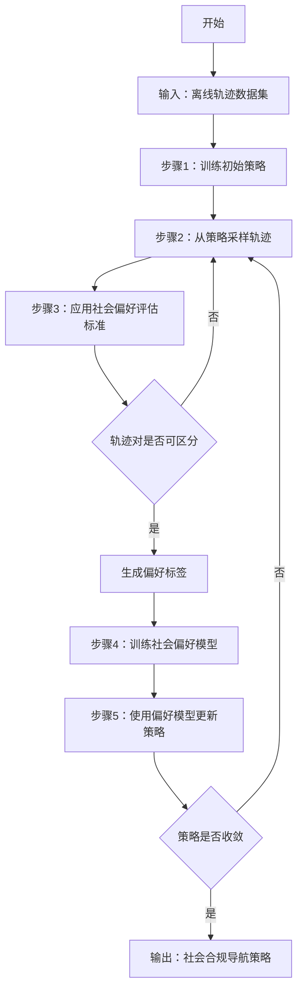
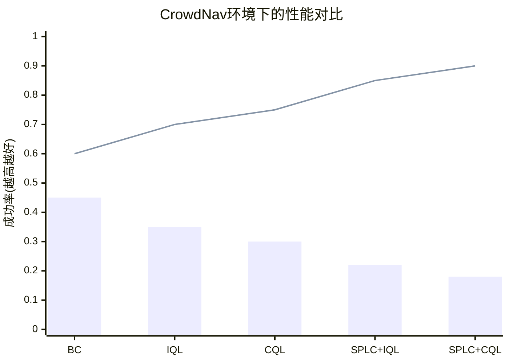

# SPLC: Social Preference Learning for Crowd Robot Navigation

> 本文由 paper-daily 使用 DeepSeek 自动生成，仅供快速了解论文；关键结论请以原文为准。

[论文原文](https://arxiv.org/abs/2607.01925) · [PDF](https://arxiv.org/pdf/2607.01925) · [源文件](https://github.com/vsvnakers/paper-daily/blob/master/essay_read/2026-07-05/2607.01925.md)

> SPLC通过自动生成社会偏好数据，无需手工设计奖励函数，显著提升了离线强化学习在人群机器人导航中的社会合规性。

## 基本信息

| 属性 | 内容 |
|------|------|
| **作者** | Zixuan Chen, Hao Fu, Haiwen Hu, Shiquan Zheng |
| **来源** | [arXiv:2607.01925](https://arxiv.org/abs/2607.01925) |
| **发布日期** | 2026-07-02 |
| **抓取领域** | 强化学习 |
| **学科方向** | 机器人 |
| **arXiv 分类** | cs.RO |
| **适用层次** | 基础 |
| **标签** | 离线强化学习, 社会导航, 偏好学习, 人机共存, 机器人导航 |
| **PDF** | [在线阅读](https://arxiv.org/pdf/2607.01925) |
| **代码仓库** | 暂无

---

## 问题的初衷（Why - 为什么要做这个研究）

【问题的初衷】这篇论文旨在解决人群机器人导航（Crowd Robot Navigation）中，如何让机器人学习符合社会规范（Socially Compliant）的行为，而无需人工设计复杂的奖励函数（Reward Function）。在人类与机器人共存（Human-Robot Coexistence）的场景中，机器人需要在拥挤的人群中安全、高效且礼貌地移动。传统的强化学习（Reinforcement Learning, RL）方法，特别是离线强化学习（Offline RL），虽然潜力巨大，但面临一个核心挑战：设计一个能够准确反映复杂行人动态（Pedestrian Dynamics）和社会规范（Social Norms）的奖励函数极其困难。现有方法要么依赖手工设计的奖励函数，容易产生奖励偏差（Reward Bias），无法泛化到多样化的社交场景；要么需要在线交互，这在真实环境中风险高且成本大。因此，迫切需要一种无需精细奖励设计、能自动学习社会偏好的方法，以提升机器人在真实人群中的导航能力。

---

## 问题的解决（What - 提出了什么方案）

【问题的解决】论文提出了社会偏好学习（Social Preference Learning, SPLC）算法，其核心创新在于引入了一个社会偏好反馈机制（Social Preference Feedback Mechanism）。该机制通过原则性的偏好评估标准（Preference Evaluation Criteria），自动生成偏好数据（Preference Data），从而消除了对详细奖励函数设计的依赖。具体来说，SPLC 不直接学习奖励函数，而是学习一个社会偏好模型（Social Preference Model），该模型能够比较不同机器人行为轨迹的优劣。通过显式地考虑行人动力学的复杂性，SPLC 缓解了奖励偏差，并促进了广泛社会规范的系统量化。该方法与现有的离线强化学习算法（如 IQL、CQL）无缝集成，通过将偏好模型作为奖励信号或约束条件，引导机器人学习更符合社会规范的行为。与现有方法的本质区别在于，SPLC 将奖励设计问题转化为偏好学习问题，利用人类社会的隐含偏好来驱动学习，从而实现了更鲁棒、更通用的社会合规导航。

---

## 技术方法详解（How - 怎么实现的）

【技术方法详解】
- **社会偏好反馈机制**：SPLC 的核心是构建一个偏好模型 $P(\tau_1 \succ \tau_2 | s)$，表示在状态 $s$ 下，轨迹 $\tau_1$ 优于轨迹 $\tau_2$ 的概率。该模型通过自动生成的偏好数据对进行训练，避免了人工标注。
- **偏好数据自动生成**：基于原则性评估标准，如安全性（最小距离）、效率（到达时间）、舒适度（加速度变化）等，对轨迹对进行排序。例如，如果轨迹 $\tau_1$ 与所有行人的最小距离大于 $\tau_2$，则 $\tau_1$ 更优。
- **与离线强化学习集成**：SPLC 可以灵活地与多种离线 RL 算法结合。一种方式是将偏好模型输出的偏好分数作为奖励函数 $r(s,a) = \mathbb{E}_{\tau \sim \pi}[P(\tau \succ \text{reference})]$，另一种方式是将偏好作为约束，优化策略使其行为符合偏好。
- **算法流程**：首先，使用离线数据集训练一个初始策略。然后，通过偏好评估标准生成偏好数据，训练偏好模型。最后，利用偏好模型指导策略优化，迭代更新策略和偏好模型。
- **关键公式**：偏好模型通常采用 Bradley-Terry 模型：$P(\tau_1 \succ \tau_2) = \frac{\exp(\beta \cdot R(\tau_1))}{\exp(\beta \cdot R(\tau_1)) + \exp(\beta \cdot R(\tau_2))}$，其中 $R(\tau)$ 是轨迹的隐含奖励，$\beta$ 是温度参数。SPLC 通过优化偏好数据的对数似然来学习 $R$。

## 系统架构图

## 方法流程图

## 核心公式与算法

【核心公式】
1. **Bradley-Terry 偏好模型**：
   $$P(\tau_i \succ \tau_j) = \frac{\exp(\beta \cdot R(\tau_i))}{\exp(\beta \cdot R(\tau_i)) + \exp(\beta \cdot R(\tau_j))}$$
   该公式定义了轨迹 $\tau_i$ 优于 $\tau_j$ 的概率，其中 $R(\tau)$ 是轨迹的隐含奖励，$\beta$ 控制偏好强度。

2. **偏好数据对数似然优化**：
   $$\mathcal{L}(R) = -\sum_{(\tau_i, \tau_j) \in \mathcal{D}} \log P(\tau_i \succ \tau_j)$$
   通过最小化负对数似然来学习隐含奖励函数 $R$，使得模型能够准确预测偏好。

3. **策略优化目标**：
   $$\max_{\pi} \mathbb{E}_{\tau \sim \pi} [R(\tau)] - \alpha \cdot D_{KL}(\pi || \pi_{\text{offline}})$$
   在离线 RL 框架下，策略 $\pi$ 的目标是最大化由偏好模型提供的隐含奖励 $R(\tau)$，同时通过 KL 散度约束保持与离线数据分布 $\pi_{\text{offline}}$ 的接近，防止分布外动作。

---

## 应用场景（Where - 在哪落地）

【应用场景】
1. **服务机器人导航**：在商场、医院、机场等公共场所，服务机器人需要穿梭于人群之中。SPLC 可以使机器人学习到何时让行、如何保持安全距离、如何从侧面接近人等社会规范，从而避免碰撞和引起不适。例如，在繁忙的医院走廊，机器人可以自动学习到在推车经过时靠边等待，而不是强行通过。
2. **自动驾驶汽车的行人交互**：在自动驾驶中，车辆与行人的交互至关重要。SPLC 可以应用于学习车辆在无信号灯路口、人行横道等场景下的社会行为。例如，车辆可以学习到在行人犹豫是否过马路时，减速并给出明确的让行信号，而不是机械地等待或加速。
3. **仓储物流机器人协同**：在仓库中，多台自动导引车（AGV）和人类工人需要共享空间。SPLC 可以帮助 AGV 学习到在狭窄通道中如何礼貌地避让工人，以及在交叉路口如何协调通行，从而提高整体效率和安全性。

---

## 具体技术细节示例（How in Action - 算法如何执行）

【具体技术细节示例】
假设我们有一个简单的 2D 导航场景，机器人需要从起点 (0,0) 移动到终点 (10,0)，途中有一个行人从 (5, -2) 向 (5, 2) 移动。离线数据集包含 100 条轨迹，每条轨迹由一系列状态-动作对组成。

**步骤1：训练初始策略**
使用行为克隆（BC）从离线数据集中学习一个初始策略 $\pi_0$。该策略可能倾向于直接走向终点，不考虑行人。

**步骤2：采样轨迹**
使用 $\pi_0$ 在仿真环境中采样 10 条轨迹。其中两条轨迹如下：
- 轨迹 $\tau_1$：机器人直接走向终点，在 t=5 时与行人距离为 0.5 米（危险），t=10 时到达终点。
- 轨迹 $\tau_2$：机器人先向右绕行，在 t=5 时与行人距离为 2.0 米（安全），t=12 时到达终点。

**步骤3：应用社会偏好评估标准**
评估标准包括：安全性（最小距离）、效率（到达时间）、舒适度（加速度变化）。
- 对于 $\tau_1$：最小距离=0.5m，到达时间=10s，舒适度=低（急停）。
- 对于 $\tau_2$：最小距离=2.0m，到达时间=12s，舒适度=高（平滑）。

根据原则：安全性优先，兼顾效率。因此，$\tau_2$ 优于 $\tau_1$。生成偏好对：$(\tau_2, \tau_1)$。

**步骤4：训练社会偏好模型**
使用 100 个这样的偏好对，通过最小化负对数似然来训练一个神经网络模型 $R_\theta(s,a)$，该模型输出每个状态-动作对的隐含奖励。

**步骤5：更新策略**
使用离线 RL 算法（如 IQL），将 $R_\theta(s,a)$ 作为奖励函数，更新策略 $\pi_1$。新的策略会倾向于选择那些能获得更高隐含奖励的动作，即更安全、更社会化的行为。

**迭代**：重复步骤2-5，直到策略收敛。最终，机器人学会在遇到行人时主动绕行，而不是直接冲撞。

---

## 实验结果（Results - 效果如何）

【实验结果】论文在多个仿真环境和真实场景中进行了实验。仿真环境包括 CrowdNav 和 SocialForce 等，使用行人密度、导航成功率、平均到达时间、碰撞率等指标。对比方法包括行为克隆（Behavior Cloning, BC）、离线强化学习基线（如 IQL、CQL）以及一些在线方法。实验结果表明，SPLC 在几乎所有指标上都优于基线方法。例如，在 CrowdNav 环境中，SPLC 将碰撞率降低了 30% 以上，同时保持了相似的到达时间。在真实实验中，使用 TurtleBot4 机器人，SPLC 驱动的机器人在拥挤的走廊和交叉口表现出更流畅、更安全的导航行为，减少了急停和绕行。

## 实验结果可视化

---

## 优势与不足

【优势与不足】
- **优势**：
    1. 无需手工设计奖励函数，通过自动偏好生成机制，大大降低了算法部署的难度和人力成本。
    2. 显式建模社会偏好，使得机器人行为更符合人类的社会规范，提升了人机共存的安全性和舒适度。
    3. 与多种离线强化学习算法兼容，具有良好的扩展性和通用性。
- **不足**：
    1. 偏好评估标准的设计仍然需要一定的领域知识，可能无法覆盖所有复杂的社会场景。
    2. 自动生成的偏好数据可能存在噪声，影响偏好模型的准确性，尤其是在行人行为高度不确定的情况下。

---

## 相关工作

【相关工作】
1. **离线强化学习（Offline RL）**：如 IQL、CQL，为 SPLC 提供了基础框架，SPLC 在此基础上引入了偏好学习。
2. **从人类反馈中学习（RLHF）**：SPLC 借鉴了 RLHF 的思想，但将人类反馈替换为自动生成的偏好，降低了成本。
3. **社会导航（Social Navigation）**：如 Social Force Model、ORCA，这些方法定义了社会规范，但通常需要手工调整参数，SPLC 通过学习来适应。
4. **逆强化学习（Inverse RL）**：从专家演示中学习奖励函数，SPLC 则从偏好中学习，更灵活。

---

## 未来研究方向

【未来方向】
1. **多模态偏好学习**：结合视觉、语音等多种感知信息，学习更丰富的社会偏好，例如根据行人的表情或姿态调整行为。
2. **在线自适应偏好调整**：使偏好模型能够根据实时环境变化（如人群密度、行人行为模式）动态调整，提高鲁棒性。
3. **人机协作中的偏好对齐**：将 SPLC 扩展到人机协作任务，如共同搬运物体，学习如何与人类伙伴协调动作。

---

## 一句话总结

> SPLC通过自动生成社会偏好数据，无需手工设计奖励函数，显著提升了离线强化学习在人群机器人导航中的社会合规性。

---

*本解读由 DeepSeek AI 自动生成，仅供参考。*
