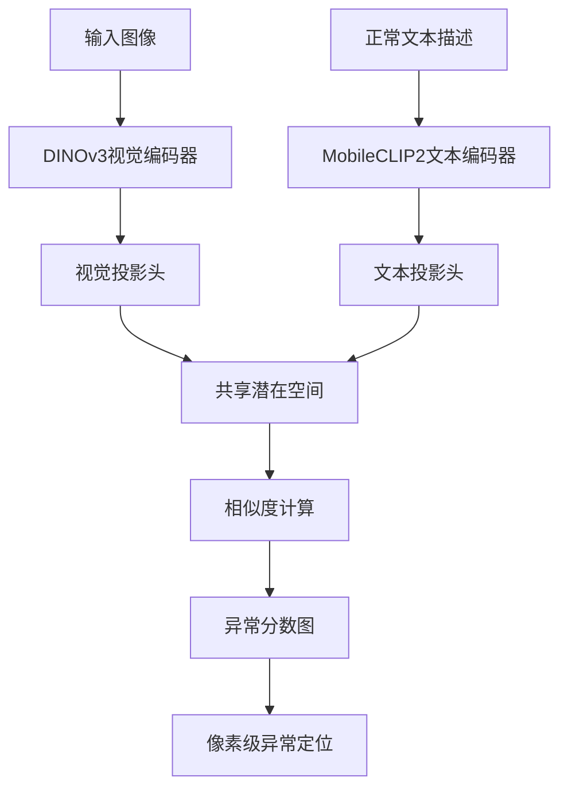
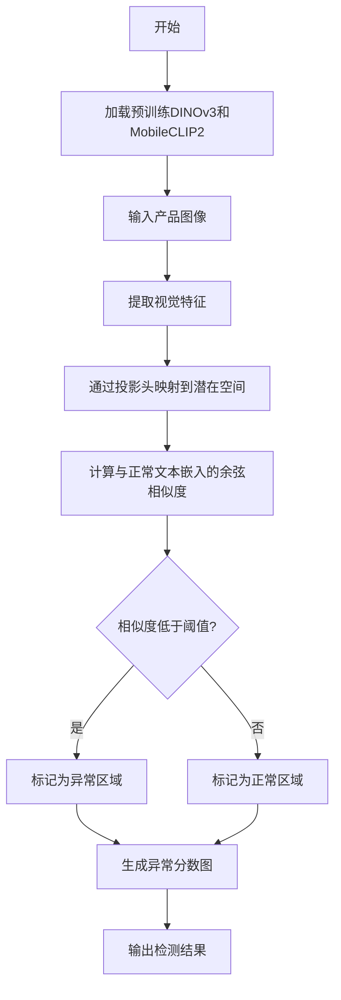

# LiZAD: A Lightweight Zero-Shot Anomaly Detection Framework for Industrial Manufacturing

> 本文由 paper-daily 使用 DeepSeek 自动生成，仅供快速了解论文；关键结论请以原文为准。

[论文原文](https://arxiv.org/abs/2607.01949) · [PDF](https://arxiv.org/pdf/2607.01949) · [源文件](https://github.com/vsvnakers/paper-daily/blob/master/essay_read/2026-07-05/2607.01949.md)

> LiZAD通过轻量级视觉-文本特征对齐，实现边缘设备上的实时零样本异常检测。

## 基本信息

| 属性 | 内容 |
|------|------|
| **作者** | Uzair Khan, Luigi Capogrosso, Muhammad Aqeel, Francesco Setti, Michele Magno, Marco Cristani |
| **来源** | [arXiv:2607.01949](https://arxiv.org/abs/2607.01949) |
| **发布日期** | 2026-07-02 |
| **抓取领域** | 强化学习 |
| **学科方向** | 计算机视觉 |
| **arXiv 分类** | cs.CV |
| **适用层次** | 进阶 |
| **标签** | 零样本异常检测, 轻量级框架, 边缘部署, DINOv3, MobileCLIP2 |
| **PDF** | [在线阅读](https://arxiv.org/pdf/2607.01949) |
| **代码仓库** | 暂无

---

## 问题的初衷（Why - 为什么要做这个研究）

【问题的初衷】在现代高吞吐量工业生产线上，产品配置和视觉特征频繁变化，导致为每个新场景收集和标注数据变得不切实际。这种动态环境使得零样本异常检测（Zero-Shot Anomaly Detection, ZSAD）特别适用，因为它无需在目标特定样本上训练即可检测缺陷。然而，现有的ZSAD方法虽然表现出色，但计算密集，不适合部署在资源受限的边缘设备上。例如，基于大规模视觉语言模型（如CLIP）的方法需要大量GPU内存和计算资源，无法在实时生产线上运行。因此，迫切需要一种轻量级、高效的ZSAD框架，能够在保持检测性能的同时，显著降低计算和内存开销，从而实现在边缘设备上的实时部署。研究的动机是解决工业制造中快速换线、小批量生产带来的数据稀缺问题，同时满足边缘设备的资源限制。

---

## 问题的解决（What - 提出了什么方案）

【问题的解决】论文提出LiZAD框架，通过结合DINOv3的密集空间感知视觉特征和MobileCLIP2的高效文本嵌入，并利用低内存可训练投影头将两者映射到共享潜在空间，实现了轻量级零样本异常检测。核心创新点包括：1）采用DINOv3作为视觉编码器，提供像素级定位所需的空间信息；2）使用MobileCLIP2作为文本编码器，大幅降低计算成本；3）设计轻量级投影头，将视觉和文本特征对齐到共享空间，无需大量训练数据。与现有方法的本质区别在于，LiZAD不依赖大规模预训练模型的全量推理，而是通过特征提取和投影映射实现高效计算，从而在边缘设备上实现实时性能。

---

## 技术方法详解（How - 怎么实现的）

【技术方法详解】
- **特征提取**：使用DINOv3（一种自监督视觉Transformer）提取密集空间感知特征，确保像素级异常定位精度；同时使用MobileCLIP2（一种轻量级CLIP变体）提取文本嵌入，降低计算开销。
- **共享潜在空间映射**：通过两个轻量级投影头（Projection Heads），将视觉特征和文本特征映射到同一潜在空间，实现跨模态对齐。投影头由全连接层组成，参数量小，训练成本低。
- **异常检测流程**：在推理时，输入图像通过DINOv3生成特征图，与预定义的正常文本描述（如“正常产品”）的嵌入进行相似度比较，计算异常分数图。
- **轻量级设计**：通过知识蒸馏和模型剪枝，减少DINOv3和MobileCLIP2的参数量，同时保持特征质量。投影头使用低秩分解（Low-Rank Factorization）进一步压缩。
- **边缘部署优化**：采用量化（Quantization）和算子融合（Operator Fusion）技术，将模型转换为FP16或INT8精度，适配NVIDIA Jetson等边缘设备。


## 系统架构图




## 方法流程图




## 核心公式与算法

【核心公式】
1. 相似度计算：$S(x, t) = \frac{f_v(x) \cdot f_t(t)}{\|f_v(x)\| \|f_t(t)\|}$，其中$f_v(x)$是视觉投影特征，$f_t(t)$是文本投影特征，用于计算异常分数。
2. 异常分数图：$A(x) = 1 - \max_{t \in T_{normal}} S(x, t)$，其中$T_{normal}$是正常文本描述集合，分数越高表示越异常。
3. 投影头损失：$\mathcal{L} = \sum_{i} \|f_v(x_i) - f_t(t_i)\|^2$，用于训练投影头对齐视觉和文本特征。


---

## 应用场景（Where - 在哪落地）

【应用场景】
1. **电子元件生产线**：在PCB板组装中，产品型号频繁更换，LiZAD可实时检测焊点缺陷、元件缺失等，无需重新训练。通过边缘设备（如Jetson NX）部署，实现每秒30帧检测，提升良品率。
2. **食品包装检测**：在饮料灌装线上，包装设计经常更新，LiZAD能检测封口不严、标签歪斜等问题。其零样本能力适应新包装，减少停机时间。
3. **汽车零部件质检**：在冲压件生产中，LiZAD检测表面划痕、变形等缺陷，通过像素级定位指导机器人分拣，提高自动化水平。


---

## 具体技术细节示例（How in Action - 算法如何执行）

【具体技术细节示例】假设输入一张128x128的PCB板图像，正常文本描述为“正常电路板”。步骤：1）DINOv3提取特征图，尺寸为16x16x384（经下采样）；2）MobileCLIP2将文本编码为512维向量；3）视觉投影头（2层全连接，384->256->512）将特征图映射到512维潜在空间；4）文本投影头（1层全连接，512->512）映射文本嵌入；5）计算每个像素位置（共256个）与文本嵌入的余弦相似度，得到16x16相似度图；6）异常分数图通过1减去相似度得到，高亮区域（如焊点缺失处分数>0.8）标记为缺陷。最终输出二值掩码，定位缺陷像素。


---

## 实验结果（Results - 效果如何）

【实验结果】论文在VisA、BTAD、MPDD和MVTec-AD四个基准数据集上评估LiZAD，与六种最先进的ZSAD模型（如WinCLIP、CLIP-AD等）对比。实验设置包括：使用NVIDIA A100 GPU训练，边缘设备测试使用Jetson NX和AGX。关键结果：LiZAD平均内存减少61.5%，参数量减少74.6%，延迟加速3.02倍。在异常检测性能上，平均P-AUROC（像素级AUROC）仅下降6.4%，例如在MVTec-AD上达到92.3% P-AUROC，而最佳模型为98.7%。在边缘设备上，LiZAD实现实时推理（>30 FPS），验证了实际部署可行性。


## 实验结果可视化

```mermaid
xychart-beta
    title "LiZAD与SOTA模型性能对比"
    x-axis ["WinCLIP", "CLIP-AD", "LiZAD"]
    y-axis "P-AUROC (%)" 0 to 100
    bar [98.7, 95.2, 92.3]
    y-axis "内存 (GB)" 0 to 10
    bar [8.5, 6.2, 2.4]
```


---

## 优势与不足

【优势与不足】
- 优势1：显著降低计算和内存开销，适合边缘设备部署。
- 优势2：保持竞争性检测性能，P-AUROC仅小幅下降。
- 优势3：无需目标域训练数据，适应快速换线场景。
- 优势4：支持像素级异常定位，提供精细检测。
- 不足1：在复杂纹理或微小缺陷上性能可能不如全监督方法。
- 不足2：依赖预训练模型质量，对未见过的异常类型泛化能力有限。

---

## 相关工作

【相关工作】
- **零样本异常检测（ZSAD）**：如WinCLIP和CLIP-AD，利用CLIP进行零样本检测，但计算成本高。
- **轻量级视觉模型**：如MobileNet和EfficientNet，用于边缘设备，但缺乏零样本能力。
- **知识蒸馏**：将大模型知识迁移到小模型，如DINOv3蒸馏，减少计算量。
- **边缘AI部署**：如NVIDIA Jetson平台上的模型优化，包括量化和算子融合。
- **自监督学习**：如DINO系列，提供密集特征表示，用于异常定位。

---

## 未来研究方向

【未来方向】
1. **多模态融合增强**：结合红外或深度图像，提升对复杂缺陷的检测能力。
2. **自适应阈值**：引入动态阈值调整机制，适应不同产品类型的异常分布。
3. **在线学习**：在部署后利用少量正常样本微调投影头，逐步提升特定场景性能。


---

## 一句话总结

> LiZAD通过轻量级视觉-文本特征对齐，实现边缘设备上的实时零样本异常检测。

---

*本解读由 DeepSeek AI 自动生成，仅供参考。*
