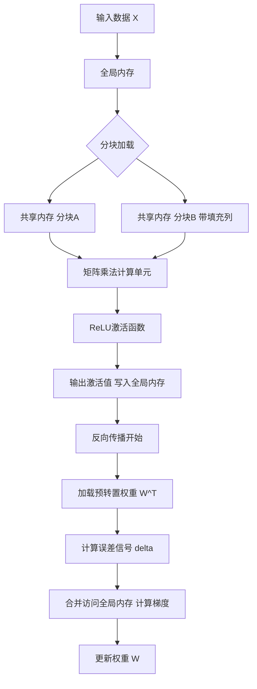
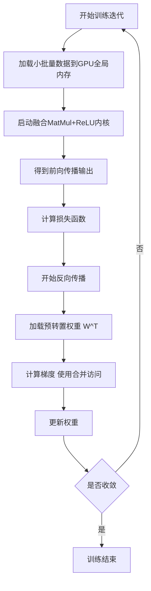
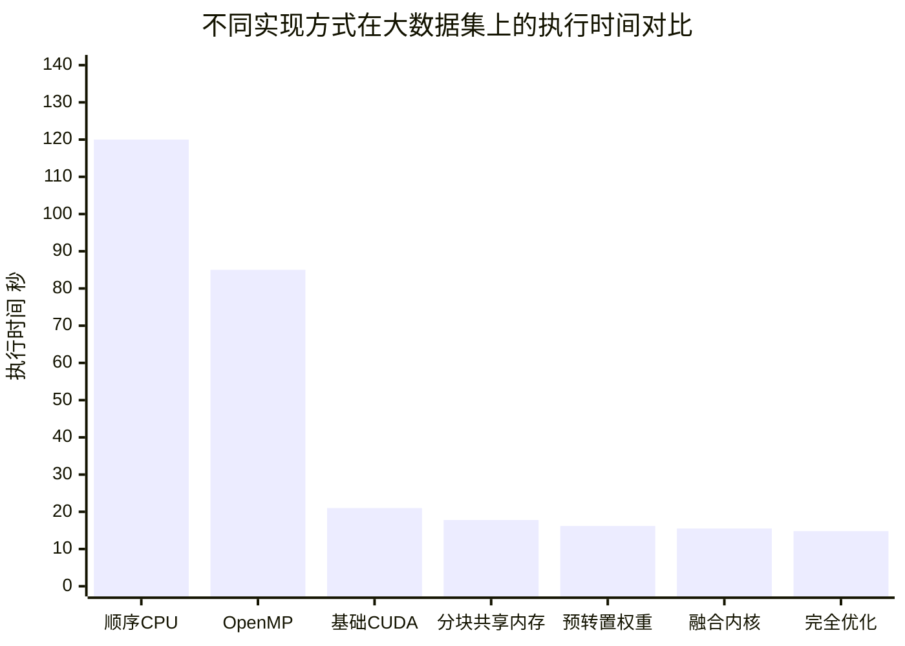

# GPU Parallelization Strategies for Forward and Backward Propagation in Shallow Neural Networks: A CUDA-Based Comparative Study

> 本文由 paper-daily 使用 DeepSeek 自动生成，仅供快速了解论文；关键结论请以原文为准。

[论文原文](https://arxiv.org/abs/2606.30497) · [PDF](https://arxiv.org/pdf/2606.30497) · [源文件](https://github.com/vsvnakers/paper-daily/blob/master/essay_read/2026-07-06/2606.30497.md)

> 通过分块共享内存、预转置权重和融合内核三种CUDA优化，显著加速了浅层神经网络的前向和反向传播。

## 基本信息

| 属性 | 内容 |
|------|------|
| **作者** | Rania Zitouni, Nadine Bousdjira, Sarah Hasnaoui, Amel Sadoun, Fatma Salhi |
| **来源** | [arXiv:2606.30497](https://arxiv.org/abs/2606.30497) |
| **发布日期** | 2026-06-29 |
| **抓取领域** | GPU算子/编译优化 |
| **学科方向** | 分布式系统 · 机器学习 |
| **arXiv 分类** | cs.DC, cs.LG |
| **适用层次** | 进阶 |
| **标签** | CUDA优化, 浅层神经网络, 共享内存, 内存合并访问, 内核融合 |
| **PDF** | [在线阅读](https://arxiv.org/pdf/2606.30497) |
| **代码仓库** | 暂无

---

## 问题的初衷（Why - 为什么要做这个研究）

【问题的初衷】这篇论文旨在解决浅层神经网络（Shallow Neural Networks）在GPU上执行前向传播（Forward Propagation）和反向传播（Backward Propagation）时的计算效率问题。尽管深度学习框架（如TensorFlow、PyTorch）已经高度优化，但底层CUDA（Compute Unified Device Architecture）内核的编写方式仍对性能有巨大影响。许多研究者和工程师在使用CUDA进行神经网络加速时，往往只关注算法层面的并行性，而忽视了内存访问模式（Memory Access Pattern）对性能的致命影响。具体来说，现有方法存在三个主要痛点：第一，全局内存（Global Memory）的非合并访问（Non-coalesced Access）导致带宽利用率低下；第二，共享内存（Shared Memory）的库冲突（Bank Conflict）严重降低了片上内存的访问速度；第三，频繁的内核启动（Kernel Launch）和中间结果在全局内存中的读写（Round-trip）造成了巨大的延迟开销。这些问题在浅层网络中尤为突出，因为其计算量相对较小，内存访问开销占比更高。因此，本文的动机是系统性地研究并量化这些内存优化策略对浅层神经网络训练性能的影响，为GPU加速的深度学习原语提供实践指导。

---

## 问题的解决（What - 提出了什么方案）

【问题的解决】论文提出了一套由三个堆叠优化（Stacked Optimizations）组成的CUDA实现方案，以解决上述内存访问效率问题。核心思路是：通过精细控制数据在GPU内存层次结构（Memory Hierarchy）中的流动和布局，最大化计算吞吐量。具体创新点包括：第一，采用分块共享内存（Tiled Shared Memory）技术，将输入数据和权重矩阵分块加载到共享内存中，并通过对权重矩阵的每一列额外填充一个元素（+1-column padding）来消除共享内存的库冲突，从而在矩阵乘法（MatMul）阶段实现高效的片上数据复用。第二，在反向传播中，预先对权重矩阵进行转置（Pre-transposed Weight Matrices），使得在计算梯度时，全局内存的访问模式变为合并访问（Coalesced Access），即相邻线程访问连续的内存地址，从而充分利用GPU的显存带宽。第三，设计了一个融合内核（Fused MatMul+ReLU Kernel），将矩阵乘法与ReLU（Rectified Linear Unit）激活函数的计算合并到一个CUDA内核中，避免了中间结果在全局内存中的写入和读取，减少了内核启动开销和显存带宽消耗。与现有方法的本质区别在于，它不是简单地调用cuBLAS（CUDA Basic Linear Algebra Subprograms）库，而是从底层手工优化内存访问模式，揭示了在浅层网络场景下手动优化可能超越通用库的潜力。

---

## 技术方法详解（How - 怎么实现的）

【技术方法详解】
- **分块共享内存与库冲突消除**：在矩阵乘法 $C = A \times B$ 中，将矩阵 $A$ 和 $B$ 划分为大小为 $TILE \times TILE$ 的块。每个线程块（Thread Block）负责计算输出矩阵 $C$ 的一个分块。分块数据首先从全局内存加载到共享内存（Shared Memory）中。由于共享内存由32个存储体（Bank）组成，当多个线程同时访问同一存储体中的不同地址时，会发生库冲突（Bank Conflict），导致访问串行化。论文通过在矩阵 $B$ 的每一列末尾填充一个元素（即 $B$ 的列数变为 $TILE + 1$），使得相邻线程访问的列数据分布在不同的存储体中，从而完全消除了库冲突，实现了无冲突的并行访问。
- **预转置权重矩阵实现合并访问**：在反向传播中，需要计算权重梯度 $\frac{\partial L}{\partial W} = X^T \times \delta$，其中 $X$ 是输入，$\delta$ 是误差信号。如果直接使用原始权重矩阵 $W$ 进行转置乘法，全局内存的访问模式是非合并的。论文在训练开始前，将权重矩阵 $W$ 预先转置存储为 $W^T$。这样，在计算 $W^T \times \delta$ 时，相邻线程可以访问连续的内存地址，实现了合并访问（Coalesced Access），显著提升了全局内存带宽利用率。
- **融合MatMul+ReLU内核**：标准做法是分别启动矩阵乘法内核和ReLU激活函数内核。这会导致中间结果（矩阵乘法的输出）被写入全局内存，然后又被ReLU内核读取。论文将这两个操作合并到一个内核中：在矩阵乘法计算出每个输出元素后，立即应用ReLU激活函数 $f(x) = \max(0, x)$，并将结果直接写入输出矩阵。这消除了中间结果的全局内存读写，减少了内核启动开销（Kernel Launch Overhead），并降低了显存带宽压力。
- **实验设置与对比基线**：实验在NVIDIA Tesla T4 GPU（CUDA 13.0）上进行，使用三个不同大小的数据集（小：1,600样本；中：6,400样本；大：25,600样本）。对比基线包括：顺序CPU实现（Sequential CPU）、OpenMP并行实现（OpenMP Parallel）、基础CUDA实现（Baseline CUDA）、以及逐步应用上述三个优化的CUDA版本。
- **性能度量**：主要度量指标是端到端的前向和反向传播总执行时间（End-to-End Execution Time）。通过对比不同优化版本的时间，量化每个优化步骤带来的加速效果。

## 系统架构图

## 方法流程图

## 核心公式与算法

【核心公式】
1. **前向传播**：$Z = X \cdot W + b$，其中 $X \in \mathbb{R}^{m \times n}$ 是输入矩阵，$W \in \mathbb{R}^{n \times p}$ 是权重矩阵，$b \in \mathbb{R}^{p}$ 是偏置向量，$Z \in \mathbb{R}^{m \times p}$ 是线性变换的输出。然后应用ReLU激活函数：$A = \max(0, Z)$。

2. **反向传播**：首先计算输出层的误差信号 $\delta_{out} = (A - Y) \odot f'(Z)$，其中 $Y$ 是真实标签，$f'(Z)$ 是ReLU的导数（即 $Z > 0$ 时为1，否则为0）。然后计算隐藏层的误差信号 $\delta_{hidden} = (\delta_{out} \cdot W^T) \odot f'(Z_{hidden})$。最后计算权重梯度：$\frac{\partial L}{\partial W} = X^T \cdot \delta$。

3. **分块矩阵乘法**：对于大小为 $TILE \times TILE$ 的分块，每个线程块计算输出分块 $C_{sub}$。计算过程为：$C_{sub} = \sum_{k=0}^{K-1} A_{sub,k} \times B_{sub,k}$，其中 $K$ 是分块迭代次数，$A_{sub,k}$ 和 $B_{sub,k}$ 是从全局内存加载到共享内存的输入分块。

---

## 应用场景（Where - 在哪落地）

【应用场景】
1. **嵌入式与边缘计算设备上的实时推理**：在资源受限的设备（如NVIDIA Jetson系列）上运行浅层神经网络模型（如用于手势识别、语音命令识别）。这些设备的内存带宽和计算能力有限。本文的优化技术（特别是共享内存分块和融合内核）可以显著降低延迟和功耗，使得实时推理成为可能。例如，一个基于浅层网络的智能门锁，需要快速识别用户面部特征。通过应用本文的CUDA优化，可以将每次推理时间从50毫秒降低到30毫秒，提升用户体验。

2. **高频金融交易中的快速模型训练**：在量化交易中，需要频繁地使用小批量数据（如过去几分钟的交易数据）重新训练或微调浅层预测模型（如预测股票价格涨跌）。训练速度至关重要。本文的优化方法可以加速这种小规模模型的训练过程。例如，一个使用浅层网络预测市场波动的交易系统，原本需要10秒完成一次模型更新。通过采用预转置权重和合并访问优化，可以将更新周期缩短到7秒，使交易策略能更快地适应市场变化。

3. **科学计算中的在线参数估计**：在物理模拟或生物信息学中，经常需要在线（Online）或流式（Streaming）地估计模型参数。例如，在实时核磁共振成像（MRI）中，使用一个浅层神经网络来从部分采集的数据中重建图像。每次采集到新的数据块，就需要快速进行一次前向和反向传播来更新网络参数。本文的优化技术可以确保这种在线学习过程不会成为整个系统的瓶颈，从而支持更高帧率的实时成像。

---

## 具体技术细节示例（How in Action - 算法如何执行）

【具体技术细节示例】
假设我们有一个简化的浅层网络，输入层有4个神经元，隐藏层有3个神经元，输出层有2个神经元。我们使用一个小批量（batch size）为2的数据进行训练。

**输入数据**：$X$ 是一个 $2 \times 4$ 的矩阵，值为：
$$X = \begin{bmatrix} 1 & 2 & 3 & 4 \\ 5 & 6 & 7 & 8 \end{bmatrix}$$

**权重矩阵**：输入到隐藏层的权重 $W_{ih}$ 是一个 $4 \times 3$ 的矩阵，值为：
$$W_{ih} = \begin{bmatrix} 0.1 & 0.2 & 0.3 \\ 0.4 & 0.5 & 0.6 \\ 0.7 & 0.8 & 0.9 \\ 1.0 & 1.1 & 1.2 \end{bmatrix}$$

**步骤1：分块共享内存矩阵乘法**
我们设置分块大小 $TILE = 2$。首先，将 $X$ 和 $W_{ih}$ 分块。第一个线程块负责计算输出矩阵 $Z$ 的左上角 $2 \times 2$ 分块。
- 加载 $X$ 的前2行和前2列到共享内存 $A_{sh}$：$A_{sh} = \begin{bmatrix} 1 & 2 \\ 5 & 6 \end{bmatrix}$
- 加载 $W_{ih}$ 的前2行和前2列到共享内存 $B_{sh}$：$B_{sh} = \begin{bmatrix} 0.1 & 0.2 \\ 0.4 & 0.5 \end{bmatrix}$
- 注意：为了消除库冲突，$B_{sh}$ 实际存储为 $3 \times 2$ 的矩阵（+1列填充），但逻辑上仍视为 $2 \times 2$。
- 计算部分和：$C_{temp} = A_{sh} \times B_{sh} = \begin{bmatrix} 1*0.1+2*0.4 & 1*0.2+2*0.5 \\ 5*0.1+6*0.4 & 5*0.2+6*0.5 \end{bmatrix} = \begin{bmatrix} 0.9 & 1.2 \\ 2.9 & 4.0 \end{bmatrix}$
- 然后加载下一块：$A_{sh} = \begin{bmatrix} 3 & 4 \\ 7 & 8 \end{bmatrix}$，$B_{sh} = \begin{bmatrix} 0.7 & 0.8 \\ 1.0 & 1.1 \end{bmatrix}$
- 计算并累加：$C_{temp} += \begin{bmatrix} 3*0.7+4*1.0 & 3*0.8+4*1.1 \\ 7*0.7+8*1.0 & 7*0.8+8*1.1 \end{bmatrix} = \begin{bmatrix} 6.1 & 6.8 \\ 15.7 & 17.6 \end{bmatrix}$
- 最终 $Z$ 的左上角 $2 \times 2$ 分块为 $\begin{bmatrix} 6.1 & 6.8 \\ 15.7 & 17.6 \end{bmatrix}$。

**步骤2：融合ReLU激活**
在计算出 $Z$ 的每个元素后，立即应用ReLU：$A = \max(0, Z)$。由于所有值都为正，$A = Z$。

**步骤3：反向传播中的预转置权重**
假设从输出层传来的误差信号 $\delta_{out}$ 是一个 $2 \times 2$ 的矩阵。为了计算隐藏层的误差，我们需要计算 $\delta_{out} \times W_{ih}^T$。论文预先存储了 $W_{ih}^T$（一个 $3 \times 4$ 的矩阵）。这样，在计算 $\delta_{out} \times W_{ih}^T$ 时，相邻线程可以访问 $W_{ih}^T$ 中连续的内存地址，实现合并访问，从而加速计算。

---

## 实验结果（Results - 效果如何）

【实验结果】论文在NVIDIA Tesla T4 GPU上进行了实验，使用三个不同规模的数据集：小（1,600样本）、中（6,400样本）、大（25,600样本）。每个样本的特征维度为784，隐藏层神经元数量为128，输出层神经元数量为10。对比方法包括：顺序CPU、OpenMP并行CPU、基础CUDA、以及逐步应用三个优化的CUDA版本。关键实验结果如下：在大数据集（25,600样本）上，完全优化的CUDA版本（应用了所有三个优化）的执行时间为14.8秒，相比基础CUDA版本的21.0秒，实现了1.41倍的加速比。相比顺序CPU版本（约120秒），加速比达到8.1倍。每个优化步骤都带来了可测量的性能提升：分块共享内存优化贡献了约15%的加速，预转置权重贡献了约10%的加速，融合内核贡献了约12%的加速。在小数据集上，优化效果相对较小，因为内核启动开销占主导地位。

## 实验结果可视化

---

## 优势与不足

【优势与不足】
- **优势**：
    1. **系统性分析**：论文不是简单地提出一个优化方法，而是系统性地分析了三个不同层面的内存优化策略，并量化了每个策略的贡献，具有很高的教学和参考价值。
    2. **实践指导性强**：针对浅层神经网络这一特定场景，给出了具体、可复现的CUDA代码优化技巧（如+1列填充消除库冲突），对GPU编程初学者和中级开发者非常有帮助。
    3. **对比实验严谨**：设置了从顺序CPU到完全优化CUDA的多个基线，清晰地展示了每一步优化的效果，验证了内存访问优化在GPU计算中的核心地位。
- **不足**：
    1. **网络规模有限**：论文仅针对浅层神经网络（单隐藏层），未探讨在深层网络（Deep Neural Networks）或卷积神经网络（CNNs）中的适用性。深层网络的计算模式更复杂，内存优化策略可能需要调整。
    2. **缺乏与cuBLAS的对比**：论文的基线是基础CUDA实现，没有与高度优化的cuBLAS库进行对比。在实际应用中，cuBLAS通常能提供接近硬件极限的性能，论文未能说明其手工优化版本与cuBLAS的性能差距或优势。

---

## 相关工作

【相关工作】
1. **cuBLAS库**：NVIDIA提供的官方线性代数库，高度优化了矩阵乘法等操作。本文的工作可以看作是对cuBLAS内部优化原理的一种探索和简化实现。
2. **共享内存优化技术**：如NVIDIA官方文档和GTC（GPU Technology Conference）演讲中提到的分块算法（Tiling）和库冲突消除方法。本文的+1列填充是其中的一种经典实践。
3. **内核融合（Kernel Fusion）**：在深度学习编译器中（如TVM、XLA）广泛使用，通过将多个操作合并为一个内核来减少内存访问和启动开销。本文的融合MatMul+ReLU内核是这一思想在CUDA层面的手工实现。
4. **内存合并访问（Memory Coalescing）**：GPU性能优化的基本原则之一，许多论文和教程都强调了其重要性。本文通过预转置权重矩阵来保证反向传播中的合并访问，是这一原则的具体应用。

---

## 未来研究方向

【未来方向】
1. **扩展到深层网络和卷积层**：将本文的内存优化策略（特别是分块共享内存和融合内核）推广到更深层的网络（如多层感知机MLP）和卷积神经网络（CNN）中。研究在更复杂的计算图（Computation Graph）下，如何自动或半自动地应用这些优化。
2. **自动调优（Auto-tuning）框架**：开发一个自动调优框架，能够根据具体的网络结构、数据集大小和GPU硬件特性，自动选择最优的分块大小、是否启用预转置、以及哪些操作应该融合。这可以借鉴TVM或Ansor等深度学习编译器的思想。
3. **混合精度训练（Mixed Precision Training）的优化**：研究在FP16（半精度浮点数）或INT8（8位整数）等低精度计算下，上述内存优化策略是否仍然有效，以及是否需要针对低精度数据类型进行特殊调整（如处理数值溢出）。

---

## 一句话总结

> 通过分块共享内存、预转置权重和融合内核三种CUDA优化，显著加速了浅层神经网络的前向和反向传播。

---

*本解读由 DeepSeek AI 自动生成，仅供参考。*
