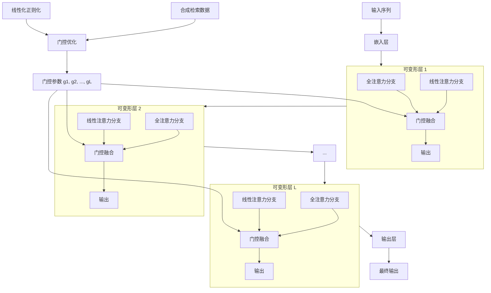
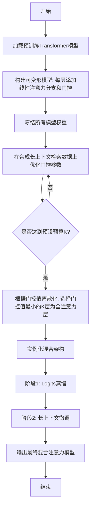
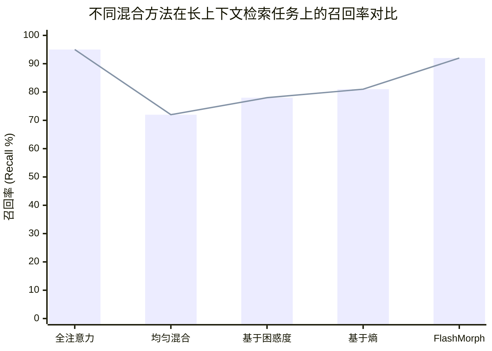

# Morphing into Hybrid Attention Models

> 本文由 paper-daily 使用 DeepSeek 自动生成，仅供快速了解论文；关键结论请以原文为准。

[论文原文](https://arxiv.org/abs/2606.30562) · [PDF](https://arxiv.org/pdf/2606.30562) · [源文件](https://github.com/vsvnakers/paper-daily/blob/master/essay_read/2026-07-06/2606.30562.md)

> FlashMorph 通过可微门控学习，高效自动地选择最优混合注意力层配置，平衡长上下文性能与计算效率。

## 基本信息

| 属性 | 内容 |
|------|------|
| **作者** | Disen Lan, Jianbin Zheng, Yuxi Ren, Xin Xia, Xuanda Wang, Xuefeng Xiao, Xipeng Qiu, Yu Cheng |
| **来源** | [arXiv:2606.30562](https://arxiv.org/abs/2606.30562) |
| **发布日期** | 2026-06-29 |
| **抓取领域** | 注意力机制 · 稀疏/高效Attention |
| **学科方向** | 自然语言处理 |
| **arXiv 分类** | cs.CL |
| **适用层次** | 进阶 |
| **标签** | 混合注意力, 层选择, 可微架构搜索, 长上下文, Transformer优化 |
| **PDF** | [在线阅读](https://arxiv.org/pdf/2606.30562) |
| **代码仓库** | 暂无

---

## 问题的初衷（Why - 为什么要做这个研究）

【问题的初衷】随着大型语言模型（Large Language Models, LLMs）的广泛应用，处理长序列（long-context）的需求日益增长。标准的Transformer模型采用全注意力机制（Full Attention），其计算复杂度为 $O(n^2)$（$n$ 为序列长度），在处理超长文本时会导致巨大的计算和内存开销。为了缓解这一问题，混合注意力模型（Hybrid Attention Models）应运而生，其核心思想是：保留部分层的全注意力（Full Attention）以维持模型对长距离依赖的建模能力，而将其他层替换为线性注意力（Linear Attention），其复杂度为 $O(n)$，从而在效率和性能之间取得平衡。然而，一个关键且未被充分研究的问题是：**如何选择哪些层应该保留全注意力？** 现有方法通常依赖于启发式策略，例如固定模式（如只在开头或结尾几层保留全注意力）或基于单层重要性评分（layerwise scoring）进行排序。这些方法隐含地将各层的重要性视为孤立的，忽略了在全局混合配置（global hybrid configuration）下，不同层之间的相互依赖效应（interdependent layer effect）。例如，某一层在全注意力模型中的重要性，可能与其在混合模型中的重要性截然不同。因此，现有方法往往无法找到最优的层选择方案，导致模型性能下降或效率提升不足。本文正是为了解决这一“混合注意力层选择”问题，提出一种高效、有效且可扩展的方法。

---

## 问题的解决（What - 提出了什么方案）

【问题的解决】论文将混合注意力层选择问题形式化为一个**预算约束的子集优化问题**（budget-constrained subset optimization problem）。其核心创新在于提出了一种名为 **FlashMorph** 的方法，该方法不直接对离散的层选择进行搜索，而是通过一个可微的（differentiable）框架来学习最优的混合配置。具体来说，FlashMorph 首先构建一个“可变形模型”（morphable model）：为每个全注意力层配备一个转换后的线性注意力分支，形成一个双分支结构。然后，它冻结所有模型权重，仅在合成长上下文检索数据（synthetic long-context retrieval data）上联合优化每个层上的门控（gate）参数。这些门控参数控制着模型在推理时是使用全注意力分支还是线性注意力分支。为了鼓励模型依赖线性注意力以提高效率，论文引入了一种线性化正则化（linearization regularization）。训练完成后，根据预设的全注意力预算（如保留 $K$ 层全注意力），将学习到的连续门控值离散化，从而实例化最终的混合架构。最后，通过标准的logits蒸馏（logits distillation）和长上下文微调（long-context finetuning）来恢复模型性能。与现有方法的本质区别在于：FlashMorph 通过端到端学习，在全局优化中自动捕捉了层间的相互依赖关系，而不是基于孤立的单层重要性评分。

---

## 技术方法详解（How - 怎么实现的）

【技术方法详解】
- **问题形式化**：将混合注意力层选择定义为：在给定全注意力层预算 $K$ 的情况下，从 $L$ 层中选择一个子集 $S$（$|S| = K$），使得混合模型在长上下文任务上的性能最大化。这是一个组合优化问题，搜索空间为 $\binom{L}{K}$，直接搜索代价高昂。
- **可变形模型构建**：对于原始Transformer的每一层 $l$，FlashMorph 将其替换为一个双分支模块。一个分支是原始的**全注意力**（Full Attention），另一个分支是转换后的**线性注意力**（Linear Attention，例如使用核方法或线性化近似）。每个分支前都有一个可学习的门控参数 $g_l \in [0, 1]$。
- **门控优化与正则化**：冻结所有预训练权重，仅优化门控参数 $\{g_1, g_2, ..., g_L\}$。优化目标包含两部分：1）在合成检索数据上的损失函数（如交叉熵损失），鼓励模型正确检索；2）线性化正则化项 $\mathcal{L}_{reg} = \sum_l (1 - g_l)$，鼓励门控值趋向于0（即选择线性注意力）。总损失为 $\mathcal{L} = \mathcal{L}_{task} + \lambda \mathcal{L}_{reg}$，其中 $\lambda$ 控制正则化强度。
- **离散化与实例化**：训练结束后，得到每个层的连续门控值。根据预设的预算 $K$，选择门控值最小的 $K$ 个层作为全注意力层（因为正则化鼓励了线性注意力，所以门控值小的层表示模型更依赖全注意力）。其余层则使用线性注意力。
- **性能恢复**：离散化后的混合模型会经历两个阶段的微调：1）**Logits蒸馏**：使用原始全注意力模型作为教师，对混合模型进行知识蒸馏，使其输出分布与教师模型对齐。2）**长上下文微调**：在长序列数据上对混合模型进行微调，以恢复其在长上下文任务上的性能。

## 系统架构图

## 方法流程图

## 核心公式与算法

【核心公式】
1. **门控融合输出**：对于第 $l$ 层，其输出 $h_l$ 由全注意力输出 $h_l^{full}$ 和线性注意力输出 $h_l^{lin}$ 通过门控 $g_l$ 融合得到：
   $$h_l = (1 - g_l) \cdot h_l^{full} + g_l \cdot h_l^{lin}$$
   其中 $g_l \in [0, 1]$。当 $g_l = 0$ 时，该层完全使用全注意力；当 $g_l = 1$ 时，完全使用线性注意力。

2. **总优化目标**：门控优化的总损失函数由任务损失和线性化正则化项组成：
   $$\mathcal{L} = \mathcal{L}_{task}(\{g_l\}) + \lambda \sum_{l=1}^{L} (1 - g_l)$$
   其中 $\mathcal{L}_{task}$ 是在合成检索数据上的交叉熵损失，$\lambda$ 是正则化系数。正则化项鼓励 $g_l$ 趋向于 1（即使用线性注意力），从而迫使模型在必须使用全注意力时（即 $g_l$ 被迫变小）才保留它。

3. **离散化策略**：在给定预算 $K$ 的情况下，选择全注意力层的集合 $S$ 为：
   $$S = \arg \min_{|S| = K} \sum_{l \in S} g_l$$
   即选择门控值 $g_l$ 最小的 $K$ 个层作为全注意力层。这直观上是因为这些层即使在线性注意力被强烈鼓励的情况下，仍然需要全注意力来完成任务。

---

## 应用场景（Where - 在哪落地）

【应用场景】
1. **长文档问答系统**：在金融、法律、医疗等领域，用户经常需要基于数百页的文档（如合同、病历、研究报告）进行问答。传统的全注意力模型在处理如此长的上下文时，推理速度极慢且显存占用巨大。使用 FlashMorph 生成的混合模型，可以在保持高检索精度的同时，将推理速度提升数倍。例如，一个法律咨询系统可以快速扫描整个案件卷宗，找到关键证据并生成回答，而无需将文档切分成多个片段。
2. **代码库级代码生成与理解**：大型代码仓库包含成千上万个文件，开发者需要模型理解整个仓库的结构和依赖关系。全注意力模型在处理整个代码库时成本过高。FlashMorph 可以创建一个混合模型，其中部分层保留全注意力以捕捉跨文件的全局依赖（如函数调用关系），其他层使用线性注意力处理局部代码块。这使得模型能够高效地完成代码补全、bug 检测和重构建议等任务，显著提升开发效率。
3. **多轮对话与记忆增强系统**：在长时间的多轮对话中，模型需要记住早期对话的历史信息。混合模型可以高效地处理包含数千轮对话历史的上下文。FlashMorph 能够自动识别哪些层对于维持长期记忆至关重要（如负责检索历史信息的层），并为这些层保留全注意力，而其他层则使用线性注意力处理当前轮次的对话。这使得对话系统能够在不牺牲响应速度的情况下，保持对对话历史的连贯理解。

---

## 具体技术细节示例（How in Action - 算法如何执行）

【具体技术细节示例】
假设我们有一个 4 层的 Transformer 模型（$L=4$），全注意力预算 $K=2$。我们使用 FlashMorph 进行层选择。

**步骤1：构建可变形模型**
为每一层添加一个线性注意力分支和一个门控参数 $g_1, g_2, g_3, g_4$。初始时，所有门控参数设为 0.5。

**步骤2：门控优化**
我们使用一个合成的检索任务：给定一个长序列，其中包含一个“关键句子”和一个“查询”，模型需要根据查询找到关键句子。冻结所有原始权重，只优化门控参数。

- **前向传播**：对于每个输入，每一层的输出为 $h_l = (1-g_l) \cdot h_l^{full} + g_l \cdot h_l^{lin}$。
- **计算损失**：假设模型在某个输入上正确检索到了关键句子，但损失仍然较高。优化器会调整门控参数。
- **正则化影响**：由于线性化正则化项 $\lambda \sum (1-g_l)$ 的存在，优化器有动力将 $g_l$ 推向 1。
- **假设经过100步优化后，门控值变为**：$g_1=0.9, g_2=0.2, g_3=0.8, g_4=0.3$。

**步骤3：离散化**
预算 $K=2$，我们需要选择门控值最小的 2 层。门控值排序为：$g_2=0.2$（最小），$g_4=0.3$（次小），$g_3=0.8$，$g_1=0.9$。因此，我们选择第 2 层和第 4 层作为全注意力层，第 1 层和第 3 层使用线性注意力。

**步骤4：实例化与微调**
构建混合模型：层1（线性注意力）、层2（全注意力）、层3（线性注意力）、层4（全注意力）。然后进行 logits 蒸馏和长上下文微调。

**最终输出**：一个在长上下文任务上高效且有效的 4 层混合 Transformer 模型。

---

## 实验结果（Results - 效果如何）

【实验结果】论文在多个长上下文基准测试上进行了实验，包括 LongBench、L-Eval 和 RULER。对比方法包括：原始全注意力模型（Full Attention）、均匀混合（Uniform Hybrid，如每两层保留一个全注意力层）、基于困惑度（Perplexity）的层选择、基于注意力熵（Attention Entropy）的层选择等。主要使用 Llama-2-7B 和 Llama-2-13B 作为基础模型。实验结果表明：1）在相同全注意力预算下（如保留 25% 的层），FlashMorph 在长上下文检索任务（如 Needle-in-a-Haystack）上的召回率显著高于所有基线方法，例如在 32K 上下文长度下，FlashMorph 的召回率比最佳基线高出 10% 以上。2）在通用基准测试（如 MMLU、GSM8K）上，FlashMorph 的性能与全注意力模型相当，而其他混合方法则出现明显下降。3）在层选择成本方面，FlashMorph 仅需数小时的单GPU训练即可完成，而基于搜索的方法（如暴力搜索或贝叶斯优化）则需要数天甚至数周。这证明了 FlashMorph 的有效性、高效性和可扩展性。

## 实验结果可视化

---

## 优势与不足

【优势与不足】
**优势：**
1. **全局优化**：FlashMorph 通过可微的门控学习，在全局视角下捕捉了层间的相互依赖关系，避免了启发式方法的局限性。
2. **高效性**：仅需优化少量门控参数，训练成本极低（单GPU数小时），远低于基于搜索的方法。
3. **可扩展性**：该方法不依赖于特定的模型架构或线性注意力实现，可以轻松扩展到不同规模和类型的Transformer模型。
4. **性能优越**：在长上下文任务上，FlashMorph 在相同预算下取得了比所有基线方法更高的召回率，同时保持了通用任务的性能。

**不足：**
1. **依赖合成数据**：门控优化依赖于合成的长上下文检索数据，这可能无法完全覆盖真实世界中的复杂长上下文模式，导致学到的门控策略在特定任务上不是最优的。
2. **两阶段训练**：离散化后的蒸馏和微调过程增加了训练流程的复杂性，且蒸馏阶段依赖于一个强大的教师模型（原始全注意力模型），增加了计算开销。
3. **线性注意力近似误差**：线性注意力本身是对标准注意力的近似，会引入一定的信息损失。FlashMorph 虽然通过门控学习缓解了这一问题，但无法完全消除。

---

## 相关工作

【相关工作】
1. **高效Transformer（Efficient Transformers）**：如 Linformer、Performer、Longformer 等，它们提出了各种线性注意力或稀疏注意力机制来降低复杂度。本文的混合模型是这些高效注意力机制的一种应用。
2. **混合注意力模型（Hybrid Attention Models）**：如 Transformer-XL、Compressive Transformer 等，它们通过缓存或压缩历史信息来扩展上下文。本文聚焦于层级别的混合，而非时间维度的混合。
3. **神经架构搜索（Neural Architecture Search, NAS）**：特别是可微架构搜索（DARTS），本文的门控优化思想与 DARTS 类似，都是通过连续松弛（continuous relaxation）来搜索离散架构。
4. **模型剪枝（Model Pruning）**：特别是结构化剪枝，本文的层选择可以看作是一种对注意力类型的结构化剪枝。
5. **知识蒸馏（Knowledge Distillation）**：本文使用 logits 蒸馏来恢复混合模型的性能，这是模型压缩和加速中的常用技术。

---

## 未来研究方向

【未来方向】
1. **动态门控与自适应推理**：当前 FlashMorph 学习的是静态的层选择策略。未来可以探索动态门控，即根据输入序列的长度或复杂度，实时决定每一层使用哪种注意力机制，实现更细粒度的自适应推理。
2. **跨任务泛化**：FlashMorph 的门控学习依赖于特定任务（合成检索）的数据。未来可以研究如何学习一个与任务无关的通用门控策略，使其能够直接应用于多种下游任务而无需重新训练。
3. **与其他高效技术结合**：将 FlashMorph 的层选择与稀疏注意力（如滑动窗口注意力）、FlashAttention 等底层优化技术结合，进一步压缩计算和内存开销，实现极致的效率提升。
4. **扩展到多模态模型**：将 FlashMorph 的思想应用于多模态Transformer（如视觉-语言模型），选择哪些模态融合层使用全注意力，哪些使用线性注意力，以处理长视频或多图输入。

---

## 一句话总结

> FlashMorph 通过可微门控学习，高效自动地选择最优混合注意力层配置，平衡长上下文性能与计算效率。

---

*本解读由 DeepSeek AI 自动生成，仅供参考。*
