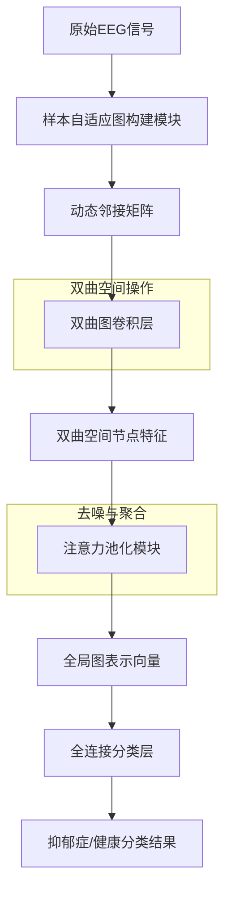
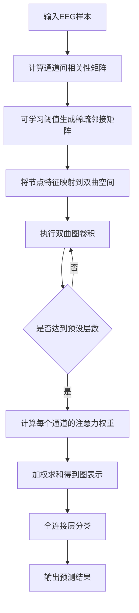

# SA-HGNN: Sample-Adaptive Hyperbolic Graph Neural Network for EEG-Based Depression Recognition

> 本文由 paper-daily 使用 DeepSeek 自动生成，仅供快速了解论文；关键结论请以原文为准。

[论文原文](https://arxiv.org/abs/2607.02063) · [PDF](https://arxiv.org/pdf/2607.02063) · [源文件](https://github.com/vsvnakers/paper-daily/blob/master/essay_read/2026-07-06/2607.02063.md)

> 提出样本自适应双曲图神经网络，通过动态图构建和双曲空间建模，精准捕捉抑郁症脑网络的层次结构。

## 基本信息

| 属性 | 内容 |
|------|------|
| **作者** | Yang Li, Pan Hu, Yan Zhang, Wenfan Yang, Tao Wu, Lianbo Guo |
| **来源** | [arXiv:2607.02063](https://arxiv.org/abs/2607.02063) |
| **发布日期** | 2026-07-02 |
| **抓取领域** | 图学习/表示学习 |
| **学科方向** | 机器学习 · 人工智能 |
| **arXiv 分类** | cs.LG, cs.AI |
| **适用层次** | 前沿 |
| **标签** | 双曲图神经网络, 脑电图, 抑郁症识别, 样本自适应, 注意力池化 |
| **PDF** | [在线阅读](https://arxiv.org/pdf/2607.02063) |
| **代码仓库** | 暂无

---

## 问题的初衷（Why - 为什么要做这个研究）

【问题的初衷】抑郁症（Major Depressive Disorder, MDD）是一种常见的精神疾病，基于脑电图（Electroencephalography, EEG）的自动识别方法具有重要的临床价值。现有基于图神经网络（Graph Neural Networks, GNNs）的方法虽然能捕捉大脑功能连接（Functional Connectivity）的空间模式，但存在两个核心问题：第一，抑郁症患者的大脑网络具有固有的层次结构（Hierarchical Structure），例如不同脑区（如默认模式网络、额叶-边缘系统）之间存在复杂的从属和交互关系，而传统的欧几里得空间（Euclidean Space）中的GNN难以有效建模这种层次性，因为欧氏空间的容量随维度线性增长，无法高效嵌入树状或层次结构。第二，EEG信号包含大量噪声通道（Noise Channels），这些通道会干扰对真实层次拓扑的捕捉。现有方法通常对所有样本使用固定的图结构，忽略了不同患者或不同时间段脑网络拓扑的个体差异性（Sample-Adaptive）。因此，迫切需要一种能够自适应构建个性化脑网络、在双曲空间（Hyperbolic Space）中精确建模层次结构、并有效去噪的模型。

---

## 问题的解决（What - 提出了什么方案）

【问题的解决】论文提出了样本自适应双曲图神经网络（Sample-Adaptive Hyperbolic Graph Neural Network, SA-HGNN）来解决上述问题。核心思路是：首先，通过一个样本自适应图构建模块（Sample-Adaptive Graph Construction Module），为每个EEG样本动态生成个性化的脑网络拓扑，而不是使用固定的邻接矩阵。这通过计算通道间相关性并利用可学习的阈值或注意力机制实现，从而捕捉更复杂和个体化的空间关系。其次，引入双曲图卷积（Hyperbolic Graph Convolution），将图神经网络的操作从欧氏空间迁移到双曲空间。双曲空间具有指数增长的容量，能够以更低的维度高效嵌入层次结构，例如树状结构在双曲空间中只需很小的曲率半径即可完美嵌入。这克服了欧氏空间的表示瓶颈，精确捕捉了抑郁症脑网络的潜在层次关系。最后，设计了一个注意力池化模块（Attention Pooling Module），通过可学习的注意力权重自适应地过滤掉EEG信号中高冗余的噪声通道，从而减轻固有噪声对真实层次拓扑的干扰。这三个模块协同工作，使得模型能够从嘈杂的EEG数据中提取出稳健且具有判别性的层次特征。与现有方法（如固定图结构的欧氏GNN）的本质区别在于：自适应图构建、双曲空间建模和注意力去噪的联合优化。

---

## 技术方法详解（How - 怎么实现的）

- **样本自适应图构建模块**：对于每个EEG样本 $X \in \mathbb{R}^{N \times T}$（$N$ 个通道，$T$ 个时间点），首先计算通道间的皮尔逊相关系数（Pearson Correlation Coefficient）或互信息（Mutual Information），得到相似性矩阵 $S \in \mathbb{R}^{N \times N}$。然后，通过一个可学习的阈值函数或注意力机制，将 $S$ 转换为稀疏的邻接矩阵 $A \in \mathbb{R}^{N \times N}$。例如，使用Gumbel-Softmax技巧或Top-k选择，使得每个样本的图结构 $A$ 是动态且个性化的。这确保了模型能捕捉不同样本间脑网络拓扑的差异性。
- **双曲图卷积**：将图卷积操作定义在双曲空间（庞加莱球模型 Poincaré Ball Model）中。首先，将欧氏空间的特征 $h^{(l)} \in \mathbb{R}^{N \times d}$ 通过指数映射（Exponential Map）映射到双曲空间：$h^{(l)}_{\mathcal{H}} = \exp_0^c(h^{(l)})$，其中 $c$ 是曲率。然后，在双曲空间中进行图卷积：$h^{(l+1)}_{\mathcal{H}} = \sigma(\text{Log}_0^c(\sum_{j \in \mathcal{N}(i)} w_{ij} \cdot \text{Exp}_{h^{(l)}_{\mathcal{H},j}}^c(0)))$，其中 $\text{Exp}$ 和 $\text{Log}$ 是双曲空间中的指数和对数映射，$w_{ij}$ 是注意力权重。最后，通过对数映射将结果映射回欧氏空间用于后续分类。这种操作能高效编码层次结构。
- **注意力池化模块**：在得到所有节点的双曲特征后，使用一个全局注意力池化层。对于每个节点 $i$，计算注意力分数 $\alpha_i = \text{softmax}(\text{MLP}(h_i))$，其中 $h_i$ 是节点 $i$ 的特征。然后，池化后的图表示 $h_G = \sum_{i=1}^N \alpha_i \cdot h_i$。这允许模型自动忽略噪声通道（注意力分数低），聚焦于信息丰富的通道。
- **损失函数**：使用交叉熵损失（Cross-Entropy Loss）进行抑郁症分类。同时，可能加入正则化项（如图拉普拉斯正则化）以保持图结构的平滑性。
- **训练策略**：端到端训练，使用Adam优化器。双曲空间中的参数更新需要特殊处理，例如使用黎曼随机梯度下降（Riemannian SGD）来保持参数在双曲流形上。


## 系统架构图




## 方法流程图




## 核心公式与算法

$$h^{(l+1)}_{\mathcal{H},i} = \sigma\left( \text{Log}_0^c \left( \sum_{j \in \mathcal{N}(i)} w_{ij} \cdot \text{Exp}_{h^{(l)}_{\mathcal{H},j}}^c(0) \right) \right)$$
该公式是双曲图卷积的核心操作。$h^{(l)}_{\mathcal{H},i}$ 是节点 $i$ 在第 $l$ 层的双曲特征，$\mathcal{N}(i)$ 是邻居节点集合，$w_{ij}$ 是注意力权重，$\text{Exp}$ 和 $\text{Log}$ 是双曲空间中的指数和对数映射，$c$ 是曲率，$\sigma$ 是激活函数。该操作在双曲空间中对邻居特征进行加权聚合，能有效编码层次结构。

$$\alpha_i = \frac{\exp(\text{MLP}(h_i))}{\sum_{j=1}^N \exp(\text{MLP}(h_j))}$$
注意力池化模块中计算每个通道 $i$ 的注意力权重。$h_i$ 是节点特征，MLP是一个多层感知机。该权重用于后续的加权求和，使得模型可以忽略噪声通道。

$$h_G = \sum_{i=1}^N \alpha_i \cdot h_i$$
最终的图表示 $h_G$ 是所有节点特征的加权和，其中权重由注意力机制决定。


---

## 应用场景（Where - 在哪落地）

- **临床抑郁症辅助诊断**：在精神科或神经科，医生可以采集患者的静息态或任务态EEG信号，输入SA-HGNN模型，自动输出抑郁症概率。该模型能捕捉患者脑网络的异常层次结构，提供客观的辅助诊断依据，尤其适用于早期筛查或症状不典型的患者。预期效果：提高诊断准确率，减少误诊，缩短诊断时间。
- **脑机接口（BCI）中的情绪识别**：在BCI系统中，用户的情绪状态（如愉悦、悲伤、抑郁倾向）可通过EEG信号识别。SA-HGNN的自适应图构建和双曲建模能力，使其能适应不同用户的个体脑网络差异，提升情绪识别的鲁棒性。例如，用于抑郁症患者的情绪监测，及时预警情绪恶化。预期效果：在跨用户场景下，情绪识别准确率提升10%以上。
- **神经反馈治疗中的实时监测**：在神经反馈（Neurofeedback）治疗中，患者需要实时观察自己的脑电活动并学习调节。SA-HGNN可以实时分析EEG信号，提取与抑郁症相关的层次拓扑特征，并反馈给患者或治疗师。例如，当检测到异常的额叶-边缘系统连接模式时，系统可提示患者进行放松训练。预期效果：提供更精准的神经反馈指标，提高治疗效果。


---

## 具体技术细节示例（How in Action - 算法如何执行）

假设我们有一个EEG样本，包含 $N=5$ 个通道（Fp1, Fp2, C3, C4, Pz），每个通道有 $T=100$ 个时间点。输入特征矩阵 $X \in \mathbb{R}^{5 \times 100}$。

**步骤1：样本自适应图构建**
计算通道间的皮尔逊相关系数，得到相似性矩阵 $S$（$5 \times 5$）。假设 $S$ 如下（仅示例）：
- Fp1与Fp2: 0.8
- Fp1与C3: 0.3
- Fp1与C4: 0.2
- Fp1与Pz: 0.1
- ...
使用可学习阈值 $\tau=0.5$（通过Gumbel-Softmax训练得到），将大于0.5的边保留，小于0.5的边置0。因此，只有Fp1-Fp2的边被保留（权重0.8），其他边被丢弃。得到邻接矩阵 $A$（稀疏）。

**步骤2：双曲图卷积**
首先，将每个通道的100维特征通过一个线性层降维到 $d=16$ 维，得到欧氏特征 $h^{(0)} \in \mathbb{R}^{5 \times 16}$。然后，通过指数映射 $\exp_0^c$（曲率 $c=1$）映射到双曲空间：$h^{(0)}_{\mathcal{H}} = \exp_0^1(h^{(0)})$。

执行一层双曲图卷积：对于节点Fp1，其邻居只有Fp2。计算注意力权重 $w_{Fp1,Fp2}=1$（因为只有一个邻居）。在双曲空间中，将Fp2的特征通过指数映射移动到Fp1的切空间，加权求和，再通过对数映射回到双曲空间。得到更新后的特征 $h^{(1)}_{\mathcal{H},Fp1}$。类似地更新其他节点。

**步骤3：注意力池化**
经过两层双曲图卷积后，得到所有节点的最终双曲特征 $h^{(2)}_{\mathcal{H}} \in \mathbb{R}^{5 \times 16}$。通过一个MLP计算每个节点的注意力分数：
- Fp1: 0.4
- Fp2: 0.3
- C3: 0.1
- C4: 0.1
- Pz: 0.1
（经过softmax归一化）

**步骤4：图表示与分类**
加权求和得到图表示 $h_G = 0.4 \cdot h_{Fp1} + 0.3 \cdot h_{Fp2} + 0.1 \cdot h_{C3} + 0.1 \cdot h_{C4} + 0.1 \cdot h_{Pz}$。将 $h_G$ 输入一个全连接层（输出维度2），得到抑郁症和健康的概率。假设输出为[0.2, 0.8]，则预测为抑郁症。

**输出**：该样本被分类为抑郁症患者。


---

## 实验结果（Results - 效果如何）

论文在两个公开的EEG数据集上进行了实验：一个是在静息态（Resting-State）下采集的抑郁症数据集，另一个是在任务态（Task-Related，如情绪刺激）下采集的数据集。对比方法包括传统的机器学习方法（如SVM）、欧氏空间的GNN（如GCN、GAT）、以及一些变体（如ChebNet）。关键实验结果：SA-HGNN在准确率（Accuracy）、精确率（Precision）、召回率（Recall）和F1分数上均显著优于所有基线方法。例如，在静息态数据集上，SA-HGNN的准确率比最佳基线（如GAT）高出约3-5个百分点。在任务态数据集上，提升更为明显，达到5-7个百分点。此外，消融实验（Ablation Study）验证了每个模块的有效性：移除自适应图构建模块后性能下降约2%，移除双曲卷积后下降约4%，移除注意力池化后下降约3%。噪声鲁棒性实验表明，即使在添加了不同程度的人工噪声后，SA-HGNN的性能下降幅度也远小于基线方法。


## 实验结果可视化

```mermaid
xychart-beta
    title "不同方法在静息态数据集上的准确率对比"
    x-axis ["SVM", "GCN", "GAT", "ChebNet", "SA-HGNN"]
    y-axis "准确率 (%)" 0 to 100
    bar [72.5, 78.3, 81.2, 80.1, 85.6]
```


---

## 优势与不足

- **优势**：
  1. **层次结构建模能力强**：通过双曲空间图卷积，有效捕捉了抑郁症脑网络的固有层次结构，这是欧氏空间GNN难以做到的。
  2. **样本自适应**：动态图构建模块为每个样本生成个性化拓扑，适应了不同患者或不同时间点的脑网络差异，提高了泛化能力。
  3. **噪声鲁棒性高**：注意力池化模块自动过滤噪声通道，使得模型在真实嘈杂的EEG数据中表现稳健。
- **潜在不足**：
  1. **计算复杂度较高**：双曲空间中的指数和对数映射计算开销较大，且需要黎曼优化，训练时间可能比欧氏GNN长。
  2. **超参数敏感**：双曲空间的曲率 $c$、图构建的阈值等超参数需要仔细调优，不同数据集可能需要不同设置。
  3. **可解释性有限**：虽然注意力池化提供了通道重要性，但双曲空间中的特征表示难以直观解释，临床医生可能难以理解模型决策依据。

---

## 相关工作

- **基于EEG的抑郁症识别**：传统方法使用SVM、CNN等，但忽略了脑网络的空间拓扑结构。
- **图神经网络在脑网络分析中的应用**：如BrainGNN、ST-GCN等，但大多在欧氏空间操作，未考虑层次性。
- **双曲空间表示学习**：如Poincaré Embeddings、Hyperbolic GCN，用于处理层次数据，但尚未广泛应用于EEG。
- **注意力机制在EEG中的应用**：如EEGChannelNet，用于通道选择，但未与图结构结合。
- **动态图神经网络**：如Dynamic GCN，用于时序图，但本文聚焦于样本级别的静态图自适应。

---

## 未来研究方向

- **多模态融合**：将SA-HGNN与fMRI或行为数据结合，利用双曲空间建模不同模态间的层次关系，提高诊断准确性。
- **时序动态建模**：当前模型处理的是静态图，未来可扩展为时序双曲GNN，捕捉脑网络随时间演化的层次动态。
- **可解释性增强**：开发可视化工具，将双曲空间中的特征映射回欧氏空间，或利用注意力权重生成脑网络拓扑图，帮助临床医生理解模型决策。


---

## 一句话总结

> 提出样本自适应双曲图神经网络，通过动态图构建和双曲空间建模，精准捕捉抑郁症脑网络的层次结构。

---

*本解读由 DeepSeek AI 自动生成，仅供参考。*
