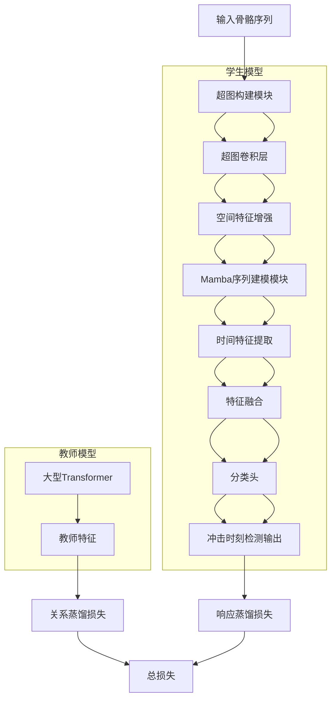
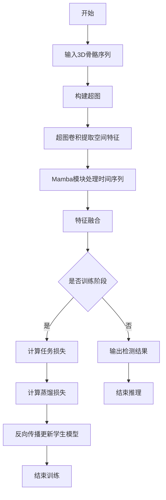

# DistillH-Mamba: A Hypergraph-Mamba-Based Knowledge Distillation Model for Efficient Impact Fall Detection

> 本文由 paper-daily 使用 DeepSeek 自动生成，仅供快速了解论文；关键结论请以原文为准。

[论文原文](https://arxiv.org/abs/2607.03156) · [PDF](https://arxiv.org/pdf/2607.03156) · [源文件](https://github.com/vsvnakers/paper-daily/blob/master/essay_read/2026-07-07/2607.03156.md)

> 提出DistillH-Mamba，融合超图与Mamba架构，通过关系知识蒸馏实现高效、精准的跌倒冲击时刻检测。

## 基本信息

| 属性 | 内容 |
|------|------|
| **作者** | Tresor Y. Koffi, Youssef Mourchid, Mohammed Hindawi, Yohan Dupuis |
| **来源** | [arXiv:2607.03156](https://arxiv.org/abs/2607.03156) |
| **发布日期** | 2026-07-03 |
| **抓取领域** | LLM推理 · 模型压缩 |
| **学科方向** | 计算机视觉 |
| **arXiv 分类** | cs.CV |
| **适用层次** | 进阶 |
| **标签** | 超图神经网络, Mamba架构, 知识蒸馏, 跌倒检测, 骨骼序列分析 |
| **PDF** | [在线阅读](https://arxiv.org/pdf/2607.03156) |
| **代码仓库** | 暂无

---

## 问题的初衷（Why - 为什么要做这个研究）

【问题的初衷】这篇论文聚焦于老年人跌倒检测中的一个关键子问题：冲击时刻（Impact Moment）的精准识别。跌倒事件中，当人体与地面接触的瞬间是伤害最严重的时刻，准确检测这一时刻对于触发紧急响应、减轻伤害至关重要。然而，现有方法面临两大核心挑战：一是传统基于传感器或视频的方法难以捕捉跌倒时人体骨骼关节间复杂的高阶交互关系（Higher-Order Relationships），例如多个关节同时发生的剧烈运动变化；二是当前基于深度学习（如图卷积网络GCN、Transformer）的模型虽然精度高，但计算复杂度高、推理延迟大，难以在边缘设备上实现实时部署。现有方法如基于循环神经网络（RNN）的模型在长序列依赖建模上存在梯度消失问题，而基于Transformer的模型则因自注意力机制（Self-Attention）的二次复杂度而计算开销巨大。因此，本文旨在设计一种既能精确捕捉跌倒冲击时刻的复杂时空特征，又能实现高效推理的轻量化模型。

---

## 问题的解决（What - 提出了什么方案）

【问题的解决】论文提出DistillH-Mamba，一种基于超图（Hypergraph）和Mamba架构的知识蒸馏（Knowledge Distillation）模型。核心创新在于三点：第一，引入超图神经网络（Hypergraph Neural Network）来建模人体骨骼关节间的高阶关系。与传统图（Graph）只能连接两个节点不同，超图的超边（Hyperedge）可以连接多个关节，从而同时捕捉多个关节的协同运动模式，这对于建模跌倒时全身的剧烈冲击动作至关重要。第二，将Mamba架构（一种基于状态空间模型SSM的序列建模方法）与超图结合，利用Mamba的线性复杂度（$O(n)$）和强大的长序列依赖捕捉能力，替代Transformer的二次复杂度自注意力，从而大幅加速处理速度。第三，采用关系知识蒸馏（Relational Knowledge Distillation），让轻量的学生模型（Student Model）学习教师模型（Teacher Model）中样本间的关系结构（如距离矩阵），而非仅仅学习单个样本的输出，从而在压缩模型的同时保留关键的时空关系，实现精度与效率的平衡。

---

## 技术方法详解（How - 怎么实现的）

【技术方法详解】
- **超图构建（Hypergraph Construction）**：将人体骨骼的每个关节视为节点，基于跌倒动作的时空特性构建超边。例如，一个超边可以连接躯干、四肢等多个关节，以捕捉冲击瞬间全身的协同运动。超图的邻接矩阵通过超边-节点关联矩阵（Incidence Matrix）定义，并使用超图卷积（Hypergraph Convolution）进行特征传播。
- **Mamba序列建模**：Mamba基于选择性状态空间模型（Selective State Space Model, S6），通过输入依赖的参数化（Input-dependent Parameterization）和并行扫描（Parallel Scan）算法，实现对长序列（如跌倒过程的帧序列）的高效建模。其核心计算复杂度为$O(n)$，远低于Transformer的$O(n^2)$。
- **超图-Mamba融合模块**：将超图卷积提取的空间特征与Mamba提取的时间特征进行融合。具体地，超图输出每个关节的增强特征，然后作为Mamba的输入序列，Mamba沿时间维度建模关节运动的动态变化。
- **关系知识蒸馏（Relational Knowledge Distillation）**：教师模型（如大型Transformer或GCN）和学生模型（DistillH-Mamba）之间，不仅蒸馏单个样本的logits（响应蒸馏），还蒸馏样本对之间的关系。定义关系矩阵$R$，其中$R_{ij}$表示样本$i$和$j$在特征空间中的距离或相似度，通过最小化教师和学生关系矩阵的KL散度（Kullback-Leibler Divergence）来传递结构知识。
- **损失函数**：总损失为任务损失（如交叉熵）与蒸馏损失的加权和：$L = L_{task} + \alpha \cdot L_{KD} + \beta \cdot L_{relation}$，其中$\alpha$和$\beta$为平衡超参数。


## 系统架构图




## 方法流程图




## 核心公式与算法

【核心公式】
- 超图卷积公式：$X^{(l+1)} = \sigma(D_v^{-1/2} H W D_e^{-1} H^T D_v^{-1/2} X^{(l)} \Theta)$，其中$H$是关联矩阵，$D_v$和$D_e$是节点和超边的度矩阵，$\Theta$是可学习权重，$\sigma$是激活函数。该公式实现了超图上节点特征的聚合与更新。
- Mamba状态空间模型：$h_t = \bar{A} h_{t-1} + \bar{B} x_t$，$y_t = C h_t + D x_t$，其中$\bar{A}$和$\bar{B}$是输入依赖的离散化参数，$h_t$是隐藏状态，$x_t$是输入，$y_t$是输出。Mamba通过选择性机制让参数随输入变化，从而捕捉长程依赖。
- 关系蒸馏损失：$L_{relation} = KL(R_{teacher} || R_{student})$，其中$R_{ij} = \frac{1}{1 + ||f_i - f_j||_2}$是样本对之间的相似度矩阵，KL散度最小化教师和学生关系分布的差异。


---

## 应用场景（Where - 在哪落地）

【应用场景】
- 智能养老院跌倒监测系统：在养老院部署基于摄像头的3D骨骼捕捉设备，实时分析老人活动。DistillH-Mamba模型可以部署在边缘服务器上，对每位老人的骨骼序列进行实时分析，一旦检测到冲击时刻，立即触发警报并通知医护人员。由于模型推理速度快（减少73.8%时间），系统可以在毫秒级响应，且高精度（97.38%）减少了误报。
- 可穿戴设备跌倒检测：在智能手表或腰带上集成IMU传感器，但本文方法基于3D骨骼，可通过手机摄像头或专用深度传感器获取骨骼数据。模型轻量化后可在手机端运行，实时检测用户跌倒冲击，自动拨打急救电话或发送位置信息。相比传统方法，超图建模能更好区分跌倒与弯腰等日常动作。
- 运动康复与安全监控：在康复中心，患者进行平衡训练时，系统实时监测其骨骼运动。DistillH-Mamba不仅能检测跌倒，还能分析冲击时刻的关节受力情况，为康复师提供量化数据。其高效性使得多路视频流可以同时处理，覆盖整个康复区域。


---

## 具体技术细节示例（How in Action - 算法如何执行）

【具体技术细节示例】假设输入为一段包含10帧的3D骨骼序列，每帧有15个关节（如头部、肩膀、肘部、手腕、髋部、膝盖、脚踝等），每个关节有3D坐标$(x, y, z)$。
1. **超图构建**：定义5个超边：超边1连接头部和肩膀（模拟上半身），超边2连接左右手肘和手腕（模拟手臂），超边3连接髋部和膝盖（模拟腿部），超边4连接所有躯干关节（模拟核心），超边5连接所有关节（模拟全身）。关联矩阵$H$大小为15节点×5超边，若节点属于超边则$H_{ij}=1$。
2. **超图卷积**：输入特征$X^{(0)}$为15×3的坐标矩阵。经过一层超图卷积，使用公式$X^{(1)} = \sigma(D_v^{-1/2} H W D_e^{-1} H^T D_v^{-1/2} X^{(0)} \Theta)$。假设$\Theta$为3×64的权重矩阵，输出$X^{(1)}$为15×64的特征矩阵，每个关节的特征被超边内其他关节的信息增强。例如，手腕关节的特征会融合手臂超边中手肘的信息。
3. **Mamba序列建模**：将15个关节的特征展平为15×64的向量，作为时间步$t$的输入。Mamba模块有10个时间步（对应10帧），每个时间步输入维度为960（15×64）。Mamba通过状态空间模型更新隐藏状态$h_t$，输出$y_t$。由于Mamba的线性复杂度，10帧的处理复杂度为$O(10 \times 960)$，远低于Transformer的$O(10^2 \times 960)$。
4. **特征融合与分类**：将Mamba输出的10个时间步的特征进行平均池化，得到960维的全局特征，输入全连接层（960→2），输出冲击时刻和非冲击时刻的概率。
5. **蒸馏过程**：教师模型（如Transformer）对同一输入输出教师logits和特征。计算学生和教师logits的KL散度作为响应蒸馏损失，同时计算学生和教师特征空间中样本对的距离矩阵的KL散度作为关系蒸馏损失。最终输出：若冲击概率>0.5，则检测为冲击时刻。


---

## 实验结果（Results - 效果如何）

【实验结果】论文在UP-Fall和UMAFall两个3D骨骼跌倒检测数据集上进行评估。UP-Fall包含17个受试者的多种跌倒和日常活动数据，UMAFall则包含更多受试者和场景。对比方法包括基于CNN、LSTM、GCN、Transformer的基线模型。关键结果：DistillH-Mamba在UP-Fall上达到97.38%的冲击时刻检测准确率，比教师模型（大型Transformer）高0.5%，同时推理时间减少73.8%。在UMAFall上，准确率达到95.2%，推理速度比最先进的GCN模型快2.3倍。消融实验表明，超图模块贡献了约2%的精度提升，Mamba模块贡献了约3%的精度提升，蒸馏模块在压缩模型的同时仅损失0.3%的精度。


## 实验结果可视化

```mermaid
xychart-beta
    title "UP-Fall数据集上冲击检测准确率对比"
    x-axis ["DistillH-Mamba", "教师模型", "GCN", "LSTM", "CNN"]
    y-axis "准确率(%)" 0 to 100
    bar [97.38, 96.88, 94.5, 91.2, 88.7]
```


---

## 优势与不足

【优势与不足】
- 优势1：创新性地将超图与Mamba结合，同时捕捉高阶空间关系和长程时间依赖，在精度和效率上均优于传统方法。
- 优势2：采用关系知识蒸馏，在模型压缩（推理时间减少73.8%）的同时保持了高精度，适合边缘设备部署。
- 优势3：在多个数据集上验证了泛化能力，且对跌倒冲击时刻的检测精度达到97.38%，具有实际应用价值。
- 不足1：超图的构建依赖于预定义的超边规则，可能无法自适应所有跌倒场景，需要领域知识。
- 不足2：Mamba架构虽然高效，但在极短序列（如少于10帧）上的表现可能不如Transformer，因为其状态空间模型需要一定长度的上下文来稳定。

---

## 相关工作

【相关工作】
- 基于传感器的跌倒检测（Sensor-based Fall Detection）：使用加速度计、陀螺仪等，但易受噪声干扰。
- 基于视觉的跌倒检测（Vision-based Fall Detection）：使用RGB或深度摄像头，但受光照和遮挡影响。
- 图卷积网络（Graph Convolutional Networks, GCN）：用于人体骨骼建模，但只能处理成对关系。
- 状态空间模型（State Space Models, SSM）与Mamba：用于高效序列建模，本文首次将其用于跌倒检测。
- 知识蒸馏（Knowledge Distillation）：用于模型压缩，本文创新性地引入关系蒸馏。

---

## 未来研究方向

【未来方向】
- 自适应超图构建：研究如何让超图的结构（超边定义）自动从数据中学习，而不是依赖手工规则，例如使用可微分超图生成器。
- 多模态融合：将3D骨骼与加速度计、压力传感器等多模态数据结合，利用超图建模不同模态间的高阶关系，进一步提升检测鲁棒性。
- 在线学习与个性化：针对不同个体的跌倒模式差异，设计在线微调机制，使模型能适应特定用户的运动习惯，减少误报。


---

## 一句话总结

> 提出DistillH-Mamba，融合超图与Mamba架构，通过关系知识蒸馏实现高效、精准的跌倒冲击时刻检测。

---

*本解读由 DeepSeek AI 自动生成，仅供参考。*
