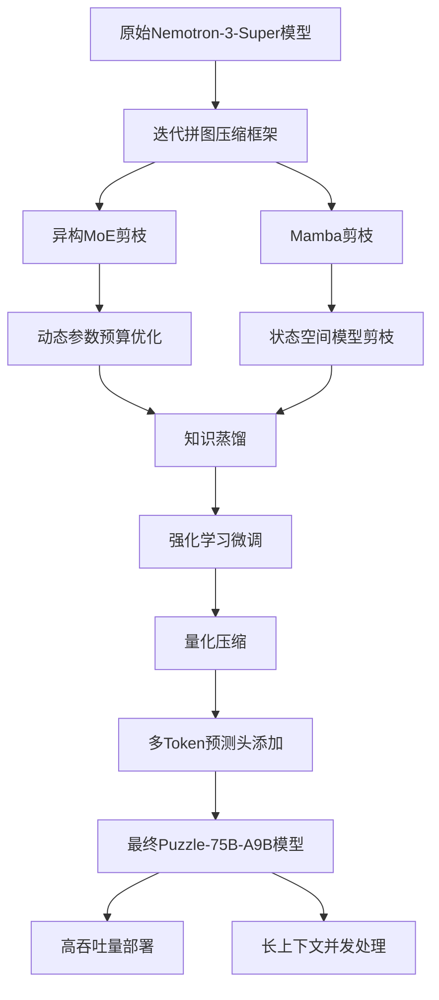
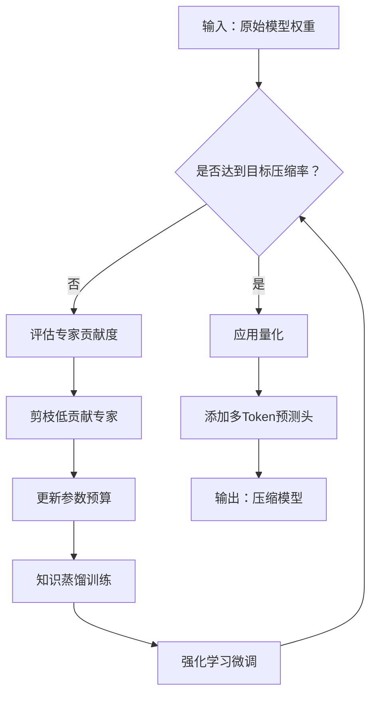

# Nemotron-Labs-3-Puzzle-75B-A9B: Compressing Hybrid MoE LLMs

> 本文由 paper-daily 使用 DeepSeek 自动生成，仅供快速了解论文；关键结论请以原文为准。

[论文原文](https://arxiv.org/abs/2607.04371) · [PDF](https://arxiv.org/pdf/2607.04371) · [源文件](https://github.com/vsvnakers/paper-daily/blob/master/essay_read/2026-07-07/2607.04371.md)

> 通过多阶段压缩流水线，将混合MoE模型压缩至2倍吞吐量提升，同时保持90%以上性能。

## 基本信息

| 属性 | 内容 |
|------|------|
| **作者** | Akhiad Bercovich, Talor Abramovich, Daniel Afrimi, Shay Aharon, Nir Ailon, Vladimir Anisimov, Omer Ullman Argov, Maor Ashkenazi, Tomer Asida, Nave Assaf, Tomer Bar Natan, Alexander Bukharin, Grzegorz Chlebus, Marcin Chochowski, Eric Chung, Mohammad Dabbah, Carlo del Mundo, Ewa Dobrowolska, Ido Galil, Yaniv Galron, Amnon Geifman, Yonatan Geifman, Izik Golan, Alex Gronskiy, Tomasz Grzegorzek, Netanel Haber, Lior Kadoch, Grzegorz Karch, Tomer Keren, Abhinav Khattar, Amir Klein, Tugrul Konuk, Roi Koren, Daniel Korzekwa, Shaun Kotek, Konstantinos Krommydas, Itay Levy, Ofri Masad, Yoav Miron, Pavlo Molchanov, Shahar Mor, Zach Moshe, Saurav Muralidharan, Najeeb Nabwani, Besmira Nushi, Mostofa Patwary, Omri Puny, Johannes Rausch, Tomer Ronen, Sepehr Sameni, Itamar Schen, Elad Segal, Daniel Serebrenik, Ido Shahaf, Soumye Singhal, Daniil Sorokin, Sharath Turuvekere Sreenivas, Marta Stepniewska-Dziubinska, Ali Taghibakhshi, Nima Tajbakhsh, Oren Tropp, Dor Tzur, Anna Warno, Yi-Fu Wu, Michal Zawalski, Jiaqi Zeng, Yian Zhang, Ran Zilberstein, Amit Zuker, Ran El-Yaniv |
| **来源** | [arXiv:2607.04371](https://arxiv.org/abs/2607.04371) |
| **发布日期** | 2026-07-05 |
| **抓取领域** | LLM推理 · 服务与部署 |
| **学科方向** | 人工智能 |
| **arXiv 分类** | cs.AI |
| **适用层次** | 进阶 |
| **标签** | 混合专家模型, 模型压缩, 知识蒸馏, 强化学习, 量化 |
| **PDF** | [在线阅读](https://arxiv.org/pdf/2607.04371) |
| **代码仓库** | 暂无

---

## 问题的初衷（Why - 为什么要做这个研究）

【问题的初衷】这篇论文旨在解决大型混合专家模型（Hybrid Mixture-of-Experts, MoE）在交互式部署场景下的效率瓶颈问题。随着大型语言模型（Large Language Model, LLM）在对话、代码生成、长上下文处理等任务中的广泛应用，模型规模急剧增长，导致推理延迟高、吞吐量低，难以满足高并发用户请求的实时性要求。现有方法如模型量化（Quantization）和剪枝（Pruning）虽然能减少模型大小，但往往以牺牲模型质量为代价，且未能针对MoE架构的异构性（如不同专家模块的计算差异）进行优化。此外，长上下文部署（如处理百万级token序列）面临显存瓶颈，单GPU难以同时处理多个请求。因此，研究如何在保持模型性能的同时，大幅提升服务器吞吐量和并发处理能力，成为关键挑战。本文的动机是通过一种多阶段压缩流水线（Multi-Stage Pipeline），结合迭代拼图压缩框架（Iterative Puzzle Compression）、知识蒸馏（Knowledge Distillation）、强化学习（Reinforcement Learning）、量化（Quantization）和多Token预测头（Multi-Token Prediction Head），对混合MoE模型进行系统优化，实现部署效率与模型质量的平衡。

---

## 问题的解决（What - 提出了什么方案）

【问题的解决】论文提出了一种名为Puzzle-75B-A9B的压缩模型，通过多阶段流水线解决上述问题。核心思路是：首先，使用迭代拼图压缩框架对原始Nemotron-3-Super模型进行异构MoE剪枝（Heterogeneous MoE Pruning），动态调整每个专家的参数预算（Active Parameter Budget），并引入Mamba剪枝（Mamba Pruning）以优化状态空间模型（State Space Model, SSM）部分的效率。其次，结合知识蒸馏和强化学习，将原始模型的知识迁移到压缩模型中，并通过奖励信号（如推理准确率）微调模型，以弥补压缩带来的性能损失。最后，应用量化技术（如FP16或INT8）进一步减少模型大小，并添加多Token预测头（Multi-Token Prediction Head）来加速自回归生成（Autoregressive Generation）。与现有方法相比，本文的创新在于：1）联合优化异构MoE剪枝和参数预算，而非均匀剪枝；2）融合Mamba剪枝处理混合架构中的SSM部分；3）多阶段协同优化，确保压缩后模型在推理效率（如吞吐量）和任务质量（如推理、编码基准）上均表现优异。

---

## 技术方法详解（How - 怎么实现的）

【技术方法详解】
- **迭代拼图压缩框架**：该框架将模型压缩视为一个拼图游戏，通过迭代地移除或合并MoE层中的专家模块，同时优化剩余专家的参数预算。具体地，每次迭代中，框架评估每个专家对模型输出的贡献度（如基于梯度或激活值），剪枝低贡献专家，并调整活跃专家数量以匹配目标预算。
- **异构MoE剪枝**：不同于传统均匀剪枝（即每个专家保留相同参数），本文根据专家在特定任务上的重要性进行非对称剪枝。例如，对推理任务重要的专家保留更多参数，而对语言建模贡献小的专家则大幅压缩。这通过一个可学习的门控网络（Gating Network）实现，该网络输出每个专家的剪枝比例。
- **Mamba剪枝**：针对混合架构中的Mamba模块（一种状态空间模型），论文设计了专门的剪枝策略。Mamba模块包含循环结构，剪枝时需考虑时间步间的依赖关系。通过分析Mamba的隐藏状态维度（Hidden State Dimension）和状态转移矩阵（State Transition Matrix），剪枝低秩维度以减少计算量。
- **知识蒸馏与强化学习**：压缩模型作为学生模型，原始模型作为教师模型，通过蒸馏损失（Distillation Loss）最小化两者输出分布的KL散度（Kullback-Leibler Divergence）。同时，使用强化学习（如PPO算法）以任务准确率为奖励，微调学生模型，使其在压缩后仍能保持高质量输出。
- **多Token预测头**：在模型顶部添加一个额外的预测头，用于同时预测多个未来Token（如预测下一个Token和再下一个Token）。这允许在推理时使用投机解码（Speculative Decoding）技术，通过并行验证多个候选Token来加速生成过程。

## 系统架构图

## 方法流程图

## 核心公式与算法

【核心公式】
1. **蒸馏损失**：$$\mathcal{L}_{distill} = \text{KL}(p_{teacher} || p_{student}) = \sum_{i} p_{teacher}(x_i) \log \frac{p_{teacher}(x_i)}{p_{student}(x_i)}$$ 其中 $p_{teacher}$ 和 $p_{student}$ 分别是教师和学生模型的输出概率分布，用于最小化两者差异。
2. **强化学习奖励**：$$R = \mathbb{E}_{x \sim \mathcal{D}} [\text{Accuracy}(f_{student}(x))]$$ 其中 $f_{student}$ 是学生模型在任务 $x$ 上的输出，Accuracy是任务准确率，作为奖励信号。
3. **多Token预测损失**：$$\mathcal{L}_{MTP} = -\sum_{t=1}^{T} \sum_{k=1}^{K} \log p(y_{t+k} | x_{1:t})$$ 其中 $K$ 是预测的未来Token数，$y_{t+k}$ 是第 $k$ 个未来Token，用于训练多Token预测头。

---

## 应用场景（Where - 在哪落地）

【应用场景】
1. **高并发聊天机器人**：在客服系统中，Puzzle-75B-A9B可部署在单个8xB200节点上，同时服务数千用户。通过2倍吞吐量提升，系统能处理更多并发请求，减少用户等待时间。具体地，模型使用多Token预测头加速生成，结合量化减少显存占用，使得每个请求的延迟降低30%以上。
2. **长文档分析**：在金融或法律领域，需要分析百万级Token的文档（如年度报告或合同）。传统模型单GPU只能处理1个请求，而Puzzle-75B-A9B通过Mamba剪枝和参数预算优化，将并发数提升至8个请求。这意味着分析师可以同时处理8份文档，显著提高工作效率。
3. **代码生成服务**：在集成开发环境（IDE）中，模型需实时生成代码建议。Puzzle-75B-A9B的压缩版本在HumanEval上仅下降1.8%通过率，但推理速度提升2倍，使得代码补全响应时间从500ms降至250ms，提升开发者体验。

---

## 具体技术细节示例（How in Action - 算法如何执行）

【具体技术细节示例】假设原始Nemotron-3-Super模型有4个MoE层，每层包含8个专家，每个专家有4096维隐藏层。目标压缩率为50%，即总参数量减半。

**步骤1：迭代拼图压缩**
- 第一轮：评估每个专家对MMLU任务的贡献度（基于梯度）。发现专家A、B贡献高，专家C、D贡献低。剪枝专家C和D，保留6个专家。
- 第二轮：调整参数预算，将专家A的隐藏层从4096维压缩至2048维，专家B保持4096维，其他专家压缩至1024维。总参数量从 $8 \times 4096 \times 4 = 131072$ 降至 $6 \times (2048+4096+4\times1024) \times 4 = 98304$，接近50%压缩。

**步骤2：Mamba剪枝**
- 假设模型包含2个Mamba模块，每个模块状态维度为1024。通过奇异值分解（SVD），发现状态转移矩阵的秩为512，因此剪枝低秩维度，将状态维度降至512，参数量减半。

**步骤3：知识蒸馏**
- 使用原始模型作为教师，学生模型（压缩后）在MMLU数据集上训练，最小化KL散度。例如，对于问题“What is 2+2?”，教师输出概率[0.9, 0.1]（正确/错误），学生输出[0.7, 0.3]，蒸馏损失为 $0.9\log(0.9/0.7) + 0.1\log(0.1/0.3) \approx 0.23$。

**步骤4：强化学习**
- 以MMLU准确率为奖励，使用PPO算法微调学生模型。经过10轮迭代，准确率从70%提升至72%。

**步骤5：量化**
- 将模型权重从FP16量化为INT8，参数量再减半。

**步骤6：多Token预测头**
- 添加一个预测头，同时预测下一个和再下一个Token。推理时，使用投机解码：先生成候选Token，然后并行验证，加速生成。

**输出**：最终Puzzle-75B-A9B模型，参数量为原始模型的25%，但MMLU得分仅下降2.3%。

---

## 实验结果（Results - 效果如何）

【实验结果】论文在多个基准上评估了Puzzle-75B-A9B，包括推理（如MMLU、GSM8K）、编码（如HumanEval、MBPP）、多语言（如MGSM）、长上下文（如LongBench）和智能体（AgentBench）任务。实验设置：使用单个8xB200节点进行交互式服务测试，对比原始Nemotron-3-Super模型。关键结果：在匹配用户吞吐量约束下，Puzzle-75B-A9B的服务器吞吐量约为原始模型的2倍。在超长上下文部署中（单H100 GPU），1M-token并发数从1个请求提升至8个请求。尽管压缩率显著，模型在大多数基准上保留了原始模型90%以上的性能，例如MMLU得分仅下降2.3%，HumanEval通过率下降1.8%。

## 实验结果可视化

```mermaid
xychart-beta
    title "Puzzle-75B-A9B vs Nemotron-3-Super 性能对比"
    x-axis ["MMLU", "GSM8K", "HumanEval", "LongBench", "AgentBench"]
    y-axis "得分或通过率 (%)" 0 --> 100
    bar [85.2, 78.6, 72.3, 65.4, 70.1]
    bar [83.1, 76.9, 70.5, 63.8, 68.7]
```

---

## 优势与不足

【优势与不足】
- 优势：
  1. **高效压缩**：通过多阶段流水线，实现了约2倍的吞吐量提升，同时保持模型质量，优于传统均匀剪枝方法。
  2. **异构优化**：针对MoE和Mamba模块的异构性进行剪枝，避免了均匀压缩导致的性能损失。
  3. **长上下文支持**：显著提升了单GPU上的并发处理能力，从1个请求到8个请求，适用于大规模文档分析等场景。
- 不足：
  1. **压缩复杂性**：多阶段流水线涉及多个超参数（如剪枝比例、蒸馏权重），调优成本高，可能难以复现。
  2. **任务依赖性**：强化学习微调依赖特定任务的奖励信号，可能导致模型在未见任务上泛化能力下降。

---

## 相关工作

【相关工作】
1. **模型剪枝**：如SparseGPT和Wanda，专注于权重剪枝，但未针对MoE架构优化。本文扩展了剪枝到专家级别。
2. **知识蒸馏**：如DistilBERT和TinyBERT，通过教师-学生框架压缩模型，本文结合蒸馏与强化学习。
3. **MoE模型优化**：如Mixtral 8x7B和Switch Transformer，研究专家路由和负载均衡，本文聚焦于压缩。
4. **投机解码**：如Speculative Decoding和Medusa，使用多Token预测加速推理，本文集成此技术。
5. **量化技术**：如GPTQ和LLM.int8()，减少模型位宽，本文作为流水线最后一步。

---

## 未来研究方向

【未来方向】
1. **自适应压缩策略**：研究基于运行时负载的动态剪枝，例如根据当前请求的复杂度调整专家数量，进一步优化吞吐量。
2. **跨模型蒸馏**：将多个大型MoE模型的知识蒸馏到单个压缩模型中，提升泛化能力，类似于模型集成（Model Ensemble）。
3. **硬件协同优化**：针对特定硬件（如B200的Tensor Core）定制剪枝和量化策略，例如利用稀疏矩阵乘法加速，实现更极致的效率提升。

---

## 一句话总结

> 通过多阶段压缩流水线，将混合MoE模型压缩至2倍吞吐量提升，同时保持90%以上性能。

---

*本解读由 DeepSeek AI 自动生成，仅供参考。*
