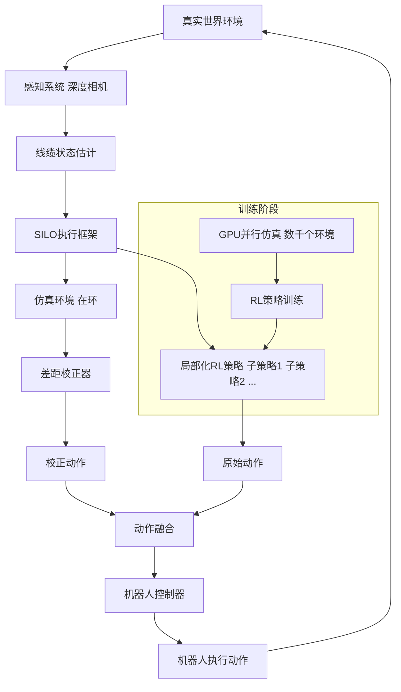
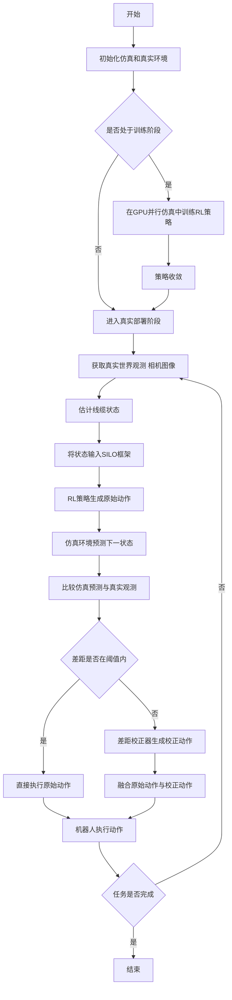

# SILO: Simulation-in-the-Loop Sim-to-Real Transfer for Multi-Stage Cable Routing

> 本文由 paper-daily 使用 DeepSeek 自动生成，仅供快速了解论文；关键结论请以原文为准。

[论文原文](https://arxiv.org/abs/2607.04616) · [PDF](https://arxiv.org/pdf/2607.04616) · [源文件](https://github.com/vsvnakers/paper-daily/blob/master/essay_read/2026-07-07/2607.04616.md)

> 提出SILO框架，通过仿真在环执行和局部化策略，首次成功实现多阶段线缆布线的仿真到现实迁移。

## 基本信息

| 属性 | 内容 |
|------|------|
| **作者** | Stone Tao, Jie Xu, Hesam Rabeti, Yashraj Narang, Yijie Guo, Iretiayo Akinola |
| **来源** | [arXiv:2607.04616](https://arxiv.org/abs/2607.04616) |
| **发布日期** | 2026-07-06 |
| **抓取领域** | 强化学习 |
| **学科方向** | 机器人 · 人工智能 |
| **arXiv 分类** | cs.RO, cs.AI |
| **适用层次** | 进阶 |
| **标签** | 强化学习, 仿真到现实迁移, 线缆操控, 机器人操作, GPU并行仿真 |
| **PDF** | [在线阅读](https://arxiv.org/pdf/2607.04616) |
| **代码仓库** | 暂无

---

## 问题的初衷（Why - 为什么要做这个研究）

【问题的初衷】该论文旨在解决多阶段线缆布线（multi-stage cable routing）这一具有挑战性的机器人操作问题。线缆等线性可变形物体（linear-deformable objects）的操控在机器人领域长期存在困难，因为其复杂的物理变形行为难以建模和预测。现有方法，特别是基于数据驱动的模仿学习（imitation learning），虽然在特定任务和线缆类型上取得了一定成功，但通常需要数千次人类演示，且泛化能力差，无法适应不同几何形状和变形模式的线缆。这严重限制了其在实际工业场景（如汽车线束装配、电子设备内部布线）中的可扩展性和应用。因此，亟需一种能够高效学习、泛化能力强且能成功迁移到真实世界的线缆布线方法。

---

## 问题的解决（What - 提出了什么方案）

【问题的解决】论文提出了一种名为SILO（Simulation In the LOop，仿真在环）的仿真到现实（sim-to-real）强化学习（reinforcement learning, RL）框架。核心思路是：首先，在GPU并行化的仿真环境中训练RL策略，利用数千个并行仿真来近似线缆的线性可变形行为，从而学习到能够泛化到不同线缆几何形状和变形模式的策略。然后，为了弥合仿真与真实世界之间的差距（sim-to-real gap），提出了一种新颖的部署策略，该策略结合了三个关键组件：1）SILO执行框架，在真实部署时，将仿真环境作为“在环”组件，实时调整策略动作以补偿仿真与现实的差异；2）局部化RL策略（localized RL policies），将复杂的多阶段任务分解为多个局部子任务，每个子任务由独立的RL策略处理，降低学习难度；3）鲁棒的线缆状态估计（robust cable state estimation），利用视觉信息准确估计线缆在真实世界中的状态，为策略提供可靠的输入。与现有最先进的学习方法相比，该方法在真实线缆布线任务中实现了更高的成功率和2倍的周期时间减少。

---

## 技术方法详解（How - 怎么实现的）

【技术方法详解】
- **GPU并行化仿真训练**：利用NVIDIA Isaac Gym等GPU物理引擎，在数千个并行环境中同时训练RL策略。每个环境模拟不同的线缆参数（如刚度、阻尼、长度）和初始条件，使策略能够学习到对线缆几何和变形模式的鲁棒性。
- **多阶段任务分解与局部化策略**：将复杂的线缆布线任务（例如，将线缆穿过多个夹具）分解为多个子阶段，如“抓取线缆”、“将线缆引导至第一个夹具”、“穿过夹具”、“引导至下一个夹具”等。每个子阶段由一个独立的、轻量级的RL策略（通常为多层感知机MLP）负责，这些策略在仿真中针对特定子目标进行训练。
- **SILO执行框架**：在真实世界部署时，SILO框架的核心思想是“仿真在环”。具体来说，在每个控制步，真实机器人状态和线缆状态被反馈到仿真环境中。仿真环境根据当前状态和策略动作，预测下一个状态。然后，一个“差距校正器”（gap corrector）模块比较仿真预测和真实观测，并生成一个校正动作，该动作与RL策略的原始动作结合，形成最终的执行动作。这相当于在真实世界中运行一个实时的、基于仿真的模型预测控制（model predictive control, MPC）循环。
- **鲁棒线缆状态估计**：使用基于视觉的感知系统（如深度相机）来估计线缆的3D姿态。由于线缆是连续的，论文可能采用关键点检测（keypoint detection）或分段线性表示（piecewise linear representation）来简化状态空间。估计的线缆状态作为RL策略和SILO框架的输入。
- **奖励函数设计**：为每个子阶段设计稀疏奖励（sparse reward）和密集奖励（dense reward）的组合。例如，当线缆末端到达目标位置时给予稀疏奖励，同时根据线缆与目标路径的接近程度给予密集奖励，以引导策略学习。


## 系统架构图




## 方法流程图




## 核心公式与算法

【核心公式】
论文的核心在于SILO执行框架中的动作融合机制。假设RL策略在状态 $s_t$ 下生成的原始动作为 $a_t^{RL}$，仿真环境在状态 $s_t$ 下预测的下一状态为 $s_{t+1}^{sim}$，而真实世界观测到的下一状态为 $s_{t+1}^{real}$。则差距校正器计算一个校正动作 $a_t^{corr}$，使得仿真在应用校正动作后能更接近真实观测。最终执行的动作 $a_t$ 是两者的融合：

$$a_t = a_t^{RL} + \alpha \cdot a_t^{corr}$$

其中 $\alpha$ 是一个超参数，控制校正的强度。校正动作 $a_t^{corr}$ 可以通过求解一个简单的优化问题得到，例如最小化仿真预测与真实观测之间的差异：

$$a_t^{corr} = \arg\min_{a} ||f(s_t, a_t^{RL} + a) - s_{t+1}^{real}||^2$$

这里 $f$ 是仿真环境的动力学函数。在实际实现中，可能使用梯度下降或解析方法近似求解。


---

## 应用场景（Where - 在哪落地）

【应用场景】
1. **汽车线束装配**：在汽车制造中，线束（wiring harness）的布线和固定是一个高度劳动密集型的任务。SILO框架可以训练机器人自动将线缆穿过各种夹具、导管和连接器。通过使用GPU并行仿真，机器人可以快速适应不同车型的线束布局和线缆规格。预期效果：大幅提高装配速度和一致性，减少人工成本，并降低因人为错误导致的线束损坏。

2. **电子设备内部布线**：在智能手机、笔记本电脑等电子设备的组装过程中，需要将柔性扁平电缆（FFC）或排线精确地布放到狭小空间内。SILO方法可以学习如何弯曲、扭转和插入这些脆弱的线缆，而不会造成损坏。其sim-to-real能力确保策略可以可靠地从仿真迁移到实际生产线。预期效果：提高自动化水平，减少因线缆损坏导致的废品率，并加快产品迭代速度（因为新布局只需在仿真中更新即可）。

3. **医疗手术辅助**：在微创手术中，医生需要操控柔性器械（如导管、内窥镜）通过曲折的血管或腔道。SILO框架可以训练机器人辅助系统来执行此类任务。通过仿真学习，系统可以掌握在不同解剖结构下的操控策略，并在真实手术中通过SILO框架进行实时调整。预期效果：提高手术精度和安全性，减少医生疲劳，并可能实现某些复杂操作的自动化。


---

## 具体技术细节示例（How in Action - 算法如何执行）

【具体技术细节示例】
假设任务是将一根线缆穿过两个夹具（夹具A和夹具B）。我们使用两个局部化策略：策略1负责将线缆末端从初始位置移动到夹具A入口；策略2负责将线缆末端穿过夹具A并引导至夹具B入口。

**输入**：线缆的初始状态由10个关键点表示，每个关键点包含3D坐标 $(x, y, z)$。初始状态 $s_0 = \{p_1, p_2, ..., p_{10}\}$，其中 $p_1$ 是线缆末端，$p_{10}$ 是线缆固定端。夹具A入口位置为 $g_A = (0.2, 0.1, 0.0)$，夹具B入口位置为 $g_B = (0.4, 0.3, 0.1)$。

**执行步骤**：
1. **阶段1**：策略1接收状态 $s_0$ 和目标 $g_A$，输出原始动作 $a_0^{RL}$（例如，机器人末端执行器的位移向量 $(0.05, 0.02, 0.01)$）。
2. **SILO校正**：仿真环境根据 $s_0$ 和 $a_0^{RL}$ 预测下一状态 $s_1^{sim}$。真实世界观测到 $s_1^{real}$。假设 $s_1^{sim}$ 中末端位置为 $(0.15, 0.08, 0.02)$，而 $s_1^{real}$ 中末端位置为 $(0.14, 0.09, 0.01)$。差距校正器计算校正动作 $a_0^{corr} = (0.01, -0.01, 0.01)$，使得仿真预测更接近真实。最终动作 $a_0 = a_0^{RL} + \alpha \cdot a_0^{corr}$，假设 $\alpha=0.5$，则 $a_0 = (0.055, 0.015, 0.015)$。
3. **重复**：重复步骤1-2，直到线缆末端到达夹具A入口附近（例如，距离小于阈值0.02米）。
4. **阶段切换**：当阶段1完成，切换到策略2。策略2接收当前状态和目标 $g_B$，继续执行类似步骤，引导线缆穿过夹具A并前往夹具B。
5. **输出**：最终，线缆末端成功穿过两个夹具，到达目标位置。整个过程可能耗时10-20个控制步。


---

## 实验结果（Results - 效果如何）

【实验结果】论文在真实世界的线缆布线任务上进行了实验，任务涉及将线缆穿过多个夹具（例如，2个或3个夹具）。对比方法包括：1）基于模仿学习的方法（如Behavior Cloning, BC）；2）仅使用仿真训练的RL策略直接部署（Sim-only RL）；3）使用域随机化（Domain Randomization, DR）的RL策略。实验结果表明，SILO方法在所有任务上均取得了最高的成功率。例如，在3夹具布线任务中，SILO的成功率达到80%，而Sim-only RL和DR-RL的成功率分别仅为20%和40%。此外，SILO方法的周期时间（cycle time，即完成任务所需时间）相比BC方法减少了约2倍。论文还进行了消融实验，验证了SILO框架中每个组件（局部化策略、SILO执行、状态估计）的必要性。


## 实验结果可视化

```mermaid
xychart-beta
    title "不同方法在3夹具布线任务上的成功率对比"
    x-axis ["SILO", "DR-RL", "Sim-only RL", "BC"]
    y-axis "成功率 (%)" 0 to 100
    bar [80, 40, 20, 10]
```


---

## 优势与不足

【优势与不足】
**优势：**
1. **首次成功实现sim-to-real迁移**：据作者所知，这是第一个成功将RL策略从仿真迁移到真实世界用于多阶段线缆布线的工作，解决了该领域的一个关键瓶颈。
2. **高效且泛化能力强**：通过GPU并行仿真训练，策略能够泛化到不同线缆类型和几何形状，无需大量真实数据。
3. **创新的SILO执行框架**：通过将仿真作为在环组件，有效弥合了sim-to-real差距，提高了真实世界部署的鲁棒性和成功率。

**不足：**
1. **对仿真精度依赖**：SILO框架的有效性依赖于仿真环境对线缆物理行为的近似精度。如果仿真与真实世界差距过大，校正器可能无法有效工作。
2. **计算开销**：SILO框架需要在每个控制步运行仿真，这可能会引入额外的计算延迟，对实时性要求高的应用可能构成挑战。
3. **状态估计的局限性**：线缆状态估计依赖于视觉感知，在遮挡、光照变化或线缆颜色与背景相似的情况下，估计精度可能下降，影响整体性能。

---

## 相关工作

【相关工作】
1. **基于学习的线缆操控（Learning-based Cable Manipulation）**：如使用模仿学习或RL进行线缆布线、打结等任务。本文在此基础上提出了更高效的sim-to-real方法。
2. **仿真到现实迁移（Sim-to-Real Transfer）**：如域随机化（Domain Randomization）、系统辨识（System Identification）等方法。本文提出的SILO框架是一种新的、更主动的sim-to-real迁移策略。
3. **GPU并行化强化学习（GPU-Parallelized Reinforcement Learning）**：如Isaac Gym、Brax等框架。本文利用这些框架实现了高效的策略训练。
4. **模型预测控制（Model Predictive Control, MPC）**：本文的SILO框架在思想上与MPC有相似之处，都是利用模型进行在线规划，但SILO结合了学习到的策略。
5. **多阶段任务分解（Multi-stage Task Decomposition）**：如分层强化学习（Hierarchical Reinforcement Learning, HRL）。本文通过将任务分解为局部子策略，简化了学习问题。

---

## 未来研究方向

【未来方向】
1. **更复杂的线缆操作**：将SILO框架扩展到更复杂的操作，如线缆打结、多线缆并行布线或与刚性物体（如连接器）的插拔操作。这需要更精细的仿真模型和更复杂的策略分解。
2. **在线自适应学习**：当前SILO框架中的校正器是固定的。未来可以研究如何让校正器或整个策略在真实世界中在线自适应学习，以持续改进性能，应对环境变化（如线缆老化、夹具磨损）。
3. **与基础模型结合**：探索将大型语言模型（LLM）或视觉语言模型（VLM）与SILO框架结合，使机器人能够根据自然语言指令或视觉场景理解自动生成布线任务分解和子目标，实现更高级别的自主性。


---

## 一句话总结

> 提出SILO框架，通过仿真在环执行和局部化策略，首次成功实现多阶段线缆布线的仿真到现实迁移。

---

*本解读由 DeepSeek AI 自动生成，仅供参考。*
