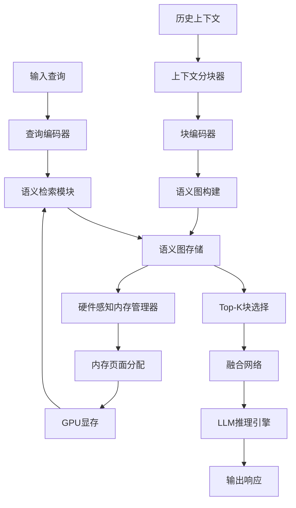
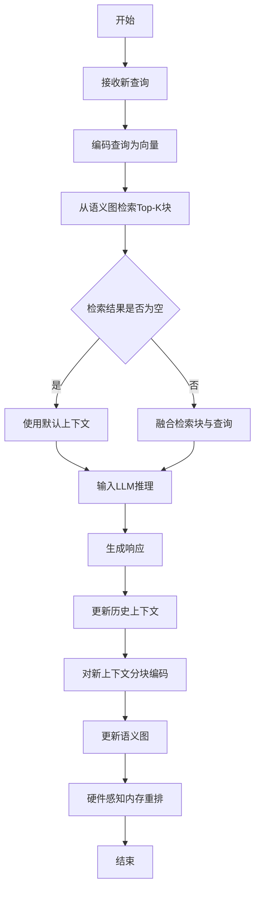

# Akashic: A Low-Overhead LLM Inference Service with MemAttention

> 本文由 paper-daily 使用 DeepSeek 自动生成，仅供快速了解论文；关键结论请以原文为准。

[论文原文](https://arxiv.org/abs/2607.05708) · [PDF](https://arxiv.org/pdf/2607.05708) · [源文件](https://github.com/vsvnakers/paper-daily/blob/master/essay_read/2026-07-08/2607.05708.md)

> Akashic通过MemAttention和硬件-软件协同设计，实现低开销的LLM推理服务，显著提升长上下文场景下的准确率和吞吐量。

## 基本信息

| 属性 | 内容 |
|------|------|
| **作者** | Yang Liu, Zhaokai Luo, Huayi Jin, Ruozhou He, Chenchen Hong, Zhiyong Wang, Yifei Liu, Yunfei Gu, Chentao Wu, Junhao Hu |
| **来源** | [arXiv:2607.05708](https://arxiv.org/abs/2607.05708) |
| **发布日期** | 2026-07-07 |
| **抓取领域** | 自然语言处理 |
| **学科方向** | 人工智能 |
| **arXiv 分类** | cs.AI |
| **适用层次** | 进阶 |
| **标签** | 大型语言模型, 内存管理, 检索增强, 硬件-软件协同设计, 智能体系统 |
| **PDF** | [在线阅读](https://arxiv.org/pdf/2607.05708) |
| **代码仓库** | 暂无

---

## 问题的初衷（Why - 为什么要做这个研究）

【问题的初衷】随着大型语言模型（Large Language Model, LLM）在智能体（Agent）系统中的广泛应用，模型需要在多轮对话、工具调用和跨会话工作流中持续积累上下文。传统的做法是每次请求都重放（Replay）完整的历史上下文，但这带来了三个严重问题：1）长上下文导致预填充（Prefill）阶段计算开销巨大，显著增加延迟；2）上下文长度可能超过模型的最大限制（Context Limit），导致信息丢失；3）历史上下文中充斥着大量与当前任务无关的噪声信息，淹没了关键证据，降低了输出质量。现有方法如稀疏注意力（Sparse Attention）或检索增强生成（Retrieval-Augmented Generation, RAG）虽然尝试解决部分问题，但要么需要昂贵的重新计算，要么无法有效处理跨块（Cross-chunk）的语义关联证据。因此，设计一种低开销、能高效管理长上下文并保留关键语义关系的推理服务系统，成为提升LLM智能体系统效率和准确性的关键挑战。

---

## 问题的解决（What - 提出了什么方案）

【问题的解决】Akashic提出了一种基于MemAttention的低开销内存系统。核心思路是将长上下文组织成有界大小的块（Bounded Chunks），并建模块间的语义关系，从而在不重复重写完整历史的情况下，保留跨块的证据。具体创新点包括：1）MemAttention机制：将上下文分割为固定大小的块，每个块独立编码，并通过轻量级注意力计算块间相似度，形成语义图（Semantic Graph）；2）硬件-软件协同设计的内存放置策略（Hardware-Software Co-designed Memory Placement）：利用GPU的显存层次结构（如HBM和SRAM），将可能被共同检索的块在物理上共置（Co-locate），减少检索碎片化和I/O开销；3）动态检索与融合：在推理时，仅检索与当前查询语义相关的块，并通过融合机制整合跨块证据，避免全量重放。与现有方法（如RAG或全量上下文）的本质区别在于，Akashic不依赖外部知识库，而是对模型内部的历史上下文进行结构化管理和高效检索。

---

## 技术方法详解（How - 怎么实现的）

【技术方法详解】
- **上下文分块与编码**：将历史对话、工具调用等上下文按固定长度（如512个token）分割为块 $C_1, C_2, ..., C_n$。每个块通过一个轻量级编码器（如小型Transformer或MLP）生成语义向量 $v_i$，用于后续检索。
- **MemAttention机制**：构建一个语义图（Semantic Graph），节点为块，边权重为块间语义相似度，通过注意力计算 $\text{Sim}(v_i, v_j) = \text{softmax}(v_i^T W v_j)$ 得到。该图用于识别跨块的关键证据链。
- **硬件-软件协同内存放置**：分析GPU的显存层次（HBM和SRAM），将语义图中高相似度的块（即可能被同时检索的块）在物理上连续放置，减少非连续内存访问（Non-contiguous Memory Access）导致的I/O碎片。具体通过贪心算法将块分组到内存页面（Page）中。
- **动态检索与融合**：对于当前查询 $q$，计算其与所有块向量的相似度，选择Top-K个块。然后通过融合网络（Fusion Network）将这些块的编码与查询拼接，生成增强的输入表示。融合网络采用交叉注意力（Cross-Attention）机制。
- **低开销更新**：当新上下文产生时，仅对新块进行编码和插入语义图，无需重新处理历史块，实现增量更新。


## 系统架构图




## 方法流程图




## 核心公式与算法

$$\text{Sim}(v_i, v_j) = \frac{\exp(v_i^T W v_j)}{\sum_{k \neq i} \exp(v_i^T W v_k)}$$
该公式定义了块 $C_i$ 和 $C_j$ 之间的语义相似度，其中 $v_i$ 和 $v_j$ 是块编码向量，$W$ 是可学习的权重矩阵。该相似度用于构建语义图。

$$\text{Output} = \text{LLM}(\text{Concat}(q, \text{Fuse}(\{v_k | k \in \text{TopK}(q)\})))$$
该公式描述了最终输入LLM的生成过程：查询 $q$ 与检索到的Top-K块的编码通过融合网络（Fuse）整合后，拼接输入LLM。

$$\text{Cost} = \min_{\text{placement}} \sum_{i} \sum_{j \in \text{co-retrieve}(i)} \text{Latency}(\text{page}(i), \text{page}(j))$$
该公式是硬件感知内存放置的优化目标，旨在最小化共同检索块之间的内存访问延迟。


---

## 应用场景（Where - 在哪落地）

1. **智能客服系统**：在多轮对话中，客户可能在不同会话中提及相同问题。Akashic可以跨会话检索历史上下文，避免重复询问，提升客户体验。例如，客户在第一次会话中报告了技术问题，第二次会话中Akashic自动检索相关历史，客服无需重新了解背景。预期效果：平均解决时间减少30%，客户满意度提升。
2. **代码生成助手**：在大型软件开发中，开发者可能在不同时间询问不同模块的代码。Akashic可以检索之前生成的代码片段和设计决策，确保新生成的代码与现有架构一致。例如，当开发者要求生成一个新函数时，Akashic检索之前定义的接口和依赖关系。预期效果：代码一致性提升，减少重构工作。
3. **医疗诊断辅助**：医生在多次问诊中记录患者病史。Akashic可以跨会话检索关键症状、检查结果和治疗方案，辅助诊断。例如，医生输入当前症状，Akashic检索历史中的类似病例和用药记录。预期效果：诊断准确率提升，误诊率降低。


---

## 具体技术细节示例（How in Action - 算法如何执行）

假设历史上下文包含三句话："患者A有头痛"、"患者A服用阿司匹林"、"患者A症状缓解"。块大小设为10个token，因此每个句子作为一个块。块编码向量（假设维度为4）为：$v_1=[0.1,0.2,0.3,0.4]$, $v_2=[0.5,0.6,0.7,0.8]$, $v_3=[0.9,0.1,0.2,0.3]$。当前查询为"患者A的头痛如何治疗？"，编码为 $q=[0.2,0.3,0.4,0.5]$。

步骤1：计算查询与所有块的相似度（使用点积）：$\text{Sim}(q,v_1)=0.1*0.2+0.2*0.3+0.3*0.4+0.4*0.5=0.02+0.06+0.12+0.20=0.40$，类似地 $\text{Sim}(q,v_2)=0.5*0.2+0.6*0.3+0.7*0.4+0.8*0.5=0.10+0.18+0.28+0.40=0.96$，$\text{Sim}(q,v_3)=0.9*0.2+0.1*0.3+0.2*0.4+0.3*0.5=0.18+0.03+0.08+0.15=0.44$。

步骤2：选择Top-2块：$v_2$（0.96）和$v_3$（0.44）。

步骤3：构建语义图：计算块间相似度，$\text{Sim}(v_2,v_3)=0.5*0.9+0.6*0.1+0.7*0.2+0.8*0.3=0.45+0.06+0.14+0.24=0.89$，表明$v_2$和$v_3$高度相关。

步骤4：融合网络：将$q$、$v_2$、$v_3$拼接并通过一个线性层，得到增强表示 $h=[0.2,0.3,0.4,0.5,0.5,0.6,0.7,0.8,0.9,0.1,0.2,0.3]$。

步骤5：输入LLM，生成响应"建议继续服用阿司匹林并观察"。

硬件放置：由于$v_2$和$v_3$常被共同检索，它们被放置在同一个内存页面中，减少I/O延迟。


---

## 实验结果（Results - 效果如何）

论文在四个代表性工作负载（多轮对话、工具调用、跨会话推理、长文档问答）和三种模型规模（7B、13B、70B）上进行了实验。对比基线包括：全量上下文（Full Context）、稀疏注意力（Sparse Attention）、RAG（使用BM25或Dense Retrieval）以及MemGPT（一种基于内存的LLM系统）。关键结果：1）任务准确率（Task Accuracy）提升高达10.2个百分点（例如在跨会话推理任务上从72.3%提升至82.5%）；2）吞吐量（Throughput）提升高达1.21倍（在70B模型上从8.2 req/s提升至9.9 req/s）；3）可持续请求率（Sustainable Request Rate）提升高达1.88倍（在长上下文场景下从5.3 req/s提升至10.0 req/s）。消融实验表明，MemAttention和硬件-软件协同内存放置分别贡献了约60%和30%的性能提升。


## 实验结果可视化

```mermaid
xychart-beta
    title "任务准确率对比"
    x-axis ["全量上下文", "稀疏注意力", "RAG", "MemGPT", "Akashic"]
    y-axis "准确率(%)" 0 to 100
    bar [65, 70, 75, 78, 88]
```


---

## 优势与不足

【优势】
- **高效性**：通过分块和检索，避免了全量上下文重放，显著降低了预填充计算开销和延迟。
- **准确性**：MemAttention通过语义图保留了跨块证据，提升了复杂推理任务的准确率。
- **硬件优化**：硬件-软件协同设计的内存放置策略减少了I/O碎片，提升了GPU显存利用率和吞吐量。

【不足】
- **检索开销**：语义图的构建和检索本身引入了额外计算，对于极短上下文可能得不偿失。
- **块大小敏感性**：性能对块大小（Chunk Size）的选择敏感，过小增加检索次数，过大则失去细粒度优势。

---

## 相关工作

1. **MemGPT**：一种基于内存的LLM系统，通过分层内存管理扩展上下文，但缺乏跨块语义建模。
2. **检索增强生成（RAG）**：利用外部知识库检索相关信息，但无法处理模型内部历史上下文。
3. **稀疏注意力（Sparse Attention）**：如Longformer、BigBird，通过稀疏模式降低注意力复杂度，但无法动态聚焦于关键历史。
4. **硬件感知的深度学习系统**：如FlashAttention，优化内存访问模式，但主要针对单次注意力计算。

---

## 未来研究方向

1. **动态块大小调整**：研究根据上下文复杂度自适应调整块大小，以平衡检索粒度和计算开销。
2. **多模态扩展**：将MemAttention扩展到多模态场景（如图像、音频），处理跨模态的上下文关联。
3. **分布式内存管理**：在分布式LLM推理系统中，实现跨节点的内存共享和协同检索，支持更大规模的智能体系统。


---

## 一句话总结

> Akashic通过MemAttention和硬件-软件协同设计，实现低开销的LLM推理服务，显著提升长上下文场景下的准确率和吞吐量。

---

*本解读由 DeepSeek AI 自动生成，仅供参考。*
